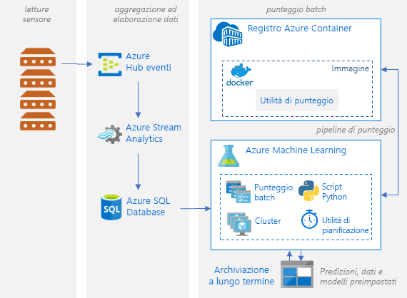

# Valutazione dei modelli di machine learning di Python in Azure batchBatch scoring of Python machine learning models on Azure

Questa architettura di riferimento illustra come creare una soluzione scalabile per l'assegnazione del punteggio in batch a molti modelli in base a una pianificazione in parallelo usando il servizio Azure Machine Learning.This reference architecture shows how to build a scalable solution for batch scoring many models on a schedule in parallel using Azure Machine Learning Service. La soluzione può essere usata come modello e supporta la generalizzazione per problemi diversi.The solution can be used as a template and can generalize to different problems.

Un'implementazione di riferimento per questa architettura è disponibile in [GitHub][github].A reference implementation for this architecture is available on [GitHub][github].

**Scenario**: Questa soluzione consente di monitorare il funzionamento di un numero elevato di dispositivi in uno scenario IoT in cui ogni dispositivo invia le letture dei sensori in modo continuo.**Scenario**: This solution monitors the operation of a large number of devices in an IoT setting where each device sends sensor readings continuously. Si presuppone che ogni dispositivo sia associato a modelli di rilevamento delle anomalie sottoposti precedentemente a training per prevedere se una serie di misurazioni, aggregate per un intervallo di tempo predefinito, corrispondono o meno a un'anomalia.Each device is assumed to be associated with pretrained anomaly detection models that need to be used to predict whether a series of measurements, that are aggregated over a predefined time interval, correspond to an anomaly or not. In scenari reali, potrebbe trattarsi di un flusso di letture di sensori che devono essere filtrate e aggregate prima di essere usate per operazioni di training o per l'assegnazione del punteggio in tempo reale.In real-world scenarios, this could be a stream of sensor readings that need to be filtered and aggregated before being used in training or real-time scoring. Per semplicità, la soluzione usa lo stesso file di dati durante l'esecuzione dei processi di assegnazione del punteggio.For simplicity, this solution uses the same data file when executing scoring jobs.

Questa architettura di riferimento è progettata per carichi di lavoro che vengono attivati in base a una pianificazione.This reference architecture is designed for workloads that are triggered on a schedule. L'elaborazione prevede i passaggi seguenti:Processing involves the following steps:

1. Inviare le letture dei sensori per l'inserimento in Hub eventi di Azure.Send sensor readings for ingestion to Azure Event Hubs.
2. Eseguire l'elaborazione dei flussi e archiviare i dati non elaborati.Perform stream processing and store the raw data.
3. Inviare i dati a un cluster di Machine Learning pronto a iniziare ad assumere lavoro.Send the data to a Machine Learning cluster that is ready to start taking work. Ogni nodo del cluster esegue un processo di assegnazione del punteggio per uno specifico sensore.Each node in the cluster runs a scoring job for a specific sensor. 
4. Eseguire la pipeline di assegnazione del punteggio, che esegue i processi in parallelo usando script Python di Machine Learning.Execute the scoring pipeline, which runs the scoring jobs in parallel using Machine Learning Python scripts. La pipeline viene creata, pubblicata ed eseguita in un intervallo di tempo predefinito e pianificato.The pipeline is created, published, and scheduled to run on a predefined interval of time.
5. Generare previsioni e archiviarle in archiviazione BLOB per un utilizzo successivo.Generate predictions and store them in Blob storage for later consumption.

## ArchitetturaArchitecture

L'architettura è costituita dai componenti seguenti:This architecture consists of the following components:

[Hub eventi di Azure][event-hubs].[Azure Event Hubs][event-hubs]. Questo servizio di inserimento dei messaggi può inserire milioni di messaggi di eventi al secondo.This message ingestion service can ingest millions of event messages per second. In questa architettura, i sensori inviano un flusso di dati all'hub eventi.In this architecture, sensors send a stream of data to the event hub.

[Analisi di flusso di Azure][stream-analytics].[Azure Stream Analytics][stream-analytics]. Un motore di elaborazione di eventi.An event-processing engine. Un processo di Analisi di flusso legge i flussi di dati dall'hub eventi ed esegue l'elaborazione dei flussi.A Stream Analytics job reads the data streams from the event hub and performs stream processing.

[Database SQL di Azure][sql-database].[Azure SQL Database][sql-database]. I dati ricavati dalle letture dei sensori vengono caricati nel database SQL.Data from the sensor readings is loaded into SQL Database. SQL è uno strumento familiare in cui archiviare i flussi di dati elaborati (che sono tabulari e strutturati), ma è possibile usare altri archivi dati.SQL is a familiar way to store the processed, streamed data (which is tabular and structured), but other data stores can be used.

[Servizio Azure Machine Learning][amls].[Azure Machine Learning Service][amls]. Machine Learning è un servizio cloud per il training, l'assegnazione di punteggi, la distribuzione e la gestione di modelli di Machine Learning su vasta scala.Machine Learning is a cloud service for training, scoring, deploying, and managing machine learning models at scale. Nel contesto dell'assegnazione di punteggi in batch, Machine Learning crea un cluster di macchine virtuali su richiesta con un'opzione di ridimensionamento automatico, in cui ogni nodo esegue un processo di assegnazione del punteggio per un sensore specifico.In the context of batch scoring, Machine Learning creates a cluster of virtual machines on demand with an automatic scaling option, where each node in the cluster runs a scoring job for a specific sensor. I processi di assegnazione del punteggio vengono eseguiti in parallelo con i passaggi dello script Python accodati e gestiti da Machine Learning.The scoring jobs are executed in parallel as Python-script steps that are queued and managed by Machine Learning. Questi passaggi fanno parte di una pipeline di Machine Learning che viene creata, distribuita ed eseguita in un intervallo di tempo predefinito e pianificato.These steps are part of a Machine Learning pipeline that is created, published, and scheduled to run on a predefined interval of time.

[Archiviazione BLOB di Azure][storage].[Azure Blob Storage][storage]. I contenitori BLOB vengono usati per archiviare i modelli già sottoposti a training, i dati e le stime di output.Blob containers are used to store the pretrained models, the data, and the output predictions. I modelli vengono caricati nell'archiviazione BLOB nel notebook [01_create_resources.ipynb][create-resources].The models are uploaded to Blob storage in the [01_create_resources.ipynb][create-resources] notebook. I modelli [one-class SVM][one-class-svm] vengono sottoposti a training su dati che rappresentano i valori di sensori diversi per diversi dispositivi.These [one-class SVM][one-class-svm] models are trained on data that represents values of different sensors for different devices. Questa soluzione presuppone che i valori dei dati vengano aggregati per un intervallo di tempo fisso.This solution assumes that the data values are aggregated over a fixed interval of time.

[Registro Azure Container][acr].[Azure Container Registry][acr]. Lo [script][pyscript] Python di assegnazione del punteggio viene eseguito in contenitori Docker che vengono creati in ogni nodo del cluster, in cui legge i dati del sensore pertinenti, genera previsioni e le archivia nell'archivio Blob.The scoring Python [script][pyscript] runs in Docker containers that are created on each node of the cluster, where it reads the relevant sensor data, generates predictions and stores them in Blob storage.

## Considerazioni sulle prestazioniPerformance considerations

Per i modelli Python standard, le CPU sono generalmente considerate sufficienti per gestire il carico di lavoro.For standard Python models, it's generally accepted that CPUs are sufficient to handle the workload. Questa architettura usa CPU.This architecture uses CPUs. Tuttavia, per [carichi di lavoro di apprendimento avanzato][deep], GPU in genere prestazioni CPU di una quantità considerevole &mdash; un cluster di numero di CPU in genere è necessaria per ottenere prestazioni analoghe.However, for [deep learning workloads][deep], GPUs generally outperform CPUs by a considerable amount &mdash; a sizeable cluster of CPUs is usually needed to get comparable performance.

### La parallelizzazione tra le macchine virtuali e coreParallelizing across VMs versus cores

Durante l'esecuzione dei processi di assegnazione del punteggio a molti modelli in modalità batch, i processi devono essere eseguiti in parallelo tra le macchine virtuali.When running scoring processes of many models in batch mode, the jobs need to be parallelized across VMs. Sono possibili due approcci:Two approaches are possible:

* Creare un cluster più grande con macchine virtuali a basso costo.Create a larger cluster using low-cost VMs.

* Creare un cluster più piccolo con macchine virtuali a prestazioni elevate con più core disponibili in ognuna.Create a smaller cluster using high performing VMs with more cores available on each.

In generale, l'assegnazione del punteggio a modelli di Python standard non è così impegnativa come l'assegnazione del punteggio a modelli di Deep Learning e un cluster piccolo dovrebbe deve essere in grado di gestire in modo efficiente un numero elevato di modelli in coda.In general, scoring of standard Python models is not as demanding as scoring of deep learning models, and a small cluster should be able to handle a large number of queued models efficiently. È possibile aumentare il numero di nodi del cluster man mano che aumentano le dimensioni dei set di dati.You can increase the number of cluster nodes as the dataset sizes increase.

Per motivi di praticità, in questo scenario viene inviata un'unica attività di assegnazione del punteggio all'interno di un singolo passaggio della pipeline di Machine Learning.For convenience in this scenario, one scoring task is submitted within a single Machine Learning pipeline step. Tuttavia, può essere più efficiente assegnare il punteggio a più blocchi di dati all'interno dello stesso passaggio della pipeline.However, it can be more efficient to score multiple data chunks within the same pipeline step. In questi casi, scrivere codice personalizzato per leggere in più set di dati ed eseguire lo script di assegnazione del punteggio per tali set durante l'esecuzione di un singolo passaggio.In those cases, write custom code to read in multiple datasets and execute the scoring script for those during a single-step execution.

## Considerazioni sulla gestioneManagement considerations

- **Monitoraggio dei processi**.**Monitor jobs**. È importante monitorare lo stato dei processi in esecuzione, ma può essere complesso eseguire il monitoraggio in un cluster di nodi attivi.It's important to monitor the progress of running jobs, but it can be a challenge to monitor across a cluster of active nodes. Per esaminare lo stato dei nodi del cluster, usare il [portale di Azure][portal] per gestire l'[area di lavoro di Machine Learning][ml-workspace].To inspect the state of the nodes in the cluster, use the [Azure Portal][portal] to manage the [machine learning workspace][ml-workspace]. Se un nodo è inattivo oppure un processo ha avuto esito negativo, i log degli errori vengono salvati nell'archiviazione BLOB e sono accessibili anche nella sezione Pipeline.If a node is inactive or a job has failed, the error logs are saved to blob storage, and are also accessible in the Pipelines section. Per un monitoraggio più completo, connettere i log ad [Application Insights][app-insights] o eseguire processi separati per il polling dello stato del cluster e dei relativi processi.For richer monitoring, connect logs to [Application Insights][app-insights], or run separate processes to poll for the state of the cluster and its jobs.
- **Registrazione**.**Logging**. Il servizio Machine Learning registra tutti i flussi StdOut/StdErr nell'account di archiviazione di Azure associato.Machine Learning Service logs all stdout/stderr to the associated Azure Storage account. Per semplificare la visualizzazione dei file di log, usare uno strumento di esplorazione dell'archiviazione, ad esempio [Azure Storage Explorer][explorer].To easily view the log files, use a storage navigation tool such as [Azure Storage Explorer][explorer].

## Considerazioni sul costoCost considerations

I componenti più onerosi usati in questa architettura di riferimento sono le risorse di calcolo.The most expensive components used in this reference architecture are the compute resources. Le dimensioni del cluster di calcolo possono aumentare o diminuire a seconda dei processi presenti nella coda.The compute cluster size scales up and down depending on the jobs in the queue. Abilitare il ridimensionamento automatico a livello di codice tramite l'SDK Python modificando la configurazione del provisioning del calcolo.Enable automatic scaling programmatically through the Python SDK by modifying the compute’s provisioning configuration. In alternativa, usare l'[interfaccia della riga di comando di Azure][cli] per impostare i parametri di ridimensionamento automatico del cluster.Or use the [Azure CLI][cli] to set the automatic scaling parameters of the cluster.

Per le operazioni che non richiedono un intervento immediato, configurare la formula di scalabilità automatica in modo che lo stato predefinito (minimo) sia rappresentato da un cluster con un numero di nodi pari a zero.For work that doesn't require immediate processing, configure the automatic scaling formula so the default state (minimum) is a cluster of zero nodes. Con questa configurazione, il cluster inizia con un numero di nodi pari a zero, per poi aumentare quando rileva processi nella coda.With this configuration, the cluster starts with zero nodes and only scales up when it detects jobs in the queue. Se il processo di assegnazione del punteggio in batch si verifica poche volte al giorno, questa impostazione consente di ottenere un risparmio significativo sui costi.If the batch scoring process happens only a few times a day or less, this setting enables significant cost savings.

La scalabilità automatica potrebbe non essere appropriata per i processi batch eseguiti a distanza troppo ravvicinata.Automatic scaling may not be appropriate for batch jobs that happen too close to each other. Anche il tempo necessario per avviare e interrompere un cluster comporta dei costi. Pertanto, se un carico di lavoro batch inizia solo pochi minuti dopo il termine del processo precedente, potrebbe essere più conveniente lasciare il cluster attivo tra i processi.The time that it takes for a cluster to spin up and spin down also incurs a cost, so if a batch workload begins only a few minutes after the previous job ends, it might be more cost effective to keep the cluster running between jobs. Ciò dipende dalla frequenza pianificata per l'esecuzione dei processi di assegnazione del punteggio, ovvero elevata (ad esempio, ogni ora) o meno frequente (ad esempio, una volta al mese).That depends on whether scoring processes are scheduled to run at a high frequency (every hour, for example), or less frequently (once a month, for example).

## DistribuzioneDeployment

Per distribuire questa architettura di riferimento, seguire la procedura descritta nel [repository GitHub][github].To deploy this reference architecture, follow the steps described in the [GitHub repo][github].

[acr]: /azure/container-registry/container-registry-intro
[ai]: /azure/application-insights/app-insights-overview
[aml-compute]: /azure/machine-learning/service/how-to-set-up-training-targets#amlcompute
[amls]: /azure/machine-learning/service/overview-what-is-azure-ml
[automatic-scaling]: /azure/batch/batch-automatic-scaling
[azure-files]: /azure/storage/files/storage-files-introduction
[cli]: /cli/azure
[create-resources]: https://github.com/Microsoft/AMLBatchScoringPipeline/blob/master/01_create_resources.ipynb
[deep]: /azure/architecture/reference-architectures/ai/batch-scoring-deep-learning
[event-hubs]: /azure/event-hubs/event-hubs-geo-dr
[explorer]: https://azure.microsoft.com/en-us/features/storage-explorer/
[github]: https://github.com/Microsoft/AMLBatchScoringPipeline
[one-class-svm]: http://scikit-learn.org/stable/modules/generated/sklearn.svm.OneClassSVM.html
[portal]: https://portal.azure.com
[ml-workspace]: /azure/machine-learning/studio/create-workspace
[python-script]: https://github.com/Azure/BatchAIAnomalyDetection/blob/master/batchai/predict.py
[pyscript]: https://github.com/Microsoft/AMLBatchScoringPipeline/blob/master/scripts/predict.py
[storage]: /azure/storage/blobs/storage-blobs-overview
[stream-analytics]: /azure/stream-analytics/
[sql-database]: /azure/sql-database/
[app-insights]: /azure/application-insights/app-insights-overview
