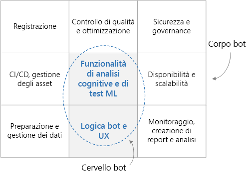

# Bot di conversazione di livello aziendale

Questa architettura di riferimento descrive come creare un bot di conversazione (chatbot) di livello aziendale con il [framework Azure Bot][bot-framework]. Ogni bot è differente, ma esistono alcuni modelli, flussi di lavoro e tecnologie comuni da considerare. Per i bot da usare come carichi di la voro aziendali, in particolare, è necessario valutare diversi aspetti della progettazione oltre alle semplici funzionalità di base. Questo articolo affronta la maggior parte degli aspetti essenziali della progettazione e presenta gli strumenti necessari per creare un bot affidabile, sicuro e con apprendimento attivo.

[![Diagramma dell'architettura][0]][0]

## Architettura

L'architettura mostrata in questo articolo si basa sui servizi di Azure seguenti. Il proprio bot potrebbe non usare tutti questi servizi oppure potrebbe incorporarne altre.

### Logica del bot ed esperienza utente

- **[Servizio Bot Framework ][bot-framework-service]** (BFS). Questo servizio connette il bot a un'app per le comunicazioni, come Cortana, Facebook Messenger o Slack. Facilita la comunicazione tra il bot e l'utente.
- **[Servizio app di Azure][app-service]**. La logica dell'applicazione del bot è ospitata nel Servizio app di Azure.

### Cognizione e intelligenza del bot

- **[Language Understanding][luis]** (LUIS). Parte di [Servizi cognitivi di Azure][cognitive-services], LUIS consente al bot di riconoscere il linguaggio naturale identificando finalità ed entità dell'utente.
- **[Ricerca di Azure][search]**. Ricerca è un servizio gestito che fornisce un indice del documento disponibile per la ricerca rapida.
- **[QnA Maker][qna-maker]**. QnA Maker è un servizio API basato sul cloud che crea un livello di domande e risposte simile a una conversazione sui dati. Solitamente, viene caricato contenuto semistrutturato come le domande frequenti. Usarlo per creare una knowledge base per rispondere a domande in linguaggio naturale.
- **[App Web][webapp]**. Se per il bot sono necessarie soluzioni di intelligenza artificiale non fornite da un servizio esistente, è possibile implementare una soluzione personalizzata e ospitarla come app Web. In questo modo si rende disponibile un endpoint Web che il bot potrà chiamare.

### Inserimento di dati

Il bot si basa su dati non elaborati che è necessario inserire e preparare. Per orchestrare questo processo, considerare una delle opzioni seguenti:

- **[Azure Data Factory][data-factory]**. Data Factory orchestra e automatizza lo spostamento e la trasformazione dei dati.
- **[App per la logica][logic-apps]**. App per la logica è una piattaforma serverless per la creazione di flussi di lavoro che integrano applicazioni, dati e servizi. Fornisce i connettori dei dati per molte applicazioni, tra cui Office 365.
- **[Funzioni di Azure][functions]**. È possibile usare Funzioni di Azure per scrivere codice serverless personalizzato che viene richiamato da un [trigger][functions-triggers], ad esempio ogni volta che un documento viene aggiunto in archiviazione BLOB o Cosmos DB.

### Registrazione e monitoraggio

- **[Application Insights][app-insights]**. Usare Application Insights per registrare le metriche dell'applicazione del bot a scopo di monitoraggio, diagnostica e analisi.
- **[Archiviazione BLOB di Azure][blob]**. L'archiviazione BLOB è ottimizzata per archiviare enormi quantità di dati non strutturati.
- **[Cosmos DB][cosmosdb]**. Cosmos DB è particolarmente indicato per l'archiviazione di dati di log semistrutturati come le conversazioni.
- **[Power BI][power-bi]**. Usare Power BI per creare i dashboard di monitoraggio per il bot.

### Sicurezza e governance

- **[Azure Active Directory][aad]** (Azure AD). Gli utenti verranno autenticati tramite un provider di identità come Azure AD. Il servizio Bot gestisce il flusso di autenticazione e i token OAuth. Vedere [Aggiungere l'autenticazione al bot tramite il servizio Azure Bot][bot-authentication].
- **[Azure Key Vault][key-vault]**. Usare Key Vault per archiviare credenziali e altri segreti.

### Controllo di qualità e ottimizzazioni

- **[Azure DevOps][devops]**. Fornisce molti servizi per la gestione delle app, tra cui controllo del codice sorgente, compilazione, test, distribuzione e verifica del progetto.
- **[VS Code][vscode]**. Un editor di codice leggero per lo sviluppo di app. È possibile usare qualsiasi altro IDE con funzionalità simili.

## Considerazioni sulla progettazione

In generale, un bot di conversazione può essere diviso in funzionalità (il "cervello") e set di requisiti circostanti (il "corpo"). Il cervello include i componenti che riconoscono il dominio, tra cui la logica del bot e le funzionalità di Machine Learning. Gli altri componenti sono indipendenti dal dominio e rispondono a requisiti non funzionali, come CI/CD, controllo di qualità e sicurezza.

Prima di entrare nello specifico di questa architettura, iniziamo con il flusso di dati attraverso ogni sottocomponente del progetto. Il flusso di dati può essere avviato dall'utente e dal sistema.

### Flusso di messaggi dell'utente

**Autenticazione**. Per iniziare, gli utenti eseguono l'autenticazione con qualsiasi meccanismo fornito dal loro canale di comunicazione con il bot. Il framework dei bot supporta molti canali di comunicazione, come Cortana, Microsoft Teams, Facebook Messenger, Kik e Slack. Per un elenco dei canali, vedere [Connettere un bot ai canali](/azure/bot-service/bot-service-manage-channels). Quando si crea un bot con il servizio Azure Bot, viene automaticamente configurato il canale [Web Chat][webchat], che consente agli utenti di interagire direttamente con il bot in una pagina Web. È anche possibile connettere il bot a un'app personalizzata usando il canale [Direct Line](/azure/bot-service/bot-service-channel-connect-directline). L'identità dell'utente viene usata per fornire il controllo degli accessi in base al ruolo, oltre che per distribuire contenuto personalizzato.

**Messaggio utente**. Dopo aver eseguito l'autenticazione, l'utente invia un messaggio al bot. Il bot legge il messaggio e lo instrada a un servizio di riconoscimento del linguaggio naturale, come [LUIS](/azure/cognitive-services/luis/). Questo passaggio recupera le **finalità** (quello che l'utente vuole fare) e le **entità** (gli interessi dell'utente). Il bot crea quindi una query e la passa a un servizio che fornisce informazioni, ad esempio [Ricerca di Azure][search] per il recupero di documenti, [QnA Maker](https://www.qnamaker.ai/) per le domande frequenti oppure una knowledge base personalizzata. Il bot usa questi risultati per creare una risposta. Per ottimizzare il risultato di una specifica query, il bot potrebbe effettuare e ricevere diverse chiamate con questi servizi remoti.

**Risposta**. A questo punto, il bot ha identificato la risposta migliore e la invia all'utente. Se il punteggio di attendibilità della risposta più corrispondente è basso, è possibile che si tratti di una domanda di disambiguazione o di un acknowledgement a cui il bot non è riuscito a rispondere adeguatamente.

**Registrazione**. Quando viene ricevuta una richiesta dell'utente o viene inviata una risposta, tutte le azioni della conversazione dovrebbero essere registrate in un apposito archivio, insieme alle metriche delle prestazioni e agli errori generali dei servizi esterni. Questi log saranno utili in seguito per diagnosticare i problemi e migliorare il sistema.

**Feedback**. Un'altra procedura consigliata consiste nel raccogliere il feedback degli utenti e i punteggi di soddisfazione. Come completamento della risposta finale, il bot dovrebbe chiedere all'utente di valutare la propria soddisfazione al riguardo. Il feedback può aiutare a risolvere il problema dell'avvio a freddo del riconoscimento del linguaggio naturale, nonché a continuare a migliorare l'accuratezza delle risposte.

### Flusso di dati del sistema

**ETL**. Il bot si basa sulle informazioni e sulle conoscenze estratte dai dati non elaborati di un processo ETL eseguito nel back-end. Questi dati potrebbero essere strutturati (database SQL), semistrutturati (sistema CRM, domande frequenti) o non strutturati (documenti di Word, PDF, log Web). Un sottosistema ETL estrae i dati in base a una pianificazione fissa. Il contenuto viene trasformato e arricchito, quindi viene caricato in un archivio dati intermedio, ad esempio Cosmos DB o Archiviazione BLOB di Azure.

I dati dell'archivio intermedio vengono quindi indicizzati in Ricerca di Azure per il recupero di documenti, caricati in QnA Maker per creare coppie di domande e risposte oppure caricati in un'app Web personalizzata per l'elaborazione di testo non strutturato. I dati vengono anche usati per eseguire il training di un modello LUIS per l'estrazione di finalità ed entità.

**Controllo di qualità**. I log delle conversazioni vengono usati per diagnosticare e risolvere bug, fornire informazioni sul modo in cui viene usato il bot e tenere traccia delle prestazioni generali. I dati del feedback sono utili per rieseguire il training dei modelli di intelligenza artificiale in modo da migliorare le prestazioni del bot.

## Compilazione di un bot

Prima di scrivere anche una sola riga di codice, è importante scrivere una specifica funzionale in modo che il team di sviluppo abbia le idee chiare sulle funzioni previste del bot. La specifica dovrà includere un elenco ragionevolmente completo di input utente e di risposte previste del bot in vari domini di conoscenza. Questo documento attivo si rivelerà una guida preziosa per lo sviluppo e i test del bot.

### Inserire dati

Identificare quindi le origini dati che consentiranno al bot di interagire in modo intelligente con gli utenti. Come accennato in precedenza, queste origini dati possono contenere set di dati strutturati, semistrutturati o non strutturati. Per iniziare, un approccio valido consiste nel creare una copia una tantum dei dati in un archivio centrale, come Cosmos DB o Archiviazione di Azure. Proseguendo, è necessario creare una pipeline automatizzata di inserimento dei dati per tenerli aggiornati. Le opzioni per questa pipeline includono Data Factory, Funzioni e App per la logica. A seconda degli archivi dati e degli schemi scelti, è possibile usare una combinazione di questi approcci.

Quando si inizia, è ragionevole usare il portale di Azure per creare manualmente le risorse di Azure. In seguito, è opportuno concentrarsi sull'automazione della distribuzione di queste risorse.

### Logica di base del bot ed esperienza utente

Dopo aver acquisito una specifica e alcuni dati, è il momento di iniziare a trasformare il bot in realtà. Focalizziamoci sulla logica di base del bot. Si tratta del codice che gestisce la conversazione con l'utente, tra cui la logica di routing, la logica di disambiguazione e la registrazione. Per iniziare, acquisire familiarità con [Bot Framework][bot-framework], ossia:

- Terminologia e concetti di base usati nel framework, in particolare [conversazioni], [turni] e [attività].
- Il [servizio Bot Connector](/azure/bot-service/rest-api/bot-framework-rest-connector-quickstart), che gestisce i collegamenti tra il bot e i canali.
- La modalità con cui viene mantenuto lo [stato](/azure/bot-service/bot-builder-concept-state) della conversazione, ossia in memoria o, ancora meglio, in un archivio come Archiviazione BLOB di Azure o Azure Cosmos DB.
- Il [middleware](/azure/bot-service/bot-builder-basics#middleware) e come può essere usato per collegare il bot a servizi esterni, come Servizi cognitivi.

Per un'[esperienza utente](/azure/bot-service/bot-service-design-user-experience) soddisfacente, sono disponibili diverse opzioni.

- È possibile usare [schede](/azure/bot-service/bot-service-design-user-experience#cards) in cui includere pulsanti, immagini, sequenze e menu.
- Un bot può supportare il parlato.
- È anche possibile incorporare il bot in un'app o in un sito Web e usare le funzionalità dell'app che lo ospita.

Per iniziare, è possibile creare il bot online usando il [servizio Azure Bot](/azure/bot-service/bot-service-quickstart) ed effettuando una selezione tra i modelli di C# e Node.js disponibili. Se i bot sono più sofisticati, però, è necessario crearli in locale e poi distribuirli sul Web. Scegliere un IDE, ad esempio Visual Studio o Visual Studio Code, e un linguaggio di programmazione. Sono disponibili SDK per i linguaggi seguenti:

- [C#](https://github.com/microsoft/botbuilder-dotnet)
- [JavaScript](https://github.com/microsoft/botbuilder-js)
- [Java](https://github.com/microsoft/botbuilder-java) (anteprima)
- [Python](https://github.com/microsoft/botbuilder-python) (anteprima)

Come punto di partenza, è possibile scaricare il codice sorgente per il bot creato usando il servizio Azure Bot. È anche possibile trovare [codice di esempio](https://github.com/Microsoft/BotBuilder-Samples/blob/master/README.md), dai semplici bot eco a quelli più sofisticati che si integrano con vari servizi di intelligenza artificiale.

### Aggiungere funzionalità intelligenti al bot

Per un semplice bot con un elenco ben definito di comandi, può essere possibile usare un approccio basato su regole per analizzare l'input utente tramite regex. Questo approccio ha il vantaggio di essere deterministico e comprensibile. Tuttavia, se il bot deve comprendere le finalità e le entità di un messaggio in linguaggio più naturale, sono disponibili alcuni servizi di intelligenza artificiale che possono risultare utili.

- LUIS è un servizio progettato specificamente per riconoscere finalità ed entità dell'utente. È possibile eseguirne il training con una raccolta di dimensioni modeste di [input utente](/azure/cognitive-services/luis/luis-concept-utterance) e risposte desiderate pertinenti per ricevere le finalità e le entità relative allo specifico messaggio di un utente.

- Insieme a LUIS è possibile usare Ricerca di Azure, che consente di creare indici ricercabili per tutti i dati pertinenti. Il bot esegue query su questi indici per trovare le entità estratte da LUIS. Ricerca di Azure supporta anche i [sinonimi][synonyms], che possono ampliare la rete di associazioni di parole corrette.

- QnA Maker è un altro servizio progettato per restituire risposte a specifiche domande. Il relativo training viene solitamente eseguito su dati semistrutturati come le domande frequenti.

Con il bot è possibile usare altri servizi di intelligenza artificiale per arricchire ulteriormente l'esperienza utente. Il [gruppo di Servizi cognitivi predefiniti](https://azure.microsoft.com/en-us/services/cognitive-services/?v=18.44a) di intelligenza artificiale (che include LUIS e QnA Maker) offre servizi per la visione, il parlato, la lingua, la ricerca e la posizione. È possibile aggiungere rapidamente funzionalità come la traduzione linguistica, il controllo ortografico, l'analisi del sentiment, il riconoscimento ottico dei caratteri (OCR), il riconoscimento della posizione e la moderazione del contenuto. Questi servizi possono essere collegati come moduli di middleware nel bot per un'interazione più naturale e intelligente con l'utente.

Un'altra opzione consiste nell'integrare un servizio di intelligenza artificiale personalizzato. Questo approccio è più complesso, ma offre la massima flessibilità in termini di algoritmo di Machine Learning, training e modello. È ad esempio possibile implementare una modellazione di argomenti personalizzata e usare un algoritmo come [LDA][lda] per trovare documenti simili o pertinenti. Un approccio valido consiste nell'esporre la soluzione di intelligenza artificiale personalizzata come endpoint di servizio Web e chiamare l'endpoint dalla logica di base del bot. Il servizio Web potrebbe essere ospitato in Servizio app o in un cluster di macchine virtuali. [Azure Machine Learning][aml] fornisce numerosi servizi e librerie utili per il [training](https://github.com/Azure/MachineLearningNotebooks/tree/master/how-to-use-azureml/training) e la [distribuzione](https://github.com/Azure/MachineLearningNotebooks/tree/master/how-to-use-azureml/deployment) dei modelli.

## Controllo di qualità e ottimizzazioni

**Registrazione**. Registrare le conversazioni dell'utente con il bot, incluse le metriche delle prestazioni sottostanti ed eventuali errori. Questi log si riveleranno particolarmente utili per eseguire il debug dei problemi, per comprendere le interazioni con l'utente e per migliorare il sistema. Gli archivi dati appropriati variano in base ai tipi di log. Considerare ad esempio Application Insights per i log Web, Cosmos DB per le conversazioni e Archiviazione di Azure per i payload di grandi dimensioni. Vedere [Scrivere direttamente nell'archivio][transcript-storage].

**Feedback**. È anche importante capire il grado di soddisfazione degli utenti riguardo alle loro interazioni con il bot. Se si mantiene un record del feedback degli utenti, è possibile usare questi dati per dedicarsi a migliorare specifiche interazioni e rieseguire il training dei modelli di intelligenza artificiale per aumentare le prestazioni. Usare il feedback per rieseguire il training dei modelli, ad esempio LUIS, nel sistema.

**Test**. I test di un bot includono unit test, test di integrazione, test di regressione e test funzionali. Per i test, è consigliabile registrare le risposte HTTP reali dei servizi esterni, come Ricerca di Azure o QnA Maker, in modo che sia possibile riprodurle senza la necessità di effettuare chiamate di rete reali a tali servizi.

Per velocizzare lo sviluppo in queste aree, esaminare [Botbuilder Utils per JavaScript](https://github.com/Microsoft/botbuilder-utils-js). Questo repository contiene esempi di codice di utilità per i bot creati con [Microsoft Bot Framework v4][bot-framework] e che eseguono Node.js. Sono inclusi i pacchetti seguenti:

- [Registratore di test HTTP](https://github.com/Microsoft/botbuilder-utils-js/tree/master/packages/botbuilder-http-test-recorder). Registra il traffico HTTP proveniente da servizi esterni. Include il supporto predefinito per LUIS, Ricerca di Azure e QnAMaker, ma sono disponibili estensioni per supportare qualsiasi servizio.

- [Archivio di trascrizioni di Cosmos DB](https://github.com/Microsoft/botbuilder-utils-js/tree/master/packages/botbuilder-transcript-cosmosdb). Mostra come archiviare ed eseguire query sulle trascrizioni dei bot in Cosmos DB.

- [Archivio di trascrizioni di Application Insights](https://github.com/Microsoft/botbuilder-utils-js/tree/master/packages/botbuilder-transcript-app-insights). Mostra come archiviare ed eseguire query sulle trascrizioni dei bot in Application Insights.

- [Middleware per la raccolta di feedback](https://github.com/Microsoft/botbuilder-utils-js/tree/master/packages/botbuilder-feedback). Middleware di esempio che è possibile usare per creare un meccanismo di richiesta di feedback.

> [!NOTE]
> Questi pacchetti vengono forniti come esempi di codice di utilità e non offrono alcuna garanzia di supporto o aggiornamenti.

## Considerazioni sulla disponibilità

Mentre vengono implementate nuove funzionalità o risolti i bug, è consigliabile usare più ambienti di distribuzione, ad esempio di gestione temporanea e di produzione. Gli [slot][slots] di distribuzione di [Azure DevOps][devops] offrono questa possibilità senza tempi di inattività. È possibile testare gli ultimi aggiornamenti nell'ambiente di gestione temporanea prima di passarli all'ambiente di produzione. In termini di gestione del carico, Servizio app è progettato per offrire scalabilità verticale o orizzontale in modo manuale o automatico. Poiché il bot viene ospitato nell'infrastruttura globale di data center Microsoft, il contratto di servizio di Servizio app assicura disponibilità elevata.

## Considerazioni relative alla sicurezza

Come qualsiasi altra applicazione, il bot può essere progettato per la gestione di dati sensibili. Pertanto, limitare gli utenti autorizzati ad accedere e usare il bot. Limitare anche i dati da rendere accessibili, in base all'identità o al ruolo dell'utente. Usare Azure AD per il controllo di identità e accesso e Key Vault per gestire chiavi e segreti.

## Considerazioni sulla gestibilità

### Monitoraggio e reporting

Quando il bot viene eseguito in produzione, è necessario istituire un team DevOps che lo mantenga operativo. Monitorare continuamente il sistema per assicurarsi che il bot operi al livello massimo di prestazioni. Usare i log inviati ad Application Insights o a Cosmos DB per creare dashboard di monitoraggio, usando Application Insights stesso, Power BI o un dashboard di app Web personalizzato. Inviare avvisi al team DevOps se si verificano errori critici o se le prestazioni diminuiscono al di sotto di una soglia accettabile.

### Distribuzione automatizzata di risorse

Il bot stesso è solo una parte di un sistema più ampio da cui riceve i dati più recenti e che ne assicura il corretto funzionamento. È necessario distribuire tutte queste altre risorse di Azure, ossia servizi di orchestrazione come Data Factory, servizi di archiviazione come Cosmos DB e così via. Azure Resource Manager fornisce un livello di gestione coerente accessibile tramite il portale di Azure, PowerShell o l'interfaccia della riga di comando di Azure. Ai fini della velocità e della coerenza, è consigliabile automatizzare la distribuzione con uno di questi approcci.

### Distribuzione continua del bot

È possibile distribuire la logica del bot direttamente dall'IDE o da una riga di comando, ad esempio l'interfaccia della riga di comando di Azure. Con la maturazione del bot, tuttavia, è consigliabile usare un processo di distribuzione continuo tramite una soluzione CI/CD come Azure DevOps, come descritto nell'articolo [Configurare la distribuzione continua](/azure/bot-service/bot-service-build-continuous-deployment). Si tratta di un approccio valido per semplificare i test di nuove funzionalità e la correzione di errori del bot in un ambiente di quasi produzione. È anche consigliabile avere più ambienti di distribuzione, in genere almeno un ambiente di gestione temporanea e uno di produzione. Azure DevOps supporta questo approccio.

<!-- links -->

[0]: ./_images/conversational-bot.png
[aad]: /azure/active-directory/
[attività]: /azure/bot-service/rest-api/bot-framework-rest-connector-activities
[aml]: /azure/machine-learning/service/
[app-insights]: /azure/azure-monitor/app/app-insights-overview
[app-service]: /azure/app-service/
[blob]: /azure/storage/blobs/storage-blobs-introduction
[bot-authentication]: /azure/bot-service/bot-builder-authentication
[bot-framework]: https://dev.botframework.com/
[bot-framework-service]: /azure/bot-service/bot-builder-basics
[cognitive-services]: /azure/cognitive-services/welcome
[conversazioni]: /azure/bot-service/bot-service-design-conversation-flow
[cosmosdb]: /azure/cosmos-db/
[data-factory]: /azure/data-factory/
[data-factory-ref-arch]: ../data/enterprise-bi-adf.md
[devops]: https://azure.microsoft.com/solutions/devops/
[functions]: /azure/azure-functions/
[functions-triggers]: /azure/azure-functions/functions-triggers-bindings
[key-vault]: /azure/key-vault/
[lda]: https://wikipedia.org/wiki/Latent_Dirichlet_allocation/
[logic-apps]: /azure/logic-apps/logic-apps-overview
[luis]: /azure/cognitive-services/luis/
[power-bi]: /power-bi/
[qna-maker]: /azure/cognitive-services/QnAMaker/
[search]: /azure/search/
[slots]: /azure/app-service/deploy-staging-slots/
[synonyms]: /azure/search/search-synonyms
[transcript-storage]: /azure/bot-service/bot-builder-howto-v4-storage
[turni]: /azure/bot-service/bot-builder-basics#defining-a-turn
[vscode]: https://azure.microsoft.com/products/visual-studio-code/
[webapp]: /azure/app-service/overview
[webchat]: /azure/bot-service/bot-service-channel-connect-webchat?view=azure-bot-service-4.0/
