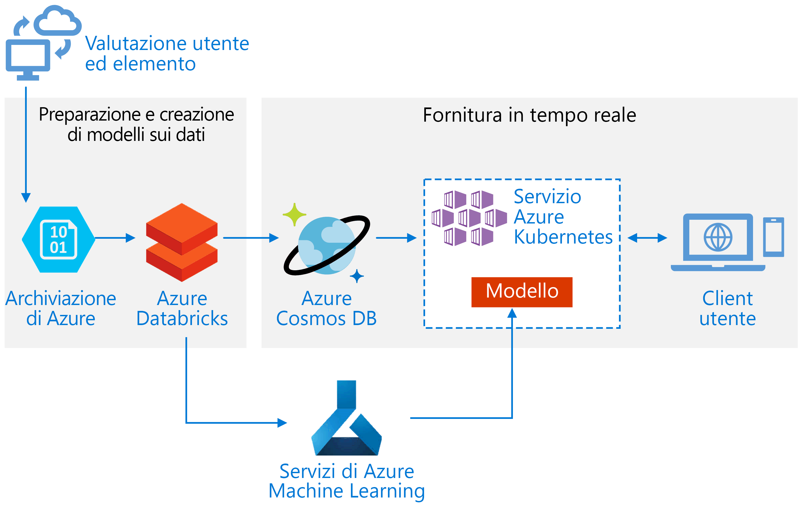
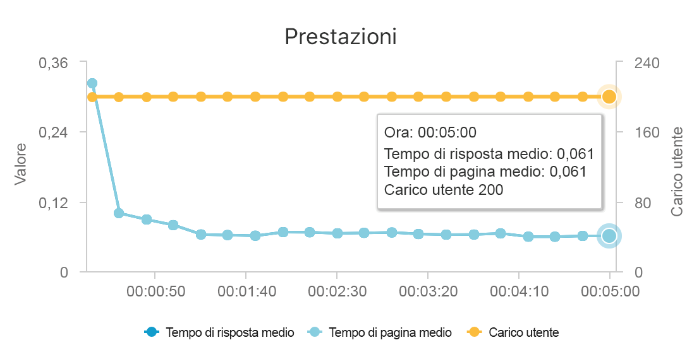
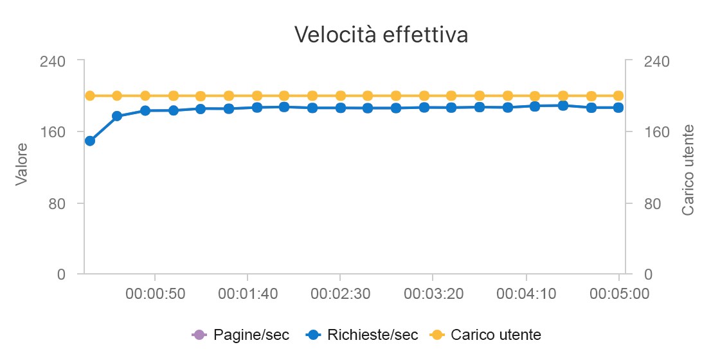

# <a name="build-a-real-time-recommendation-api-on-azure"></a>Creare un'API per raccomandazioni in tempo reale in Azure

Questa architettura di riferimento illustra come eseguire il training di un modello per raccomandazioni con Azure Databricks e distribuirlo come un'API usando Azure Cosmos DB, Azure Machine Learning e il servizio Azure Kubernetes. Questa architettura può essere generalizzata per la maggior parte degli scenari di motore per la generazione di raccomandazioni, incluse raccomandazioni per prodotti, film e notizie.

Un'implementazione di riferimento per questa architettura è disponibile in [GitHub](https://github.com/Microsoft/Recommenders/blob/master/notebooks/04_operationalize/als_movie_o16n.ipynb).



**Scenario**: un'organizzazione che opera nel settore multimediale vuole fornire raccomandazioni per video o film ai propri utenti. Fornendo raccomandazioni personalizzate, l'organizzazione soddisfa diversi obiettivi aziendali, tra cui percentuali di clic maggiori. migliore engagement nel sito e una maggiore soddisfazione degli utenti.

Questa architettura di riferimento è progettata per il training e la distribuzione di un'API per un servizio di raccomandazione in grado raccomandare i 10 film più interessanti per un determinato utente.

Il flusso di dati per questo modello di raccomandazione è il seguente:

1. Tenere traccia del comportamento degli utenti. Ad esempio, un servizio back-end potrebbe registrare quando un utente classifica un film o fa clic su un prodotto o un articolo di notizie.

2. Caricare i dati in Azure Databricks da un'[origine dati][data-source] disponibile.

3. Preparare i dati e dividerli in set di training e di testing per il training del modello. ([Questa guida][guide] descrive le opzioni per la suddivisione dei dati.)

4. Adattare il modello di [filtraggio collaborativo Spark][als] ai dati.

5. Valutare la qualità del modello con le metriche di classificazione e ranking. ([Questa guida][eval-guide] include informazioni dettagliate sulle metriche per cui è possibile valutare il sistema di raccomandazione.)

6. Precalcolare le prime 10 raccomandazioni per ogni utente e archiviarle come cache in Azure Cosmos DB.

7. Distribuire un servizio API nel servizio Azure Kubernetes usando le API di Azure Machine Learning per inserire le API in contenitori e distribuirle.

8. Quando il servizio back-end riceve una richiesta da un utente, chiamare l'API per le raccomandazioni ospitata nel servizio Azure Kubernetes per ottenere le prime 10 raccomandazioni e visualizzarle all'utente.

## <a name="architecture"></a>Architettura

L'architettura è costituita dai componenti seguenti:

[Azure Databricks][databricks]. Databricks è un ambiente di sviluppo usato per preparare i dati di input ed eseguire il training del modello del sistema di raccomandazione in un cluster Spark. Azure Databricks offre anche un'area di lavoro interattiva per eseguire e collaborare su notebook per qualsiasi attività di elaborazione dei dati o di apprendimento automatico.

[Servizio Azure Kubernetes][aks]. Il servizio Azure Kubernetes viene usato per distribuire e rendere operativa l'API del servizio del modello di Machine Learning in un cluster Kubernetes. Il servizio Azure Kubernetes ospita il modello nel contenitore, offrendo la scalabilità richiesta per soddisfare i requisiti di velocità effettiva, di gestione delle identità e degli accessi, di registrazione e di monitoraggio dell'integrità.

[Azure Cosmos DB][cosmosdb]. Cosmos DB è un servizio di database distribuito a livello globale usato per archiviare i primi 10 film consigliati per ogni utente. Azure Cosmos DB è ideale per questo scenario, perché offre bassa latenza (10 ms al 99° percentile) per la lettura dei primi elementi consigliati per un determinato utente.

[Servizio Azure Machine Learning][mls]. Questo servizio consente di tenere traccia e gestire i modelli di Machine Learning, quindi di creare un pacchetto per questi modelli e distribuirli in un ambiente del servizio Azure Kubernetes scalabile.

[Microsoft Recommenders][github]. Questo repository open source contiene codice di utilità ed esempi per consentire agli utenti di iniziare facilmente a creare, valutare e rendere operativo un sistema di raccomandazione.

## <a name="performance-considerations"></a>Considerazioni sulle prestazioni

Le prestazioni sono un aspetto fondamentale per le raccomandazioni in tempo reale, in quanto le raccomandazioni in genere rientrano nel percorso critico della richiesta effettuata da un utente nel sito.

La combinazione di servizio Azure Kubernetes e Azure Cosmos DB consente a questa architettura di offrire un buon punto di partenza per fornire raccomandazioni per un carico di lavoro di medie dimensioni con un overhead minimo. In un test di carico con 200 utenti simultanei, questa architettura offre raccomandazioni con una latenza mediana di circa 60 ms e una velocità effettiva di esecuzione di 180 richieste al secondo. Il testo di carico è stato eseguito sulla configurazione di distribuzione predefinita (cluster del servizio Azure Kubernetes 3x D3 v2 con 12 vCPU, 42 GB di memoria e 11.000 [unità richiesta (UR) al secondo][ru] sottoposto a provisioning per Azure Cosmos DB).





Azure Cosmos DB è consigliato per la distribuzione globale e l'utilità chiavi in mano, in grado di soddisfare qualsiasi requisito per il database delle app. Per una [latenza leggermente più veloce][latency], valutare la possibilità di usare [Cache Redis di Azure][redis] invece di Azure Cosmos DB per gestire le ricerche. Cache Redis può migliorare le prestazioni dei sistemi che dipendono fortemente dai dati in archivi back-end.

## <a name="scalability-considerations"></a>Considerazioni sulla scalabilità

Se non si prevede di usare Spark o in presenza di un carico di lavoro più piccolo per cui non è necessaria la distribuzione, valutare la possibilità di usare [Data Science Virtual Machine][dsvm] (DSVM) invece di Azure Databricks. DSVM è una macchina virtuale di Azure con framework per Deep Learning e strumenti per apprendimento automatico e data science. Come con Azure Databricks, qualsiasi modello creato in una DSVM può essere reso operativo come servizio nel servizio Azure Kubernetes tramite Azure Machine Learning.

Durante il training, effettuare il provisioning di un cluster Spark più grande di dimensioni fisse in Azure Databricks o configurare la [scalabilità automatica][autoscaling]. Quando è abilitata la scalabilità automatica, Databricks esegue il monitoraggio del carico nel cluster e aumenta o riduce le risorse quando necessario. Effettuare il provisioning o predisporre un cluster più grande in presenza di dati di grandi dimensioni e se si vuole ridurre la quantità di tempo necessaria per le attività di preparazione dei dati o di modellazione.

Ridimensionare il cluster del servizio Azure Kubernetes in modo da soddisfare i requisiti di prestazioni e velocità effettiva. Prestare attenzione a selezionare il numero di [pod][scale] ottimale per sfruttare appieno il cluster e configurare il numero di [nodi][nodes] del cluster adatto a soddisfare la domanda del servizio. Per altre informazioni su come ridimensionare il cluster in modo da soddisfare i requisiti di prestazioni e velocità effettiva del servizio del sistema di raccomandazione, vedere [Scaling Azure Container Service Clusters][blog] (Ridimensionare i cluster del servizio Azure Container).

Per gestire le prestazioni di Azure Cosmos DB, stimare il numero di letture necessarie al secondo ed effettuare il provisioning del numero di [unità richiesta al secondo][ru] (velocità effettiva) necessario. Usare le procedure consigliate per [partizionamento e scalabilità orizzontale][partition-data].

## <a name="cost-considerations"></a>Considerazioni sul costo

I principali elementi che generano costi in questo scenario sono:

- Le dimensioni del cluster di Azure Databricks richieste per il training.
- Le dimensioni del cluster del servizio Azure Kubernetes richieste per soddisfare i requisiti di prestazioni.
- Le UR di Azure Cosmos DB di cui viene effettuato il provisioning in modo da soddisfare i requisiti di prestazioni.

Gestire i costi di Azure Databricks con una frequenza minore di ripetizione del training e disattivando il cluster Spark quando non è in uso. I costi del servizio Azure Kubernetes e di Azure Cosmos DB sono legati alla velocità effettiva e alle prestazioni richieste per il sito e aumenteranno e diminuiranno a seconda del volume di traffico del sito.

## <a name="deploy-the-solution"></a>Distribuire la soluzione

Per distribuire questa architettura, creare prima di tutto un ambiente di Azure Databricks per preparare i dati ed eseguire il training di un modello del sistema di raccomandazione:

1. Creare un'[area di lavoro di Azure Databricks][workspace].

2. Creare un nuovo cluster in Azure Databricks. È necessaria la configurazione seguente:

    - Modalità cluster: Standard
    - Versione del runtime di Databricks: 4.1 (include Apache Spark 2.3.0, Scala 2.11)
    - Versione di Python: 3
    - Tipo driver: Standard\_DS3\_v2
    - Tipo di ruolo di lavoro: Standard\_DS3\_v2 (min e max in base alle esigenze)
    - Interruzione automatica: (in base alle esigenze)
    - Configurazione di Spark: (in base alle esigenze)
    - Variabili di ambiente: (in base alle esigenze)

3. Clonare il repository [Microsoft Recommenders][github] nel computer locale.

4. Comprimere il contenuto all'interno della cartella Recommenders:

    ```console
    cd Recommenders
    zip -r Recommenders.zip
    ```

5. Associare la libreria Recommenders al cluster come indicato di seguito:

    1. Nel menu successivo, usare l'opzione per importare una libreria ("To import a library, such as a jar or egg, click here" - Per importare una libreria, come un file jag o egg, fare clic qui) e premere **click here** (fare clic qui).

    2. Nel primo menu a discesa selezionare l'opzione **Upload Python egg or PyPI** (Carica egg o PyPI Python).

    3. Selezionare **Drop library egg here to upload** (Trascinare qui il file egg della libreria per caricarlo) e selezionare il file Recommenders.zip appena creato.

    4. Selezionare **Create library** (Crea libreria) per caricare il file ZIP e renderlo disponibile nell'area di lavoro.

    5. Nel menu successivo associare la libreria al cluster.

6. Nell'area di lavoro importare l'[esempio ALS Movie Operationalization][als-example].

7. Eseguire il notebook ALS Movie Operationalization per creare le risorse necessarie per creare un'API per le raccomandazioni che fornisce le raccomandazioni per i primi 10 film per un determinato utente.

<!-- links -->
[aci]: /azure/container-instances/container-instances-overview
[aad]: /azure/active-directory-b2c/active-directory-b2c-overview
[aks]: /azure/aks/intro-kubernetes
[als]: https://spark.apache.org/docs/latest/ml-collaborative-filtering.html
[als-example]: https://github.com/Microsoft/Recommenders/blob/master/notebooks/04_operationalize/als_movie_o16n.ipynb
[autoscaling]: https://docs.azuredatabricks.net/user-guide/clusters/sizing.html
[autoscale]: https://docs.azuredatabricks.net/user-guide/clusters/sizing.html#autoscaling
[availability]: /azure/architecture/checklist/availability
[blob]: /azure/storage/blobs/storage-blobs-introduction
[blog]: https://blogs.technet.microsoft.com/machinelearning/2018/03/20/scaling-azure-container-service-cluster/
[clusters]: https://docs.azuredatabricks.net/user-guide/clusters/configure.html
[cosmosdb]: /azure/cosmos-db/introduction
[data-source]: https://docs.azuredatabricks.net/spark/latest/data-sources/index.html
[databricks]: /azure/azure-databricks/what-is-azure-databricks
[dsvm]: /azure/machine-learning/data-science-virtual-machine/overview
[dsvm-ubuntu]: /azure/machine-learning/data-science-virtual-machine/dsvm-ubuntu-intro
[eval-guide]: https://github.com/Microsoft/Recommenders/blob/master/notebooks/03_evaluate/evaluation.ipynb
[free]: https://azure.microsoft.com/free/?WT.mc_id=A261C142F
[github]: https://github.com/Microsoft/Recommenders
[guide]: https://github.com/Microsoft/Recommenders/blob/master/notebooks/01_prepare_data/data_split.ipynb
[latency]: https://github.com/jessebenson/azure-performance
[mls]: /azure/machine-learning/service/
[n-tier]: /azure/architecture/reference-architectures/n-tier/n-tier-cassandra
[ndcg]: https://en.wikipedia.org/wiki/Discounted_cumulative_gain
[nodes]: /azure/aks/scale-cluster
[notebook]: https://github.com/Microsoft/Recommenders/notebooks/00_quick_start/als_pyspark_movielens.ipynb
[partition-data]: /azure/cosmos-db/partition-data
[redis]: /azure/redis-cache/cache-overview
[regions]: https://azure.microsoft.com/en-us/global-infrastructure/services/?products=virtual-machines&regions=all
[resiliency]: /azure/architecture/resiliency/
[ru]: /azure/cosmos-db/request-units
[sec-docs]: /azure/security/
[setup]: https://github.com/Microsoft/Recommenders/blob/master/SETUP.md%60
[scale]: /azure/aks/tutorial-kubernetes-scale
[sla]: https://azure.microsoft.com/en-us/support/legal/sla/virtual-machines/v1_8/
[vm-size]: /azure/virtual-machines/virtual-machines-linux-change-vm-size
[workspace]: https://docs.azuredatabricks.net/getting-started/index.html
