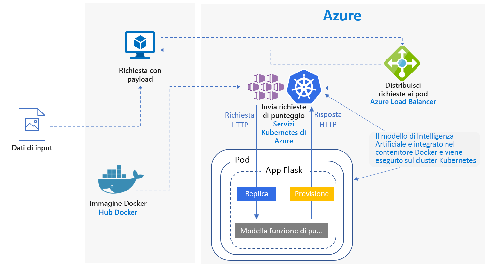
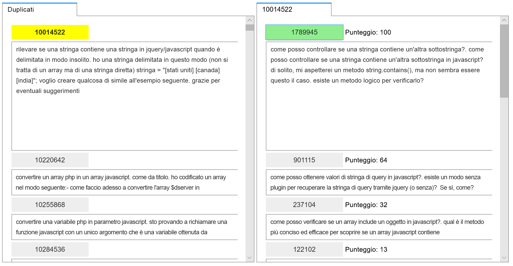
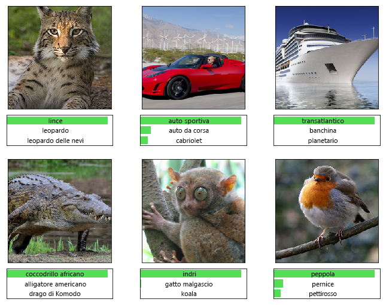

# Assegnazione di punteggi in tempo reale per modelli Python scikit-learn e di Deep Learning in AzureReal-time scoring of Python Scikit-Learn and deep learning models on Azure

Questa architettura di riferimento mostra come distribuire modelli Python come servizi Web per effettuare previsioni in tempo reale usando il servizio Azure Machine Learning.This reference architecture shows how to deploy Python models as web services to make real-time predictions using the Azure Machine Learning service. Vengono esaminati due scenari: la distribuzione di modelli Python normali e gli specifici requisiti della distribuzione di modelli di Deep Learning.Two scenarios are covered: deploying regular Python models, and the specific requirements of deploying deep learning models. Entrambi gli scenari usano l'architettura illustrata.Both scenarios use the architecture shown.

In GitHub sono disponibili due implementazioni di riferimento di questa architettura, una per i [modelli Python normali][github-python] e una per i [modelli di Deep Learning][github-dl].Two reference implementations for this architecture are available on GitHub, one for [regular Python models][github-python] and one for [deep learning models][github-dl].

## ScenariScenarios

Le implementazioni di riferimento offrono una dimostrazione di due scenari in cui viene usata questa architettura.The reference implementations demonstrate two scenarios using this architecture.

**Scenario 1: corrispondenza con le domande frequenti**.**Scenario 1: FAQ matching**. Questo scenario illustra come distribuire un modello di corrispondenza con le domande frequenti come servizio Web per offrire previsioni per le domande degli utenti.This scenario shows how to deploy a frequently asked questions (FAQ) matching model as a web service to provide predictions for user questions. Per questo scenario, i dati di input riportati nel diagramma dell'architettura sono stringhe di testo contenenti le domande degli utenti di cui deve essere trovata la corrispondenza con un elenco di domande frequenti.For this scenario, "Input Data" in the architecture diagram refers to text strings containing user questions to match with a list of FAQs. Questo scenario è progettato per la libreria di apprendimento automatico [scikit-learn][scikit] per Python, ma può essere generalizzato per qualsiasi scenario che usi modelli Python per ottenere previsioni in tempo reale.This scenario is designed for the [scikit-learn][scikit] machine learning library for Python, but can be generalized to any scenario that uses Python models to make real-time predictions.

Lo scenario usa un subset di dati delle domande di Stack Overflow che include le domande originali con tag JavaScript, le domande duplicate e le risposte.This scenario uses a subset of Stack Overflow question data that includes original questions tagged as JavaScript, their duplicate questions, and their answers. Lo scenario esegue il training di una pipeline scikit-learn per prevedere la probabilità di corrispondenza di una domanda duplicata con ognuna delle domande originali.It trains a scikit-learn pipeline to predict the match probability of a duplicate question with each of the original questions. Queste previsioni vengono eseguite in tempo reale usando un endpoint API REST.These predictions are made in real time using a REST API endpoint.

Il flusso applicazione per questa architettura è il seguente:The application flow for this architecture is as follows:

1. Il modello sottoposto a training viene registrato nel registro del modello di Machine Learning.The trained model is registered to the Machine Learning model registry.
2. Il servizio Machine Learning crea un'immagine Docker che include il modello e lo script di assegnazione di punteggi.The Machine Learning service creates a Docker image that includes the model and scoring script.
3. Machine Learning distribuisce l'immagine di assegnazioni di punteggi nel servizio Azure Kubernetes (AKS) come servizio Web.Machine Learning deploys the scoring image on Azure Kubernetes Service (AKS) as a web service.
4. Il client invia una richiesta HTTP POST con i dati della domanda codificati.The client sends an HTTP POST request with the encoded question data.
5. Il servizio Web creato da Machine Learning estrae la domanda dalla richiesta.The web service created by Machine Learning extracts the question from the request.
6. La domanda viene inviata al modello della pipeline Scikit-learn per la definizione delle funzionalità e l'assegnazione di punteggi.The question is sent to the Scikit-learn pipeline model for featurization and scoring. 
7. Le domande frequenti corrispondenti con i relativi punteggi vengono restituite al client.The matching FAQ questions with their scores are returned to the client.

Di seguito è riportato uno screenshot dell'app di esempio che utilizza i risultati:Here is a screenshot of the example app that consumes the results:

**Scenario 2: classificazione di immagini**.**Scenario 2: Image classification**. Questo scenario illustra come distribuire un modello di rete neurale convoluzionale come servizio Web per offrire previsioni sulle immagini.This scenario shows how to deploy a Convolutional Neural Network (CNN) model as a web service to provide predictions on images. Per questo scenario, i dati di input riportati nel diagramma dell'architettura sono file di immagine.For this scenario, "Input Data" in the architecture diagram refers to image files. Le reti neurali convoluzionali sono molto efficaci nella visione artificiale, per attività come la classificazione di immagini e il rilevamento di oggetti.CNNs are very effective in computer vision for tasks such as image classification and object detection. Questo scenario è progettato per i framework TensorFlow, Keras (con back end TensorFlow) e PyTorch,This scenario is designed for the frameworks TensorFlow, Keras (with the TensorFlow back end), and PyTorch. ma può essere generalizzato per qualsiasi scenario che usi modelli di Deep Learning per ottenere previsioni in tempo reale.However, it can be generalized to any scenario that uses deep learning models to make real-time predictions.

Questo scenario usa un modello ResNet-152 con training preliminare di cui viene eseguito il training sul set di dati ImageNet-1K (1.000 classi) per prevedere la categoria a cui un'immagine appartiene, come illustrato nella figura di seguito.This scenario uses a pre-trained ResNet-152 model trained on ImageNet-1K (1,000 classes) dataset to predict which category (see figure below) an image belongs to. Queste previsioni vengono eseguite in tempo reale usando un endpoint API REST.These predictions are made in real time using a REST API endpoint.

Il flusso applicazione per il modello di Deep Learning è il seguente:The application flow for the deep learning model is as follows:

1. Il modello di Deep Learning viene registrato nel registro del modello di Machine Learning.The deep learning model is registered to the Machine Learning model registry.
2. Il servizio Machine Learning crea un'immagine Docker che include il modello e lo script di assegnazione di punteggi.The Machine Learning service creates a docker image including the model and scoring script.
3. Machine Learning distribuisce l'immagine di assegnazioni di punteggi nel servizio Azure Kubernetes (AKS) come servizio Web.Machine Learning deploys the scoring image on Azure Kubernetes Service (AKS) as a web service.
4. Il client invia una richiesta HTTP POST con i dati di immagine codificati.The client sends an HTTP POST request with the encoded image data.
5. Il servizio Web creato da Machine Learning pre-elabora i dati di immagine e li invia al modello per l'assegnazione di punteggi.The web service created by Machine Learning preprocesses the image data and sends it to the model for scoring. 
6. Le categorie previste con i relativi punteggi vengono restituite al client.The predicted categories with their scores are returned to the client.

## ArchitetturaArchitecture

L'architettura è costituita dai componenti seguenti.This architecture consists of the following components.

**[Servizio Azure Machine Learning][aml]**. Un servizio cloud che è possibile usare per eseguire il training di modelli di Machine Learning, distribuirli, automatizzarli e gestirli, il tutto su vasta scala, grazie all'ampia portata del cloud.**[Azure Machine Learning service][aml]** is a cloud service that is used to train, deploy, automate and manage machine learning models, all at the broad scale that the cloud provides. Viene usato in questa architettura per gestire la distribuzione di modelli, nonché le attività di autenticazione, routing e bilanciamento del carico del servizio Web.It is used in this architecture to manage the deployment of models as well as authentication, routing, and load balancing of the web service.

**[Macchina virtuale][vm]** (VM).**[Virtual machine][vm]** (VM). La VM è riportata come un esempio di dispositivo (locale o nel cloud) che può inviare una richiesta HTTP.The VM is shown as an example of a device &mdash; local or in the cloud &mdash; that can send an HTTP request.

**[Servizio Azure Kubernetes][aks]**. Viene usato per distribuire l'applicazione in un cluster Kubernetes.**[Azure Kubernetes Service][aks]** (AKS) is used to deploy the application on a Kubernetes cluster. Il servizio Azure Kubernetes semplifica la distribuzione e le operazioni di Kubernetes.AKS simplifies the deployment and operations of Kubernetes. Il cluster può essere configurato usando VM solo CPU per i modelli Python normali o VM abilitate per GPU per i modelli di Deep Learning.The cluster can be configured using CPU-only VMs for regular Python models or GPU-enabled VMs for deep learning models.

**[Registro Azure Container][acr]**. Consente l'archiviazione di immagini per tutti i tipi di distribuzioni di contenitori Docker, inclusi DC/OS, Docker Swarm e Kubernetes.**[Azure Container Registry][acr]** enables storage of images for all types of Docker container deployments including DC/OS, Docker Swarm and Kubernetes. Le immagini di assegnazione di punteggi vengono distribuite come contenitori nel servizio Azure Kubernetes e usate per eseguire lo script di assegnazione di punteggi.The scoring images are deployed as containers on Azure Kubernetes Service and used to run the scoring script. L'immagine usata qui viene creata da Machine Learning dal modello sottoposto a training e lo script di assegnazione di punteggi e quindi ne viene eseguito il push nel Registro Azure Container.The image used here is created by Machine Learning from the trained model and scoring script, and then is pushed to the Azure Container Registry.

## Considerazioni sulle prestazioniPerformance considerations

Per le architetture di assegnazione di punteggi in tempo reale, le prestazioni in termini di velocità effettiva diventano una considerazione predominante.For real-time scoring architectures, throughput performance becomes a dominant consideration. Per i modelli Python normali, le CPU sono generalmente considerate sufficienti per gestire il carico di lavoro.For regular Python models, it's generally accepted that CPUs are sufficient to handle the workload.

Per i carichi di lavoro di Deep Learning, in cui la velocità è un collo di bottiglia, le GPU offrono invece in genere [prestazioni][gpus-vs-cpus] superiori rispetto alle CPU.However for deep learning workloads, when speed is a bottleneck, GPUs generally provide better [performance][gpus-vs-cpus] compared to CPUs. Per ottenere prestazioni corrispondenti a quelle delle GPU usando CPU, è in genere necessario un cluster con un numero elevato di CPU.To match GPU performance using CPUs, a cluster with large number of CPUs is usually needed.

Per questa architettura, è possibile usare CPU in entrambi gli scenari, ma per i modelli di Deep Learning le GPU offrono valori di velocità effettiva nettamente superiori rispetto a un cluster di CPU con costo simile.You can use CPUs for this architecture in either scenario, but for deep learning models, GPUs provide significantly higher throughput values compared to a CPU cluster of similar cost. servizio Azure Kubernetes supporta l'uso di GPU e questo è uno dei vantaggi offerti da servizio Azure Kubernetes per questa architettura.AKS supports the use of GPUs, which is one advantage of using AKS for this architecture. Le distribuzioni di Deep Learning, inoltre, usano in genere modelli con un numero elevato di parametri.Also, deep learning deployments typically use models with a high number of parameters. L'uso di GPU evita la contesa per le risorse tra il modello e il servizio Web che costituisce invece un problema nelle distribuzioni solo CPU.Using GPUs prevents contention for resources between the model and the web service, which is an issue in CPU-only deployments.

## Considerazioni sulla scalabilitàScalability considerations

Per i modelli Python normali, in cui il provisioning del cluster del servizio Azure Kubernetes viene effettuato con VM solo CPU, prestare attenzione in caso di [aumento del numero di istanze dei pod][manually-scale-pods].For regular Python models, where the AKS cluster is provisioned with CPU-only VMs, take care when [scaling out the number of pods][manually-scale-pods]. L'obiettivo è utilizzare appieno il cluster.The goal is to fully utilize the cluster. Il ridimensionamento dipende dalle richieste e dai limiti di CPU definiti per i pod.Scaling depends on the CPU requests and limits defined for the pods. Machine Learning tramite Kubernetes supporta anche il [ridimensionamento automatico dei pod][autoscale-pods] in base all'utilizzo della CPU o ad altre metriche.Machine Learning through Kubernetes also supports [pod autoscaling][autoscale-pods] based on CPU utilization or other metrics. Il [ridimensionamento automatico del cluster][autoscaler] (in anteprima) può ridimensionare i nodi agente in base ai pod in sospeso.The [cluster autoscaler][autoscaler] (in preview) can scale agent nodes based on the pending pods.

Per gli scenari di Deep Learning con VM abilitate per GPU, i limiti di risorse per i pod sono tali che una GPU viene assegnata a un unico pod.For deep learning scenarios, using GPU-enabled VMs, resource limits on pods are such that one GPU is assigned to one pod. A seconda del tipo di VM usato, è necessario [ridimensionare i nodi del cluster][scale-cluster] in base alle esigenze del servizio.Depending on the type of VM used, you must [scale the nodes of the cluster][scale-cluster] to meet the demand for the service. Questa operazione può essere eseguita facilmente usando kubectl e l'interfaccia della riga di comando di Azure.You can do this easily using the Azure CLI and kubectl.

## Considerazioni relative a monitoraggio e registrazioneMonitoring and logging considerations

### Monitoraggio di servizio Azure KubernetesAKS monitoring

Per ottenere la visibilità delle prestazioni di servizio Azure Kubernetes, usare la funzionalità [Monitoraggio di Azure per i contenitori][monitor-containers],For visibility into AKS performance, use the [Azure Monitor for containers][monitor-containers] feature. che raccoglie metriche sulla memoria e sul processore da controller, nodi e contenitori disponibili in Kubernetes tramite l'API Metriche.It collects memory and processor metrics from controllers, nodes, and containers that are available in Kubernetes through the Metrics API.

Durante la distribuzione dell'applicazione, monitorare il cluster servizio Azure Kubernetes per verificare che funzioni come previsto, che tutti i nodi siano operativi e che tutti i pod siano in esecuzione.While deploying your application, monitor the AKS cluster to make sure it's working as expected, all the nodes are operational, and all pods are running. Nonostante sia possibile usare lo strumento da riga di comando [kubectl][kubectl] per recuperare lo stato dei pod, Kubernetes include anche un dashboard Web per il monitoraggio di base dello stato del cluster e la gestione.Although you can use the [kubectl][kubectl] command-line tool to retrieve pod status, Kubernetes also includes a web dashboard for basic monitoring of the cluster status and management.

Per visualizzare lo stato generale del cluster e dei nodi, passare alla sezione **Nodes** (Nodi) del dashboard Kubernetes.To see the overall state of the cluster and nodes, go to the **Nodes** section of the Kubernetes dashboard. In caso di nodo inattivo o con errori, è possibile visualizzare i log degli errori da tale pagina.If a node is inactive or has failed, you can display the error logs from that page. Analogamente, passare alle sezioni **Pods** (Pod) e **Deployments** (Distribuzioni) per informazioni sul numero di pod e sullo stato della distribuzione.Similarly, go to the **Pods** and **Deployments** sections for information about the number of pods and status of your deployment.

### Log di servizio Azure KubernetesAKS logs

servizio Azure Kubernetes registra automaticamente ogni stdout/stderr nei log dei pod del cluster.AKS automatically logs all stdout/stderr to the logs of the pods in the cluster. Usare kubectl per visualizzare questi elementi nonché gli eventi e i log a livello di nodo.Use kubectl to see these and also node-level events and logs. Per informazioni dettagliate, vedere la procedura di distribuzione.For details, see the deployment steps.

Usare [Monitoraggio di Azure per i contenitori][monitor-containers] per raccogliere metriche e log tramite una versione in contenitori dell'agente di Log Analytics per Linux, archiviata nell'area di lavoro di Log Analytics.Use [Azure Monitor for containers][monitor-containers] to collect metrics and logs through a containerized version of the Log Analytics agent for Linux, which is stored in your Log Analytics workspace.

## Considerazioni relative alla sicurezzaSecurity considerations

Usare il [Centro sicurezza di Azure][security-center] per ottenere una visualizzazione centrale dello stato di sicurezza delle risorse di Azure.Use [Azure Security Center][security-center] to get a central view of the security state of your Azure resources. Il Centro sicurezza monitora i potenziali problemi di sicurezza e offre un quadro completo dell'integrità della sicurezza della distribuzione, pur non monitorando i nodi agente servizio Azure Kubernetes.Security Center monitors potential security issues and provides a comprehensive picture of the security health of your deployment, although it doesn't monitor AKS agent nodes. Il Centro sicurezza è configurato per ogni sottoscrizione di Azure.Security Center is configured per Azure subscription. Abilitare la raccolta dei dati sulla sicurezza come illustrato nell'articolo relativo all'[onboarding della sottoscrizione di Azure nel Centro sicurezza Standard][get-started].Enable security data collection as described in [Onboard your Azure subscription to Security Center Standard][get-started]. Quando la raccolta dei dati è abilitata, il Centro sicurezza analizza automaticamente tutte le macchine virtuali create nell'ambito della sottoscrizione.When data collection is enabled, Security Center automatically scans any VMs created under that subscription.

**Operazioni**.**Operations**. Per accedere a un cluster servizio Azure Kubernetes con il token di autenticazione di Azure Active Directory (Azure AD), configurare servizio Azure Kubernetes per l'uso di Azure AD per l'[autenticazione utente][aad-auth].To sign in to an AKS cluster using your Azure Active Directory (Azure AD) authentication token, configure AKS to use Azure AD for [user authentication][aad-auth]. Gli amministratori di cluster possono anche configurare il controllo degli accessi in base al ruolo di Kubernetes in base all'identità o all'appartenenza a gruppi della directory di un utente.Cluster administrators can also configure Kubernetes role-based access control (RBAC) based on a user's identity or directory group membership.

Usare il [controllo degli accessi in base al ruolo][rbac] per controllare l'accesso alle risorse di Azure distribuite.Use [RBAC][rbac] to control access to the Azure resources that you deploy. Il controllo degli accessi in base al ruolo consente di assegnare i ruoli di autorizzazione ai membri del proprio team DevOps.RBAC lets you assign authorization roles to members of your DevOps team. Un utente può essere assegnato a più ruoli ed è possibile creare ruoli personalizzati per [autorizzazioni] ancora più specifiche.A user can be assigned to multiple roles, and you can create custom roles for even more fine-grained [permissions].

**HTTPS**.**HTTPS**. Come procedura consigliata per la sicurezza, l'applicazione dovrebbe imporre HTTPS e reindirizzare le richieste HTTP.As a security best practice, the application should enforce HTTPS and redirect HTTP requests. Usare un [controller di ingresso][ingress-controller] per distribuire un proxy inverso per la terminazione SSL e il reindirizzamento delle richieste HTTP.Use an [ingress controller][ingress-controller] to deploy a reverse proxy that terminates SSL and redirects HTTP requests. Per altre informazioni, vedere [Creare un controller di ingresso HTTPS nel servizio Azure Kubernetes][https-ingress].For more information, see [Create an HTTPS ingress controller on Azure Kubernetes Service (AKS)][https-ingress].

**Autenticazione**.**Authentication**. Questa soluzione non limita l'accesso agli endpoint.This solution doesn't restrict access to the endpoints. Per distribuire l'architettura in un contesto aziendale, proteggere gli endpoint tramite chiavi API e aggiungere una qualche forma di autenticazione utente all'applicazione client.To deploy the architecture in an enterprise setting, secure the endpoints through API keys and add some form of user authentication to the client application.

**Registro contenitori**.**Container registry**. Questa soluzione usa Registro Azure Container per archiviare l'immagine Docker.This solution uses Azure Container Registry to store the Docker image. Il codice da cui l'applicazione dipende e il modello sono contenuti in tale immagine.The code that the application depends on, and the model, are contained within this image. Le applicazioni aziendali dovrebbero usare un registro privato per garantire la protezione dall'esecuzione di codice dannoso ed evitare la compromissione delle informazioni all'interno del contenitore.Enterprise applications should use a private registry to help guard against running malicious code and to help keep the information inside the container from being compromised.

**Protezione DDoS**.**DDoS protection**. Valutare la possibilità di abilitare [Protezione DDoS Standard][ddos].Consider enabling [DDoS Protection Standard][ddos]. Nonostante la protezione DDoS di base sia abilitata come parte della piattaforma Azure, Protezione DDoS Standard offre funzionalità di mitigazione ottimizzate specificamente per le risorse di rete virtuale di Azure.Although basic DDoS protection is enabled as part of the Azure platform, DDoS Protection Standard provides mitigation capabilities that are tuned specifically to Azure virtual network resources.

**Registrazione**.**Logging**. Prima di archiviare i dati di log, usare procedure consigliate come l'eliminazione delle password utente e delle altre informazioni che potrebbero essere usate per illeciti a livello di sicurezza.Use best practices before storing log data, such as scrubbing user passwords and other information that could be used to commit security fraud.

## DistribuzioneDeployment

Per distribuire questa architettura di riferimento, seguire la procedura descritta nei repository GitHub:To deploy this reference architecture, follow the steps described in the GitHub repos:

- [Modelli Python normali][github-python][Regular Python models][github-python]
- [Modelli di Deep Learning][github-dl][Deep learning models][github-dl]

<!-- links -->

[aad-auth]: /azure/aks/aad-integration
[acr]: /azure/container-registry/
[something]: https://kubernetes.io/docs/reference/access-authn-authz/authentication/
[aks]: /azure/aks/intro-kubernetes
[autoscaler]: /azure/aks/autoscaler
[autoscale-pods]: /azure/aks/tutorial-kubernetes-scale#autoscale-pods
[azcopy]: /azure/storage/common/storage-use-azcopy-linux
[ddos]: /azure/virtual-network/ddos-protection-overview
[get-started]: /azure/security-center/security-center-get-started
[github-python]: https://github.com/Microsoft/MLAKSDeployAML
[github-dl]: https://github.com/Microsoft/AKSDeploymentTutorial_AML
[gpus-vs-cpus]: https://azure.microsoft.com/en-us/blog/gpus-vs-cpus-for-deployment-of-deep-learning-models/
[https-ingress]: /azure/aks/ingress-tls
[ingress-controller]: https://kubernetes.io/docs/concepts/services-networking/ingress/
[kubectl]: https://kubernetes.io/docs/tasks/tools/install-kubectl/
[aml]: /azure/machine-learning/service/overview-what-is-azure-ml
[manually-scale-pods]: /azure/aks/tutorial-kubernetes-scale#manually-scale-pods
[monitor-containers]: /azure/monitoring/monitoring-container-insights-overview
[autorizzazioni]: /azure/aks/concepts-identity
[permissions]: /azure/aks/concepts-identity
[rbac]: /azure/active-directory/role-based-access-control-what-is
[scale-cluster]: /azure/aks/scale-cluster
[scikit]: https://pypi.org/project/scikit-learn/
[security-center]: /azure/security-center/security-center-intro
[vm]: /azure/virtual-machines/
