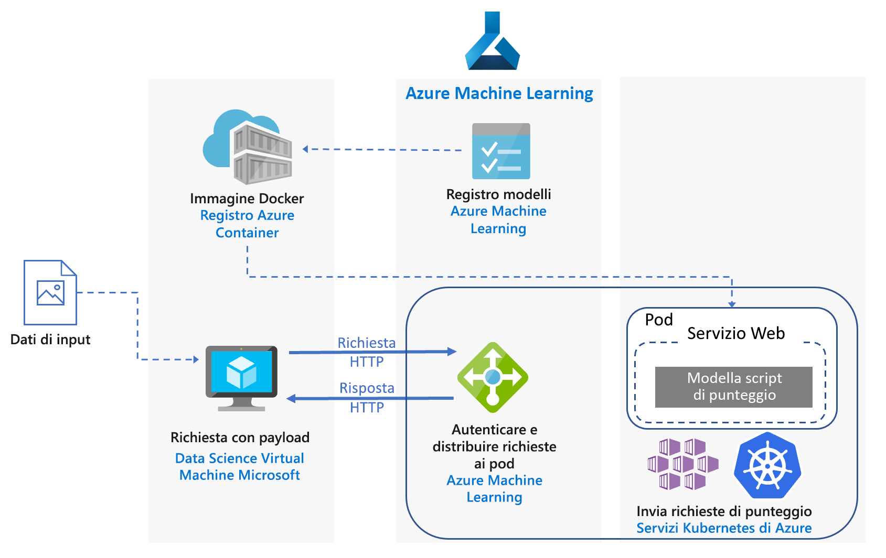

# Assegnazione di punteggi in tempo reale per modelli Python scikit-learn e di Deep Learning in Azure

Questa architettura di riferimento illustra come distribuire modelli Python come servizi Web per ottenere previsioni in tempo reale. Vengono esaminati due scenari: la distribuzione di modelli Python normali e gli specifici requisiti della distribuzione di modelli di Deep Learning. Entrambi gli scenari usano l'architettura illustrata.

In GitHub sono disponibili due implementazioni di riferimento di questa architettura, una per i [modelli Python normali][github-python] e una per i [modelli di Deep Learning][github-dl].

## Scenari

Le implementazioni di riferimento offrono una dimostrazione di due scenari in cui viene usata questa architettura.

**Scenario 1: corrispondenza con le domande frequenti**. Questo scenario illustra come distribuire un modello di corrispondenza con le domande frequenti come servizio Web per offrire previsioni per le domande degli utenti. Per questo scenario, i dati di input riportati nel diagramma dell'architettura sono stringhe di testo contenenti le domande degli utenti di cui deve essere trovata la corrispondenza con un elenco di domande frequenti. Questo scenario è progettato per la libreria di apprendimento automatico [scikit-learn][scikit] per Python, ma può essere generalizzato per qualsiasi scenario che usi modelli Python per ottenere previsioni in tempo reale.

Lo scenario usa un subset di dati delle domande di Stack Overflow che include le domande originali con tag JavaScript, le domande duplicate e le risposte. Lo scenario esegue il training di una pipeline scikit-learn per prevedere la probabilità di corrispondenza di una domanda duplicata con ognuna delle domande originali. Queste previsioni vengono eseguite in tempo reale usando un endpoint API REST.

Il flusso applicazione per questa architettura è il seguente:

1.  Il client invia una richiesta HTTP POST con i dati della domanda codificati.

2.  L'app Flask estrae la domanda dalla richiesta.

3.  La domanda viene inviata al modello della pipeline scikit-learn per la definizione delle caratteristiche e l'assegnazione di punteggi.

4.  Le domande frequenti corrispondenti con i relativi punteggi vengono inviate tramite pipe a un oggetto JSON e restituite al client.

Di seguito è riportato uno screenshot dell'app di esempio che utilizza i risultati:

**Scenario 2: classificazione di immagini.** Questo scenario illustra come distribuire un modello di rete neurale convoluzionale come servizio Web per offrire previsioni sulle immagini. Per questo scenario, i dati di input riportati nel diagramma dell'architettura sono file di immagine. Le reti neurali convoluzionali sono molto efficaci nella visione artificiale, per attività come la classificazione di immagini e il rilevamento di oggetti. Questo scenario è progettato per i framework TensorFlow, Keras (con back end TensorFlow) e PyTorch, ma può essere generalizzato per qualsiasi scenario che usi modelli di Deep Learning per ottenere previsioni in tempo reale.

Questo scenario usa un modello ResNet-152 con training preliminare di cui viene eseguito il training sul set di dati ImageNet-1K (1.000 classi) per prevedere la categoria a cui un'immagine appartiene, come illustrato nella figura di seguito. Queste previsioni vengono eseguite in tempo reale usando un endpoint API REST.

Il flusso applicazione per il modello di Deep Learning è il seguente:

1.  Il client invia una richiesta HTTP POST con i dati di immagine codificati.

2.  L'app Flask estrae l'immagine dalla richiesta.

3.  L'immagine viene pre-elaborata e inviata al modello per l'assegnazione dei punteggi.

4.  I risultati dell'assegnazione dei punteggi vengono inviati tramite pipe a un oggetto JSON e restituiti al client.

## Architettura

L'architettura è costituita dai componenti seguenti.

**[Macchina virtuale][vm]** (VM). La VM è riportata come un esempio di dispositivo (locale o nel cloud) che può inviare una richiesta HTTP.

**[Servizio Kubernetes di Azure][aks]** (AKS). Viene usato per distribuire l'applicazione in un cluster Kubernetes. AKS semplifica la distribuzione e le operazioni di Kubernetes. Il cluster può essere configurato usando VM solo CPU per i modelli Python normali o VM abilitate per GPU per i modelli di Deep Learning.

**[Servizio di bilanciamento del carico][lb]**. AKS effettua il provisioning di un servizio di bilanciamento del carico che verrà usato per esporre il servizio esternamente. Il traffico proveniente dal servizio di bilanciamento del carico viene indirizzato ai pod back-end.

**[Hub Docker][docker]**. Viene usato per archiviare l'immagine Docker distribuita nel cluster Kubernetes. L'hub Docker è stato scelto per questa architettura perché è facile da usare ed è il repository di immagini predefinito per gli utenti di Docker. Per questa architettura è possibile usare anche [Registro contenitori di Azure][acr].

## Considerazioni sulle prestazioni

Per le architetture di assegnazione di punteggi in tempo reale, le prestazioni in termini di velocità effettiva diventano una considerazione predominante. Per i modelli Python normali, le CPU sono generalmente considerate sufficienti per gestire il carico di lavoro. 

Per i carichi di lavoro di Deep Learning, in cui la velocità è un collo di bottiglia, le GPU offrono invece in genere [prestazioni][gpus-vs-cpus] superiori rispetto alle CPU. Per ottenere prestazioni corrispondenti a quelle delle GPU usando CPU, è in genere necessario un cluster con un numero elevato di CPU.

Per questa architettura, è possibile usare CPU in entrambi gli scenari, ma per i modelli di Deep Learning le GPU offrono valori di velocità effettiva nettamente superiori rispetto a un cluster di CPU con costo simile. AKS supporta l'uso di GPU e questo è uno dei vantaggi offerti da AKS per questa architettura. Le distribuzioni di Deep Learning, inoltre, usano in genere modelli con un numero elevato di parametri. L'uso di GPU evita la contesa per le risorse tra il modello e il servizio Web che costituisce invece un problema nelle distribuzioni solo CPU.

## Considerazioni sulla scalabilità

Per i modelli Python normali, in cui il provisioning del cluster AKS viene effettuato con VM solo CPU, prestare attenzione in caso di [aumento del numero di istanze dei pod][manually-scale-pods]. L'obiettivo è utilizzare appieno il cluster. Il ridimensionamento dipende dalle richieste e dai limiti di CPU definiti per i pod. Kubernetes supporta anche il [ridimensionamento automatico][autoscale-pods] dei pod per modificare il numero di pod in una distribuzione in base all'utilizzo delle CPU o ad altre metriche selezionate. Il [ridimensionamento automatico del cluster][autoscaler] (in anteprima) può ridimensionare i nodi agente in base ai pod in sospeso.

Per gli scenari di Deep Learning con VM abilitate per GPU, i limiti di risorse per i pod sono tali che una GPU viene assegnata a un unico pod. A seconda del tipo di VM usato, è necessario [ridimensionare i nodi del cluster][scale-cluster] in base alle esigenze del servizio. Questa operazione può essere eseguita facilmente usando kubectl e l'interfaccia della riga di comando di Azure.

## Considerazioni relative a monitoraggio e registrazione

### Monitoraggio di AKS

Per ottenere la visibilità delle prestazioni di AKS, usare la funzionalità [Monitoraggio di Azure per i contenitori][monitor-containers], che raccoglie metriche sulla memoria e sul processore da controller, nodi e contenitori disponibili in Kubernetes tramite l'API Metriche.

Durante la distribuzione dell'applicazione, monitorare il cluster AKS per verificare che funzioni come previsto, che tutti i nodi siano operativi e che tutti i pod siano in esecuzione. Nonostante sia possibile usare lo strumento da riga di comando [kubectl][kubectl] per recuperare lo stato dei pod, Kubernetes include anche un dashboard Web per il monitoraggio di base dello stato del cluster e la gestione.

Per visualizzare lo stato generale del cluster e dei nodi, passare alla sezione **Nodes** (Nodi) del dashboard Kubernetes. In caso di nodo inattivo o con errori, è possibile visualizzare i log degli errori da tale pagina. Analogamente, passare alle sezioni **Pods** (Pod) e **Deployments** (Distribuzioni) per informazioni sul numero di pod e sullo stato della distribuzione.

### Log di AKS 

AKS registra automaticamente ogni stdout/stderr nei log dei pod del cluster. Usare kubectl per visualizzare questi elementi nonché gli eventi e i log a livello di nodo. Per informazioni dettagliate, vedere la procedura di distribuzione.

Usare [Monitoraggio di Azure per i contenitori][monitor-containers] per raccogliere metriche e log tramite una versione in contenitori dell'agente di Log Analytics per Linux, archiviata nell'area di lavoro di Log Analytics.

## Considerazioni relative alla sicurezza

Usare il [Centro sicurezza di Azure][security-center] per ottenere una visualizzazione centrale dello stato di sicurezza delle risorse di Azure. Il Centro sicurezza monitora i potenziali problemi di sicurezza e offre un quadro completo dell'integrità della sicurezza della distribuzione, pur non monitorando i nodi agente AKS. Il Centro sicurezza è configurato per ogni sottoscrizione di Azure. Abilitare la raccolta dei dati sulla sicurezza come illustrato nell'articolo relativo all'[onboarding della sottoscrizione di Azure nel Centro sicurezza Standard][get-started]. Quando la raccolta dei dati è abilitata, il Centro sicurezza analizza automaticamente tutte le macchine virtuali create nell'ambito della sottoscrizione.

**Operazioni**. Per accedere a un cluster AKS con il token di autenticazione di Azure Active Directory (Azure AD), configurare AKS per l'uso di Azure AD per l'[autenticazione utente][aad-auth]. Gli amministratori di cluster possono anche configurare il controllo degli accessi in base al ruolo di Kubernetes in base all'identità o all'appartenenza a gruppi della directory di un utente.

Usare il [controllo degli accessi in base al ruolo][rbac] per controllare l'accesso alle risorse di Azure distribuite. Il controllo degli accessi in base al ruolo consente di assegnare i ruoli di autorizzazione ai membri del proprio team DevOps. Un utente può essere assegnato a più ruoli ed è possibile creare ruoli personalizzati per [autorizzazioni] ancora più specifiche.

**HTTPS**. Come procedura consigliata per la sicurezza, l'applicazione dovrebbe imporre HTTPS e reindirizzare le richieste HTTP. Usare un [controller di ingresso][ingress-controller] per distribuire un proxy inverso per la terminazione SSL e il reindirizzamento delle richieste HTTP. Per altre informazioni, vedere [Creare un controller di ingresso HTTPS nel servizio Kubernetes di Azure (AKS)][https-ingress].

**Autenticazione**. Questa soluzione non limita l'accesso agli endpoint. Per distribuire l'architettura in un contesto aziendale, proteggere gli endpoint tramite chiavi API e aggiungere una qualche forma di autenticazione utente all'applicazione client.

**Registro contenitori**. Questa soluzione usa un registro pubblico per archiviare l'immagine Docker. Il codice da cui l'applicazione dipende e il modello sono contenuti in tale immagine. Le applicazioni aziendali dovrebbero usare un registro privato per garantire la protezione dall'esecuzione di codice dannoso ed evitare la compromissione delle informazioni all'interno del contenitore.

**Protezione DDoS**. Valutare la possibilità di abilitare [Protezione DDoS Standard][ddos]. Nonostante la protezione DDoS di base sia abilitata come parte della piattaforma Azure, Protezione DDoS Standard offre funzionalità di mitigazione ottimizzate specificamente per le risorse di rete virtuale di Azure.

**Registrazione**. Prima di archiviare i dati di log, usare procedure consigliate come l'eliminazione delle password utente e delle altre informazioni che potrebbero essere usate per illeciti a livello di sicurezza.

## Distribuzione

Per distribuire questa architettura di riferimento, seguire la procedura descritta nei repository GitHub: 

  - [Modelli Python normali][github-python]
  - [Modelli di Deep Learning][github-dl]

[aad-auth]: /azure/aks/aad-integration
[acr]: /azure/container-registry/
[something]: https://kubernetes.io/docs/reference/access-authn-authz/authentication/
[aks]: /azure/aks/intro-kubernetes
[autoscaler]: /azure/aks/autoscaler
[autoscale-pods]: /azure/aks/tutorial-kubernetes-scale#autoscale-pods
[azcopy]: /azure/storage/common/storage-use-azcopy-linux
[ddos]: /azure/virtual-network/ddos-protection-overview
[docker]: https://hub.docker.com/
[get-started]: /azure/security-center/security-center-get-started
[github-python]: https://github.com/Azure/MLAKSDeployment
[github-dl]: https://github.com/Microsoft/AKSDeploymentTutorial
[gpus-vs-cpus]: https://azure.microsoft.com/en-us/blog/gpus-vs-cpus-for-deployment-of-deep-learning-models/
[https-ingress]: /azure/aks/ingress-tls
[ingress-controller]: https://kubernetes.io/docs/concepts/services-networking/ingress/
[kubectl]: https://kubernetes.io/docs/tasks/tools/install-kubectl/
[lb]: /azure/load-balancer/load-balancer-overview
[manually-scale-pods]: /azure/aks/tutorial-kubernetes-scale#manually-scale-pods
[monitor-containers]: /azure/monitoring/monitoring-container-insights-overview
[autorizzazioni]: /azure/aks/concepts-identity
[rbac]: /azure/active-directory/role-based-access-control-what-is
[scale-cluster]: /azure/aks/scale-cluster
[scikit]: https://pypi.org/project/scikit-learn/
[security-center]: /azure/security-center/security-center-intro
[vm]: /azure/virtual-machines/

