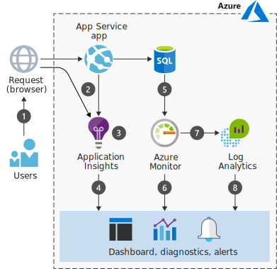

# Monitoraggio delle applicazioni Web in AzureWeb application monitoring on Azure

Le offerte PaaS (Platform as a Service) di Azure gestiscono automaticamente le risorse di calcolo e influiscono sulle modalità di monitoraggio delle distribuzioni.Azure platform as a service (PaaS) offerings manage compute resources for you and affect how you monitor deployments. Azure include più servizi di monitoraggio, ognuno dei quali esegue un ruolo specifico.Azure includes multiple monitoring services, each of which performs a specific role. Insieme, questi servizi offrono una soluzione completa per la raccolta, l'analisi e l'uso dei dati di telemetria provenienti dalle applicazioni e dalle risorse di Azure utilizzate.Together, these services deliver a comprehensive solution for collecting, analyzing, and acting on telemetry from your applications and the Azure resources they consume.

Questo scenario è relativo ai servizi di monitoraggio che è possibile usare e descrive un modello di flusso di dati da usare con più origini dati.This scenario addresses the monitoring services you can use and describes a dataflow model for use with multiple data sources. Quando si parla di monitoraggio, molti strumenti e servizi usano le distribuzioni di Azure.When it comes to monitoring, many tools and services work with Azure deployments. In questo scenario vengono scelti servizi immediatamente disponibili proprio perché sono facili da usare.In this scenario, we choose readily available services precisely because they are easy to consume. Più avanti in questo articolo sono descritte altre opzioni di monitoraggio.Other monitoring options are discussed later in this article.

## Casi d'uso pertinentiRelevant use cases

Gli altri casi d'uso pertinenti includono:Other relevant use cases include:

- Strumentazione di un'applicazione Web per il monitoraggio dei dati di telemetria.Instrumenting a web application for monitoring telemetry.
- Raccolta dei dati di telemetria front-end e back-end per un'applicazione distribuita in Azure.Collecting front-end and back-end telemetry for an application deployed on Azure.
- Monitoraggio delle metriche e delle quote associate ai servizi in Azure.Monitoring metrics and quotas associated with services on Azure.

## ArchitetturaArchitecture

Questo scenario usa un ambiente gestito di Azure per ospitare un livello dati e applicazione.This scenario uses a managed Azure environment to host an application and data tier. Il flusso dei dati nello scenario avviene come segue:The data flows through the scenario as follows:

1. Un utente interagisce con l'applicazione.A user interacts with the application.
2. Il browser e il servizio app generano dati di telemetria.The browser and app service emit telemetry.
3. Application Insights raccoglie e analizza i dati relativi a integrità, prestazioni e utilizzo dell'applicazione.Application Insights collects and analyzes application health, performance, and usage data.
4. Gli sviluppatori e gli amministratori possono esaminare le informazioni su integrità, prestazioni e utilizzo.Developers and administrators can review health, performance, and usage information.
5. Il database SQL di Azure genera i dati di telemetria.Azure SQL Database emits telemetry.
6. Monitoraggio di Azure raccoglie e analizza le quote e le metriche dell'infrastruttura.Azure Monitor collects and analyzes infrastructure metrics and quotas.
7. Log Analytics raccoglie e analizza i log e le metriche.Log Analytics collects and analyzes logs and metrics.
8. Gli sviluppatori e gli amministratori possono esaminare le informazioni su integrità, prestazioni e utilizzo.Developers and administrators can review health, performance, and usage information.

### ComponentiComponents

- [Servizio app di Azure](/azure/app-service/) è un servizio PaaS per la compilazione e l'hosting di app in macchine virtuali gestite.[Azure App Service](/azure/app-service/) is a PaaS service for building and hosting apps in managed virtual machines. Le infrastrutture di calcolo sottostanti in cui vengono eseguite le app sono gestite automaticamente.The underlying compute infrastructures on which your apps run is managed for you. Il servizio app monitora le quote di utilizzo delle risorse e le metriche delle app, registra le informazioni di diagnostica e genera avvisi basati sulle metriche.App Service provides monitoring of resource usage quotas and app metrics, logging of diagnostic information, and alerts based on metrics. Ancora meglio, è possibile usare Application Insights per creare [test di disponibilità][availability-tests] per testare l'applicazione da aree diverse.Even better, you can use Application Insights to create [availability tests][availability-tests] for testing your application from different regions.
- [Application Insights][application-insights] è un servizio estendibile di gestione delle prestazioni delle applicazioni per sviluppatori e supporta più piattaforme.[Application Insights][application-insights] is an extensible Application Performance Management (APM) service for developers and supports multiple platforms. Monitora l'applicazione, rileva le anomalie dell'applicazione, ad esempio un peggioramento delle prestazioni ed errori, e invia i dati di telemetria al portale di Azure.It monitors the application, detects application anomalies such as poor performance and failures, and sends telemetry to the Azure portal. Application Insights è anche utilizzabile per la registrazione, l'analisi distribuita e le metriche dell'applicazione personalizzate.Application Insights can also be used for logging, distributed tracing, and custom application metrics.
- Attualmente [Monitoraggio di Azure][azure-monitor] offre [log e metriche][metrics] dell'infrastruttura di livello base per la maggior parte dei servizi in Azure.[Azure Monitor][azure-monitor] provides base-level infrastructure [metrics and logs][metrics] for most services in Azure. È possibile interagire con le metriche in diversi modi, tra cui la creazione di grafici nel portale di Azure, l'accesso tramite l'API REST o l'esecuzione di query tramite PowerShell o l'interfaccia della riga di comando.You can interact with the metrics in several ways, including charting them in Azure portal, accessing them through the REST API, or querying them using PowerShell or CLI. Monitoraggio di Azure offre anche i dati direttamente in [Log Analytics e altri servizi], in cui è possibile eseguire query e combinarli con i dati di altre origini in locale o nel cloud.Azure Monitor also offers its data directly into [Log Analytics and other services], where you can query and combine it with data from other sources on premises or in the cloud.
- [Log Analytics][log-analytics] aiuta a correlare i dati sull'utilizzo e sulle prestazioni raccolti da Application Insights ai dati di configurazione e sulle prestazioni delle risorse di Azure che supportano l'app.[Log Analytics][log-analytics] helps correlate the usage and performance data collected by Application Insights with configuration and performance data across the Azure resources that support the app. Questo scenario usa l'[agente di Azure Log Analytics][Azure Log Analytics agent] per eseguire il push dei log di controllo di SQL Server in Log Analytics.This scenario uses the [Azure Log Analytics agent][Azure Log Analytics agent] to push SQL Server audit logs into Log Analytics. È possibile scrivere le query e visualizzare i dati nel pannello Log Analytics del portale di Azure.You can write queries and view data in the Log Analytics blade of the Azure portal.

## ConsiderazioniConsiderations

È consigliabile aggiungere Application Insights al codice durante lo sviluppo usando [Application Insights SDK][Application Insights SDKs] ed eseguendo la personalizzazione per ogni applicazione.A recommended practice is adding Application Insights to your code during development using the [Application Insights SDKs][Application Insights SDKs], and customizing per application. Questi SDK open source sono disponibili per la maggior parte dei framework applicazioni.These open-source SDKs are available for most application frameworks. Per arricchire e controllare i dati raccolti, incorporare l'uso degli SDK sia per le distribuzioni di test che per quelle di produzione nel processo di sviluppo.To enrich and control the data you collect, incorporate the use of the SDKs both for testing and production deployments into your development process. Il requisito principale è che l'app possa visualizzare direttamente o indirettamente l'endpoint di inserimento di Application Insights ospitato con un indirizzo per Internet.The main requirement is for the app to have a direct or indirect line of sight to the Applications Insights ingestion endpoint hosted with an Internet-facing address. È quindi possibile aggiungere i dati di telemetria o arricchire una raccolta di dati di telemetria esistente.You can then add telemetry or enrich an existing telemetry collection.

Il monitoraggio in fase di esecuzione è un altro modo semplice per iniziare.Runtime monitoring is another easy way to get started. I dati di telemetria raccolti devono essere controllati tramite i file di configurazione.The telemetry that is collected must be controlled through configuration files. È ad esempio possibile includere metodi di runtime che abilitano strumenti come [Application Insights Status Monitor][Application Insights Status Monitor] per distribuire gli SDK nella cartella corretta e aggiungere le configurazioni appropriate per iniziare il monitoraggio.For example, you can include runtime methods that enable tools such as [Application Insights Status Monitor][Application Insights Status Monitor] to deploy the SDKs into the correct folder and add the right configurations to begin monitoring.

Come Application Insights, Log Analytics fornisce strumenti per l'[analisi dei dati nelle origini][analyzing data across sources], la creazione di query complesse e l'[invio di avvisi proattivi][sending proactive alerts] in condizioni specificate.Like Application Insights, Log Analytics provides tools for [analyzing data across sources][analyzing data across sources], creating complex queries, and [sending proactive alerts][sending proactive alerts] on specified conditions. È anche possibile visualizzare i dati di telemetria nel [portale di Azure][the Azure portal].You can also view telemetry in [the Azure portal][the Azure portal]. Log Analytics aggiunge valore ai servizi di monitoraggio esistenti, ad esempio [Monitoraggio di Azure][azure-monitor], e può inoltre monitorare gli ambienti locali.Log Analytics adds value to existing monitoring services such as [Azure Monitor][azure-monitor] and can also monitor on-premises environments.

Sia Application Insights che Log Analytics usano il [linguaggio di query di Azure Log Analytics][Azure Log Analytics Query Language].Both Application Insights and Log Analytics use [Azure Log Analytics Query Language][Azure Log Analytics Query Language]. È anche possibile usare le [query in più risorse](https://azure.microsoft.com/blog/query-across-resources) per analizzare i dati di telemetria raccolti da Application Insights e Log Analytics in un'unica query.You can also use [cross-resource queries](https://azure.microsoft.com/blog/query-across-resources) to analyze the telemetry gathered by Application Insights and Log Analytics in a single query.

Monitoraggio di Azure, Application Insights e Log Analytics inviano [avvisi](/azure/monitoring-and-diagnostics/monitoring-overview-alerts).Azure Monitor, Application Insights, and Log Analytics all send [alerts](/azure/monitoring-and-diagnostics/monitoring-overview-alerts). Ad esempio, Monitoraggio di Azure invia avvisi sulle metriche a livello di piattaforma, come l'utilizzo della CPU, mentre Application Insights invia avvisi sulle metriche a livello di applicazione, come il tempo di risposta del server.For example, Azure Monitor alerts on platform-level metrics such as CPU utilization, while Application Insights alerts on application-level metrics such as server response time. Monitoraggio Azure invia avvisi sui nuovi eventi nel log attività di Azure, mentre Log Analytics può generare avvisi sui dati delle metriche o degli eventi per i servizi configurati per usarli.Azure Monitor alerts on new events in the Azure Activity Log, while Log Analytics can issue alerts about metrics or event data for the services configured to use it. Gli [avvisi unificati in Monitoraggio di Azure](/azure/monitoring-and-diagnostics/monitoring-overview-unified-alerts) sono una nuova esperienza di avvisi unificati in Azure che usa una tassonomia diversa.[Unified alerts in Azure Monitor](/azure/monitoring-and-diagnostics/monitoring-overview-unified-alerts) is a new, unified alerting experience in Azure that uses a different taxonomy.

### AlternativeAlternatives

Questo articolo descrive le opzioni di monitoraggio facilmente disponibili con le funzionalità più diffuse, ma sono possibili molte altre scelte, tra cui l'opzione per creare i propri meccanismi di registrazione.This article describes conveniently available monitoring options with popular features, but you have many choices, including the option to create your own logging mechanisms. È consigliabile aggiungere i servizi di monitoraggio mentre si creano i livelli in una soluzione.A recommended practice is to add monitoring services as you build out tiers in a solution. Ecco alcune possibili estensioni e alternative:Here are some possible extensions and alternatives:

- Consolidare le metriche di Monitoraggio di Azure e Application Insights in Grafana usando l'[origine dati di Monitoraggio di Azure per Grafana][Azure Monitor Data Source For Grafana].Consolidate Azure Monitor and Application Insights metrics in Grafana using the [Azure Monitor Data Source For Grafana][Azure Monitor Data Source For Grafana].
- [Data Dog][data-dog] offre un connettore per Monitoraggio di Azure[Data Dog][data-dog] features a connector for Azure Monitor
- Automatizzare le funzioni di monitoraggio usando [Automazione di Azure][Azure Automation].Automate monitoring functions using [Azure Automation][Azure Automation].
- Aggiungere la comunicazione con le [soluzioni di gestione dei servizi IT][ITSM solutions].Add communication with [ITSM solutions][ITSM solutions].
- Estendere Log Analytics con una [soluzione di gestione][management solution].Extend Log Analytics with a [management solution][management solution].

### Disponibilità e scalabilitàScalability and availability

Questo scenario è in gran parte incentrato sulle soluzioni PaaS per il monitoraggio perché gestiscono facilmente e automaticamente la disponibilità e la scalabilità e sono supportate dai contratti di servizio.This scenario focuses on PaaS solutions for monitoring in large part because they conveniently handle availability and scalability for you and are backed by service-level agreements (SLAs). Servizi app, ad esempio, fornisce un [contratto di servizio][SLA] garantito per la disponibilità.For example, App Services provides a guaranteed [SLA][SLA] for its availability.

Application Insights prevede [limiti][app-insights-limits] per il numero di richieste al secondo che possono essere elaborate.Application Insights has [limits][app-insights-limits] on how many requests can be processed per second. Se si supera il limite di richieste, potrebbe verificarsi la limitazione dei messaggi.If you exceed the request limit, you may experience message throttling. Per evitare tale limitazione, implementare [filtri][message-filtering] o il [campionamento][message-sampling] per ridurre la velocità dati.To prevent throttling, implement [filtering][message-filtering] or [sampling][message-sampling] to reduce the data rate

Le considerazioni sulla disponibilità elevata per l'app eseguita, tuttavia, sono responsabilità dello sviluppatore.High availability considerations for the app you run, however, are the developer's responsibility. Per informazioni sulla scalabilità, ad esempio, vedere la sezione [Considerazioni sulla scalabilità](./basic-web-app.md#scalability-considerations) nell'architettura di riferimento dell'applicazione Web di base.For information about scale, for example, see the [Scalability considerations](./basic-web-app.md#scalability-considerations) section in the basic web application reference architecture. Dopo la distribuzione di un'app, è possibile configurare i test per [monitorarne la disponibilità][monitor its availability] usando Application Insights.After an app is deployed, you can set up tests to [monitor its availability][monitor its availability] using Application Insights.

### SecuritySecurity

I requisiti di conformità e le informazioni sensibili influiscono sulla raccolta, la conservazione e l'archiviazione dei dati.Sensitive information and compliance requirements affect data collection, retention, and storage. Sono disponibili altre informazioni su come [Application Insights][application-insights] e [Log Analytics][log-analytics] gestiscono i dati di telemetria.Learn more about how [Application Insights][application-insights] and [Log Analytics][log-analytics] handle telemetry.

Possono valere anche le considerazioni sulla sicurezza seguenti:The following security considerations may also apply:

- Sviluppare un piano per gestire le informazioni personali se gli sviluppatori possono raccogliere i dati o arricchire i dati di telemetria esistenti.Develop a plan to handle personal information if developers are allowed to collect their own data or enrich existing telemetry.
- Considerare la conservazione dei dati.Consider data retention. Ad esempio, Application Insights conserva i dati di telemetria per 90 giorni.For example, Application Insights retains telemetry data for 90 days. Archiviare i dati a cui si vuole accedere per periodi più lunghi usando Microsoft Power BI, l'esportazione continua o l'API REST.Archive data you want access to for longer periods using Microsoft Power BI, Continuous Export, or the REST API. Si applicano le tariffe di archiviazione.Storage rates apply.
- Limitare l'accesso alle risorse di Azure per controllare l'accesso ai dati e chi può visualizzare i dati di telemetria da un'applicazione specifica.Limit access to Azure resources to control access to data and who can view telemetry from a specific application. Per consentire il blocco dell'accesso al monitoraggio dei dati di telemetria, vedere [Risorse, ruoli e controllo di accesso in Application Insights][Resources, roles, and access control in Application Insights].To help lock down access to monitoring telemetry, see [Resources, roles, and access control in Application Insights][Resources, roles, and access control in Application Insights].
- Considerare la possibilità di controllare l'accesso in lettura/scrittura nel codice dell'applicazione per impedire agli utenti di aggiungere marcatori di versione o tag che limitano l'inserimento dati dall'applicazione.Consider whether to control read/write access in application code to prevent users from adding version or tag markers that limit data ingestion from the application. Con Application Insights, non è possibile controllare i singoli elementi di dati dopo che sono stati inviati a una risorsa, quindi, se un utente ha accesso ad alcuni dati, ha accesso a tutti i dati in una singola risorsa.With Application Insights, there is no control over individual data items once they are sent to a resource, so if a user has access to any data, they have access to all data in an individual resource.
- Aggiungere meccanismi di [governance](/azure/security/governance-in-azure) per applicare controlli per i criteri o i costi nelle risorse di Azure, se necessario.Add [governance](/azure/security/governance-in-azure) mechanisms to enforce policy or cost controls over Azure resources if needed. Ad esempio, usare Log Analytics per il monitoraggio relativo alla sicurezza, ad esempio con criteri e controllo degli accessi in base al ruolo, oppure usare [Criteri di Azure](/azure/azure-policy/azure-policy-introduction) per creare, assegnare e gestire le definizioni dei criteri.For example, use Log Analytics for security-related monitoring such as policies and role-based access control, or use [Azure Policy](/azure/azure-policy/azure-policy-introduction) to create, assign and, manage policy definitions.
- Per monitorare i potenziali problemi di sicurezza e ottenere un punto di vista centralizzato sullo stato della sicurezza delle risorse di Azure, valutare la possibilità di usare [Centro sicurezza di Azure](/azure/security-center/security-center-intro).To monitor potential security issues and get a central view of the security state of your Azure resources, consider using [Azure Security Center](/azure/security-center/security-center-intro).

## PrezziPricing

Poiché i costi di monitoraggio possono sommarsi rapidamente, tenere in considerazione i prezzi fin dall'inizio, determinare che cosa si sta monitorando e controllare le tariffe associate per ogni servizio.Monitoring charges can add up quickly, so consider pricing up front, understand what you are monitoring, and check the associated fees for each service. Monitoraggio di Azure fornisce gratuitamente le [metriche di base][basic metrics], mentre i costi di monitoraggio per [Application Insights][application-insights-pricing] e [Log Analytics][log-analytics] dipendono dalla quantità di dati inseriti e dal numero di test eseguiti.Azure Monitor provides [basic metrics][basic metrics] at no cost, while monitoring costs for [Application Insights][application-insights-pricing] and [Log Analytics][log-analytics] are based on the amount of data ingested and the number of tests you run.

Per iniziare, usare il [calcolatore dei prezzi][pricing] per valutare i costi.To help you get started, use the [pricing calculator][pricing] to estimate costs. Per verificare la variazione dei prezzi per un determinato caso d'uso, modificare le diverse opzioni in base alla distribuzione prevista.To see how the pricing would change for your particular use case, change the various options to match your expected deployment.

I dati di telemetria da Application Insights vengono inviati al portale di Azure durante il debug e dopo la pubblicazione dell'app.Telemetry from Application Insights is sent to the Azure portal during debugging and after you have published your app. A scopo di test e per evitare addebiti non necessari, viene instrumentato un volume limitato di dati di telemetria.For testing purposes and to avoid charges, a limited volume of telemetry is instrumented. Per aggiungere altri indicatori, è possibile aumentare il limite dei dati di telemetria.To add more indicators, you can raise the telemetry limit. Per un controllo più granulare, vedere [Campionamento in Application Insights][Sampling in Application Insights].For more granular control, see [Sampling in Application Insights][Sampling in Application Insights].

Dopo la distribuzione, è possibile osservare un'istanza di [Live Metrics Stream][Live Metrics Stream] per gli indicatori delle prestazioni.After deployment, you can watch a [Live Metrics Stream][Live Metrics Stream] of performance indicators. Questi dati non vengono archiviati, perché si visualizzano le metriche in tempo reale, ma i dati di telemetria possono essere raccolti e analizzati in un secondo momento.This data is not stored &mdash; you are viewing real-time metrics &mdash; but the telemetry can be collected and analyzed later. Non sono previste spese per i dati di Live Stream.There is no charge for Live Stream data.

La fatturazione di Log Analytics si basa su ogni gigabyte (GB) di dati inseriti nel servizio.Log Analytics is billed per gigabyte (GB) of data ingested into the service. I primi 5 GB di dati inseriti nel servizio Azure Log Analytics ogni mese sono gratuiti e i dati vengono conservati senza alcun addebito per i primi 31 giorni nell'area di lavoro Log Analytics.The first 5 GB of data ingested to the Azure Log Analytics service every month is offered free, and the data is retained at no charge for first 31 days in your Log Analytics workspace.

## Passaggi successiviNext steps

Vedere queste risorse progettate per poter iniziare con la propria soluzione di monitoraggio:Check out these resources designed to help you get started with your own monitoring solution:

[Architettura di riferimento per le applicazioni Web di base][Basic web application reference architecture][Basic web application reference architecture][Basic web application reference architecture]

[Iniziare a monitorare l'applicazione Web ASP.NET][Start monitoring your ASP.NET Web Application][Start monitoring your ASP.NET Web Application][Start monitoring your ASP.NET Web Application]

[Raccogliere dati sulle macchine virtuali di Azure][Collect data about Azure Virtual Machines][Collect data about Azure Virtual Machines][Collect data about Azure Virtual Machines]

## Risorse correlateRelated resources

[Monitoraggio di applicazioni e risorse di Azure][Monitoring Azure applications and resources][Monitoring Azure applications and resources][Monitoring Azure applications and resources]

[Rilevare e diagnosticare le eccezioni di runtime con Azure Application Insights][Find and diagnose run-time exceptions with Azure Application Insights][Find and diagnose run-time exceptions with Azure Application Insights][Find and diagnose run-time exceptions with Azure Application Insights]

<!-- links -->
[architecture]: ./images/architecture-diagram-app-monitoring.svg
[availability-tests]: /azure/application-insights/app-insights-monitor-web-app-availability
[application-insights]: /azure/application-insights/app-insights-overview
[azure-monitor]: /azure/monitoring-and-diagnostics/monitoring-overview-azure-monitor
[metrics]: /azure/monitoring-and-diagnostics/monitoring-supported-metrics
[Log Analytics e altri servizi]: /azure/log-analytics/log-analytics-azure-storage
[Log Analytics and other services]: /azure/log-analytics/log-analytics-azure-storage
[log-analytics]: /azure/log-analytics/log-analytics-overview
[Azure Log Analytics agent]: https://blogs.msdn.microsoft.com/sqlsecurity/2017/12/28/azure-log-analytics-oms-agent-now-collects-sql-server-audit-logs/
[application-insights-pricing]: https://azure.microsoft.com/pricing/details/application-insights/
[Application Insights SDKs]: /azure/application-insights/app-insights-asp-net
[Application Insights Status Monitor]: https://azure.microsoft.com/updates/application-insights-status-monitor-and-sdk-updated/
[analyzing data across sources]: /azure/log-analytics/log-analytics-dashboards
[sending proactive alerts]: /azure/log-analytics/log-analytics-alerts
[the Azure portal]: /azure/log-analytics/log-analytics-tutorial-dashboards
[Azure Log Analytics Query Language]: https://docs.loganalytics.io/docs/Learn
[cross-resource queries]: https://azure.microsoft.com/blog/query-across-resources/
[alerts]: /azure/monitoring-and-diagnostics/monitoring-overview-alerts
[Alerts (Preview)]: /azure/monitoring-and-diagnostics/monitoring-overview-unified-alerts
[Azure Monitor Data Source For Grafana]: https://grafana.com/plugins/grafana-azure-monitor-datasource
[Azure Automation]: /azure/automation/automation-intro
[ITSM solutions]: https://azure.microsoft.com/blog/itsm-connector-for-azure-is-now-generally-available/
[management solution]: /azure/monitoring/monitoring-solutions
[SLA]: https://azure.microsoft.com/support/legal/sla/app-service/v1_4/
[monitor its availability]: /azure/application-insights/app-insights-monitor-web-app-availability
[Resources, roles, and access control in Application Insights]: /azure/application-insights/app-insights-resources-roles-access-control
[basic metrics]: /azure/monitoring-and-diagnostics/monitoring-supported-metrics
[pricing]: https://azure.microsoft.com/pricing/calculator/#log-analyticsc126d8c1-ec9c-4e5b-9b51-4db95d06a9b1
[Sampling in Application Insights]: /azure/application-insights/app-insights-sampling
[Live Metrics Stream]: /azure/application-insights/app-insights-live-stream
[Basic web application reference architecture]: /azure/architecture/reference-architectures/app-service-web-app/basic-web-app#scalability-considerations
[Start monitoring your ASP.NET Web Application]: /azure/application-insights/quick-monitor-portal
[Collect data about Azure Virtual Machines]: /azure/log-analytics/log-analytics-quick-collect-azurevm
[Monitoring Azure applications and resources]: /azure/monitoring-and-diagnostics/monitoring-overview
[Find and diagnose run-time exceptions with Azure Application Insights]: /azure/application-insights/app-insights-tutorial-runtime-exceptions
[data-dog]: https://www.datadoghq.com/blog/azure-monitoring-enhancements/
[app-insights-limits]: /azure/azure-subscription-service-limits#application-insights-limits
[message-filtering]: /azure/application-insights/app-insights-api-filtering-sampling
[message-sampling]: /azure/application-insights/app-insights-sampling
