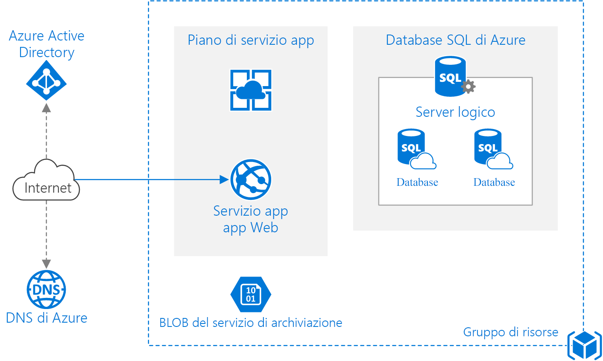

# <a name="run-a-basic-web-application-in-azure"></a>Esecuzione di un'applicazione Web di base in Azure

Questa architettura di riferimento mostra alcune procedure collaudate per un'applicazione Web che usa [Servizio app di Azure][app-service] e [Database SQL di Azure][sql-db]. [**Distribuire questa soluzione**](#deploy-the-solution).



*Scaricare un [file Visio][visio-download] di questa architettura.*

## <a name="architecture"></a>Architettura

> [!NOTE]
> Questa architettura non è incentrata sullo sviluppo delle applicazioni e non usa uno specifico framework applicazione, ma ha piuttosto l'obiettivo di comprendere l'interazione tra i diversi servizi di Azure.
>

L'architettura include i componenti seguenti:

- **Gruppo di risorse**. Un [gruppo di risorse](/azure/azure-resource-manager/resource-group-overview) è un contenitore logico per le risorse di Azure.

- **App del servizio app**. [Servizio app di Azure][app-service] è una piattaforma completamente gestita per la creazione e la distribuzione di applicazioni cloud.

- **Piano di servizio app**. Un [piano di servizio app][app-service-plans] fornisce le macchine virtuali (VM) gestite che ospitano l'app. Tutte le app associate a un piano vengono eseguite nelle stesse istanze della macchina virtuale.

- **Slot di distribuzione**.  Uno [slot di distribuzione][deployment-slots] consente di gestire temporaneamente una distribuzione e quindi scambiarla con la distribuzione di produzione. In questo modo è possibile evitare di eseguire la distribuzione direttamente nell'ambiente di produzione. Per consigli specifici, vedere la sezione [Gestibilità](#manageability-considerations).

- **Indirizzo IP**. L'app del servizio app è associata a un indirizzo IP pubblico e a un nome di dominio. Il nome di dominio è un sottodominio di `azurewebsites.net`, ad esempio `contoso.azurewebsites.net`.

- **DNS di Azure**. [DNS di Azure][azure-dns] è un servizio di hosting per i domini DNS, che fornisce la risoluzione dei nomi usando l'infrastruttura di Microsoft Azure. Ospitando i domini in Azure, è possibile gestire i record DNS usando le stesse credenziali, API, strumenti e fatturazione come per gli altri servizi Azure. Per usare un nome di dominio personalizzato, ad esempio `contoso.com`, creare record DNS che eseguono il mapping del nome di dominio personalizzato all'indirizzo IP. Per ulteriori informazioni, vedere [Configurare un nome di dominio personalizzato nel servizio app di Azure][custom-domain-name].

- **Database SQL di Azure**. Il [database SQL][sql-db] è un database relazionale distribuito come servizio nel cloud. Il database SQL condivide la base di codice con il motore di database di Microsoft SQL Server. A seconda dei requisiti dell'applicazione, è anche possibile usare [Database di Azure per MySQL](/azure/mysql) o [Database di Azure per PostgreSQL](/azure/postgresql). Questi sono servizi di database completamente gestiti rispettivamente basati sui motori di database open source MySQL Server e Postgres.

- **Server logico**. Nel database SQL di Azure un server logico ospita i database. È possibile creare più database per ogni server logico.

- **Archiviazione di Azure**. Creare un account di archiviazione di Azure con un contenitore BLOB per archiviare i log di diagnostica.

- **Azure Active Directory (Azure AD)**. Usare Azure AD o un altro provider di identità per l'autenticazione.

## <a name="recommendations"></a>Consigli

I requisiti della propria organizzazione potrebbero essere diversi da quelli dell'architettura descritta in questo articolo. Seguire le raccomandazioni contenute in questa sezione come punto di partenza.

### <a name="app-service-plan"></a>Piano di servizio app

Usare i livelli Standard o Premium in quanto supportano la scalabilità orizzontale, la scalabilità automatica e il protocollo SSL (Secure Socket Layer). Ogni livello supporta diverse *dimensioni di istanza* che differiscono per numero di core e memoria. Dopo aver creato un piano è possibile modificare il livello o la dimensione dell'istanza. Per altre informazioni sui piani di servizio app, vedere [Prezzi di Servizio App][app-service-plans-tiers].

All'utente vengono addebitate le istanze del piano di servizio app anche se l'app viene arrestata. Assicurarsi di eliminare i piani che non vengono usati, ad esempio le distribuzioni di prova.

### <a name="sql-database"></a>Database SQL

Usare la [versione V12][sql-db-v12] del database SQL. Il database SQL supporta i [livelli di servizio ][sql-db-service-tiers] Basic, Standard e Premium con più livelli di prestazioni all'interno di ciascuno di essi, misurati in [DTU (Database Transaction Unit)][sql-dtu]. Eseguire la pianificazione delle capacità e scegliere un livello di prestazioni che soddisfi i propri requisiti.

### <a name="region"></a>Region

Eseguire il provisioning del piano di servizio app e del database SQL nella stessa area per ridurre al minimo la latenza di rete. In genere, è consigliabile selezionare l'area più vicina agli utenti.

Anche il gruppo di risorse è associato a un'area, che specifica dove vengono archiviati i metadati di distribuzione. Inserire il gruppo e le relative risorse nella stessa area, per provare a migliorare la disponibilità durante la distribuzione.

## <a name="scalability-considerations"></a>Considerazioni sulla scalabilità

Uno dei vantaggi principali del servizio app di Azure è la possibilità di scalare l'applicazione in base al carico. Ecco alcune considerazioni da tenere presenti quando si pianifica la scalabilità dell'applicazione.

### <a name="scaling-the-app-service-app"></a>Scalabilità dell'app del servizio app

Esistono due modi per scalare un'app del servizio app:

- Tramite *scalabilità verticale*, ovvero modificando la dimensione dell'istanza. La dimensione dell'istanza determina la memoria, il numero di core e l'archiviazione in ogni istanza della macchina virtuale. È possibile scalare verticalmente in modo manuale modificando la dimensione dell'istanza o il livello di piano.

- Tramite *Scalabilità orizzontale*, ovvero l'aggiunta di istanze per gestire carichi maggiori. Ogni livello tariffario prevede un numero massimo di istanze.

  È possibile scalare orizzontalmente in modo manuale, modificando il numero di istanze oppure usare la [scalabilità automatica][web-app-autoscale] per far sì che Azure aggiunga o rimuova automaticamente le istanze in base a una pianificazione e/o alle metriche delle prestazioni. Ogni operazione di ridimensionamento avviene rapidamente, in genere in pochi secondi.

  Per abilitare la scalabilità automatica, creare un *profilo* di scalabilità automatica che definisca il numero minimo e massimo di istanze. È possibile pianificare i profili. È ad esempio possibile creare profili distinti per i giorni della settimana e per i fine settimana. Facoltativamente, un profilo può contenere le regole relative all'aggiunta o alla rimozione delle istanze. (Esempio: una regola per aggiungere due istanze se l'uso della CPU è superiore al 70% per 5 minuti.)

Consigli per la scalabilità di un'app Web:

- Per quanto possibile, evitare di scalare verticalmente e orizzontalmente in quanto questa operazione potrebbe attivare un riavvio dell'applicazione. In alternativa, selezionare un livello e una dimensione che soddisfino i propri requisiti prestazionali in condizioni di carico tipico e quindi scalare orizzontalmente le istanze per gestire le modifiche nel volume di traffico.
- Abilitare la scalabilità automatica. Se l'applicazione presenta un carico di lavoro regolare e prevedibile, creare profili per pianificare i conteggi delle istanze anticipatamente. Se il carico di lavoro non è prevedibile, usare la scalabilità automatica basata sulle regole per rispondere alle variazioni di carico che si verificano. È possibile combinare entrambi gli approcci.
- L'uso della CPU è in genere una buona metrica per le regole di scalabilità automatica. È tuttavia necessario testare il carico dell'applicazione, identificare potenziali colli di bottiglia e basare le regole di scalabilità automatica su tali dati.
- Le regole di scalabilità automatica includono un periodo di *raffreddamento*, ovvero l'intervallo di attesa al termine di un'azione di ridimensionamento prima dell'avvio di una nuova azione di questo tipo. Il periodo di raffreddamento consente di stabilizzare il sistema prima di una nuova azione di ridimensionamento. Impostare un periodo di raffreddamento più breve per l'aggiunta delle istanze e uno più lungo per la relativa rimozione. Impostare, ad esempio, 5 minuti per aggiungere un'istanza e 60 minuti per rimuoverla. In condizioni di carico elevato, è preferibile aggiungere rapidamente nuove istanze per gestire il traffico aggiuntivo e quindi ridurle gradualmente.

### <a name="scaling-sql-database"></a>Ridimensionamento del database SQL

Se è necessario un livello di servizio o di prestazioni superiore per il database SQL, è possibile scalare verticalmente i singoli database senza tempi di inattività dell'applicazione. Per altre informazioni vedere [Prestazioni e opzioni del database SQL: riconoscimento delle offerte in ogni livello di servizio][sql-db-scale].

## <a name="availability-considerations"></a>Considerazioni sulla disponibilità

Al momento della scrittura, il contratto di servizio (SLA) per il servizio app è pari al 99,95% e il contratto di servizio per il database SQL è pari al 99,99% per i livelli Basic, Standard e Premium.

> [!NOTE]
> Il contratto di servizio del servizio app si applica a una o più istanze.
>

### <a name="backups"></a>Backup

In caso di perdita di dati, il database SQL offre funzionalità di ripristino temporizzato e geografico. Tali funzionalità sono disponibili in tutti i livelli e vengono abilitate automaticamente. Non è necessario pianificare o gestire i backup.

- Usare il ripristino temporizzato per eseguire il [ripristino da un errore umano][sql-human-error] e riportare il database a un determinato momento precedente.
- Usare il ripristino geografico per eseguire il [ripristino da un'interruzione del servizio] [ sql-outage-recovery] recuperando un database da un backup con ridondanza geografica.

Per altre informazioni, vedere l'articolo relativo alla [continuità aziendale del cloud e al ripristino di emergenza del database con database SQL][sql-backup].

Il servizio app offre una funzionalità di [backup e ripristino][web-app-backup] per i file dell'applicazione. È tuttavia necessario tenere presente che i file di backup includono impostazioni dell'app in testo normale che possono includere segreti quali le stringhe di connessione. Evitare di usare la funzionalità di backup del servizio app per eseguire il backup dei database SQL perché il database viene esportato in un file SQL con estensione BACPAC, consumando le [DTU][sql-dtu] disponibili. Al suo posto, usare il ripristino temporizzato del database SQL descritto sopra.

## <a name="manageability-considerations"></a>Considerazioni sulla gestibilità

Creare gruppi di risorse separati per gli ambienti di produzione, sviluppo e test. Questo semplifica la gestione delle distribuzioni, l'eliminazione delle distribuzioni dei test e l'assegnazione dei diritti di accesso.

Quando si assegnano risorse a gruppi di risorse, considerare quanto segue:

- Ciclo di vita. In generale, includere le risorse con un ciclo di vita identico nello stesso gruppo di risorse.
- Accesso. È possibile usare il [controllo degli accessi in base al ruolo][rbac] (RBAC) per applicare i criteri di accesso alle risorse in un gruppo.
- Fatturazione. È possibile visualizzare il riepilogo dei costi per il gruppo di risorse.

Per altre informazioni, vedere [Panoramica di Azure Resource Manager](/azure/azure-resource-manager/resource-group-overview).

### <a name="deployment"></a>Distribuzione

La distribuzione prevede due passaggi:

1. Provisioning delle risorse di Azure. Per questo passaggio è consigliabile usare i [modelli di Azure Resource Manager][arm-template]. Questi modelli semplificano l'automazione delle distribuzioni tramite PowerShell o l'interfaccia della riga di comando di Azure.
2. Distribuzione dell'applicazione (codice, file binari e file di contenuto). Sono disponibili diverse opzioni, tra cui la distribuzione da un archivio Git locale, tramite Visual Studio, o la distribuzione continua dal controllo del codice sorgente basato su cloud. Vedere l'articolo relativo alla [distribuzione dell'app nel servizio app di Azure][deploy].

Un'app del servizio app ha sempre uno slot di distribuzione denominato `production`, che rappresenta il sito di produzione in tempo reale. È consigliabile creare uno slot di gestione temporanea per la distribuzione degli aggiornamenti. I vantaggi dell'utilizzo di uno slot di gestione temporanea includono:

- È possibile verificare l'esito della distribuzione prima dello scambio nell'ambiente di produzione.
- La distribuzione in uno slot di gestione temporanea consente di eseguire il riscaldamento di tutte le istanze prima che vengano scambiate nell'ambiente di produzione. Molte applicazioni presentano tempi di riscaldamento e di avvio a freddo piuttosto lunghi.

È inoltre consigliabile creare un terzo slot per contenere l'ultima distribuzione valida. Dopo lo scambio tra gestione temporanea e produzione, spostare la distribuzione della produzione precedente (ora in gestione temporanea) nell'ultimo slot valido. In questo modo, in caso di problemi successivi, sarà possibile ripristinare l'ultima versione valida.

![[1]][1]

Se si ripristina una versione precedente, assicurarsi che le modifiche allo schema del database siano compatibili con le versioni precedenti.

Non usare gli slot nella distribuzione della produzione per il test, perché tutte le applicazioni include nello stesso piano del servizio app condividono le stesse istanze della macchina virtuale. I test di carico, ad esempio, potrebbero compromettere il sito di produzione in tempo reale. Creare invece piani del servizio app separati per gli ambienti di produzione e di test. Se si inseriscono le distribuzioni di test in un piano separato, le si isola dalla versione di produzione.

### <a name="configuration"></a>Configurazione

Archiviare le impostazioni di configurazione come [impostazioni app][app-settings]. Definire le impostazioni dell'app nei modelli di Resource Manager o con PowerShell. In fase di runtime, le impostazioni dell'app sono disponibili come variabili di ambiente.

Non archiviare mai le password, le chiavi di accesso o le stringhe di connessione nel controllo del codice sorgente, ma passarle come parametri in uno script di distribuzione che archivia questi valori come impostazioni dell'app.

Durante lo scambio di uno slot di distribuzione, le impostazioni dell'app vengono scambiate per impostazione predefinita. Se sono necessarie impostazioni diverse per la produzione e la gestione temporanea, è possibile creare impostazioni dell'app che rimangono associate a uno slot e non vengono scambiate.

### <a name="diagnostics-and-monitoring"></a>Diagnostica e monitoraggio

Abilitare la [registrazione diagnostica][diagnostic-logs], includendo la registrazione delle applicazioni e del server Web. Configurare la registrazione per l'uso dell'archiviazione BLOB. Per prestazioni ottimali, creare un account di archiviazione separato per i log di diagnostica. Non usare lo stesso account di archiviazione per i log e i dati dell'applicazione. Per informazioni più dettagliate sulla registrazione, vedere l'articolo sulle [linee guida di monitoraggio e diagnostica][monitoring-guidance].

Usare un servizio, quale [New Relic] [ new-relic] o [Application Insights] [ app-insights], per monitorare le prestazioni e il comportamento dell'applicazione in condizioni di carico. Tenere presenti i [limiti di velocità dati][app-insights-data-rate] per Application Insights.

Eseguire il test di carico usando uno strumento come [Azure DevOps][azure-devops] o [Visual Studio Team Foundation Server][tfs]. Per una panoramica generale dell'analisi delle prestazioni nelle applicazioni cloud, vedere l'articolo relativo alle [nozioni di base sull'analisi delle prestazioni][perf-analysis].

Suggerimenti per la risoluzione dei problemi dell'applicazione:

- Usare il [pannello della risoluzione dei problemi] [ troubleshoot-blade] nel portale di Azure per trovare le soluzioni ai problemi più comuni.
- Abilitare i [flussi di registrazione][web-app-log-stream] per visualizzare le informazioni di registrazione quasi in tempo reale.
- Il [dashboard Kudu][kudu] include diversi strumenti per il monitoraggio e il debug dell'applicazione. Per altre informazioni, vedere il post di blog relativo agli [strumenti online di Siti Web di Azure che è opportuno conoscere][kudu]. È possibile raggiungere il dashboard Kudu dal portale di Azure. Aprire il pannello per l'app e fare clic su **Strumenti**, quindi su **Kudu**.
- Se si usa Visual Studio, vedere l'articolo su come [risolvere i problemi relativi a un'app web nel servizio app di Azure con Visual Studio][troubleshoot-web-app] per suggerimenti per il debug e la risoluzione dei problemi.

## <a name="security-considerations"></a>Considerazioni relative alla sicurezza

Questa sezione contiene alcune considerazioni sulla sicurezza specifiche dei servizi di Azure descritti in questo articolo. Non è un elenco completo delle procedure di sicurezza consigliate. Per alcune considerazioni aggiuntive sulla sicurezza, vedere [Garantire la sicurezza di un'app in Servizio app di Azure][app-service-security].

### <a name="sql-database-auditing"></a>Controllo del database SQL

Il controllo consente di agevolare la conformità alle normative e ottenere informazioni su eventuali discrepanze e anomalie che potrebbero indicare problemi aziendali o sospette violazioni della sicurezza. Vedere [Introduzione al controllo del database SQL][sql-audit].

### <a name="deployment-slots"></a>Slot di distribuzione

Ogni slot di distribuzione è associato un indirizzo IP pubblico. Proteggere gli slot non di produzione usando le credenziali di accesso di [Azure Active Directory][aad-auth] in modo che solo i membri dei team di sviluppo e DevOps possano raggiungere tali endpoint.

### <a name="logging"></a>Registrazione

I registri non devono mai registrare le password degli utenti o altre informazioni che potrebbero essere usate per commettere furti di identità. Eseguire lo scrubbing di questi dettagli dai dati prima di archiviarli.

### <a name="ssl"></a>SSL

Un'app del servizio app include un endpoint SSL di un sottodominio di `azurewebsites.net` senza alcun costo aggiuntivo. L'endpoint SSL include un certificato con caratteri jolly per il nome di dominio `*.azurewebsites.net`. Se si usa un nome di dominio personalizzato, è necessario specificare un certificato corrispondente al dominio personalizzato. L'approccio più semplice consiste nell'acquistare un certificato direttamente tramite il portale di Azure. È inoltre possibile importare i certificati da altre autorità di certificazione. Per altre informazioni, vedere l'articolo relativo all'[acquisto e alla configurazione di un certificato SSL per il servizio app di Azure][ssl-cert].

Come procedura ottimale di protezione, l'app deve applicare HTTPS mediante il reindirizzamento delle richieste HTTP. È possibile implementare questa procedura all'interno dell'applicazione o usare una regola di riscrittura URL come descritto nell'articolo relativo all'[abilitazione di HTTPS per un'app nel servizio app di Azure][ssl-redirect].

### <a name="authentication"></a>Authentication

È consigliabile eseguire l'autenticazione tramite un provider di identità (IDP), come Azure AD, Facebook, Google o Twitter. Usare OAuth 2 o OpenID Connect (OIDC) per il flusso di autenticazione. Azure AD offre funzionalità che consentono di gestire utenti e gruppi, creare ruoli applicazione, integrare le identità locali e usare i servizi di backend, quali Office 365 e Skype for Business.

Evitare che l'applicazione gestisca gli accessi e le credenziali utente direttamente, in modo da non creare una potenziale superficie di attacco.  Come minimo, è necessario impostare la conferma tramite posta elettronica, il recupero della password, l'autenticazione a più fattori, nonché convalidare la lunghezza della password e archiviare in modo sicuro gli hash delle password. I provider di identità di grandi dimensioni gestiscono tutte queste operazioni per l'utente e si impegnano costantemente a monitorare e migliorare le procedure di sicurezza.

Valutare la possibilità di usare l'[autenticazione del servizio app][app-service-auth] per implementare il flusso di autenticazione OAuth/OIDC. I vantaggi dell'autenticazione del servizio app sono:

- È facile da configurare.
- Non è necessario alcun codice per gli scenari di autenticazione semplici.
- Supporta l'autorizzazione delegata mediante i token di accesso OAuth per l'uso delle risorse per conto dell'utente.
- Offre una cache dei token incorporata.

Alcune limitazioni di autenticazione del servizio app:

- Opzioni di personalizzazione limitate.
- L'autorizzazione delegata è limitata a una sola risorsa di back-end per ogni sessione di accesso.
- Se si usano più IDP, non è disponibile alcun meccanismo predefinito per l'individuazione dell'area di autenticazione.
- Per gli scenari multi-tenant, l'applicazione deve implementare la logica per convalidare l'autorità emittente di token.

## <a name="deploy-the-solution"></a>Distribuire la soluzione

Un modello di Resource Manager per questa architettura è [disponibile in GitHub][paas-basic-arm-template].

Per distribuire il modello tramite PowerShell, eseguire i comandi seguenti:

```powershell
New-AzureRmResourceGroup -Name <resource-group-name> -Location "West US"

$parameters = @{"appName"="<app-name>";"environment"="dev";"locationShort"="uw";"databaseName"="app-db";"administratorLogin"="<admin>";"administratorLoginPassword"="<password>"}

New-AzureRmResourceGroupDeployment -Name <deployment-name> -ResourceGroupName <resource-group-name> -TemplateFile .\PaaS-Basic.json -TemplateParameterObject  $parameters
```

Per altre informazioni, vedere [Distribuire le risorse con i modelli di Azure Resource Manager][deploy-arm-template].

<!-- links -->

[aad-auth]: /azure/app-service-mobile/app-service-mobile-how-to-configure-active-directory-authentication
[app-insights]: /azure/application-insights/app-insights-overview
[app-insights-data-rate]: /azure/application-insights/app-insights-pricing
[app-service]: https://azure.microsoft.com/documentation/services/app-service/
[app-service-auth]: /azure/app-service-api/app-service-api-authentication
[app-service-plans]: /azure/app-service/azure-web-sites-web-hosting-plans-in-depth-overview
[app-service-plans-tiers]: https://azure.microsoft.com/pricing/details/app-service/
[app-service-security]: /azure/app-service-web/web-sites-security
[app-settings]: /azure/app-service-web/web-sites-configure
[arm-template]: /azure/azure-resource-manager/resource-group-overview#resource-groups
[azure-devops]: /azure/devops/
[azure-dns]: /azure/dns/dns-overview
[custom-domain-name]: /azure/app-service-web/web-sites-custom-domain-name
[deploy]: /azure/app-service-web/web-sites-deploy
[deploy-arm-template]: /azure/resource-group-template-deploy
[deployment-slots]: /azure/app-service-web/web-sites-staged-publishing
[diagnostic-logs]: /azure/app-service-web/web-sites-enable-diagnostic-log
[kudu]: https://azure.microsoft.com/blog/windows-azure-websites-online-tools-you-should-know-about/
[monitoring-guidance]: ../../best-practices/monitoring.md
[new-relic]: https://newrelic.com/
[paas-basic-arm-template]: https://github.com/mspnp/reference-architectures/tree/master/managed-web-app/basic-web-app/Paas-Basic/Templates
[perf-analysis]: https://github.com/mspnp/performance-optimization/blob/master/Performance-Analysis-Primer.md
[rbac]: /azure/active-directory/role-based-access-control-what-is
[resource-group]: /azure/azure-resource-manager/resource-group-overview
[sla]: https://azure.microsoft.com/support/legal/sla/
[sql-audit]: /azure/sql-database/sql-database-auditing-get-started
[sql-backup]: /azure/sql-database/sql-database-business-continuity
[sql-db]: https://azure.microsoft.com/documentation/services/sql-database/
[sql-db-overview]: /azure/sql-database/sql-database-technical-overview
[sql-db-scale]: /azure/sql-database/sql-database-service-tiers#scaling-up-or-scaling-down-a-single-database
[sql-db-service-tiers]: /azure/sql-database/sql-database-service-tiers
[sql-db-v12]: /azure/sql-database/sql-database-features
[sql-dtu]: /azure/sql-database/sql-database-service-tiers
[sql-human-error]: /azure/sql-database/sql-database-business-continuity#recover-a-database-after-a-user-or-application-error
[sql-outage-recovery]: /azure/sql-database/sql-database-business-continuity#recover-a-database-to-another-region-from-an-azure-regional-data-center-outage
[ssl-redirect]: /azure/app-service-web/web-sites-configure-ssl-certificate#bkmk_enforce
[sql-resource-limits]: /azure/sql-database/sql-database-resource-limits
[ssl-cert]: /azure/app-service-web/web-sites-purchase-ssl-web-site
[troubleshoot-blade]: https://azure.microsoft.com/updates/self-service-troubleshooting-for-app-service-web-apps-customers/
[tfs]: /tfs/index
[troubleshoot-web-app]: /azure/app-service-web/web-sites-dotnet-troubleshoot-visual-studio
[visio-download]: https://archcenter.blob.core.windows.net/cdn/app-service-reference-architectures.vsdx
[web-app-autoscale]: /azure/app-service-web/web-sites-scale
[web-app-backup]: /azure/app-service-web/web-sites-backup
[web-app-log-stream]: /azure/app-service-web/web-sites-enable-diagnostic-log#streamlogs
[1]: ./images/paas-basic-web-app-staging-slots.png "Swapping slots for production and staging deployments (Scambio di slot per le distribuzioni di produzione e gestione temporanea)"
