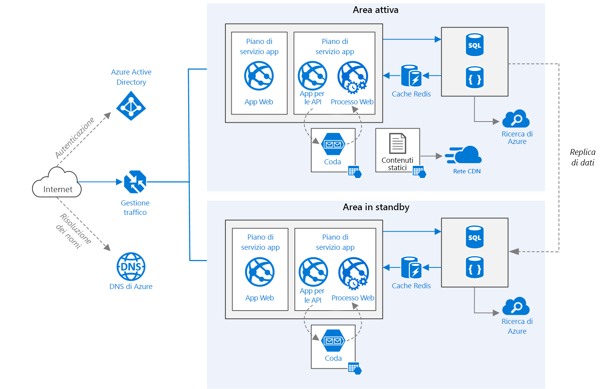

# <a name="run-a-web-application-in-multiple-regions"></a>Eseguire un'applicazione Web in più aree geografiche
[!INCLUDE [header](../../_includes/header.md)]

Questa architettura di riferimento mostra come eseguire un'applicazione del servizio app di Azure in più aree geografiche per ottenere una disponibilità elevata. 

 

*Scaricare un [file Visio][visio-download] di questa architettura.*

## <a name="architecture"></a>Architecture 

Questa architettura si basa su quella illustrata in [Migliorare la scalabilità in un'applicazione Web][guidance-web-apps-scalability]. Le differenze principali sono le seguenti:

* **Aree primarie e secondarie**. Questa architettura si basa sull'uso di due aree per ottenere una maggiore disponibilità. L'applicazione viene distribuita in ognuna delle aree. Durante il normale funzionamento, il traffico di rete viene indirizzato all'area primaria. Se l'area primaria non è più disponibile, il traffico viene indirizzato all'area secondaria. 
* **DNS di Azure**. [DNS di Azure][azure-dns] è un servizio di hosting per i domini DNS, che fornisce la risoluzione dei nomi usando l'infrastruttura di Microsoft Azure. Ospitando i domini in Azure, è possibile gestire i record DNS usando le stesse credenziali, API, strumenti e fatturazione come per gli altri servizi Azure.
* **Gestione traffico di Azure**. [Gestione traffico][traffic-manager] indirizza le richieste in ingresso all'area primaria. Se l'applicazione in esecuzione in tale area non è più disponibile, Gestione traffico effettua il failover all'area secondaria.
* **Replica geografica** del database SQL e di Cosmos DB. 

Un'architettura di tipo multi-area può fornire una maggiore disponibilità rispetto alla distribuzione in un'unica area. Se un'interruzione a livello di area interessa l'area primaria, è possibile usare [Gestione traffico][traffic-manager] per effettuare il failover all'area secondaria. Questa architettura è utile anche in caso di errore di un singolo sottosistema dell'applicazione.

Sono disponibili diversi approcci generali per ottenere una disponibilità elevata tra le diverse aree geografiche: 

* Attivo/passivo con hot standby. Il traffico viene indirizzato a un'area, mentre l'altra attende in modalità hot standby. Hot standby significa che le macchine virtuali nell'area secondaria sono allocate e in esecuzione in qualsiasi momento.
* Attivo/passivo con cold standby. Il traffico viene indirizzato a un'area, mentre l'altra attende in modalità cold standby. Cold standby significa che le macchine virtuali nell'area secondaria non vengono allocate finché non diventa necessario per il failover. Questo approccio presenta costi inferiori in termini di esecuzione, ma in genere richiederà più tempo per portare online le risorse in caso di errore.
* Attivo/attivo. Entrambe le aree sono attive e viene effettuato un bilanciamento del carico tra le richieste. Se un'area non è più disponibile, viene esclusa dalla rotazione. 

Questa architettura di riferimento è incentrata sulla modalità attivo/passivo con hot standby, usando Gestione traffico per il failover. 


## <a name="recommendations"></a>Raccomandazioni

I requisiti della propria organizzazione potrebbero essere diversi da quelli dell'architettura descritta in questo articolo. Seguire le raccomandazioni contenute in questa sezione come punto di partenza.

### <a name="regional-pairing"></a>Coppie di aree
Ogni area di Azure è abbinata a un'altra area con la stessa collocazione geografica. In generale, è consigliabile scegliere aree della stessa coppia di aree (ad esempio, Stati Uniti orientali 2 e Stati Uniti centrali). I vantaggi di questa operazione includono i seguenti:

* In caso di interruzione su vasta scala, viene data priorità al ripristino di almeno un'area di ogni coppia.
* Gli aggiornamenti di sistema di Azure pianificati vengono implementati in sequenza tra le aree abbinate per ridurre al minimo l'eventuale tempo di inattività.
* Nella maggior parte dei casi le coppie di aree si trovano nella stessa area geografica per soddisfare i requisiti di residenza dei dati.

Assicurarsi tuttavia che entrambe le aree supportino tutti i servizi di Azure necessari per l'applicazione. Vedere i [servizi disponibili in base all'area][services-by-region]. Per altre informazioni sulle coppie di aree, vedere [Continuità aziendale e ripristino di emergenza nelle aree geografiche abbinate di Azure][regional-pairs].

### <a name="resource-groups"></a>Gruppi di risorse
È consigliabile collocare l'area primaria, l'area secondaria e Gestione traffico in [gruppi di risorse][resource groups] distinti. In questo modo, è possibile gestire le risorse distribuite in ogni area come raccolta singola.

### <a name="traffic-manager-configuration"></a>Configurazione di Gestione traffico 

**Routing**. Gestione traffico supporta diversi [algoritmi di routing][tm-routing]. Per lo scenario descritto in questo articolo, usare il routing *Priorità* (precedentemente denominato routing *Failover*). Con questa impostazione, Gestione traffico invia tutte le richieste all'area primaria, a meno che l'endpoint per tale area non diventi irraggiungibile. A questo punto, viene automaticamente effettuato il failover all'area secondaria. Vedere [Configurare il metodo di routing failover][tm-configure-failover].

**Probe di integrità**. Gestione traffico usa un probe HTTP (o HTTPS) per monitorare la disponibilità di ogni endpoint. Il probe fornisce a Gestione traffico un test esito positivo/negativo per il failover all'area secondaria, che funziona inviando una richiesta a un percorso URL specificato. In caso di una risposta diversa da 200 entro un periodo di timeout, il probe ha esito negativo. Dopo quattro richieste non riuscite, Gestione traffico contrassegna l'endpoint come danneggiato e viene effettuato il failover all'altro endpoint. Per altre informazioni, vedere [Monitoraggio e failover degli endpoint di Gestione traffico][tm-monitoring].

Come procedura consigliata, creare un endpoint del probe di integrità che segnali l'integrità complessiva dell'applicazione e usare questo endpoint per il probe di integrità. L'endpoint dovrebbe controllare le dipendenze critiche, come le app del servizio app, la coda di archiviazione e il database SQL. In caso contrario, il probe potrebbe segnalare un endpoint integro quando le parti più importanti dell'applicazione in realtà hanno esito negativo.

D'altra parte, non usare il probe di integrità per controllare i servizi con una priorità più bassa. Ad esempio, se un servizio di posta elettronica si arresta, l'applicazione può passare a un secondo provider o semplicemente inviare i messaggi in un secondo momento. Non si tratta di una priorità sufficientemente alta da giustificare il failover dell'applicazione. Per altre informazioni, vedere [Health Endpoint Monitoring Pattern][health-endpoint-monitoring-pattern] (Modello di monitoraggio degli endpoint di integrità).
 
### <a name="sql-database"></a>Database SQL
Usare la [replica geografica attiva][sql-replication] per creare una replica secondaria leggibile in un'area diversa. È possibile avere fino a quattro repliche secondarie leggibili. Effettuare il failover a un database secondario se il database primario presenta un errore o deve essere portato offline. La replica geografica attiva può essere configurata per qualsiasi database in qualsiasi pool di database elastico.

### <a name="cosmos-db"></a>Cosmos DB
Cosmos DB supporta la replica geografica tra le aree geografiche. Un'area viene designata come accessibile in scrittura, mentre le altre sono repliche di sola lettura.

In caso di interruzione a livello di area, è possibile effettuare il failover selezionando un'altra area come area di scrittura. L'SDK del client invia automaticamente richieste di scrittura all'area di scrittura corrente, in modo che non sia necessario aggiornare la configurazione del client dopo un failover. Per altre informazioni, vedere [Come distribuire i dati a livello globale con Azure Cosmos DB][cosmosdb-geo].

> [!NOTE]
> Tutte le repliche appartengono allo stesso gruppo di risorse.
>
>

### <a name="storage"></a>Archiviazione
Per l'Archiviazione di Azure, usare l'[archiviazione con ridondanza geografica e accesso in lettura][ra-grs] (RA-GRS). Con l'archiviazione RA-GRS, i dati vengono replicati in un'area secondaria. È possibile accedere in sola lettura ai dati nell'area secondaria attraverso un endpoint distinto. In caso di interruzione a livello di area o di emergenza, il team di Archiviazione di Azure potrebbe decidere di effettuare un failover geografico all'area secondaria. Non è richiesta alcuna operazione da parte dell'utente per questo failover.

Per l'archiviazione code, creare una coda di backup nell'area secondaria. Durante il failover, l'app può usare la coda di backup finché l'area primaria non risulta nuovamente disponibile. In questo modo, l'applicazione può comunque elaborare nuove richieste.

## <a name="availability-considerations"></a>Considerazioni sulla disponibilità


### <a name="traffic-manager"></a>servizio Gestione traffico

Gestione traffico effettua automaticamente il failover se l'area primaria non è più disponibile. Quando Gestione traffico effettua il failover, per un periodo di tempo i client non riescono a raggiungere l'applicazione. La durata di questo periodo è influenzata dai fattori seguenti:

* Il probe di integrità deve rilevare che il data center primario è diventato irraggiungibile.
* I server DNS (Domain Name Service) devono aggiornare i record DNS memorizzati nella cache per l'indirizzo IP, che dipende dalla durata (TTL) DNS. Il valore TTL predefinito è di 300 secondi (5 minuti), ma è possibile configurare questo valore durante la creazione del profilo di Gestione traffico.

Per dettagli, vedere [Informazioni sul monitoraggio di Gestione traffico][tm-monitoring].

Gestione traffico è un possibile punto di guasto nel sistema. In caso di interruzione del servizio, i client non riescono ad accedere all'applicazione durante il tempo di inattività. Rivedere il [contratto di servizio (SLA) di Gestione traffico][tm-sla] e determinare se l'uso di Gestione traffico da solo soddisfa i requisiti aziendali per la disponibilità elevata. In caso contrario, provare ad aggiungere un'altra soluzione di gestione del traffico come failback. In caso di errore del servizio Gestione traffico di Azure, modificare i record di nome canonico (CNAME) in DNS in modo da puntare all'altro servizio di gestione del traffico. Questo passaggio deve essere eseguito manualmente e l'applicazione non sarà disponibile finché non vengono propagate le modifiche al DNS.

### <a name="sql-database"></a>Database SQL
L'obiettivo del punto di ripristino (RPO) e il tempo di recupero stimato (ERT) per il database SQL sono documentati in [Panoramica della continuità aziendale del database SQL di Azure][sql-rpo]. 

### <a name="storage"></a>Archiviazione
L'archiviazione con ridondanza geografica e accesso in lettura assicura un'archiviazione permanente, ma è importante comprendere che cosa può accadere durante un'interruzione del servizio:

* Se si verifica un'interruzione dell'archiviazione, ci sarà un periodo di tempo in cui non si avrà accesso in scrittura ai dati. Sarà comunque possibile leggere dall'endpoint secondario durante l'interruzione.
* Se un'interruzione a livello di area o un'emergenza interessa la posizione primaria e non è possibile recuperare i dati, il team di archiviazione di Azure può decidere di effettuare un failover geografico all'area secondaria.
* La replica dei dati nell'area secondaria viene eseguita in modo asincrono. Pertanto, se viene effettuato un failover geografico, è possibile che si verifichi una perdita di dati se i dati non possono essere recuperati dall'area primaria.
* Gli errori temporanei, come un'interruzione della rete, non attiveranno un failover di archiviazione. Progettare l'applicazione in modo che sia resiliente agli errori temporanei. Possibili procedure di mitigazione:
  
  * Leggere dall'area secondaria.
  * Passare temporaneamente a un altro account di archiviazione per le nuove operazioni di scrittura (ad esempio, ai messaggi di coda).
  * Copiare i dati dall'area secondaria a un altro account di archiviazione.
  * Fornire funzionalità ridotte fino al failback del sistema.

Per altre informazioni, vedere [Cosa fare se si verifica un'interruzione di Archiviazione di Azure][storage-outage].

## <a name="manageability-considerations"></a>Considerazioni sulla gestibilità

### <a name="traffic-manager"></a>servizio Gestione traffico

Se Gestione traffico effettua il failover, è consigliabile eseguire un failback manuale invece di implementare un failback automatico. In caso contrario, si potrebbe creare una situazione in cui l'applicazione passa alternativamente da un'area all'altra. Verificare che tutti i sottosistemi dell'applicazione siano integri prima del failback.

Si noti che Gestione traffico effettua automaticamente il failback per impostazione predefinita. Per evitare questa situazione, ridurre manualmente la priorità dell'area primaria dopo un evento di failover. Ad esempio, si supponga che l'area primaria sia di priorità 1 e la secondaria di priorità 2. Dopo un failover, impostare l'area primaria sul livello di priorità 3 per evitare il failback automatico. Quando si è pronti per il cambio, aggiornare la priorità impostandola su 1.

I comandi seguenti consentono di aggiornare la priorità.

**PowerShell**

```bat
$endpoint = Get-AzureRmTrafficManagerEndpoint -Name <endpoint> -ProfileName <profile> -ResourceGroupName <resource-group> -Type AzureEndpoints
$endpoint.Priority = 3
Set-AzureRmTrafficManagerEndpoint -TrafficManagerEndpoint $endpoint
```

Per altre informazioni, vedere [Azure Traffic Manager Cmdlets][tm-ps] (Cmdlet di Gestione traffico di Azure).

**Interfaccia della riga di comando di Azure**

```bat
azure network traffic-manager endpoint set --name <endpoint> --profile-name <profile> --resource-group <resource-group> --type AzureEndpoints --priority 3
```    

### <a name="sql-database"></a>Database SQL
Se nel database primario si verifica un errore, effettuare un failover manuale al database secondario. Vedere [Ripristinare un database SQL di Azure o eseguire il failover in un database secondario][sql-failover]. Il database secondario rimane in sola lettura fino al failover.


<!-- links -->

[azure-sql-db]: https://azure.microsoft.com/documentation/services/sql-database/
[azure-dns]: /azure/dns/dns-overview
[cosmosdb-geo]: /azure/cosmos-db/distribute-data-globally
[guidance-web-apps-scalability]: ./scalable-web-app.md
[health-endpoint-monitoring-pattern]: https://msdn.microsoft.com/library/dn589789.aspx
[ra-grs]: /azure/storage/storage-redundancy#read-access-geo-redundant-storage
[regional-pairs]: /azure/best-practices-availability-paired-regions
[resource groups]: /azure/azure-resource-manager/resource-group-overview#resource-groups
[services-by-region]: https://azure.microsoft.com/regions/#services
[sql-failover]: /azure/sql-database/sql-database-disaster-recovery
[sql-replication]: /azure/sql-database/sql-database-geo-replication-overview
[sql-rpo]: /azure/sql-database/sql-database-business-continuity#sql-database-features-that-you-can-use-to-provide-business-continuity
[storage-outage]: /azure/storage/storage-disaster-recovery-guidance
[tm-configure-failover]: /azure/traffic-manager/traffic-manager-configure-failover-routing-method
[tm-monitoring]: /azure/traffic-manager/traffic-manager-monitoring
[tm-ps]: https://msdn.microsoft.com/library/mt125941.aspx
[tm-routing]: /azure/traffic-manager/traffic-manager-routing-methods
[tm-sla]: https://azure.microsoft.com/support/legal/sla/traffic-manager/v1_0/
[traffic-manager]: https://azure.microsoft.com/services/traffic-manager/
[visio-download]: https://archcenter.blob.core.windows.net/cdn/app-service-reference-architectures.vsdx
