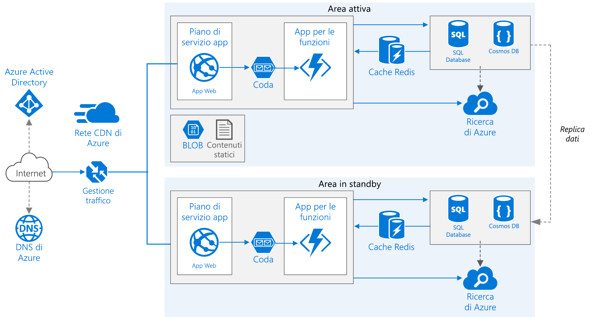

# <a name="run-a-web-application-in-multiple-azure-regions-for-high-availability"></a><span data-ttu-id="5f78e-103">Eseguire un’applicazione in più aree di Azure per una disponibilità elevata</span><span class="sxs-lookup"><span data-stu-id="5f78e-103">Run a web application in multiple Azure regions for high availability</span></span>

<span data-ttu-id="5f78e-104">Questa architettura di riferimento mostra come eseguire un'applicazione del servizio app di Azure in più aree geografiche per ottenere una disponibilità elevata.</span><span class="sxs-lookup"><span data-stu-id="5f78e-104">This reference architecture shows how to run an Azure App Service application in multiple regions to achieve high availability.</span></span>



<span data-ttu-id="5f78e-106">*Scaricare un [file Visio][visio-download] di questa architettura.*</span><span class="sxs-lookup"><span data-stu-id="5f78e-106">*Download a [Visio file][visio-download] of this architecture.*</span></span>

## <a name="architecture"></a><span data-ttu-id="5f78e-107">Architettura</span><span class="sxs-lookup"><span data-stu-id="5f78e-107">Architecture</span></span>

<span data-ttu-id="5f78e-108">Questa architettura si basa su quella illustrata in [Migliorare la scalabilità in un'applicazione Web][guidance-web-apps-scalability].</span><span class="sxs-lookup"><span data-stu-id="5f78e-108">This architecture builds on the one shown in [Improve scalability in a web application][guidance-web-apps-scalability].</span></span> <span data-ttu-id="5f78e-109">Le differenze principali sono le seguenti:</span><span class="sxs-lookup"><span data-stu-id="5f78e-109">The main differences are:</span></span>

- <span data-ttu-id="5f78e-110">**Aree primarie e secondarie**.</span><span class="sxs-lookup"><span data-stu-id="5f78e-110">**Primary and secondary regions**.</span></span> <span data-ttu-id="5f78e-111">Questa architettura si basa sull'uso di due aree per ottenere una maggiore disponibilità.</span><span class="sxs-lookup"><span data-stu-id="5f78e-111">This architecture uses two regions to achieve higher availability.</span></span> <span data-ttu-id="5f78e-112">L'applicazione viene distribuita in ognuna delle aree.</span><span class="sxs-lookup"><span data-stu-id="5f78e-112">The application is deployed to each region.</span></span> <span data-ttu-id="5f78e-113">Durante il normale funzionamento, il traffico di rete viene indirizzato all'area primaria.</span><span class="sxs-lookup"><span data-stu-id="5f78e-113">During normal operations, network traffic is routed to the primary region.</span></span> <span data-ttu-id="5f78e-114">Se l'area primaria non è più disponibile, il traffico viene indirizzato all'area secondaria.</span><span class="sxs-lookup"><span data-stu-id="5f78e-114">If the primary region becomes unavailable, traffic is routed to the secondary region.</span></span>
- <span data-ttu-id="5f78e-115">**DNS di Azure**.</span><span class="sxs-lookup"><span data-stu-id="5f78e-115">**Azure DNS**.</span></span> <span data-ttu-id="5f78e-116">[DNS di Azure][azure-dns] è un servizio di hosting per i domini DNS, che fornisce la risoluzione dei nomi usando l'infrastruttura di Microsoft Azure.</span><span class="sxs-lookup"><span data-stu-id="5f78e-116">[Azure DNS][azure-dns] is a hosting service for DNS domains, providing name resolution using Microsoft Azure infrastructure.</span></span> <span data-ttu-id="5f78e-117">Ospitando i domini in Azure, è possibile gestire i record DNS usando le stesse credenziali, API, strumenti e fatturazione come per gli altri servizi Azure.</span><span class="sxs-lookup"><span data-stu-id="5f78e-117">By hosting your domains in Azure, you can manage your DNS records using the same credentials, APIs, tools, and billing as your other Azure services.</span></span>
- <span data-ttu-id="5f78e-118">**Gestione traffico di Azure**.</span><span class="sxs-lookup"><span data-stu-id="5f78e-118">**Azure Traffic Manager**.</span></span> <span data-ttu-id="5f78e-119">[Gestione traffico][traffic-manager] indirizza le richieste in ingresso all'area primaria.</span><span class="sxs-lookup"><span data-stu-id="5f78e-119">[Traffic Manager][traffic-manager] routes incoming requests to the primary region.</span></span> <span data-ttu-id="5f78e-120">Se l'applicazione in esecuzione in tale area non è più disponibile, Gestione traffico effettua il failover all'area secondaria.</span><span class="sxs-lookup"><span data-stu-id="5f78e-120">If the application running that region becomes unavailable, Traffic Manager fails over to the secondary region.</span></span>
- <span data-ttu-id="5f78e-121">**Replica geografica** del database SQL e di Cosmos DB.</span><span class="sxs-lookup"><span data-stu-id="5f78e-121">**Geo-replication** of SQL Database and Cosmos DB.</span></span>

<span data-ttu-id="5f78e-122">Un'architettura di tipo multi-area può fornire una maggiore disponibilità rispetto alla distribuzione in un'unica area.</span><span class="sxs-lookup"><span data-stu-id="5f78e-122">A multi-region architecture can provide higher availability than deploying to a single region.</span></span> <span data-ttu-id="5f78e-123">Se un'interruzione a livello di area interessa l'area primaria, è possibile usare [Gestione traffico][traffic-manager] per effettuare il failover all'area secondaria.</span><span class="sxs-lookup"><span data-stu-id="5f78e-123">If a regional outage affects the primary region, you can use [Traffic Manager][traffic-manager] to fail over to the secondary region.</span></span> <span data-ttu-id="5f78e-124">Questa architettura è utile anche in caso di errore di un singolo sottosistema dell'applicazione.</span><span class="sxs-lookup"><span data-stu-id="5f78e-124">This architecture can also help if an individual subsystem of the application fails.</span></span>

<span data-ttu-id="5f78e-125">Sono disponibili diversi approcci generali per ottenere una disponibilità elevata tra le diverse aree geografiche:</span><span class="sxs-lookup"><span data-stu-id="5f78e-125">There are several general approaches to achieving high availability across regions:</span></span>

- <span data-ttu-id="5f78e-126">Attivo/passivo con hot standby.</span><span class="sxs-lookup"><span data-stu-id="5f78e-126">Active/passive with hot standby.</span></span> <span data-ttu-id="5f78e-127">Il traffico viene indirizzato a un'area, mentre l'altra attende in modalità hot standby.</span><span class="sxs-lookup"><span data-stu-id="5f78e-127">Traffic goes to one region, while the other waits on hot standby.</span></span> <span data-ttu-id="5f78e-128">Hot standby significa che le macchine virtuali nell'area secondaria sono allocate e in esecuzione in qualsiasi momento.</span><span class="sxs-lookup"><span data-stu-id="5f78e-128">Hot standby means the VMs in the secondary region are allocated and running at all times.</span></span>
- <span data-ttu-id="5f78e-129">Attivo/passivo con cold standby.</span><span class="sxs-lookup"><span data-stu-id="5f78e-129">Active/passive with cold standby.</span></span> <span data-ttu-id="5f78e-130">Il traffico viene indirizzato a un'area, mentre l'altra attende in modalità cold standby.</span><span class="sxs-lookup"><span data-stu-id="5f78e-130">Traffic goes to one region, while the other waits on cold standby.</span></span> <span data-ttu-id="5f78e-131">Cold standby significa che le macchine virtuali nell'area secondaria non vengono allocate finché non diventa necessario per il failover.</span><span class="sxs-lookup"><span data-stu-id="5f78e-131">Cold standby means the VMs in the secondary region are not allocated until needed for failover.</span></span> <span data-ttu-id="5f78e-132">Questo approccio presenta costi inferiori in termini di esecuzione, ma in genere richiederà più tempo per portare online le risorse in caso di errore.</span><span class="sxs-lookup"><span data-stu-id="5f78e-132">This approach costs less to run, but will generally take longer to come online during a failure.</span></span>
- <span data-ttu-id="5f78e-133">Attivo/attivo.</span><span class="sxs-lookup"><span data-stu-id="5f78e-133">Active/active.</span></span> <span data-ttu-id="5f78e-134">Entrambe le aree sono attive e viene effettuato un bilanciamento del carico tra le richieste.</span><span class="sxs-lookup"><span data-stu-id="5f78e-134">Both regions are active, and requests are load balanced between them.</span></span> <span data-ttu-id="5f78e-135">Se un'area non è più disponibile, viene esclusa dalla rotazione.</span><span class="sxs-lookup"><span data-stu-id="5f78e-135">If one region becomes unavailable, it is taken out of rotation.</span></span>

<span data-ttu-id="5f78e-136">Questa architettura di riferimento è incentrata sulla modalità attivo/passivo con hot standby, usando Gestione traffico per il failover.</span><span class="sxs-lookup"><span data-stu-id="5f78e-136">This reference architecture focuses on active/passive with hot standby, using Traffic Manager for failover.</span></span>

## <a name="recommendations"></a><span data-ttu-id="5f78e-137">Consigli</span><span class="sxs-lookup"><span data-stu-id="5f78e-137">Recommendations</span></span>

<span data-ttu-id="5f78e-138">I requisiti della propria organizzazione potrebbero essere diversi da quelli dell'architettura descritta in questo articolo.</span><span class="sxs-lookup"><span data-stu-id="5f78e-138">Your requirements might differ from the architecture described here.</span></span> <span data-ttu-id="5f78e-139">Seguire le raccomandazioni contenute in questa sezione come punto di partenza.</span><span class="sxs-lookup"><span data-stu-id="5f78e-139">Use the recommendations in this section as a starting point.</span></span>

### <a name="regional-pairing"></a><span data-ttu-id="5f78e-140">Coppie di aree</span><span class="sxs-lookup"><span data-stu-id="5f78e-140">Regional pairing</span></span>

<span data-ttu-id="5f78e-141">Ogni area di Azure è abbinata a un'altra area con la stessa collocazione geografica.</span><span class="sxs-lookup"><span data-stu-id="5f78e-141">Each Azure region is paired with another region within the same geography.</span></span> <span data-ttu-id="5f78e-142">In generale, è consigliabile scegliere aree della stessa coppia di aree (ad esempio, Stati Uniti orientali 2 e Stati Uniti centrali).</span><span class="sxs-lookup"><span data-stu-id="5f78e-142">In general, choose regions from the same regional pair (for example, East US 2 and Central US).</span></span> <span data-ttu-id="5f78e-143">I vantaggi di questa operazione includono i seguenti:</span><span class="sxs-lookup"><span data-stu-id="5f78e-143">Benefits of doing so include:</span></span>

- <span data-ttu-id="5f78e-144">In caso di interruzione su vasta scala, viene data priorità al ripristino di almeno un'area di ogni coppia.</span><span class="sxs-lookup"><span data-stu-id="5f78e-144">If there is a broad outage, recovery of at least one region out of every pair is prioritized.</span></span>
- <span data-ttu-id="5f78e-145">Gli aggiornamenti di sistema di Azure pianificati vengono implementati in sequenza tra le aree abbinate per ridurre al minimo l'eventuale tempo di inattività.</span><span class="sxs-lookup"><span data-stu-id="5f78e-145">Planned Azure system updates are rolled out to paired regions sequentially to minimize possible downtime.</span></span>
- <span data-ttu-id="5f78e-146">Nella maggior parte dei casi le coppie di aree si trovano nella stessa area geografica per soddisfare i requisiti di residenza dei dati.</span><span class="sxs-lookup"><span data-stu-id="5f78e-146">In most cases, regional pairs reside within the same geography to meet data residency requirements.</span></span>

<span data-ttu-id="5f78e-147">Assicurarsi tuttavia che entrambe le aree supportino tutti i servizi di Azure necessari per l'applicazione.</span><span class="sxs-lookup"><span data-stu-id="5f78e-147">However, make sure that both regions support all of the Azure services needed for your application.</span></span> <span data-ttu-id="5f78e-148">Vedere i [servizi disponibili in base all'area][services-by-region].</span><span class="sxs-lookup"><span data-stu-id="5f78e-148">See [Services by region][services-by-region].</span></span> <span data-ttu-id="5f78e-149">Per altre informazioni sulle coppie di aree geografiche, vedere [Continuità aziendale e ripristino di emergenza (BCDR): aree geografiche abbinate di Azure][regional-pairs].</span><span class="sxs-lookup"><span data-stu-id="5f78e-149">For more information about regional pairs, see [Business continuity and disaster recovery (BCDR): Azure Paired Regions][regional-pairs].</span></span>

### <a name="resource-groups"></a><span data-ttu-id="5f78e-150">Gruppi di risorse</span><span class="sxs-lookup"><span data-stu-id="5f78e-150">Resource groups</span></span>

<span data-ttu-id="5f78e-151">È consigliabile collocare l'area primaria, l'area secondaria e Gestione traffico in [gruppi di risorse][resource groups] distinti.</span><span class="sxs-lookup"><span data-stu-id="5f78e-151">Consider placing the primary region, secondary region, and Traffic Manager into separate [resource groups][resource groups].</span></span> <span data-ttu-id="5f78e-152">In questo modo, è possibile gestire le risorse distribuite in ogni area come raccolta singola.</span><span class="sxs-lookup"><span data-stu-id="5f78e-152">This lets you manage the resources deployed to each region as a single collection.</span></span>

### <a name="traffic-manager-configuration"></a><span data-ttu-id="5f78e-153">Configurazione di Gestione traffico</span><span class="sxs-lookup"><span data-stu-id="5f78e-153">Traffic Manager configuration</span></span>

<span data-ttu-id="5f78e-154">**Routing**.</span><span class="sxs-lookup"><span data-stu-id="5f78e-154">**Routing**.</span></span> <span data-ttu-id="5f78e-155">Gestione traffico supporta diversi [algoritmi di routing][tm-routing].</span><span class="sxs-lookup"><span data-stu-id="5f78e-155">Traffic Manager supports several [routing algorithms][tm-routing].</span></span> <span data-ttu-id="5f78e-156">Per lo scenario descritto in questo articolo, usare il routing *Priorità* (precedentemente denominato routing *Failover*).</span><span class="sxs-lookup"><span data-stu-id="5f78e-156">For the scenario described in this article, use *priority* routing (formerly called *failover* routing).</span></span> <span data-ttu-id="5f78e-157">Con questa impostazione, Gestione traffico invia tutte le richieste all'area primaria, a meno che l'endpoint per tale area non diventi irraggiungibile.</span><span class="sxs-lookup"><span data-stu-id="5f78e-157">With this setting, Traffic Manager sends all requests to the primary region unless the endpoint for that region becomes unreachable.</span></span> <span data-ttu-id="5f78e-158">A questo punto, viene automaticamente effettuato il failover all'area secondaria.</span><span class="sxs-lookup"><span data-stu-id="5f78e-158">At that point, it automatically fails over to the secondary region.</span></span> <span data-ttu-id="5f78e-159">Vedere [Configurare il metodo di routing failover][tm-configure-failover].</span><span class="sxs-lookup"><span data-stu-id="5f78e-159">See [Configure Failover routing method][tm-configure-failover].</span></span>

<span data-ttu-id="5f78e-160">**Probe di integrità**.</span><span class="sxs-lookup"><span data-stu-id="5f78e-160">**Health probe**.</span></span> <span data-ttu-id="5f78e-161">Gestione traffico usa un probe HTTP (o HTTPS) per monitorare la disponibilità di ogni endpoint.</span><span class="sxs-lookup"><span data-stu-id="5f78e-161">Traffic Manager uses an HTTP (or HTTPS) probe to monitor the availability of each endpoint.</span></span> <span data-ttu-id="5f78e-162">Il probe fornisce a Gestione traffico un test esito positivo/negativo per il failover all'area secondaria,</span><span class="sxs-lookup"><span data-stu-id="5f78e-162">The probe gives Traffic Manager a pass/fail test for failing over to the secondary region.</span></span> <span data-ttu-id="5f78e-163">che funziona inviando una richiesta a un percorso URL specificato.</span><span class="sxs-lookup"><span data-stu-id="5f78e-163">It works by sending a request to a specified URL path.</span></span> <span data-ttu-id="5f78e-164">In caso di una risposta diversa da 200 entro un periodo di timeout, il probe ha esito negativo.</span><span class="sxs-lookup"><span data-stu-id="5f78e-164">If it gets a non-200 response within a timeout period, the probe fails.</span></span> <span data-ttu-id="5f78e-165">Dopo quattro richieste non riuscite, Gestione traffico contrassegna l'endpoint come danneggiato e viene effettuato il failover all'altro endpoint.</span><span class="sxs-lookup"><span data-stu-id="5f78e-165">After four failed requests, Traffic Manager marks the endpoint as degraded and fails over to the other endpoint.</span></span> <span data-ttu-id="5f78e-166">Per altre informazioni, vedere [Monitoraggio e failover degli endpoint di Gestione traffico][tm-monitoring].</span><span class="sxs-lookup"><span data-stu-id="5f78e-166">For details, see [Traffic Manager endpoint monitoring and failover][tm-monitoring].</span></span>

<span data-ttu-id="5f78e-167">Come procedura consigliata, creare un endpoint del probe di integrità che segnali l'integrità complessiva dell'applicazione e usare questo endpoint per il probe di integrità.</span><span class="sxs-lookup"><span data-stu-id="5f78e-167">As a best practice, create a health probe endpoint that reports the overall health of the application and use this endpoint for the health probe.</span></span> <span data-ttu-id="5f78e-168">L'endpoint dovrebbe controllare le dipendenze critiche, come le app del servizio app, la coda di archiviazione e il database SQL.</span><span class="sxs-lookup"><span data-stu-id="5f78e-168">The endpoint should check critical dependencies such as the App Service apps, storage queue, and SQL Database.</span></span> <span data-ttu-id="5f78e-169">In caso contrario, il probe potrebbe segnalare un endpoint integro quando le parti più importanti dell'applicazione in realtà hanno esito negativo.</span><span class="sxs-lookup"><span data-stu-id="5f78e-169">Otherwise, the probe might report a healthy endpoint when critical parts of the application are actually failing.</span></span>

<span data-ttu-id="5f78e-170">D'altra parte, non usare il probe di integrità per controllare i servizi con una priorità più bassa.</span><span class="sxs-lookup"><span data-stu-id="5f78e-170">On the other hand, don't use the health probe to check lower priority services.</span></span> <span data-ttu-id="5f78e-171">Ad esempio, se un servizio di posta elettronica si arresta, l'applicazione può passare a un secondo provider o semplicemente inviare i messaggi in un secondo momento.</span><span class="sxs-lookup"><span data-stu-id="5f78e-171">For example, if an email service goes down the application can switch to a second provider or just send emails later.</span></span> <span data-ttu-id="5f78e-172">Non si tratta di una priorità sufficientemente alta da giustificare il failover dell'applicazione.</span><span class="sxs-lookup"><span data-stu-id="5f78e-172">This is not a high enough priority to cause the application to fail over.</span></span> <span data-ttu-id="5f78e-173">Per altre informazioni, vedere [Modello di monitoraggio endpoint di integrità][health-endpoint-monitoring-pattern].</span><span class="sxs-lookup"><span data-stu-id="5f78e-173">For more information, see the [Health Endpoint Monitoring pattern][health-endpoint-monitoring-pattern].</span></span>

### <a name="sql-database"></a><span data-ttu-id="5f78e-174">Database SQL</span><span class="sxs-lookup"><span data-stu-id="5f78e-174">SQL Database</span></span>

<span data-ttu-id="5f78e-175">Usare la [replica geografica attiva][sql-replication] per creare una replica secondaria leggibile in un'area diversa.</span><span class="sxs-lookup"><span data-stu-id="5f78e-175">Use [Active Geo-Replication][sql-replication] to create a readable secondary replica in a different region.</span></span> <span data-ttu-id="5f78e-176">È possibile avere fino a quattro repliche secondarie leggibili.</span><span class="sxs-lookup"><span data-stu-id="5f78e-176">You can have up to four readable secondary replicas.</span></span> <span data-ttu-id="5f78e-177">Effettuare il failover a un database secondario se il database primario presenta un errore o deve essere portato offline.</span><span class="sxs-lookup"><span data-stu-id="5f78e-177">Fail over to a secondary database if your primary database fails or needs to be taken offline.</span></span> <span data-ttu-id="5f78e-178">La replica geografica attiva può essere configurata per qualsiasi database in qualsiasi pool di database elastico.</span><span class="sxs-lookup"><span data-stu-id="5f78e-178">Active Geo-Replication can be configured for any database in any elastic database pool.</span></span>

### <a name="cosmos-db"></a><span data-ttu-id="5f78e-179">Cosmos DB</span><span class="sxs-lookup"><span data-stu-id="5f78e-179">Cosmos DB</span></span>

<span data-ttu-id="5f78e-180">Cosmos DB supporta la replica geografica tra aree diverse con multimaster (più aree di scrittura).</span><span class="sxs-lookup"><span data-stu-id="5f78e-180">Cosmos DB supports geo-replication across regions with multi-master (multiple write regions).</span></span> <span data-ttu-id="5f78e-181">In alternativa, è possibile designare un'area come scrivibile e le altre come repliche di sola lettura.</span><span class="sxs-lookup"><span data-stu-id="5f78e-181">Alternatively, you can designate one region as the writable region and the others as read-only replicas.</span></span> <span data-ttu-id="5f78e-182">In caso di interruzione a livello di area, è possibile effettuare il failover selezionando un'altra area come area di scrittura.</span><span class="sxs-lookup"><span data-stu-id="5f78e-182">If there is a regional outage, you can fail over by selecting another region to be the write region.</span></span> <span data-ttu-id="5f78e-183">L'SDK del client invia automaticamente richieste di scrittura all'area di scrittura corrente, in modo che non sia necessario aggiornare la configurazione del client dopo un failover.</span><span class="sxs-lookup"><span data-stu-id="5f78e-183">The client SDK automatically sends write requests to the current write region, so you don't need to update the client configuration after a failover.</span></span> <span data-ttu-id="5f78e-184">Per altre informazioni, vedere [Distribuzione globale dei dati con Azure Cosmos DB][cosmosdb-geo].</span><span class="sxs-lookup"><span data-stu-id="5f78e-184">For more information, see [Global data distribution with Azure Cosmos DB][cosmosdb-geo].</span></span>

> [!NOTE]
> <span data-ttu-id="5f78e-185">Tutte le repliche appartengono allo stesso gruppo di risorse.</span><span class="sxs-lookup"><span data-stu-id="5f78e-185">All of the replicas belong to the same resource group.</span></span>
>

### <a name="storage"></a><span data-ttu-id="5f78e-186">Archiviazione</span><span class="sxs-lookup"><span data-stu-id="5f78e-186">Storage</span></span>

<span data-ttu-id="5f78e-187">Per l'Archiviazione di Azure, usare l'[archiviazione con ridondanza geografica e accesso in lettura][ra-grs] (RA-GRS).</span><span class="sxs-lookup"><span data-stu-id="5f78e-187">For Azure Storage, use [read-access geo-redundant storage][ra-grs] (RA-GRS).</span></span> <span data-ttu-id="5f78e-188">Con l'archiviazione RA-GRS, i dati vengono replicati in un'area secondaria.</span><span class="sxs-lookup"><span data-stu-id="5f78e-188">With RA-GRS storage, the data is replicated to a secondary region.</span></span> <span data-ttu-id="5f78e-189">È possibile accedere in sola lettura ai dati nell'area secondaria attraverso un endpoint distinto.</span><span class="sxs-lookup"><span data-stu-id="5f78e-189">You have read-only access to the data in the secondary region through a separate endpoint.</span></span> <span data-ttu-id="5f78e-190">In caso di interruzione a livello di area o di emergenza, il team di Archiviazione di Azure potrebbe decidere di effettuare un failover geografico all'area secondaria.</span><span class="sxs-lookup"><span data-stu-id="5f78e-190">If there is a regional outage or disaster, the Azure Storage team might decide to perform a geo-failover to the secondary region.</span></span> <span data-ttu-id="5f78e-191">Non è richiesta alcuna operazione da parte dell'utente per questo failover.</span><span class="sxs-lookup"><span data-stu-id="5f78e-191">There is no customer action required for this failover.</span></span>

<span data-ttu-id="5f78e-192">Per l'archiviazione code, creare una coda di backup nell'area secondaria.</span><span class="sxs-lookup"><span data-stu-id="5f78e-192">For Queue storage, create a backup queue in the secondary region.</span></span> <span data-ttu-id="5f78e-193">Durante il failover, l'app può usare la coda di backup finché l'area primaria non risulta nuovamente disponibile.</span><span class="sxs-lookup"><span data-stu-id="5f78e-193">During failover, the app can use the backup queue until the primary region becomes available again.</span></span> <span data-ttu-id="5f78e-194">In questo modo, l'applicazione può comunque elaborare nuove richieste.</span><span class="sxs-lookup"><span data-stu-id="5f78e-194">That way, the application can still process new requests.</span></span>

## <a name="availability-considerations---traffic-manager"></a><span data-ttu-id="5f78e-195">Considerazioni sulla disponibilità - Gestione traffico di Azure</span><span class="sxs-lookup"><span data-stu-id="5f78e-195">Availability considerations - Traffic Manager</span></span>

<span data-ttu-id="5f78e-196">Gestione traffico effettua automaticamente il failover se l'area primaria non è più disponibile.</span><span class="sxs-lookup"><span data-stu-id="5f78e-196">Traffic Manager automatically fails over if the primary region becomes unavailable.</span></span> <span data-ttu-id="5f78e-197">Quando Gestione traffico effettua il failover, per un periodo di tempo i client non riescono a raggiungere l'applicazione.</span><span class="sxs-lookup"><span data-stu-id="5f78e-197">When Traffic Manager fails over, there is a period of time when clients cannot reach the application.</span></span> <span data-ttu-id="5f78e-198">La durata di questo periodo è influenzata dai fattori seguenti:</span><span class="sxs-lookup"><span data-stu-id="5f78e-198">The duration is affected by the following factors:</span></span>

- <span data-ttu-id="5f78e-199">Il probe di integrità deve rilevare che il data center primario è diventato irraggiungibile.</span><span class="sxs-lookup"><span data-stu-id="5f78e-199">The health probe must detect that the primary data center has become unreachable.</span></span>
- <span data-ttu-id="5f78e-200">I server DNS (Domain Name Service) devono aggiornare i record DNS memorizzati nella cache per l'indirizzo IP, che dipende dalla durata (TTL) DNS.</span><span class="sxs-lookup"><span data-stu-id="5f78e-200">Domain name service (DNS) servers must update the cached DNS records for the IP address, which depends on the DNS time-to-live (TTL).</span></span> <span data-ttu-id="5f78e-201">Il valore TTL predefinito è di 300 secondi (5 minuti), ma è possibile configurare questo valore durante la creazione del profilo di Gestione traffico.</span><span class="sxs-lookup"><span data-stu-id="5f78e-201">The default TTL is 300 seconds (5 minutes), but you can configure this value when you create the Traffic Manager profile.</span></span>

<span data-ttu-id="5f78e-202">Per dettagli, vedere [Informazioni sul monitoraggio di Gestione traffico][tm-monitoring].</span><span class="sxs-lookup"><span data-stu-id="5f78e-202">For details, see [About Traffic Manager Monitoring][tm-monitoring].</span></span>

<span data-ttu-id="5f78e-203">Gestione traffico è un possibile punto di guasto nel sistema.</span><span class="sxs-lookup"><span data-stu-id="5f78e-203">Traffic Manager is a possible failure point in the system.</span></span> <span data-ttu-id="5f78e-204">In caso di interruzione del servizio, i client non riescono ad accedere all'applicazione durante il tempo di inattività.</span><span class="sxs-lookup"><span data-stu-id="5f78e-204">If the service fails, clients cannot access your application during the downtime.</span></span> <span data-ttu-id="5f78e-205">Rivedere il [contratto di servizio (SLA) di Gestione traffico][tm-sla] e determinare se l'uso di Gestione traffico da solo soddisfa i requisiti aziendali per la disponibilità elevata.</span><span class="sxs-lookup"><span data-stu-id="5f78e-205">Review the [Traffic Manager service level agreement (SLA)][tm-sla] and determine whether using Traffic Manager alone meets your business requirements for high availability.</span></span> <span data-ttu-id="5f78e-206">In caso contrario, provare ad aggiungere un'altra soluzione di gestione del traffico come fallback.</span><span class="sxs-lookup"><span data-stu-id="5f78e-206">If not, consider adding another traffic management solution as a fallback.</span></span> <span data-ttu-id="5f78e-207">In caso di errore del servizio Gestione traffico di Azure, modificare i record di nome canonico (CNAME) in DNS in modo da puntare all'altro servizio di gestione del traffico.</span><span class="sxs-lookup"><span data-stu-id="5f78e-207">If the Azure Traffic Manager service fails, change your canonical name (CNAME) records in DNS to point to the other traffic management service.</span></span> <span data-ttu-id="5f78e-208">Questo passaggio deve essere eseguito manualmente e l'applicazione non sarà disponibile finché non vengono propagate le modifiche al DNS.</span><span class="sxs-lookup"><span data-stu-id="5f78e-208">This step must be performed manually, and your application will be unavailable until the DNS changes are propagated.</span></span>

## <a name="availability-considerations---sql-database"></a><span data-ttu-id="5f78e-209">Considerazioni sulla disponibilità - Database SQL di Azure</span><span class="sxs-lookup"><span data-stu-id="5f78e-209">Availability Considerations - SQL Database</span></span>

<span data-ttu-id="5f78e-210">L'obiettivo del punto di ripristino (RPO) e il tempo di recupero stimato (ERT) per il database SQL sono documentati in [Panoramica della continuità aziendale del database SQL di Azure][sql-rpo].</span><span class="sxs-lookup"><span data-stu-id="5f78e-210">The recovery point objective (RPO) and estimated recovery time (ERT) for SQL Database are documented in [Overview of business continuity with Azure SQL Database][sql-rpo].</span></span>

## <a name="availability-considerations---storage"></a><span data-ttu-id="5f78e-211">Considerazioni sulla disponibilità - Archiviazione di Azure</span><span class="sxs-lookup"><span data-stu-id="5f78e-211">Availability Considerations - Storage</span></span>

<span data-ttu-id="5f78e-212">L'archiviazione con ridondanza geografica e accesso in lettura assicura un'archiviazione permanente, ma è importante comprendere che cosa può accadere durante un'interruzione del servizio:</span><span class="sxs-lookup"><span data-stu-id="5f78e-212">RA-GRS storage provides durable storage, but it's important to understand what can happen during an outage:</span></span>

- <span data-ttu-id="5f78e-213">Se si verifica un'interruzione dell'archiviazione, ci sarà un periodo di tempo in cui non si avrà accesso in scrittura ai dati.</span><span class="sxs-lookup"><span data-stu-id="5f78e-213">If a storage outage occurs, there will be a period of time when you don't have write-access to the data.</span></span> <span data-ttu-id="5f78e-214">Sarà comunque possibile leggere dall'endpoint secondario durante l'interruzione.</span><span class="sxs-lookup"><span data-stu-id="5f78e-214">You can still read from the secondary endpoint during the outage.</span></span>
- <span data-ttu-id="5f78e-215">Se un'interruzione a livello di area o un'emergenza interessa la posizione primaria e non è possibile recuperare i dati, il team di archiviazione di Azure può decidere di effettuare un failover geografico all'area secondaria.</span><span class="sxs-lookup"><span data-stu-id="5f78e-215">If a regional outage or disaster affects the primary location and the data there cannot be recovered, the Azure Storage team may decide to perform a geo-failover to the secondary region.</span></span>
- <span data-ttu-id="5f78e-216">La replica dei dati nell'area secondaria viene eseguita in modo asincrono.</span><span class="sxs-lookup"><span data-stu-id="5f78e-216">Data replication to the secondary region is performed asynchronously.</span></span> <span data-ttu-id="5f78e-217">Pertanto, se viene effettuato un failover geografico, è possibile che si verifichi una perdita di dati se i dati non possono essere recuperati dall'area primaria.</span><span class="sxs-lookup"><span data-stu-id="5f78e-217">Therefore, if a geo-failover is performed, some data loss is possible if the data can't be recovered from the primary region.</span></span>
- <span data-ttu-id="5f78e-218">Gli errori temporanei, come un'interruzione della rete, non attiveranno un failover di archiviazione.</span><span class="sxs-lookup"><span data-stu-id="5f78e-218">Transient failures, such as a network outage, will not trigger a storage failover.</span></span> <span data-ttu-id="5f78e-219">Progettare l'applicazione in modo che sia resiliente agli errori temporanei.</span><span class="sxs-lookup"><span data-stu-id="5f78e-219">Design your application to be resilient to transient failures.</span></span> <span data-ttu-id="5f78e-220">Possibili procedure di mitigazione:</span><span class="sxs-lookup"><span data-stu-id="5f78e-220">Possible mitigations:</span></span>

  - <span data-ttu-id="5f78e-221">Leggere dall'area secondaria.</span><span class="sxs-lookup"><span data-stu-id="5f78e-221">Read from the secondary region.</span></span>
  - <span data-ttu-id="5f78e-222">Passare temporaneamente a un altro account di archiviazione per le nuove operazioni di scrittura (ad esempio, ai messaggi di coda).</span><span class="sxs-lookup"><span data-stu-id="5f78e-222">Temporarily switch to another storage account for new write operations (for example, to queue messages).</span></span>
  - <span data-ttu-id="5f78e-223">Copiare i dati dall'area secondaria a un altro account di archiviazione.</span><span class="sxs-lookup"><span data-stu-id="5f78e-223">Copy data from the secondary region to another storage account.</span></span>
  - <span data-ttu-id="5f78e-224">Fornire funzionalità ridotte fino al failback del sistema.</span><span class="sxs-lookup"><span data-stu-id="5f78e-224">Provide reduced functionality until the system fails back.</span></span>

<span data-ttu-id="5f78e-225">Per altre informazioni, vedere [Cosa fare se si verifica un'interruzione di Archiviazione di Azure][storage-outage].</span><span class="sxs-lookup"><span data-stu-id="5f78e-225">For more information, see [What to do if an Azure Storage outage occurs][storage-outage].</span></span>

## <a name="manageability-considerations---traffic-manager"></a><span data-ttu-id="5f78e-226">Considerazioni sulla gestibilità- Gestione traffico di Azure</span><span class="sxs-lookup"><span data-stu-id="5f78e-226">Manageability Considerations - Traffic Manager</span></span>

<span data-ttu-id="5f78e-227">Se Gestione traffico effettua il failover, è consigliabile eseguire un failback manuale invece di implementare un failback automatico.</span><span class="sxs-lookup"><span data-stu-id="5f78e-227">If Traffic Manager fails over, we recommend performing a manual failback rather than implementing an automatic failback.</span></span> <span data-ttu-id="5f78e-228">In caso contrario, si potrebbe creare una situazione in cui l'applicazione passa alternativamente da un'area all'altra.</span><span class="sxs-lookup"><span data-stu-id="5f78e-228">Otherwise, you can create a situation where the application flips back and forth between regions.</span></span> <span data-ttu-id="5f78e-229">Verificare che tutti i sottosistemi dell'applicazione siano integri prima del failback.</span><span class="sxs-lookup"><span data-stu-id="5f78e-229">Verify that all application subsystems are healthy before failing back.</span></span>

<span data-ttu-id="5f78e-230">Si noti che Gestione traffico effettua automaticamente il failback per impostazione predefinita.</span><span class="sxs-lookup"><span data-stu-id="5f78e-230">Note that Traffic Manager automatically fails back by default.</span></span> <span data-ttu-id="5f78e-231">Per evitare questa situazione, ridurre manualmente la priorità dell'area primaria dopo un evento di failover.</span><span class="sxs-lookup"><span data-stu-id="5f78e-231">To prevent this, manually lower the priority of the primary region after a failover event.</span></span> <span data-ttu-id="5f78e-232">Ad esempio, si supponga che l'area primaria sia di priorità 1 e la secondaria di priorità 2.</span><span class="sxs-lookup"><span data-stu-id="5f78e-232">For example, suppose the primary region is priority 1 and the secondary is priority 2.</span></span> <span data-ttu-id="5f78e-233">Dopo un failover, impostare l'area primaria sul livello di priorità 3 per evitare il failback automatico.</span><span class="sxs-lookup"><span data-stu-id="5f78e-233">After a failover, set the primary region to priority 3, to prevent automatic failback.</span></span> <span data-ttu-id="5f78e-234">Quando si è pronti per il cambio, aggiornare la priorità impostandola su 1.</span><span class="sxs-lookup"><span data-stu-id="5f78e-234">When you are ready to switch back, update the priority to 1.</span></span>

<span data-ttu-id="5f78e-235">I comandi seguenti consentono di aggiornare la priorità.</span><span class="sxs-lookup"><span data-stu-id="5f78e-235">The following commands update the priority.</span></span>

### <a name="powershell"></a><span data-ttu-id="5f78e-236">PowerShell</span><span class="sxs-lookup"><span data-stu-id="5f78e-236">PowerShell</span></span>

```powershell
$endpoint = Get-AzureRmTrafficManagerEndpoint -Name <endpoint> -ProfileName <profile> -ResourceGroupName <resource-group> -Type AzureEndpoints
$endpoint.Priority = 3
Set-AzureRmTrafficManagerEndpoint -TrafficManagerEndpoint $endpoint
```

<span data-ttu-id="5f78e-237">Per altre informazioni, vedere [Azure Traffic Manager Cmdlets][tm-ps] (Cmdlet di Gestione traffico di Azure).</span><span class="sxs-lookup"><span data-stu-id="5f78e-237">For more information, see [Azure Traffic Manager Cmdlets][tm-ps].</span></span>

### <a name="azure-cli"></a><span data-ttu-id="5f78e-238">Interfaccia della riga di comando di Azure</span><span class="sxs-lookup"><span data-stu-id="5f78e-238">Azure CLI</span></span>

```azurecli
az network traffic-manager endpoint update --resource-group <resource-group> --profile-name <profile> \
    --name <endpoint-name> --type azureEndpoints --priority 3
```

## <a name="manageability-considerations---sql-database"></a><span data-ttu-id="5f78e-239">Considerazioni sulla gestibilità - Database SQL di Azure</span><span class="sxs-lookup"><span data-stu-id="5f78e-239">Manageability Considerations - SQL Database</span></span>

<span data-ttu-id="5f78e-240">Se nel database primario si verifica un errore, effettuare un failover manuale al database secondario.</span><span class="sxs-lookup"><span data-stu-id="5f78e-240">If the primary database fails, perform a manual failover to the secondary database.</span></span> <span data-ttu-id="5f78e-241">Vedere [Ripristinare un database SQL di Azure o eseguire il failover in un database secondario][sql-failover].</span><span class="sxs-lookup"><span data-stu-id="5f78e-241">See [Restore an Azure SQL Database or failover to a secondary][sql-failover].</span></span> <span data-ttu-id="5f78e-242">Il database secondario rimane in sola lettura fino al failover.</span><span class="sxs-lookup"><span data-stu-id="5f78e-242">The secondary database remains read-only until you fail over.</span></span>

<!-- links -->

[azure-sql-db]: /azure/sql-database/
[azure-dns]: /azure/dns/dns-overview
[cosmosdb-geo]: /azure/cosmos-db/distribute-data-globally
[guidance-web-apps-scalability]: ./scalable-web-app.md
[health-endpoint-monitoring-pattern]: https://msdn.microsoft.com/library/dn589789.aspx
[ra-grs]: /azure/storage/storage-redundancy#read-access-geo-redundant-storage
[regional-pairs]: /azure/best-practices-availability-paired-regions
[resource groups]: /azure/azure-resource-manager/resource-group-overview#resource-groups
[services-by-region]: https://azure.microsoft.com/regions/#services
[sql-failover]: /azure/sql-database/sql-database-disaster-recovery
[sql-replication]: /azure/sql-database/sql-database-geo-replication-overview
[sql-rpo]: /azure/sql-database/sql-database-business-continuity#sql-database-features-that-you-can-use-to-provide-business-continuity
[storage-outage]: /azure/storage/storage-disaster-recovery-guidance
[tm-configure-failover]: /azure/traffic-manager/traffic-manager-configure-failover-routing-method
[tm-monitoring]: /azure/traffic-manager/traffic-manager-monitoring
[tm-ps]: /powershell/module/azurerm.trafficmanager
[tm-routing]: /azure/traffic-manager/traffic-manager-routing-methods
[tm-sla]: https://azure.microsoft.com/support/legal/sla/traffic-manager
[traffic-manager]: https://azure.microsoft.com/services/traffic-manager
[visio-download]: https://archcenter.blob.core.windows.net/cdn/app-service-reference-architectures.vsdx
