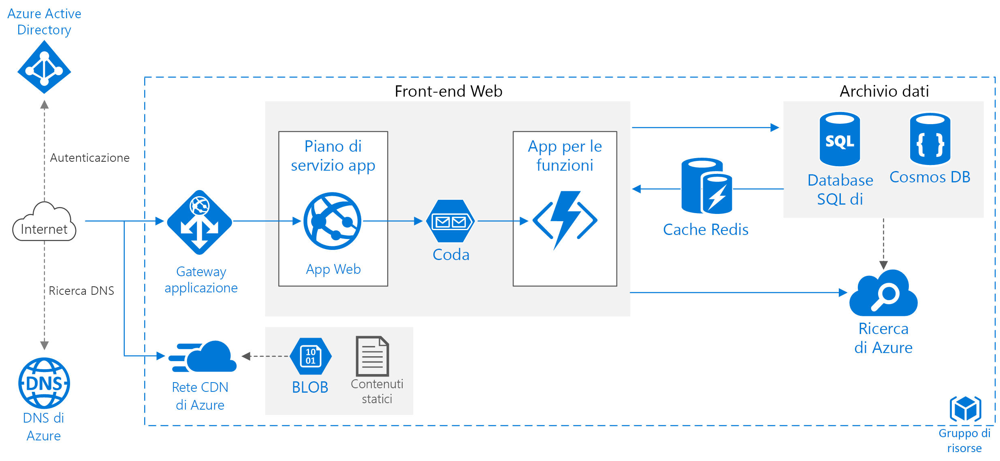

# Migliorare la scalabilità in un'applicazione Web di AzureImprove scalability in an Azure web application

Questa architettura di riferimento è basata su procedure consolidate volte al miglioramento della scalabilità e delle prestazioni di un'applicazione Web Servizio app di Azure.This reference architecture shows proven practices for improving scalability and performance in an Azure App Service web application.

*Scaricare un [file Visio][visio-download] di questa architettura.**Download a [Visio file][visio-download] of this architecture.*

## ArchitetturaArchitecture

Questa architettura si basa su quella illustrata in [Applicazione Web di base][basic-web-app].This architecture builds on the one shown in [Basic web application][basic-web-app]. Include i componenti seguenti:It includes the following components:

- **Gruppo di risorse**.**Resource group**. Un [gruppo di risorse][resource-group] è un contenitore logico per le risorse di Azure.A [resource group][resource-group] is a logical container for Azure resources.
- **[App Web][app-service-web-app]**.**[Web app][app-service-web-app]**. Una tipica applicazione moderna potrebbe includere sia un sito Web che una o più API Web RESTful.A typical modern application might include both a website and one or more RESTful web APIs. Un'API Web potrebbe essere utilizzata da client browser tramite AJAX, da applicazioni client native o da applicazioni lato server.A web API might be consumed by browser clients through AJAX, by native client applications, or by server-side applications. Per considerazioni sulla progettazione di un'API, vedere [Linee guida per la progettazione di un'API][api-guidance].For considerations on designing web APIs, see [API design guidance][api-guidance].
- **App per le funzioni**.**Function App**. Usare le [app per le funzioni][functions] per eseguire attività in background.Use [Function Apps][functions] to run background tasks. Le funzioni vengono richiamate da un trigger, ad esempio un evento del timer o l'inserimento di un messaggio in una coda.Functions are invoked by a trigger, such as a timer event or a message being placed on queue. Per attività con stato ed esecuzione prolungata, usare [Durable Functions][durable-functions].For long-running stateful tasks, use [Durable Functions][durable-functions].
- **Coda**.**Queue**. Nell'architettura illustrata qui l'applicazione accoda le attività in background inserendo un messaggio in una coda dell'[archivio code di Azure][queue-storage].In the architecture shown here, the application queues background tasks by putting a message onto an [Azure Queue storage][queue-storage] queue. Il messaggio attiva un'app per le funzioni.The message triggers a function app. In alternativa, è possibile usare le code del bus di servizio.Alternatively, you can use Service Bus queues. Per un confronto, vedere [Analogie e differenze tra le code di Azure e le code del bus di servizio][queues-compared].For a comparison, see [Azure Queues and Service Bus queues - compared and contrasted][queues-compared].
- **Cache**.**Cache**. Archiviare i dati semistatici nella [cache Redis di Azure][azure-redis].Store semi-static data in [Azure Redis Cache][azure-redis].
- **Rete CDN**.**CDN**. Usare la [rete per la distribuzione di contenuti di Azure][azure-cdn] (rete CDN) per memorizzare nella cache il contenuto disponibile pubblicamente, in modo da ridurre la latenza e accelerare la distribuzione del contenuto.Use [Azure Content Delivery Network][azure-cdn] (CDN) to cache publicly available content for lower latency and faster delivery of content.
- **Archiviazione dei dati**.**Data storage**. Usare un [database SQL di Azure][sql-db] per i dati relazionali.Use [Azure SQL Database][sql-db] for relational data. Per i dati non relazionali, prendere in considerazione [Cosmos DB][cosmosdb].For non-relational data, consider [Cosmos DB][cosmosdb].
- **Ricerca di Azure**.**Azure Search**. Usare il servizio [Ricerca di Azure][azure-search] per aggiungere funzionalità di ricerca come i suggerimenti per la ricerca, la ricerca fuzzy e la ricerca specifica della lingua.Use [Azure Search][azure-search] to add search functionality such as search suggestions, fuzzy search, and language-specific search. Il servizio Ricerca di Azure viene in genere usato in combinazione con un altro archivio dati, soprattutto se l'archivio dati primario richiede la coerenza assoluta.Azure Search is typically used in conjunction with another data store, especially if the primary data store requires strict consistency. In questo approccio, archiviare i dati autorevoli nell'altro archivio dati e l'indice di ricerca in Ricerca di Azure.In this approach, store authoritative data in the other data store and the search index in Azure Search. Ricerca di Azure può essere usato anche per creare un unico indice di ricerca da più archivi dati.Azure Search can also be used to consolidate a single search index from multiple data stores.
- **DNS di Azure**.**Azure DNS**. [DNS di Azure][azure-dns] è un servizio di hosting per i domini DNS, che fornisce la risoluzione dei nomi usando l'infrastruttura di Microsoft Azure.[Azure DNS][azure-dns] is a hosting service for DNS domains, providing name resolution using Microsoft Azure infrastructure. Ospitando i domini in Azure, è possibile gestire i record DNS usando le stesse credenziali, API, strumenti e fatturazione come per gli altri servizi Azure.By hosting your domains in Azure, you can manage your DNS records using the same credentials, APIs, tools, and billing as your other Azure services.
- **Gateway applicazione**.**Application gateway**. Il [gateway applicazione](/azure/application-gateway/) è un servizio di bilanciamento del carico di livello 7.[Application Gateway](/azure/application-gateway/) is a layer 7 load balancer. In questa architettura, instrada le richieste HTTP al front-end Web.In this architecture, it routes HTTP requests to the web front end. Il gateway applicazione fornisce anche un [Web application firewall](/azure/application-gateway/waf-overview) (WAF) che protegge l'applicazione da exploit e vulnerabilità comuni.Application Gateway also provides a [web application firewall](/azure/application-gateway/waf-overview) (WAF) that protects the application from common exploits and vulnerabilities.

## ConsigliRecommendations

I requisiti della propria organizzazione potrebbero essere diversi da quelli dell'architettura descritta in questo articolo.Your requirements might differ from the architecture described here. Seguire le indicazioni in questa sezione come punto di partenza.Use the recommendations in this section as a starting point.

### App del servizio appApp Service apps

È consigliabile creare l'applicazione Web e l'API Web come app del servizio app separate.We recommend creating the web application and the web API as separate App Service apps. In questo modo potranno essere eseguite in piani di servizio app separati ed essere scalate in maniera indipendente.This design lets you run them in separate App Service plans so they can be scaled independently. Se inizialmente questo livello di scalabilità non è necessario, è possibile distribuire le app nello stesso piano e successivamente spostarle in piani distinti, se necessario.If you don't need that level of scalability initially, you can deploy the apps into the same plan and move them into separate plans later if necessary.

> [!NOTE]
> I piani Basic, Standard e Premium non vengono fatturati in base all'app ma in base alle istanze di macchine virtuali nel piano.For the Basic, Standard, and Premium plans, you are billed for the VM instances in the plan, not per app. Vedere [Prezzi di Servizio app ][app-service-pricing].See [App Service Pricing][app-service-pricing]
>

### CacheCache

È possibile migliorare le prestazioni e la scalabilità usando la [cache Redis di Azure][azure-redis] per memorizzare nella cache alcuni dati.You can improve performance and scalability by using [Azure Redis Cache][azure-redis] to cache some data. È consigliabile usare la cache Redis per:Consider using Redis Cache for:

- Dati di transazione semistatici.Semi-static transaction data.
- Stato della sessione.Session state.
- Output HTML.HTML output. Può essere utile nelle applicazioni che eseguono il rendering di output HTML complesso.This can be useful in applications that render complex HTML output.

Per informazioni più dettagliate sulla progettazione di una strategia di memorizzazione nella cache, vedere [Informazioni aggiuntive sulla memorizzazione nella cache][caching-guidance].For more detailed guidance on designing a caching strategy, see [Caching guidance][caching-guidance].

### RETE CDNCDN

Usare la [rete per la distribuzione di contenuti di Azure][azure-cdn] per memorizzare nella cache il contenuto statico.Use [Azure CDN][azure-cdn] to cache static content. Il vantaggio principale di una rete CDN è quello di ridurre la latenza per gli utenti, in quanto il contenuto viene memorizzato nella cache di un server perimetrale geograficamente vicino all'utente.The main benefit of a CDN is to reduce latency for users, because content is cached at an edge server that is geographically close to the user. La rete CDN può anche ridurre il carico sull'applicazione, poiché il traffico non viene gestito dall'applicazione.CDN can also reduce load on the application, because that traffic is not being handled by the application.

Se l'app è costituita prevalentemente da pagine statiche, valutare l'uso della [rete CDN per memorizzare nella cache l'intera app][cdn-app-service].If your app consists mostly of static pages, consider using [CDN to cache the entire app][cdn-app-service]. In alternativa, inserire il contenuto statico, ad esempio immagini, CSS e file HTML, nel servizio [Archiviazione di Azure e usare la rete CDN per memorizzare nella cache questi file][cdn-storage-account].Otherwise, put static content such as images, CSS, and HTML files, into [Azure Storage and use CDN to cache those files][cdn-storage-account].

> [!NOTE]
> La rete CDN di Azure non supporta i contenuti che richiedono l'autenticazione.Azure CDN cannot serve content that requires authentication.
>

Per informazioni più dettagliate, vedere [Indicazioni sulla rete per la distribuzione di contenuti (CDN)][cdn-guidance].For more detailed guidance, see [Content Delivery Network (CDN) guidance][cdn-guidance].

### ArchiviazioneStorage

Le applicazioni moderne spesso elaborano grandi quantità di dati.Modern applications often process large amounts of data. Per assicurare la scalabilità per il cloud, è importante scegliere il tipo di archiviazione corretto.In order to scale for the cloud, it's important to choose the right storage type. Di seguito sono elencati alcuni suggerimenti di base.Here are some baseline recommendations.

| Elemento da archiviareWhat you want to store | EsempioExample | Tipo di archiviazione consigliatoRecommended storage |
| --- | --- | --- |
| FileFiles |Immagini, documenti, PDFImages, documents, PDFs |Archiviazione BLOB di AzureAzure Blob Storage |
| Coppie chiave/valoreKey/Value pairs |Dati del profilo utente cercati in base all'ID utenteUser profile data looked up by user ID |Archiviazione tabelle di AzureAzure Table storage |
| Brevi messaggi aventi lo scopo di attivare un'ulteriore elaborazioneShort messages intended to trigger further processing |Richieste di ordiniOrder requests |Coda di archiviazione, coda del bus di servizio o argomento del bus di servizio di AzureAzure Queue storage, Service Bus queue, or Service Bus topic |
| Dati non relazionali con uno schema flessibile che richiedono l'esecuzione di query di baseNon-relational data with a flexible schema requiring basic querying |Catalogo prodottiProduct catalog |Database di documenti, come Azure Cosmos DB, MongoDB o Apache CouchDBDocument database, such as Azure Cosmos DB, MongoDB, or Apache CouchDB |
| Dati relazionali che richiedono il supporto di query più avanzate, uno schema rigido e/o coerenza assolutaRelational data requiring richer query support, strict schema, and/or strong consistency |Inventario prodottiProduct inventory |Database SQL di AzureAzure SQL Database |

Vedere [Choose the right data store][datastore] (Scegliere il giusto archivio dati).See [Choose the right data store][datastore].

## Considerazioni sulla scalabilitàScalability considerations

Uno dei vantaggi principali del servizio app di Azure è la possibilità di scalare l'applicazione in base al carico.A major benefit of Azure App Service is the ability to scale your application based on load. Ecco alcune considerazioni da tenere presenti quando si pianifica la scalabilità dell'applicazione.Here are some considerations to keep in mind when planning to scale your application.

### app del servizio appApp Service app

Se la propria soluzione include diverse app del servizio app, è consigliabile distribuirle in piani di servizio app distinti.If your solution includes several App Service apps, consider deploying them to separate App Service plans. Questo approccio consente di scalare le app in modo indipendente, poiché vengono eseguite in istanze separate.This approach enables you to scale them independently because they run on separate instances.

Analogamente, valutare la possibilità di inserire un'app per le funzioni in un piano distinto affinché le attività in background non vengano eseguite nelle stesse istanze che gestiscono le richieste HTTP.Similarly, consider putting a function app into its own plan so that background tasks don't run on the same instances that handle HTTP requests. Se le attività in background vengono eseguite in modo intermittente, prendere in considerazione un [piano a consumo][functions-consumption-plan], che prevede la fatturazione in base al numero di esecuzioni anziché su base oraria.If background tasks run intermittently, consider using a [consumption plan][functions-consumption-plan], which is billed based on the number of executions, rather than hourly.

### Database SQLSQL Database

Aumentare la scalabilità di un database SQL eseguendo il *partizionamento orizzontale* del database.Increase scalability of a SQL database by *sharding* the database. Il database viene così partizionato in senso orizzontale.Sharding refers to partitioning the database horizontally. Il partizionamento orizzontale consente di scalare orizzontalmente il database mediante [strumenti di database elastico][sql-elastic].Sharding allows you to scale out the database horizontally using [Elastic Database tools][sql-elastic]. I possibili vantaggi del partizionamento orizzontale includono:Potential benefits of sharding include:

- Maggiore velocità effettiva delle transazioni.Better transaction throughput.
- Esecuzione più rapida delle query su un subset dei dati.Queries can run faster over a subset of the data.

### Ricerca di AzureAzure Search

Il servizio Ricerca di Azure evita di dover eseguire ricerche di dati complesse dall'archivio dati primario e può essere scalato per la gestione del carico.Azure Search removes the overhead of performing complex data searches from the primary data store, and it can scale to handle load. Vedere [Ridimensionare i livelli di risorse per i carichi di lavoro di indicizzazione e query in Ricerca di Azure][azure-search-scaling].See [Scale resource levels for query and indexing workloads in Azure Search][azure-search-scaling].

## Considerazioni relative alla sicurezzaSecurity considerations

Questa sezione contiene alcune considerazioni sulla sicurezza specifiche dei servizi di Azure descritti in questo articolo.This section lists security considerations that are specific to the Azure services described in this article. Non è un elenco completo delle procedure di sicurezza consigliate.It's not a complete list of security best practices. Per alcune considerazioni aggiuntive sulla sicurezza, vedere [Garantire la sicurezza di un'app in Servizio app di Azure][app-service-security].For some additional security considerations, see [Secure an app in Azure App Service][app-service-security].

### Condivisione risorse tra le origini (CORS)Cross-Origin Resource Sharing (CORS)

Se si crea un sito Web e un'API Web come app separate, per consentire al sito Web di effettuare chiamate AJAX sul lato client è necessario abilitare CORS.If you create a website and web API as separate apps, the website cannot make client-side AJAX calls to the API unless you enable CORS.

> [!NOTE]
> La sicurezza del browser impedisce a una pagina Web di creare richieste AJAX per un altro dominio.Browser security prevents a web page from making AJAX requests to another domain. Questa restrizione è nota come criteri di corrispondenza dell'origine e impedisce a un sito dannoso di leggere dati sensibili da un altro sito.This restriction is called the same-origin policy, and prevents a malicious site from reading sentitive data from another site. CORS è uno standard W3C che consente a un server di ridurre i criteri di corrispondenza dell'origine, oltre che di accettare alcune richieste multiorigine e rifiutarne altre.CORS is a W3C standard that allows a server to relax the same-origin policy and allow some cross-origin requests while rejecting others.
>

Il supporto per CORS è incorporato in Servizi app, quindi non è necessario scrivere alcun codice applicazione.App Services has built-in support for CORS, without needing to write any application code. Vedere [Utilizzare un'app per le API da JavaScript tramite CORS][cors].See [Consume an API app from JavaScript using CORS][cors]. Aggiungere il sito Web all'elenco delle origini consentite per l'API.Add the website to the list of allowed origins for the API.

### Crittografia del database SQLSQL Database encryption

Usare [Transparent Data Encryption][sql-encryption] se occorre crittografare i dati inattivi nel database.Use [Transparent Data Encryption][sql-encryption] if you need to encrypt data at rest in the database. Questa funzionalità esegue in tempo reale la crittografia e la decrittografia di un intero database, inclusi i backup e i file di log delle transazioni, senza dover apportare modifiche all'applicazione.This feature performs real-time encryption and decryption of an entire database (including backups and transaction log files) and requires no changes to the application. La crittografia aggiunge un certo livello di latenza, quindi è consigliabile separare i dati che devono essere protetti nel relativo database e abilitare la crittografia solo per quel database.Encryption does add some latency, so it's a good practice to separate the data that must be secure into its own database and enable encryption only for that database.

<!-- links -->

[api-guidance]: ../../best-practices/api-design.md
[app-service-security]: /azure/app-service-web/web-sites-security
[app-service-web-app]: /azure/app-service-web/app-service-web-overview
[app-service-api-app]: /azure/app-service-api/app-service-api-apps-why-best-platform
[app-service-pricing]: https://azure.microsoft.com/pricing/details/app-service/
[azure-cdn]: https://azure.microsoft.com/services/cdn/
[azure-dns]: /azure/dns/dns-overview
[azure-redis]: https://azure.microsoft.com/services/cache/
[azure-search]: /azure/search
[azure-search-scaling]: /azure/search/search-capacity-planning
[basic-web-app]: basic-web-app.md
[basic-web-app-scalability]: basic-web-app.md#scalability-considerations
[caching-guidance]: ../../best-practices/caching.md
[cdn-app-service]: /azure/app-service-web/cdn-websites-with-cdn
[cdn-storage-account]: /azure/cdn/cdn-create-a-storage-account-with-cdn
[cdn-guidance]: ../../best-practices/cdn.md
[cors]: /azure/app-service-api/app-service-api-cors-consume-javascript
[cosmosdb]: /azure/cosmos-db/
[datastore]: ../..//guide/technology-choices/data-store-overview.md
[durable-functions]: /azure/azure-functions/durable-functions-overview
[functions]: /azure/azure-functions/functions-overview
[functions-consumption-plan]: /azure/azure-functions/functions-scale#consumption-plan
[queue-storage]: /azure/storage/storage-dotnet-how-to-use-queues
[queues-compared]: /azure/service-bus-messaging/service-bus-azure-and-service-bus-queues-compared-contrasted
[resource-group]: /azure/azure-resource-manager/resource-group-overview#resource-groups
[sql-db]: /azure/sql-database/
[sql-elastic]: /azure/sql-database/sql-database-elastic-scale-introduction
[sql-encryption]: https://msdn.microsoft.com/library/dn948096.aspx
[tm]: https://azure.microsoft.com/services/traffic-manager/
[visio-download]: https://archcenter.blob.core.windows.net/cdn/app-service-reference-architectures.vsdx
[web-app-multi-region]: ./multi-region.md
