# <a name="automated-enterprise-bi-with-sql-data-warehouse-and-azure-data-factory"></a><span data-ttu-id="79d90-103">Business intelligence aziendale automatizzata con SQL Data Warehouse e Azure Data Factory</span><span class="sxs-lookup"><span data-stu-id="79d90-103">Automated enterprise BI with SQL Data Warehouse and Azure Data Factory</span></span>

<span data-ttu-id="79d90-104">Questa architettura di riferimento mostra come eseguire il caricamento incrementale in una pipeline [ELT](../../data-guide/relational-data/etl.md#extract-load-and-transform-elt) (estrazione-caricamento-trasformazione).</span><span class="sxs-lookup"><span data-stu-id="79d90-104">This reference architecture shows how to perform incremental loading in an [ELT](../../data-guide/relational-data/etl.md#extract-load-and-transform-elt) (extract-load-transform) pipeline.</span></span> <span data-ttu-id="79d90-105">Usa Azure Data Factory per automatizzare la pipeline ELT.</span><span class="sxs-lookup"><span data-stu-id="79d90-105">It uses Azure Data Factory to automate the ELT pipeline.</span></span> <span data-ttu-id="79d90-106">La pipeline sposta in modo incrementale i dati OLTP più recenti da un database di SQL Server locale in SQL Data Warehouse.</span><span class="sxs-lookup"><span data-stu-id="79d90-106">The pipeline incrementally moves the latest OLTP data from an on-premises SQL Server database into SQL Data Warehouse.</span></span> <span data-ttu-id="79d90-107">I dati transazionali vengono trasformati in un modello tabulare per l'analisi.</span><span class="sxs-lookup"><span data-stu-id="79d90-107">Transactional data is transformed into a tabular model for analysis.</span></span> [<span data-ttu-id="79d90-108">**Distribuire questa soluzione**.</span><span class="sxs-lookup"><span data-stu-id="79d90-108">**Deploy this solution**.</span></span>](#deploy-the-solution)


<span data-ttu-id="79d90-109">Questa architettura si basa su quella illustrata in [Business intelligence aziendale con SQL Data Warehouse](./enterprise-bi-sqldw.md), ma aggiunge alcune funzionalità importanti per gli scenari di data warehousing aziendale.</span><span class="sxs-lookup"><span data-stu-id="79d90-109">This architecture builds on the one shown in [Enterprise BI with SQL Data Warehouse](./enterprise-bi-sqldw.md), but adds some features that are important for enterprise data warehousing scenarios.</span></span>

-   <span data-ttu-id="79d90-110">Automazione della pipeline con Data Factory.</span><span class="sxs-lookup"><span data-stu-id="79d90-110">Automation of the pipeline using Data Factory.</span></span>
-   <span data-ttu-id="79d90-111">Caricamento incrementale.</span><span class="sxs-lookup"><span data-stu-id="79d90-111">Incremental loading.</span></span>
-   <span data-ttu-id="79d90-112">Integrazione di più origini dati.</span><span class="sxs-lookup"><span data-stu-id="79d90-112">Integrating multiple data sources.</span></span>
-   <span data-ttu-id="79d90-113">Caricamento di dati binari quali dati geospaziali e immagini.</span><span class="sxs-lookup"><span data-stu-id="79d90-113">Loading binary data such as geospatial data and images.</span></span>

## <a name="architecture"></a><span data-ttu-id="79d90-114">Architettura</span><span class="sxs-lookup"><span data-stu-id="79d90-114">Architecture</span></span>

<span data-ttu-id="79d90-115">L'architettura è costituita dai componenti seguenti.</span><span class="sxs-lookup"><span data-stu-id="79d90-115">The architecture consists of the following components.</span></span>

### <a name="data-sources"></a><span data-ttu-id="79d90-116">Origini dati</span><span class="sxs-lookup"><span data-stu-id="79d90-116">Data sources</span></span>

<span data-ttu-id="79d90-117">**SQL Server locale**.</span><span class="sxs-lookup"><span data-stu-id="79d90-117">**On-premises SQL Server**.</span></span> <span data-ttu-id="79d90-118">I dati di origine si trovano in un database di SQL Server locale.</span><span class="sxs-lookup"><span data-stu-id="79d90-118">The source data is located in a SQL Server database on premises.</span></span> <span data-ttu-id="79d90-119">Per simulare l'ambiente locale, gli script di distribuzione per questa architettura eseguono il provisioning di una macchina virtuale in Azure con SQL Server installato.</span><span class="sxs-lookup"><span data-stu-id="79d90-119">To simulate the on-premises environment, the deployment scripts for this architecture provision a virtual machine in Azure with SQL Server installed.</span></span> <span data-ttu-id="79d90-120">Il [database OLTP di esempio "Wide World Importers"][wwi] viene usato come database di origine.</span><span class="sxs-lookup"><span data-stu-id="79d90-120">The [Wide World Importers OLTP sample database][wwi] is used as the source database.</span></span>

<span data-ttu-id="79d90-121">**Dati esterni**.</span><span class="sxs-lookup"><span data-stu-id="79d90-121">**External data**.</span></span> <span data-ttu-id="79d90-122">Uno scenario comune per i data warehouse consiste nell'integrazione di più origini dati.</span><span class="sxs-lookup"><span data-stu-id="79d90-122">A common scenario for data warehouses is to integrate multiple data sources.</span></span> <span data-ttu-id="79d90-123">Questa architettura di riferimento carica un set di dati esterno che contiene la popolazione delle città per ogni anno e lo integra con i dati dal database OLTP.</span><span class="sxs-lookup"><span data-stu-id="79d90-123">This reference architecture loads an external data set that contains city populations by year, and integrates it with the data from the OLTP database.</span></span> <span data-ttu-id="79d90-124">È possibile usare questi dati per ottenere informazioni dettagliate utili per capire ad esempio se l'incremento delle vendite in ogni area corrisponde o è superiore alla crescita della popolazione.</span><span class="sxs-lookup"><span data-stu-id="79d90-124">You can use this data for insights such as: "Does sales growth in each region match or exceed population growth?"</span></span>

### <a name="ingestion-and-data-storage"></a><span data-ttu-id="79d90-125">Inserimento e archiviazione dei dati</span><span class="sxs-lookup"><span data-stu-id="79d90-125">Ingestion and data storage</span></span>

<span data-ttu-id="79d90-126">**Archiviazione BLOB**.</span><span class="sxs-lookup"><span data-stu-id="79d90-126">**Blob Storage**.</span></span> <span data-ttu-id="79d90-127">L'archiviazione BLOB viene usata come area di staging per i dati di origine prima del caricamento in SQL Data Warehouse.</span><span class="sxs-lookup"><span data-stu-id="79d90-127">Blob storage is used as a staging area for the source data before loading it into SQL Data Warehouse.</span></span>

<span data-ttu-id="79d90-128">**Azure SQL Data Warehouse**.</span><span class="sxs-lookup"><span data-stu-id="79d90-128">**Azure SQL Data Warehouse**.</span></span> <span data-ttu-id="79d90-129">[SQL Data Warehouse](/azure/sql-data-warehouse/) è un sistema distribuito progettato per eseguire analisi su dati di grandi dimensioni.</span><span class="sxs-lookup"><span data-stu-id="79d90-129">[SQL Data Warehouse](/azure/sql-data-warehouse/) is a distributed system designed to perform analytics on large data.</span></span> <span data-ttu-id="79d90-130">Supporta l'elaborazione parallela su larga scala (MPP), che può essere usata per l'esecuzione di analisi ad alte prestazioni.</span><span class="sxs-lookup"><span data-stu-id="79d90-130">It supports massive parallel processing (MPP), which makes it suitable for running high-performance analytics.</span></span> 

<span data-ttu-id="79d90-131">**Azure Data Factory**.</span><span class="sxs-lookup"><span data-stu-id="79d90-131">**Azure Data Factory**.</span></span> <span data-ttu-id="79d90-132">[Data Factory][adf] è un servizio gestito che esegue l'orchestrazione e l'automazione dello spostamento dati e della trasformazione dei dati.</span><span class="sxs-lookup"><span data-stu-id="79d90-132">[Data Factory][adf] is a managed service that orchestrates and automates data movement and data transformation.</span></span> <span data-ttu-id="79d90-133">In questa architettura coordina le diverse fasi del processo ELT.</span><span class="sxs-lookup"><span data-stu-id="79d90-133">In this architecture, it coordinates the various stages of the ELT process.</span></span>

### <a name="analysis-and-reporting"></a><span data-ttu-id="79d90-134">Analisi e creazione di report</span><span class="sxs-lookup"><span data-stu-id="79d90-134">Analysis and reporting</span></span>

<span data-ttu-id="79d90-135">**Azure Analysis Services**.</span><span class="sxs-lookup"><span data-stu-id="79d90-135">**Azure Analysis Services**.</span></span> <span data-ttu-id="79d90-136">[Analysis Services](/azure/analysis-services/) è un servizio completamente gestito che offre funzionalità di creazione di modelli di dati.</span><span class="sxs-lookup"><span data-stu-id="79d90-136">[Analysis Services](/azure/analysis-services/) is a fully managed service that provides data modeling capabilities.</span></span> <span data-ttu-id="79d90-137">Il modello semantico viene caricato in Analysis Services.</span><span class="sxs-lookup"><span data-stu-id="79d90-137">The semantic model is loaded into Analysis Services.</span></span>

<span data-ttu-id="79d90-138">**Power BI**.</span><span class="sxs-lookup"><span data-stu-id="79d90-138">**Power BI**.</span></span> <span data-ttu-id="79d90-139">Power BI è una suite di strumenti di analisi aziendale che consente di analizzare dati e condividere informazioni dettagliate.</span><span class="sxs-lookup"><span data-stu-id="79d90-139">Power BI is a suite of business analytics tools to analyze data for business insights.</span></span> <span data-ttu-id="79d90-140">In questa architettura viene eseguita una query del modello semantico archiviato in Analysis Services.</span><span class="sxs-lookup"><span data-stu-id="79d90-140">In this architecture, it queries the semantic model stored in Analysis Services.</span></span>

### <a name="authentication"></a><span data-ttu-id="79d90-141">Authentication</span><span class="sxs-lookup"><span data-stu-id="79d90-141">Authentication</span></span>

<span data-ttu-id="79d90-142">**Azure Active Directory** (Azure AD) autentica gli utenti che si connettono al server di Analysis Services tramite Power BI.</span><span class="sxs-lookup"><span data-stu-id="79d90-142">**Azure Active Directory** (Azure AD) authenticates users who connect to the Analysis Services server through Power BI.</span></span>

<span data-ttu-id="79d90-143">Data Factory può usare anche Azure AD per eseguire l'autenticazione in SQL Data Warehouse, tramite un'entità servizio o un'identità del servizio gestita.</span><span class="sxs-lookup"><span data-stu-id="79d90-143">Data Factory can use also use Azure AD to authenticate to SQL Data Warehouse, by using a service principal or Managed Service Identity (MSI).</span></span> <span data-ttu-id="79d90-144">Per semplificare, la distribuzione di esempio usa l'autenticazione di SQL Server.</span><span class="sxs-lookup"><span data-stu-id="79d90-144">For simplicity, the example deployment uses SQL Server authentication.</span></span>

## <a name="data-pipeline"></a><span data-ttu-id="79d90-145">Data Pipeline</span><span class="sxs-lookup"><span data-stu-id="79d90-145">Data pipeline</span></span>

<span data-ttu-id="79d90-146">In [Azure Data Factory][adf] una pipeline è un raggruppamento logico di attività usato per coordinare un'attività &mdash; in questo caso il caricamento e la trasformazione di dati in SQL Data Warehouse.</span><span class="sxs-lookup"><span data-stu-id="79d90-146">In [Azure Data Factory][adf], a pipeline is a logical grouping of activities used to coordinate a task &mdash; in this case, loading and transforming data into SQL Data Warehouse.</span></span> 

<span data-ttu-id="79d90-147">Questa architettura di riferimento definisce una pipeline principale che esegue una sequenza di pipeline figlio.</span><span class="sxs-lookup"><span data-stu-id="79d90-147">This reference architecture defines a master pipeline that runs a sequence of child pipelines.</span></span> <span data-ttu-id="79d90-148">Ogni pipeline figlio carica i dati in una o più tabelle del data warehouse.</span><span class="sxs-lookup"><span data-stu-id="79d90-148">Each child pipeline loads data into one or more data warehouse tables.</span></span>

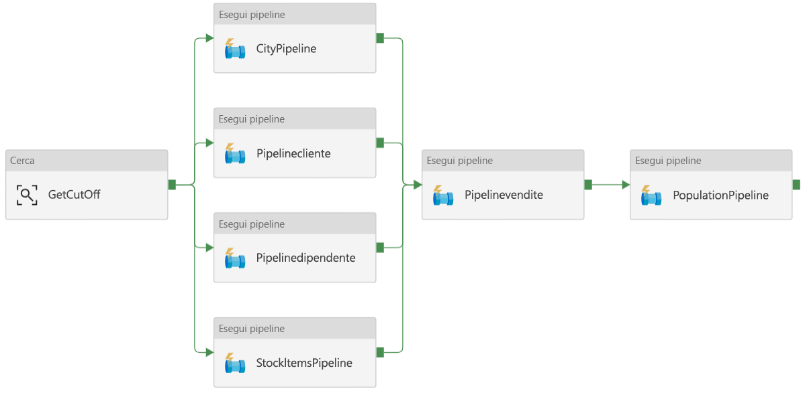

## <a name="incremental-loading"></a><span data-ttu-id="79d90-149">Caricamento incrementale</span><span class="sxs-lookup"><span data-stu-id="79d90-149">Incremental loading</span></span>

<span data-ttu-id="79d90-150">Quando si esegue un processo ETL o ELT automatizzato, risulta più efficiente caricare solo i dati modificati dopo l'esecuzione precedente.</span><span class="sxs-lookup"><span data-stu-id="79d90-150">When you run an automated ETL or ELT process, it's most efficient to load only the data that changed since the previous run.</span></span> <span data-ttu-id="79d90-151">Questo approccio viene definito *caricamento incrementale*, a differenza di un caricamento completo che carica tutti i dati.</span><span class="sxs-lookup"><span data-stu-id="79d90-151">This is called an *incremental load*, as opposed to a full load that loads all of the data.</span></span> <span data-ttu-id="79d90-152">Per eseguire un caricamento incrementale, è necessario potere identificare i dati modificati.</span><span class="sxs-lookup"><span data-stu-id="79d90-152">To perform an incremental load, you need a way to identify which data has changed.</span></span> <span data-ttu-id="79d90-153">L'approccio più comune consiste nell'usare un valore di tipo *limite massimo*, ovvero nel tenere traccia del valore più recente di una colonna nella tabella di origine, ad esempio una colonna di tipo data/ora o una colonna con numero intero univoco.</span><span class="sxs-lookup"><span data-stu-id="79d90-153">The most common approach is to use a *high water mark* value, which means tracking the latest value of some column in the source table, either a datetime column or a unique integer column.</span></span> 

<span data-ttu-id="79d90-154">A partire da SQL Server 2016, è possibile usare [tabelle temporali](/sql/relational-databases/tables/temporal-tables).</span><span class="sxs-lookup"><span data-stu-id="79d90-154">Starting with SQL Server 2016, you can use [temporal tables](/sql/relational-databases/tables/temporal-tables).</span></span> <span data-ttu-id="79d90-155">Si tratta di tabelle con controllo delle versioni di sistema che mantengono una cronologia completa delle modifiche dei dati.</span><span class="sxs-lookup"><span data-stu-id="79d90-155">These are system-versioned tables that keep a full history of data changes.</span></span> <span data-ttu-id="79d90-156">Il motore di database registra automaticamente la cronologia di ogni modifica in una tabella di cronologia separata.</span><span class="sxs-lookup"><span data-stu-id="79d90-156">The database engine automatically records the history of every change in a separate history table.</span></span> <span data-ttu-id="79d90-157">È possibile eseguire query sui dati cronologici aggiungendo una clausola FOR SYSTEM_TIME a una query.</span><span class="sxs-lookup"><span data-stu-id="79d90-157">You can query the historical data by adding a FOR SYSTEM_TIME clause to a query.</span></span> <span data-ttu-id="79d90-158">Il motore di database esegue internamente query sulla tabella di cronologia, ma questo processo è trasparente per l'applicazione.</span><span class="sxs-lookup"><span data-stu-id="79d90-158">Internally, the database engine queries the history table, but this is transparent to the application.</span></span> 

> [!NOTE]
> <span data-ttu-id="79d90-159">Per le versioni precedenti di SQL Server è possibile usare [Change Data Capture](/sql/relational-databases/track-changes/about-change-data-capture-sql-server) (CDC).</span><span class="sxs-lookup"><span data-stu-id="79d90-159">For earlier versions of SQL Server, you can use [Change Data Capture](/sql/relational-databases/track-changes/about-change-data-capture-sql-server) (CDC).</span></span> <span data-ttu-id="79d90-160">Questo approccio risulta meno efficiente rispetto alle tabelle temporali, perché è necessario eseguire query su una tabella di modifiche separata e le modifiche vengono registrate tramite un numero di sequenza di log, invece che un timestamp.</span><span class="sxs-lookup"><span data-stu-id="79d90-160">This approach is less convenient than temporal tables, because you have to query a separate change table, and changes are tracked by a log sequence number, rather than a timestamp.</span></span> 

<span data-ttu-id="79d90-161">Le tabelle temporali sono utili per i dati relativi alle dimensioni, che possono cambiare nel tempo.</span><span class="sxs-lookup"><span data-stu-id="79d90-161">Temporal tables are useful for dimension data, which can change over time.</span></span> <span data-ttu-id="79d90-162">Le tabelle dei fatti rappresentano una transazione non modificabile, ad esempio una vendita, e in questo caso la conservazione della cronologia delle versioni di sistema risulta superflua.</span><span class="sxs-lookup"><span data-stu-id="79d90-162">Fact tables usually represent an immutable transaction such as a sale, in which case keeping the system version history doesn't make sense.</span></span> <span data-ttu-id="79d90-163">Le transazioni includono invece in genere una colonna che rappresenta la data della transazione, che può essere usata come valore limite.</span><span class="sxs-lookup"><span data-stu-id="79d90-163">Instead, transactions usually have a column that represents the transaction date, which can be used as the watermark value.</span></span> <span data-ttu-id="79d90-164">Ad esempio, nel database OLTP "Wide World Importers" le tabelle Sales.Invoices e Sales.InvoiceLines includono un campo `LastEditedWhen` il cui valore predefinito è `sysdatetime()`.</span><span class="sxs-lookup"><span data-stu-id="79d90-164">For example, in the Wide World Importers OLTP database, the Sales.Invoices and Sales.InvoiceLines tables have a `LastEditedWhen` field that defaults to `sysdatetime()`.</span></span> 

<span data-ttu-id="79d90-165">Ecco il flusso generale per la pipeline ELT:</span><span class="sxs-lookup"><span data-stu-id="79d90-165">Here is the general flow for the ELT pipeline:</span></span>

1. <span data-ttu-id="79d90-166">Per ogni tabella del database di origine, tenere traccia del valore temporale limite relativo all'esecuzione dell'ultimo processo ELT.</span><span class="sxs-lookup"><span data-stu-id="79d90-166">For each table in the source database, track the cutoff time when the last ELT job ran.</span></span> <span data-ttu-id="79d90-167">Archiviare tali informazioni nel data warehouse.</span><span class="sxs-lookup"><span data-stu-id="79d90-167">Store this information in the data warehouse.</span></span> <span data-ttu-id="79d90-168">Durante l'installazione iniziale tutti i valori temporali vengono impostati su '1-1-1900'.</span><span class="sxs-lookup"><span data-stu-id="79d90-168">(On initial setup, all times are set to '1-1-1900'.)</span></span>

2. <span data-ttu-id="79d90-169">Durante il passaggio di esportazione dei dati, il valore temporale limite viene passato come parametro a un set di stored procedure nel database di origine.</span><span class="sxs-lookup"><span data-stu-id="79d90-169">During the data export step, the cutoff time is passed as a parameter to a set of stored procedures in the source database.</span></span> <span data-ttu-id="79d90-170">Queste stored procedure eseguono query relative a eventuali record modificati o creati dopo il valore temporale limite.</span><span class="sxs-lookup"><span data-stu-id="79d90-170">These stored procedures query for any records that were changed or created after the cutoff time.</span></span> <span data-ttu-id="79d90-171">Per la tabella dei fatti Sales viene usata la colonna `LastEditedWhen`.</span><span class="sxs-lookup"><span data-stu-id="79d90-171">For the Sales fact table, the `LastEditedWhen` column is used.</span></span> <span data-ttu-id="79d90-172">Per i dati relativi alle dimensioni vengono usate tabelle temporali con controllo delle versioni di sistema.</span><span class="sxs-lookup"><span data-stu-id="79d90-172">For the dimension data, system-versioned temporal tables are used.</span></span>

3. <span data-ttu-id="79d90-173">Al termine della migrazione dei dati, aggiornare la tabella in cui sono archiviati i valori temporali limite.</span><span class="sxs-lookup"><span data-stu-id="79d90-173">When the data migration is complete, update the table that stores the cutoff times.</span></span>

<span data-ttu-id="79d90-174">È utile registrare anche una *derivazione* per ogni esecuzione di ELT.</span><span class="sxs-lookup"><span data-stu-id="79d90-174">It's also useful to record a *lineage* for each ELT run.</span></span> <span data-ttu-id="79d90-175">Per un record specifico, la derivazione associa tale record all'esecuzione di ELT che ha prodotto i dati.</span><span class="sxs-lookup"><span data-stu-id="79d90-175">For a given record, the lineage associates that record with the ELT run that produced the data.</span></span> <span data-ttu-id="79d90-176">Per ogni esecuzione di ETL, viene creato un nuovo record di derivazione per ogni tabella, che illustra l'ora di inizio e di fine del caricamento.</span><span class="sxs-lookup"><span data-stu-id="79d90-176">For each ETL run, a new lineage record is created for every table, showing the starting and ending load times.</span></span> <span data-ttu-id="79d90-177">Le chiavi di derivazione per ogni record vengono archiviate nelle tabelle delle dimensioni e nelle tabelle dei fatti.</span><span class="sxs-lookup"><span data-stu-id="79d90-177">The lineage keys for each record are stored in the dimension and fact tables.</span></span>

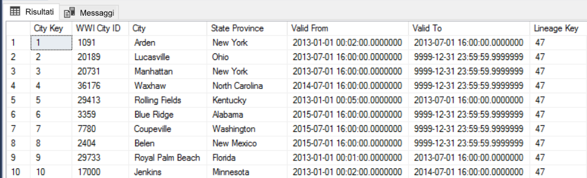

<span data-ttu-id="79d90-178">Dopo il caricamento di un nuovo batch di dati nel data warehouse, aggiornare il modello tabulare di Analysis Services.</span><span class="sxs-lookup"><span data-stu-id="79d90-178">After a new batch of data is loaded into the warehouse, refresh the Analysis Services tabular model.</span></span> <span data-ttu-id="79d90-179">Vedere [Aggiornamento asincrono con l'API REST](/azure/analysis-services/analysis-services-async-refresh).</span><span class="sxs-lookup"><span data-stu-id="79d90-179">See [Asynchronous refresh with the REST API](/azure/analysis-services/analysis-services-async-refresh).</span></span>

## <a name="data-cleansing"></a><span data-ttu-id="79d90-180">Pulizia dei dati</span><span class="sxs-lookup"><span data-stu-id="79d90-180">Data cleansing</span></span>

<span data-ttu-id="79d90-181">È consigliabile includere la pulizia dei dati nel processo ELT.</span><span class="sxs-lookup"><span data-stu-id="79d90-181">Data cleansing should be part of the ELT process.</span></span> <span data-ttu-id="79d90-182">In questa architettura di riferimento un'origine di dati non validi è la tabella relativa alla popolazione delle città, in cui alcune città hanno una popolazione pari a zero, probabilmente perché non sono disponibili dati.</span><span class="sxs-lookup"><span data-stu-id="79d90-182">In this reference architecture, one source of bad data is the city population table, where some cities have zero population, perhaps because no data was available.</span></span> <span data-ttu-id="79d90-183">Durante l'elaborazione, la pipeline ELT rimuove tali città dalla tabella relativa alla popolazione delle città.</span><span class="sxs-lookup"><span data-stu-id="79d90-183">During processing, the ELT pipeline removes those cities from the city population table.</span></span> <span data-ttu-id="79d90-184">Eseguire la pulizia dei dati nelle tabelle di staging, invece che nelle tabelle esterne.</span><span class="sxs-lookup"><span data-stu-id="79d90-184">Perform data cleansing on staging tables, rather than external tables.</span></span>

<span data-ttu-id="79d90-185">Ecco la stored procedure che rimuove le città con popolazione pari a zero dalla tabella relativa alla popolazione delle città.</span><span class="sxs-lookup"><span data-stu-id="79d90-185">Here is the stored procedure that removes the cities with zero population from the City Population table.</span></span> <span data-ttu-id="79d90-186">Il file di origine è disponibile [qui](https://github.com/mspnp/reference-architectures/blob/master/data/enterprise_bi_sqldw_advanced/azure/sqldw_scripts/citypopulation/%5BIntegration%5D.%5BMigrateExternalCityPopulationData%5D.sql).</span><span class="sxs-lookup"><span data-stu-id="79d90-186">(You can find the source file [here](https://github.com/mspnp/reference-architectures/blob/master/data/enterprise_bi_sqldw_advanced/azure/sqldw_scripts/citypopulation/%5BIntegration%5D.%5BMigrateExternalCityPopulationData%5D.sql).)</span></span> 

```sql
DELETE FROM [Integration].[CityPopulation_Staging]
WHERE RowNumber in (SELECT DISTINCT RowNumber
FROM [Integration].[CityPopulation_Staging]
WHERE POPULATION = 0
GROUP BY RowNumber
HAVING COUNT(RowNumber) = 4)
```

## <a name="external-data-sources"></a><span data-ttu-id="79d90-187">DROP EXTERNAL DATA SOURCE</span><span class="sxs-lookup"><span data-stu-id="79d90-187">External data sources</span></span>

<span data-ttu-id="79d90-188">I data warehouse eseguono spesso il consolidamento dei dati da più origini.</span><span class="sxs-lookup"><span data-stu-id="79d90-188">Data warehouses often consolidate data from multiple sources.</span></span> <span data-ttu-id="79d90-189">Questa architettura di riferimento carica un'origine dati esterna che include dati demografici.</span><span class="sxs-lookup"><span data-stu-id="79d90-189">This reference architecture loads an external data source that contains demographics data.</span></span> <span data-ttu-id="79d90-190">Questo set di dati è disponibile nell'archiviazione BLOB di Azure come parte dell'esempio [WorldWideImportersDW](https://github.com/Microsoft/sql-server-samples/tree/master/samples/databases/wide-world-importers/sample-scripts/polybase).</span><span class="sxs-lookup"><span data-stu-id="79d90-190">This dataset is available in Azure blob storage as part of the [WorldWideImportersDW](https://github.com/Microsoft/sql-server-samples/tree/master/samples/databases/wide-world-importers/sample-scripts/polybase) sample.</span></span>

<span data-ttu-id="79d90-191">Azure Data Factory può copiare direttamente dall'archiviazione BLOB usando il [connettore di archiviazione BLOB](/azure/data-factory/connector-azure-blob-storage).</span><span class="sxs-lookup"><span data-stu-id="79d90-191">Azure Data Factory can copy directly from blob storage, using the [blob storage connector](/azure/data-factory/connector-azure-blob-storage).</span></span> <span data-ttu-id="79d90-192">Il connettore richiede tuttavia una stringa di connessione o una firma di accesso condiviso, quindi non può essere usato per copiare un BLOB con accesso in lettura pubblico.</span><span class="sxs-lookup"><span data-stu-id="79d90-192">However, the connector requires a connection string or a shared access signature, so it can't be used to copy a blob with public read access.</span></span> <span data-ttu-id="79d90-193">In alternativa, è possibile usare PolyBase per creare una tabella esterna rispetto all'archiviazione BLOB e quindi copiare le tabelle esterne in SQL Data Warehouse.</span><span class="sxs-lookup"><span data-stu-id="79d90-193">As a workaround, you can use PolyBase to create an external table over Blob storage and then copy the external tables into SQL Data Warehouse.</span></span> 

## <a name="handling-large-binary-data"></a><span data-ttu-id="79d90-194">Gestione di dati binari di grandi dimensioni</span><span class="sxs-lookup"><span data-stu-id="79d90-194">Handling large binary data</span></span> 

<span data-ttu-id="79d90-195">Nel database di origine la tabella Cities include una colonna Location che contiene un tipo di dati spaziali [geography](/sql/t-sql/spatial-geography/spatial-types-geography).</span><span class="sxs-lookup"><span data-stu-id="79d90-195">In the source database, the Cities table has a Location column that holds a [geography](/sql/t-sql/spatial-geography/spatial-types-geography) spatial data type.</span></span> <span data-ttu-id="79d90-196">SQL Data Warehouse non supporta il tipo **geography** in modalità nativa, quindi questo campo viene convertito in un tipo **varbinary** durante il caricamento.</span><span class="sxs-lookup"><span data-stu-id="79d90-196">SQL Data Warehouse doesn't support the **geography** type natively, so this field is converted to a **varbinary** type during loading.</span></span> <span data-ttu-id="79d90-197">Vedere [Alternative per i tipi di dati non supportati](/azure/sql-data-warehouse/sql-data-warehouse-tables-data-types#unsupported-data-types).</span><span class="sxs-lookup"><span data-stu-id="79d90-197">(See [Workarounds for unsupported data types](/azure/sql-data-warehouse/sql-data-warehouse-tables-data-types#unsupported-data-types).)</span></span>

<span data-ttu-id="79d90-198">PolyBase supporta tuttavia dimensioni massime di colonna pari a `varbinary(8000)`, quindi è possibile che alcuni dati vengano troncati.</span><span class="sxs-lookup"><span data-stu-id="79d90-198">However, PolyBase supports a maximum column size of `varbinary(8000)`, which means some data could be truncated.</span></span> <span data-ttu-id="79d90-199">Una soluzione alternativa per questo problema consiste nel suddividere i dati in blocchi durante l'esportazione e quindi riassemblare i blocchi, come illustrato di seguito:</span><span class="sxs-lookup"><span data-stu-id="79d90-199">A workaround for this problem is to break the data up into chunks during export, and then reassemble the chunks, as follows:</span></span>

1. <span data-ttu-id="79d90-200">Creare una tabella di staging temporanea per la colonna Location.</span><span class="sxs-lookup"><span data-stu-id="79d90-200">Create a temporary staging table for the Location column.</span></span>

2. <span data-ttu-id="79d90-201">Per ogni città, suddividere i dati relativi alla località in blocchi da 8000 byte, in modo da ottenere 1 &ndash; N righe per ogni città.</span><span class="sxs-lookup"><span data-stu-id="79d90-201">For each city, split the location data into 8000-byte chunks, resulting in 1 &ndash; N rows for each city.</span></span>

3. <span data-ttu-id="79d90-202">Per riassemblare i blocchi, usare l'operatore [PIVOT](/sql/t-sql/queries/from-using-pivot-and-unpivot) di T-SQL per convertire le righe in colonne e quindi concatenare i valori delle colonne per ogni città.</span><span class="sxs-lookup"><span data-stu-id="79d90-202">To reassemble the chunks, use the T-SQL [PIVOT](/sql/t-sql/queries/from-using-pivot-and-unpivot) operator to convert rows into columns and then concatenate the column values for each city.</span></span>

<span data-ttu-id="79d90-203">Ogni città verrà tuttavia suddivisa in un numero diverso di righe, in base alle dimensioni dei dati geografici.</span><span class="sxs-lookup"><span data-stu-id="79d90-203">The challenge is that each city will be split into a different number of rows, depending on the size of geography data.</span></span> <span data-ttu-id="79d90-204">Per consentire il funzionamento dell'operatore PIVOT, è necessario che ogni città abbia lo stesso numero di righe.</span><span class="sxs-lookup"><span data-stu-id="79d90-204">For the PIVOT operator to work, every city must have the same number of rows.</span></span> <span data-ttu-id="79d90-205">Per il funzionamento corretto di questo approccio, la query T-SQL, disponibile [qui][MergeLocation], esegue alcune operazioni per riempire le righe con valori vuoti, in modo che ogni città abbia lo stesso numero di colonne dopo l'applicazione dell'operatore PIVOT.</span><span class="sxs-lookup"><span data-stu-id="79d90-205">To make this work, the T-SQL query (which you can view [here][MergeLocation]) does some tricks to pad out the rows with blank values, so that every city has the same number of columns after the pivot.</span></span> <span data-ttu-id="79d90-206">La query risultante risulta molto più veloce dell'esecuzione di cicli di una riga alla volta.</span><span class="sxs-lookup"><span data-stu-id="79d90-206">The resulting query turns out to be much faster than looping through the rows one at a time.</span></span>

<span data-ttu-id="79d90-207">Lo stesso approccio viene usato per i dati di immagine.</span><span class="sxs-lookup"><span data-stu-id="79d90-207">The same approach is used for image data.</span></span>

## <a name="slowly-changing-dimensions"></a><span data-ttu-id="79d90-208">Dimensioni a modifica lenta</span><span class="sxs-lookup"><span data-stu-id="79d90-208">Slowly changing dimensions</span></span>

<span data-ttu-id="79d90-209">I dati relativi alle dimensioni sono relativamente statici, ma possono cambiare.</span><span class="sxs-lookup"><span data-stu-id="79d90-209">Dimension data is relatively static, but it can change.</span></span> <span data-ttu-id="79d90-210">È ad esempio possibile che un prodotto venga assegnato a una categoria di prodotto diversa.</span><span class="sxs-lookup"><span data-stu-id="79d90-210">For example, a product might get reassigned to a different product category.</span></span> <span data-ttu-id="79d90-211">Sono disponibili diversi approcci per la gestione delle dimensioni a modifica lenta.</span><span class="sxs-lookup"><span data-stu-id="79d90-211">There are several approaches to handling slowly changing dimensions.</span></span> <span data-ttu-id="79d90-212">Una tecnica comune, definita [Tipo 2](https://wikipedia.org/wiki/Slowly_changing_dimension#Type_2:_add_new_row), consiste nell'aggiungere un nuovo record ogni volta che viene modificata una dimensione.</span><span class="sxs-lookup"><span data-stu-id="79d90-212">A common technique, called [Type 2](https://wikipedia.org/wiki/Slowly_changing_dimension#Type_2:_add_new_row), is to add a new record whenever a dimension changes.</span></span> 

<span data-ttu-id="79d90-213">Per implementare l'approccio Tipo 2, è necessario che le tabelle delle dimensioni includano colonne aggiuntive che specificano l'intervallo di date valide per un record specifico.</span><span class="sxs-lookup"><span data-stu-id="79d90-213">In order to implement the Type 2 approach, dimension tables need additional columns that specify the effective date range for a given record.</span></span> <span data-ttu-id="79d90-214">Le chiavi primarie dal database di origine, inoltre, verranno duplicate, quindi la tabella delle dimensioni deve includere una chiave primaria artificiale.</span><span class="sxs-lookup"><span data-stu-id="79d90-214">Also, primary keys from the source database will be duplicated, so the dimension table must have an artificial primary key.</span></span>

<span data-ttu-id="79d90-215">L'immagine seguente mostra la tabella Dimension.City.</span><span class="sxs-lookup"><span data-stu-id="79d90-215">The following image shows the Dimension.City table.</span></span> <span data-ttu-id="79d90-216">La colonna `WWI City ID` è la chiave primaria dal database di origine.</span><span class="sxs-lookup"><span data-stu-id="79d90-216">The `WWI City ID` column is the primary key from the source database.</span></span> <span data-ttu-id="79d90-217">La colonna `City Key` è una chiave artificiale generata durante la pipeline ETL.</span><span class="sxs-lookup"><span data-stu-id="79d90-217">The `City Key` column is an artificial key generated during the ETL pipeline.</span></span> <span data-ttu-id="79d90-218">Si noti anche che la tabella include le colonne `Valid From` e `Valid To` che definiscono l'intervallo di validità di ogni riga.</span><span class="sxs-lookup"><span data-stu-id="79d90-218">Also notice that the table has `Valid From` and `Valid To` columns, which define the range when each row was valid.</span></span> <span data-ttu-id="79d90-219">Per i valori correnti `Valid To` è uguale a '9999-12-31'.</span><span class="sxs-lookup"><span data-stu-id="79d90-219">Current values have a `Valid To` equal to '9999-12-31'.</span></span>


<span data-ttu-id="79d90-220">Il vantaggio di questo approccio consiste nella conservazione dei dati cronologici, che possono essere utili per l'analisi.</span><span class="sxs-lookup"><span data-stu-id="79d90-220">The advantage of this approach is that it preserves historical data, which can be valuable for analysis.</span></span> <span data-ttu-id="79d90-221">Implica tuttavia che saranno presenti più righe per la stessa entità.</span><span class="sxs-lookup"><span data-stu-id="79d90-221">However, it also means there will be multiple rows for the same entity.</span></span> <span data-ttu-id="79d90-222">Ecco ad esempio i record corrispondenti a `WWI City ID` = 28561:</span><span class="sxs-lookup"><span data-stu-id="79d90-222">For example, here are the records that match `WWI City ID` = 28561:</span></span>

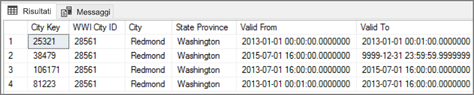

<span data-ttu-id="79d90-223">Per ogni fatto Sales si vuole associare tale fatto a una singola riga nella tabella delle dimensioni City, corrispondente alla data della fattura.</span><span class="sxs-lookup"><span data-stu-id="79d90-223">For each Sales fact, you want to associate that fact with a single row in City dimension table, corresponding to the invoice date.</span></span> <span data-ttu-id="79d90-224">Come parte del processo ETL, creare una colonna aggiuntiva che</span><span class="sxs-lookup"><span data-stu-id="79d90-224">As part of the ETL process, create an additional column that</span></span> 

<span data-ttu-id="79d90-225">La query T-SQL seguente crea una tabella temporanea che associa ogni fattura al valore City Key corretto dalla tabella delle dimensioni City.</span><span class="sxs-lookup"><span data-stu-id="79d90-225">The following T-SQL query creates a temporary table that associates each invoice with the correct City Key from the City dimension table.</span></span>

```sql
CREATE TABLE CityHolder
WITH (HEAP , DISTRIBUTION = HASH([WWI Invoice ID]))
AS
SELECT DISTINCT s1.[WWI Invoice ID] AS [WWI Invoice ID],
                c.[City Key] AS [City Key]
    FROM [Integration].[Sale_Staging] s1
    CROSS APPLY (
                SELECT TOP 1 [City Key]
                    FROM [Dimension].[City]
                WHERE [WWI City ID] = s1.[WWI City ID]
                    AND s1.[Last Modified When] > [Valid From]
                    AND s1.[Last Modified When] <= [Valid To]
                ORDER BY [Valid From], [City Key] DESC
                ) c

```

<span data-ttu-id="79d90-226">Questa tabella viene usata per popolare una colonna nella tabella dei fatti Sales:</span><span class="sxs-lookup"><span data-stu-id="79d90-226">This table is used to populate a column in the Sales fact table:</span></span>

```sql
UPDATE [Integration].[Sale_Staging]
SET [Integration].[Sale_Staging].[WWI Customer ID] =  CustomerHolder.[WWI Customer ID]
```

<span data-ttu-id="79d90-227">Questa colonna consente a una query di Power BI di trovare il record City corretto per una fattura di vendita specifica.</span><span class="sxs-lookup"><span data-stu-id="79d90-227">This column enables a Power BI query to find the correct City record for a given sales invoice.</span></span>

## <a name="security-considerations"></a><span data-ttu-id="79d90-228">Considerazioni relative alla sicurezza</span><span class="sxs-lookup"><span data-stu-id="79d90-228">Security considerations</span></span>

<span data-ttu-id="79d90-229">Per una sicurezza migliore, è possibile usare gli [Endpoint del servizio Rete virtuale](/azure/virtual-network/virtual-network-service-endpoints-overview) per proteggere le risorse dei servizi di Azure in modo che siano limitate solo alla rete virtuale specifica.</span><span class="sxs-lookup"><span data-stu-id="79d90-229">For additional security, you can use [Virtual Network service endpoints](/azure/virtual-network/virtual-network-service-endpoints-overview) to secure Azure service resources to only your virtual network.</span></span> <span data-ttu-id="79d90-230">In questo modo viene rimosso completamente l'accesso Internet pubblico a tali risorse, consentendo il traffico solo dalla rete virtuale specifica.</span><span class="sxs-lookup"><span data-stu-id="79d90-230">This fully removes public Internet access to those resources, allowing traffic only from your virtual network.</span></span>

<span data-ttu-id="79d90-231">Con questo approccio è possibile creare una rete virtuale di Azure e quindi creare endpoint di servizio privati per i servizi di Azure.</span><span class="sxs-lookup"><span data-stu-id="79d90-231">With this approach, you create a VNet in Azure and then create private service endpoints for Azure services.</span></span> <span data-ttu-id="79d90-232">Questi servizi vengono quindi limitati al traffico proveniente da tale rete virtuale.</span><span class="sxs-lookup"><span data-stu-id="79d90-232">Those services are then restricted to traffic from that virtual network.</span></span> <span data-ttu-id="79d90-233">È anche possibile raggiungerli dalla rete locale tramite un gateway.</span><span class="sxs-lookup"><span data-stu-id="79d90-233">You can also reach them from your on-premises network through a gateway.</span></span>

<span data-ttu-id="79d90-234">Tenere presente le limitazioni seguenti:</span><span class="sxs-lookup"><span data-stu-id="79d90-234">Be aware of the following limitations:</span></span>

- <span data-ttu-id="79d90-235">Al momento della creazione di questa architettura di riferimento, gli endpoint di servizio di rete virtuale sono supportati per Archiviazione di Azure e Azure SQL Data Warehouse, ma non per Azure Analysis Services.</span><span class="sxs-lookup"><span data-stu-id="79d90-235">At the time this reference architecture was created, VNet service endpoints are supported for Azure Storage and Azure SQL Data Warehouse, but not for Azure Analysis Service.</span></span> <span data-ttu-id="79d90-236">Per verificare lo stato più recente, vedere [qui](https://azure.microsoft.com/updates/?product=virtual-network).</span><span class="sxs-lookup"><span data-stu-id="79d90-236">Check the latest status [here](https://azure.microsoft.com/updates/?product=virtual-network).</span></span> 

- <span data-ttu-id="79d90-237">Se gli endpoint di servizio sono abilitati per Archiviazione di Azure, PolyBase non può copiare i dati da Archiviazione in SQL Data Warehouse.</span><span class="sxs-lookup"><span data-stu-id="79d90-237">If service endpoints are enabled for Azure Storage, PolyBase cannot copy data from Storage into SQL Data Warehouse.</span></span> <span data-ttu-id="79d90-238">È disponibile una mitigazione per questo problema.</span><span class="sxs-lookup"><span data-stu-id="79d90-238">There is a mitigation for this issue.</span></span> <span data-ttu-id="79d90-239">Per altre informazioni, vedere [Impatto dell'uso degli endpoint di servizio di rete virtuale con Archiviazione di Azure](/azure/sql-database/sql-database-vnet-service-endpoint-rule-overview?toc=%2fazure%2fvirtual-network%2ftoc.json#impact-of-using-vnet-service-endpoints-with-azure-storage).</span><span class="sxs-lookup"><span data-stu-id="79d90-239">For more information, see [Impact of using VNet Service Endpoints with Azure storage](/azure/sql-database/sql-database-vnet-service-endpoint-rule-overview?toc=%2fazure%2fvirtual-network%2ftoc.json#impact-of-using-vnet-service-endpoints-with-azure-storage).</span></span> 

- <span data-ttu-id="79d90-240">Per spostare i dati da locale in Archiviazione di Azure, sarà necessario aggiungere all'elenco elementi consentiti gli indirizzi IP pubblici dall'istanza locale o da ExpressRoute.</span><span class="sxs-lookup"><span data-stu-id="79d90-240">To move data from on-premises into Azure Storage, you will need to whitelist public IP addresses from your on-premises or ExpressRoute.</span></span> <span data-ttu-id="79d90-241">Per informazioni dettagliate, vedere [Associazione di servizi di Azure a reti virtuali](/azure/virtual-network/virtual-network-service-endpoints-overview#securing-azure-services-to-virtual-networks).</span><span class="sxs-lookup"><span data-stu-id="79d90-241">For details, see [Securing Azure services to virtual networks](/azure/virtual-network/virtual-network-service-endpoints-overview#securing-azure-services-to-virtual-networks).</span></span>

- <span data-ttu-id="79d90-242">Per consentire ad Analysis Services di leggere dati da SQL Data Warehouse, distribuire una macchina virtuale Windows nella rete virtuale che contiene l'endpoint di servizio di SQL Data Warehouse.</span><span class="sxs-lookup"><span data-stu-id="79d90-242">To enable Analysis Services to read data from SQL Data Warehouse, deploy a Windows VM to the virtual network that contains the SQL Data Warehouse service endpoint.</span></span> <span data-ttu-id="79d90-243">Installare il [Gateway dati locale di Azure](/azure/analysis-services/analysis-services-gateway) in questa VM.</span><span class="sxs-lookup"><span data-stu-id="79d90-243">Install [Azure On-premises Data Gateway](/azure/analysis-services/analysis-services-gateway) on this VM.</span></span> <span data-ttu-id="79d90-244">Connettere quindi Azure Analysis Services al gateway dati.</span><span class="sxs-lookup"><span data-stu-id="79d90-244">Then connect your Azure Analysis service to the data gateway.</span></span>

## <a name="deploy-the-solution"></a><span data-ttu-id="79d90-245">Distribuire la soluzione</span><span class="sxs-lookup"><span data-stu-id="79d90-245">Deploy the solution</span></span>

<span data-ttu-id="79d90-246">Una distribuzione di questa architettura di riferimento è disponibile in [GitHub][ref-arch-repo-folder].</span><span class="sxs-lookup"><span data-stu-id="79d90-246">A deployment for this reference architecture is available on [GitHub][ref-arch-repo-folder].</span></span> <span data-ttu-id="79d90-247">Ecco cosa viene distribuito:</span><span class="sxs-lookup"><span data-stu-id="79d90-247">It deploys the following:</span></span>

  * <span data-ttu-id="79d90-248">Una macchina virtuale di Windows per simulare un server di database locale.</span><span class="sxs-lookup"><span data-stu-id="79d90-248">A Windows VM to simulate an on-premises database server.</span></span> <span data-ttu-id="79d90-249">Include SQL Server 2017 e strumenti correlati, assieme a Power BI Desktop.</span><span class="sxs-lookup"><span data-stu-id="79d90-249">It includes SQL Server 2017 and related tools, along with Power BI Desktop.</span></span>
  * <span data-ttu-id="79d90-250">Un account di archiviazione di Azure che fornisce l'archiviazione BLOB per conservare i dati esportati dal database di SQL Server.</span><span class="sxs-lookup"><span data-stu-id="79d90-250">An Azure storage account that provides Blob storage to hold data exported from the SQL Server database.</span></span>
  * <span data-ttu-id="79d90-251">Un'istanza di Azure SQL Data Warehouse.</span><span class="sxs-lookup"><span data-stu-id="79d90-251">An Azure SQL Data Warehouse instance.</span></span>
  * <span data-ttu-id="79d90-252">Un'istanza di Azure Analysis Services.</span><span class="sxs-lookup"><span data-stu-id="79d90-252">An Azure Analysis Services instance.</span></span>
  * <span data-ttu-id="79d90-253">Azure Data Factory e la pipeline di Data Factory per il processo ELT.</span><span class="sxs-lookup"><span data-stu-id="79d90-253">Azure Data Factory and the Data Factory pipeline for the ELT job.</span></span>

### <a name="prerequisites"></a><span data-ttu-id="79d90-254">Prerequisiti</span><span class="sxs-lookup"><span data-stu-id="79d90-254">Prerequisites</span></span>

[!INCLUDE [ref-arch-prerequisites.md](../../../includes/ref-arch-prerequisites.md)]

### <a name="variables"></a><span data-ttu-id="79d90-255">variables</span><span class="sxs-lookup"><span data-stu-id="79d90-255">Variables</span></span>

<span data-ttu-id="79d90-256">I passaggi seguenti includono alcune variabili definite dall'utente.</span><span class="sxs-lookup"><span data-stu-id="79d90-256">The steps that follow include some user-defined variables.</span></span> <span data-ttu-id="79d90-257">Potrebbe essere necessario sostituire tali variabili con valori specifici.</span><span class="sxs-lookup"><span data-stu-id="79d90-257">You will need to replace these with values that you define.</span></span>

- <span data-ttu-id="79d90-258">`<data_factory_name>`.</span><span class="sxs-lookup"><span data-stu-id="79d90-258">`<data_factory_name>`.</span></span> <span data-ttu-id="79d90-259">Nome dell'istanza di Data Factory.</span><span class="sxs-lookup"><span data-stu-id="79d90-259">Data Factory name.</span></span>
- <span data-ttu-id="79d90-260">`<analysis_server_name>`.</span><span class="sxs-lookup"><span data-stu-id="79d90-260">`<analysis_server_name>`.</span></span> <span data-ttu-id="79d90-261">Nome del server di Analysis Services.</span><span class="sxs-lookup"><span data-stu-id="79d90-261">Analysis Services server name.</span></span>
- <span data-ttu-id="79d90-262">`<active_directory_upn>`.</span><span class="sxs-lookup"><span data-stu-id="79d90-262">`<active_directory_upn>`.</span></span> <span data-ttu-id="79d90-263">Nome dell'entità utente di Azure Active Directory.</span><span class="sxs-lookup"><span data-stu-id="79d90-263">Your Azure Active Directory user principal name (UPN).</span></span> <span data-ttu-id="79d90-264">Ad esempio: `user@contoso.com`.</span><span class="sxs-lookup"><span data-stu-id="79d90-264">For example, `user@contoso.com`.</span></span>
- <span data-ttu-id="79d90-265">`<data_warehouse_server_name>`.</span><span class="sxs-lookup"><span data-stu-id="79d90-265">`<data_warehouse_server_name>`.</span></span> <span data-ttu-id="79d90-266">Nome del server di SQL Data Warehouse.</span><span class="sxs-lookup"><span data-stu-id="79d90-266">SQL Data Warehouse server name.</span></span>
- <span data-ttu-id="79d90-267">`<data_warehouse_password>`.</span><span class="sxs-lookup"><span data-stu-id="79d90-267">`<data_warehouse_password>`.</span></span> <span data-ttu-id="79d90-268">Password dell'amministratore di SQL Data Warehouse.</span><span class="sxs-lookup"><span data-stu-id="79d90-268">SQL Data Warehouse administrator password.</span></span>
- <span data-ttu-id="79d90-269">`<resource_group_name>`.</span><span class="sxs-lookup"><span data-stu-id="79d90-269">`<resource_group_name>`.</span></span> <span data-ttu-id="79d90-270">Nome del gruppo di risorse.</span><span class="sxs-lookup"><span data-stu-id="79d90-270">The name of the resource group.</span></span>
- <span data-ttu-id="79d90-271">`<region>`.</span><span class="sxs-lookup"><span data-stu-id="79d90-271">`<region>`.</span></span> <span data-ttu-id="79d90-272">Area di Azure in cui verranno distribuite le risorse.</span><span class="sxs-lookup"><span data-stu-id="79d90-272">The Azure region where the resources will be deployed.</span></span>
- <span data-ttu-id="79d90-273">`<storage_account_name>`.</span><span class="sxs-lookup"><span data-stu-id="79d90-273">`<storage_account_name>`.</span></span> <span data-ttu-id="79d90-274">Nome dell'account di archiviazione.</span><span class="sxs-lookup"><span data-stu-id="79d90-274">Storage account name.</span></span> <span data-ttu-id="79d90-275">Deve seguire le [regole di denominazione](../../best-practices/naming-conventions.md#naming-rules-and-restrictions) per gli account di archiviazione.</span><span class="sxs-lookup"><span data-stu-id="79d90-275">Must follow the [naming rules](../../best-practices/naming-conventions.md#naming-rules-and-restrictions) for Storage accounts.</span></span>
- <span data-ttu-id="79d90-276">`<sql-db-password>`.</span><span class="sxs-lookup"><span data-stu-id="79d90-276">`<sql-db-password>`.</span></span> <span data-ttu-id="79d90-277">Password di accesso a SQL Server.</span><span class="sxs-lookup"><span data-stu-id="79d90-277">SQL Server login password.</span></span>

### <a name="deploy-azure-data-factory"></a><span data-ttu-id="79d90-278">Distribuire Azure Data Factory</span><span class="sxs-lookup"><span data-stu-id="79d90-278">Deploy Azure Data Factory</span></span>

1. <span data-ttu-id="79d90-279">Passare alla cartella `data\enterprise_bi_sqldw_advanced\azure\templates` del [repository GitHub][ref-arch-repo].</span><span class="sxs-lookup"><span data-stu-id="79d90-279">Navigate to the `data\enterprise_bi_sqldw_advanced\azure\templates` folder of the [GitHub repository][ref-arch-repo].</span></span>

2. <span data-ttu-id="79d90-280">Eseguire il comando dell'interfaccia della riga di comando di Azure per creare un gruppo di risorse.</span><span class="sxs-lookup"><span data-stu-id="79d90-280">Run the following Azure CLI command to create a resource group.</span></span>  

    ```bash
    az group create --name <resource_group_name> --location <region>  
    ```

    <span data-ttu-id="79d90-281">Specificare un'area che supporta SQL Data Warehouse, Azure Analysis Services e Data Factory v2.</span><span class="sxs-lookup"><span data-stu-id="79d90-281">Specify a region that supports SQL Data Warehouse, Azure Analysis Services, and Data Factory v2.</span></span> <span data-ttu-id="79d90-282">Vedere [Prodotti di Azure in base all'area](https://azure.microsoft.com/global-infrastructure/services/).</span><span class="sxs-lookup"><span data-stu-id="79d90-282">See [Azure Products by Region](https://azure.microsoft.com/global-infrastructure/services/)</span></span>

3. <span data-ttu-id="79d90-283">Eseguire il comando seguente</span><span class="sxs-lookup"><span data-stu-id="79d90-283">Run the following command</span></span>

    ```
    az group deployment create --resource-group <resource_group_name> \
        --template-file adf-create-deploy.json \
        --parameters factoryName=<data_factory_name> location=<location>
    ```

<span data-ttu-id="79d90-284">Usare quindi il portale di Azure per ottenere la chiave di autenticazione per il [runtime di integrazione](/azure/data-factory/concepts-integration-runtime) di Azure Data Factory, come indicato di seguito:</span><span class="sxs-lookup"><span data-stu-id="79d90-284">Next, use the Azure Portal to get the authentication key for the Azure Data Factory [integration runtime](/azure/data-factory/concepts-integration-runtime), as follows:</span></span>

1. <span data-ttu-id="79d90-285">Nel [portale di Azure](https://portal.azure.com/) passare all'istanza di Data Factory.</span><span class="sxs-lookup"><span data-stu-id="79d90-285">In the [Azure Portal](https://portal.azure.com/), navigate to the Data Factory instance.</span></span>

2. <span data-ttu-id="79d90-286">Nel pannello Data Factory fare clic su **Crea e monitora**.</span><span class="sxs-lookup"><span data-stu-id="79d90-286">In the Data Factory blade, click **Author & Monitor**.</span></span> <span data-ttu-id="79d90-287">Il portale di Azure Data Factory verrà aperto in un'altra finestra del browser.</span><span class="sxs-lookup"><span data-stu-id="79d90-287">This opens the Azure Data Factory portal in another browser window.</span></span>

    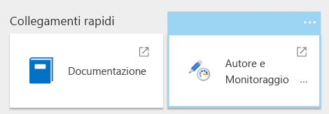

3. <span data-ttu-id="79d90-288">Nel portale di Azure Data Factory selezionare l'icona a forma di matita ("Crea").</span><span class="sxs-lookup"><span data-stu-id="79d90-288">In the Azure Data Factory portal, select the pencil icon ("Author").</span></span> 

4. <span data-ttu-id="79d90-289">Fare clic su **Connessioni**, e quindi selezionare **Integration Runtimes** (Runtime di integrazione).</span><span class="sxs-lookup"><span data-stu-id="79d90-289">Click **Connections**, and then select **Integration Runtimes**.</span></span>

5. <span data-ttu-id="79d90-290">In **sourceIntegrationRuntime** fare clic sull'icona a forma di matita ("Modifica").</span><span class="sxs-lookup"><span data-stu-id="79d90-290">Under **sourceIntegrationRuntime**, click the pencil icon ("Edit").</span></span>

    > [!NOTE]
    > <span data-ttu-id="79d90-291">Lo stato del portale sarà "non disponibile".</span><span class="sxs-lookup"><span data-stu-id="79d90-291">The portal will show the status as "unavailable".</span></span> <span data-ttu-id="79d90-292">Questo comportamento è previsto fino alla distribuzione del server locale.</span><span class="sxs-lookup"><span data-stu-id="79d90-292">This is expected until you deploy the on-premises server.</span></span>

6. <span data-ttu-id="79d90-293">Trovare il valore **Key1** e copiare il valore della chiave di autenticazione.</span><span class="sxs-lookup"><span data-stu-id="79d90-293">Find **Key1** and copy the value of the authentication key.</span></span>

<span data-ttu-id="79d90-294">La chiave di autenticazione sarà necessaria per il passaggio successivo.</span><span class="sxs-lookup"><span data-stu-id="79d90-294">You will need the authentication key for the next step.</span></span>

### <a name="deploy-the-simulated-on-premises-server"></a><span data-ttu-id="79d90-295">Distribuire il server locale simulato</span><span class="sxs-lookup"><span data-stu-id="79d90-295">Deploy the simulated on-premises server</span></span>

<span data-ttu-id="79d90-296">Questo passaggio distribuisce una macchina virtuale come server locale simulato, che include SQL Server 2017 e strumenti correlati.</span><span class="sxs-lookup"><span data-stu-id="79d90-296">This step deploys a VM as a simulated on-premises server, which includes SQL Server 2017 and related tools.</span></span> <span data-ttu-id="79d90-297">Carica anche il [database OLTP "Wide World Importers"][wwi] in SQL Server.</span><span class="sxs-lookup"><span data-stu-id="79d90-297">It also loads the [Wide World Importers OLTP database][wwi] into SQL Server.</span></span>

1. <span data-ttu-id="79d90-298">Passare alla cartella `data\enterprise_bi_sqldw_advanced\onprem\templates` del repository.</span><span class="sxs-lookup"><span data-stu-id="79d90-298">Navigate to the `data\enterprise_bi_sqldw_advanced\onprem\templates` folder of the repository.</span></span>

2. <span data-ttu-id="79d90-299">Nel file `onprem.parameters.json` cercare `adminPassword`.</span><span class="sxs-lookup"><span data-stu-id="79d90-299">In the `onprem.parameters.json` file, search for `adminPassword`.</span></span> <span data-ttu-id="79d90-300">Questa è la password per accedere alla macchina virtuale di SQL Server.</span><span class="sxs-lookup"><span data-stu-id="79d90-300">This is the password to log into the SQL Server VM.</span></span> <span data-ttu-id="79d90-301">Sostituire il valore con un'altra password.</span><span class="sxs-lookup"><span data-stu-id="79d90-301">Replace the value with another password.</span></span>

3. <span data-ttu-id="79d90-302">Nello stesso file cercare `SqlUserCredentials`.</span><span class="sxs-lookup"><span data-stu-id="79d90-302">In the same file, search for `SqlUserCredentials`.</span></span> <span data-ttu-id="79d90-303">Questa proprietà specifica le credenziali dell'account SQL Server.</span><span class="sxs-lookup"><span data-stu-id="79d90-303">This property specifies the SQL Server account credentials.</span></span> <span data-ttu-id="79d90-304">Sostituire la password con un valore diverso.</span><span class="sxs-lookup"><span data-stu-id="79d90-304">Replace the password with a different value.</span></span>

4. <span data-ttu-id="79d90-305">Nello stesso file incollare la chiave di autenticazione di Integration Runtime nel parametro `IntegrationRuntimeGatewayKey`, come indicato di seguito:</span><span class="sxs-lookup"><span data-stu-id="79d90-305">In the same file, paste the Integration Runtime authentication key into the `IntegrationRuntimeGatewayKey` parameter, as shown below:</span></span>

    ```json
    "protectedSettings": {
        "configurationArguments": {
            "SqlUserCredentials": {
                "userName": ".\\adminUser",
                "password": "<sql-db-password>"
            },
            "IntegrationRuntimeGatewayKey": "<authentication key>"
        }
    ```

5. <span data-ttu-id="79d90-306">Eseguire il comando indicato di seguito.</span><span class="sxs-lookup"><span data-stu-id="79d90-306">Run the following command.</span></span>

    ```bash
    azbb -s <subscription_id> -g <resource_group_name> -l <region> -p onprem.parameters.json --deploy
    ```

<span data-ttu-id="79d90-307">Il completamento di questo passaggio potrebbe richiedere tra 20 e 30 minuti.</span><span class="sxs-lookup"><span data-stu-id="79d90-307">This step may take 20 to 30 minutes to complete.</span></span> <span data-ttu-id="79d90-308">Include l'esecuzione di uno script di [DSC](/powershell/dsc/overview) per l'installazione degli strumenti e il ripristino del database.</span><span class="sxs-lookup"><span data-stu-id="79d90-308">It includes running a [DSC](/powershell/dsc/overview) script to install the tools and restore the database.</span></span> 

### <a name="deploy-azure-resources"></a><span data-ttu-id="79d90-309">Distribuire le risorse di Azure</span><span class="sxs-lookup"><span data-stu-id="79d90-309">Deploy Azure resources</span></span>

<span data-ttu-id="79d90-310">Questo passaggio effettua il provisioning di SQL Data Warehouse, Azure Analysis Services e Data Factory.</span><span class="sxs-lookup"><span data-stu-id="79d90-310">This step provisions SQL Data Warehouse, Azure Analysis Services, and Data Factory.</span></span>

1. <span data-ttu-id="79d90-311">Passare alla cartella `data\enterprise_bi_sqldw_advanced\azure\templates` del [repository GitHub][ref-arch-repo].</span><span class="sxs-lookup"><span data-stu-id="79d90-311">Navigate to the `data\enterprise_bi_sqldw_advanced\azure\templates` folder of the [GitHub repository][ref-arch-repo].</span></span>

2. <span data-ttu-id="79d90-312">Eseguire il comando dell'interfaccia della riga di comando di Azure seguente:</span><span class="sxs-lookup"><span data-stu-id="79d90-312">Run the following Azure CLI command.</span></span> <span data-ttu-id="79d90-313">Sostituire i valori dei parametri visualizzati tra parentesi acute.</span><span class="sxs-lookup"><span data-stu-id="79d90-313">Replace the parameter values shown in angle brackets.</span></span>

    ```bash
    az group deployment create --resource-group <resource_group_name> \
     --template-file azure-resources-deploy.json \
     --parameters "dwServerName"="<data_warehouse_server_name>" \
     "dwAdminLogin"="adminuser" "dwAdminPassword"="<data_warehouse_password>" \ 
     "storageAccountName"="<storage_account_name>" \
     "analysisServerName"="<analysis_server_name>" \
     "analysisServerAdmin"="<user@contoso.com>"
    ```

    - <span data-ttu-id="79d90-314">Il parametro `storageAccountName` deve seguire le [regole di denominazione](../../best-practices/naming-conventions.md#naming-rules-and-restrictions) per gli account di archiviazione.</span><span class="sxs-lookup"><span data-stu-id="79d90-314">The `storageAccountName` parameter must follow the [naming rules](../../best-practices/naming-conventions.md#naming-rules-and-restrictions) for Storage accounts.</span></span> 
    - <span data-ttu-id="79d90-315">Per il parametro `analysisServerAdmin`, usare il nome dell'entità utente (UPN) di Azure Active Directory.</span><span class="sxs-lookup"><span data-stu-id="79d90-315">For the `analysisServerAdmin` parameter, use your Azure Active Directory user principal name (UPN).</span></span>

3. <span data-ttu-id="79d90-316">Eseguire il comando seguente dell'interfaccia della riga di comando di Azure per ottenere la chiave di accesso per l'account di archiviazione.</span><span class="sxs-lookup"><span data-stu-id="79d90-316">Run the following Azure CLI command to get the access key for the storage account.</span></span> <span data-ttu-id="79d90-317">La chiave verrà usata nel passaggio successivo.</span><span class="sxs-lookup"><span data-stu-id="79d90-317">You will use this key in the next step.</span></span>

    ```bash
    az storage account keys list -n <storage_account_name> -g <resource_group_name> --query [0].value
    ```

4. <span data-ttu-id="79d90-318">Eseguire il comando dell'interfaccia della riga di comando di Azure seguente:</span><span class="sxs-lookup"><span data-stu-id="79d90-318">Run the following Azure CLI command.</span></span> <span data-ttu-id="79d90-319">Sostituire i valori dei parametri visualizzati tra parentesi acute.</span><span class="sxs-lookup"><span data-stu-id="79d90-319">Replace the parameter values shown in angle brackets.</span></span> 

    ```bash
    az group deployment create --resource-group <resource_group_name> \
    --template-file adf-pipeline-deploy.json \
    --parameters "factoryName"="<data_factory_name>" \
    "sinkDWConnectionString"="Server=tcp:<data_warehouse_server_name>.database.windows.net,1433;Initial Catalog=wwi;Persist Security Info=False;User ID=adminuser;Password=<data_warehouse_password>;MultipleActiveResultSets=False;Encrypt=True;TrustServerCertificate=False;Connection Timeout=30;" \
    "blobConnectionString"="DefaultEndpointsProtocol=https;AccountName=<storage_account_name>;AccountKey=<storage_account_key>;EndpointSuffix=core.windows.net" \
    "sourceDBConnectionString"="Server=sql1;Database=WideWorldImporters;User Id=adminuser;Password=<sql-db-password>;Trusted_Connection=True;"
    ```

    <span data-ttu-id="79d90-320">Le stringhe di connessione includono sottostringhe visualizzate tra parentesi acute, che devono essere sostituite.</span><span class="sxs-lookup"><span data-stu-id="79d90-320">The connection strings have substrings shown in angle brackets that must be replaced.</span></span> <span data-ttu-id="79d90-321">Per `<storage_account_key>` usare la chiave ottenuta nel passaggio precedente.</span><span class="sxs-lookup"><span data-stu-id="79d90-321">For `<storage_account_key>`, use the key that you got in the previous step.</span></span> <span data-ttu-id="79d90-322">Per `<sql-db-password>` usare la password dell'account SQL Server specificata in precedenza nel file `onprem.parameters.json`.</span><span class="sxs-lookup"><span data-stu-id="79d90-322">For `<sql-db-password>`, use the SQL Server account password that you specified in the `onprem.parameters.json` file previously.</span></span>

### <a name="run-the-data-warehouse-scripts"></a><span data-ttu-id="79d90-323">Eseguire gli script di data warehouse</span><span class="sxs-lookup"><span data-stu-id="79d90-323">Run the data warehouse scripts</span></span>

1. <span data-ttu-id="79d90-324">Nel [portale di Azure](https://portal.azure.com/) trovare la VM locale, denominata `sql-vm1`.</span><span class="sxs-lookup"><span data-stu-id="79d90-324">In the [Azure Portal](https://portal.azure.com/), find the on-premises VM, which is named `sql-vm1`.</span></span> <span data-ttu-id="79d90-325">Il nome utente e la password per la VM sono specificati nel file `onprem.parameters.json`.</span><span class="sxs-lookup"><span data-stu-id="79d90-325">The user name and password for the VM are specified in the `onprem.parameters.json` file.</span></span>

2. <span data-ttu-id="79d90-326">Fare clic su **Connetti** e usare Desktop remoto per connettersi alla VM.</span><span class="sxs-lookup"><span data-stu-id="79d90-326">Click **Connect** and use Remote Desktop to connect to the VM.</span></span>

3. <span data-ttu-id="79d90-327">Dalla sessione di Desktop remoto aprire un prompt dei comandi e passare alla cartella seguente nella VM:</span><span class="sxs-lookup"><span data-stu-id="79d90-327">From your Remote Desktop session, open a command prompt and navigate to the following folder on the VM:</span></span>

    ```
    cd C:\SampleDataFiles\reference-architectures\data\enterprise_bi_sqldw_advanced\azure\sqldw_scripts
    ```

4. <span data-ttu-id="79d90-328">Eseguire il comando seguente:</span><span class="sxs-lookup"><span data-stu-id="79d90-328">Run the following command:</span></span>

    ```
    deploy_database.cmd -S <data_warehouse_server_name>.database.windows.net -d wwi -U adminuser -P <data_warehouse_password> -N -I
    ```

    <span data-ttu-id="79d90-329">Per `<data_warehouse_server_name>` e `<data_warehouse_password>` usare il nome e la password del server del data warehouse indicati in precedenza.</span><span class="sxs-lookup"><span data-stu-id="79d90-329">For `<data_warehouse_server_name>` and `<data_warehouse_password>`, use the data warehouse server name and password from earlier.</span></span>

<span data-ttu-id="79d90-330">Per verificare questo passaggio, è possibile usare SQL Server Management Studio (SSMS) per connettersi al database di SQL Data Warehouse.</span><span class="sxs-lookup"><span data-stu-id="79d90-330">To verify this step, you can use SQL Server Management Studio (SSMS) to connect to the SQL Data Warehouse database.</span></span> <span data-ttu-id="79d90-331">Dovrebbero essere visualizzati gli schemi della tabella del database.</span><span class="sxs-lookup"><span data-stu-id="79d90-331">You should see the database table schemas.</span></span>

### <a name="run-the-data-factory-pipeline"></a><span data-ttu-id="79d90-332">Eseguire la pipeline di Data Factory</span><span class="sxs-lookup"><span data-stu-id="79d90-332">Run the Data Factory pipeline</span></span>

1. <span data-ttu-id="79d90-333">Dalla stessa sessione di Desktop remoto aprire una finestra di PowerShell.</span><span class="sxs-lookup"><span data-stu-id="79d90-333">From the same Remote Desktop session, open a PowerShell window.</span></span>

2. <span data-ttu-id="79d90-334">Eseguire il comando di PowerShell seguente.</span><span class="sxs-lookup"><span data-stu-id="79d90-334">Run the following PowerShell command.</span></span> <span data-ttu-id="79d90-335">Scegliere **Sì** quando richiesto.</span><span class="sxs-lookup"><span data-stu-id="79d90-335">Choose **Yes** when prompted.</span></span>

    ```powershell
    Install-Module -Name AzureRM -AllowClobber
    ```

3. <span data-ttu-id="79d90-336">Eseguire il comando di PowerShell seguente.</span><span class="sxs-lookup"><span data-stu-id="79d90-336">Run the following PowerShell command.</span></span> <span data-ttu-id="79d90-337">Immettere le credenziali di Azure quando richiesto.</span><span class="sxs-lookup"><span data-stu-id="79d90-337">Enter your Azure credentials when prompted.</span></span>

    ```powershell
    Connect-AzureRmAccount 
    ```

4. <span data-ttu-id="79d90-338">Eseguire i comandi di PowerShell seguenti.</span><span class="sxs-lookup"><span data-stu-id="79d90-338">Run the following PowerShell commands.</span></span> <span data-ttu-id="79d90-339">Sostituire i valori visualizzati tra parentesi acute.</span><span class="sxs-lookup"><span data-stu-id="79d90-339">Replace the values in angle brackets.</span></span>

    ```powershell
    Set-AzureRmContext -SubscriptionId <subscription id>

    Invoke-AzureRmDataFactoryV2Pipeline -DataFactory <data-factory-name> -PipelineName "MasterPipeline" -ResourceGroupName <resource_group_name>

5. In the Azure Portal, navigate to the Data Factory instance that was created earlier.

6. In the Data Factory blade, click **Author & Monitor**. This opens the Azure Data Factory portal in another browser window.

    

7. In the Azure Data Factory portal, click the **Monitor** icon. 

8. Verify that the pipeline completes successfully. It can take a few minutes.

    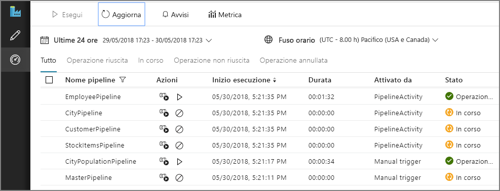


## Build the Analysis Services model

In this step, you will create a tabular model that imports data from the data warehouse. Then you will deploy the model to Azure Analysis Services.

**Create a new tabular project**

1. From your Remote Desktop session, launch SQL Server Data Tools 2015.

2. Select **File** > **New** > **Project**.

3. In the **New Project** dialog, under **Templates**, select  **Business Intelligence** > **Analysis Services** > **Analysis Services Tabular Project**. 

4. Name the project and click **OK**.

5. In the **Tabular model designer** dialog, select **Integrated workspace**  and set **Compatibility level** to `SQL Server 2017 / Azure Analysis Services (1400)`. 

6. Click **OK**.


**Import data**

1. In the **Tabular Model Explorer** window, right-click the project and select **Import from Data Source**.

2. Select **Azure SQL Data Warehouse** and click **Connect**.

3. For **Server**, enter the fully qualified name of your Azure SQL Data Warehouse server. You can get this value from the Azure Portal. For **Database**, enter `wwi`. Click **OK**.

4. In the next dialog, choose **Database** authentication and enter your Azure SQL Data Warehouse user name and password, and click **OK**.

5. In the **Navigator** dialog, select the checkboxes for the **Fact.\*** and **Dimension.\*** tables.

    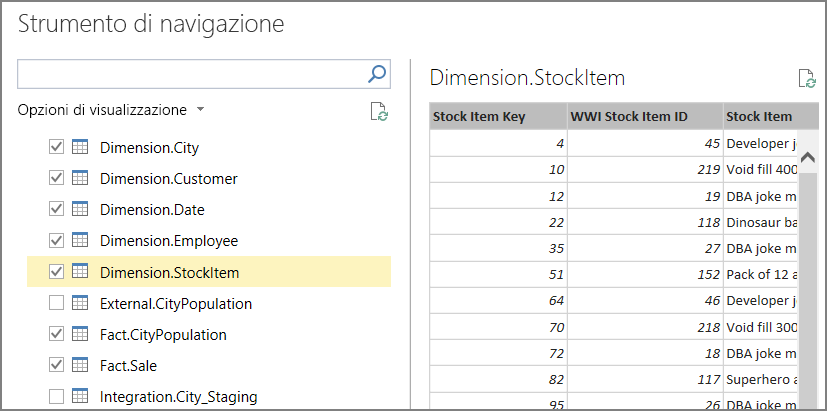

6. Click **Load**. When processing is complete, click **Close**. You should now see a tabular view of the data.

**Create measures**

1. In the model designer, select the **Fact Sale** table.

2. Click a cell in the the measure grid. By default, the measure grid is displayed below the table. 

    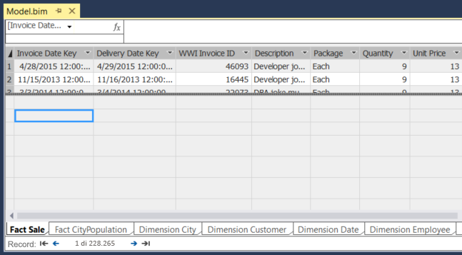

3. In the formula bar, enter the following and press ENTER:

    ```
    <span data-ttu-id="79d90-340">Total Sales:=SUM('Fact Sale'[Total Including Tax])</span><span class="sxs-lookup"><span data-stu-id="79d90-340">Total Sales:=SUM('Fact Sale'[Total Including Tax])</span></span>
    ```

4. Repeat these steps to create the following measures:

    ```
    <span data-ttu-id="79d90-341">Number of Years:=(MAX('Fact CityPopulation'[YearNumber])-MIN('Fact CityPopulation'[YearNumber]))+1</span><span class="sxs-lookup"><span data-stu-id="79d90-341">Number of Years:=(MAX('Fact CityPopulation'[YearNumber])-MIN('Fact CityPopulation'[YearNumber]))+1</span></span>
    
    <span data-ttu-id="79d90-342">Beginning Population:=CALCULATE(SUM('Fact CityPopulation'[Population]),FILTER('Fact CityPopulation','Fact CityPopulation'[YearNumber]=MIN('Fact CityPopulation'[YearNumber])))</span><span class="sxs-lookup"><span data-stu-id="79d90-342">Beginning Population:=CALCULATE(SUM('Fact CityPopulation'[Population]),FILTER('Fact CityPopulation','Fact CityPopulation'[YearNumber]=MIN('Fact CityPopulation'[YearNumber])))</span></span>
    
    <span data-ttu-id="79d90-343">Ending Population:=CALCULATE(SUM('Fact CityPopulation'[Population]),FILTER('Fact CityPopulation','Fact CityPopulation'[YearNumber]=MAX('Fact CityPopulation'[YearNumber])))</span><span class="sxs-lookup"><span data-stu-id="79d90-343">Ending Population:=CALCULATE(SUM('Fact CityPopulation'[Population]),FILTER('Fact CityPopulation','Fact CityPopulation'[YearNumber]=MAX('Fact CityPopulation'[YearNumber])))</span></span>
    
    <span data-ttu-id="79d90-344">CAGR:=IFERROR((([Ending Population]/[Beginning Population])^(1/[Number of Years]))-1,0)</span><span class="sxs-lookup"><span data-stu-id="79d90-344">CAGR:=IFERROR((([Ending Population]/[Beginning Population])^(1/[Number of Years]))-1,0)</span></span>
    ```

    

For more information about creating measures in SQL Server Data Tools, see [Measures](/sql/analysis-services/tabular-models/measures-ssas-tabular).

**Create relationships**

1. In the **Tabular Model Explorer** window, right-click the project and select **Model View** > **Diagram View**.

2. Drag the **[Fact Sale].[City Key]** field to the **[Dimension City].[City Key]** field to create a relationship.  

3. Drag the **[Face CityPopulation].[City Key]** field to the **[Dimension City].[City Key]** field.  

    

**Deploy the model**

1. From the **File** menu, choose **Save All**.

2. In **Solution Explorer**, right-click the project and select **Properties**. 

3. Under **Server**, enter the URL of your Azure Analysis Services instance. You can get this value from the Azure Portal. In the portal, select the Analysis Services resource, click the Overview pane, and look for the **Server Name** property. It will be similar to `asazure://westus.asazure.windows.net/contoso`. Click **OK**.

    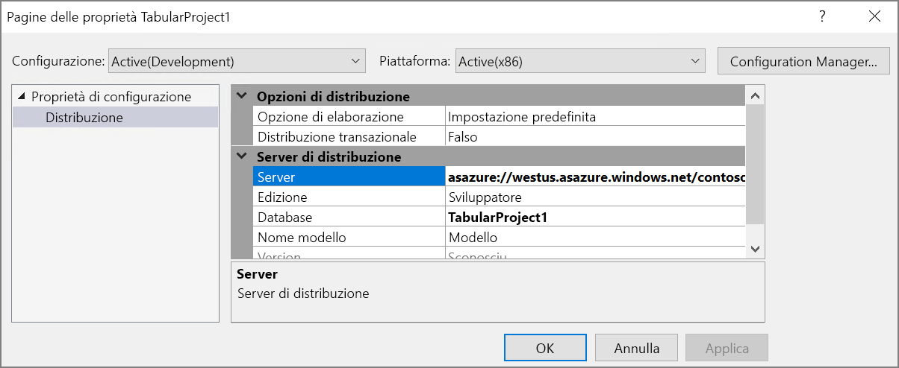

4. In **Solution Explorer**, right-click the project and select **Deploy**. Sign into Azure if prompted. When processing is complete, click **Close**.

5. In the Azure portal, view the details for your Azure Analysis Services instance. Verify that your model appears in the list of models.

    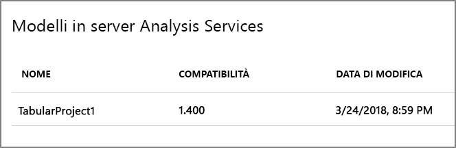

## Analyze the data in Power BI Desktop

In this step, you will use Power BI to create a report from the data in Analysis Services.

1. From your Remote Desktop session, launch Power BI Desktop.

2. In the Welcome Scren, click **Get Data**.

3. Select **Azure** > **Azure Analysis Services database**. Click **Connect**

    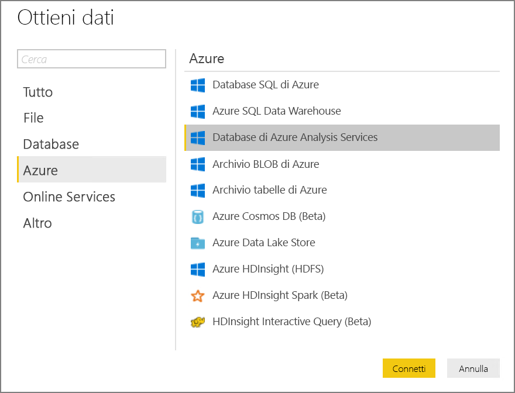

4. Enter the URL of your Analysis Services instance, then click **OK**. Sign into Azure if prompted.

5. In the **Navigator** dialog, expand the tabular project, select the model, and click **OK**.

2. In the **Visualizations** pane, select the **Table** icon. In the Report view, resize the visualization to make it larger.

6. In the **Fields** pane, expand **Dimension City**.

7. From **Dimension City**, drag **City** and **State Province** to the **Values** well.

9. In the **Fields** pane, expand **Fact Sale**.

10. From **Fact Sale**, drag **CAGR**, **Ending Population**,  and **Total Sales** to the **Value** well.

11. Under **Visual Level Filters**, select **Ending Population**. Set the filter to "is greater than 100000" and click **Apply filter**.

12. Under **Visual Level Filters**, select **Total Sales**. Set the filter to "is 0" and click **Apply filter**.

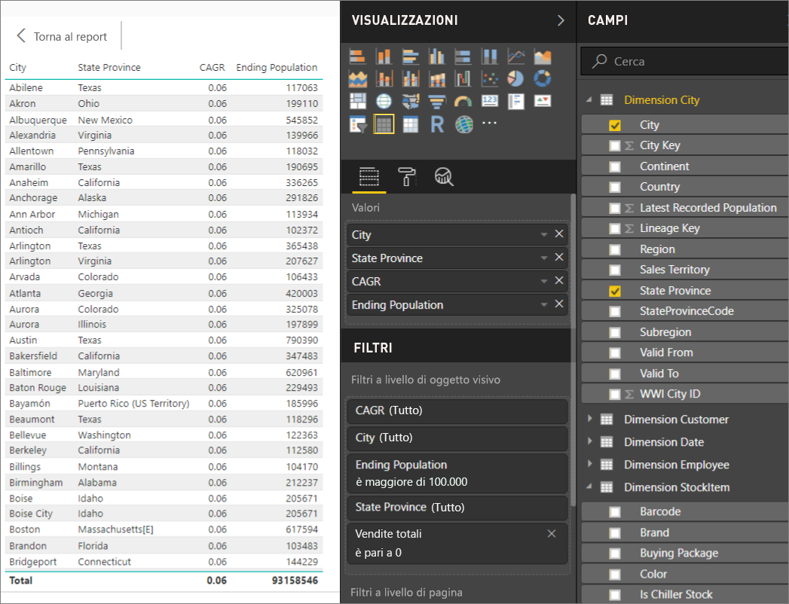

The table now shows cities with population greater than 100,000 and zero sales. CAGR  stands for Compounded Annual Growth Rate and measures the rate of population growth per city. You could use this value to find cities with high growth rates, for example. However, note that the values for CAGR in the model aren't accurate, because they are derived from sample data.

To learn more about Power BI Desktop, see [Getting started with Power BI Desktop](/power-bi/desktop-getting-started).


[adf]: //azure/data-factory
[azure-cli-2]: //azure/install-azure-cli
[azbb-repo]: https://github.com/mspnp/template-building-blocks
[azbb-wiki]: https://github.com/mspnp/template-building-blocks/wiki/Install-Azure-Building-Blocks
[MergeLocation]: https://github.com/mspnp/reference-architectures/blob/master/data/enterprise_bi_sqldw_advanced/azure/sqldw_scripts/city/%5BIntegration%5D.%5BMergeLocation%5D.sql
[ref-arch-repo]: https://github.com/mspnp/reference-architectures
[ref-arch-repo-folder]: https://github.com/mspnp/reference-architectures/tree/master/data/enterprise_bi_sqldw_advanced
[wwi]: //sql/sample/world-wide-importers/wide-world-importers-oltp-database
