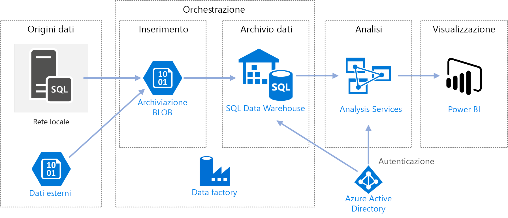

# <a name="automated-enterprise-bi-with-sql-data-warehouse-and-azure-data-factory"></a><span data-ttu-id="972db-103">Business intelligence aziendale automatizzata con SQL Data Warehouse e Azure Data Factory</span><span class="sxs-lookup"><span data-stu-id="972db-103">Automated enterprise BI with SQL Data Warehouse and Azure Data Factory</span></span>

<span data-ttu-id="972db-104">Questa architettura di riferimento mostra come eseguire il caricamento incrementale in una pipeline [ELT](../../data-guide/relational-data/etl.md#extract-load-and-transform-elt) (estrazione-caricamento-trasformazione).</span><span class="sxs-lookup"><span data-stu-id="972db-104">This reference architecture shows how to perform incremental loading in an [ELT](../../data-guide/relational-data/etl.md#extract-load-and-transform-elt) (extract-load-transform) pipeline.</span></span> <span data-ttu-id="972db-105">Usa Azure Data Factory per automatizzare la pipeline ELT.</span><span class="sxs-lookup"><span data-stu-id="972db-105">It uses Azure Data Factory to automate the ELT pipeline.</span></span> <span data-ttu-id="972db-106">La pipeline sposta in modo incrementale i dati OLTP più recenti da un database di SQL Server locale in SQL Data Warehouse.</span><span class="sxs-lookup"><span data-stu-id="972db-106">The pipeline incrementally moves the latest OLTP data from an on-premises SQL Server database into SQL Data Warehouse.</span></span> <span data-ttu-id="972db-107">I dati transazionali vengono trasformati in un modello tabulare per l'analisi.</span><span class="sxs-lookup"><span data-stu-id="972db-107">Transactional data is transformed into a tabular model for analysis.</span></span>

> [!VIDEO https://www.microsoft.com/en-us/videoplayer/embed/RE2Gnz2]

<span data-ttu-id="972db-108">Un'implementazione di riferimento per questa architettura è disponibile in [GitHub][github].</span><span class="sxs-lookup"><span data-stu-id="972db-108">A reference implementation for this architecture is available on [GitHub][github].</span></span>



<span data-ttu-id="972db-109">Questa architettura si basa su quella illustrata in [Business intelligence aziendale con SQL Data Warehouse](./enterprise-bi-sqldw.md), ma aggiunge alcune funzionalità importanti per gli scenari di data warehousing aziendale.</span><span class="sxs-lookup"><span data-stu-id="972db-109">This architecture builds on the one shown in [Enterprise BI with SQL Data Warehouse](./enterprise-bi-sqldw.md), but adds some features that are important for enterprise data warehousing scenarios.</span></span>

-   <span data-ttu-id="972db-110">Automazione della pipeline con Data Factory.</span><span class="sxs-lookup"><span data-stu-id="972db-110">Automation of the pipeline using Data Factory.</span></span>
-   <span data-ttu-id="972db-111">Caricamento incrementale.</span><span class="sxs-lookup"><span data-stu-id="972db-111">Incremental loading.</span></span>
-   <span data-ttu-id="972db-112">Integrazione di più origini dati.</span><span class="sxs-lookup"><span data-stu-id="972db-112">Integrating multiple data sources.</span></span>
-   <span data-ttu-id="972db-113">Caricamento di dati binari quali dati geospaziali e immagini.</span><span class="sxs-lookup"><span data-stu-id="972db-113">Loading binary data such as geospatial data and images.</span></span>

## <a name="architecture"></a><span data-ttu-id="972db-114">Architettura</span><span class="sxs-lookup"><span data-stu-id="972db-114">Architecture</span></span>

<span data-ttu-id="972db-115">L'architettura è costituita dai componenti seguenti.</span><span class="sxs-lookup"><span data-stu-id="972db-115">The architecture consists of the following components.</span></span>

### <a name="data-sources"></a><span data-ttu-id="972db-116">Origini dati</span><span class="sxs-lookup"><span data-stu-id="972db-116">Data sources</span></span>

<span data-ttu-id="972db-117">**SQL Server locale**.</span><span class="sxs-lookup"><span data-stu-id="972db-117">**On-premises SQL Server**.</span></span> <span data-ttu-id="972db-118">I dati di origine si trovano in un database di SQL Server locale.</span><span class="sxs-lookup"><span data-stu-id="972db-118">The source data is located in a SQL Server database on premises.</span></span> <span data-ttu-id="972db-119">Per simulare l'ambiente locale, gli script di distribuzione per questa architettura eseguono il provisioning di una macchina virtuale in Azure con SQL Server installato.</span><span class="sxs-lookup"><span data-stu-id="972db-119">To simulate the on-premises environment, the deployment scripts for this architecture provision a virtual machine in Azure with SQL Server installed.</span></span> <span data-ttu-id="972db-120">Come database di origine viene usato il [database OLTP di esempio Wide World Importers][wwi].</span><span class="sxs-lookup"><span data-stu-id="972db-120">The [Wide World Importers OLTP sample database][wwi] is used as the source database.</span></span>

<span data-ttu-id="972db-121">**Dati esterni**.</span><span class="sxs-lookup"><span data-stu-id="972db-121">**External data**.</span></span> <span data-ttu-id="972db-122">Uno scenario comune per i data warehouse consiste nell'integrazione di più origini dati.</span><span class="sxs-lookup"><span data-stu-id="972db-122">A common scenario for data warehouses is to integrate multiple data sources.</span></span> <span data-ttu-id="972db-123">Questa architettura di riferimento carica un set di dati esterno che contiene la popolazione delle città per ogni anno e lo integra con i dati dal database OLTP.</span><span class="sxs-lookup"><span data-stu-id="972db-123">This reference architecture loads an external data set that contains city populations by year, and integrates it with the data from the OLTP database.</span></span> <span data-ttu-id="972db-124">È possibile usare questi dati per ottenere informazioni dettagliate utili per capire ad esempio se l'incremento delle vendite in ogni area corrisponde o è superiore alla crescita della popolazione.</span><span class="sxs-lookup"><span data-stu-id="972db-124">You can use this data for insights such as: "Does sales growth in each region match or exceed population growth?"</span></span>

### <a name="ingestion-and-data-storage"></a><span data-ttu-id="972db-125">Inserimento e archiviazione dei dati</span><span class="sxs-lookup"><span data-stu-id="972db-125">Ingestion and data storage</span></span>

<span data-ttu-id="972db-126">**Archiviazione BLOB**.</span><span class="sxs-lookup"><span data-stu-id="972db-126">**Blob Storage**.</span></span> <span data-ttu-id="972db-127">L'archiviazione BLOB viene usata come area di staging per i dati di origine prima del caricamento in SQL Data Warehouse.</span><span class="sxs-lookup"><span data-stu-id="972db-127">Blob storage is used as a staging area for the source data before loading it into SQL Data Warehouse.</span></span>

<span data-ttu-id="972db-128">**Azure SQL Data Warehouse**.</span><span class="sxs-lookup"><span data-stu-id="972db-128">**Azure SQL Data Warehouse**.</span></span> <span data-ttu-id="972db-129">[SQL Data Warehouse](/azure/sql-data-warehouse/) è un sistema distribuito progettato per eseguire analisi su dati di grandi dimensioni.</span><span class="sxs-lookup"><span data-stu-id="972db-129">[SQL Data Warehouse](/azure/sql-data-warehouse/) is a distributed system designed to perform analytics on large data.</span></span> <span data-ttu-id="972db-130">Supporta l'elaborazione parallela su larga scala (MPP), che può essere usata per l'esecuzione di analisi ad alte prestazioni.</span><span class="sxs-lookup"><span data-stu-id="972db-130">It supports massive parallel processing (MPP), which makes it suitable for running high-performance analytics.</span></span> 

<span data-ttu-id="972db-131">**Azure Data Factory**.</span><span class="sxs-lookup"><span data-stu-id="972db-131">**Azure Data Factory**.</span></span> <span data-ttu-id="972db-132">[Data Factory][adf] è un servizio gestito che orchestra e automatizza lo spostamento e la trasformazione dei dati.</span><span class="sxs-lookup"><span data-stu-id="972db-132">[Data Factory][adf] is a managed service that orchestrates and automates data movement and data transformation.</span></span> <span data-ttu-id="972db-133">In questa architettura coordina le diverse fasi del processo ELT.</span><span class="sxs-lookup"><span data-stu-id="972db-133">In this architecture, it coordinates the various stages of the ELT process.</span></span>

### <a name="analysis-and-reporting"></a><span data-ttu-id="972db-134">Analisi e creazione di report</span><span class="sxs-lookup"><span data-stu-id="972db-134">Analysis and reporting</span></span>

<span data-ttu-id="972db-135">**Azure Analysis Services**.</span><span class="sxs-lookup"><span data-stu-id="972db-135">**Azure Analysis Services**.</span></span> <span data-ttu-id="972db-136">[Analysis Services](/azure/analysis-services/) è un servizio completamente gestito che offre funzionalità di creazione di modelli di dati.</span><span class="sxs-lookup"><span data-stu-id="972db-136">[Analysis Services](/azure/analysis-services/) is a fully managed service that provides data modeling capabilities.</span></span> <span data-ttu-id="972db-137">Il modello semantico viene caricato in Analysis Services.</span><span class="sxs-lookup"><span data-stu-id="972db-137">The semantic model is loaded into Analysis Services.</span></span>

<span data-ttu-id="972db-138">**Power BI**.</span><span class="sxs-lookup"><span data-stu-id="972db-138">**Power BI**.</span></span> <span data-ttu-id="972db-139">Power BI è una suite di strumenti di analisi aziendale che consente di analizzare dati e condividere informazioni dettagliate.</span><span class="sxs-lookup"><span data-stu-id="972db-139">Power BI is a suite of business analytics tools to analyze data for business insights.</span></span> <span data-ttu-id="972db-140">In questa architettura viene eseguita una query del modello semantico archiviato in Analysis Services.</span><span class="sxs-lookup"><span data-stu-id="972db-140">In this architecture, it queries the semantic model stored in Analysis Services.</span></span>

### <a name="authentication"></a><span data-ttu-id="972db-141">Authentication</span><span class="sxs-lookup"><span data-stu-id="972db-141">Authentication</span></span>

<span data-ttu-id="972db-142">**Azure Active Directory** (Azure AD) autentica gli utenti che si connettono al server di Analysis Services tramite Power BI.</span><span class="sxs-lookup"><span data-stu-id="972db-142">**Azure Active Directory** (Azure AD) authenticates users who connect to the Analysis Services server through Power BI.</span></span>

<span data-ttu-id="972db-143">Data Factory può usare anche Azure AD per eseguire l'autenticazione in SQL Data Warehouse, tramite un'entità servizio o un'identità del servizio gestita.</span><span class="sxs-lookup"><span data-stu-id="972db-143">Data Factory can use also use Azure AD to authenticate to SQL Data Warehouse, by using a service principal or Managed Service Identity (MSI).</span></span> <span data-ttu-id="972db-144">Per semplificare, la distribuzione di esempio usa l'autenticazione di SQL Server.</span><span class="sxs-lookup"><span data-stu-id="972db-144">For simplicity, the example deployment uses SQL Server authentication.</span></span>

## <a name="data-pipeline"></a><span data-ttu-id="972db-145">Data Pipeline</span><span class="sxs-lookup"><span data-stu-id="972db-145">Data pipeline</span></span>

<span data-ttu-id="972db-146">In [Azure Data Factory][adf], una pipeline è un raggruppamento logico di attività usato per coordinare un'attività, in questo caso il caricamento e la trasformazione di dati in SQL Data Warehouse.</span><span class="sxs-lookup"><span data-stu-id="972db-146">In [Azure Data Factory][adf], a pipeline is a logical grouping of activities used to coordinate a task &mdash; in this case, loading and transforming data into SQL Data Warehouse.</span></span> 

<span data-ttu-id="972db-147">Questa architettura di riferimento definisce una pipeline principale che esegue una sequenza di pipeline figlio.</span><span class="sxs-lookup"><span data-stu-id="972db-147">This reference architecture defines a master pipeline that runs a sequence of child pipelines.</span></span> <span data-ttu-id="972db-148">Ogni pipeline figlio carica i dati in una o più tabelle del data warehouse.</span><span class="sxs-lookup"><span data-stu-id="972db-148">Each child pipeline loads data into one or more data warehouse tables.</span></span>


## <a name="incremental-loading"></a><span data-ttu-id="972db-149">Caricamento incrementale</span><span class="sxs-lookup"><span data-stu-id="972db-149">Incremental loading</span></span>

<span data-ttu-id="972db-150">Quando si esegue un processo ETL o ELT automatizzato, risulta più efficiente caricare solo i dati modificati dopo l'esecuzione precedente.</span><span class="sxs-lookup"><span data-stu-id="972db-150">When you run an automated ETL or ELT process, it's most efficient to load only the data that changed since the previous run.</span></span> <span data-ttu-id="972db-151">Questo approccio viene definito *caricamento incrementale*, a differenza di un caricamento completo che carica tutti i dati.</span><span class="sxs-lookup"><span data-stu-id="972db-151">This is called an *incremental load*, as opposed to a full load that loads all of the data.</span></span> <span data-ttu-id="972db-152">Per eseguire un caricamento incrementale, è necessario potere identificare i dati modificati.</span><span class="sxs-lookup"><span data-stu-id="972db-152">To perform an incremental load, you need a way to identify which data has changed.</span></span> <span data-ttu-id="972db-153">L'approccio più comune consiste nell'usare un valore di tipo *limite massimo*, ovvero nel tenere traccia del valore più recente di una colonna nella tabella di origine, ad esempio una colonna di tipo data/ora o una colonna con numero intero univoco.</span><span class="sxs-lookup"><span data-stu-id="972db-153">The most common approach is to use a *high water mark* value, which means tracking the latest value of some column in the source table, either a datetime column or a unique integer column.</span></span> 

<span data-ttu-id="972db-154">A partire da SQL Server 2016, è possibile usare [tabelle temporali](/sql/relational-databases/tables/temporal-tables).</span><span class="sxs-lookup"><span data-stu-id="972db-154">Starting with SQL Server 2016, you can use [temporal tables](/sql/relational-databases/tables/temporal-tables).</span></span> <span data-ttu-id="972db-155">Si tratta di tabelle con controllo delle versioni di sistema che mantengono una cronologia completa delle modifiche dei dati.</span><span class="sxs-lookup"><span data-stu-id="972db-155">These are system-versioned tables that keep a full history of data changes.</span></span> <span data-ttu-id="972db-156">Il motore di database registra automaticamente la cronologia di ogni modifica in una tabella di cronologia separata.</span><span class="sxs-lookup"><span data-stu-id="972db-156">The database engine automatically records the history of every change in a separate history table.</span></span> <span data-ttu-id="972db-157">È possibile eseguire query sui dati cronologici aggiungendo una clausola FOR SYSTEM_TIME a una query.</span><span class="sxs-lookup"><span data-stu-id="972db-157">You can query the historical data by adding a FOR SYSTEM_TIME clause to a query.</span></span> <span data-ttu-id="972db-158">Il motore di database esegue internamente query sulla tabella di cronologia, ma questo processo è trasparente per l'applicazione.</span><span class="sxs-lookup"><span data-stu-id="972db-158">Internally, the database engine queries the history table, but this is transparent to the application.</span></span> 

> [!NOTE]
> <span data-ttu-id="972db-159">Per le versioni precedenti di SQL Server è possibile usare [Change Data Capture](/sql/relational-databases/track-changes/about-change-data-capture-sql-server) (CDC).</span><span class="sxs-lookup"><span data-stu-id="972db-159">For earlier versions of SQL Server, you can use [Change Data Capture](/sql/relational-databases/track-changes/about-change-data-capture-sql-server) (CDC).</span></span> <span data-ttu-id="972db-160">Questo approccio risulta meno efficiente rispetto alle tabelle temporali, perché è necessario eseguire query su una tabella di modifiche separata e le modifiche vengono registrate tramite un numero di sequenza di log, invece che un timestamp.</span><span class="sxs-lookup"><span data-stu-id="972db-160">This approach is less convenient than temporal tables, because you have to query a separate change table, and changes are tracked by a log sequence number, rather than a timestamp.</span></span> 

<span data-ttu-id="972db-161">Le tabelle temporali sono utili per i dati relativi alle dimensioni, che possono cambiare nel tempo.</span><span class="sxs-lookup"><span data-stu-id="972db-161">Temporal tables are useful for dimension data, which can change over time.</span></span> <span data-ttu-id="972db-162">Le tabelle dei fatti rappresentano una transazione non modificabile, ad esempio una vendita, e in questo caso la conservazione della cronologia delle versioni di sistema risulta superflua.</span><span class="sxs-lookup"><span data-stu-id="972db-162">Fact tables usually represent an immutable transaction such as a sale, in which case keeping the system version history doesn't make sense.</span></span> <span data-ttu-id="972db-163">Le transazioni includono invece in genere una colonna che rappresenta la data della transazione, che può essere usata come valore limite.</span><span class="sxs-lookup"><span data-stu-id="972db-163">Instead, transactions usually have a column that represents the transaction date, which can be used as the watermark value.</span></span> <span data-ttu-id="972db-164">Ad esempio, nel database OLTP "Wide World Importers" le tabelle Sales.Invoices e Sales.InvoiceLines includono un campo `LastEditedWhen` il cui valore predefinito è `sysdatetime()`.</span><span class="sxs-lookup"><span data-stu-id="972db-164">For example, in the Wide World Importers OLTP database, the Sales.Invoices and Sales.InvoiceLines tables have a `LastEditedWhen` field that defaults to `sysdatetime()`.</span></span> 

<span data-ttu-id="972db-165">Ecco il flusso generale per la pipeline ELT:</span><span class="sxs-lookup"><span data-stu-id="972db-165">Here is the general flow for the ELT pipeline:</span></span>

1. <span data-ttu-id="972db-166">Per ogni tabella del database di origine, tenere traccia del valore temporale limite relativo all'esecuzione dell'ultimo processo ELT.</span><span class="sxs-lookup"><span data-stu-id="972db-166">For each table in the source database, track the cutoff time when the last ELT job ran.</span></span> <span data-ttu-id="972db-167">Archiviare tali informazioni nel data warehouse.</span><span class="sxs-lookup"><span data-stu-id="972db-167">Store this information in the data warehouse.</span></span> <span data-ttu-id="972db-168">Durante l'installazione iniziale tutti i valori temporali vengono impostati su '1-1-1900'.</span><span class="sxs-lookup"><span data-stu-id="972db-168">(On initial setup, all times are set to '1-1-1900'.)</span></span>

2. <span data-ttu-id="972db-169">Durante il passaggio di esportazione dei dati, il valore temporale limite viene passato come parametro a un set di stored procedure nel database di origine.</span><span class="sxs-lookup"><span data-stu-id="972db-169">During the data export step, the cutoff time is passed as a parameter to a set of stored procedures in the source database.</span></span> <span data-ttu-id="972db-170">Queste stored procedure eseguono query relative a eventuali record modificati o creati dopo il valore temporale limite.</span><span class="sxs-lookup"><span data-stu-id="972db-170">These stored procedures query for any records that were changed or created after the cutoff time.</span></span> <span data-ttu-id="972db-171">Per la tabella dei fatti Sales viene usata la colonna `LastEditedWhen`.</span><span class="sxs-lookup"><span data-stu-id="972db-171">For the Sales fact table, the `LastEditedWhen` column is used.</span></span> <span data-ttu-id="972db-172">Per i dati relativi alle dimensioni vengono usate tabelle temporali con controllo delle versioni di sistema.</span><span class="sxs-lookup"><span data-stu-id="972db-172">For the dimension data, system-versioned temporal tables are used.</span></span>

3. <span data-ttu-id="972db-173">Al termine della migrazione dei dati, aggiornare la tabella in cui sono archiviati i valori temporali limite.</span><span class="sxs-lookup"><span data-stu-id="972db-173">When the data migration is complete, update the table that stores the cutoff times.</span></span>

<span data-ttu-id="972db-174">È utile registrare anche una *derivazione* per ogni esecuzione di ELT.</span><span class="sxs-lookup"><span data-stu-id="972db-174">It's also useful to record a *lineage* for each ELT run.</span></span> <span data-ttu-id="972db-175">Per un record specifico, la derivazione associa tale record all'esecuzione di ELT che ha prodotto i dati.</span><span class="sxs-lookup"><span data-stu-id="972db-175">For a given record, the lineage associates that record with the ELT run that produced the data.</span></span> <span data-ttu-id="972db-176">Per ogni esecuzione di ETL, viene creato un nuovo record di derivazione per ogni tabella, che illustra l'ora di inizio e di fine del caricamento.</span><span class="sxs-lookup"><span data-stu-id="972db-176">For each ETL run, a new lineage record is created for every table, showing the starting and ending load times.</span></span> <span data-ttu-id="972db-177">Le chiavi di derivazione per ogni record vengono archiviate nelle tabelle delle dimensioni e nelle tabelle dei fatti.</span><span class="sxs-lookup"><span data-stu-id="972db-177">The lineage keys for each record are stored in the dimension and fact tables.</span></span>


<span data-ttu-id="972db-178">Dopo il caricamento di un nuovo batch di dati nel data warehouse, aggiornare il modello tabulare di Analysis Services.</span><span class="sxs-lookup"><span data-stu-id="972db-178">After a new batch of data is loaded into the warehouse, refresh the Analysis Services tabular model.</span></span> <span data-ttu-id="972db-179">Vedere [Aggiornamento asincrono con l'API REST](/azure/analysis-services/analysis-services-async-refresh).</span><span class="sxs-lookup"><span data-stu-id="972db-179">See [Asynchronous refresh with the REST API](/azure/analysis-services/analysis-services-async-refresh).</span></span>

## <a name="data-cleansing"></a><span data-ttu-id="972db-180">Pulizia dei dati</span><span class="sxs-lookup"><span data-stu-id="972db-180">Data cleansing</span></span>

<span data-ttu-id="972db-181">È consigliabile includere la pulizia dei dati nel processo ELT.</span><span class="sxs-lookup"><span data-stu-id="972db-181">Data cleansing should be part of the ELT process.</span></span> <span data-ttu-id="972db-182">In questa architettura di riferimento un'origine di dati non validi è la tabella relativa alla popolazione delle città, in cui alcune città hanno una popolazione pari a zero, probabilmente perché non sono disponibili dati.</span><span class="sxs-lookup"><span data-stu-id="972db-182">In this reference architecture, one source of bad data is the city population table, where some cities have zero population, perhaps because no data was available.</span></span> <span data-ttu-id="972db-183">Durante l'elaborazione, la pipeline ELT rimuove tali città dalla tabella relativa alla popolazione delle città.</span><span class="sxs-lookup"><span data-stu-id="972db-183">During processing, the ELT pipeline removes those cities from the city population table.</span></span> <span data-ttu-id="972db-184">Eseguire la pulizia dei dati nelle tabelle di staging, invece che nelle tabelle esterne.</span><span class="sxs-lookup"><span data-stu-id="972db-184">Perform data cleansing on staging tables, rather than external tables.</span></span>

<span data-ttu-id="972db-185">Ecco la stored procedure che rimuove le città con popolazione pari a zero dalla tabella relativa alla popolazione delle città.</span><span class="sxs-lookup"><span data-stu-id="972db-185">Here is the stored procedure that removes the cities with zero population from the City Population table.</span></span> <span data-ttu-id="972db-186">Il file di origine è disponibile [qui](https://github.com/mspnp/reference-architectures/blob/master/data/enterprise_bi_sqldw_advanced/azure/sqldw_scripts/citypopulation/%5BIntegration%5D.%5BMigrateExternalCityPopulationData%5D.sql).</span><span class="sxs-lookup"><span data-stu-id="972db-186">(You can find the source file [here](https://github.com/mspnp/reference-architectures/blob/master/data/enterprise_bi_sqldw_advanced/azure/sqldw_scripts/citypopulation/%5BIntegration%5D.%5BMigrateExternalCityPopulationData%5D.sql).)</span></span> 

```sql
DELETE FROM [Integration].[CityPopulation_Staging]
WHERE RowNumber in (SELECT DISTINCT RowNumber
FROM [Integration].[CityPopulation_Staging]
WHERE POPULATION = 0
GROUP BY RowNumber
HAVING COUNT(RowNumber) = 4)
```

## <a name="external-data-sources"></a><span data-ttu-id="972db-187">DROP EXTERNAL DATA SOURCE</span><span class="sxs-lookup"><span data-stu-id="972db-187">External data sources</span></span>

<span data-ttu-id="972db-188">I data warehouse eseguono spesso il consolidamento dei dati da più origini.</span><span class="sxs-lookup"><span data-stu-id="972db-188">Data warehouses often consolidate data from multiple sources.</span></span> <span data-ttu-id="972db-189">Questa architettura di riferimento carica un'origine dati esterna che include dati demografici.</span><span class="sxs-lookup"><span data-stu-id="972db-189">This reference architecture loads an external data source that contains demographics data.</span></span> <span data-ttu-id="972db-190">Questo set di dati è disponibile nell'archiviazione BLOB di Azure come parte dell'esempio [WorldWideImportersDW](https://github.com/Microsoft/sql-server-samples/tree/master/samples/databases/wide-world-importers/sample-scripts/polybase).</span><span class="sxs-lookup"><span data-stu-id="972db-190">This dataset is available in Azure blob storage as part of the [WorldWideImportersDW](https://github.com/Microsoft/sql-server-samples/tree/master/samples/databases/wide-world-importers/sample-scripts/polybase) sample.</span></span>

<span data-ttu-id="972db-191">Azure Data Factory può copiare direttamente dall'archiviazione BLOB usando il [connettore di archiviazione BLOB](/azure/data-factory/connector-azure-blob-storage).</span><span class="sxs-lookup"><span data-stu-id="972db-191">Azure Data Factory can copy directly from blob storage, using the [blob storage connector](/azure/data-factory/connector-azure-blob-storage).</span></span> <span data-ttu-id="972db-192">Il connettore richiede tuttavia una stringa di connessione o una firma di accesso condiviso, quindi non può essere usato per copiare un BLOB con accesso in lettura pubblico.</span><span class="sxs-lookup"><span data-stu-id="972db-192">However, the connector requires a connection string or a shared access signature, so it can't be used to copy a blob with public read access.</span></span> <span data-ttu-id="972db-193">In alternativa, è possibile usare PolyBase per creare una tabella esterna rispetto all'archiviazione BLOB e quindi copiare le tabelle esterne in SQL Data Warehouse.</span><span class="sxs-lookup"><span data-stu-id="972db-193">As a workaround, you can use PolyBase to create an external table over Blob storage and then copy the external tables into SQL Data Warehouse.</span></span> 

## <a name="handling-large-binary-data"></a><span data-ttu-id="972db-194">Gestione di dati binari di grandi dimensioni</span><span class="sxs-lookup"><span data-stu-id="972db-194">Handling large binary data</span></span> 

<span data-ttu-id="972db-195">Nel database di origine la tabella Cities include una colonna Location che contiene un tipo di dati spaziali [geography](/sql/t-sql/spatial-geography/spatial-types-geography).</span><span class="sxs-lookup"><span data-stu-id="972db-195">In the source database, the Cities table has a Location column that holds a [geography](/sql/t-sql/spatial-geography/spatial-types-geography) spatial data type.</span></span> <span data-ttu-id="972db-196">SQL Data Warehouse non supporta il tipo **geography** in modalità nativa, quindi questo campo viene convertito in un tipo **varbinary** durante il caricamento.</span><span class="sxs-lookup"><span data-stu-id="972db-196">SQL Data Warehouse doesn't support the **geography** type natively, so this field is converted to a **varbinary** type during loading.</span></span> <span data-ttu-id="972db-197">Vedere [Alternative per i tipi di dati non supportati](/azure/sql-data-warehouse/sql-data-warehouse-tables-data-types#unsupported-data-types).</span><span class="sxs-lookup"><span data-stu-id="972db-197">(See [Workarounds for unsupported data types](/azure/sql-data-warehouse/sql-data-warehouse-tables-data-types#unsupported-data-types).)</span></span>

<span data-ttu-id="972db-198">PolyBase supporta tuttavia dimensioni massime di colonna pari a `varbinary(8000)`, quindi è possibile che alcuni dati vengano troncati.</span><span class="sxs-lookup"><span data-stu-id="972db-198">However, PolyBase supports a maximum column size of `varbinary(8000)`, which means some data could be truncated.</span></span> <span data-ttu-id="972db-199">Una soluzione alternativa per questo problema consiste nel suddividere i dati in blocchi durante l'esportazione e quindi riassemblare i blocchi, come illustrato di seguito:</span><span class="sxs-lookup"><span data-stu-id="972db-199">A workaround for this problem is to break the data up into chunks during export, and then reassemble the chunks, as follows:</span></span>

1. <span data-ttu-id="972db-200">Creare una tabella di staging temporanea per la colonna Location.</span><span class="sxs-lookup"><span data-stu-id="972db-200">Create a temporary staging table for the Location column.</span></span>

2. <span data-ttu-id="972db-201">Per ogni città, suddividere i dati relativi alla località in blocchi da 8000 byte, in modo da ottenere 1 &ndash; N righe per ogni città.</span><span class="sxs-lookup"><span data-stu-id="972db-201">For each city, split the location data into 8000-byte chunks, resulting in 1 &ndash; N rows for each city.</span></span>

3. <span data-ttu-id="972db-202">Per riassemblare i blocchi, usare l'operatore [PIVOT](/sql/t-sql/queries/from-using-pivot-and-unpivot) di T-SQL per convertire le righe in colonne e quindi concatenare i valori delle colonne per ogni città.</span><span class="sxs-lookup"><span data-stu-id="972db-202">To reassemble the chunks, use the T-SQL [PIVOT](/sql/t-sql/queries/from-using-pivot-and-unpivot) operator to convert rows into columns and then concatenate the column values for each city.</span></span>

<span data-ttu-id="972db-203">Ogni città verrà tuttavia suddivisa in un numero diverso di righe, in base alle dimensioni dei dati geografici.</span><span class="sxs-lookup"><span data-stu-id="972db-203">The challenge is that each city will be split into a different number of rows, depending on the size of geography data.</span></span> <span data-ttu-id="972db-204">Per consentire il funzionamento dell'operatore PIVOT, è necessario che ogni città abbia lo stesso numero di righe.</span><span class="sxs-lookup"><span data-stu-id="972db-204">For the PIVOT operator to work, every city must have the same number of rows.</span></span> <span data-ttu-id="972db-205">Per il funzionamento di questo approccio, la query T-SQL, disponibile [qui][MergeLocation], esegue alcune operazioni per riempire le righe con valori vuoti, in modo che ogni città abbia lo stesso numero di colonne dopo l'applicazione dell'operatore PIVOT.</span><span class="sxs-lookup"><span data-stu-id="972db-205">To make this work, the T-SQL query (which you can view [here][MergeLocation]) does some tricks to pad out the rows with blank values, so that every city has the same number of columns after the pivot.</span></span> <span data-ttu-id="972db-206">La query risultante risulta molto più veloce dell'esecuzione di cicli di una riga alla volta.</span><span class="sxs-lookup"><span data-stu-id="972db-206">The resulting query turns out to be much faster than looping through the rows one at a time.</span></span>

<span data-ttu-id="972db-207">Lo stesso approccio viene usato per i dati di immagine.</span><span class="sxs-lookup"><span data-stu-id="972db-207">The same approach is used for image data.</span></span>

## <a name="slowly-changing-dimensions"></a><span data-ttu-id="972db-208">Dimensioni a modifica lenta</span><span class="sxs-lookup"><span data-stu-id="972db-208">Slowly changing dimensions</span></span>

<span data-ttu-id="972db-209">I dati relativi alle dimensioni sono relativamente statici, ma possono cambiare.</span><span class="sxs-lookup"><span data-stu-id="972db-209">Dimension data is relatively static, but it can change.</span></span> <span data-ttu-id="972db-210">È ad esempio possibile che un prodotto venga assegnato a una categoria di prodotto diversa.</span><span class="sxs-lookup"><span data-stu-id="972db-210">For example, a product might get reassigned to a different product category.</span></span> <span data-ttu-id="972db-211">Sono disponibili diversi approcci per la gestione delle dimensioni a modifica lenta.</span><span class="sxs-lookup"><span data-stu-id="972db-211">There are several approaches to handling slowly changing dimensions.</span></span> <span data-ttu-id="972db-212">Una tecnica comune, definita [Tipo 2](https://wikipedia.org/wiki/Slowly_changing_dimension#Type_2:_add_new_row), consiste nell'aggiungere un nuovo record ogni volta che viene modificata una dimensione.</span><span class="sxs-lookup"><span data-stu-id="972db-212">A common technique, called [Type 2](https://wikipedia.org/wiki/Slowly_changing_dimension#Type_2:_add_new_row), is to add a new record whenever a dimension changes.</span></span> 

<span data-ttu-id="972db-213">Per implementare l'approccio Tipo 2, è necessario che le tabelle delle dimensioni includano colonne aggiuntive che specificano l'intervallo di date valide per un record specifico.</span><span class="sxs-lookup"><span data-stu-id="972db-213">In order to implement the Type 2 approach, dimension tables need additional columns that specify the effective date range for a given record.</span></span> <span data-ttu-id="972db-214">Le chiavi primarie dal database di origine, inoltre, verranno duplicate, quindi la tabella delle dimensioni deve includere una chiave primaria artificiale.</span><span class="sxs-lookup"><span data-stu-id="972db-214">Also, primary keys from the source database will be duplicated, so the dimension table must have an artificial primary key.</span></span>

<span data-ttu-id="972db-215">L'immagine seguente mostra la tabella Dimension.City.</span><span class="sxs-lookup"><span data-stu-id="972db-215">The following image shows the Dimension.City table.</span></span> <span data-ttu-id="972db-216">La colonna `WWI City ID` è la chiave primaria dal database di origine.</span><span class="sxs-lookup"><span data-stu-id="972db-216">The `WWI City ID` column is the primary key from the source database.</span></span> <span data-ttu-id="972db-217">La colonna `City Key` è una chiave artificiale generata durante la pipeline ETL.</span><span class="sxs-lookup"><span data-stu-id="972db-217">The `City Key` column is an artificial key generated during the ETL pipeline.</span></span> <span data-ttu-id="972db-218">Si noti anche che la tabella include le colonne `Valid From` e `Valid To` che definiscono l'intervallo di validità di ogni riga.</span><span class="sxs-lookup"><span data-stu-id="972db-218">Also notice that the table has `Valid From` and `Valid To` columns, which define the range when each row was valid.</span></span> <span data-ttu-id="972db-219">Per i valori correnti `Valid To` è uguale a '9999-12-31'.</span><span class="sxs-lookup"><span data-stu-id="972db-219">Current values have a `Valid To` equal to '9999-12-31'.</span></span>


<span data-ttu-id="972db-220">Il vantaggio di questo approccio consiste nella conservazione dei dati cronologici, che possono essere utili per l'analisi.</span><span class="sxs-lookup"><span data-stu-id="972db-220">The advantage of this approach is that it preserves historical data, which can be valuable for analysis.</span></span> <span data-ttu-id="972db-221">Implica tuttavia che saranno presenti più righe per la stessa entità.</span><span class="sxs-lookup"><span data-stu-id="972db-221">However, it also means there will be multiple rows for the same entity.</span></span> <span data-ttu-id="972db-222">Ecco ad esempio i record corrispondenti a `WWI City ID` = 28561:</span><span class="sxs-lookup"><span data-stu-id="972db-222">For example, here are the records that match `WWI City ID` = 28561:</span></span>


<span data-ttu-id="972db-223">Per ogni fatto Sales si vuole associare tale fatto a una singola riga nella tabella delle dimensioni City, corrispondente alla data della fattura.</span><span class="sxs-lookup"><span data-stu-id="972db-223">For each Sales fact, you want to associate that fact with a single row in City dimension table, corresponding to the invoice date.</span></span> <span data-ttu-id="972db-224">Come parte del processo ETL, creare una colonna aggiuntiva che</span><span class="sxs-lookup"><span data-stu-id="972db-224">As part of the ETL process, create an additional column that</span></span> 

<span data-ttu-id="972db-225">La query T-SQL seguente crea una tabella temporanea che associa ogni fattura al valore City Key corretto dalla tabella delle dimensioni City.</span><span class="sxs-lookup"><span data-stu-id="972db-225">The following T-SQL query creates a temporary table that associates each invoice with the correct City Key from the City dimension table.</span></span>

```sql
CREATE TABLE CityHolder
WITH (HEAP , DISTRIBUTION = HASH([WWI Invoice ID]))
AS
SELECT DISTINCT s1.[WWI Invoice ID] AS [WWI Invoice ID],
                c.[City Key] AS [City Key]
    FROM [Integration].[Sale_Staging] s1
    CROSS APPLY (
                SELECT TOP 1 [City Key]
                    FROM [Dimension].[City]
                WHERE [WWI City ID] = s1.[WWI City ID]
                    AND s1.[Last Modified When] > [Valid From]
                    AND s1.[Last Modified When] <= [Valid To]
                ORDER BY [Valid From], [City Key] DESC
                ) c

```

<span data-ttu-id="972db-226">Questa tabella viene usata per popolare una colonna nella tabella dei fatti Sales:</span><span class="sxs-lookup"><span data-stu-id="972db-226">This table is used to populate a column in the Sales fact table:</span></span>

```sql
UPDATE [Integration].[Sale_Staging]
SET [Integration].[Sale_Staging].[WWI Customer ID] =  CustomerHolder.[WWI Customer ID]
```

<span data-ttu-id="972db-227">Questa colonna consente a una query di Power BI di trovare il record City corretto per una fattura di vendita specifica.</span><span class="sxs-lookup"><span data-stu-id="972db-227">This column enables a Power BI query to find the correct City record for a given sales invoice.</span></span>

## <a name="security-considerations"></a><span data-ttu-id="972db-228">Considerazioni relative alla sicurezza</span><span class="sxs-lookup"><span data-stu-id="972db-228">Security considerations</span></span>

<span data-ttu-id="972db-229">Per una sicurezza migliore, è possibile usare gli [Endpoint del servizio Rete virtuale](/azure/virtual-network/virtual-network-service-endpoints-overview) per proteggere le risorse dei servizi di Azure in modo che siano limitate solo alla rete virtuale specifica.</span><span class="sxs-lookup"><span data-stu-id="972db-229">For additional security, you can use [Virtual Network service endpoints](/azure/virtual-network/virtual-network-service-endpoints-overview) to secure Azure service resources to only your virtual network.</span></span> <span data-ttu-id="972db-230">In questo modo viene rimosso completamente l'accesso Internet pubblico a tali risorse, consentendo il traffico solo dalla rete virtuale specifica.</span><span class="sxs-lookup"><span data-stu-id="972db-230">This fully removes public Internet access to those resources, allowing traffic only from your virtual network.</span></span>

<span data-ttu-id="972db-231">Con questo approccio è possibile creare una rete virtuale di Azure e quindi creare endpoint di servizio privati per i servizi di Azure.</span><span class="sxs-lookup"><span data-stu-id="972db-231">With this approach, you create a VNet in Azure and then create private service endpoints for Azure services.</span></span> <span data-ttu-id="972db-232">Questi servizi vengono quindi limitati al traffico proveniente da tale rete virtuale.</span><span class="sxs-lookup"><span data-stu-id="972db-232">Those services are then restricted to traffic from that virtual network.</span></span> <span data-ttu-id="972db-233">È anche possibile raggiungerli dalla rete locale tramite un gateway.</span><span class="sxs-lookup"><span data-stu-id="972db-233">You can also reach them from your on-premises network through a gateway.</span></span>

<span data-ttu-id="972db-234">Tenere presente le limitazioni seguenti:</span><span class="sxs-lookup"><span data-stu-id="972db-234">Be aware of the following limitations:</span></span>

- <span data-ttu-id="972db-235">Al momento della creazione di questa architettura di riferimento, gli endpoint di servizio di rete virtuale sono supportati per Archiviazione di Azure e Azure SQL Data Warehouse, ma non per Azure Analysis Services.</span><span class="sxs-lookup"><span data-stu-id="972db-235">At the time this reference architecture was created, VNet service endpoints are supported for Azure Storage and Azure SQL Data Warehouse, but not for Azure Analysis Service.</span></span> <span data-ttu-id="972db-236">Per verificare lo stato più recente, vedere [qui](https://azure.microsoft.com/updates/?product=virtual-network).</span><span class="sxs-lookup"><span data-stu-id="972db-236">Check the latest status [here](https://azure.microsoft.com/updates/?product=virtual-network).</span></span> 

- <span data-ttu-id="972db-237">Se gli endpoint di servizio sono abilitati per Archiviazione di Azure, PolyBase non può copiare i dati da Archiviazione in SQL Data Warehouse.</span><span class="sxs-lookup"><span data-stu-id="972db-237">If service endpoints are enabled for Azure Storage, PolyBase cannot copy data from Storage into SQL Data Warehouse.</span></span> <span data-ttu-id="972db-238">È disponibile una mitigazione per questo problema.</span><span class="sxs-lookup"><span data-stu-id="972db-238">There is a mitigation for this issue.</span></span> <span data-ttu-id="972db-239">Per altre informazioni, vedere [Impatto dell'uso degli endpoint di servizio di rete virtuale con Archiviazione di Azure](/azure/sql-database/sql-database-vnet-service-endpoint-rule-overview?toc=%2fazure%2fvirtual-network%2ftoc.json#impact-of-using-vnet-service-endpoints-with-azure-storage).</span><span class="sxs-lookup"><span data-stu-id="972db-239">For more information, see [Impact of using VNet Service Endpoints with Azure storage](/azure/sql-database/sql-database-vnet-service-endpoint-rule-overview?toc=%2fazure%2fvirtual-network%2ftoc.json#impact-of-using-vnet-service-endpoints-with-azure-storage).</span></span> 

- <span data-ttu-id="972db-240">Per spostare i dati da locale in Archiviazione di Azure, sarà necessario aggiungere all'elenco elementi consentiti gli indirizzi IP pubblici dall'istanza locale o da ExpressRoute.</span><span class="sxs-lookup"><span data-stu-id="972db-240">To move data from on-premises into Azure Storage, you will need to whitelist public IP addresses from your on-premises or ExpressRoute.</span></span> <span data-ttu-id="972db-241">Per informazioni dettagliate, vedere [Associazione di servizi di Azure a reti virtuali](/azure/virtual-network/virtual-network-service-endpoints-overview#securing-azure-services-to-virtual-networks).</span><span class="sxs-lookup"><span data-stu-id="972db-241">For details, see [Securing Azure services to virtual networks](/azure/virtual-network/virtual-network-service-endpoints-overview#securing-azure-services-to-virtual-networks).</span></span>

- <span data-ttu-id="972db-242">Per consentire ad Analysis Services di leggere dati da SQL Data Warehouse, distribuire una macchina virtuale Windows nella rete virtuale che contiene l'endpoint di servizio di SQL Data Warehouse.</span><span class="sxs-lookup"><span data-stu-id="972db-242">To enable Analysis Services to read data from SQL Data Warehouse, deploy a Windows VM to the virtual network that contains the SQL Data Warehouse service endpoint.</span></span> <span data-ttu-id="972db-243">Installare il [Gateway dati locale di Azure](/azure/analysis-services/analysis-services-gateway) in questa VM.</span><span class="sxs-lookup"><span data-stu-id="972db-243">Install [Azure On-premises Data Gateway](/azure/analysis-services/analysis-services-gateway) on this VM.</span></span> <span data-ttu-id="972db-244">Connettere quindi Azure Analysis Services al gateway dati.</span><span class="sxs-lookup"><span data-stu-id="972db-244">Then connect your Azure Analysis service to the data gateway.</span></span>

## <a name="deploy-the-solution"></a><span data-ttu-id="972db-245">Distribuire la soluzione</span><span class="sxs-lookup"><span data-stu-id="972db-245">Deploy the solution</span></span>

<span data-ttu-id="972db-246">Per distribuire ed eseguire l'implementazione di riferimento, seguire la procedura illustrata nel file [README in GitHub][github].</span><span class="sxs-lookup"><span data-stu-id="972db-246">To the deploy and run the reference implementation, follow the steps in the [GitHub readme][github].</span></span> <span data-ttu-id="972db-247">Ecco cosa viene distribuito:</span><span class="sxs-lookup"><span data-stu-id="972db-247">It deploys the following:</span></span>

  * <span data-ttu-id="972db-248">Una macchina virtuale di Windows per simulare un server di database locale.</span><span class="sxs-lookup"><span data-stu-id="972db-248">A Windows VM to simulate an on-premises database server.</span></span> <span data-ttu-id="972db-249">Include SQL Server 2017 e strumenti correlati, assieme a Power BI Desktop.</span><span class="sxs-lookup"><span data-stu-id="972db-249">It includes SQL Server 2017 and related tools, along with Power BI Desktop.</span></span>
  * <span data-ttu-id="972db-250">Un account di archiviazione di Azure che fornisce l'archiviazione BLOB per conservare i dati esportati dal database di SQL Server.</span><span class="sxs-lookup"><span data-stu-id="972db-250">An Azure storage account that provides Blob storage to hold data exported from the SQL Server database.</span></span>
  * <span data-ttu-id="972db-251">Un'istanza di Azure SQL Data Warehouse.</span><span class="sxs-lookup"><span data-stu-id="972db-251">An Azure SQL Data Warehouse instance.</span></span>
  * <span data-ttu-id="972db-252">Un'istanza di Azure Analysis Services.</span><span class="sxs-lookup"><span data-stu-id="972db-252">An Azure Analysis Services instance.</span></span>
  * <span data-ttu-id="972db-253">Azure Data Factory e la pipeline di Data Factory per il processo ELT.</span><span class="sxs-lookup"><span data-stu-id="972db-253">Azure Data Factory and the Data Factory pipeline for the ELT job.</span></span>

[adf]: //azure/data-factory
[github]: https://github.com/mspnp/reference-architectures/tree/master/data/enterprise_bi_sqldw_advanced
[MergeLocation]: https://github.com/mspnp/reference-architectures/blob/master/data/enterprise_bi_sqldw_advanced/azure/sqldw_scripts/city/%5BIntegration%5D.%5BMergeLocation%5D.sql
[wwi]: //sql/sample/world-wide-importers/wide-world-importers-oltp-database

