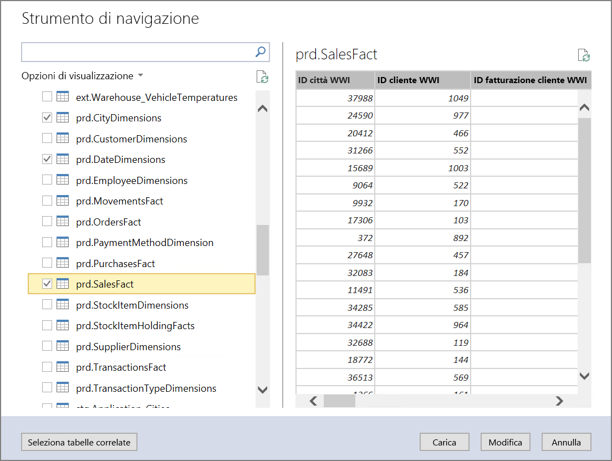
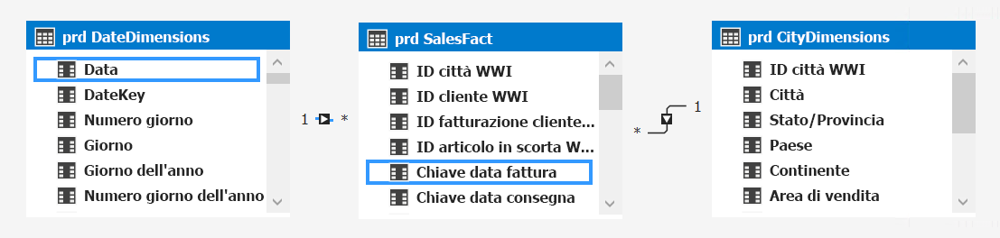
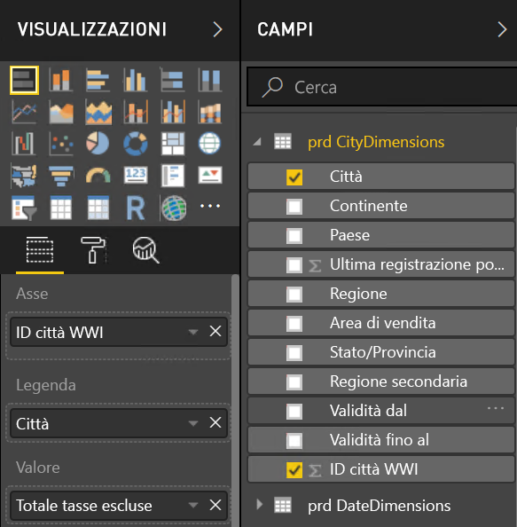
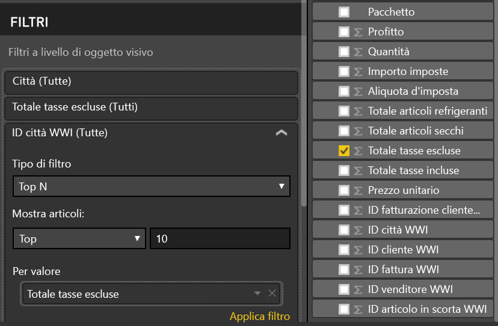
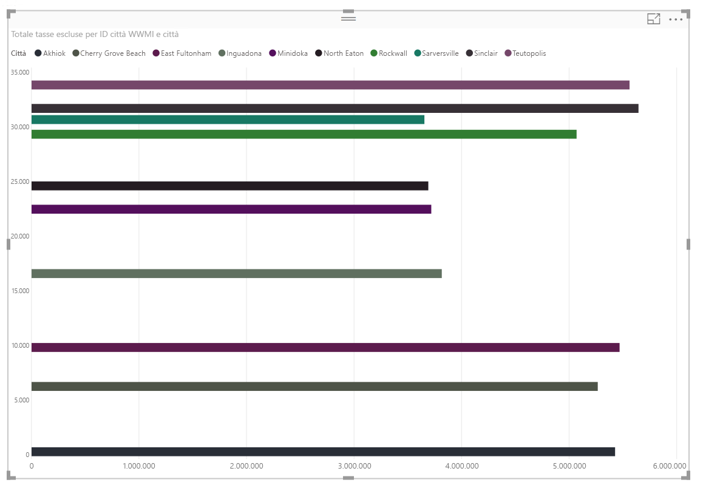

# <a name="enterprise-bi-with-sql-data-warehouse"></a>Business intelligence aziendale con SQL Data Warehouse
 
Questa architettura di riferimento implementa una pipeline [ELT](../../data-guide/relational-data/etl.md#extract-load-and-transform-elt) (extract-load-transform) che sposta i dati da un database di SQL Server locale in SQL Data Warehouse e trasforma i dati per l'analisi. [**Distribuire questa soluzione**.](#deploy-the-solution)


**Scenario**: un'organizzazione ha un ampio set di dati OLTP archiviati in un database di SQL Server locale. L'organizzazione vuole usare SQL Data Warehouse per eseguire l'analisi tramite Power BI. 

Questa architettura di riferimento è progettata per processi occasionali o su richiesta. Per spostare i dati in modo continuativo (con cadenza oraria o giornaliera) è consigliabile usare Azure Data Factory per definire un flusso di lavoro automatizzato.

## <a name="architecture"></a>Architecture

L'architettura è costituita dai componenti seguenti.

**SQL Server**. I dati di origine si trovano in un database di SQL Server locale. Per simulare l'ambiente locale, gli script di distribuzione per questa architettura eseguono il provisioning di una macchina virtuale in Azure con SQL Server installato. 

**Archiviazione BLOB**. L'archiviazione BLOB viene usata come area di staging per copiare i dati prima di caricarli in SQL Data Warehouse.

**Azure SQL Data Warehouse**. [SQL Data Warehouse](/azure/sql-data-warehouse/) è un sistema distribuito progettato per eseguire analisi su dati di grandi dimensioni. Supporta l'elaborazione parallela su larga scala (MPP), che può essere usata per l'esecuzione di analisi ad alte prestazioni. 

**Azure Analysis Services**. [Analysis Services](/azure/analysis-services/) è un servizio completamente gestito che offre funzionalità di creazione di modelli di dati. Usare Analysis Services per creare un modello semantico in cui gli utenti possono eseguire query. Analysis Services è particolarmente utile in uno scenario di dashboard di Business Intelligence. In questa architettura, Analysis Services legge i dati dal data warehouse per elaborare il modello semantico e gestisce in modo efficiente le query dashboard. Analysis Services supporta anche la concorrenza elastica, tramite il ridimensionamento di repliche per un'elaborazione delle query più veloce.

Attualmente, Azure Analysis Services supporta modelli tabulari, ma non modelli multidimensionali. I modelli tabulari usano costrutti di modellazione relazionale (tabelle e colonne), mentre i modelli multidimensionali usano costrutti di modellazione OLAP (cubi, dimensioni e misure). Se sono necessari i modelli multidimensionali, usare SQL Server Analysis Services (SSAS). Per altre informazioni, vedere [Confronto tra soluzioni tabulari e multidimensionali](/sql/analysis-services/comparing-tabular-and-multidimensional-solutions-ssas).

**Power BI**. Power BI è una suite di strumenti di analisi aziendale che consente di analizzare dati e condividere informazioni dettagliate. In questa architettura viene eseguita una query del modello semantico archiviato in Analysis Services.

**Azure Active Directory** (Azure AD) autentica gli utenti che si connettono al server di Analysis Services tramite Power BI.

## <a name="data-pipeline"></a>Data Pipeline
 
Questa architettura di riferimento usa il database di esempio [WorldWideImporters](/sql/sample/world-wide-importers/wide-world-importers-oltp-database) come origine dati. La pipeline di dati contiene le fasi seguenti:

1. Esportare i dati da SQL Server in file flat (utilità bcp).
2. Copiare i file flat in Archiviazione BLOB di Azure (AzCopy).
3. Caricare i dati in SQL Data Warehouse (PolyBase).
4. Trasformare i dati in uno schema star (T-SQL).
5. Caricare un modello semantico in Analysis Services (SQL Server Data Tools).


 
> [!NOTE]
> Per i passaggi 1 &ndash; 3, provare a usare Redgate Data Platform Studio. Data Platform Studio applica le correzioni e le ottimizzazioni di compatibilità più appropriate, motivo per cui è il modo più rapido per iniziare a utilizzare SQL Data Warehouse. Per altre informazioni, vedere [Caricare dati con Data Platform Studio di Redgate](/azure/sql-data-warehouse/sql-data-warehouse-load-with-redgate). 

Le sezioni successive descrivono queste opzioni in modo più dettagliato.

### <a name="export-data-from-sql-server"></a>Esportare dati da SQL Server

L'utilità [bcp](/sql/tools/bcp-utility) (programma di copia bulk) è un modo rapido per creare file flat di testo da tabelle SQL. In questo passaggio, si selezionano le colonne da esportare, ma non si trasforma alcun dato. Tutte le trasformazioni di dati saranno eseguite in SQL Data Warehouse.

**Raccomandazioni**

Se possibile, pianificare l'estrazione dei dati durante le fasce orarie non di punta, per ridurre il contenuto di risorse nell'ambiente di produzione. 

Evitare di eseguire bcp nel server di database. Eseguirlo invece da un altro computer. Scrivere i file in un'unità locale. Assicurarsi di disporre di risorse I/O sufficienti per gestire le operazioni di scrittura simultanee. Per prestazioni ottimali, esportare i file in unità di archiviazione rapida dedicate.

È possibile velocizzare il trasferimento tramite rete salvando i dati esportati in formato compresso Gzip. Tuttavia, caricare file compressi è più lento anziché caricare file non compressi, pertanto vi è un compromesso tra maggiore velocità di trasferimento di rete e caricamento più rapido. Se si decide di usare la compressione Gzip, non creare un unico file Gzip. Al contrario, suddividere i dati in più file compressi.

### <a name="copy-flat-files-into-blob-storage"></a>Copiare i file flat nell'archiviazione BLOB

L'utilità [AzCopy](/azure/storage/common/storage-use-azcopy) è progettata per prestazioni elevate di copia dei dati nell'archiviazione BLOB di Azure.

**Raccomandazioni**

Creare l'account di archiviazione in un'area vicina alla posizione dei dati di origine. Distribuire l'account di archiviazione e l'istanza di SQL Data Warehouse nella stessa area. 

Non eseguire AzCopy nello stesso computer che esegue i carichi di lavoro di produzione, perché il consumo di CPU e I/O può interferire con il carico di lavoro di produzione. 

Testare prima il caricamento per verificarne la velocità. È possibile usare l'opzione /NC in AzCopy per specificare il numero di operazioni di copia simultanee. Iniziare con il valore predefinito, quindi provare a usare questa impostazione per ottimizzare le prestazioni. In un ambiente con una larghezza di banda ridotta, troppe operazioni simultanee possono sovraccaricare la connessione di rete e impedire il corretto completamento delle operazioni.  

AZCopy sposta i dati in archiviazione tramite Internet pubblico. Se ciò non è sufficientemente veloce, è consigliabile configurare un circuito [ExpressRoute](/azure/expressroute/). ExpressRoute è un servizio che instrada i dati tramite una connessione privata dedicata ad Azure. Se la connessione di rete è troppo lenta, un'altra opzione consiste nello spedire fisicamente i dati su disco in un data center di Azure. Per altre informazioni, vedere [Trasferimento dei dati da e verso Azure](/azure/architecture/data-guide/scenarios/data-transfer).

Durante un'operazione di copia, AzCopy crea un file journal temporaneo, che consente ad AzCopy di riavviare l'operazione se questa viene interrotta (ad esempio, a causa di un errore di rete). Assicurarsi che vi sia spazio su disco sufficiente per archiviare i file journal. È possibile usare l'opzione /Z per specificare dove scrivere i file journal.

### <a name="load-data-into-sql-data-warehouse"></a>Caricare dati in SQL Data Warehouse

Usare [PolyBase](/sql/relational-databases/polybase/polybase-guide) per caricare i file dall'archivio BLOB nel data warehouse. PolyBase è progettato per sfruttare l'architettura MPP (Massively Parallel Processing, elaborazione parallela massiva) di SQL Data Warehouse, che lo rende il modo più rapido di caricare dati in SQL Data Warehouse. 

Il caricamento dei dati è un processo in due passaggi:

1. Creare un set di tabelle esterne per i dati. Una tabella esterna è una definizione di tabella che punta ai dati archiviati all'esterno del warehouse &mdash;, in questo caso, i file flat nell'archivio BLOB. Questo passaggio non sposta i dati nel warehouse.
2. Creare tabelle di staging e caricare i dati nelle tabelle di staging. Questo passaggio consiste nel copiare i dati nel warehouse.

**Raccomandazioni**

Prendere in considerazione SQL Data Warehouse quando si hanno grandi quantità di dati (più di 1 TB) ed è in esecuzione un carico di lavoro analitico che può trarre vantaggio dal parallelismo. SQL Data Warehouse non è una scelta ottimale per carichi di lavoro OLTP o set di dati più piccoli (< 250GB). Per i set di dati inferiori a 250GB, provare Database SQL di Azure o SQL Server. Per altre informazioni, vedere [Data warehousing](../../data-guide/relational-data/data-warehousing.md).

Creare le tabelle di staging come tabelle heap, che non sono indicizzate. Le query che creano le tabelle di produzione comporteranno una scansione di tabella completa; pertanto, non esiste alcun motivo per indicizzare le tabelle di staging.

PolyBase sfrutta automaticamente il parallelismo nel warehouse. Le prestazioni di caricamento vengono ridimensionate con l'aumento delle Unità Data Warehouse. Per prestazioni ottimali, usare un'unica operazione di caricamento. Suddividendo i dati di input in blocchi ed eseguendo più caricamenti simultanei non vi è alcun miglioramento delle prestazioni.

PolyBase è in grado di leggere dati compressi in file Gzip. Tuttavia, verrà usato solo un singolo lettore per ogni file compresso, poiché la decompressione del file è un'operazione a thread singolo. Pertanto, evitare di caricare un unico file compresso di grandi dimensioni. Al contrario, suddividere i dati in più file compressi, per trarre vantaggio dal parallelismo. 

Tenere presente le limitazioni seguenti:

- PolyBase supporta una dimensione massima delle colonne di `varchar(8000)`, `nvarchar(4000)`, o `varbinary(8000)`. Se sono presenti dati che superano questi limiti, un'opzione consiste nel suddividere i dati in blocchi al momento dell'esportazione e quindi riunire i blocchi dopo l'importazione. 

- PolyBase impone un carattere di terminazione di riga fisso \n o una nuova riga. Ciò può comportare problemi se sono presenti caratteri di nuova riga nei dati di origine.

- Lo schema di origine dati potrebbe contenere tipi di dati che non sono supportati in SQL Data Warehouse.

Per risolvere queste limitazioni, è possibile creare una stored procedure che esegue le conversioni necessarie. Quando si esegue bcp, fare riferimento a questa stored procedure. In alternativa, [Redgate Data Platform Studio](/azure/sql-data-warehouse/sql-data-warehouse-load-with-redgate) converte automaticamente i tipi di dati che non sono supportati in SQL Data Warehouse.

Per altre informazioni, vedere gli articoli seguenti:

- [Procedure consigliate per il caricamento dei dati in Azure SQL Data Warehouse](/azure/sql-data-warehouse/guidance-for-loading-data).
- [Eseguire la migrazione degli schemi a SQL Data Warehouse](/azure/sql-data-warehouse/sql-data-warehouse-migrate-schema)
- [Linee guida per la definizione dei tipi di dati per le tabelle in SQL Data Warehouse](/azure/sql-data-warehouse/sql-data-warehouse-tables-data-types)

### <a name="transform-the-data"></a>Trasformare i dati

Trasformare i dati e spostarli in tabelle di produzione. In questo passaggio, i dati vengono trasformati in uno schema star con tabelle delle dimensioni e tabelle dei fatti, adatte per la modellazione semantica.

Creare le tabelle di produzione con indici columnstore cluster, che offrono le migliori prestazioni complessive delle query. Gli indici columnstore sono ottimizzati per query di analisi di record numerosi. Gli indici columnstore non sono ottimali per le ricerche singleton (ossia per ricerche di una singola riga). Se è necessario eseguire ricerche singleton frequenti, è possibile aggiungere un indice non cluster a una tabella. Le ricerche singleton possono essere eseguite in modo notevolmente più veloce usando un indice non cluster. Tuttavia, le ricerche singleton sono in genere meno comuni negli scenari di data warehouse rispetto ai carichi di lavoro OLTP. Per altre informazioni, vedere [Indicizzazione di tabelle in SQL Data Warehouse](/azure/sql-data-warehouse/sql-data-warehouse-tables-index).

> [!NOTE]
> Le tabelle columnstore cluster supportano tipi di dati `varchar(max)`, `nvarchar(max)`, o `varbinary(max)`. In tal caso, prendere in considerazione un indice cluster o heap. È possibile inserire tali colonne in una tabella distinta.

Poiché il database di esempio non è molto grande, sono state create tabelle replicate senza partizioni. Per i carichi di lavoro di produzione, è probabile che l'uso di tabelle distribuite migliori le prestazioni delle query. Vedere [Linee guida per la progettazione di tabelle distribuite in Azure SQL Data Warehouse](/azure/sql-data-warehouse/sql-data-warehouse-tables-distribute). Gli script di esempio eseguono le query usando un valore [classe di risorse](/azure/sql-data-warehouse/resource-classes-for-workload-management) statico.

### <a name="load-the-semantic-model"></a>Caricare il modello semantico

Caricare i dati in un modello tabulare in Azure Analysis Services. In questo passaggio viene creato un modello di dati semantico tramite SQL Server Data Tools (SSDT). È anche possibile creare un modello tramite l'importazione da un file di Power BI Desktop. Poiché SQL Data Warehouse non supporta chiavi esterne, è necessario aggiungere le relazioni al modello semantico, in modo che sia possibile creare un join tra tabelle.

### <a name="use-power-bi-to-visualize-the-data"></a>Usare Power BI per visualizzare i dati

Power BI supporta due opzioni per la connessione ad Azure Analysis Services:

- Importazione. I dati sono importati nel modello Power BI.
- Connessione dinamica. I dati vengono estratti direttamente da Analysis Services.

La connessione dinamica è consigliabile poiché non richiede la copia dei dati nel modello di Power BI. DirectQuery assicura anche che i risultati siano sempre coerenti con gli ultimi dati di origine. Per altre informazioni, vedere [Stabilire la connessione con Power BI](/azure/analysis-services/analysis-services-connect-pbi).

**Raccomandazioni**

Evitare di eseguire query dashboard BI direttamente sul data warehouse. I dashboard BI richiedono tempi di risposta molto bassi, indirizzando query che il warehouse potrebbe non essere in grado di soddisfare. Anche l'aggiornamento del dashboard viene considerato nel conteggio delle query simultanee, influendo potenzialmente sulle prestazioni. 

Azure Analysis Services è progettato per gestire i requisiti di query di un dashboard BI, pertanto la procedura consigliata consiste nella query di Analysis Services da Power BI.

## <a name="scalability-considerations"></a>Considerazioni sulla scalabilità

### <a name="sql-data-warehouse"></a>SQL Data Warehouse

Con SQL Data Warehouse è possibile scalare orizzontalmente le risorse di calcolo su richiesta. Il motore di query consente di ottimizzare le query per l'elaborazione parallela in base al numero di nodi di calcolo e sposta i dati tra i nodi in base alle esigenze. Per altre informazioni, vedere [Gestire la potenza di calcolo in Azure SQL Data Warehouse](/azure/sql-data-warehouse/sql-data-warehouse-manage-compute-overview).

### <a name="analysis-services"></a>Analysis Services

Per i carichi di lavoro di produzione si consiglia il livello Standard per Azure Analysis Services, poiché supporta il partizionamento e DirectQuery. All'interno di un livello, le dimensioni dell'istanza determinano la capacità di elaborazione e di memoria. La capacità di elaborazione viene misurata in unità di elaborazione di query (QPU). Monitorare l'uso di QPU per selezionare le dimensioni appropriate. Per altre informazioni, vedere [Monitorare le metriche del server](/azure/analysis-services/analysis-services-monitor).

Un carico elevato può compromettere le prestazioni delle query a causa della concorrenza tra query. È possibile scalare orizzontalmente Analysis Services mediante la creazione di un pool di repliche per l'elaborazione delle query, in modo da eseguire più query contemporaneamente. Le operazioni di elaborazione del modello di dati avvengono sempre nel server primario. Per impostazione predefinita, il server primario gestisce anche le query. È possibile designare facoltativamente il server primario perché esegua l'elaborazione in modo esclusivo, così che il pool di query gestisca tutte le query. In caso di requisiti di elaborazione elevati, è opportuno separare l'elaborazione dal pool di query. In caso di carichi di query elevati e di un'elaborazione relativamente leggera, è possibile includere il server primario nel pool di query. Per altre informazioni, vedere [Ridimensionamento orizzontale di Azure Analysis Services](/azure/analysis-services/analysis-services-scale-out). 

Per ridurre la quantità di elaborazione non necessaria è consigliabile usare partizioni per dividere il modello tabulare in parti logiche. Ogni partizione può essere elaborate separatamente. Per altre informazioni, vedere [Partizioni](/sql/analysis-services/tabular-models/partitions-ssas-tabular).

## <a name="security-considerations"></a>Considerazioni relative alla sicurezza

### <a name="ip-whitelisting-of-analysis-services-clients"></a>Inserimento nell'elenco di IP consentiti di client di Analysis Services

È consigliabile usare la funzionalità firewall di Analysis Services per inserire gli indirizzi IP client nell'elenco di IP consentiti. Se abilitato, il firewall blocca tutte le connessioni client non specificate nelle regole del firewall. Secondo le regole predefinite il servizio Power BI viene inserito nell'elenco di IP consentiti, ma è possibile disabilitare questa regola se lo si desidera. Per altre informazioni, vedere [Applicare la protezione avanzata ad Azure Analysis Services con la nuova funzionalità firewall](https://azure.microsoft.com/blog/hardening-azure-analysis-services-with-the-new-firewall-capability/).

### <a name="authorization"></a>Authorization

Azure Analysis Services usa Azure Active Directory (Azure AD) per autenticare gli utenti che si connettono al server di Analysis Services. È possibile limitare i dati che un determinato utente è in grado di visualizzare creando dei ruoli e quindi assegnando gli utenti o gruppi di Azure AD a tali ruoli. Per ogni ruolo è possibile: 

- Proteggere le singole colonne o tabelle. 
- Proteggere le singole righe in base a espressioni filtro. 

Per altre informazioni, vedere [Gestire ruoli del database e utenti](/azure/analysis-services/analysis-services-database-users).

## <a name="deploy-the-solution"></a>Distribuire la soluzione

Una distribuzione di questa architettura di riferimento è disponibile in [GitHub][ref-arch-repo-folder]. Ecco cosa viene distribuito:

  * Una macchina virtuale di Windows per simulare un server di database locale. Include SQL Server 2017 e strumenti correlati, assieme a Power BI Desktop.
  * Un account di archiviazione di Azure che fornisce l'archiviazione BLOB per conservare i dati esportati dal database di SQL Server.
  * Un'istanza di Azure SQL Data Warehouse.
  * Un'istanza di Azure Analysis Services.

### <a name="prerequisites"></a>prerequisiti

1. Clonare, creare una copia tramite fork o scaricare il file ZIP per il repository GitHub delle [architetture di riferimento di Azure][ref-arch-repo].

2. Installare i [blocchi predefiniti di Azure][azbb-wiki] (azbb).

3. Al prompt dei comandi, di Bash o di PowerShell accedere all'account Azure con questo comando e seguire le istruzioni.

  ```bash
  az login  
  ```

### <a name="deploy-the-simulated-on-premises-server"></a>Distribuire il server locale simulato

Innanzitutto verrà distribuita una macchina virtuale come server locale simulato, che include SQL Server 2017 e strumenti correlati. In questo passaggio viene caricato anche il [database Wide World Importers OLTP](/sql/sample/world-wide-importers/wide-world-importers-oltp-database) di esempio in SQL Server.

1. Passare alla cartella `data\enterprise-bi-sqldw\onprem\templates` del repository scaricato nel passaggio dei prerequisiti precedente.

2. Nel file `onprem.parameters.json`, sostituire i valori per `adminUsername` e `adminPassword`. Modificare anche i valori della sezione `SqlUserCredentials` in modo che corrispondano al nome utente e alla password. Si noti il prefisso `.\\` nella proprietà Nome utente.
    
    ```bash
    "SqlUserCredentials": {
      "userName": ".\\username",
      "password": "password"
    }
    ```

3. Eseguire `azbb` come illustrato di seguito per distribuire il server locale.

    ```bash
    azbb -s <subscription_id> -g <resource_group_name> -l <location> -p onprem.parameters.json --deploy
    ```

4. La distribuzione potrebbe richiedere dai 20 ai 30 minuti, inclusa l'esecuzione dello script [DSC](/powershell/dsc/overview) per installare gli strumenti e il ripristino del database. Verificare la distribuzione nel portale di Azure esaminando le risorse nel gruppo di risorse. Verrà visualizzata la macchina virtuale `sql-vm1` e le risorse associate.

### <a name="deploy-the-azure-resources"></a>Distribuire le risorse di Azure

In questo passaggio viene eseguito il provisioning di Azure SQL Data Warehouse e Azure Analysis Services, assieme a un account di archiviazione. Se lo si desidera, è possibile eseguire questo passaggio in parallelo con il passaggio precedente.

1. Passare alla cartella `data\enterprise-bi-sqldw\azure\templates` del repository scaricato nel passaggio dei prerequisiti precedente.

2. Eseguire il seguente comando dell'interfaccia della riga di comando di Azure per creare un gruppo di risorse, sostituendo i parametri tra parentesi quadre specificati. Si noti che è possibile eseguire la distribuzione in un gruppo di risorse diverso rispetto a quello usato per il server locale nel passaggio precedente. 

    ```bash
    az group create --name <resource_group_name> --location <location>  
    ```

3. Eseguire il seguente comando dell'interfaccia della riga di comando di Azure per distribuire le risorse di Azure, sostituendo i parametri tra parentesi quadre specificati. Il parametro `storageAccountName` deve seguire le [regole di denominazione](../../best-practices/naming-conventions.md#naming-rules-and-restrictions) per gli account di archiviazione. Per il parametro `analysisServerAdmin`, usare il nome dell'entità utente (UPN) di Azure Active Directory.

    ```bash
    az group deployment create --resource-group <resource_group_name> --template-file azure-resources-deploy.json --parameters "dwServerName"="<server_name>" "dwAdminLogin"="<admin_username>" "dwAdminPassword"="<password>" "storageAccountName"="<storage_account_name>" "analysisServerName"="<analysis_server_name>" "analysisServerAdmin"="user@contoso.com"
    ```

4. Verificare la distribuzione nel portale di Azure esaminando le risorse nel gruppo di risorse. Verrà visualizzato un account di archiviazione, un'istanza di Azure SQL Data Warehouse e un'istanza di Analysis Services.

5. Usare il portale di Azure per ottenere la chiave di accesso per l'account di archiviazione. Selezionare l'account di archiviazione per aprirlo. In **Impostazioni** selezionare **Chiavi di accesso**. Prendere nota del valore della chiave primaria, che sarà necessario nel passaggio successivo.

### <a name="export-the-source-data-to-azure-blob-storage"></a>Esportare i dati di origine in Archivio BLOB di Azure 

In questo passaggio verrà eseguito uno script di PowerShell che usa bcp per esportare il database SQL in file flat nella macchina virtuale e quindi AzCopy per copiare tali file in Archivio BLOB di Azure.

1. Connettersi alla macchina virtuale locale simulata tramite desktop remoto.

2. Una volta eseguita la connessione alla macchina virtuale, eseguire i comandi seguenti da una finestra di PowerShell.  

    ```powershell
    cd 'C:\SampleDataFiles\reference-architectures\data\enterprise_bi_sqldw\onprem'

    .\Load_SourceData_To_Blob.ps1 -File .\sql_scripts\db_objects.txt -Destination 'https://<storage_account_name>.blob.core.windows.net/wwi' -StorageAccountKey '<storage_account_key>'
    ```

    Per il parametro `Destination`, sostituire `<storage_account_name>` con il nome dell'account di archiviazione creato in precedenza. Per il parametro `StorageAccountKey`, usare la chiave di accesso per tale account di archiviazione.

3. Nel portale di Azure, verificare che i dati di origine siano stati copiati nell'archivio BLOB passando all'account di archiviazione, selezionando il servizio BLOB e aprendo il contenitore `wwi`. Verrà visualizzato un elenco di tabelle con il prefisso `WorldWideImporters_Application_*`.

### <a name="execute-the-data-warehouse-scripts"></a>Eseguire gli script del data warehouse

1. Dalla sessione di desktop remoto, avviare SQL Server Management Studio (SSMS). 

2. Connettersi a SQL Data Warehouse

    - Tipo di server: motore di database
    
    - Nome del server: `<dwServerName>.database.windows.net`, dove `<dwServerName>` è il nome specificato al momento della distribuzione delle risorse di Azure. È possibile ottenere tale nome dal portale di Azure.
    
    - Autenticazione: autenticazione di SQL Server. Usare le credenziali specificate durante la distribuzione delle risorse di Azure, nei parametri `dwAdminLogin` e `dwAdminPassword`.

2. Passare alla cartella `C:\SampleDataFiles\reference-architectures\data\enterprise_bi_sqldw\azure\sqldw_scripts` sulla macchina virtuale. Eseguire gli script in questa cartella in ordine numerico, da `STEP_1` a `STEP_7`.

3. Selezionare il database `master` in SSMS e aprire lo script `STEP_1`. Modificare il valore della password nella riga seguente, quindi eseguire lo script.

    ```sql
    CREATE LOGIN LoaderRC20 WITH PASSWORD = '<change this value>';
    ```

4. Selezionare il database `wwi` in SSMS. Aprire lo script `STEP_2` ed eseguirlo. Se si verifica un errore, assicurarsi di stare eseguendo lo script in base al database `wwi` e non `master`.

5. Aprire una nuova connessione a SQL Data Warehouse tramite il nome utente e la password `LoaderRC20` indicati nello script `STEP_1`.

6. Tramite questa connessione, aprire lo script `STEP_3`. Nello script, impostare i valori seguenti:

    - SEGRETO: immettere la chiave di accesso per l'account di archiviazione.
    - PERCORSO: immettere il nome dell'account di archiviazione come segue: `wasbs://wwi@<storage_account_name>.blob.core.windows.net`.

7. Usando la stessa connessione, eseguire gli script da `STEP_4` a `STEP_7` in sequenza. Verificare che ogni script sia completato correttamente prima di eseguire il successivo.

In SMSS verrà visualizzato un set di tabelle `prd.*` nel database `wwi`. Per verificare che i dati siano stati generati, eseguire la query seguente: 

```sql
SELECT TOP 10 * FROM prd.CityDimensions
```

### <a name="build-the-azure-analysis-services-model"></a>Compilare il modello di Azure Analysis Services

In questo passaggio verrà creato un modello tabulare per importare i dati dal data warehouse, per poi distribuire il modello ad Azure Analysis Services.

1. Dalla sessione di desktop remoto, avviare SQL Server Data Tools 2015.

2. Selezionare **File** > **Nuovo** > **Progetto**.

3. Nella finestra di dialogo **Nuovo progetto**, in **Modelli** selezionare **Business Intelligence** > **Analysis Services** > **Progetto tabulare di Analysis Services**. 

4. Assegnare un nome al progetto e fare clic su **OK**.

5. Nella finestra di dialogo **Progettazione modelli tabulari**, selezionare **Area di lavoro integrata** e impostare il **Livello di compatibilità** su `SQL Server 2017 / Azure Analysis Services (1400)`. Fare clic su **OK**.

6. Nella finestra **Esplora modelli tabulari**, fare clic con il pulsante destro del mouse sul progetto e selezionare **Import from Data Source** (Importa da origine dati).

7. Selezionare **Azure SQL Data Warehouse** e fare clic su **Connetti**.

8. Per **Server**, immettere il nome completo del server di Azure SQL Data Warehouse. Per **Database**, immettere `wwi`. Fare clic su **OK**.

9. Nella finestra di dialogo successiva, scegliere l'autenticazione del **Database**, immettere il nome utente e la password di Azure SQL Data Warehouse e fare clic su **OK**.

10. Nella finestra di dialogo **Strumento di spostamento**, selezionare le caselle di controllo per **prd.CityDimensions**, **prd.DateDimensions** e **prd.SalesFact**. 

    

11. Fare clic su **Carica**. Una volta completata l'elaborazione, fare clic su **Chiudi**. Comparirà adesso una visualizzazione tabulare dei dati.

12. Nella finestra **Esplora modelli tabulari**, fare clic con il pulsante destro del mouse sul progetto e selezionare **Vista modelli** > **Vista diagramma**.

13. Trascinare il campo **[prd.SalesFact].[WWI City ID]** nel campo **[prd.CityDimensions].[WWI City ID]** per creare una relazione.  

14. Trascinare il campo **[prd.SalesFact].[Invoice Date Key]** nel campo **[prd.DateDimensions].[Date]**.  
    

15. Scegliere **Salva tutto** nel menu **File**.  

16. In **Esplora soluzioni** fare clic con il pulsante destro del mouse sul progetto, quindi scegliere **Proprietà**. 

17. Sotto **Server**, immettere l'URL dell'istanza di Azure Analysis Services. È possibile ottenere questo valore dal portale di Azure. Nel portale, selezionare la risorsa di Analysis Services, fare clic sul riquadro di anteprima e cercare la proprietà **Nome Server**. Sarà analogo a `asazure://westus.asazure.windows.net/contoso`. Fare clic su **OK**.

    

18. In **Esplora soluzioni**, fare clic con il pulsante destro del mouse sul progetto e scegliere **Distribuisci**. Se richiesto, accedere ad Azure. Una volta completata l'elaborazione, fare clic su **Chiudi**.

19. Nel portale di Azure, visualizzare i dettagli per l'istanza di Azure Analysis Services. Verificare che il modello sia visualizzato nell'elenco dei modelli.

    

### <a name="analyze-the-data-in-power-bi-desktop"></a>Analizzare i dati in Power BI Desktop

In questo passaggio, si userà Power BI per creare un report dai dati in Analysis Services.

1. Dalla sessione di desktop remoto, avviare Power BI Desktop.

2. Nella schermata di benvenuto, fare clic su **Recupera dati**.

3. Selezionare **Azure** > **Database di Azure Analysis Services**. Fare clic su **Connetti**

    

4. Immettere l'URL dell'istanza di Azure Analysis Services e fare clic su **OK**. Se richiesto, accedere ad Azure.

5. Nella finestra di dialogo **Strumento di spostamenti**, espandere il progetto tabulare distribuito, selezionare il modello creato e fare clic su **OK**.

2. Nel riquadro **Visualizzazioni**, selezionare l'icona **Grafico a barre in pila**. In visualizzazione Report, ridimensionare la visualizzazione per ingrandirla.

6. Nel riquadro **Campi**, espandere **prd.CityDimensions**.

7. Trascinare **prd.CityDimensions** > **WWI City ID** (ID città WWI) nell'**area Asse**.

8. Trascinare **prd.CityDimensions** > **Città** nell'area **Legenda**.

9. Nel riquadro Campi, espandere **prd.SalesFact**.

10. Trascinare **prd.SalesFact** > **Totale tasse escluse** nell'area **Valore**.

    

11. In **Filtri a livello di oggetto visivo**, selezionare **WWI City ID** (ID città WWI).

12. Impostare il **Tipo di filtro** su `Top N` e **Mostra elementi** su `Top 10`.

13. Trascinare **prd.SalesFact** > **Totale tasse escluse** nell'area **By Value** (Per valore)

    

14. Fare clic su **Applica filtro**. La visualizzazione mostra le prime 10 vendite totali per città.

    

Per altre informazioni su Power BI Desktop, vedere [Introduzione a Power BI Desktop](/power-bi/desktop-getting-started).

## <a name="next-steps"></a>Passaggi successivi

- Per altre informazioni su questa architettura di riferimento, visitare il [repository GitHub][ref-arch-repo-folder].
- Informazioni sui [blocchi predefiniti di Azure][azbb-repo].

<!-- links -->

[azure-cli-2]: /azure/install-azure-cli
[azbb-repo]: https://github.com/mspnp/template-building-blocks
[azbb-wiki]: https://github.com/mspnp/template-building-blocks/wiki/Install-Azure-Building-Blocks
[github-folder]: https://github.com/mspnp/reference-architectures/tree/master/data/enterprise_bi_sqldw
[ref-arch-repo]: https://github.com/mspnp/reference-architectures
[ref-arch-repo-folder]: https://github.com/mspnp/reference-architectures/tree/master/data/enterprise_bi_sqldw

