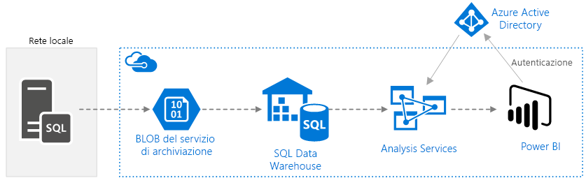
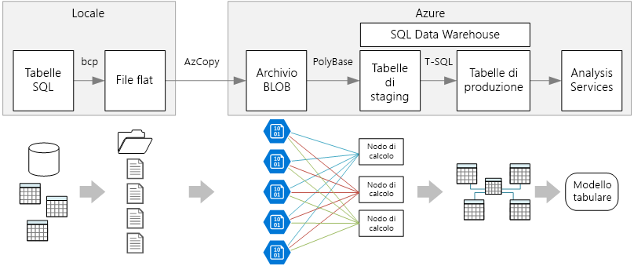

# Business intelligence aziendale con SQL Data Warehouse

Questa architettura di riferimento implementa una pipeline [ELT](../../data-guide/relational-data/etl.md#extract-load-and-transform-elt) (extract-load-transform) che sposta i dati da un database di SQL Server locale in SQL Data Warehouse e trasforma i dati per l'analisi. 

Un'implementazione di riferimento per questa architettura è disponibile in [GitHub][github-folder].

**Scenario**: un'organizzazione ha un ampio set di dati OLTP archiviati in un database di SQL Server locale. L'organizzazione vuole usare SQL Data Warehouse per eseguire l'analisi tramite Power BI. 

Questa architettura di riferimento è progettata per processi occasionali o su richiesta. Per spostare i dati in modo continuativo (con cadenza oraria o giornaliera) è consigliabile usare Azure Data Factory per definire un flusso di lavoro automatizzato. Per un'architettura di riferimento che usa Data Factory, vedere [Business intelligence aziendale automatizzata con SQL Data Warehouse e Azure Data Factory][adf-ra].

## Architettura

L'architettura è costituita dai componenti seguenti.

### Origine dati

**SQL Server**. I dati di origine si trovano in un database di SQL Server locale. Per simulare l'ambiente locale, gli script di distribuzione per questa architettura eseguono il provisioning di una macchina virtuale in Azure con SQL Server installato. Il [database OLTP di esempio "Wide World Importers"][wwi] viene usato come dati di origine.

### Inserimento e archiviazione dei dati

**Archiviazione BLOB**. L'archiviazione BLOB viene usata come area di staging per copiare i dati prima di caricarli in SQL Data Warehouse.

**Azure SQL Data Warehouse**. [SQL Data Warehouse](/azure/sql-data-warehouse/) è un sistema distribuito progettato per eseguire analisi su dati di grandi dimensioni. Supporta l'elaborazione parallela su larga scala (MPP), che può essere usata per l'esecuzione di analisi ad alte prestazioni. 

### Analisi e creazione di report

**Azure Analysis Services**. [Analysis Services](/azure/analysis-services/) è un servizio completamente gestito che offre funzionalità di creazione di modelli di dati. Usare Analysis Services per creare un modello semantico in cui gli utenti possono eseguire query. Analysis Services è particolarmente utile in uno scenario di dashboard di Business Intelligence. In questa architettura, Analysis Services legge i dati dal data warehouse per elaborare il modello semantico e gestisce in modo efficiente le query dashboard. Analysis Services supporta anche la concorrenza elastica, tramite il ridimensionamento di repliche per un'elaborazione delle query più veloce.

Attualmente, Azure Analysis Services supporta modelli tabulari, ma non modelli multidimensionali. I modelli tabulari usano costrutti di modellazione relazionale (tabelle e colonne), mentre i modelli multidimensionali usano costrutti di modellazione OLAP (cubi, dimensioni e misure). Se sono necessari i modelli multidimensionali, usare SQL Server Analysis Services (SSAS). Per altre informazioni, vedere [Confronto tra soluzioni tabulari e multidimensionali](/sql/analysis-services/comparing-tabular-and-multidimensional-solutions-ssas).

**Power BI**. Power BI è una suite di strumenti di analisi aziendale che consente di analizzare dati e condividere informazioni dettagliate. In questa architettura viene eseguita una query del modello semantico archiviato in Analysis Services.

### Authentication

**Azure Active Directory** (Azure AD) autentica gli utenti che si connettono al server di Analysis Services tramite Power BI.

## Data Pipeline
 
Questa architettura di riferimento usa il database di esempio [WorldWideImporters](/sql/sample/world-wide-importers/wide-world-importers-oltp-database) come origine dati. La pipeline di dati contiene le fasi seguenti:

1. Esportare i dati da SQL Server in file flat (utilità bcp).
2. Copiare i file flat in Archiviazione BLOB di Azure (AzCopy).
3. Caricare i dati in SQL Data Warehouse (PolyBase).
4. Trasformare i dati in uno schema star (T-SQL).
5. Caricare un modello semantico in Analysis Services (SQL Server Data Tools).

 
> [!NOTE]
> Per i passaggi 1 &ndash; 3, provare a usare Redgate Data Platform Studio. Data Platform Studio applica le correzioni e le ottimizzazioni di compatibilità più appropriate, motivo per cui è il modo più rapido per iniziare a utilizzare SQL Data Warehouse. Per altre informazioni, vedere [Caricare dati con Data Platform Studio di Redgate](/azure/sql-data-warehouse/sql-data-warehouse-load-with-redgate). 

Le sezioni successive descrivono queste opzioni in modo più dettagliato.

### Esportare dati da SQL Server

L'utilità [bcp](/sql/tools/bcp-utility) (programma di copia bulk) è un modo rapido per creare file flat di testo da tabelle SQL. In questo passaggio, si selezionano le colonne da esportare, ma non si trasforma alcun dato. Tutte le trasformazioni di dati saranno eseguite in SQL Data Warehouse.

**Raccomandazioni**

Se possibile, pianificare l'estrazione dei dati durante le fasce orarie non di punta, per ridurre il contenuto di risorse nell'ambiente di produzione. 

Evitare di eseguire bcp nel server di database. Eseguirlo invece da un altro computer. Scrivere i file in un'unità locale. Assicurarsi di disporre di risorse I/O sufficienti per gestire le operazioni di scrittura simultanee. Per prestazioni ottimali, esportare i file in unità di archiviazione rapida dedicate.

È possibile velocizzare il trasferimento tramite rete salvando i dati esportati in formato compresso Gzip. Tuttavia, caricare file compressi è più lento anziché caricare file non compressi, pertanto vi è un compromesso tra maggiore velocità di trasferimento di rete e caricamento più rapido. Se si decide di usare la compressione Gzip, non creare un unico file Gzip. Al contrario, suddividere i dati in più file compressi.

### Copiare i file flat nell'archiviazione BLOB

L'utilità [AzCopy](/azure/storage/common/storage-use-azcopy) è progettata per prestazioni elevate di copia dei dati nell'archiviazione BLOB di Azure.

**Raccomandazioni**

Creare l'account di archiviazione in un'area vicina alla posizione dei dati di origine. Distribuire l'account di archiviazione e l'istanza di SQL Data Warehouse nella stessa area. 

Non eseguire AzCopy nello stesso computer che esegue i carichi di lavoro di produzione, perché il consumo di CPU e I/O può interferire con il carico di lavoro di produzione. 

Testare prima il caricamento per verificarne la velocità. È possibile usare l'opzione /NC in AzCopy per specificare il numero di operazioni di copia simultanee. Iniziare con il valore predefinito, quindi provare a usare questa impostazione per ottimizzare le prestazioni. In un ambiente con una larghezza di banda ridotta, troppe operazioni simultanee possono sovraccaricare la connessione di rete e impedire il corretto completamento delle operazioni.  

AZCopy sposta i dati in archiviazione tramite Internet pubblico. Se ciò non è sufficientemente veloce, è consigliabile configurare un circuito [ExpressRoute](/azure/expressroute/). ExpressRoute è un servizio che instrada i dati tramite una connessione privata dedicata ad Azure. Se la connessione di rete è troppo lenta, un'altra opzione consiste nello spedire fisicamente i dati su disco in un data center di Azure. Per altre informazioni, vedere [Trasferimento dei dati da e verso Azure](/azure/architecture/data-guide/scenarios/data-transfer).

Durante un'operazione di copia, AzCopy crea un file journal temporaneo, che consente ad AzCopy di riavviare l'operazione se questa viene interrotta (ad esempio, a causa di un errore di rete). Assicurarsi che vi sia spazio su disco sufficiente per archiviare i file journal. È possibile usare l'opzione /Z per specificare dove scrivere i file journal.

### Caricare dati in SQL Data Warehouse

Usare [PolyBase](/sql/relational-databases/polybase/polybase-guide) per caricare i file dall'archivio BLOB nel data warehouse. PolyBase è progettato per sfruttare l'architettura MPP (Massively Parallel Processing, elaborazione parallela massiva) di SQL Data Warehouse, che lo rende il modo più rapido di caricare dati in SQL Data Warehouse. 

Il caricamento dei dati è un processo in due passaggi:

1. Creare un set di tabelle esterne per i dati. Una tabella esterna è una definizione di tabella che punta ai dati archiviati all'esterno del warehouse &mdash;, in questo caso, i file flat nell'archivio BLOB. Questo passaggio non sposta i dati nel warehouse.
2. Creare tabelle di staging e caricare i dati nelle tabelle di staging. Questo passaggio consiste nel copiare i dati nel warehouse.

**Raccomandazioni**

Prendere in considerazione SQL Data Warehouse quando si hanno grandi quantità di dati (più di 1 TB) ed è in esecuzione un carico di lavoro analitico che può trarre vantaggio dal parallelismo. SQL Data Warehouse non è una scelta ottimale per carichi di lavoro OLTP o set di dati più piccoli (< 250GB). Per i set di dati inferiori a 250GB, provare Database SQL di Azure o SQL Server. Per altre informazioni, vedere [Data warehousing](../../data-guide/relational-data/data-warehousing.md).

Creare le tabelle di staging come tabelle heap, che non sono indicizzate. Le query che creano le tabelle di produzione comporteranno una scansione di tabella completa; pertanto, non esiste alcun motivo per indicizzare le tabelle di staging.

PolyBase sfrutta automaticamente il parallelismo nel warehouse. Le prestazioni di caricamento vengono ridimensionate con l'aumento delle Unità Data Warehouse. Per prestazioni ottimali, usare un'unica operazione di caricamento. Suddividendo i dati di input in blocchi ed eseguendo più caricamenti simultanei non vi è alcun miglioramento delle prestazioni.

PolyBase è in grado di leggere dati compressi in file Gzip. Tuttavia, verrà usato solo un singolo lettore per ogni file compresso, poiché la decompressione del file è un'operazione a thread singolo. Pertanto, evitare di caricare un unico file compresso di grandi dimensioni. Al contrario, suddividere i dati in più file compressi, per trarre vantaggio dal parallelismo. 

Tenere presente le limitazioni seguenti:

- PolyBase supporta una dimensione massima delle colonne di `varchar(8000)`, `nvarchar(4000)`, o `varbinary(8000)`. Se sono presenti dati che superano questi limiti, un'opzione consiste nel suddividere i dati in blocchi al momento dell'esportazione e quindi riunire i blocchi dopo l'importazione. 

- PolyBase impone un carattere di terminazione di riga fisso \n o una nuova riga. Ciò può comportare problemi se sono presenti caratteri di nuova riga nei dati di origine.

- Lo schema di origine dati potrebbe contenere tipi di dati che non sono supportati in SQL Data Warehouse.

Per risolvere queste limitazioni, è possibile creare una stored procedure che esegue le conversioni necessarie. Quando si esegue bcp, fare riferimento a questa stored procedure. In alternativa, [Redgate Data Platform Studio](/azure/sql-data-warehouse/sql-data-warehouse-load-with-redgate) converte automaticamente i tipi di dati che non sono supportati in SQL Data Warehouse.

Per altre informazioni, vedere gli articoli seguenti:

- [Procedure consigliate per il caricamento dei dati in Azure SQL Data Warehouse](/azure/sql-data-warehouse/guidance-for-loading-data).
- [Eseguire la migrazione degli schemi a SQL Data Warehouse](/azure/sql-data-warehouse/sql-data-warehouse-migrate-schema)
- [Linee guida per la definizione dei tipi di dati per le tabelle in SQL Data Warehouse](/azure/sql-data-warehouse/sql-data-warehouse-tables-data-types)

### Trasformare i dati

Trasformare i dati e spostarli in tabelle di produzione. In questo passaggio, i dati vengono trasformati in uno schema star con tabelle delle dimensioni e tabelle dei fatti, adatte per la modellazione semantica.

Creare le tabelle di produzione con indici columnstore cluster, che offrono le migliori prestazioni complessive delle query. Gli indici columnstore sono ottimizzati per query di analisi di record numerosi. Gli indici columnstore non sono ottimali per le ricerche singleton (ossia per ricerche di una singola riga). Se è necessario eseguire ricerche singleton frequenti, è possibile aggiungere un indice non cluster a una tabella. Le ricerche singleton possono essere eseguite in modo notevolmente più veloce usando un indice non cluster. Tuttavia, le ricerche singleton sono in genere meno comuni negli scenari di data warehouse rispetto ai carichi di lavoro OLTP. Per altre informazioni, vedere [Indicizzazione di tabelle in SQL Data Warehouse](/azure/sql-data-warehouse/sql-data-warehouse-tables-index).

> [!NOTE]
> Le tabelle columnstore cluster supportano tipi di dati `varchar(max)`, `nvarchar(max)`, o `varbinary(max)`. In tal caso, prendere in considerazione un indice cluster o heap. È possibile inserire tali colonne in una tabella distinta.

Poiché il database di esempio non è molto grande, sono state create tabelle replicate senza partizioni. Per i carichi di lavoro di produzione, è probabile che l'uso di tabelle distribuite migliori le prestazioni delle query. Vedere [Linee guida per la progettazione di tabelle distribuite in Azure SQL Data Warehouse](/azure/sql-data-warehouse/sql-data-warehouse-tables-distribute). Gli script di esempio eseguono le query usando un valore [classe di risorse](/azure/sql-data-warehouse/resource-classes-for-workload-management) statico.

### Caricare il modello semantico

Caricare i dati in un modello tabulare in Azure Analysis Services. In questo passaggio viene creato un modello di dati semantico tramite SQL Server Data Tools (SSDT). È anche possibile creare un modello tramite l'importazione da un file di Power BI Desktop. Poiché SQL Data Warehouse non supporta chiavi esterne, è necessario aggiungere le relazioni al modello semantico, in modo che sia possibile creare un join tra tabelle.

### Usare Power BI per visualizzare i dati

Power BI supporta due opzioni per la connessione ad Azure Analysis Services:

- Importazione. I dati sono importati nel modello Power BI.
- Connessione dinamica. I dati vengono estratti direttamente da Analysis Services.

La connessione dinamica è consigliabile poiché non richiede la copia dei dati nel modello di Power BI. DirectQuery assicura anche che i risultati siano sempre coerenti con gli ultimi dati di origine. Per altre informazioni, vedere [Stabilire la connessione con Power BI](/azure/analysis-services/analysis-services-connect-pbi).

**Raccomandazioni**

Evitare di eseguire query dashboard BI direttamente sul data warehouse. I dashboard BI richiedono tempi di risposta molto bassi, indirizzando query che il warehouse potrebbe non essere in grado di soddisfare. Anche l'aggiornamento del dashboard viene considerato nel conteggio delle query simultanee, influendo potenzialmente sulle prestazioni. 

Azure Analysis Services è progettato per gestire i requisiti di query di un dashboard BI, pertanto la procedura consigliata consiste nella query di Analysis Services da Power BI.

## Considerazioni sulla scalabilità

### SQL Data Warehouse

Con SQL Data Warehouse è possibile scalare orizzontalmente le risorse di calcolo su richiesta. Il motore di query consente di ottimizzare le query per l'elaborazione parallela in base al numero di nodi di calcolo e sposta i dati tra i nodi in base alle esigenze. Per altre informazioni, vedere [Gestire la potenza di calcolo in Azure SQL Data Warehouse](/azure/sql-data-warehouse/sql-data-warehouse-manage-compute-overview).

### Analysis Services

Per i carichi di lavoro di produzione si consiglia il livello Standard per Azure Analysis Services, poiché supporta il partizionamento e DirectQuery. All'interno di un livello, le dimensioni dell'istanza determinano la capacità di elaborazione e di memoria. La capacità di elaborazione viene misurata in unità di elaborazione di query (QPU). Monitorare l'uso di QPU per selezionare le dimensioni appropriate. Per altre informazioni, vedere [Monitorare le metriche del server](/azure/analysis-services/analysis-services-monitor).

Un carico elevato può compromettere le prestazioni delle query a causa della concorrenza tra query. È possibile scalare orizzontalmente Analysis Services mediante la creazione di un pool di repliche per l'elaborazione delle query, in modo da eseguire più query contemporaneamente. Le operazioni di elaborazione del modello di dati avvengono sempre nel server primario. Per impostazione predefinita, il server primario gestisce anche le query. È possibile designare facoltativamente il server primario perché esegua l'elaborazione in modo esclusivo, così che il pool di query gestisca tutte le query. In caso di requisiti di elaborazione elevati, è opportuno separare l'elaborazione dal pool di query. In caso di carichi di query elevati e di un'elaborazione relativamente leggera, è possibile includere il server primario nel pool di query. Per altre informazioni, vedere [Ridimensionamento orizzontale di Azure Analysis Services](/azure/analysis-services/analysis-services-scale-out). 

Per ridurre la quantità di elaborazione non necessaria è consigliabile usare partizioni per dividere il modello tabulare in parti logiche. Ogni partizione può essere elaborate separatamente. Per altre informazioni, vedere [Partizioni](/sql/analysis-services/tabular-models/partitions-ssas-tabular).

## Considerazioni relative alla sicurezza

### Inserimento nell'elenco di IP consentiti di client di Analysis Services

È consigliabile usare la funzionalità firewall di Analysis Services per inserire gli indirizzi IP client nell'elenco di IP consentiti. Se abilitato, il firewall blocca tutte le connessioni client non specificate nelle regole del firewall. Secondo le regole predefinite il servizio Power BI viene inserito nell'elenco di IP consentiti, ma è possibile disabilitare questa regola se lo si desidera. Per altre informazioni, vedere [Applicare la protezione avanzata ad Azure Analysis Services con la nuova funzionalità firewall](https://azure.microsoft.com/blog/hardening-azure-analysis-services-with-the-new-firewall-capability/).

### Authorization

Azure Analysis Services usa Azure Active Directory (Azure AD) per autenticare gli utenti che si connettono al server di Analysis Services. È possibile limitare i dati che un determinato utente è in grado di visualizzare creando dei ruoli e quindi assegnando gli utenti o gruppi di Azure AD a tali ruoli. Per ogni ruolo è possibile: 

- Proteggere le singole colonne o tabelle. 
- Proteggere le singole righe in base a espressioni filtro. 

Per altre informazioni, vedere [Gestire ruoli del database e utenti](/azure/analysis-services/analysis-services-database-users).

## Distribuire la soluzione

Per distribuire ed eseguire l'implementazione di riferimento, seguire la procedura illustrata nel file [README in GitHub][github-folder]. Ecco cosa viene distribuito:

  * Una macchina virtuale di Windows per simulare un server di database locale. Include SQL Server 2017 e strumenti correlati, assieme a Power BI Desktop.
  * Un account di archiviazione di Azure che fornisce l'archiviazione BLOB per conservare i dati esportati dal database di SQL Server.
  * Un'istanza di Azure SQL Data Warehouse.
  * Un'istanza di Azure Analysis Services.

## Passaggi successivi

- Usare Azure Data Factory per automatizzare la pipeline ELT. Vedere [Business intelligence aziendale automatizzata con SQL Data Warehouse e Azure Data Factory][adf=ra].

<!-- links -->

[adf-ra]: ./enterprise-bi-adf.md
[github-folder]: https://github.com/mspnp/reference-architectures/tree/master/data/enterprise_bi_sqldw
[wwi]: /sql/sample/world-wide-importers/wide-world-importers-oltp-database

