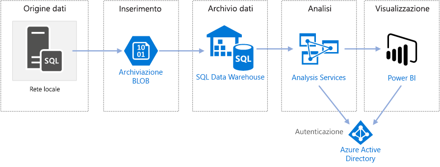

# Business intelligence aziendale in Azure con SQL Data WarehouseEnterprise BI in Azure with SQL Data Warehouse

Questa architettura di riferimento implementa una pipeline [extract, load, transform (ELT)](../../data-guide/relational-data/etl.md#extract-load-and-transform-elt) che sposta i dati da un database di SQL Server locale in SQL Data Warehouse e trasforma i dati per l'analisi.This reference architecture implements an [extract, load, and transform (ELT)](../../data-guide/relational-data/etl.md#extract-load-and-transform-elt) pipeline that moves data from an on-premises SQL Server database into SQL Data Warehouse and transforms the data for analysis.

Un'implementazione di riferimento per questa architettura è disponibile in [GitHub][github-folder].A reference implementation for this architecture is available on [GitHub][github-folder].

**Scenario**: un'organizzazione ha un ampio set di dati OLTP archiviati in un database di SQL Server locale.**Scenario**: An organization has a large OLTP data set stored in a SQL Server database on premises. L'organizzazione vuole usare SQL Data Warehouse per eseguire l'analisi tramite Power BI.The organization wants to use SQL Data Warehouse to perform analysis using Power BI.

Questa architettura di riferimento è progettata per processi occasionali o su richiesta.This reference architecture is designed for one-time or on-demand jobs. Per spostare i dati in modo continuativo (con cadenza oraria o giornaliera) è consigliabile usare Azure Data Factory per definire un flusso di lavoro automatizzato.If you need to move data on a continuing basis (hourly or daily), we recommend using Azure Data Factory to define an automated workflow. Per un'architettura di riferimento che usa Data Factory, vedere [Business intelligence aziendale automatizzata con SQL Data Warehouse e Azure Data Factory][adf-ra].For a reference architecture that uses Data Factory, see [Automated enterprise BI with SQL Data Warehouse and Azure Data Factory][adf-ra].

## ArchitetturaArchitecture

L'architettura è costituita dai componenti seguenti.The architecture consists of the following components.

### Origine datiData source

**SQL Server**.**SQL Server**. I dati di origine si trovano in un database di SQL Server locale.The source data is located in a SQL Server database on premises. Per simulare l'ambiente locale, gli script di distribuzione per questa architettura eseguono il provisioning di una macchina virtuale in Azure con SQL Server installato.To simulate the on-premises environment, the deployment scripts for this architecture provision a VM in Azure with SQL Server installed. Il [database OLTP di esempio "Wide World Importers"][wwi] viene usato come dati di origine.The [Wide World Importers OLTP sample database][wwi] is used as the source data.

### Inserimento e archiviazione dei datiIngestion and data storage

**Archiviazione BLOB**.**Blob Storage**. L'archiviazione BLOB viene usata come area di staging per copiare i dati prima di caricarli in SQL Data Warehouse.Blob storage is used as a staging area to copy the data before loading it into SQL Data Warehouse.

**Azure SQL Data Warehouse**.**Azure SQL Data Warehouse**. [SQL Data Warehouse](/azure/sql-data-warehouse/) è un sistema distribuito progettato per eseguire analisi su dati di grandi dimensioni.[SQL Data Warehouse](/azure/sql-data-warehouse/) is a distributed system designed to perform analytics on large data. Supporta l'elaborazione parallela su larga scala (MPP), che può essere usata per l'esecuzione di analisi ad alte prestazioni.It supports massive parallel processing (MPP), which makes it suitable for running high-performance analytics.

### Analisi e creazione di reportAnalysis and reporting

**Azure Analysis Services**.**Azure Analysis Services**. [Analysis Services](/azure/analysis-services/) è un servizio completamente gestito che offre funzionalità di creazione di modelli di dati.[Analysis Services](/azure/analysis-services/) is a fully managed service that provides data modeling capabilities. Usare Analysis Services per creare un modello semantico in cui gli utenti possono eseguire query.Use Analysis Services to create a semantic model that users can query. Analysis Services è particolarmente utile in uno scenario di dashboard di Business Intelligence.Analysis Services is especially useful in a BI dashboard scenario. In questa architettura, Analysis Services legge i dati dal data warehouse per elaborare il modello semantico e gestisce in modo efficiente le query dashboard.In this architecture, Analysis Services reads data from the data warehouse to process the semantic model, and efficiently serves dashboard queries. Analysis Services supporta anche la concorrenza elastica, tramite il ridimensionamento di repliche per un'elaborazione delle query più veloce.It also supports elastic concurrency, by scaling out replicas for faster query processing.

Attualmente, Azure Analysis Services supporta modelli tabulari, ma non modelli multidimensionali.Currently, Azure Analysis Services supports tabular models but not multidimensional models. I modelli tabulari usano costrutti di modellazione relazionale (tabelle e colonne), mentre i modelli multidimensionali usano costrutti di modellazione OLAP (cubi, dimensioni e misure).Tabular models use relational modeling constructs (tables and columns), whereas multidimensional models use OLAP modeling constructs (cubes, dimensions, and measures). Se sono necessari i modelli multidimensionali, usare SQL Server Analysis Services (SSAS).If you require multidimensional models, use SQL Server Analysis Services (SSAS). Per altre informazioni, vedere [Confronto tra soluzioni tabulari e multidimensionali](/sql/analysis-services/comparing-tabular-and-multidimensional-solutions-ssas).For more information, see [Comparing tabular and multidimensional solutions](/sql/analysis-services/comparing-tabular-and-multidimensional-solutions-ssas).

**Power BI**.**Power BI**. Power BI è una suite di strumenti di analisi aziendale che consente di analizzare dati e condividere informazioni dettagliate.Power BI is a suite of business analytics tools to analyze data for business insights. In questa architettura viene eseguita una query del modello semantico archiviato in Analysis Services.In this architecture, it queries the semantic model stored in Analysis Services.

### AuthenticationAuthentication

**Azure Active Directory** (Azure AD) autentica gli utenti che si connettono al server di Analysis Services tramite Power BI.**Azure Active Directory (Azure AD)** authenticates users who connect to the Analysis Services server through Power BI.

## Data PipelineData pipeline

Questa architettura di riferimento usa il database di esempio [WorldWideImporters](/sql/sample/world-wide-importers/wide-world-importers-oltp-database) come origine dati.This reference architecture uses the [WorldWideImporters](/sql/sample/world-wide-importers/wide-world-importers-oltp-database) sample database as a data source. La pipeline di dati contiene le fasi seguenti:The data pipeline has the following stages:

1. Esportare i dati da SQL Server in file flat (utilità bcp).Export the data from SQL Server to flat files (bcp utility).
2. Copiare i file flat in Archiviazione BLOB di Azure (AzCopy).Copy the flat files to Azure Blob Storage (AzCopy).
3. Caricare i dati in SQL Data Warehouse (PolyBase).Load the data into SQL Data Warehouse (PolyBase).
4. Trasformare i dati in uno schema star (T-SQL).Transform the data into a star schema (T-SQL).
5. Caricare un modello semantico in Analysis Services (SQL Server Data Tools).Load a semantic model into Analysis Services (SQL Server Data Tools).

> [!NOTE]
> Per i passaggi 1 &ndash; 3, provare a usare Redgate Data Platform Studio.For steps 1 &ndash; 3, consider using Redgate Data Platform Studio. Data Platform Studio applica le correzioni e le ottimizzazioni di compatibilità più appropriate, motivo per cui è il modo più rapido per iniziare a utilizzare SQL Data Warehouse.Data Platform Studio applies the most appropriate compatibility fixes and optimizations, so it's the quickest way to get started with SQL Data Warehouse. Per altre informazioni, vedere [Caricare dati con Data Platform Studio di Redgate](/azure/sql-data-warehouse/sql-data-warehouse-load-with-redgate).For more information, see [Load data with Redgate Data Platform Studio](/azure/sql-data-warehouse/sql-data-warehouse-load-with-redgate).
>

Le sezioni successive descrivono queste opzioni in modo più dettagliato.The next sections describe these stages in more detail.

### Esportare dati da SQL ServerExport data from SQL Server

L'utilità [bcp](/sql/tools/bcp-utility) (programma di copia bulk) è un modo rapido per creare file flat di testo da tabelle SQL.The [bcp](/sql/tools/bcp-utility) (bulk copy program) utility is a fast way to create flat text files from SQL tables. In questo passaggio, si selezionano le colonne da esportare, ma non si trasforma alcun dato.In this step, you select the columns that you want to export, but don't transform the data. Tutte le trasformazioni di dati saranno eseguite in SQL Data Warehouse.Any data transformations should happen in SQL Data Warehouse.

**Consigli:****Recommendations:**

Se possibile, pianificare l'estrazione dei dati durante le fasce orarie non di punta, per ridurre il contenuto di risorse nell'ambiente di produzione.If possible, schedule data extraction during off-peak hours, to minimize resource contention in the production environment.

Evitare di eseguire bcp nel server di database.Avoid running bcp on the database server. Eseguirlo invece da un altro computer.Instead, run it from another machine. Scrivere i file in un'unità locale.Write the files to a local drive. Assicurarsi di disporre di risorse I/O sufficienti per gestire le operazioni di scrittura simultanee.Ensure that you have sufficient I/O resources to handle the concurrent writes. Per prestazioni ottimali, esportare i file in unità di archiviazione rapida dedicate.For best performance, export the files to dedicated fast storage drives.

È possibile velocizzare il trasferimento tramite rete salvando i dati esportati in formato compresso Gzip.You can speed up the network transfer by saving the exported data in Gzip compressed format. Tuttavia, caricare file compressi è più lento anziché caricare file non compressi, pertanto vi è un compromesso tra maggiore velocità di trasferimento di rete e caricamento più rapido.However, loading compressed files into the warehouse is slower than loading uncompressed files, so there is a tradeoff between faster network transfer versus faster loading. Se si decide di usare la compressione Gzip, non creare un unico file Gzip.If you decide to use Gzip compression, don't create a single Gzip file. Al contrario, suddividere i dati in più file compressi.Instead, split the data into multiple compressed files.

### Copiare i file flat nell'archiviazione BLOBCopy flat files into blob storage

L'utilità [AzCopy](/azure/storage/common/storage-use-azcopy) è progettata per prestazioni elevate di copia dei dati nell'archiviazione BLOB di Azure.The [AzCopy](/azure/storage/common/storage-use-azcopy) utility is designed for high-performance copying of data into Azure blob storage.

**Consigli:****Recommendations:**

Creare l'account di archiviazione in un'area vicina alla posizione dei dati di origine.Create the storage account in a region near the location of the source data. Distribuire l'account di archiviazione e l'istanza di SQL Data Warehouse nella stessa area.Deploy the storage account and the SQL Data Warehouse instance in the same region.

Non eseguire AzCopy nello stesso computer che esegue i carichi di lavoro di produzione, perché il consumo di CPU e I/O può interferire con il carico di lavoro di produzione.Don't run AzCopy on the same machine that runs your production workloads, because the CPU and I/O consumption can interfere with the production workload.

Testare prima il caricamento per verificarne la velocità.Test the upload first to see what the upload speed is like. È possibile usare l'opzione /NC in AzCopy per specificare il numero di operazioni di copia simultanee.You can use the /NC option in AzCopy to specify the number of concurrent copy operations. Iniziare con il valore predefinito, quindi provare a usare questa impostazione per ottimizzare le prestazioni.Start with the default value, then experiment with this setting to tune the performance. In un ambiente con una larghezza di banda ridotta, troppe operazioni simultanee possono sovraccaricare la connessione di rete e impedire il corretto completamento delle operazioni.In a low-bandwidth environment, too many concurrent operations can overwhelm the network connection and prevent the operations from completing successfully.

AZCopy sposta i dati in archiviazione tramite Internet pubblico.AzCopy moves data to storage over the public internet. Se ciò non è sufficientemente veloce, è consigliabile configurare un circuito [ExpressRoute](/azure/expressroute/).If this isn't fast enough, consider setting up an [ExpressRoute](/azure/expressroute/) circuit. ExpressRoute è un servizio che instrada i dati tramite una connessione privata dedicata ad Azure.ExpressRoute is a service that routes your data through a dedicated private connection to Azure. Se la connessione di rete è troppo lenta, un'altra opzione consiste nello spedire fisicamente i dati su disco in un data center di Azure.Another option, if your network connection is too slow, is to physically ship the data on disk to an Azure datacenter. Per altre informazioni, vedere [Trasferimento dei dati da e verso Azure](/azure/architecture/data-guide/scenarios/data-transfer).For more information, see [Transferring data to and from Azure](/azure/architecture/data-guide/scenarios/data-transfer).

Durante un'operazione di copia, AzCopy crea un file journal temporaneo, che consente ad AzCopy di riavviare l'operazione se questa viene interrotta (ad esempio, a causa di un errore di rete).During a copy operation, AzCopy creates a temporary journal file, which enables AzCopy to restart the operation if it gets interrupted (for example, due to a network error). Assicurarsi che vi sia spazio su disco sufficiente per archiviare i file journal.Make sure there is enough disk space to store the journal files. È possibile usare l'opzione /Z per specificare dove scrivere i file journal.You can use the /Z option to specify where the journal files are written.

### Caricare dati in SQL Data WarehouseLoad data into SQL Data Warehouse

Usare [PolyBase](/sql/relational-databases/polybase/polybase-guide) per caricare i file dall'archivio BLOB nel data warehouse.Use [PolyBase](/sql/relational-databases/polybase/polybase-guide) to load the files from blob storage into the data warehouse. PolyBase è progettato per sfruttare l'architettura MPP (Massively Parallel Processing, elaborazione parallela massiva) di SQL Data Warehouse, che lo rende il modo più rapido di caricare dati in SQL Data Warehouse.PolyBase is designed to leverage the MPP (Massively Parallel Processing) architecture of SQL Data Warehouse, which makes it the fastest way to load data into SQL Data Warehouse.

Il caricamento dei dati è un processo in due passaggi:Loading the data is a two-step process:

1. Creare un set di tabelle esterne per i dati.Create a set of external tables for the data. Una tabella esterna è una definizione di tabella che punta ai dati archiviati all'esterno del warehouse &mdash;, in questo caso, i file flat nell'archivio BLOB.An external table is a table definition that points to data stored outside of the warehouse &mdash; in this case, the flat files in blob storage. Questo passaggio non sposta i dati nel warehouse.This step does not move any data into the warehouse.
2. Creare tabelle di staging e caricare i dati nelle tabelle di staging.Create staging tables, and load the data into the staging tables. Questo passaggio consiste nel copiare i dati nel warehouse.This step copies the data into the warehouse.

**Consigli:****Recommendations:**

Prendere in considerazione SQL Data Warehouse quando si hanno grandi quantità di dati (più di 1 TB) ed è in esecuzione un carico di lavoro analitico che può trarre vantaggio dal parallelismo.Consider SQL Data Warehouse when you have large amounts of data (more than 1 TB) and are running an analytics workload that will benefit from parallelism. SQL Data Warehouse non è una scelta ottimale per carichi di lavoro OLTP o set di dati più piccoli (< 250GB).SQL Data Warehouse is not a good fit for OLTP workloads or smaller data sets (< 250GB). Per i set di dati inferiori a 250GB, provare Database SQL di Azure o SQL Server.For data sets less than 250GB, consider Azure SQL Database or SQL Server. Per altre informazioni, vedere [Data warehousing](../../data-guide/relational-data/data-warehousing.md).For more information, see [Data warehousing](../../data-guide/relational-data/data-warehousing.md).

Creare le tabelle di staging come tabelle heap, che non sono indicizzate.Create the staging tables as heap tables, which are not indexed. Le query che creano le tabelle di produzione comporteranno una scansione di tabella completa; pertanto, non esiste alcun motivo per indicizzare le tabelle di staging.The queries that create the production tables will result in a full table scan, so there is no reason to index the staging tables.

PolyBase sfrutta automaticamente il parallelismo nel warehouse.PolyBase automatically takes advantage of parallelism in the warehouse. Le prestazioni di caricamento vengono ridimensionate con l'aumento delle Unità Data Warehouse.The load performance scales as you increase DWUs. Per prestazioni ottimali, usare un'unica operazione di caricamento.For best performance, use a single load operation. Suddividendo i dati di input in blocchi ed eseguendo più caricamenti simultanei non vi è alcun miglioramento delle prestazioni.There is no performance benefit to breaking the input data into chunks and running multiple concurrent loads.

PolyBase è in grado di leggere dati compressi in file Gzip.PolyBase can read Gzip compressed files. Tuttavia, verrà usato solo un singolo lettore per ogni file compresso, poiché la decompressione del file è un'operazione a thread singolo.However, only a single reader is used per compressed file, because uncompressing the file is a single-threaded operation. Pertanto, evitare di caricare un unico file compresso di grandi dimensioni.Therefore, avoid loading a single large compressed file. Al contrario, suddividere i dati in più file compressi, per trarre vantaggio dal parallelismo.Instead, split the data into multiple compressed files, in order to take advantage of parallelism.

Tenere presente le limitazioni seguenti:Be aware of the following limitations:

- PolyBase supporta una dimensione massima delle colonne di `varchar(8000)`, `nvarchar(4000)`, o `varbinary(8000)`.PolyBase supports a maximum column size of `varchar(8000)`, `nvarchar(4000)`, or `varbinary(8000)`. Se sono presenti dati che superano questi limiti, un'opzione consiste nel suddividere i dati in blocchi al momento dell'esportazione e quindi riunire i blocchi dopo l'importazione.If you have data that exceeds these limits, one option is to break the data up into chunks when you export it, and then reassemble the chunks after import.

- PolyBase impone un carattere di terminazione di riga fisso \n o una nuova riga.PolyBase uses a fixed row terminator of \n or newline. Ciò può comportare problemi se sono presenti caratteri di nuova riga nei dati di origine.This can cause problems if newline characters appear in the source data.

- Lo schema di origine dati potrebbe contenere tipi di dati che non sono supportati in SQL Data Warehouse.Your source data schema might contain data types that are not supported in SQL Data Warehouse.

Per risolvere queste limitazioni, è possibile creare una stored procedure che esegue le conversioni necessarie.To work around these limitations, you can create a stored procedure that performs the necessary conversions. Quando si esegue bcp, fare riferimento a questa stored procedure.Reference this stored procedure when you run bcp. In alternativa, [Redgate Data Platform Studio](/azure/sql-data-warehouse/sql-data-warehouse-load-with-redgate) converte automaticamente i tipi di dati che non sono supportati in SQL Data Warehouse.Alternatively, [Redgate Data Platform Studio](/azure/sql-data-warehouse/sql-data-warehouse-load-with-redgate) automatically converts data types that aren’t supported in SQL Data Warehouse.

Per altre informazioni, vedere gli articoli seguenti:For more information, see the following articles:

- [Procedure consigliate per il caricamento dei dati in Azure SQL Data Warehouse](/azure/sql-data-warehouse/guidance-for-loading-data).[Best practices for loading data into Azure SQL Data Warehouse](/azure/sql-data-warehouse/guidance-for-loading-data).
- [Eseguire la migrazione degli schemi a SQL Data WarehouseMigrate your schemas to SQL Data Warehouse](/azure/sql-data-warehouse/sql-data-warehouse-migrate-schema)
- [Linee guida per la definizione dei tipi di dati per le tabelle in SQL Data WarehouseGuidance for defining data types for tables in SQL Data Warehouse](/azure/sql-data-warehouse/sql-data-warehouse-tables-data-types)

### Trasformare i datiTransform the data

Trasformare i dati e spostarli in tabelle di produzione.Transform the data and move it into production tables. In questo passaggio, i dati vengono trasformati in uno schema star con tabelle delle dimensioni e tabelle dei fatti, adatte per la modellazione semantica.In this step, the data is transformed into a star schema with dimension tables and fact tables, suitable for semantic modeling.

Creare le tabelle di produzione con indici columnstore cluster, che offrono le migliori prestazioni complessive delle query.Create the production tables with clustered columnstore indexes, which offer the best overall query performance. Gli indici columnstore sono ottimizzati per query di analisi di record numerosi.Columnstore indexes are optimized for queries that scan many records. Gli indici columnstore non sono ottimali per le ricerche singleton (ossia per ricerche di una singola riga).Columnstore indexes don't perform as well for singleton lookups (that is, looking up a single row). Se è necessario eseguire ricerche singleton frequenti, è possibile aggiungere un indice non cluster a una tabella.If you need to perform frequent singleton lookups, you can add a non-clustered index to a table. Le ricerche singleton possono essere eseguite in modo notevolmente più veloce usando un indice non cluster.Singleton lookups can run significantly faster using a non-clustered index. Tuttavia, le ricerche singleton sono in genere meno comuni negli scenari di data warehouse rispetto ai carichi di lavoro OLTP.However, singleton lookups are typically less common in data warehouse scenarios than OLTP workloads. Per altre informazioni, vedere [Indicizzazione di tabelle in SQL Data Warehouse](/azure/sql-data-warehouse/sql-data-warehouse-tables-index).For more information, see [Indexing tables in SQL Data Warehouse](/azure/sql-data-warehouse/sql-data-warehouse-tables-index).

> [!NOTE]
> Le tabelle columnstore cluster supportano tipi di dati `varchar(max)`, `nvarchar(max)`, o `varbinary(max)`.Clustered columnstore tables do not support `varchar(max)`, `nvarchar(max)`, or `varbinary(max)` data types. In tal caso, prendere in considerazione un indice cluster o heap.In that case, consider a heap or clustered index. È possibile inserire tali colonne in una tabella distinta.You might put those columns into a separate table.

Poiché il database di esempio non è molto grande, sono state create tabelle replicate senza partizioni.Because the sample database is not very large, we created replicated tables with no partitions. Per i carichi di lavoro di produzione, è probabile che l'uso di tabelle distribuite migliori le prestazioni delle query.For production workloads, using distributed tables is likely to improve query performance. Vedere [Linee guida per la progettazione di tabelle distribuite in Azure SQL Data Warehouse](/azure/sql-data-warehouse/sql-data-warehouse-tables-distribute).See [Guidance for designing distributed tables in Azure SQL Data Warehouse](/azure/sql-data-warehouse/sql-data-warehouse-tables-distribute). Gli script di esempio eseguono le query usando un valore [classe di risorse](/azure/sql-data-warehouse/resource-classes-for-workload-management) statico.Our example scripts run the queries using a static [resource class](/azure/sql-data-warehouse/resource-classes-for-workload-management).

### Caricare il modello semanticoLoad the semantic model

Caricare i dati in un modello tabulare in Azure Analysis Services.Load the data into a tabular model in Azure Analysis Services. In questo passaggio viene creato un modello di dati semantico tramite SQL Server Data Tools (SSDT).In this step, you create a semantic data model by using SQL Server Data Tools (SSDT). È anche possibile creare un modello tramite l'importazione da un file di Power BI Desktop.You can also create a model by importing it from a Power BI Desktop file. Poiché SQL Data Warehouse non supporta chiavi esterne, è necessario aggiungere le relazioni al modello semantico, in modo che sia possibile creare un join tra tabelle.Because SQL Data Warehouse does not support foreign keys, you must add the relationships to the semantic model, so that you can join across tables.

### Usare Power BI per visualizzare i datiUse Power BI to visualize the data

Power BI supporta due opzioni per la connessione ad Azure Analysis Services:Power BI supports two options for connecting to Azure Analysis Services:

- Importazione.Import. I dati sono importati nel modello Power BI.The data is imported into the Power BI model.
- Connessione dinamica.Live Connection. I dati vengono estratti direttamente da Analysis Services.Data is pulled directly from Analysis Services.

La connessione dinamica è consigliabile poiché non richiede la copia dei dati nel modello di Power BI.We recommend Live Connection because it doesn't require copying data into the Power BI model. DirectQuery assicura anche che i risultati siano sempre coerenti con gli ultimi dati di origine.Also, using DirectQuery ensures that results are always consistent with the latest source data. Per altre informazioni, vedere [Stabilire la connessione con Power BI](/azure/analysis-services/analysis-services-connect-pbi).For more information, see [Connect with Power BI](/azure/analysis-services/analysis-services-connect-pbi).

**Consigli:****Recommendations:**

Evitare di eseguire query dashboard BI direttamente sul data warehouse.Avoid running BI dashboard queries directly against the data warehouse. I dashboard BI richiedono tempi di risposta molto bassi, indirizzando query che il warehouse potrebbe non essere in grado di soddisfare.BI dashboards require very low response times, which direct queries against the warehouse may be unable to satisfy. Anche l'aggiornamento del dashboard viene considerato nel conteggio delle query simultanee, influendo potenzialmente sulle prestazioni.Also, refreshing the dashboard will count against the number of concurrent queries, which could impact performance.

Azure Analysis Services è progettato per gestire i requisiti di query di un dashboard BI, pertanto la procedura consigliata consiste nella query di Analysis Services da Power BI.Azure Analysis Services is designed to handle the query requirements of a BI dashboard, so the recommended practice is to query Analysis Services from Power BI.

## Considerazioni sulla scalabilitàScalability considerations

### SQL Data WarehouseSQL Data Warehouse

Con SQL Data Warehouse è possibile scalare orizzontalmente le risorse di calcolo su richiesta.With SQL Data Warehouse, you can scale out your compute resources on demand. Il motore di query consente di ottimizzare le query per l'elaborazione parallela in base al numero di nodi di calcolo e sposta i dati tra i nodi in base alle esigenze.The query engine optimizes queries for parallel processing based on the number of compute nodes, and moves data between nodes as necessary. Per altre informazioni, vedere [Gestire la potenza di calcolo in Azure SQL Data Warehouse](/azure/sql-data-warehouse/sql-data-warehouse-manage-compute-overview).For more information, see [Manage compute in Azure SQL Data Warehouse](/azure/sql-data-warehouse/sql-data-warehouse-manage-compute-overview).

### Analysis ServicesAnalysis Services

Per i carichi di lavoro di produzione si consiglia il livello Standard per Azure Analysis Services, poiché supporta il partizionamento e DirectQuery.For production workloads, we recommend the Standard Tier for Azure Analysis Services, because it supports partitioning and DirectQuery. All'interno di un livello, le dimensioni dell'istanza determinano la capacità di elaborazione e di memoria.Within a tier, the instance size determines the memory and processing power. La capacità di elaborazione viene misurata in unità di elaborazione di query (QPU).Processing power is measured in Query Processing Units (QPUs). Monitorare l'uso di QPU per selezionare le dimensioni appropriate.Monitor your QPU usage to select the appropriate size. Per altre informazioni, vedere [Monitorare le metriche del server](/azure/analysis-services/analysis-services-monitor).For more information, see [Monitor server metrics](/azure/analysis-services/analysis-services-monitor).

Un carico elevato può compromettere le prestazioni delle query a causa della concorrenza tra query.Under high load, query performance can become degraded due to query concurrency. È possibile scalare orizzontalmente Analysis Services mediante la creazione di un pool di repliche per l'elaborazione delle query, in modo da eseguire più query contemporaneamente.You can scale out Analysis Services by creating a pool of replicas to process queries, so that more queries can be performed concurrently. Le operazioni di elaborazione del modello di dati avvengono sempre nel server primario.The work of processing the data model always happens on the primary server. Per impostazione predefinita, il server primario gestisce anche le query.By default, the primary server also handles queries. È possibile designare facoltativamente il server primario perché esegua l'elaborazione in modo esclusivo, così che il pool di query gestisca tutte le query.Optionally, you can designate the primary server to run processing exclusively, so that the query pool handles all queries. In caso di requisiti di elaborazione elevati, è opportuno separare l'elaborazione dal pool di query.If you have high processing requirements, you should separate the processing from the query pool. In caso di carichi di query elevati e di un'elaborazione relativamente leggera, è possibile includere il server primario nel pool di query.If you have high query loads, and relatively light processing, you can include the primary server in the query pool. Per altre informazioni, vedere [Ridimensionamento orizzontale di Azure Analysis Services](/azure/analysis-services/analysis-services-scale-out).For more information, see [Azure Analysis Services scale-out](/azure/analysis-services/analysis-services-scale-out).

Per ridurre la quantità di elaborazione non necessaria è consigliabile usare partizioni per dividere il modello tabulare in parti logiche.To reduce the amount of unnecessary processing, consider using partitions to divide the tabular model into logical parts. Ogni partizione può essere elaborate separatamente.Each partition can be processed separately. Per altre informazioni, vedere [Partizioni](/sql/analysis-services/tabular-models/partitions-ssas-tabular).For more information, see [Partitions](/sql/analysis-services/tabular-models/partitions-ssas-tabular).

## Considerazioni relative alla sicurezzaSecurity considerations

### Inserimento nell'elenco di IP consentiti di client di Analysis ServicesIP whitelisting of Analysis Services clients

È consigliabile usare la funzionalità firewall di Analysis Services per inserire gli indirizzi IP client nell'elenco di IP consentiti.Consider using the Analysis Services firewall feature to whitelist client IP addresses. Se abilitato, il firewall blocca tutte le connessioni client non specificate nelle regole del firewall.If enabled, the firewall blocks all client connections other than those specified in the firewall rules. Secondo le regole predefinite il servizio Power BI viene inserito nell'elenco di IP consentiti, ma è possibile disabilitare questa regola se lo si desidera.The default rules whitelist the Power BI service, but you can disable this rule if desired. Per altre informazioni, vedere [Applicare la protezione avanzata ad Azure Analysis Services con la nuova funzionalità firewall](https://azure.microsoft.com/blog/hardening-azure-analysis-services-with-the-new-firewall-capability/).For more information, see [Hardening Azure Analysis Services with the new firewall capability](https://azure.microsoft.com/blog/hardening-azure-analysis-services-with-the-new-firewall-capability/).

### AuthorizationAuthorization

Azure Analysis Services usa Azure Active Directory (Azure AD) per autenticare gli utenti che si connettono al server di Analysis Services.Azure Analysis Services uses Azure Active Directory (Azure AD) to authenticate users who connect to an Analysis Services server. È possibile limitare i dati che un determinato utente è in grado di visualizzare creando dei ruoli e quindi assegnando gli utenti o gruppi di Azure AD a tali ruoli.You can restrict what data a particular user is able to view, by creating roles and then assigning Azure AD users or groups to those roles. Per ogni ruolo è possibile:For each role, you can:

- Proteggere le singole colonne o tabelle.Protect tables or individual columns.
- Proteggere le singole righe in base a espressioni filtro.Protect individual rows based on filter expressions.

Per altre informazioni, vedere [Gestire ruoli del database e utenti](/azure/analysis-services/analysis-services-database-users).For more information, see [Manage database roles and users](/azure/analysis-services/analysis-services-database-users).

## Distribuire la soluzioneDeploy the solution

Per distribuire ed eseguire l'implementazione di riferimento, seguire la procedura illustrata nel file [README in GitHub][github-folder].To the deploy and run the reference implementation, follow the steps in the [GitHub readme][github-folder]. Ecco cosa viene distribuito:It deploys the following:

- Una macchina virtuale di Windows per simulare un server di database locale.A Windows VM to simulate an on-premises database server. Include SQL Server 2017 e strumenti correlati, assieme a Power BI Desktop.It includes SQL Server 2017 and related tools, along with Power BI Desktop.
- Un account di archiviazione di Azure che fornisce l'archiviazione BLOB per conservare i dati esportati dal database di SQL Server.An Azure storage account that provides Blob storage to hold data exported from the SQL Server database.
- Un'istanza di Azure SQL Data Warehouse.An Azure SQL Data Warehouse instance.
- Un'istanza di Azure Analysis Services.An Azure Analysis Services instance.

## Passaggi successiviNext steps

- Usare Azure Data Factory per automatizzare la pipeline ELT.Use Azure Data Factory to automate the ELT pipeline. Vedere [Business intelligence aziendale automatizzata con SQL Data Warehouse e Azure Data Factory][adf-ra].See [Automated enterprise BI with SQL Data Warehouse and Azure Data Factory][adf-ra].

## Risorse correlateRelated resources

Può essere utile esaminare gli [scenari di esempio di Azure](/azure/architecture/example-scenario) seguenti, che illustrano soluzioni specifiche usando alcune delle stesse tecnologie:You may want to review the following [Azure example scenarios](/azure/architecture/example-scenario) that demonstrate specific solutions using some of the same technologies:

- [Data warehousing e analisi per vendite e marketingData warehousing and analytics for sales and marketing](/azure/architecture/example-scenario/data/data-warehouse)
- [Processi ETL ibridi con distribuzioni SSIS locali esistenti e Azure Data FactoryHybrid ETL with existing on-premises SSIS and Azure Data Factory](/azure/architecture/example-scenario/data/hybrid-etl-with-adf)

<!-- links -->

[adf-ra]: ./enterprise-bi-adf.md
[github-folder]: https://github.com/mspnp/reference-architectures/tree/master/data/enterprise_bi_sqldw
[wwi]: /sql/sample/world-wide-importers/wide-world-importers-oltp-database
