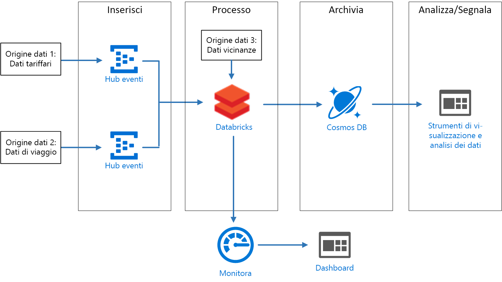
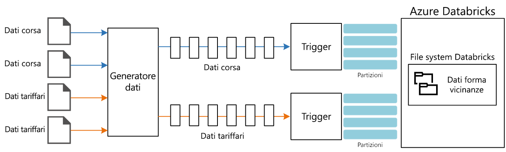

# <a name="create-a-stream-processing-pipeline-with-azure-databricks"></a><span data-ttu-id="58691-103">Creare una pipeline di elaborazione di flussi con Azure Databricks</span><span class="sxs-lookup"><span data-stu-id="58691-103">Create a stream processing pipeline with Azure Databricks</span></span>

<span data-ttu-id="58691-104">Questa architettura di riferimento illustra una pipeline di [elaborazione di flussi](/azure/architecture/data-guide/big-data/real-time-processing) end-to-end.</span><span class="sxs-lookup"><span data-stu-id="58691-104">This reference architecture shows an end-to-end [stream processing](/azure/architecture/data-guide/big-data/real-time-processing) pipeline.</span></span> <span data-ttu-id="58691-105">Questo tipo di pipeline include quattro fasi: inserimento, processo, archiviazione, e analisi e creazione di report.</span><span class="sxs-lookup"><span data-stu-id="58691-105">This type of pipeline has four stages: ingest, process, store, and analysis and reporting.</span></span> <span data-ttu-id="58691-106">Per questa architettura di riferimento, la pipeline inserisce i dati da due origini, esegue un join in record correlati da ogni flusso, arricchisce il risultato e calcola una media in tempo reale.</span><span class="sxs-lookup"><span data-stu-id="58691-106">For this reference architecture, the pipeline ingests data from two sources, performs a join on related records from each stream, enriches the result, and calculates an average in real time.</span></span> <span data-ttu-id="58691-107">I risultati vengono archiviati per analisi aggiuntive.</span><span class="sxs-lookup"><span data-stu-id="58691-107">The results are stored for further analysis.</span></span> <span data-ttu-id="58691-108">[**Distribuire questa soluzione**](#deploy-the-solution).</span><span class="sxs-lookup"><span data-stu-id="58691-108">[**Deploy this solution**](#deploy-the-solution).</span></span>



<span data-ttu-id="58691-110">**Scenario**: una società di taxi raccoglie dati su ogni corsa.</span><span class="sxs-lookup"><span data-stu-id="58691-110">**Scenario**: A taxi company collects data about each taxi trip.</span></span> <span data-ttu-id="58691-111">Per questo scenario si presuppone che siano presenti due dispositivi diversi che inviano dati.</span><span class="sxs-lookup"><span data-stu-id="58691-111">For this scenario, we assume there are two separate devices sending data.</span></span> <span data-ttu-id="58691-112">Il taxi ha un tassametro che invia informazioni su ogni corsa &mdash; la durata, la distanza e le ubicazioni di salita e di discesa del cliente.</span><span class="sxs-lookup"><span data-stu-id="58691-112">The taxi has a meter that sends information about each ride &mdash; the duration, distance, and pickup and dropoff locations.</span></span> <span data-ttu-id="58691-113">Un dispositivo separato accetta i pagamenti dai clienti e invia dati sui prezzi delle corse.</span><span class="sxs-lookup"><span data-stu-id="58691-113">A separate device accepts payments from customers and sends data about fares.</span></span> <span data-ttu-id="58691-114">Per individuare le tendenze dell'utenza, la società di taxi vuole calcolare la mancia media per miglia guidate, in tempo reale, per ogni quartiere.</span><span class="sxs-lookup"><span data-stu-id="58691-114">To spot ridership trends, the taxi company wants to calculate the average tip per mile driven, in real time, for each neighborhood.</span></span>

## <a name="architecture"></a><span data-ttu-id="58691-115">Architettura</span><span class="sxs-lookup"><span data-stu-id="58691-115">Architecture</span></span>

<span data-ttu-id="58691-116">L'architettura è costituita dai componenti seguenti.</span><span class="sxs-lookup"><span data-stu-id="58691-116">The architecture consists of the following components.</span></span>

<span data-ttu-id="58691-117">**Origini dati**.</span><span class="sxs-lookup"><span data-stu-id="58691-117">**Data sources**.</span></span> <span data-ttu-id="58691-118">In questa architettura sono presenti due origini dati che generano flussi di dati in tempo reale.</span><span class="sxs-lookup"><span data-stu-id="58691-118">In this architecture, there are two data sources that generate data streams in real time.</span></span> <span data-ttu-id="58691-119">Il primo flusso contiene le informazioni sulla corsa e il secondo contiene le informazioni sui costi delle corse.</span><span class="sxs-lookup"><span data-stu-id="58691-119">The first stream contains ride information, and the second contains fare information.</span></span> <span data-ttu-id="58691-120">L'architettura di riferimento include un generatore di dati simulato che legge dati da un set di file statici ed esegue il push dei dati in Hub eventi.</span><span class="sxs-lookup"><span data-stu-id="58691-120">The reference architecture includes a simulated data generator that reads from a set of static files and pushes the data to Event Hubs.</span></span> <span data-ttu-id="58691-121">Le origini dati in un'applicazione reale corrisponderebbero a dispositivi installati nei taxi.</span><span class="sxs-lookup"><span data-stu-id="58691-121">The data sources in a real application would be devices installed in the taxi cabs.</span></span>

<span data-ttu-id="58691-122">**Hub eventi di Azure**.</span><span class="sxs-lookup"><span data-stu-id="58691-122">**Azure Event Hubs**.</span></span> <span data-ttu-id="58691-123">[Hub eventi](/azure/event-hubs/) è un servizio di inserimento di eventi.</span><span class="sxs-lookup"><span data-stu-id="58691-123">[Event Hubs](/azure/event-hubs/) is an event ingestion service.</span></span> <span data-ttu-id="58691-124">Questa architettura usa due istanze di Hub eventi, una per ogni origine dati.</span><span class="sxs-lookup"><span data-stu-id="58691-124">This architecture uses two event hub instances, one for each data source.</span></span> <span data-ttu-id="58691-125">Ogni origine dati invia un flusso di dati all'istanza associata di Hub eventi.</span><span class="sxs-lookup"><span data-stu-id="58691-125">Each data source sends a stream of data to the associated event hub.</span></span>

<span data-ttu-id="58691-126">**Azure Databricks**.</span><span class="sxs-lookup"><span data-stu-id="58691-126">**Azure Databricks**.</span></span> <span data-ttu-id="58691-127">[Databricks](/azure/azure-databricks/) è una piattaforma di analisi basata su Apache Spark ottimizzata per la piattaforma dei servizi cloud di Microsoft Azure.</span><span class="sxs-lookup"><span data-stu-id="58691-127">[Databricks](/azure/azure-databricks/) is an Apache Spark-based analytics platform optimized for the Microsoft Azure cloud services platform.</span></span> <span data-ttu-id="58691-128">Databricks viene usata per la correlazione dei dati su corse e tariffe dei taxi, nonché per migliorare i dati correlati con i dati sul quartiere archiviati nel file System di Databricks.</span><span class="sxs-lookup"><span data-stu-id="58691-128">Databricks is used to correlate of the taxi ride and fare data, and also to enrich the correlated data with neighborhood data stored in the Databricks file system.</span></span>

<span data-ttu-id="58691-129">**Cosmos DB**.</span><span class="sxs-lookup"><span data-stu-id="58691-129">**Cosmos DB**.</span></span> <span data-ttu-id="58691-130">L'output dal processo di Azure Databricks è una serie di record, che vengono scritti in [Cosmos DB](/azure/cosmos-db/) con l'API Cassandra.</span><span class="sxs-lookup"><span data-stu-id="58691-130">The output from Azure Databricks job is a series of records, which are written to [Cosmos DB](/azure/cosmos-db/) using the Cassandra API.</span></span> <span data-ttu-id="58691-131">Viene usata l'API Cassandra perché supporta la modellazione di dati delle serie temporali.</span><span class="sxs-lookup"><span data-stu-id="58691-131">The Cassandra API is used because it supports time series data modeling.</span></span>

<span data-ttu-id="58691-132">**Azure Log Analytics**.</span><span class="sxs-lookup"><span data-stu-id="58691-132">**Azure Log Analytics**.</span></span> <span data-ttu-id="58691-133">I dati del log applicazioni raccolti da [Monitoraggio di Azure](/azure/monitoring-and-diagnostics/) vengono archiviati in un'[area di lavoro Log Analytics](/azure/log-analytics).</span><span class="sxs-lookup"><span data-stu-id="58691-133">Application log data collected by [Azure Monitor](/azure/monitoring-and-diagnostics/) is stored in a [Log Analytics workspace](/azure/log-analytics).</span></span> <span data-ttu-id="58691-134">Le query di Log Analytics permettono di analizzare e visualizzare le metriche e ispezionare i messaggi di log allo scopo di identificare i problemi all'interno dell'applicazione.</span><span class="sxs-lookup"><span data-stu-id="58691-134">Log Analytics queries can be used to analyze and visualize metrics and inspect log messages to identify issues within the application.</span></span>

## <a name="data-ingestion"></a><span data-ttu-id="58691-135">Inserimento di dati</span><span class="sxs-lookup"><span data-stu-id="58691-135">Data ingestion</span></span>

<!-- markdownlint-disable MD033 -->

<span data-ttu-id="58691-136">Per simulare un'origine dati, questa architettura di riferimento usa il set di dati [New York City Taxi Data](https://uofi.app.box.com/v/NYCtaxidata/folder/2332218797) <sup>[[1]](#note1)</sup>.</span><span class="sxs-lookup"><span data-stu-id="58691-136">To simulate a data source, this reference architecture uses the [New York City Taxi Data](https://uofi.app.box.com/v/NYCtaxidata/folder/2332218797) dataset<sup>[[1]](#note1)</sup>.</span></span> <span data-ttu-id="58691-137">Questo set di dati contiene dati relativi alle corse dei taxi a New York City in un periodo di quattro anni (2010 &ndash; 2013).</span><span class="sxs-lookup"><span data-stu-id="58691-137">This dataset contains data about taxi trips in New York City over a four-year period (2010 &ndash; 2013).</span></span> <span data-ttu-id="58691-138">I tipi di record contenuti sono due: Dati relativi alle corse e dati relativi alle tariffe.</span><span class="sxs-lookup"><span data-stu-id="58691-138">It contains two types of record: Ride data and fare data.</span></span> <span data-ttu-id="58691-139">I dati relativi alle corsa includono la durata della corsa, la distanza percorsa e le ubicazioni di salita e discesa del cliente.</span><span class="sxs-lookup"><span data-stu-id="58691-139">Ride data includes trip duration, trip distance, and pickup and dropoff location.</span></span> <span data-ttu-id="58691-140">I dati relativi ai costi della corsa includono gli importi relativi a costo di base, imposte e mancia.</span><span class="sxs-lookup"><span data-stu-id="58691-140">Fare data includes fare, tax, and tip amounts.</span></span> <span data-ttu-id="58691-141">I campi comuni in entrambi i tipi di record includono il numero di taxi, il numero di licenza e l'ID del fornitore.</span><span class="sxs-lookup"><span data-stu-id="58691-141">Common fields in both record types include medallion number, hack license, and vendor ID.</span></span> <span data-ttu-id="58691-142">Questi tre campi identificano in modo univoco un taxi e un tassista.</span><span class="sxs-lookup"><span data-stu-id="58691-142">Together these three fields uniquely identify a taxi plus a driver.</span></span> <span data-ttu-id="58691-143">I dati vengono archiviati in formato CSV.</span><span class="sxs-lookup"><span data-stu-id="58691-143">The data is stored in CSV format.</span></span>

> <span data-ttu-id="58691-144">[1] <span id="note1">Donovan, Brian; Work, Dan (2016): New York City Taxi Trip Data (2010-2013).</span><span class="sxs-lookup"><span data-stu-id="58691-144">[1] <span id="note1">Donovan, Brian; Work, Dan (2016): New York City Taxi Trip Data (2010-2013).</span></span> <span data-ttu-id="58691-145">University of Illinois at Urbana-Champaign.</span><span class="sxs-lookup"><span data-stu-id="58691-145">University of Illinois at Urbana-Champaign.</span></span> <https://doi.org/10.13012/J8PN93H8>

<!-- markdownlint-enable MD033 -->

<span data-ttu-id="58691-146">Il generatore di dati è un'applicazione .NET Core che legge i record e li invia a Hub eventi di Azure.</span><span class="sxs-lookup"><span data-stu-id="58691-146">The data generator is a .NET Core application that reads the records and sends them to Azure Event Hubs.</span></span> <span data-ttu-id="58691-147">Il generatore invia i dati relativi alle corse in formato JSON e i dati relativi ai costi in formato CSV.</span><span class="sxs-lookup"><span data-stu-id="58691-147">The generator sends ride data in JSON format and fare data in CSV format.</span></span>

<span data-ttu-id="58691-148">Hub eventi usa [partizioni](/azure/event-hubs/event-hubs-features#partitions) per segmentare i dati.</span><span class="sxs-lookup"><span data-stu-id="58691-148">Event Hubs uses [partitions](/azure/event-hubs/event-hubs-features#partitions) to segment the data.</span></span> <span data-ttu-id="58691-149">Le partizioni consentono a un consumer di leggere ogni partizione in parallelo.</span><span class="sxs-lookup"><span data-stu-id="58691-149">Partitions allow a consumer to read each partition in parallel.</span></span> <span data-ttu-id="58691-150">Quando si inviano dati a Hub eventi, è possibile specificare in modo esplicito la chiave di partizione.</span><span class="sxs-lookup"><span data-stu-id="58691-150">When you send data to Event Hubs, you can specify the partition key explicitly.</span></span> <span data-ttu-id="58691-151">In caso contrario, i record vengono assegnati alle partizioni in modalità round-robin.</span><span class="sxs-lookup"><span data-stu-id="58691-151">Otherwise, records are assigned to partitions in round-robin fashion.</span></span>

<span data-ttu-id="58691-152">In questo scenario i dati relativi alle corse e i dati relativi ai costi devono avere lo stesso ID di partizione per un taxi specifico.</span><span class="sxs-lookup"><span data-stu-id="58691-152">In this scenario, ride data and fare data should end up with the same partition ID for a given taxi cab.</span></span> <span data-ttu-id="58691-153">Ciò consente a Databricks di applicare un certo livello di parallelismo durante la correlazione dei due flussi.</span><span class="sxs-lookup"><span data-stu-id="58691-153">This enables Databricks to apply a degree of parallelism when it correlates the two streams.</span></span> <span data-ttu-id="58691-154">Un record nella partizione *n* dei dati relativi alle corse corrisponderà a un record nella partizione *n* dei dati relativi ai costi.</span><span class="sxs-lookup"><span data-stu-id="58691-154">A record in partition *n* of the ride data will match a record in partition *n* of the fare data.</span></span>



<span data-ttu-id="58691-156">Nel generatore di dati il modello di dati comune per entrambi i tipi di record ha una proprietà `PartitionKey` che corrisponde alla concatenazione di `Medallion`, `HackLicense` e `VendorId`.</span><span class="sxs-lookup"><span data-stu-id="58691-156">In the data generator, the common data model for both record types has a `PartitionKey` property that is the concatenation of `Medallion`, `HackLicense`, and `VendorId`.</span></span>

```csharp
public abstract class TaxiData
{
    public TaxiData()
    {
    }

    [JsonProperty]
    public long Medallion { get; set; }

    [JsonProperty]
    public long HackLicense { get; set; }

    [JsonProperty]
    public string VendorId { get; set; }

    [JsonProperty]
    public DateTimeOffset PickupTime { get; set; }

    [JsonIgnore]
    public string PartitionKey
    {
        get => $"{Medallion}_{HackLicense}_{VendorId}";
    }
```

<span data-ttu-id="58691-157">Questa proprietà viene usata per fornire una chiave di partizione esplicita durante l'invio a Hub eventi:</span><span class="sxs-lookup"><span data-stu-id="58691-157">This property is used to provide an explicit partition key when sending to Event Hubs:</span></span>

```csharp
using (var client = pool.GetObject())
{
    return client.Value.SendAsync(new EventData(Encoding.UTF8.GetBytes(
        t.GetData(dataFormat))), t.PartitionKey);
}
```

### <a name="event-hubs"></a><span data-ttu-id="58691-158">Hub eventi</span><span class="sxs-lookup"><span data-stu-id="58691-158">Event Hubs</span></span>

<span data-ttu-id="58691-159">La capacità di elaborazione di Hub eventi viene misurata in [unità elaborate](/azure/event-hubs/event-hubs-features#throughput-units).</span><span class="sxs-lookup"><span data-stu-id="58691-159">The throughput capacity of Event Hubs is measured in [throughput units](/azure/event-hubs/event-hubs-features#throughput-units).</span></span> <span data-ttu-id="58691-160">È possibile ridimensionare automaticamente un hub eventi abilitando l'[aumento automatico](/azure/event-hubs/event-hubs-auto-inflate), che ridimensiona automaticamente le unità elaborate in base al traffico, fino a un limite massimo configurato.</span><span class="sxs-lookup"><span data-stu-id="58691-160">You can autoscale an event hub by enabling [auto-inflate](/azure/event-hubs/event-hubs-auto-inflate), which automatically scales the throughput units based on traffic, up to a configured maximum.</span></span>

## <a name="stream-processing"></a><span data-ttu-id="58691-161">Elaborazione del flusso</span><span class="sxs-lookup"><span data-stu-id="58691-161">Stream processing</span></span>

<span data-ttu-id="58691-162">In Azure Databricks, viene eseguita l'elaborazione dei dati da un processo.</span><span class="sxs-lookup"><span data-stu-id="58691-162">In Azure Databricks, data processing is performed by a job.</span></span> <span data-ttu-id="58691-163">Il processo viene assegnato a e viene eseguito in un cluster.</span><span class="sxs-lookup"><span data-stu-id="58691-163">The job is assigned to and runs on a cluster.</span></span> <span data-ttu-id="58691-164">Il processo può essere codice personalizzato scritto in Java o un [notebook](https://docs.databricks.com/user-guide/notebooks/index.html) Spark.</span><span class="sxs-lookup"><span data-stu-id="58691-164">The job can either be custom code written in Java, or a Spark [notebook](https://docs.databricks.com/user-guide/notebooks/index.html).</span></span>

<span data-ttu-id="58691-165">In questa architettura di riferimento, il processo è un file di archivio Java con classi scritte in Java e Scala.</span><span class="sxs-lookup"><span data-stu-id="58691-165">In this reference architecture, the job is a Java archive with classes written in both Java and Scala.</span></span> <span data-ttu-id="58691-166">Quando si specifica il file di archivio Java per un processo di Databricks, la classe viene specificata per l'esecuzione da parte del cluster Databricks.</span><span class="sxs-lookup"><span data-stu-id="58691-166">When specifying the Java archive for a Databricks job, the class is specified for execution by the Databricks cluster.</span></span> <span data-ttu-id="58691-167">In questo caso, il **principale** metodo della classe **com.microsoft.pnp.TaxiCabReader** contiene la logica di elaborazione dati.</span><span class="sxs-lookup"><span data-stu-id="58691-167">Here, the **main** method of the **com.microsoft.pnp.TaxiCabReader** class contains the data processing logic.</span></span>

### <a name="reading-the-stream-from-the-two-event-hub-instances"></a><span data-ttu-id="58691-168">Lettura del flusso dalle due istanze dell'hub eventi</span><span class="sxs-lookup"><span data-stu-id="58691-168">Reading the stream from the two event hub instances</span></span>

<span data-ttu-id="58691-169">La logica di elaborazione dei dati usa [lo streaming strutturato Spark](https://spark.apache.org/docs/2.1.2/structured-streaming-programming-guide.html) per leggere dalle due istanze dell'hub eventi di Azure:</span><span class="sxs-lookup"><span data-stu-id="58691-169">The data processing logic uses [Spark structured streaming](https://spark.apache.org/docs/2.1.2/structured-streaming-programming-guide.html) to read from the two Azure event hub instances:</span></span>

```scala
val rideEventHubOptions = EventHubsConf(rideEventHubConnectionString)
      .setConsumerGroup(conf.taxiRideConsumerGroup())
      .setStartingPosition(EventPosition.fromStartOfStream)
    val rideEvents = spark.readStream
      .format("eventhubs")
      .options(rideEventHubOptions.toMap)
      .load

    val fareEventHubOptions = EventHubsConf(fareEventHubConnectionString)
      .setConsumerGroup(conf.taxiFareConsumerGroup())
      .setStartingPosition(EventPosition.fromStartOfStream)
    val fareEvents = spark.readStream
      .format("eventhubs")
      .options(fareEventHubOptions.toMap)
      .load
```

### <a name="enriching-the-data-with-the-neighborhood-information"></a><span data-ttu-id="58691-170">Arricchimento dei dati con le informazioni sul quartiere</span><span class="sxs-lookup"><span data-stu-id="58691-170">Enriching the data with the neighborhood information</span></span>

<span data-ttu-id="58691-171">I dati sulla corsa includono le coordinate di latitudine e longitudine dei punti di partenza e arrivo.</span><span class="sxs-lookup"><span data-stu-id="58691-171">The ride data includes the latitude and longitude coordinates of the pick up and drop off locations.</span></span> <span data-ttu-id="58691-172">Benché siano utili, queste coordinate non sono facilmente analizzabili.</span><span class="sxs-lookup"><span data-stu-id="58691-172">While these coordinates are useful, they are not easily consumed for analysis.</span></span> <span data-ttu-id="58691-173">Di conseguenza, questi dati vengono arricchiti con i dati sul quartiere, letti da un [file di forma](https://en.wikipedia.org/wiki/Shapefile).</span><span class="sxs-lookup"><span data-stu-id="58691-173">Therefore, this data is enriched with neighborhood data that is read from a [shapefile](https://en.wikipedia.org/wiki/Shapefile).</span></span>

<span data-ttu-id="58691-174">Il formato di file di forma è binario e non facilmente analizzato, ma la libreria [GeoTools](http://geotools.org/) fornisce strumenti per i dati geospaziali che usano il formato di file di forma.</span><span class="sxs-lookup"><span data-stu-id="58691-174">The shapefile format is binary and not easily parsed, but the [GeoTools](http://geotools.org/) library provides tools for geospatial data that use the shapefile format.</span></span> <span data-ttu-id="58691-175">Questa libreria viene usata nella classe **com.microsoft.pnp.GeoFinder** per determinare il nome del quartiere in base alle coordinate di partenza e arrivo.</span><span class="sxs-lookup"><span data-stu-id="58691-175">This library is used in the **com.microsoft.pnp.GeoFinder** class to determine the neighborhood name based on the pick up and drop off coordinates.</span></span>

```scala
val neighborhoodFinder = (lon: Double, lat: Double) => {
      NeighborhoodFinder.getNeighborhood(lon, lat).get()
    }
```

### <a name="joining-the-ride-and-fare-data"></a><span data-ttu-id="58691-176">Unione di dati su corse e tariffe</span><span class="sxs-lookup"><span data-stu-id="58691-176">Joining the ride and fare data</span></span>

<span data-ttu-id="58691-177">Prima di tutto i dati su corse e tariffe vengono trasformati:</span><span class="sxs-lookup"><span data-stu-id="58691-177">First the ride and fare data is transformed:</span></span>

```scala
    val rides = transformedRides
      .filter(r => {
        if (r.isNullAt(r.fieldIndex("errorMessage"))) {
          true
        }
        else {
          malformedRides.add(1)
          false
        }
      })
      .select(
        $"ride.*",
        to_neighborhood($"ride.pickupLon", $"ride.pickupLat")
          .as("pickupNeighborhood"),
        to_neighborhood($"ride.dropoffLon", $"ride.dropoffLat")
          .as("dropoffNeighborhood")
      )
      .withWatermark("pickupTime", conf.taxiRideWatermarkInterval())

    val fares = transformedFares
      .filter(r => {
        if (r.isNullAt(r.fieldIndex("errorMessage"))) {
          true
        }
        else {
          malformedFares.add(1)
          false
        }
      })
      .select(
        $"fare.*",
        $"pickupTime"
      )
      .withWatermark("pickupTime", conf.taxiFareWatermarkInterval())
```

<span data-ttu-id="58691-178">Quindi, i dati sulla corsa vengono aggiunti ai dati sulle tariffe:</span><span class="sxs-lookup"><span data-stu-id="58691-178">And then the ride data is joined with the fare data:</span></span>

```scala
val mergedTaxiTrip = rides.join(fares, Seq("medallion", "hackLicense", "vendorId", "pickupTime"))
```

### <a name="processing-the-data-and-inserting-into-cosmos-db"></a><span data-ttu-id="58691-179">Elaborazione dati e inserimento in Cosmos DB</span><span class="sxs-lookup"><span data-stu-id="58691-179">Processing the data and inserting into Cosmos DB</span></span>

<span data-ttu-id="58691-180">L'importo tariffario medio per ogni quartiere viene calcolato per un determinato intervallo di tempo:</span><span class="sxs-lookup"><span data-stu-id="58691-180">The average fare amount for each neighborhood is calculated for a given time interval:</span></span>

```scala
val maxAvgFarePerNeighborhood = mergedTaxiTrip.selectExpr("medallion", "hackLicense", "vendorId", "pickupTime", "rateCode", "storeAndForwardFlag", "dropoffTime", "passengerCount", "tripTimeInSeconds", "tripDistanceInMiles", "pickupLon", "pickupLat", "dropoffLon", "dropoffLat", "paymentType", "fareAmount", "surcharge", "mtaTax", "tipAmount", "tollsAmount", "totalAmount", "pickupNeighborhood", "dropoffNeighborhood")
      .groupBy(window($"pickupTime", conf.windowInterval()), $"pickupNeighborhood")
      .agg(
        count("*").as("rideCount"),
        sum($"fareAmount").as("totalFareAmount"),
        sum($"tipAmount").as("totalTipAmount")
      )
      .select($"window.start", $"window.end", $"pickupNeighborhood", $"rideCount", $"totalFareAmount", $"totalTipAmount")
```

<span data-ttu-id="58691-181">Che viene quindi inserito in Cosmos DB:</span><span class="sxs-lookup"><span data-stu-id="58691-181">Which is then inserted into Cosmos DB:</span></span>

```scala
maxAvgFarePerNeighborhood
      .writeStream
      .queryName("maxAvgFarePerNeighborhood_cassandra_insert")
      .outputMode(OutputMode.Append())
      .foreach(new CassandraSinkForeach(connector))
      .start()
      .awaitTermination()
```

## <a name="security-considerations"></a><span data-ttu-id="58691-182">Considerazioni relative alla sicurezza</span><span class="sxs-lookup"><span data-stu-id="58691-182">Security considerations</span></span>

<span data-ttu-id="58691-183">L'accesso all'area di lavoro del Database di Azure viene controllato dalla [console di amministrazione](https://docs.databricks.com/administration-guide/admin-settings/index.html).</span><span class="sxs-lookup"><span data-stu-id="58691-183">Access to the Azure Database workspace is controlled using the [administrator console](https://docs.databricks.com/administration-guide/admin-settings/index.html).</span></span> <span data-ttu-id="58691-184">La console di amministrazione include funzionalità per aggiungere utenti, gestire le autorizzazioni utente e impostare il single sign-on.</span><span class="sxs-lookup"><span data-stu-id="58691-184">The administrator console includes functionality to add users, manage user permissions, and set up single sign-on.</span></span> <span data-ttu-id="58691-185">La console permette anche di impostare il controllo di accesso ad aree di lavoro, cluster, processi e tabelle.</span><span class="sxs-lookup"><span data-stu-id="58691-185">Access control for workspaces, clusters, jobs, and tables can also be set through the administrator console.</span></span>

### <a name="managing-secrets"></a><span data-ttu-id="58691-186">Gestione dei segreti</span><span class="sxs-lookup"><span data-stu-id="58691-186">Managing secrets</span></span>

<span data-ttu-id="58691-187">Azure Databricks include un [archivio segreto](https://docs.azuredatabricks.net/user-guide/secrets/index.html) che viene usato per archiviare i segreti, tra cui le stringhe di connessione, le chiavi di accesso, i nomi utente e le password.</span><span class="sxs-lookup"><span data-stu-id="58691-187">Azure Databricks includes a [secret store](https://docs.azuredatabricks.net/user-guide/secrets/index.html) that is used to store secrets, including connection strings, access keys, user names, and passwords.</span></span> <span data-ttu-id="58691-188">I segreti all'interno dell'archivio segreto di Azure Databricks vengono partizionati per **ambiti**:</span><span class="sxs-lookup"><span data-stu-id="58691-188">Secrets within the Azure Databricks secret store are partitioned by **scopes**:</span></span>

```bash
databricks secrets create-scope --scope "azure-databricks-job"
```

<span data-ttu-id="58691-189">I segreti vengono aggiunti a livello ambito:</span><span class="sxs-lookup"><span data-stu-id="58691-189">Secrets are added at the scope level:</span></span>

```bash
databricks secrets put --scope "azure-databricks-job" --key "taxi-ride"
```

> [!NOTE]
> <span data-ttu-id="58691-190">È possibile usare un ambito di cui è stato eseguito il backup in Azure Key Vault invece dell'ambito nativo di Azure Databricks.</span><span class="sxs-lookup"><span data-stu-id="58691-190">An Azure Key Vault-backed scope can be used instead of the native Azure Databricks scope.</span></span> <span data-ttu-id="58691-191">Per altre informazioni, vedere [Azure Key Vault-backed scopes](https://docs.azuredatabricks.net/user-guide/secrets/secret-scopes.html#azure-key-vault-backed-scopes) ( Ambiti di cui è stato eseguito il backup in Azure Key Vault).</span><span class="sxs-lookup"><span data-stu-id="58691-191">To learn more, see [Azure Key Vault-backed scopes](https://docs.azuredatabricks.net/user-guide/secrets/secret-scopes.html#azure-key-vault-backed-scopes).</span></span>

<span data-ttu-id="58691-192">Nel codice, i segreti sono accessibili grazie alle [utilità dei segreti](https://docs.databricks.com/user-guide/dev-tools/dbutils.html#secrets-utilities) di Azure Databricks.</span><span class="sxs-lookup"><span data-stu-id="58691-192">In code, secrets are accessed via the Azure Databricks [secrets utilities](https://docs.databricks.com/user-guide/dev-tools/dbutils.html#secrets-utilities).</span></span>

## <a name="monitoring-considerations"></a><span data-ttu-id="58691-193">Considerazioni sul monitoraggio</span><span class="sxs-lookup"><span data-stu-id="58691-193">Monitoring considerations</span></span>

<span data-ttu-id="58691-194">Azure Databricks si basa su Apache Spark, e entrambi usano [log4j](https://logging.apache.org/log4j/2.x/) come libreria standard per la registrazione.</span><span class="sxs-lookup"><span data-stu-id="58691-194">Azure Databricks is based on Apache Spark, and both use [log4j](https://logging.apache.org/log4j/2.x/) as the standard library for logging.</span></span> <span data-ttu-id="58691-195">Oltre alla registrazione predefinita fornita da Apache Spark, questa architettura di riferimento invia log e metriche a [Azure Log Analytics](/azure/log-analytics/).</span><span class="sxs-lookup"><span data-stu-id="58691-195">In addition to the default logging provided by Apache Spark, this reference architecture sends logs and metrics to [Azure Log Analytics](/azure/log-analytics/).</span></span>

<span data-ttu-id="58691-196">La classe **com.microsoft.pnp.TaxiCabReader** configura il sistema di registrazione di Apache Spark in modo da inviare i registri a Azure Log Analytics usando i valori contenuti nel file **log4j.properties**.</span><span class="sxs-lookup"><span data-stu-id="58691-196">The **com.microsoft.pnp.TaxiCabReader** class configures the Apache Spark logging system to send its logs to Azure Log Analytics using the values in the **log4j.properties** file.</span></span> <span data-ttu-id="58691-197">Mentre i messaggi del logger di Apache Spark sono stringhe, Azure Log Analytics richiede che i messaggi di log siano formattati come JSON.</span><span class="sxs-lookup"><span data-stu-id="58691-197">While the Apache Spark logger messages are strings, Azure Log Analytics requires log messages to be formatted as JSON.</span></span> <span data-ttu-id="58691-198">La classe **com.microsoft.pnp.log4j.LogAnalyticsAppender** trasforma questi messaggi in JSON:</span><span class="sxs-lookup"><span data-stu-id="58691-198">The **com.microsoft.pnp.log4j.LogAnalyticsAppender** class transforms these messages to JSON:</span></span>

```scala

    @Override
    protected void append(LoggingEvent loggingEvent) {
        if (this.layout == null) {
            this.setLayout(new JSONLayout());
        }

        String json = this.getLayout().format(loggingEvent);
        try {
            this.client.send(json, this.logType);
        } catch(IOException ioe) {
            LogLog.warn("Error sending LoggingEvent to Log Analytics", ioe);
        }
    }

```

<span data-ttu-id="58691-199">Dal momento che la classe **com.microsoft.pnp.TaxiCabReader** elabora i messaggi relativi a corse e tariffe, è possibile che il formato di uno dei due non sia valido.</span><span class="sxs-lookup"><span data-stu-id="58691-199">As the **com.microsoft.pnp.TaxiCabReader** class processes ride and fare messages, it's possible that either one may be malformed and therefore not valid.</span></span> <span data-ttu-id="58691-200">In un ambiente di produzione, è importante analizzare questi messaggi in formato non valido per identificare un problema con le origini dati in modo da risolverlo rapidamente per evitare la perdita di dati.</span><span class="sxs-lookup"><span data-stu-id="58691-200">In a production environment, it's important to analyze these malformed messages to identify a problem with the data sources so it can be fixed quickly to prevent data loss.</span></span> <span data-ttu-id="58691-201">La classe **com.microsoft.pnp.TaxiCabReader** registra un accumulatore Apache Spark che tiene traccia del numero di record su tariffe e corse in formato non valido:</span><span class="sxs-lookup"><span data-stu-id="58691-201">The **com.microsoft.pnp.TaxiCabReader** class registers an Apache Spark Accumulator that keeps track of the number of malformed fare and ride records:</span></span>

```scala
    @transient val appMetrics = new AppMetrics(spark.sparkContext)
    appMetrics.registerGauge("metrics.malformedrides", AppAccumulators.getRideInstance(spark.sparkContext))
    appMetrics.registerGauge("metrics.malformedfares", AppAccumulators.getFareInstance(spark.sparkContext))
    SparkEnv.get.metricsSystem.registerSource(appMetrics)
```

<span data-ttu-id="58691-202">Apache Spark usa la libreria Dropwizard per inviare metriche e alcuni dei campi metrici nativi di Dropwizard non sono compatibili con Azure Log Analytics.</span><span class="sxs-lookup"><span data-stu-id="58691-202">Apache Spark uses the Dropwizard library to send metrics, and some of the native Dropwizard metrics fields are incompatible with Azure Log Analytics.</span></span> <span data-ttu-id="58691-203">Di conseguenza, questa architettura di riferimento include un sink e un reporter di Dropwizard personalizzati.</span><span class="sxs-lookup"><span data-stu-id="58691-203">Therefore, this reference architecture includes a custom Dropwizard sink and reporter.</span></span> <span data-ttu-id="58691-204">Formatta le metriche nel formato previsto da Azure Log Analytics.</span><span class="sxs-lookup"><span data-stu-id="58691-204">It formats the metrics in the format expected by Azure Log Analytics.</span></span> <span data-ttu-id="58691-205">Quando Apache Spark riporta le metriche, vengono inviate anche le metriche personalizzate per i dati di corse e tariffe in formato non valido.</span><span class="sxs-lookup"><span data-stu-id="58691-205">When Apache Spark reports metrics, the custom metrics for the malformed ride and fare data are also sent.</span></span>

<span data-ttu-id="58691-206">L'ultima metrica da registrare per l'area di lavoro Azure Log Analytics è lo stato di avanzamento cumulativo del processo Spark Structured Streaming.</span><span class="sxs-lookup"><span data-stu-id="58691-206">The last metric to be logged to the Azure Log Analytics workspace is the cumulative progress of the Spark Structured Streaming job progress.</span></span> <span data-ttu-id="58691-207">Questa operazione viene eseguita usando un listener StreamingQuery personalizzato implementato nella classe **com.microsoft.pnp.StreamingMetricsListener**.</span><span class="sxs-lookup"><span data-stu-id="58691-207">This is done using a custom StreamingQuery listener implemented in the **com.microsoft.pnp.StreamingMetricsListener** class.</span></span> <span data-ttu-id="58691-208">Questa classe viene registrata nella sessione di Apache Spark quando viene eseguito il processo:</span><span class="sxs-lookup"><span data-stu-id="58691-208">This class is registered to the Apache Spark Session when the job runs:</span></span>

```scala
spark.streams.addListener(new StreamingMetricsListener())
```

<span data-ttu-id="58691-209">I metodi nella classe StreamingMetricsListener vengono chiamati dal runtime di Apache Spark ogni volta che si verifica un evento di streaming strutturato, inviando messaggi di log e metriche all'area di lavoro Azure Log Analytics.</span><span class="sxs-lookup"><span data-stu-id="58691-209">The methods in the StreamingMetricsListener are called by the Apache Spark runtime whenever a structured steaming event occurs, sending log messages and metrics to the Azure Log Analytics workspace.</span></span> <span data-ttu-id="58691-210">È possibile usare le query seguenti nell'area di lavoro per monitorare l'applicazione:</span><span class="sxs-lookup"><span data-stu-id="58691-210">You can use the following queries in your workspace to monitor the application:</span></span>

### <a name="latency-and-throughput-for-streaming-queries"></a><span data-ttu-id="58691-211">Latenza e velocità effettiva per le query di streaming</span><span class="sxs-lookup"><span data-stu-id="58691-211">Latency and throughput for streaming queries</span></span>

```shell
taxijob_CL
| where TimeGenerated > startofday(datetime(<date>)) and TimeGenerated < endofday(datetime(<date>))
| project  mdc_inputRowsPerSecond_d, mdc_durationms_triggerExecution_d
| render timechart
```

### <a name="exceptions-logged-during-stream-query-execution"></a><span data-ttu-id="58691-212">Eccezioni registrate durante l'esecuzione di query di flusso</span><span class="sxs-lookup"><span data-stu-id="58691-212">Exceptions logged during stream query execution</span></span>

```shell
taxijob_CL
| where TimeGenerated > startofday(datetime(<date>)) and TimeGenerated < endofday(datetime(<date>))
| where Level contains "Error"
```

### <a name="accumulation-of-malformed-fare-and-ride-data"></a><span data-ttu-id="58691-213">Accumulo di dati su tariffe e corse in formato non valido</span><span class="sxs-lookup"><span data-stu-id="58691-213">Accumulation of malformed fare and ride data</span></span>

```shell
SparkMetric_CL
| where TimeGenerated > startofday(datetime(<date>)) and TimeGenerated < endofday(datetime(<date>))
| render timechart
| where name_s contains "metrics.malformedrides"

SparkMetric_CL
| where TimeGenerated > startofday(datetime(<date>)) and TimeGenerated < endofday(datetime(<date>))
| render timechart
| where name_s contains "metrics.malformedfares"
```

### <a name="job-execution-to-trace-resiliency"></a><span data-ttu-id="58691-214">Esecuzione del processo per tenere traccia della resilienza</span><span class="sxs-lookup"><span data-stu-id="58691-214">Job execution to trace resiliency</span></span>

```shell
SparkMetric_CL
| where TimeGenerated > startofday(datetime(<date>)) and TimeGenerated < endofday(datetime(<date>))
| render timechart
| where name_s contains "driver.DAGScheduler.job.allJobs"
```

<span data-ttu-id="58691-215">Per altre informazioni, vedere [monitoraggio di Azure Databricks](../../databricks-monitoring/index.md).</span><span class="sxs-lookup"><span data-stu-id="58691-215">For more information, see [Monitoring Azure Databricks](../../databricks-monitoring/index.md).</span></span>

## <a name="deploy-the-solution"></a><span data-ttu-id="58691-216">Distribuire la soluzione</span><span class="sxs-lookup"><span data-stu-id="58691-216">Deploy the solution</span></span>

<span data-ttu-id="58691-217">Per distribuire ed eseguire l'implementazione di riferimento, seguire la procedura illustrata nel file [README in GitHub](https://github.com/mspnp/azure-databricks-streaming-analytics).</span><span class="sxs-lookup"><span data-stu-id="58691-217">To the deploy and run the reference implementation, follow the steps in the [GitHub readme](https://github.com/mspnp/azure-databricks-streaming-analytics).</span></span>
