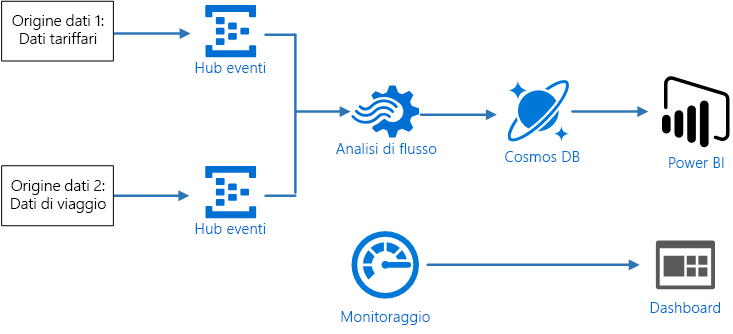
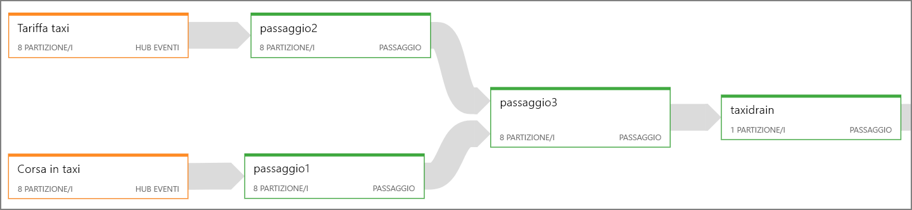
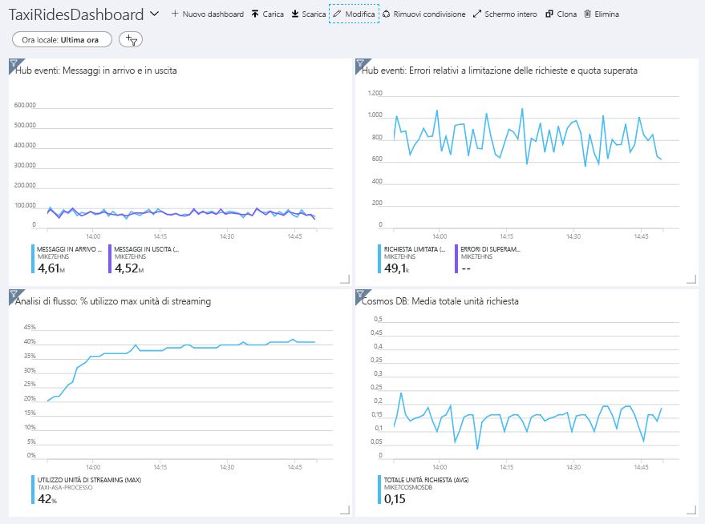
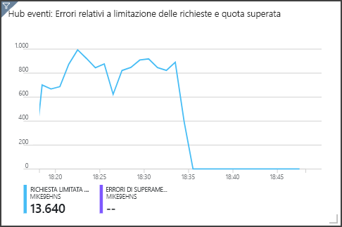

# <a name="stream-processing-with-azure-stream-analytics"></a>Elaborazione di flussi con Analisi di flusso di Azure

Questa architettura di riferimento illustra una pipeline di elaborazione di flussi end-to-end. La pipeline inserisce dati da due origini, esegue la correlazione tra i record nei due flussi e calcola una media mobile in un intervallo di tempo. I risultati vengono archiviati per analisi aggiuntive. [**Distribuire questa soluzione**.](#deploy-the-solution)



**Scenario**: una società di taxi raccoglie dati su ogni corsa. Per questo scenario si presuppone che siano presenti due dispositivi diversi che inviano dati. Il taxi ha un tassametro che invia informazioni su ogni corsa &mdash; la durata, la distanza e le ubicazioni di salita e di discesa del cliente. Un dispositivo separato accetta i pagamenti dai clienti e invia dati sui prezzi delle corse. La società di taxi vuole calcolare la mancia media per miglia guidate, in tempo reale, per individuare le tendenze.

## <a name="architecture"></a>Architettura

L'architettura è costituita dai componenti seguenti.

**Origini dati**. In questa architettura sono presenti due origini dati che generano flussi di dati in tempo reale. Il primo flusso contiene le informazioni sulla corsa e il secondo contiene le informazioni sui costi delle corse. L'architettura di riferimento include un generatore di dati simulato che legge dati da un set di file statici ed esegue il push dei dati in Hub eventi. In un'applicazione reale le origini dati corrisponderebbero a dispositivi installati nei taxi.

**Hub eventi di Azure**. [Hub eventi](/azure/event-hubs/) è un servizio di inserimento di eventi. Questa architettura usa due istanze di Hub eventi, una per ogni origine dati. Ogni origine dati invia un flusso di dati all'istanza associata di Hub eventi.

**Analisi di flusso di Azure**. [Analisi di flusso](/azure/stream-analytics/) è un motore di elaborazione di eventi. Un processo di Analisi di flusso legge i flussi di dati dalle due istanze di Hub eventi ed esegue l'elaborazione dei flussi.

**Cosmos DB**. L'output dal processo di Analisi di flusso è una serie di record, scritti sotto forma di documento JSON in un database di documenti di Cosmos DB.

**Microsoft Power BI**. Power BI è una suite di strumenti di analisi aziendale che consente di analizzare dati e condividere informazioni dettagliate. In questa architettura carica i dati da Cosmos DB. Ciò consente agli utenti di analizzare il set completo di dati cronologici raccolti. È anche possibile trasmettere i risultati direttamente da Analisi di flusso a Power BI per una visualizzazione in tempo reale dei dati. Per altre informazioni, vedere [Streaming in tempo reale in Power BI](/power-bi/service-real-time-streaming).

**Monitoraggio di Azure**. [Monitoraggio di Azure](/azure/monitoring-and-diagnostics/) raccoglie le metriche relative alla prestazioni dei servizi di Azure distribuiti nella soluzione. La visualizzazione delle metriche in un dashboard consente di ottenere informazioni dettagliate sull'integrità della soluzione. 

## <a name="data-ingestion"></a>Inserimento di dati

Per simulare un'origine dati, questa architettura di riferimento usa il set di dati [New York City Taxi Data](https://uofi.app.box.com/v/NYCtaxidata/folder/2332218797) <sup>[[1]](#note1)</sup>. Questo set di dati contiene dati relativi alle corse dei taxi a New York City in un periodo di 4 anni (2010 &ndash; 2013). Contiene due tipi di record: i dati relativi alle corse e i dati relativi ai costi delle corse. I dati relativi alle corsa includono la durata della corsa, la distanza percorsa e le ubicazioni di salita e discesa del cliente. I dati relativi ai costi della corsa includono gli importi relativi a costo di base, imposte e mancia. I campi comuni in entrambi i tipi di record includono il numero di taxi, il numero di licenza e l'ID del fornitore. Questi tre campi identificano in modo univoco un taxi e un tassista. I dati vengono archiviati in formato CSV. 

Il generatore di dati è un'applicazione .NET Core che legge i record e li invia a Hub eventi di Azure. Il generatore invia i dati relativi alle corse in formato JSON e i dati relativi ai costi in formato CSV. 

Hub eventi usa [partizioni](/azure/event-hubs/event-hubs-features#partitions) per segmentare i dati. Le partizioni consentono a un consumer di leggere ogni partizione in parallelo. Quando si inviano dati a Hub eventi, è possibile specificare in modo esplicito la chiave di partizione. In caso contrario, i record vengono assegnati alle partizioni in modalità round-robin. 

In questo scenario specifico i dati relativi alle corse e i dati relativi ai costi devono avere lo stesso ID di partizione per un taxi specifico. Ciò consente ad Analisi di flusso di applicare un certo livello di parallelismo durante la correlazione dei due flussi. Un record nella partizione *n* dei dati relativi alle corse corrisponderà a un record nella partizione *n* dei dati relativi ai costi.


Nel generatore di dati il modello di dati comune per entrambi i tipi di record ha una proprietà `PartitionKey` che corrisponde alla concatenazione di `Medallion`, `HackLicense` e `VendorId`.

```csharp
public abstract class TaxiData
{
    public TaxiData()
    {
    }

    [JsonProperty]
    public long Medallion { get; set; }

    [JsonProperty]
    public long HackLicense { get; set; }

    [JsonProperty]
    public string VendorId { get; set; }

    [JsonProperty]
    public DateTimeOffset PickupTime { get; set; }

    [JsonIgnore]
    public string PartitionKey
    {
        get => $"{Medallion}_{HackLicense}_{VendorId}";
    }
```

Questa proprietà viene usata per fornire una chiave di partizione esplicita durante l'invio a Hub eventi:

```csharp
using (var client = pool.GetObject())
{
    return client.Value.SendAsync(new EventData(Encoding.UTF8.GetBytes(
        t.GetData(dataFormat))), t.PartitionKey);
}
```

## <a name="stream-processing"></a>Elaborazione del flusso

Il processo di elaborazione del flusso viene definito tramite una query SQL con alcuni passaggi distinti. I primi due passaggi consentono semplicemente di selezionare record dai due flussi di input.

```sql
WITH
Step1 AS (
    SELECT PartitionId,
           TRY_CAST(Medallion AS nvarchar(max)) AS Medallion,
           TRY_CAST(HackLicense AS nvarchar(max)) AS HackLicense,
           VendorId,
           TRY_CAST(PickupTime AS datetime) AS PickupTime,
           TripDistanceInMiles
    FROM [TaxiRide] PARTITION BY PartitionId
),
Step2 AS (
    SELECT PartitionId,
           medallion AS Medallion,
           hack_license AS HackLicense,
           vendor_id AS VendorId,
           TRY_CAST(pickup_datetime AS datetime) AS PickupTime,
           tip_amount AS TipAmount
    FROM [TaxiFare] PARTITION BY PartitionId
),
```

Il passaggio successivo crea un join tra i due flussi di input per selezionare i record corrispondenti da ogni flusso.

```sql
Step3 AS (
  SELECT
         tr.Medallion,
         tr.HackLicense,
         tr.VendorId,
         tr.PickupTime,
         tr.TripDistanceInMiles,
         tf.TipAmount
    FROM [Step1] tr
    PARTITION BY PartitionId
    JOIN [Step2] tf PARTITION BY PartitionId
      ON tr.Medallion = tf.Medallion
     AND tr.HackLicense = tf.HackLicense
     AND tr.VendorId = tf.VendorId
     AND tr.PickupTime = tf.PickupTime
     AND tr.PartitionId = tf.PartitionId
     AND DATEDIFF(minute, tr, tf) BETWEEN 0 AND 15
)
```

Questa query crea join dei record in un set di campi che identificano in modo univoco i record corrispondenti (Medallion, HackLicense, VendorId e PickupTime). L'istruzione `JOIN` include anche l'ID partizione. Come indicato, viene sfruttato il vantaggio costituito dal fatto che i record corrispondenti hanno sempre lo stesso ID partizione in questo scenario.

In Analisi di flusso i join sono *temporali*, ovvero viene creato un join dei record entro un intervallo di tempo specifico. In caso contrario è possibile che il processo rimanga in attesa di una corrispondenza per un periodo illimitato. La funzione [DATEDIFF](https://msdn.microsoft.com/azure/stream-analytics/reference/join-azure-stream-analytics) specifica la distanza temporale massima consentita tra due record corrispondenti per permettere l'individuazione di una corrispondenza. 

L'ultimo passaggio del processo calcola la mancia media per miglio, con un raggruppamento basato su una finestra di salto di 5 minuti.

```sql
SELECT System.Timestamp AS WindowTime,
       SUM(tr.TipAmount) / SUM(tr.TripDistanceInMiles) AS AverageTipPerMile
  INTO [TaxiDrain]
  FROM [Step3] tr
  GROUP BY HoppingWindow(Duration(minute, 5), Hop(minute, 1))
```

Analisi di flusso offre diverse [funzioni finestra](/azure/stream-analytics/stream-analytics-window-functions). Una finestra di salto si sposta in avanti nel tempo in base a un periodo fisso, in questo caso 1 minute per hop. Il risultato consiste nel calcolare una media mobile negli ultimi 5 minuti.

Nell'architettura mostrata qui vengono salvati in Cosmos DB solo i risultati del processo di Analisi di flusso. Per uno scenario di Big Data, prendere in considerazione anche l'uso di [Acquisizione di Hub eventi di Azure](/azure/event-hubs/event-hubs-capture-overview) per salvare i dati non elaborati degli eventi nell'archivio BLOB di Azure. La conservazione dei dati non elaborati consentirà di eseguire query in batch sui dati cronologici in un momento successivo per ottenere nuove informazioni dettagliate dai dati.

## <a name="scalability-considerations"></a>Considerazioni sulla scalabilità

### <a name="event-hubs"></a>Hub eventi

La capacità di elaborazione di Hub eventi viene misurata in [unità elaborate](/azure/event-hubs/event-hubs-features#throughput-units). È possibile ridimensionare automaticamente un hub eventi abilitando l'[aumento automatico](/azure/event-hubs/event-hubs-auto-inflate), che ridimensiona automaticamente le unità elaborate in base al traffico, fino a un limite massimo configurato. 

### <a name="stream-analytics"></a>Analisi di flusso

Per Analisi di flusso le risorse di calcolo allocate a un processo vengono misurate in unità di streaming. I processi di Analisi di flusso vengono ridimensionati in modo ottimale se è possibile eseguire il processo in parallelo. In questo modo Analisi di flusso può distribuire il processo tra più nodi di calcolo.

Per l'input di Hub eventi è possibile usare la parola chiave `PARTITION BY` per partizionare il processo di Analisi di flusso. I dati verranno suddivisi in subset in base alle partizioni di Hub eventi. 

Le funzioni finestra e i join temporali richiedono unità di streaming aggiuntive. Quando possibile, usare `PARTITION BY` in modo che ogni partizione venga elaborata separatamente. Per altre informazioni, vedere [Informazioni e modifica delle unità di streaming](/azure/stream-analytics/stream-analytics-streaming-unit-consumption#windowed-aggregates).

Se non è possibile eseguire in parallelo l'intero processo di Analisi di flusso, provare a suddividere il processo in più passaggi, a partire da uno o più passaggi paralleli. In questo modo è possibile eseguire in parallelo i primi passaggi. In questa architettura di riferimento, ad esempio:

- I passaggi 1 e 2 sono semplici istruzioni `SELECT` che selezionano record entro una singola partizione. 
- Il passaggio 3 crea un join partizionato tra due flussi di input. Questo passaggio sfrutta il fatto che i record corrispondenti condividono la stessa chiave di partizione e quindi hanno sicuramente lo stesso ID partizione in ogni flusso di input.
- Il passaggio 4 esegue l'aggregazione in tutte le partizioni. Questo passaggio non può essere eseguito in parallelo.

È possibile usare il [diagramma del processo](/azure/stream-analytics/stream-analytics-job-diagram-with-metrics) di Analisi di flusso per visualizzare il numero di partizioni assegnate a ogni passaggio nel processo. Il diagramma seguente mostra il diagramma del processo per questa architettura di riferimento:



### <a name="cosmos-db"></a>Cosmos DB

La capacità di elaborazione per Cosmos DB viene misurata in [unità richiesta](/azure/cosmos-db/request-units) (UR). Per ridimensionare un contenitore Cosmos DB fino a un valore superiore a 10.000 UR, è necessario specificare una [chiave di partizione](/azure/cosmos-db/partition-data) quando si crea il contenitore e includere la chiave di partizione in ogni documento. 

In questa architettura di riferimento vengono creati nuovi documenti solo una volta al minuto (intervallo della finestra di salto), quindi i requisiti per la velocità effettiva sono abbastanza bassi. Per questo motivo non è necessario una chiave di partizione in questo scenario.

## <a name="monitoring-considerations"></a>Considerazioni sul monitoraggio

Con qualsiasi soluzione di elaborazione di flussi è importante monitorare le prestazioni e l'integrità del sistema. [Monitoraggio di Azure](/azure/monitoring-and-diagnostics/) raccoglie le metriche e i log di diagnostica per i servizi di Azure usati nell'architettura. Monitoraggio di Azure è incorporato nella piattaforma Azure e non richiede codice aggiuntivo nell'applicazione.

I segnali di avviso seguenti indicano che è necessario aumentare il numero di risorse di Azure rilevanti:

- Hub eventi limita le richieste o è vicino alla quota giornaliera di messaggi.
- Il processo di Analisi di flusso usa più dell'80% di unità di streaming allocate.
- Cosmos DB inizia a limitare le richieste.

L'architettura di riferimento include un dashboard personalizzato, che viene distribuito nel portale di Azure. Dopo la distribuzione dell'architettura è possibile visualizzare il dashboard aprendo il [portale di Azure](https://portal.azure.com) e selezionando `TaxiRidesDashboard` dal'elenco di dashboard. Per altre informazioni sulla creazione e la distribuzione di dashboard personalizzati nel portale di Azure, vedere [Creare dashboard di Azure a livello di codice](/azure/azure-portal/azure-portal-dashboards-create-programmatically).

L'immagine seguente mostra il dashboard dopo l'esecuzione di Analisi di flusso per circa un'ora.



Il pannello in basso a sinistra mostra l'incremento dell'utilizzo di unità di streaming per il processo di Analisi di flusso durante i primi 15 minuti e quindi la stabilizzazione del valore. Questo è uno schema tipico quando il processo raggiunge uno stato stabile. 

Si noti che Hub eventi limita le richieste, come mostrato nel pannello in alto a destra. Una richiesta limitata occasionalmente non costituisce un problema, perché l'SDK del client di Hub eventi esegue automaticamente nuovi tentativi quando riceve un errore di limitazione. Se tuttavia vengono visualizzati errori di limitazione continui, Hub eventi necessita di altre unità elaborate. Il grafico seguente mostra un'esecuzione dei test che usa la funzionalità di aumento automatico di Hub eventi, che aumenta automaticamente le unità elaborate in base alla necessità. 



L'aumento automatico è stato abilitato in corrispondenza del contrassegno 06:35. È possibile notare il calo nelle richieste limitate, perché Hub eventi ha eseguito il ridimensionamento automatico fino a 3 unità elaborate.

È interessante notare che ciò comporta l'effetto collaterale dell'incremento dell'utilizzo di unità di streaming nel processo di Analisi di flusso. La limitazione consente a Hub eventi di ridurre in modo artificiale la frequenza di inserimento per il processo di Analisi di flusso. La risoluzione di un collo di bottiglia delle prestazioni rivela spesso un altro collo di bottiglia. In questo caso l'allocazione di unità di streaming aggiuntive per il processo di Analisi di flusso ha consentito di risolvere il problema.

## <a name="deploy-the-solution"></a>Distribuire la soluzione

Una distribuzione di questa architettura di riferimento è disponibile in [GitHub](https://github.com/mspnp/reference-architectures/tree/master/data). 

### <a name="prerequisites"></a>Prerequisiti

1. Clonare, creare una copia tramite fork o scaricare il file ZIP per il repository GitHub delle [architetture di riferimento](https://github.com/mspnp/reference-architectures).

2. Installare [Docker](https://www.docker.com/) per eseguire il generatore di dati.

3. Installare l'[interfaccia della riga di comando di Azure 2.0](/cli/azure/install-azure-cli?view=azure-cli-latest).

4. Al prompt dei comandi, di Bash o di PowerShell accedere all'account Azure come illustrato di seguito:

    ```
    az login
    ```

### <a name="download-the-source-data-files"></a>Scaricare i file di dati di origine

1. Creare una directory denominata `DataFile` nella directory `data/streaming_asa` nel repository di GitHub.

2. Aprire un Web browser e passare a https://uofi.app.box.com/v/NYCtaxidata/folder/2332219935.

3. Fare clic sul pulsante **Download** in questa pagina per scaricare un file ZIP di tutti i dati relativi ai taxi per tale anno.

4. Estrarre il file ZIP nella directory `DataFile`.

    > [!NOTE]
    > Questo file ZIP contiene altri file ZIP. Non estrarre i file ZIP figlio.

La struttura della directory deve avere un aspetto simile al seguente:

```
/data
    /streaming_asa
        /DataFile
            /FOIL2013
                trip_data_1.zip
                trip_data_2.zip
                trip_data_3.zip
                ...
```

### <a name="deploy-the-azure-resources"></a>Distribuire le risorse di Azure

1. Da una shell o dal prompt dei comandi di Windows eseguire il comando seguente e attenersi alla richiesta di accesso:

    ```bash
    az login
    ```

2. Passare alla cartella `data/streaming_asa` nel repository di GitHub

    ```bash
    cd data/streaming_asa
    ```

2. Eseguire questi comandi per distribuire le risorse di Azure:

    ```bash
    export resourceGroup='[Resource group name]'
    export resourceLocation='[Location]'
    export cosmosDatabaseAccount='[Cosmos DB account name]'
    export cosmosDatabase='[Cosmod DB database name]'
    export cosmosDataBaseCollection='[Cosmos DB collection name]'
    export eventHubNamespace='[Event Hubs namespace name]'

    # Create a resource group
    az group create --name $resourceGroup --location $resourceLocation

    # Deploy resources
    az group deployment create --resource-group $resourceGroup \
      --template-file ./azure/deployresources.json --parameters \
      eventHubNamespace=$eventHubNamespace \
      outputCosmosDatabaseAccount=$cosmosDatabaseAccount \
      outputCosmosDatabase=$cosmosDatabase \
      outputCosmosDatabaseCollection=$cosmosDataBaseCollection

    # Create a database 
    az cosmosdb database create --name $cosmosDatabaseAccount \
        --db-name $cosmosDatabase --resource-group $resourceGroup

    # Create a collection
    az cosmosdb collection create --collection-name $cosmosDataBaseCollection \
        --name $cosmosDatabaseAccount --db-name $cosmosDatabase \
        --resource-group $resourceGroup
    ```

3. Nel portale di Azure passare al gruppo di risorse creato.

4. Aprire il pannello per il processo di Analisi di flusso.

5. Fare clic su **Avvia** per avviare il processo. Selezionare **Adesso** come ora di inizio dell'output. Attendere l'avvio del processo.

### <a name="run-the-data-generator"></a>Eseguire il generatore di dati

1. Ottenere le stringhe di connessione di Hub eventi. È possibile ottenere tali valori dal portale di Azure o eseguendo questi comandi dell'interfaccia della riga di comando:

    ```bash
    # RIDE_EVENT_HUB
    az eventhubs eventhub authorization-rule keys list \
        --eventhub-name taxi-ride \
        --name taxi-ride-asa-access-policy \
        --namespace-name $eventHubNamespace \
        --resource-group $resourceGroup \
        --query primaryConnectionString

    # FARE_EVENT_HUB
    az eventhubs eventhub authorization-rule keys list \
        --eventhub-name taxi-fare \
        --name taxi-fare-asa-access-policy \
        --namespace-name $eventHubNamespace \
        --resource-group $resourceGroup \
        --query primaryConnectionString
    ```

2. Passare alla directory `data/streaming_asa/onprem` nel repository di GitHub

3. Aggiornare i valori nel file `main.env` come indicato di seguito:

    ```
    RIDE_EVENT_HUB=[Connection string for taxi-ride event hub]
    FARE_EVENT_HUB=[Connection string for taxi-fare event hub]
    RIDE_DATA_FILE_PATH=/DataFile/FOIL2013
    MINUTES_TO_LEAD=0
    PUSH_RIDE_DATA_FIRST=false
    ```

4. Eseguire questo comando per creare l'immagine Docker.

    ```bash
    docker build --no-cache -t dataloader .
    ```

5. Tornare alla directory padre, `data/stream_asa`.

    ```bash
    cd ..
    ```

6. Eseguire questo comando per eseguire l'immagine Docker.

    ```bash
    docker run -v `pwd`/DataFile:/DataFile --env-file=onprem/main.env dataloader:latest
    ```

L'output sarà simile al seguente:

```
Created 10000 records for TaxiFare
Created 10000 records for TaxiRide
Created 20000 records for TaxiFare
Created 20000 records for TaxiRide
Created 30000 records for TaxiFare
...
```

Lasciare che il programma venga eseguito per almeno 5 minuti, ovvero la finestra definita nella query di Analisi di flusso. Per verificare che il processo di Analisi di flusso venga eseguito in modo corretto, aprire il portale di Azure e passare al database di Cosmos DB. Aprire il pannello **Esplora dati** e visualizzare i documenti. 

[1] <span id="note1">Donovan, Brian; Work, Dan (2016): New York City Taxi Trip Data (2010-2013). University of Illinois at Urbana-Champaign. https://doi.org/10.13012/J8PN93H8
