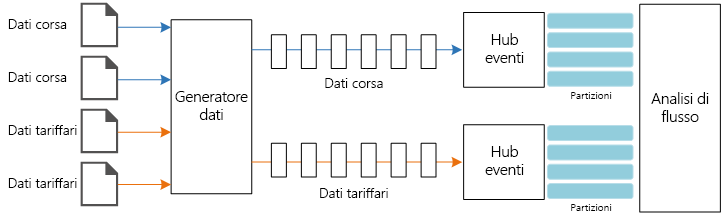

# <a name="stream-processing-with-azure-stream-analytics"></a><span data-ttu-id="fe269-103">Elaborazione di flussi con Analisi di flusso di Azure</span><span class="sxs-lookup"><span data-stu-id="fe269-103">Stream processing with Azure Stream Analytics</span></span>

<span data-ttu-id="fe269-104">Questa architettura di riferimento illustra una pipeline di elaborazione di flussi end-to-end.</span><span class="sxs-lookup"><span data-stu-id="fe269-104">This reference architecture shows an end-to-end stream processing pipeline.</span></span> <span data-ttu-id="fe269-105">La pipeline inserisce dati da due origini, esegue la correlazione tra i record nei due flussi e calcola una media mobile in un intervallo di tempo.</span><span class="sxs-lookup"><span data-stu-id="fe269-105">The pipeline ingests data from two sources, correlates records in the two streams, and calculates a rolling average across a time window.</span></span> <span data-ttu-id="fe269-106">I risultati vengono archiviati per analisi aggiuntive.</span><span class="sxs-lookup"><span data-stu-id="fe269-106">The results are stored for further analysis.</span></span> [<span data-ttu-id="fe269-107">**Distribuire questa soluzione**.</span><span class="sxs-lookup"><span data-stu-id="fe269-107">**Deploy this solution**.</span></span>](#deploy-the-solution)


<span data-ttu-id="fe269-108">**Scenario**: una società di taxi raccoglie dati su ogni corsa.</span><span class="sxs-lookup"><span data-stu-id="fe269-108">**Scenario**: A taxi company collects data about each taxi trip.</span></span> <span data-ttu-id="fe269-109">Per questo scenario si presuppone che siano presenti due dispositivi diversi che inviano dati.</span><span class="sxs-lookup"><span data-stu-id="fe269-109">For this scenario, we assume there are two separate devices sending data.</span></span> <span data-ttu-id="fe269-110">Il taxi ha un tassametro che invia informazioni su ogni corsa &mdash; la durata, la distanza e le ubicazioni di salita e di discesa del cliente.</span><span class="sxs-lookup"><span data-stu-id="fe269-110">The taxi has a meter that sends information about each ride &mdash; the duration, distance, and pickup and dropoff locations.</span></span> <span data-ttu-id="fe269-111">Un dispositivo separato accetta i pagamenti dai clienti e invia dati sui prezzi delle corse.</span><span class="sxs-lookup"><span data-stu-id="fe269-111">A separate device accepts payments from customers and sends data about fares.</span></span> <span data-ttu-id="fe269-112">La società di taxi vuole calcolare la mancia media per miglia guidate, in tempo reale, per individuare le tendenze.</span><span class="sxs-lookup"><span data-stu-id="fe269-112">The taxi company wants to calculate the average tip per mile driven, in real time, in order to spot trends.</span></span>

## <a name="architecture"></a><span data-ttu-id="fe269-113">Architettura</span><span class="sxs-lookup"><span data-stu-id="fe269-113">Architecture</span></span>

<span data-ttu-id="fe269-114">L'architettura è costituita dai componenti seguenti.</span><span class="sxs-lookup"><span data-stu-id="fe269-114">The architecture consists of the following components.</span></span>

<span data-ttu-id="fe269-115">**Origini dati**.</span><span class="sxs-lookup"><span data-stu-id="fe269-115">**Data sources**.</span></span> <span data-ttu-id="fe269-116">In questa architettura sono presenti due origini dati che generano flussi di dati in tempo reale.</span><span class="sxs-lookup"><span data-stu-id="fe269-116">In this architecture, there are two data sources that generate data streams in real time.</span></span> <span data-ttu-id="fe269-117">Il primo flusso contiene le informazioni sulla corsa e il secondo contiene le informazioni sui costi delle corse.</span><span class="sxs-lookup"><span data-stu-id="fe269-117">The first stream contains ride information, and the second contains fare information.</span></span> <span data-ttu-id="fe269-118">L'architettura di riferimento include un generatore di dati simulato che legge dati da un set di file statici ed esegue il push dei dati in Hub eventi.</span><span class="sxs-lookup"><span data-stu-id="fe269-118">The reference architecture includes a simulated data generator that reads from a set of static files and pushes the data to Event Hubs.</span></span> <span data-ttu-id="fe269-119">In un'applicazione reale le origini dati corrisponderebbero a dispositivi installati nei taxi.</span><span class="sxs-lookup"><span data-stu-id="fe269-119">In a real application, the data sources would be devices installed in the taxi cabs.</span></span>

<span data-ttu-id="fe269-120">**Hub eventi di Azure**.</span><span class="sxs-lookup"><span data-stu-id="fe269-120">**Azure Event Hubs**.</span></span> <span data-ttu-id="fe269-121">[Hub eventi](/azure/event-hubs/) è un servizio di inserimento di eventi.</span><span class="sxs-lookup"><span data-stu-id="fe269-121">[Event Hubs](/azure/event-hubs/) is an event ingestion service.</span></span> <span data-ttu-id="fe269-122">Questa architettura usa due istanze di Hub eventi, una per ogni origine dati.</span><span class="sxs-lookup"><span data-stu-id="fe269-122">This architecture uses two event hub instances, one for each data source.</span></span> <span data-ttu-id="fe269-123">Ogni origine dati invia un flusso di dati all'istanza associata di Hub eventi.</span><span class="sxs-lookup"><span data-stu-id="fe269-123">Each data source sends a stream of data to the associated event hub.</span></span>

<span data-ttu-id="fe269-124">**Analisi di flusso di Azure**.</span><span class="sxs-lookup"><span data-stu-id="fe269-124">**Azure Stream Analytics**.</span></span> <span data-ttu-id="fe269-125">[Analisi di flusso](/azure/stream-analytics/) è un motore di elaborazione di eventi.</span><span class="sxs-lookup"><span data-stu-id="fe269-125">[Stream Analytics](/azure/stream-analytics/) is an event-processing engine.</span></span> <span data-ttu-id="fe269-126">Un processo di Analisi di flusso legge i flussi di dati dalle due istanze di Hub eventi ed esegue l'elaborazione dei flussi.</span><span class="sxs-lookup"><span data-stu-id="fe269-126">A Stream Analytics job reads the data streams from the two event hubs and performs stream processing.</span></span>

<span data-ttu-id="fe269-127">**Cosmos DB**.</span><span class="sxs-lookup"><span data-stu-id="fe269-127">**Cosmos DB**.</span></span> <span data-ttu-id="fe269-128">L'output dal processo di Analisi di flusso è una serie di record, scritti sotto forma di documento JSON in un database di documenti di Cosmos DB.</span><span class="sxs-lookup"><span data-stu-id="fe269-128">The output from the Stream Analytics job is a series of records, which are written as JSON documents to a Cosmos DB document database.</span></span>

<span data-ttu-id="fe269-129">**Microsoft Power BI**.</span><span class="sxs-lookup"><span data-stu-id="fe269-129">**Microsoft Power BI**.</span></span> <span data-ttu-id="fe269-130">Power BI è una suite di strumenti di analisi aziendale che consente di analizzare dati e condividere informazioni dettagliate.</span><span class="sxs-lookup"><span data-stu-id="fe269-130">Power BI is a suite of business analytics tools to analyze data for business insights.</span></span> <span data-ttu-id="fe269-131">In questa architettura carica i dati da Cosmos DB.</span><span class="sxs-lookup"><span data-stu-id="fe269-131">In this architecture, it loads the data from Cosmos DB.</span></span> <span data-ttu-id="fe269-132">Ciò consente agli utenti di analizzare il set completo di dati cronologici raccolti.</span><span class="sxs-lookup"><span data-stu-id="fe269-132">This allows users to analyze the complete set of historical data that's been collected.</span></span> <span data-ttu-id="fe269-133">È anche possibile trasmettere i risultati direttamente da Analisi di flusso a Power BI per una visualizzazione in tempo reale dei dati.</span><span class="sxs-lookup"><span data-stu-id="fe269-133">You could also stream the results directly from Stream Analytics to Power BI for a real-time view of the data.</span></span> <span data-ttu-id="fe269-134">Per altre informazioni, vedere [Streaming in tempo reale in Power BI](/power-bi/service-real-time-streaming).</span><span class="sxs-lookup"><span data-stu-id="fe269-134">For more information, see [Real-time streaming in Power BI](/power-bi/service-real-time-streaming).</span></span>

<span data-ttu-id="fe269-135">**Monitoraggio di Azure**.</span><span class="sxs-lookup"><span data-stu-id="fe269-135">**Azure Monitor**.</span></span> <span data-ttu-id="fe269-136">[Monitoraggio di Azure](/azure/monitoring-and-diagnostics/) raccoglie le metriche relative alla prestazioni dei servizi di Azure distribuiti nella soluzione.</span><span class="sxs-lookup"><span data-stu-id="fe269-136">[Azure Monitor](/azure/monitoring-and-diagnostics/) collects performance metrics about the Azure services deployed in the solution.</span></span> <span data-ttu-id="fe269-137">La visualizzazione delle metriche in un dashboard consente di ottenere informazioni dettagliate sull'integrità della soluzione.</span><span class="sxs-lookup"><span data-stu-id="fe269-137">By visualizing these in a dashboard, you can get insights into the health of the solution.</span></span> 

## <a name="data-ingestion"></a><span data-ttu-id="fe269-138">Inserimento di dati</span><span class="sxs-lookup"><span data-stu-id="fe269-138">Data ingestion</span></span>

<span data-ttu-id="fe269-139">Per simulare un'origine dati, questa architettura di riferimento usa il set di dati [New York City Taxi Data](https://uofi.app.box.com/v/NYCtaxidata/folder/2332218797) <sup>[[1]](#note1)</sup>.</span><span class="sxs-lookup"><span data-stu-id="fe269-139">To simulate a data source, this reference architecture uses the [New York City Taxi Data](https://uofi.app.box.com/v/NYCtaxidata/folder/2332218797) dataset<sup>[[1]](#note1)</sup>.</span></span> <span data-ttu-id="fe269-140">Questo set di dati contiene dati relativi alle corse dei taxi a New York City in un periodo di 4 anni (2010 &ndash; 2013).</span><span class="sxs-lookup"><span data-stu-id="fe269-140">This dataset contains data about taxi trips in New York City over a 4-year period (2010 &ndash; 2013).</span></span> <span data-ttu-id="fe269-141">Contiene due tipi di record: i dati relativi alle corse e i dati relativi ai costi delle corse.</span><span class="sxs-lookup"><span data-stu-id="fe269-141">It contains two types of record: Ride data and fare data.</span></span> <span data-ttu-id="fe269-142">I dati relativi alle corsa includono la durata della corsa, la distanza percorsa e le ubicazioni di salita e discesa del cliente.</span><span class="sxs-lookup"><span data-stu-id="fe269-142">Ride data includes trip duration, trip distance, and pickup and dropoff location.</span></span> <span data-ttu-id="fe269-143">I dati relativi ai costi della corsa includono gli importi relativi a costo di base, imposte e mancia.</span><span class="sxs-lookup"><span data-stu-id="fe269-143">Fare data includes fare, tax, and tip amounts.</span></span> <span data-ttu-id="fe269-144">I campi comuni in entrambi i tipi di record includono il numero di taxi, il numero di licenza e l'ID del fornitore.</span><span class="sxs-lookup"><span data-stu-id="fe269-144">Common fields in both record types include medallion number, hack license, and vendor ID.</span></span> <span data-ttu-id="fe269-145">Questi tre campi identificano in modo univoco un taxi e un tassista.</span><span class="sxs-lookup"><span data-stu-id="fe269-145">Together these three fields uniquely identify a taxi plus a driver.</span></span> <span data-ttu-id="fe269-146">I dati vengono archiviati in formato CSV.</span><span class="sxs-lookup"><span data-stu-id="fe269-146">The data is stored in CSV format.</span></span> 

<span data-ttu-id="fe269-147">Il generatore di dati è un'applicazione .NET Core che legge i record e li invia a Hub eventi di Azure.</span><span class="sxs-lookup"><span data-stu-id="fe269-147">The data generator is a .NET Core application that reads the records and sends them to Azure Event Hubs.</span></span> <span data-ttu-id="fe269-148">Il generatore invia i dati relativi alle corse in formato JSON e i dati relativi ai costi in formato CSV.</span><span class="sxs-lookup"><span data-stu-id="fe269-148">The generator sends ride data in JSON format and fare data in CSV format.</span></span> 

<span data-ttu-id="fe269-149">Hub eventi usa [partizioni](/azure/event-hubs/event-hubs-features#partitions) per segmentare i dati.</span><span class="sxs-lookup"><span data-stu-id="fe269-149">Event Hubs uses [partitions](/azure/event-hubs/event-hubs-features#partitions) to segment the data.</span></span> <span data-ttu-id="fe269-150">Le partizioni consentono a un consumer di leggere ogni partizione in parallelo.</span><span class="sxs-lookup"><span data-stu-id="fe269-150">Partitions allow a consumer to read each partition in parallel.</span></span> <span data-ttu-id="fe269-151">Quando si inviano dati a Hub eventi, è possibile specificare in modo esplicito la chiave di partizione.</span><span class="sxs-lookup"><span data-stu-id="fe269-151">When you send data to Event Hubs, you can specify the partition key explicitly.</span></span> <span data-ttu-id="fe269-152">In caso contrario, i record vengono assegnati alle partizioni in modalità round-robin.</span><span class="sxs-lookup"><span data-stu-id="fe269-152">Otherwise, records are assigned to partitions in round-robin fashion.</span></span> 

<span data-ttu-id="fe269-153">In questo scenario specifico i dati relativi alle corse e i dati relativi ai costi devono avere lo stesso ID di partizione per un taxi specifico.</span><span class="sxs-lookup"><span data-stu-id="fe269-153">In this particular scenario, ride data and fare data should end up with the same partition ID for a given taxi cab.</span></span> <span data-ttu-id="fe269-154">Ciò consente ad Analisi di flusso di applicare un certo livello di parallelismo durante la correlazione dei due flussi.</span><span class="sxs-lookup"><span data-stu-id="fe269-154">This enables Stream Analytics to apply a degree of parallelism when it correlates the two streams.</span></span> <span data-ttu-id="fe269-155">Un record nella partizione *n* dei dati relativi alle corse corrisponderà a un record nella partizione *n* dei dati relativi ai costi.</span><span class="sxs-lookup"><span data-stu-id="fe269-155">A record in partition *n* of the ride data will match a record in partition *n* of the fare data.</span></span>



<span data-ttu-id="fe269-156">Nel generatore di dati il modello di dati comune per entrambi i tipi di record ha una proprietà `PartitionKey` che corrisponde alla concatenazione di `Medallion`, `HackLicense` e `VendorId`.</span><span class="sxs-lookup"><span data-stu-id="fe269-156">In the data generator, the common data model for both record types has a `PartitionKey` property which is the concatenation of `Medallion`, `HackLicense`, and `VendorId`.</span></span>

```csharp
public abstract class TaxiData
{
    public TaxiData()
    {
    }

    [JsonProperty]
    public long Medallion { get; set; }

    [JsonProperty]
    public long HackLicense { get; set; }

    [JsonProperty]
    public string VendorId { get; set; }

    [JsonProperty]
    public DateTimeOffset PickupTime { get; set; }

    [JsonIgnore]
    public string PartitionKey
    {
        get => $"{Medallion}_{HackLicense}_{VendorId}";
    }
```

<span data-ttu-id="fe269-157">Questa proprietà viene usata per fornire una chiave di partizione esplicita durante l'invio a Hub eventi:</span><span class="sxs-lookup"><span data-stu-id="fe269-157">This property is used to provide an explicit partition key when sending to Event Hubs:</span></span>

```csharp
using (var client = pool.GetObject())
{
    return client.Value.SendAsync(new EventData(Encoding.UTF8.GetBytes(
        t.GetData(dataFormat))), t.PartitionKey);
}
```

## <a name="stream-processing"></a><span data-ttu-id="fe269-158">Elaborazione del flusso</span><span class="sxs-lookup"><span data-stu-id="fe269-158">Stream processing</span></span>

<span data-ttu-id="fe269-159">Il processo di elaborazione del flusso viene definito tramite una query SQL con alcuni passaggi distinti.</span><span class="sxs-lookup"><span data-stu-id="fe269-159">The stream processing job is defined using a SQL query with several distinct steps.</span></span> <span data-ttu-id="fe269-160">I primi due passaggi consentono semplicemente di selezionare record dai due flussi di input.</span><span class="sxs-lookup"><span data-stu-id="fe269-160">The first two steps simply select records from the two input streams.</span></span>

```sql
WITH
Step1 AS (
    SELECT PartitionId,
           TRY_CAST(Medallion AS nvarchar(max)) AS Medallion,
           TRY_CAST(HackLicense AS nvarchar(max)) AS HackLicense,
           VendorId,
           TRY_CAST(PickupTime AS datetime) AS PickupTime,
           TripDistanceInMiles
    FROM [TaxiRide] PARTITION BY PartitionId
),
Step2 AS (
    SELECT PartitionId,
           medallion AS Medallion,
           hack_license AS HackLicense,
           vendor_id AS VendorId,
           TRY_CAST(pickup_datetime AS datetime) AS PickupTime,
           tip_amount AS TipAmount
    FROM [TaxiFare] PARTITION BY PartitionId
),
```

<span data-ttu-id="fe269-161">Il passaggio successivo crea un join tra i due flussi di input per selezionare i record corrispondenti da ogni flusso.</span><span class="sxs-lookup"><span data-stu-id="fe269-161">The next step joins the two input streams to select matching records from each stream.</span></span>

```sql
Step3 AS (
  SELECT
         tr.Medallion,
         tr.HackLicense,
         tr.VendorId,
         tr.PickupTime,
         tr.TripDistanceInMiles,
         tf.TipAmount
    FROM [Step1] tr
    PARTITION BY PartitionId
    JOIN [Step2] tf PARTITION BY PartitionId
      ON tr.Medallion = tf.Medallion
     AND tr.HackLicense = tf.HackLicense
     AND tr.VendorId = tf.VendorId
     AND tr.PickupTime = tf.PickupTime
     AND tr.PartitionId = tf.PartitionId
     AND DATEDIFF(minute, tr, tf) BETWEEN 0 AND 15
)
```

<span data-ttu-id="fe269-162">Questa query crea join dei record in un set di campi che identificano in modo univoco i record corrispondenti (Medallion, HackLicense, VendorId e PickupTime).</span><span class="sxs-lookup"><span data-stu-id="fe269-162">This query joins records on a set of fields that uniquely identify matching records (Medallion, HackLicense, VendorId, and PickupTime).</span></span> <span data-ttu-id="fe269-163">L'istruzione `JOIN` include anche l'ID partizione.</span><span class="sxs-lookup"><span data-stu-id="fe269-163">The `JOIN` statement also includes the partition ID.</span></span> <span data-ttu-id="fe269-164">Come indicato, viene sfruttato il vantaggio costituito dal fatto che i record corrispondenti hanno sempre lo stesso ID partizione in questo scenario.</span><span class="sxs-lookup"><span data-stu-id="fe269-164">As mentioned, this takes advantage of the fact that matching records always have the same partition ID in this scenario.</span></span>

<span data-ttu-id="fe269-165">In Analisi di flusso i join sono *temporali*, ovvero viene creato un join dei record entro un intervallo di tempo specifico.</span><span class="sxs-lookup"><span data-stu-id="fe269-165">In Stream Analytics, joins are *temporal*, meaning records are joined within a particular window of time.</span></span> <span data-ttu-id="fe269-166">In caso contrario è possibile che il processo rimanga in attesa di una corrispondenza per un periodo illimitato.</span><span class="sxs-lookup"><span data-stu-id="fe269-166">Otherwise, the job might need to wait indefinitely for a match.</span></span> <span data-ttu-id="fe269-167">La funzione [DATEDIFF](https://msdn.microsoft.com/azure/stream-analytics/reference/join-azure-stream-analytics) specifica la distanza temporale massima consentita tra due record corrispondenti per permettere l'individuazione di una corrispondenza.</span><span class="sxs-lookup"><span data-stu-id="fe269-167">The [DATEDIFF](https://msdn.microsoft.com/azure/stream-analytics/reference/join-azure-stream-analytics) function specifies how far two matching records can be separated in time for a match.</span></span> 

<span data-ttu-id="fe269-168">L'ultimo passaggio del processo calcola la mancia media per miglio, con un raggruppamento basato su una finestra di salto di 5 minuti.</span><span class="sxs-lookup"><span data-stu-id="fe269-168">The last step in the job computes the average tip per mile, grouped by a hopping window of 5 minutes.</span></span>

```sql
SELECT System.Timestamp AS WindowTime,
       SUM(tr.TipAmount) / SUM(tr.TripDistanceInMiles) AS AverageTipPerMile
  INTO [TaxiDrain]
  FROM [Step3] tr
  GROUP BY HoppingWindow(Duration(minute, 5), Hop(minute, 1))
```

<span data-ttu-id="fe269-169">Analisi di flusso offre diverse [funzioni finestra](/azure/stream-analytics/stream-analytics-window-functions).</span><span class="sxs-lookup"><span data-stu-id="fe269-169">Stream Analytics provides several [windowing functions](/azure/stream-analytics/stream-analytics-window-functions).</span></span> <span data-ttu-id="fe269-170">Una finestra di salto si sposta in avanti nel tempo in base a un periodo fisso, in questo caso 1 minute per hop.</span><span class="sxs-lookup"><span data-stu-id="fe269-170">A hopping window moves forward in time by a fixed period, in this case 1 minute per hop.</span></span> <span data-ttu-id="fe269-171">Il risultato consiste nel calcolare una media mobile negli ultimi 5 minuti.</span><span class="sxs-lookup"><span data-stu-id="fe269-171">The result is to calculate a moving average over the past 5 minutes.</span></span>

<span data-ttu-id="fe269-172">Nell'architettura mostrata qui vengono salvati in Cosmos DB solo i risultati del processo di Analisi di flusso.</span><span class="sxs-lookup"><span data-stu-id="fe269-172">In the architecture shown here, only the results of the Stream Analytics job are saved to Cosmos DB.</span></span> <span data-ttu-id="fe269-173">Per uno scenario di Big Data, prendere in considerazione anche l'uso di [Acquisizione di Hub eventi di Azure](/azure/event-hubs/event-hubs-capture-overview) per salvare i dati non elaborati degli eventi nell'archivio BLOB di Azure.</span><span class="sxs-lookup"><span data-stu-id="fe269-173">For a big data scenario, consider also using [Event Hubs Capture](/azure/event-hubs/event-hubs-capture-overview) to save the raw event data into Azure Blob storage.</span></span> <span data-ttu-id="fe269-174">La conservazione dei dati non elaborati consentirà di eseguire query in batch sui dati cronologici in un momento successivo per ottenere nuove informazioni dettagliate dai dati.</span><span class="sxs-lookup"><span data-stu-id="fe269-174">Keeping the raw data will allow you to run batch queries over your historical data at later time, in order to derive new insights from the data.</span></span>

## <a name="scalability-considerations"></a><span data-ttu-id="fe269-175">Considerazioni sulla scalabilità</span><span class="sxs-lookup"><span data-stu-id="fe269-175">Scalability considerations</span></span>

### <a name="event-hubs"></a><span data-ttu-id="fe269-176">Hub eventi</span><span class="sxs-lookup"><span data-stu-id="fe269-176">Event Hubs</span></span>

<span data-ttu-id="fe269-177">La capacità di elaborazione di Hub eventi viene misurata in [unità elaborate](/azure/event-hubs/event-hubs-features#throughput-units).</span><span class="sxs-lookup"><span data-stu-id="fe269-177">The throughput capacity of Event Hubs is measured in [throughput units](/azure/event-hubs/event-hubs-features#throughput-units).</span></span> <span data-ttu-id="fe269-178">È possibile ridimensionare automaticamente un hub eventi abilitando l'[aumento automatico](/azure/event-hubs/event-hubs-auto-inflate), che ridimensiona automaticamente le unità elaborate in base al traffico, fino a un limite massimo configurato.</span><span class="sxs-lookup"><span data-stu-id="fe269-178">You can autoscale an event hub by enabling [auto-inflate](/azure/event-hubs/event-hubs-auto-inflate), which automatically scales the throughput units based on traffic, up to a configured maximum.</span></span> 

### <a name="stream-analytics"></a><span data-ttu-id="fe269-179">Analisi di flusso</span><span class="sxs-lookup"><span data-stu-id="fe269-179">Stream Analytics</span></span>

<span data-ttu-id="fe269-180">Per Analisi di flusso le risorse di calcolo allocate a un processo vengono misurate in unità di streaming.</span><span class="sxs-lookup"><span data-stu-id="fe269-180">For Stream Analytics, the computing resources allocated to a job are measured in Streaming Units.</span></span> <span data-ttu-id="fe269-181">I processi di Analisi di flusso vengono ridimensionati in modo ottimale se è possibile eseguire il processo in parallelo.</span><span class="sxs-lookup"><span data-stu-id="fe269-181">Stream Analytics jobs scale best if the job can be parallelized.</span></span> <span data-ttu-id="fe269-182">In questo modo Analisi di flusso può distribuire il processo tra più nodi di calcolo.</span><span class="sxs-lookup"><span data-stu-id="fe269-182">That way, Stream Analytics can distribute the job across multiple compute nodes.</span></span>

<span data-ttu-id="fe269-183">Per l'input di Hub eventi è possibile usare la parola chiave `PARTITION BY` per partizionare il processo di Analisi di flusso.</span><span class="sxs-lookup"><span data-stu-id="fe269-183">For Event Hubs input, use the `PARTITION BY` keyword to partition the Stream Analytics job.</span></span> <span data-ttu-id="fe269-184">I dati verranno suddivisi in subset in base alle partizioni di Hub eventi.</span><span class="sxs-lookup"><span data-stu-id="fe269-184">The data will be divided into subsets based on the Event Hubs partitions.</span></span> 

<span data-ttu-id="fe269-185">Le funzioni finestra e i join temporali richiedono unità di streaming aggiuntive.</span><span class="sxs-lookup"><span data-stu-id="fe269-185">Windowing functions and temporal joins require additional SU.</span></span> <span data-ttu-id="fe269-186">Quando possibile, usare `PARTITION BY` in modo che ogni partizione venga elaborata separatamente.</span><span class="sxs-lookup"><span data-stu-id="fe269-186">When possible, use `PARTITION BY` so that each partition is processed separately.</span></span> <span data-ttu-id="fe269-187">Per altre informazioni, vedere [Informazioni e modifica delle unità di streaming](/azure/stream-analytics/stream-analytics-streaming-unit-consumption#windowed-aggregates).</span><span class="sxs-lookup"><span data-stu-id="fe269-187">For more information, see [Understand and adjust Streaming Units](/azure/stream-analytics/stream-analytics-streaming-unit-consumption#windowed-aggregates).</span></span>

<span data-ttu-id="fe269-188">Se non è possibile eseguire in parallelo l'intero processo di Analisi di flusso, provare a suddividere il processo in più passaggi, a partire da uno o più passaggi paralleli.</span><span class="sxs-lookup"><span data-stu-id="fe269-188">If it's not possible to parallelize the entire Stream Analytics job, try to break the job into multiple steps, starting with one or more parallel steps.</span></span> <span data-ttu-id="fe269-189">In questo modo è possibile eseguire in parallelo i primi passaggi.</span><span class="sxs-lookup"><span data-stu-id="fe269-189">That way, the first steps can run in parallel.</span></span> <span data-ttu-id="fe269-190">In questa architettura di riferimento, ad esempio:</span><span class="sxs-lookup"><span data-stu-id="fe269-190">For example, in this reference architecture:</span></span>

- <span data-ttu-id="fe269-191">I passaggi 1 e 2 sono semplici istruzioni `SELECT` che selezionano record entro una singola partizione.</span><span class="sxs-lookup"><span data-stu-id="fe269-191">Steps 1 and 2 are simple `SELECT` statements that select records within a single partition.</span></span> 
- <span data-ttu-id="fe269-192">Il passaggio 3 crea un join partizionato tra due flussi di input.</span><span class="sxs-lookup"><span data-stu-id="fe269-192">Step 3 performs a partitioned join across two input streams.</span></span> <span data-ttu-id="fe269-193">Questo passaggio sfrutta il fatto che i record corrispondenti condividono la stessa chiave di partizione e quindi hanno sicuramente lo stesso ID partizione in ogni flusso di input.</span><span class="sxs-lookup"><span data-stu-id="fe269-193">This step takes advantage of the fact that matching records share the same partition key, and so are guaranteed to have the same partition ID in each input stream.</span></span>
- <span data-ttu-id="fe269-194">Il passaggio 4 esegue l'aggregazione in tutte le partizioni.</span><span class="sxs-lookup"><span data-stu-id="fe269-194">Step 4 aggregates across all of the partitions.</span></span> <span data-ttu-id="fe269-195">Questo passaggio non può essere eseguito in parallelo.</span><span class="sxs-lookup"><span data-stu-id="fe269-195">This step cannot be parallelized.</span></span>

<span data-ttu-id="fe269-196">È possibile usare il [diagramma del processo](/azure/stream-analytics/stream-analytics-job-diagram-with-metrics) di Analisi di flusso per visualizzare il numero di partizioni assegnate a ogni passaggio nel processo.</span><span class="sxs-lookup"><span data-stu-id="fe269-196">Use the Stream Analytics [job diagram](/azure/stream-analytics/stream-analytics-job-diagram-with-metrics) to see how many partitions are assigned to each step in the job.</span></span> <span data-ttu-id="fe269-197">Il diagramma seguente mostra il diagramma del processo per questa architettura di riferimento:</span><span class="sxs-lookup"><span data-stu-id="fe269-197">The following diagram shows the job diagram for this reference architecture:</span></span>


### <a name="cosmos-db"></a><span data-ttu-id="fe269-198">Cosmos DB</span><span class="sxs-lookup"><span data-stu-id="fe269-198">Cosmos DB</span></span>

<span data-ttu-id="fe269-199">La capacità di elaborazione per Cosmos DB viene misurata in [unità richiesta](/azure/cosmos-db/request-units) (UR).</span><span class="sxs-lookup"><span data-stu-id="fe269-199">Throughput capacity for Cosmos DB is measured in [Request Units](/azure/cosmos-db/request-units) (RU).</span></span> <span data-ttu-id="fe269-200">Per ridimensionare un contenitore Cosmos DB fino a un valore superiore a 10.000 UR, è necessario specificare una [chiave di partizione](/azure/cosmos-db/partition-data) quando si crea il contenitore e includere la chiave di partizione in ogni documento.</span><span class="sxs-lookup"><span data-stu-id="fe269-200">In order to scale a Cosmos DB container past 10,000 RU, you must specify a [partition key](/azure/cosmos-db/partition-data) when you create the container, and include the partition key in every document.</span></span> 

<span data-ttu-id="fe269-201">In questa architettura di riferimento vengono creati nuovi documenti solo una volta al minuto (intervallo della finestra di salto), quindi i requisiti per la velocità effettiva sono abbastanza bassi.</span><span class="sxs-lookup"><span data-stu-id="fe269-201">In this reference architecture, new documents are created only once per minute (the hopping window interval), so the throughput requirements are quite low.</span></span> <span data-ttu-id="fe269-202">Per questo motivo non è necessario una chiave di partizione in questo scenario.</span><span class="sxs-lookup"><span data-stu-id="fe269-202">For that reason, there's no need to assign a partition key in this scenario.</span></span>

## <a name="monitoring-considerations"></a><span data-ttu-id="fe269-203">Considerazioni sul monitoraggio</span><span class="sxs-lookup"><span data-stu-id="fe269-203">Monitoring considerations</span></span>

<span data-ttu-id="fe269-204">Con qualsiasi soluzione di elaborazione di flussi è importante monitorare le prestazioni e l'integrità del sistema.</span><span class="sxs-lookup"><span data-stu-id="fe269-204">With any stream processing solution, it's important to monitor the performance and health of the system.</span></span> <span data-ttu-id="fe269-205">[Monitoraggio di Azure](/azure/monitoring-and-diagnostics/) raccoglie le metriche e i log di diagnostica per i servizi di Azure usati nell'architettura.</span><span class="sxs-lookup"><span data-stu-id="fe269-205">[Azure Monitor](/azure/monitoring-and-diagnostics/) collects metrics and diagnostics logs for the Azure services used in the architecture.</span></span> <span data-ttu-id="fe269-206">Monitoraggio di Azure è incorporato nella piattaforma Azure e non richiede codice aggiuntivo nell'applicazione.</span><span class="sxs-lookup"><span data-stu-id="fe269-206">Azure Monitor is built into the Azure platform and does not require any additional code in your application.</span></span>

<span data-ttu-id="fe269-207">I segnali di avviso seguenti indicano che è necessario aumentare il numero di risorse di Azure rilevanti:</span><span class="sxs-lookup"><span data-stu-id="fe269-207">Any of the following warning signals indicate that you should scale out the relevant Azure resource:</span></span>

- <span data-ttu-id="fe269-208">Hub eventi limita le richieste o è vicino alla quota giornaliera di messaggi.</span><span class="sxs-lookup"><span data-stu-id="fe269-208">Event Hubs throttles requests or is close to the daily message quota.</span></span>
- <span data-ttu-id="fe269-209">Il processo di Analisi di flusso usa più dell'80% di unità di streaming allocate.</span><span class="sxs-lookup"><span data-stu-id="fe269-209">The Stream Analytics job consistently uses more than 80% of allocated Streaming Units (SU).</span></span>
- <span data-ttu-id="fe269-210">Cosmos DB inizia a limitare le richieste.</span><span class="sxs-lookup"><span data-stu-id="fe269-210">Cosmos DB begins to throttle requests.</span></span>

<span data-ttu-id="fe269-211">L'architettura di riferimento include un dashboard personalizzato, che viene distribuito nel portale di Azure.</span><span class="sxs-lookup"><span data-stu-id="fe269-211">The reference architecture includes a custom dashboard, which is deployed to the Azure portal.</span></span> <span data-ttu-id="fe269-212">Dopo la distribuzione dell'architettura è possibile visualizzare il dashboard aprendo il [portale di Azure](https://portal.azure.com) e selezionando `TaxiRidesDashboard` dal'elenco di dashboard.</span><span class="sxs-lookup"><span data-stu-id="fe269-212">After you deploy the architecture, you can view the dashboard by opening the [Azure Portal](https://portal.azure.com) and selecting `TaxiRidesDashboard` from list of dashboards.</span></span> <span data-ttu-id="fe269-213">Per altre informazioni sulla creazione e la distribuzione di dashboard personalizzati nel portale di Azure, vedere [Creare dashboard di Azure a livello di codice](/azure/azure-portal/azure-portal-dashboards-create-programmatically).</span><span class="sxs-lookup"><span data-stu-id="fe269-213">For more information about creating and deploying custom dashboards in the Azure portal, see [Programmatically create Azure Dashboards](/azure/azure-portal/azure-portal-dashboards-create-programmatically).</span></span>

<span data-ttu-id="fe269-214">L'immagine seguente mostra il dashboard dopo l'esecuzione di Analisi di flusso per circa un'ora.</span><span class="sxs-lookup"><span data-stu-id="fe269-214">The following image shows the dashboard after the Stream Analytics job ran for about an hour.</span></span>


<span data-ttu-id="fe269-215">Il pannello in basso a sinistra mostra l'incremento dell'utilizzo di unità di streaming per il processo di Analisi di flusso durante i primi 15 minuti e quindi la stabilizzazione del valore.</span><span class="sxs-lookup"><span data-stu-id="fe269-215">The panel on the lower left shows that the SU consumption for the Stream Analytics job climbs during the first 15 minutes and then levels off.</span></span> <span data-ttu-id="fe269-216">Questo è uno schema tipico quando il processo raggiunge uno stato stabile.</span><span class="sxs-lookup"><span data-stu-id="fe269-216">This is a typical pattern as the job reaches a steady state.</span></span> 

<span data-ttu-id="fe269-217">Si noti che Hub eventi limita le richieste, come mostrato nel pannello in alto a destra.</span><span class="sxs-lookup"><span data-stu-id="fe269-217">Notice that Event Hubs is throttling requests, shown in the upper right panel.</span></span> <span data-ttu-id="fe269-218">Una richiesta limitata occasionalmente non costituisce un problema, perché l'SDK del client di Hub eventi esegue automaticamente nuovi tentativi quando riceve un errore di limitazione.</span><span class="sxs-lookup"><span data-stu-id="fe269-218">An occasional throttled request is not a problem, because the Event Hubs client SDK automatically retries when it receives a throttling error.</span></span> <span data-ttu-id="fe269-219">Se tuttavia vengono visualizzati errori di limitazione continui, Hub eventi necessita di altre unità elaborate.</span><span class="sxs-lookup"><span data-stu-id="fe269-219">However, if you see consistent throttling errors, it means the event hub needs more throughput units.</span></span> <span data-ttu-id="fe269-220">Il grafico seguente mostra un'esecuzione dei test che usa la funzionalità di aumento automatico di Hub eventi, che aumenta automaticamente le unità elaborate in base alla necessità.</span><span class="sxs-lookup"><span data-stu-id="fe269-220">The following graph shows a test run using the Event Hubs auto-inflate feature, which automatically scales out the throughput units as needed.</span></span> 


<span data-ttu-id="fe269-221">L'aumento automatico è stato abilitato in corrispondenza del contrassegno 06:35.</span><span class="sxs-lookup"><span data-stu-id="fe269-221">Auto-inflate was enabled at about the 06:35 mark.</span></span> <span data-ttu-id="fe269-222">È possibile notare il calo nelle richieste limitate, perché Hub eventi ha eseguito il ridimensionamento automatico fino a 3 unità elaborate.</span><span class="sxs-lookup"><span data-stu-id="fe269-222">You can see the p drop in throttled requests, as Event Hubs automatically scaled up to 3 throughput units.</span></span>

<span data-ttu-id="fe269-223">È interessante notare che ciò comporta l'effetto collaterale dell'incremento dell'utilizzo di unità di streaming nel processo di Analisi di flusso.</span><span class="sxs-lookup"><span data-stu-id="fe269-223">Interestingly, this had the side effect of increasing the SU utilization in the Stream Analytics job.</span></span> <span data-ttu-id="fe269-224">La limitazione consente a Hub eventi di ridurre in modo artificiale la frequenza di inserimento per il processo di Analisi di flusso.</span><span class="sxs-lookup"><span data-stu-id="fe269-224">By throttling, Event Hubs was artificially reducing the ingestion rate for the Stream Analytics job.</span></span> <span data-ttu-id="fe269-225">La risoluzione di un collo di bottiglia delle prestazioni rivela spesso un altro collo di bottiglia.</span><span class="sxs-lookup"><span data-stu-id="fe269-225">It's actually common that resolving one performance bottleneck reveals another.</span></span> <span data-ttu-id="fe269-226">In questo caso l'allocazione di unità di streaming aggiuntive per il processo di Analisi di flusso ha consentito di risolvere il problema.</span><span class="sxs-lookup"><span data-stu-id="fe269-226">In this case, allocating additional SU for the Stream Analytics job resolved the issue.</span></span>

## <a name="deploy-the-solution"></a><span data-ttu-id="fe269-227">Distribuire la soluzione</span><span class="sxs-lookup"><span data-stu-id="fe269-227">Deploy the solution</span></span>

<span data-ttu-id="fe269-228">Una distribuzione di questa architettura di riferimento è disponibile in [GitHub](https://github.com/mspnp/reference-architectures/tree/master/data).</span><span class="sxs-lookup"><span data-stu-id="fe269-228">A deployment for this reference architecture is available on [GitHub](https://github.com/mspnp/reference-architectures/tree/master/data).</span></span> 

### <a name="prerequisites"></a><span data-ttu-id="fe269-229">Prerequisiti</span><span class="sxs-lookup"><span data-stu-id="fe269-229">Prerequisites</span></span>

1. <span data-ttu-id="fe269-230">Clonare, creare una copia tramite fork o scaricare il file ZIP per il repository GitHub delle [architetture di riferimento](https://github.com/mspnp/reference-architectures).</span><span class="sxs-lookup"><span data-stu-id="fe269-230">Clone, fork, or download the zip file for the [reference architectures](https://github.com/mspnp/reference-architectures) GitHub repository.</span></span>

2. <span data-ttu-id="fe269-231">Installare [Docker](https://www.docker.com/) per eseguire il generatore di dati.</span><span class="sxs-lookup"><span data-stu-id="fe269-231">Install [Docker](https://www.docker.com/) to run the data generator.</span></span>

3. <span data-ttu-id="fe269-232">Installare l'[interfaccia della riga di comando di Azure 2.0](/cli/azure/install-azure-cli?view=azure-cli-latest).</span><span class="sxs-lookup"><span data-stu-id="fe269-232">Install [Azure CLI 2.0](/cli/azure/install-azure-cli?view=azure-cli-latest).</span></span>

4. <span data-ttu-id="fe269-233">Al prompt dei comandi, di Bash o di PowerShell accedere all'account Azure come illustrato di seguito:</span><span class="sxs-lookup"><span data-stu-id="fe269-233">From a command prompt, bash prompt, or PowerShell prompt, sign into your Azure account as follows:</span></span>

    ```
    az login
    ```

### <a name="download-the-source-data-files"></a><span data-ttu-id="fe269-234">Scaricare i file di dati di origine</span><span class="sxs-lookup"><span data-stu-id="fe269-234">Download the source data files</span></span>

1. <span data-ttu-id="fe269-235">Creare una directory denominata `DataFile` nella directory `data/streaming_asa` nel repository di GitHub.</span><span class="sxs-lookup"><span data-stu-id="fe269-235">Create a directory named `DataFile` under the `data/streaming_asa` directory in the GitHub repo.</span></span>

2. <span data-ttu-id="fe269-236">Aprire un Web browser e passare a https://uofi.app.box.com/v/NYCtaxidata/folder/2332219935.</span><span class="sxs-lookup"><span data-stu-id="fe269-236">Open a web browser and navigate to https://uofi.app.box.com/v/NYCtaxidata/folder/2332219935.</span></span>

3. <span data-ttu-id="fe269-237">Fare clic sul pulsante **Download** in questa pagina per scaricare un file ZIP di tutti i dati relativi ai taxi per tale anno.</span><span class="sxs-lookup"><span data-stu-id="fe269-237">Click the **Download** button on this page to download a zip file of all the taxi data for that year.</span></span>

4. <span data-ttu-id="fe269-238">Estrarre il file ZIP nella directory `DataFile`.</span><span class="sxs-lookup"><span data-stu-id="fe269-238">Extract the zip file to the `DataFile` directory.</span></span>

    > [!NOTE]
    > <span data-ttu-id="fe269-239">Questo file ZIP contiene altri file ZIP.</span><span class="sxs-lookup"><span data-stu-id="fe269-239">This zip file contains other zip files.</span></span> <span data-ttu-id="fe269-240">Non estrarre i file ZIP figlio.</span><span class="sxs-lookup"><span data-stu-id="fe269-240">Don't extract the child zip files.</span></span>

<span data-ttu-id="fe269-241">La struttura della directory deve avere un aspetto simile al seguente:</span><span class="sxs-lookup"><span data-stu-id="fe269-241">The directory structure should look like the following:</span></span>

```
/data
    /streaming_asa
        /DataFile
            /FOIL2013
                trip_data_1.zip
                trip_data_2.zip
                trip_data_3.zip
                ...
```

### <a name="deploy-the-azure-resources"></a><span data-ttu-id="fe269-242">Distribuire le risorse di Azure</span><span class="sxs-lookup"><span data-stu-id="fe269-242">Deploy the Azure resources</span></span>

1. <span data-ttu-id="fe269-243">Da una shell o dal prompt dei comandi di Windows eseguire il comando seguente e attenersi alla richiesta di accesso:</span><span class="sxs-lookup"><span data-stu-id="fe269-243">From a shell or Windows Command Prompt, run the following command and follow the sign-in prompt:</span></span>

    ```bash
    az login
    ```

2. <span data-ttu-id="fe269-244">Passare alla cartella `data/streaming_asa` nel repository di GitHub</span><span class="sxs-lookup"><span data-stu-id="fe269-244">Navigate to the folder `data/streaming_asa` in the GitHub repository</span></span>

    ```bash
    cd data/streaming_asa
    ```

2. <span data-ttu-id="fe269-245">Eseguire questi comandi per distribuire le risorse di Azure:</span><span class="sxs-lookup"><span data-stu-id="fe269-245">Run the following commands to deploy the Azure resources:</span></span>

    ```bash
    export resourceGroup='[Resource group name]'
    export resourceLocation='[Location]'
    export cosmosDatabaseAccount='[Cosmos DB account name]'
    export cosmosDatabase='[Cosmod DB database name]'
    export cosmosDataBaseCollection='[Cosmos DB collection name]'
    export eventHubNamespace='[Event Hubs namespace name]'

    # Create a resource group
    az group create --name $resourceGroup --location $resourceLocation

    # Deploy resources
    az group deployment create --resource-group $resourceGroup \
      --template-file ./azure/deployresources.json --parameters \
      eventHubNamespace=$eventHubNamespace \
      outputCosmosDatabaseAccount=$cosmosDatabaseAccount \
      outputCosmosDatabase=$cosmosDatabase \
      outputCosmosDatabaseCollection=$cosmosDataBaseCollection

    # Create a database 
    az cosmosdb database create --name $cosmosDatabaseAccount \
        --db-name $cosmosDatabase --resource-group $resourceGroup

    # Create a collection
    az cosmosdb collection create --collection-name $cosmosDataBaseCollection \
        --name $cosmosDatabaseAccount --db-name $cosmosDatabase \
        --resource-group $resourceGroup
    ```

3. <span data-ttu-id="fe269-246">Nel portale di Azure passare al gruppo di risorse creato.</span><span class="sxs-lookup"><span data-stu-id="fe269-246">In the Azure portal, navigate to the resource group that was created.</span></span>

4. <span data-ttu-id="fe269-247">Aprire il pannello per il processo di Analisi di flusso.</span><span class="sxs-lookup"><span data-stu-id="fe269-247">Open the blade for the Stream Analytics job.</span></span>

5. <span data-ttu-id="fe269-248">Fare clic su **Avvia** per avviare il processo.</span><span class="sxs-lookup"><span data-stu-id="fe269-248">Click **Start** to start the job.</span></span> <span data-ttu-id="fe269-249">Selezionare **Adesso** come ora di inizio dell'output.</span><span class="sxs-lookup"><span data-stu-id="fe269-249">Select **Now** as the output start time.</span></span> <span data-ttu-id="fe269-250">Attendere l'avvio del processo.</span><span class="sxs-lookup"><span data-stu-id="fe269-250">Wait for the job to start.</span></span>

### <a name="run-the-data-generator"></a><span data-ttu-id="fe269-251">Eseguire il generatore di dati</span><span class="sxs-lookup"><span data-stu-id="fe269-251">Run the data generator</span></span>

1. <span data-ttu-id="fe269-252">Ottenere le stringhe di connessione di Hub eventi.</span><span class="sxs-lookup"><span data-stu-id="fe269-252">Get the Event Hub connection strings.</span></span> <span data-ttu-id="fe269-253">È possibile ottenere tali valori dal portale di Azure o eseguendo questi comandi dell'interfaccia della riga di comando:</span><span class="sxs-lookup"><span data-stu-id="fe269-253">You can get these from the Azure portal, or by running the following CLI commands:</span></span>

    ```bash
    # RIDE_EVENT_HUB
    az eventhubs eventhub authorization-rule keys list \
        --eventhub-name taxi-ride \
        --name taxi-ride-asa-access-policy \
        --namespace-name $eventHubNamespace \
        --resource-group $resourceGroup \
        --query primaryConnectionString

    # FARE_EVENT_HUB
    az eventhubs eventhub authorization-rule keys list \
        --eventhub-name taxi-fare \
        --name taxi-fare-asa-access-policy \
        --namespace-name $eventHubNamespace \
        --resource-group $resourceGroup \
        --query primaryConnectionString
    ```

2. <span data-ttu-id="fe269-254">Passare alla directory `data/streaming_asa/onprem` nel repository di GitHub</span><span class="sxs-lookup"><span data-stu-id="fe269-254">Navigate to the directory `data/streaming_asa/onprem` in the GitHub repository</span></span>

3. <span data-ttu-id="fe269-255">Aggiornare i valori nel file `main.env` come indicato di seguito:</span><span class="sxs-lookup"><span data-stu-id="fe269-255">Update the values in the file `main.env` as follows:</span></span>

    ```
    RIDE_EVENT_HUB=[Connection string for taxi-ride event hub]
    FARE_EVENT_HUB=[Connection string for taxi-fare event hub]
    RIDE_DATA_FILE_PATH=/DataFile/FOIL2013
    MINUTES_TO_LEAD=0
    PUSH_RIDE_DATA_FIRST=false
    ```

4. <span data-ttu-id="fe269-256">Eseguire questo comando per creare l'immagine Docker.</span><span class="sxs-lookup"><span data-stu-id="fe269-256">Run the following command to build the Docker image.</span></span>

    ```bash
    docker build --no-cache -t dataloader .
    ```

5. <span data-ttu-id="fe269-257">Tornare alla directory padre, `data/stream_asa`.</span><span class="sxs-lookup"><span data-stu-id="fe269-257">Navigate back to the parent directory, `data/stream_asa`.</span></span>

    ```bash
    cd ..
    ```

6. <span data-ttu-id="fe269-258">Eseguire questo comando per eseguire l'immagine Docker.</span><span class="sxs-lookup"><span data-stu-id="fe269-258">Run the following command to run the Docker image.</span></span>

    ```bash
    docker run -v `pwd`/DataFile:/DataFile --env-file=onprem/main.env dataloader:latest
    ```

<span data-ttu-id="fe269-259">L'output sarà simile al seguente:</span><span class="sxs-lookup"><span data-stu-id="fe269-259">The output should look like the following:</span></span>

```
Created 10000 records for TaxiFare
Created 10000 records for TaxiRide
Created 20000 records for TaxiFare
Created 20000 records for TaxiRide
Created 30000 records for TaxiFare
...
```

<span data-ttu-id="fe269-260">Lasciare che il programma venga eseguito per almeno 5 minuti, ovvero la finestra definita nella query di Analisi di flusso.</span><span class="sxs-lookup"><span data-stu-id="fe269-260">Let the program run for at least 5 minutes, which is the window defined in the Stream Analytics query.</span></span> <span data-ttu-id="fe269-261">Per verificare che il processo di Analisi di flusso venga eseguito in modo corretto, aprire il portale di Azure e passare al database di Cosmos DB.</span><span class="sxs-lookup"><span data-stu-id="fe269-261">To verify the Stream Analytics job is running correctly, open the Azure portal and navigate to the Cosmos DB database.</span></span> <span data-ttu-id="fe269-262">Aprire il pannello **Esplora dati** e visualizzare i documenti.</span><span class="sxs-lookup"><span data-stu-id="fe269-262">Open the **Data Explorer** blade and view the documents.</span></span> 

<span data-ttu-id="fe269-263">[1] <span id="note1">Donovan, Brian; Work, Dan (2016): New York City Taxi Trip Data (2010-2013).</span><span class="sxs-lookup"><span data-stu-id="fe269-263">[1] <span id="note1">Donovan, Brian; Work, Dan (2016): New York City Taxi Trip Data (2010-2013).</span></span> <span data-ttu-id="fe269-264">University of Illinois at Urbana-Champaign.</span><span class="sxs-lookup"><span data-stu-id="fe269-264">University of Illinois at Urbana-Champaign.</span></span> <span data-ttu-id="fe269-265">https://doi.org/10.13012/J8PN93H8</span><span class="sxs-lookup"><span data-stu-id="fe269-265">https://doi.org/10.13012/J8PN93H8</span></span>
