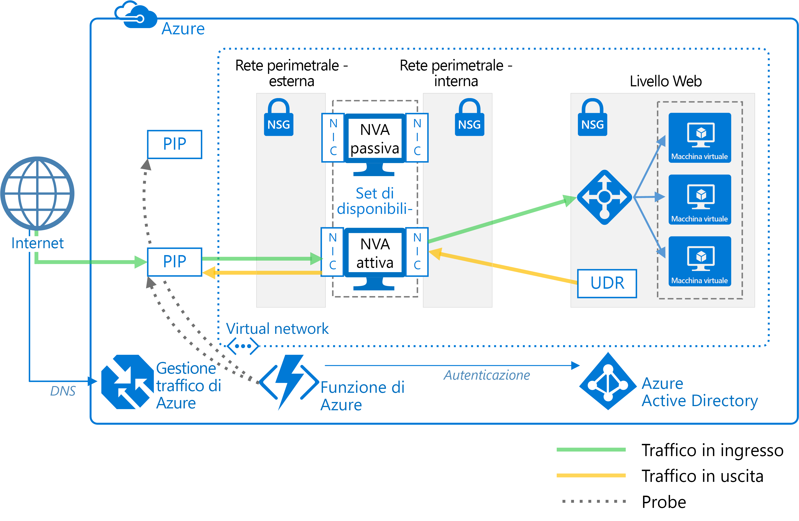

# Distribuire appliance virtuali di rete con disponibilità elevataDeploy highly available network virtual appliances

Questo articolo illustra come distribuire un set di appliance virtuali di rete per la disponibilità elevata in Azure.This article shows how to deploy a set of network virtual appliances (NVAs) for high availability in Azure. L'appliance virtuale di rete è in genere usata per controllare il flusso del traffico di rete da una rete perimetrale in altre reti o subnet.An NVA is typically used to control the flow of network traffic from a perimeter network, also known as a DMZ, to other networks or subnets. Per altre informazioni sull'implementazione di una rete perimetrale in Azure, vedere [Servizi cloud Microsoft e sicurezza di rete][cloud-security].To learn about implementing a DMZ in Azure, see [Microsoft cloud services and network security][cloud-security]. L'articolo include le architetture di esempio solo per i dati in ingresso, solo per i dati in uscita e per i dati in ingresso e in uscita.The article includes example architectures for ingress only, egress only, and both ingress and egress.

**Prerequisiti:** questo articolo presuppone una conoscenza di base della rete di Azure, dei [servizi di bilanciamento del carico di Azure][lb-overview] e delle [route definite dall'utente][udr-overview] (UDR).**Prerequisites:** This article assumes a basic understanding of Azure networking, [Azure load balancers][lb-overview], and [user-defined routes][udr-overview] (UDRs).

## Diagrammi di architetturaArchitecture diagrams

L'appliance virtuale di rete può essere distribuita in una rete perimetrale in diverse architetture.An NVA can be deployed to a DMZ in many different architectures. Ad esempio, la figura seguente illustra l'uso di una [singola appliance virtuale di rete][nva-scenario] per i dati in ingresso.For example, the following figure illustrates the use of a [single NVA][nva-scenario] for ingress.

![[0]][0]![[0]][0]

In questa architettura l'appliance virtuale di rete costituisce un limite di rete protetta tramite il controllo di tutto il traffico di rete in ingresso e in uscita e il passaggio del solo traffico che soddisfa le regole di sicurezza di rete.In this architecture, the NVA provides a secure network boundary by checking all inbound and outbound network traffic and passing only the traffic that meets network security rules. Tuttavia, il fatto che tutto il traffico di rete debba passare attraverso l'appliance virtuale di rete significa che questa è un singolo punto di guasto nella rete.However, the fact that all network traffic must pass through the NVA means that the NVA is a single point of failure in the network. In caso di errore dell'appliance virtuale di rete, non c'è un altro percorso per il traffico di rete e tutte le subnet di back-end non sono disponibili.If the NVA fails, there is no other path for network traffic and all the back-end subnets are unavailable.

Per rendere un'appliance virtuale di rete altamente disponibile, distribuire più appliance virtuali di rete in un set di disponibilità.To make an NVA highly available, deploy more than one NVA into an availability set.

Le architetture seguenti descrivono le risorse e la configurazione necessarie per le appliance virtuali di rete a disponibilità elevata:The following architectures describe the resources and configuration necessary for highly available NVAs:

| SoluzioneSolution | VantaggiBenefits | ConsiderazioniConsiderations |
| --- | --- | --- |
| [Dati in ingresso con appliance virtuali di rete di livello 7][ingress-with-layer-7][Ingress with layer 7 NVAs][ingress-with-layer-7] |Tutti i nodi dell'appliance virtuale di rete sono attiviAll NVA nodes are active |Richiede un'appliance virtuale di rete che può interrompere le connessioni e usare SNATRequires an NVA that can terminate connections and use SNAT  Richiede un set separato di appliance virtuali di rete per il traffico proveniente da Internet e da AzureRequires a separate set of NVAs for traffic coming from the Internet and from Azure   Può essere usato solo per il traffico proveniente da punti esterni ad AzureCan only be used for traffic originating outside Azure |
| [Dati in uscita con appliance virtuali di rete di livello 7][egress-with-layer-7][Egress with layer 7 NVAs][egress-with-layer-7] |Tutti i nodi dell'appliance virtuale di rete sono attiviAll NVA nodes are active | Richiede un'appliance virtuale di rete in grado di terminare le connessioni e implementa SNATRequires an NVA that can terminate connections and implements source network address translation (SNAT)
| [Dati in ingresso e in uscita con appliance virtuali di rete di livello 7][ingress-egress-with-layer-7][Ingress-Egress with layer 7 NVAs][ingress-egress-with-layer-7] |Tutti i nodi sono attiviAll nodes are active In grado di gestire il traffico generato in AzureAble to handle traffic originated in Azure |Richiede un'appliance virtuale di rete che può interrompere le connessioni e usare SNATRequires an NVA that can terminate connections and use SNAT Richiede un set separato di appliance virtuali di rete per il traffico proveniente da Internet e da AzureRequires a separate set of NVAs for traffic coming from the Internet and from Azure |
| [Commutatore PIP-UDR][pip-udr-switch][PIP-UDR switch][pip-udr-switch] |Un solo set di appliance virtuali di rete per tutto il trafficoSingle set of NVAs for all traffic In grado di gestire tutto il traffico (nessun limite alle regole di porta)Can handle all traffic (no limit on port rules) |Modello attivo/passivoActive-passive Richiede un processo di failoverRequires a failover process |
| [PIP-UDR senza SNATPIP-UDR without SNAT](#pip-udr-nvas-without-snat) | Un solo set di appliance virtuali di rete per tutto il trafficoSingle set of NVAs for all traffic In grado di gestire tutto il traffico (nessun limite alle regole di porta)Can handle all traffic (no limit on port rules) Non richiede la configurazione di SNAT per le richieste in ingressoDoes not require configuring SNAT for inbound requests |Modello attivo/passivoActive-passive Richiede un processo di failoverRequires a failover process La logica di probe e il failover vengono eseguiti all'esterno della rete virtualeProbing and failover logic run outside the virtual network |

## Dati in ingresso con appliance virtuali di rete di livello 7Ingress with layer 7 NVAs

La figura seguente mostra un'architettura a disponibilità elevata che implementa una rete perimetrale con dati in ingresso dietro un servizio di bilanciamento del carico con connessione a Internet.The following figure shows a high availability architecture that implements an ingress DMZ behind an internet-facing load balancer. Questa architettura è progettata per offrire la connettività ai carichi di lavoro di Azure per il traffico di livello 7, ad esempio HTTP o HTTPS:This architecture is designed to provide connectivity to Azure workloads for layer 7 traffic, such as HTTP or HTTPS:

![[1]][1]![[1]][1]

Il vantaggio di questa architettura è che tutte le appliance virtuali di rete sono attive e se una di queste ha esito negativo il servizio di bilanciamento del carico indirizza il traffico di rete a un'altra appliance virtuale di rete.The benefit of this architecture is that all NVAs are active, and if one fails the load balancer directs network traffic to the other NVA. Entrambe le appliance virtuali di rete indirizzano il traffico al servizio di bilanciamento del carico interno quindi fino a quando un'appliance virtuale di rete è attiva, il traffico continua a fluire.Both NVAs route traffic to the internal load balancer so as long as one NVA is active, traffic continues to flow. Le appliance virtuali di rete devono interrompere il traffico SSL previsto per le macchine virtuali di livello Web.The NVAs are required to terminate SSL traffic intended for the web tier VMs. Queste appliance virtuali di rete non possono essere estese per gestire il traffico locale perché questo richiede un altro set dedicato di appliance virtuali di rete con le proprie route di rete.These NVAs cannot be extended to handle on-premises traffic because on-premises traffic requires another dedicated set of NVAs with their own network routes.

> [!NOTE]
> Questa architettura viene usata nell'architettura di riferimento della [rete perimetrale tra Azure e il data center locale][dmz-on-prem] e quella della [rete perimetrale tra Azure e Internet][dmz-internet].This architecture is used in the [DMZ between Azure and your on-premises datacenter][dmz-on-prem] reference architecture and the [DMZ between Azure and the Internet][dmz-internet] reference architecture. Ognuna di queste architetture di riferimento include una soluzione di distribuzione che è possibile usare.Each of these reference architectures includes a deployment solution that you can use. Per altre informazioni, vedere i collegamenti seguenti.Follow the links for more information.

## Dati in uscita con appliance virtuali di rete di livello 7Egress with layer 7 NVAs

L'architettura precedente può essere estesa per offrire una rete perimetrale per i dati in uscita per le richieste provenienti dal carico di lavoro di Azure.The previous architecture can be expanded to provide an egress DMZ for requests originating in the Azure workload. L'architettura seguente è progettata per offrire un'elevata disponibilità delle appliance virtuali di rete nella rete perimetrale per il traffico di livello 7, ad esempio HTTP o HTTPS:The following architecture is designed to provide high availability of the NVAs in the DMZ for layer 7 traffic, such as HTTP or HTTPS:

![[2]][2]![[2]][2]

In questa architettura tutto il traffico proveniente da Azure viene indirizzato a un servizio di bilanciamento del carico interno.In this architecture, all traffic originating in Azure is routed to an internal load balancer. Il servizio di bilanciamento del carico distribuisce le richieste in uscita tra un set di appliance virtuali di rete.The load balancer distributes outgoing requests between a set of NVAs. Le appliance virtuali di rete indirizzano il traffico a Internet usando i singoli indirizzi IP pubblici.These NVAs direct traffic to the Internet using their individual public IP addresses.

> [!NOTE]
> Questa architettura viene usata nell'architettura di riferimento della [rete perimetrale tra Azure e il data center locale][dmz-on-prem] e quella della [rete perimetrale tra Azure e Internet][dmz-internet].This architecture is used in the [DMZ between Azure and your on-premises datacenter][dmz-on-prem] reference architecture and the [DMZ between Azure and the Internet][dmz-internet] reference architecture. Ognuna di queste architetture di riferimento include una soluzione di distribuzione che è possibile usare.Each of these reference architectures includes a deployment solution that you can use. Per altre informazioni, vedere i collegamenti seguenti.Follow the links for more information.

## Dati in ingresso e in uscita con appliance virtuali di rete di livello 7Ingress-egress with layer 7 NVAs

Le due architetture precedenti prevedevano due reti perimetrali diverse per i dati in ingresso e i dati in uscita.In the two previous architectures, there was a separate DMZ for ingress and egress. L'architettura seguente illustra come creare una rete perimetrale che può essere usata sia per i dati in ingresso che per i dati in uscita per il traffico di livello 7, ad esempio HTTP o HTTPS:The following architecture demonstrates how to create a DMZ that can be used for both ingress and egress for layer 7 traffic, such as HTTP or HTTPS:

![[4]][4]

In questa architettura le appliance virtuali di rete elaborano le richieste provenienti dal gateway dell'applicazione.In this architecture, the NVAs process incoming requests from the application gateway. Le appliance virtuali di rete elaborano anche le richieste in uscita dalle macchine virtuali del carico di lavoro nel pool back-end del servizio di bilanciamento del carico.The NVAs also process outgoing requests from the workload VMs in the back-end pool of the load balancer. Poiché il traffico in ingresso viene indirizzato con un gateway dell'applicazione e il traffico in uscita viene indirizzato con un servizio di bilanciamento del carico, le appliance virtuali di rete sono responsabili della gestione dell'affinità di sessione.Because incoming traffic is routed with an application gateway and outgoing traffic is routed with a load balancer, the NVAs are responsible for maintaining session affinity. Questo vuol dire che il gateway dell'applicazione conserva un mapping delle richieste in ingresso e in uscita in modo da poter inoltrare la risposta corretta al richiedente originale.That is, the application gateway maintains a mapping of inbound and outbound requests so it can forward the correct response to the original requestor. Tuttavia, il servizio di bilanciamento del carico interno non dispone dell'accesso ai mapping del gateway dell'applicazione e usa la propria logica per inviare le risposte alle appliance virtuali di rete.However, the internal load balancer does not have access to the application gateway mappings, and uses its own logic to send responses to the NVAs. È possibile che il servizio di bilanciamento del carico possa inviare una risposta a un appliance virtuale di rete che inizialmente non ha ricevuto la richiesta dal gateway dell'applicazione.It's possible the load balancer could send a response to an NVA that did not initially receive the request from the application gateway. In questo caso, le appliance virtuali di rete devono comunicare e trasferire la risposta tra di loro in modo che la corretta appliance virtuale di rete possa inoltrare la risposta al gateway dell'applicazione.In this case, the NVAs must communicate and transfer the response between them so the correct NVA can forward the response to the application gateway.

> [!NOTE]
> È anche possibile risolvere il problema di routing asimmetrico garantendo che le appliance virtuali di rete eseguano SNAt.You can also solve the asymmetric routing issue by ensuring the NVAs perform inbound source network address translation (SNAT). In questo modo l'IP dell'origine iniziale del richiedente sostituisce uno degli indirizzi IP dell'appliance virtuale di rete usato nel flusso in ingresso.This would replace the original source IP of the requestor to one of the IP addresses of the NVA used on the inbound flow. Questo garantisce la possibilità di usare più appliance virtuali di rete contemporaneamente, preservando la simmetria di route.This ensures that you can use multiple NVAs at a time, while preserving the route symmetry.

## Commutatore PIP-UDR con appliance virtuali di rete di livello 4PIP-UDR switch with layer 4 NVAs

L'architettura seguente illustra un'architettura con un'appliance virtuali di rete attiva e una passiva.The following architecture demonstrates an architecture with one active and one passive NVA. Questa architettura gestisce sia i dati in ingresso che i dati in uscita per il traffico di livello 4:This architecture handles both ingress and egress for layer 4 traffic:

![[3]][3]![[3]][3]

> [!TIP]
> Una soluzione completa di questa architettura è disponibile in [GitHub][pnp-ha-nva].A complete solution for this architecture is available on [GitHub][pnp-ha-nva].

Questa architettura è simile alla prima architettura descritta in questo articolo,This architecture is similar to the first architecture discussed in this article. che prevedeva un'unica appliance virtuale di rete che accettava e filtrava le richieste in ingresso di livello 4.That architecture included a single NVA accepting and filtering incoming layer 4 requests. Questa architettura aggiunge una seconda appliance virtuale di rete passiva per garantire un'elevata disponibilità.This architecture adds a second passive NVA to provide high availability. In caso di errore dell'appliance virtuale di rete attiva, quella passiva viene resa attiva e UDR e PIP vengono modificati per puntare alle schede di interfaccia di rete nell'appliance virtuale di rete attualmente attiva.If the active NVA fails, the passive NVA is made active and the UDR and PIP are changed to point to the NICs on the now active NVA. Queste modifiche a UDR e PIP possono essere eseguite manualmente o mediante un processo automatico.These changes to the UDR and PIP can either be done manually or using an automated process. Il processo automatico è in genere un daemon o un altro servizio di monitoraggio in esecuzione in Azure.The automated process is typically daemon or other monitoring service running in Azure. Esegue una query su un probe di integrità nell'appliance virtuale di rete attiva ed esegue la commutazionre di UDR e PIP quando rileva un errore di appliance virtuale di rete.It queries a health probe on the active NVA and performs the UDR and PIP switch when it detects a failure of the NVA.

La figura precedente illustra un cluster di esempio [ZooKeeper][zookeeper] che offre un daemon a disponibilità elevata.The preceding figure shows an example [ZooKeeper][zookeeper] cluster providing a high availability daemon. All'interno del cluster ZooKeeper, un quorum di nodi sceglie un coordinatore.Within the ZooKeeper cluster, a quorum of nodes elects a leader. In caso di errore del coordinatore, i nodi restanti consentono di scegliere un nuovo coordinatore.If the leader fails, the remaining nodes hold an election to elect a new leader. Per questa architettura, il nodo coordinatore esegue il daemon che esegue la query sull'endpoint di integrità nell'appliance virtuale di rete.For this architecture, the leader node executes the daemon that queries the health endpoint on the NVA. Se l'appliance virtuale di rete non risponde al probe di integrità, il daemon attiva l'appliance virtuale di rete passiva.If the NVA fails to respond to the health probe, the daemon activates the passive NVA. Il daemon quindi chiama l'API REST di Azure per rimuovere PIP dall'appliance virtuale di rete non riuscita e lo collega all'appliance virtuale di rete appena attivata.The daemon then calls the Azure REST API to remove the PIP from the failed NVA and attaches it to newly activated NVA. Il daemon quindi modifica l'UDR in modo che punti all'indirizzo IP interno dell'appliance virtuale di rete appena attivata.The daemon then modifies the UDR to point to the newly activated NVA's internal IP address.

Non includere i nodi ZooKeeper in una subnet accessibile solo tramite una route che include l'appliance virtuale di rete.Do not include the ZooKeeper nodes in a subnet that is only accessible using a route that includes the NVA. In caso contrario i nodi ZooKeeper non sono accessibili se l'appliance virtuale di rete ha esito negativo.Otherwise, the ZooKeeper nodes are inaccessible if the NVA fails. Nel caso in cui il daemon abbia esito negativo per un qualsiasi motivo, non sarà possibile accedere a uno dei nodi ZooKeeper per diagnosticare il problema.Should the daemon fail for any reason, you won't be able to access any of the ZooKeeper nodes to diagnose the problem.

Per visualizzare la soluzione completa incluso il codice di esempio, vedere i file nei [repository GitHub][pnp-ha-nva].To see the complete solution including sample code, see the files in the [GitHub repository][pnp-ha-nva].

## PIP-UDR NVA senza SNATPIP-UDR NVAs without SNAT

Questa architettura usa due macchine virtuali di Azure per ospitare il firewall di appliance virtuale di rete (NVA) in una configurazione attiva-passiva che supporta il failover automatizzato, ma non richiede Source Network Address Translation (SNAT).This architecture uses two Azure virtual machines to host the NVA firewall in an active-passive configuration that supports automated failover but does not require Source Network Address Translation (SNAT).

> [!TIP]
> Una soluzione completa per questa architettura è disponibile in [GitHub][ha-nva-fo].A complete solution for this architecture is available on [GitHub][ha-nva-fo].

Questa soluzione è progettata per i clienti di Azure che non possono configurare SNAT per le richieste in ingresso sui firewall di appliance virtuale di rete.This solution is designed for Azure customers who cannot configure SNAT for inbound requests on their NVA firewalls. SNAT nasconde l'indirizzo IP del client di origine.SNAT hides the original source client IP address. Se è necessario registrare gli indirizzi IP di origine o usati all'interno di altri componenti di sicurezza su più livelli dietro l'appliance di rete virtuale, questa soluzione offre un approccio di base.If you need to log the original IPs or used them within other layered security components behind your NVAs, this solution offers a basic approach.

Il failover di voci della tabella di route definita dall'utente viene automatizzato con un indirizzo dell'hop successivo impostato sull'indirizzo IP di un'interfaccia nella macchina virtuale firewall di appliance virtuale di rete.The failover of UDR table entries is automated by a next-hop address set to the IP address of an interface on the active NVA firewall virtual machine. La logica di failover automatizzato è ospitata in un'app per le funzioni creata tramite [Funzioni di Azure](/azure/azure-functions/).The automated failover logic is hosted in a function app that you create using [Azure Functions](/azure/azure-functions/). Il codice di failover viene eseguito come una funzione senza server all'interno di funzioni di Azure.The failover code runs as a serverless function inside Azure Functions. La distribuzione è pratica, conveniente e facile da gestire e personalizzare.Deployment is convenient, cost-effective, and easy to maintain and customize. Inoltre, l'app per le funzioni è ospitata all'interno di funzioni di Azure, pertanto, non ha dipendenze nella rete virtuale.In addition, the function app is hosted within Azure Functions, so it has no dependencies on the virtual network. Se le modifiche alla rete virtuale compromettono i firewall di appliance virtuale di rete, l’esecuzione dell'app per le funzioni continua in modo indipendente.If changes to the virtual network impact the NVA firewalls, the function app continues to run independently. Il test è più preciso, in quanto avviene all'esterno della rete virtuale usando la stessa route richiesta dal client in ingresso.Testing is more accurate as well, because it takes place outside the virtual network using the same route as the inbound client requests.

Per verificare la disponibilità del firewall di appliance virtuale di rete, il codice dell'app per le funzioni esegue il probe in una delle due modalità riportate di seguito:To check the availability of the NVA firewall, the function app code probes it in one of two ways:

- Monitorando lo stato delle macchine virtuali di Azure che ospitano il firewall di appliance virtuale di rete.By monitoring the state of the Azure virtual machines hosting the NVA firewall.

- Verificando se c’è una porta aperta tramite il firewall al server Web back-end.By testing whether there is an open port through the firewall to the back-end web server. Per questa opzione, l'appliance virtuale di rete deve esporre un socket tramite PIP per il codice di app per le funzioni da testare.For this option, the NVA must expose a socket via PIP for the function app code to test.

Scegliere il tipo di probe da usare quando si configura l'app per le funzioni.You choose the type of probe you want to use when you configure the function app. Per visualizzare la soluzione completa incluso il codice di esempio, vedere i file nei [repository GitHub][ha-nva-fo].To see the complete solution including sample code, see the files in the [GitHub repository][ha-nva-fo].

## Passaggi successiviNext steps

- Informazioni su come [implementare una rete perimetrale tra Azure e il data center locale][dmz-on-prem] con le appliance virtuali di rete di livello 7.Learn how to [implement a DMZ between Azure and your on-premises datacenter][dmz-on-prem] using layer-7 NVAs.
- Informazioni su come [implementare una rete perimetrale tra Azure e Internet][dmz-internet] con le appliance virtuali di rete di livello 7.Learn how to [implement a DMZ between Azure and the Internet][dmz-internet] using layer-7 NVAs.
- [Risoluzione dei problemi delle appliance virtuali di rete in AzureTroubleshoot network virtual appliance issues in Azure](/azure/virtual-network/virtual-network-troubleshoot-nva)

<!-- links -->

[cloud-security]: /azure/best-practices-network-security
[dmz-on-prem]: ./secure-vnet-hybrid.md
[dmz-internet]: ./secure-vnet-dmz.md
[egress-with-layer-7]: #egress-with-layer-7-nvas
[ingress-with-layer-7]: #ingress-with-layer-7-nvas
[ingress-egress-with-layer-7]: #ingress-egress-with-layer-7-nvas
[lb-overview]: /azure/load-balancer/load-balancer-overview/
[nva-scenario]: /azure/virtual-network/virtual-network-scenario-udr-gw-nva/
[pip-udr-switch]: #pip-udr-switch-with-layer-4-nvas
[udr-overview]: /azure/virtual-network/virtual-networks-udr-overview/
[zookeeper]: https://zookeeper.apache.org/
[pnp-ha-nva]: https://github.com/mspnp/ha-nva
[ha-nva-fo]: https://aka.ms/ha-nva-fo

<!-- images -->

[0]: ./images/nva-ha/single-nva.png "Architettura della singola appliance virtuale di rete"
[1]: ./images/nva-ha/l7-ingress.png "Dati in ingresso di livello 7"
[2]: ./images/nva-ha/l7-ingress-egress.png "Dati in uscita di livello 7"
[3]: ./images/nva-ha/active-passive.png "Cluster attivo-passivo"
[4]: ./images/nva-ha/l7-ingress-egress-ag.png
