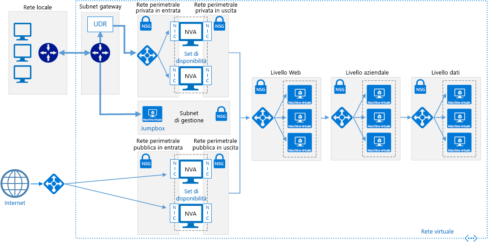
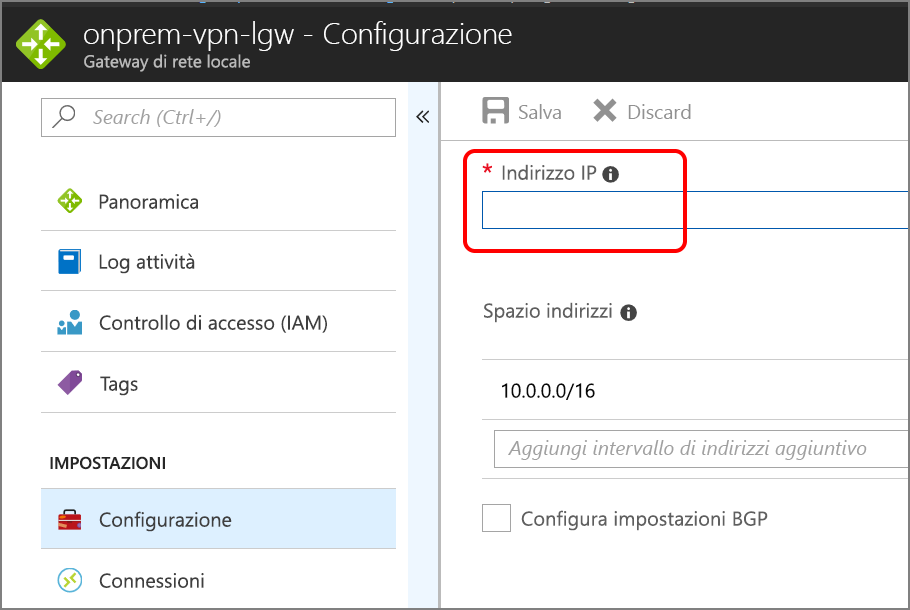

# <a name="implement-a-dmz-between-azure-and-the-internet"></a><span data-ttu-id="4d717-103">Implementare una rete perimetrale tra Azure e Internet</span><span class="sxs-lookup"><span data-stu-id="4d717-103">Implement a DMZ between Azure and the Internet</span></span>

<span data-ttu-id="4d717-104">Questa architettura di riferimento consente di visualizzare una rete ibrida sicura che estende una rete locale in Azure e accetta anche il traffico Internet.</span><span class="sxs-lookup"><span data-stu-id="4d717-104">This reference architecture shows a secure hybrid network that extends an on-premises network to Azure and also accepts Internet traffic.</span></span> <span data-ttu-id="4d717-105">[**Distribuire questa soluzione**](#deploy-the-solution).</span><span class="sxs-lookup"><span data-stu-id="4d717-105">[**Deploy this solution**](#deploy-the-solution).</span></span>



<span data-ttu-id="4d717-107">*Scaricare un [file Visio][visio-download] di questa architettura.*</span><span class="sxs-lookup"><span data-stu-id="4d717-107">*Download a [Visio file][visio-download] of this architecture.*</span></span>

<span data-ttu-id="4d717-108">Questa architettura di riferimento amplia l'architettura descritta in [Implementing a DMZ between Azure and your on-premises datacenter][implementing-a-secure-hybrid-network-architecture] (Implementazione di una rete perimetrale tra Azure e il data center locale).</span><span class="sxs-lookup"><span data-stu-id="4d717-108">This reference architecture extends the architecture described in [Implementing a DMZ between Azure and your on-premises datacenter][implementing-a-secure-hybrid-network-architecture].</span></span> <span data-ttu-id="4d717-109">Tale architettura aggiunge una rete perimetrale pubblica che gestisce il traffico Internet, in aggiunta alla rete perimetrale privata che gestisce il traffico proveniente dalla rete locale.</span><span class="sxs-lookup"><span data-stu-id="4d717-109">It adds a public DMZ that handles Internet traffic, in addition to the private DMZ that handles traffic from the on-premises network.</span></span>

<span data-ttu-id="4d717-110">Tra gli usi tipici di questa architettura sono inclusi:</span><span class="sxs-lookup"><span data-stu-id="4d717-110">Typical uses for this architecture include:</span></span>

- <span data-ttu-id="4d717-111">Applicazioni ibride in cui i carichi di lavoro vengono eseguiti in parte localmente e in parte in Azure.</span><span class="sxs-lookup"><span data-stu-id="4d717-111">Hybrid applications where workloads run partly on-premises and partly in Azure.</span></span>
- <span data-ttu-id="4d717-112">Infrastruttura di Azure che instrada il traffico in ingresso proveniente da reti locali e da Internet.</span><span class="sxs-lookup"><span data-stu-id="4d717-112">Azure infrastructure that routes incoming traffic from on-premises and the Internet.</span></span>

## <a name="architecture"></a><span data-ttu-id="4d717-113">Architettura</span><span class="sxs-lookup"><span data-stu-id="4d717-113">Architecture</span></span>

<span data-ttu-id="4d717-114">L'architettura è costituita dai componenti seguenti.</span><span class="sxs-lookup"><span data-stu-id="4d717-114">The architecture consists of the following components.</span></span>

- <span data-ttu-id="4d717-115">**Indirizzo IP Pubblico (PIP)**.</span><span class="sxs-lookup"><span data-stu-id="4d717-115">**Public IP address (PIP)**.</span></span> <span data-ttu-id="4d717-116">L'indirizzo IP dell'endpoint pubblico.</span><span class="sxs-lookup"><span data-stu-id="4d717-116">The IP address of the public endpoint.</span></span> <span data-ttu-id="4d717-117">Gli utenti esterni connessi a Internet possono accedere al sistema attraverso questo indirizzo.</span><span class="sxs-lookup"><span data-stu-id="4d717-117">External users connected to the Internet can access the system through this address.</span></span>
- <span data-ttu-id="4d717-118">**Appliance virtuale di rete (NVA)**.</span><span class="sxs-lookup"><span data-stu-id="4d717-118">**Network virtual appliance (NVA)**.</span></span> <span data-ttu-id="4d717-119">Questa architettura include un pool separato di NVA per il traffico che ha origine in Internet.</span><span class="sxs-lookup"><span data-stu-id="4d717-119">This architecture includes a separate pool of NVAs for traffic originating on the Internet.</span></span>
- <span data-ttu-id="4d717-120">**Azure Load Balancer**.</span><span class="sxs-lookup"><span data-stu-id="4d717-120">**Azure load balancer**.</span></span> <span data-ttu-id="4d717-121">Tutte le richieste in ingresso provenienti da Internet passano attraverso il bilanciamento del carico e vengono distribuite alle NVA nella rete perimetrale pubblica.</span><span class="sxs-lookup"><span data-stu-id="4d717-121">All incoming requests from the Internet pass through the load balancer and are distributed to the NVAs in the public DMZ.</span></span>
- <span data-ttu-id="4d717-122">**Subnet in ingresso della rete perimetrale pubblica**.</span><span class="sxs-lookup"><span data-stu-id="4d717-122">**Public DMZ inbound subnet**.</span></span> <span data-ttu-id="4d717-123">Questa subnet accetta le richieste provenienti da Azure Load Balancer.</span><span class="sxs-lookup"><span data-stu-id="4d717-123">This subnet accepts requests from the Azure load balancer.</span></span> <span data-ttu-id="4d717-124">Le richieste in ingresso vengono passate a una delle NVA nella rete perimetrale pubblica.</span><span class="sxs-lookup"><span data-stu-id="4d717-124">Incoming requests are passed to one of the NVAs in the public DMZ.</span></span>
- <span data-ttu-id="4d717-125">**Subnet in uscita della rete perimetrale pubblica**.</span><span class="sxs-lookup"><span data-stu-id="4d717-125">**Public DMZ outbound subnet**.</span></span> <span data-ttu-id="4d717-126">Le richieste approvate dalla NVA passano attraverso questa subnet verso il bilanciamento del carico interno per il livello Web.</span><span class="sxs-lookup"><span data-stu-id="4d717-126">Requests that are approved by the NVA pass through this subnet to the internal load balancer for the web tier.</span></span>

## <a name="recommendations"></a><span data-ttu-id="4d717-127">Consigli</span><span class="sxs-lookup"><span data-stu-id="4d717-127">Recommendations</span></span>

<span data-ttu-id="4d717-128">Le raccomandazioni seguenti sono valide per la maggior parte degli scenari.</span><span class="sxs-lookup"><span data-stu-id="4d717-128">The following recommendations apply for most scenarios.</span></span> <span data-ttu-id="4d717-129">Seguire queste indicazioni, a meno che non si disponga di un requisito specifico che le escluda.</span><span class="sxs-lookup"><span data-stu-id="4d717-129">Follow these recommendations unless you have a specific requirement that overrides them.</span></span>

### <a name="nva-recommendations"></a><span data-ttu-id="4d717-130">Raccomandazioni per le appliance virtuali di rete</span><span class="sxs-lookup"><span data-stu-id="4d717-130">NVA recommendations</span></span>

<span data-ttu-id="4d717-131">È consigliabile usare un set di NVA per il traffico che ha origine in Internet e un altro per il traffico che ha origine in locale.</span><span class="sxs-lookup"><span data-stu-id="4d717-131">Use one set of NVAs for traffic originating on the Internet, and another for traffic originating on-premises.</span></span> <span data-ttu-id="4d717-132">L'uso di un solo set di NVA per entrambi i tipi di traffico è un rischio per la sicurezza, poiché non fornisce alcun perimetro di sicurezza tra i due set di traffico di rete.</span><span class="sxs-lookup"><span data-stu-id="4d717-132">Using only one set of NVAs for both is a security risk, because it provides no security perimeter between the two sets of network traffic.</span></span> <span data-ttu-id="4d717-133">L'uso di NVA separate riduce la complessità del controllo delle regole di sicurezza e definisce chiaramente la corrispondenza tra le regole e le richieste di rete in ingresso.</span><span class="sxs-lookup"><span data-stu-id="4d717-133">Using separate NVAs reduces the complexity of checking security rules, and makes it clear which rules correspond to each incoming network request.</span></span> <span data-ttu-id="4d717-134">Un set di NVA implementa le regole per il solo traffico Internet, mentre un altro set implementa le regole relative al solo traffico locale.</span><span class="sxs-lookup"><span data-stu-id="4d717-134">One set of NVAs implements rules for Internet traffic only, while another set of NVAs implement rules for on-premises traffic only.</span></span>

<span data-ttu-id="4d717-135">Includere una NVA di livello 7 per terminare le connessioni dell'applicazione al livello della NVA e mantenere la compatibilità con i livelli back-end.</span><span class="sxs-lookup"><span data-stu-id="4d717-135">Include a layer-7 NVA to terminate application connections at the NVA level and maintain compatibility with the backend tiers.</span></span> <span data-ttu-id="4d717-136">In questo modo si garantisce la connettività simmetrica in cui il traffico di risposta proveniente dai livelli back-end viene restituito tramite la NVA.</span><span class="sxs-lookup"><span data-stu-id="4d717-136">This guarantees symmetric connectivity where response traffic from the backend tiers returns through the NVA.</span></span>

### <a name="public-load-balancer-recommendations"></a><span data-ttu-id="4d717-137">Raccomandazioni sul servizio di bilanciamento del carico pubblico</span><span class="sxs-lookup"><span data-stu-id="4d717-137">Public load balancer recommendations</span></span>

<span data-ttu-id="4d717-138">Per la scalabilità e la disponibilità, distribuire le NVA della rete perimetrale pubblica in un [set di disponibilità][availability-set] e usare un [bilanciamento del carico con connessione Internet][load-balancer] per distribuire le richieste Internet tra le NVA nel set di disponibilità.</span><span class="sxs-lookup"><span data-stu-id="4d717-138">For scalability and availability, deploy the public DMZ NVAs in an [availability set][availability-set] and use an [Internet facing load balancer][load-balancer] to distribute Internet requests across the NVAs in the availability set.</span></span>

<span data-ttu-id="4d717-139">Configurare il bilanciamento del carico per accettare richieste solo sulle porte necessarie al traffico Internet.</span><span class="sxs-lookup"><span data-stu-id="4d717-139">Configure the load balancer to accept requests only on the ports necessary for Internet traffic.</span></span> <span data-ttu-id="4d717-140">Ad esempio, limitare le richieste HTTP in ingresso alla porta 80 e le richieste HTTPS in ingresso alla porta 443.</span><span class="sxs-lookup"><span data-stu-id="4d717-140">For example, restrict inbound HTTP requests to port 80 and inbound HTTPS requests to port 443.</span></span>

## <a name="scalability-considerations"></a><span data-ttu-id="4d717-141">Considerazioni sulla scalabilità</span><span class="sxs-lookup"><span data-stu-id="4d717-141">Scalability considerations</span></span>

<span data-ttu-id="4d717-142">Anche se inizialmente l'architettura richiede una singola NVA nella rete perimetrale pubblica, è consigliabile inserire un bilanciamento del carico davanti a tale rete fin dall'inizio:</span><span class="sxs-lookup"><span data-stu-id="4d717-142">Even if your architecture initially requires a single NVA in the public DMZ, we recommend putting a load balancer in front of the public DMZ from the beginning.</span></span> <span data-ttu-id="4d717-143">questo renderà più facile eseguire la scalabilità tra più NVA in futuro, se necessario.</span><span class="sxs-lookup"><span data-stu-id="4d717-143">That will make it easier to scale to multiple NVAs in the future, if needed.</span></span>

## <a name="availability-considerations"></a><span data-ttu-id="4d717-144">Considerazioni sulla disponibilità</span><span class="sxs-lookup"><span data-stu-id="4d717-144">Availability considerations</span></span>

<span data-ttu-id="4d717-145">Il servizio di bilanciamento del carico con connessione Internet richiede che ogni NVA nella subnet in ingresso della rete perimetrale pubblica implementi un [probe integrità][lb-probe].</span><span class="sxs-lookup"><span data-stu-id="4d717-145">The Internet facing load balancer requires each NVA in the public DMZ inbound subnet to implement a [health probe][lb-probe].</span></span> <span data-ttu-id="4d717-146">Un probe integrità che non risponda a questo endpoint viene considerato non disponibile e il bilanciamento del carico invierà le richieste ad altre NVA presenti nello stesso set di disponibilità.</span><span class="sxs-lookup"><span data-stu-id="4d717-146">A health probe that fails to respond on this endpoint is considered to be unavailable, and the load balancer will direct requests to other NVAs in the same availability set.</span></span> <span data-ttu-id="4d717-147">Si noti che l'applicazione non verrà eseguita in caso di non risposta da parte di tutte le NVA, pertanto è importante che il monitoraggio sia configurato perché avvisi DevOps quando il numero di istanze di integrità di NVA scende al di sotto di una soglia definita.</span><span class="sxs-lookup"><span data-stu-id="4d717-147">Note that if all NVAs fail to respond, your application will fail, so it's important to have monitoring configured to alert DevOps when the number of healthy NVA instances falls below a defined threshold.</span></span>

## <a name="manageability-considerations"></a><span data-ttu-id="4d717-148">Considerazioni sulla gestibilità</span><span class="sxs-lookup"><span data-stu-id="4d717-148">Manageability considerations</span></span>

<span data-ttu-id="4d717-149">Il monitoraggio e la gestione delle appliance virtuali di rete nella rete perimetrale pubblica devono essere eseguiti dal jumpbox nella subnet di gestione.</span><span class="sxs-lookup"><span data-stu-id="4d717-149">All monitoring and management for the NVAs in the public DMZ should be performed by the jumpbox in the management subnet.</span></span> <span data-ttu-id="4d717-150">Come descritto in [Implementing a DMZ between Azure and your on-premises datacenter][implementing-a-secure-hybrid-network-architecture] (Implementazione di una rete perimetrale tra Azure e il data center locale), definire una route di rete singola proveniente dalla rete locale al jumpbox tramite il gateway, per limitare l'accesso.</span><span class="sxs-lookup"><span data-stu-id="4d717-150">As discussed in [Implementing a DMZ between Azure and your on-premises datacenter][implementing-a-secure-hybrid-network-architecture], define a single network route from the on-premises network through the gateway to the jumpbox, in order to restrict access.</span></span>

<span data-ttu-id="4d717-151">Se la connettività gateway dalla rete locale ad Azure non è attiva, è comunque possibile raggiungere il jumpbox attraverso la distribuzione di un indirizzo IP pubblico, aggiungendolo al jumpbox ed eseguendo la registrazione da Internet.</span><span class="sxs-lookup"><span data-stu-id="4d717-151">If gateway connectivity from your on-premises network to Azure is down, you can still reach the jumpbox by deploying a public IP address, adding it to the jumpbox, and logging in from the Internet.</span></span>

## <a name="security-considerations"></a><span data-ttu-id="4d717-152">Considerazioni relative alla sicurezza</span><span class="sxs-lookup"><span data-stu-id="4d717-152">Security considerations</span></span>

<span data-ttu-id="4d717-153">Questa architettura di riferimento implementa più livelli di sicurezza:</span><span class="sxs-lookup"><span data-stu-id="4d717-153">This reference architecture implements multiple levels of security:</span></span>

- <span data-ttu-id="4d717-154">Il servizio di bilanciamento del carico con connessione Internet invia le richieste alle NVA nella subnet della rete perimetrale pubblica in ingresso e solo sulle porte necessarie all'applicazione.</span><span class="sxs-lookup"><span data-stu-id="4d717-154">The Internet facing load balancer directs requests to the NVAs in the inbound public DMZ subnet, and only on the ports necessary for the application.</span></span>
- <span data-ttu-id="4d717-155">Le regole dei gruppi di sicurezza di rete per le subnet (NSG) in ingresso e in uscita della rete perimetrale pubblica impediscono che le NVA vengano compromesse bloccando le richieste che non rientrano nelle regole NSG.</span><span class="sxs-lookup"><span data-stu-id="4d717-155">The NSG rules for the inbound and outbound public DMZ subnets prevent the NVAs from being compromised, by blocking requests that fall outside of the NSG rules.</span></span>
- <span data-ttu-id="4d717-156">La configurazione del routing NAT per le NVA invia le richieste in entrata sulle porte 80 e 443 al servizio di bilanciamento del carico di livello Web, ma ignora le richieste su tutte le altre porte.</span><span class="sxs-lookup"><span data-stu-id="4d717-156">The NAT routing configuration for the NVAs directs incoming requests on port 80 and port 443 to the web tier load balancer, but ignores requests on all other ports.</span></span>

<span data-ttu-id="4d717-157">È consigliabile registrare tutte le richieste in ingresso su tutte le porte.</span><span class="sxs-lookup"><span data-stu-id="4d717-157">You should log all incoming requests on all ports.</span></span> <span data-ttu-id="4d717-158">Controllare periodicamente i registri prestando attenzione alle richieste che non rientrano nei parametri previsti, in quanto queste potrebbero indicare tentativi di intrusione.</span><span class="sxs-lookup"><span data-stu-id="4d717-158">Regularly audit the logs, paying attention to requests that fall outside of expected parameters, as these may indicate intrusion attempts.</span></span>

## <a name="deploy-the-solution"></a><span data-ttu-id="4d717-159">Distribuire la soluzione</span><span class="sxs-lookup"><span data-stu-id="4d717-159">Deploy the solution</span></span>

<span data-ttu-id="4d717-160">È disponibile una distribuzione per un'architettura di riferimento che implementa queste raccomandazioni su [GitHub][github-folder].</span><span class="sxs-lookup"><span data-stu-id="4d717-160">A deployment for a reference architecture that implements these recommendations is available on [GitHub][github-folder].</span></span>

### <a name="prerequisites"></a><span data-ttu-id="4d717-161">Prerequisiti</span><span class="sxs-lookup"><span data-stu-id="4d717-161">Prerequisites</span></span>

[!INCLUDE [ref-arch-prerequisites.md](../../../includes/ref-arch-prerequisites.md)]

### <a name="deploy-resources"></a><span data-ttu-id="4d717-162">Distribuire le risorse</span><span class="sxs-lookup"><span data-stu-id="4d717-162">Deploy resources</span></span>

1. <span data-ttu-id="4d717-163">Passare alla cartella `/dmz/secure-vnet-dmz` del repository GitHub di architetture di riferimento.</span><span class="sxs-lookup"><span data-stu-id="4d717-163">Navigate to the `/dmz/secure-vnet-dmz` folder of the reference architectures GitHub repository.</span></span>

2. <span data-ttu-id="4d717-164">Eseguire il comando seguente:</span><span class="sxs-lookup"><span data-stu-id="4d717-164">Run the following command:</span></span>

    ```bash
    azbb -s <subscription_id> -g <resource_group_name> -l <region> -p onprem.json --deploy
    ```

3. <span data-ttu-id="4d717-165">Eseguire il comando seguente:</span><span class="sxs-lookup"><span data-stu-id="4d717-165">Run the following command:</span></span>

    ```bash
    azbb -s <subscription_id> -g <resource_group_name> -l <region> -p secure-vnet-hybrid.json --deploy
    ```

### <a name="connect-the-on-premises-and-azure-gateways"></a><span data-ttu-id="4d717-166">Connettere i gateway locali e di Azure</span><span class="sxs-lookup"><span data-stu-id="4d717-166">Connect the on-premises and Azure gateways</span></span>

<span data-ttu-id="4d717-167">In questo passaggio verranno connessi i due gateway di rete locali.</span><span class="sxs-lookup"><span data-stu-id="4d717-167">In this step, you will connect the two local network gateways.</span></span>

1. <span data-ttu-id="4d717-168">Nel portale di Azure passare al gruppo di risorse creato.</span><span class="sxs-lookup"><span data-stu-id="4d717-168">In the Azure Portal, navigate to the resource group that you created.</span></span>

2. <span data-ttu-id="4d717-169">Trovare la risorsa denominata `ra-vpn-vgw-pip` e copiare l'indirizzo IP mostrato nel pannello **Panoramica**.</span><span class="sxs-lookup"><span data-stu-id="4d717-169">Find the resource named `ra-vpn-vgw-pip` and copy the IP address shown in the **Overview** blade.</span></span>

3. <span data-ttu-id="4d717-170">Trovare la risorsa denominata `onprem-vpn-lgw`.</span><span class="sxs-lookup"><span data-stu-id="4d717-170">Find the resource named `onprem-vpn-lgw`.</span></span>

4. <span data-ttu-id="4d717-171">Fare clic sul pannello **Configurazione**.</span><span class="sxs-lookup"><span data-stu-id="4d717-171">Click the **Configuration** blade.</span></span> <span data-ttu-id="4d717-172">In **Indirizzo IP** incollare l'indirizzo IP dal passaggio 2.</span><span class="sxs-lookup"><span data-stu-id="4d717-172">Under **IP address**, paste in the IP address from step 2.</span></span>

    

5. <span data-ttu-id="4d717-174">Fare clic su **Salva** e attendere il completamento dell'operazione.</span><span class="sxs-lookup"><span data-stu-id="4d717-174">Click **Save** and wait for the operation to complete.</span></span> <span data-ttu-id="4d717-175">L'operazione potrebbe richiedere circa 5 minuti.</span><span class="sxs-lookup"><span data-stu-id="4d717-175">It can take about 5 minutes.</span></span>

6. <span data-ttu-id="4d717-176">Trovare la risorsa denominata `onprem-vpn-gateway1-pip`.</span><span class="sxs-lookup"><span data-stu-id="4d717-176">Find the resource named `onprem-vpn-gateway1-pip`.</span></span> <span data-ttu-id="4d717-177">Copiare l'indirizzo IP mostrato nel pannello **Panoramica**.</span><span class="sxs-lookup"><span data-stu-id="4d717-177">Copy the IP address shown in the **Overview** blade.</span></span>

7. <span data-ttu-id="4d717-178">Trovare la risorsa denominata `ra-vpn-lgw`.</span><span class="sxs-lookup"><span data-stu-id="4d717-178">Find the resource named `ra-vpn-lgw`.</span></span>

8. <span data-ttu-id="4d717-179">Fare clic sul pannello **Configurazione**.</span><span class="sxs-lookup"><span data-stu-id="4d717-179">Click the **Configuration** blade.</span></span> <span data-ttu-id="4d717-180">In **Indirizzo IP** incollare l'indirizzo IP dal passaggio 6.</span><span class="sxs-lookup"><span data-stu-id="4d717-180">Under **IP address**, paste in the IP address from step 6.</span></span>

9. <span data-ttu-id="4d717-181">Fare clic su **Salva** e attendere il completamento dell'operazione.</span><span class="sxs-lookup"><span data-stu-id="4d717-181">Click **Save** and wait for the operation to complete.</span></span>

10. <span data-ttu-id="4d717-182">Per verificare la connessione, passare al pannello **Connessioni** per ogni gateway.</span><span class="sxs-lookup"><span data-stu-id="4d717-182">To verify the connection, go to the **Connections** blade for each gateway.</span></span> <span data-ttu-id="4d717-183">Lo stato dovrebbe essere **Connesso**.</span><span class="sxs-lookup"><span data-stu-id="4d717-183">The status should be **Connected**.</span></span>

### <a name="verify-that-network-traffic-reaches-the-web-tier"></a><span data-ttu-id="4d717-184">Verificare che il traffico di rete raggiunga il livello Web</span><span class="sxs-lookup"><span data-stu-id="4d717-184">Verify that network traffic reaches the web tier</span></span>

1. <span data-ttu-id="4d717-185">Nel portale di Azure passare al gruppo di risorse creato.</span><span class="sxs-lookup"><span data-stu-id="4d717-185">In the Azure Portal, navigate to the resource group that you created.</span></span>

2. <span data-ttu-id="4d717-186">Trovare la risorsa denominata `pub-dmz-lb`, che corrisponde al servizio di bilanciamento del carico situato davanti alla rete perimetrale pubblica.</span><span class="sxs-lookup"><span data-stu-id="4d717-186">Find the resource named `pub-dmz-lb`, which is the load balancer in front of the public DMZ.</span></span>

3. <span data-ttu-id="4d717-187">Copiare l'indirizzo IP pubblico dal pannello **Panoramica** e aprire tale indirizzo in un Web browser.</span><span class="sxs-lookup"><span data-stu-id="4d717-187">Copy the public IP addess from the **Overview** blade and open this address in a web browser.</span></span> <span data-ttu-id="4d717-188">Dovrebbe essere visualizzata la home page predefinita del server Apache2.</span><span class="sxs-lookup"><span data-stu-id="4d717-188">You should see the default Apache2 server home page.</span></span>

4. <span data-ttu-id="4d717-189">Trovare la risorsa denominata `int-dmz-lb`, che corrisponde al servizio di bilanciamento del carico situato davanti alla rete perimetrale privata.</span><span class="sxs-lookup"><span data-stu-id="4d717-189">Find the resource named `int-dmz-lb`, which is the load balancer in front of the private DMZ.</span></span> <span data-ttu-id="4d717-190">Copiare l'indirizzo IP privato dal pannello **Panoramica**.</span><span class="sxs-lookup"><span data-stu-id="4d717-190">Copy the private IP address from the **Overview** blade.</span></span>

5. <span data-ttu-id="4d717-191">Trovare la macchina virtuale denominata `jb-vm1`.</span><span class="sxs-lookup"><span data-stu-id="4d717-191">Find the VM named `jb-vm1`.</span></span> <span data-ttu-id="4d717-192">Fare clic su **Connetti** e usare Desktop remoto per connettersi alla VM.</span><span class="sxs-lookup"><span data-stu-id="4d717-192">Click **Connect** and use Remote Desktop to connect to the VM.</span></span> <span data-ttu-id="4d717-193">Il nome utente e la password sono specificati nel file onprem.json.</span><span class="sxs-lookup"><span data-stu-id="4d717-193">The user name and password are specified in the onprem.json file.</span></span>

6. <span data-ttu-id="4d717-194">Dalla sessione di Desktop remoto aprire un Web browser e passare all'indirizzo IP specificato nel passaggio 4.</span><span class="sxs-lookup"><span data-stu-id="4d717-194">From the Remote Desktop Session, open a web browser and navigate to the IP address from step 4.</span></span> <span data-ttu-id="4d717-195">Dovrebbe essere visualizzata la home page predefinita del server Apache2.</span><span class="sxs-lookup"><span data-stu-id="4d717-195">You should see the default Apache2 server home page.</span></span>

[availability-set]: /azure/virtual-machines/virtual-machines-windows-manage-availability
[github-folder]: https://github.com/mspnp/reference-architectures/tree/master/dmz/secure-vnet-dmz

[implementing-a-secure-hybrid-network-architecture]: ./secure-vnet-hybrid.md
[iptables]: https://help.ubuntu.com/community/IptablesHowTo
[lb-probe]: /azure/load-balancer/load-balancer-custom-probe-overview
[load-balancer]: /azure/load-balancer/load-balancer-Internet-overview
[network-security-group]: /azure/virtual-network/virtual-networks-nsg

[visio-download]: https://archcenter.blob.core.windows.net/cdn/dmz-reference-architectures.vsdx
