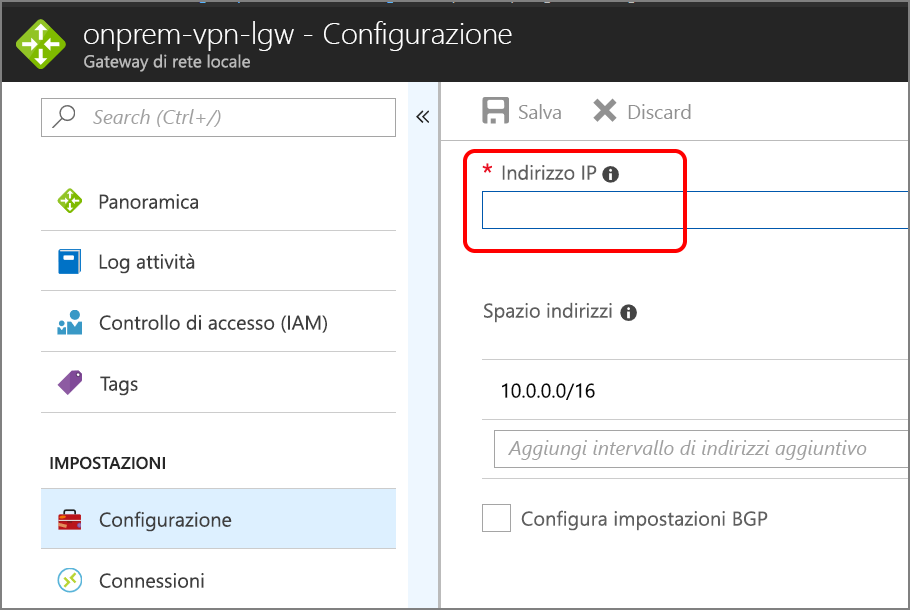

# <a name="implement-a-dmz-between-azure-and-your-on-premises-datacenter"></a>Implementare una rete perimetrale tra Azure e il data center locale

Questa architettura di riferimento consente di visualizzare una rete ibrida sicura che estende una rete locale in Azure. L'architettura implementa una *rete perimetrale* tra la rete locale e una rete virtuale di Azure (VNet). La rete perimetrale include appliance virtuali di rete (NVA) che implementano funzionalità di sicurezza quali firewall e ispezione dei pacchetti. Tutto il traffico in uscita dalla rete virtuale viene sottoposto a tunneling forzato verso Internet attraverso la rete locale, in modo da poter essere controllato. [**Distribuire questa soluzione**](#deploy-the-solution).


*Scaricare un [file Visio][visio-download] di questa architettura.*

Questa architettura richiede una connessione al data center locale mediante un [gateway VPN][ra-vpn] o una connessione [ExpressRoute][ra-expressroute]. Tra gli usi tipici di questa architettura sono inclusi:

- Applicazioni ibride in cui i carichi di lavoro vengono eseguiti in parte in locale e in parte in Azure.
- Infrastruttura che richiede un controllo granulare sul traffico in ingresso in una rete virtuale di Azure da un data center locale.
- Applicazioni che devono controllare il traffico in uscita. Questo è spesso un requisito normativo di molti sistemi commerciali, usato per evitare la divulgazione di informazioni private.

## <a name="architecture"></a>Architettura

L'architettura è costituita dai componenti seguenti.

- **Rete locale**. Una rete LAN privata implementata all'interno di un'organizzazione.
- **Rete virtuale di Azure (VNet)**. La rete VNet ospita l'applicazione e altre risorse in esecuzione in Azure.
- **Gateway**. Il gateway offre la connettività tra i router nella rete locale e nella rete VNet.
- **Appliance virtuale di rete (NVA)**. NVA è un termine generico che descrive una macchina virtuale che esegue attività quali consentire o negare l'accesso come firewall, ottimizzare le operazioni della rete WAN (compresa la compressione di rete), routing personalizzato o altre funzionalità di rete.
- **Subnet di livello Web, business e dati**. Subnet che ospitano le macchine virtuali e i servizi che implementano un'applicazione a 3 livelli di esempio in esecuzione nel cloud. Per altre informazioni, vedere [Esecuzione di macchine virtuali Windows per un'architettura a più livelli in Azure][ra-n-tier].
- **Route definite dall'utente**. Le [route definite dall'utente][udr-overview] vengono usate per definire il flusso del traffico IP nelle reti virtuali di Azure.

    > [!NOTE]
    > A seconda dei requisiti della connessione VPN, è possibile configurare le route del protocollo BGP (Border Gateway Protocol) anziché le UDR per implementare le regole di inoltro che indirizzano il traffico attraverso la rete locale.
    >

- **Subnet di gestione**. Questa subnet include macchine virtuali che implementano le funzionalità di gestione e monitoraggio per i componenti in esecuzione nella rete virtuale.

## <a name="recommendations"></a>Consigli

Le raccomandazioni seguenti sono valide per la maggior parte degli scenari. Seguire queste indicazioni, a meno che non si disponga di un requisito specifico che le escluda.

### <a name="access-control-recommendations"></a>Consigli per il controllo degli accessi

Usare il [Controllo degli accessi in base al ruolo][rbac] per gestire le risorse dell'applicazione. È consigliabile creare i [ruoli personalizzati][rbac-custom-roles] seguenti:

- Un ruolo DevOps con le autorizzazioni per amministrare l'infrastruttura per l'applicazione, distribuire i componenti dell'applicazione e monitorare e riavviare le macchine virtuali.

- Un ruolo di amministratore IT centralizzato per gestire e monitorare le risorse di rete.

- Un ruolo di amministratore IT della sicurezza per gestire le risorse di rete sicura, ad esempio le appliance NVA.

I ruoli DevOps e di amministratore IT non devono disporre di accesso alle risorse NVA. Questa condizione deve essere limitata al ruolo di amministratore IT della sicurezza.

### <a name="resource-group-recommendations"></a>Consigli per i gruppi di risorse

Le risorse di Azure, ad esempio le macchine virtuali e i servizi di bilanciamento del carico, vengono gestite facilmente tramite il raggruppamento in gruppi di risorse. Assegnare ruoli RBAC a ogni gruppo di risorse per limitare l'accesso.

Si consiglia di creare i gruppi di risorse seguenti:

- Un gruppo di risorse contenente la rete virtuale (escluse le macchine virtuali), gruppi di sicurezza di rete e risorse gateway per la connessione alla rete locale. Assegnare il ruolo di amministratore IT centralizzato al gruppo di risorse.
- Un gruppo di risorse contenente le macchine virtuali per le appliance virtuali di rete (incluso il bilanciamento del carico), il jumpbox e altre macchine virtuali di gestione, nonché la UDR per la subnet del gateway che forza tutto il traffico attraverso le appliance virtuali di rete. Assegnare il ruolo di amministratore IT della sicurezza al gruppo di risorse.
- Gruppi di risorse separati per ogni livello di applicazione che contengono il bilanciamento del carico e le macchine virtuali. Si noti che questo gruppo di risorse non deve includere le subnet per ogni livello. Assegnare il ruolo DevOps al gruppo di risorse.

### <a name="virtual-network-gateway-recommendations"></a>Raccomandazioni per il gateway della rete virtuale

Il traffico locale passa alla rete virtuale tramite un gateway della rete virtuale. È consigliabile usare un [gateway VPN di Azure][guidance-vpn-gateway] o un [gateway Azure ExpressRoute][guidance-expressroute].

### <a name="nva-recommendations"></a>Raccomandazioni per le appliance virtuali di rete

Le appliance virtuali di rete forniscono servizi differenti per la gestione e il monitoraggio del traffico di rete. L'[Azure Marketplace][azure-marketplace-nva] offre appliance virtuali di rete di diversi fornitori di terze parti che è possibile usare. Se nessuno di questa appliance di terze parti soddisfa i propri requisiti, è possibile creare un'appliance virtuale di rete personalizzata usando le macchine virtuali.

La distribuzione della soluzione per questa architettura di riferimento implementa, ad esempio, un'appliance di rete virtuale con le funzionalità seguenti in una macchina virtuale:

- Il traffico viene instradato tramite [inoltro IP][ip-forwarding] sulle interfacce di rete (NIC) dell'appliance virtuale di rete.
- Il passaggio del traffico attraverso l'appliance virtuale di rete è consentito solo se opportuno. Ogni macchina virtuale per l'appliance virtuale di rete nell'architettura di riferimento è un router Linux semplice. Il traffico in ingresso arriva sull'interfaccia di rete *eth0* e il traffico in uscita corrisponde a regole definite da script personalizzati inviati tramite l'interfaccia di rete *eth1*.
- Le appliance virtuali di rete possono essere configurate solo dalla subnet di gestione.
- Il traffico indirizzato alla subnet di gestione non passa attraverso le appliance virtuali di rete. In caso contrario, se le appliance hanno esito negativo, non sarà disponibile alcuna route alla subnet di gestione per correggerle.
- Le macchine virtuali per l'appliance virtuale di rete vengono inserite in un [set di disponibilità][availability-set] dietro un bilanciamento del carico. La UDR nella subnet del gateway indirizza le richieste delle appliance di rete virtuale al bilanciamento del carico.

Includere un'appliance di rete virtuale di livello 7 per terminare le connessioni dell'applicazione al livello dell'appliance e mantenere l'affinità con i livelli back-end. In questo modo si garantisce la connettività simmetrica in cui il traffico di risposta proveniente dai livelli back-end viene restituito tramite l'appliance di rete virtuale.

Un'altra opzione possibile è la connessione di più appliance virtuali di rete in serie, in cui ogni appliance esegue un'attività di sicurezza specifica. Questo consente di gestire ogni funzione di sicurezza in base alla singola appliance virtuale di rete. È ad esempio possibile disporre in serie un'appliance virtuale di rete che implementa un firewall con un'appliance virtuale di rete che esegue servizi di identità. Per semplificare la gestione è tuttavia necessario aggiungere ulteriori hop di rete che potrebbero aumentare la latenza. È pertanto consigliabile verificare che questa operazione non influisca sulle prestazioni dell'applicazione.

### <a name="nsg-recommendations"></a>Consigli per i gruppi di sicurezza di rete

Il gateway VPN espone un indirizzo IP pubblico per la connessione alla rete locale. È consigliabile creare un gruppo di sicurezza di rete per la subnet NVA in ingresso, con regole che blocchino tutto il traffico non proveniente dalla rete locale.

I gruppi di sicurezza di rete sono anche consigliati per ogni subnet al fine di offrire un secondo livello di protezione dal traffico in ingresso, ignorando un'appliance virtuale di rete non configurata correttamente o disabilitata. La subnet di livello Web nell'architettura di riferimento implementa, ad esempio, un gruppo di sicurezza di rete con una regola per ignorare tutte le richieste diverse da quelle ricevute dalla rete locale (192.168.0.0/16) o dalla rete virtuale e un'altra regola per ignorare tutte le richieste non eseguite sulla porta 80.

### <a name="internet-access-recommendations"></a>Raccomandazioni per l'accesso a Internet

Eseguire il [tunneling forzato][azure-forced-tunneling] di tutto il traffico Internet in uscita tramite la rete locale usando il tunnel VPN da sito a sito ed effettuare l'instradamento alla rete Internet tramite il servizio NAT (Network Address Translation). Questo impedisce la diffusione accidentale di informazioni riservate archiviate nel livello dati e consente l'ispezione e il controllo di tutto il traffico in uscita.

> [!NOTE]
> Non bloccare completamente il traffico Internet proveniente dai livelli dell'applicazione, poiché ciò impedirà l'uso su questi livelli dei servizi PaaS di Azure che si basano su indirizzi IP pubblici, ad esempio la registrazione diagnostica della macchina virtuale, il download delle estensioni della macchina virtuale e altre funzionalità. La diagnostica di Azure richiede anche che i componenti siano in grado di leggere e scrivere in un account di archiviazione di Azure.

Verificare la corretta esecuzione del tunneling forzato del traffico Internet in uscita. Se si sta usando una connessione VPN con il [servizio di routing e di accesso remoto][routing-and-remote-access-service] su un server locale, usare uno strumento quale [WireShark][wireshark] o [Microsoft Message Analyzer](https://www.microsoft.com/download/details.aspx?id=44226).

### <a name="management-subnet-recommendations"></a>Raccomandazioni per la subnet di gestione

La subnet di gestione contiene un jumpbox che esegue le funzionalità di gestione e monitoraggio. Limitare l'esecuzione di tutte le attività di gestione della sicurezza al jumpbox.

Non creare un indirizzo IP pubblico per il jumpbox. In alternativa, creare una route per l'accesso del jumpbox attraverso il gateway in ingresso. Creare regole del gruppo di sicurezza di rete in modo che la subnet di gestione risponda solo alle richieste provenienti dalla route consentita.

## <a name="scalability-considerations"></a>Considerazioni sulla scalabilità

L'architettura di riferimento usa un servizio di bilanciamento del carico per indirizzare il traffico di rete locale a un pool di dispositivi NVA, che instradano il traffico. I dispositivi NVA vengono inseriti in un [set di disponibilità][availability-set]. Questa progettazione consente di monitorare la velocità effettiva dei dispositivi NVA nel tempo e aggiungere dispositivi NVA in risposta agli aumenti di carico.

Il gateway VPN SKU standard supporta una velocità effettiva sostenibile fino a 100 Mbps. La SKU con prestazioni elevate fornisce fino a 200 Mbps. Per larghezze di banda superiori, è possibile eseguire l'aggiornamento a un gateway ExpressRoute. ExpressRoute offre larghezze di banda fino a 10 Gbps con una latenza inferiore rispetto a una connessione VPN.

Per ulteriori informazioni sulla scalabilità dei gateway di Azure, vedere la sezione relativa alle considerazioni sulla scalabilità negli articoli [Implementazione di un'architettura di rete ibrida con Azure e una VPN locale] [ guidance-vpn-gateway-scalability] e [Implementazione di un'architettura di rete ibrida con Azure ExpressRoute][guidance-expressroute-scalability].

## <a name="availability-considerations"></a>Considerazioni sulla disponibilità

Come accennato, l'architettura di riferimento usa un pool di dispositivi NVA dietro un servizio di bilanciamento del carico. Il bilanciamento del carico usa un probe di integrità per monitorare ogni NVA e rimuovere dal pool gli eventuali dispositivi NVA che non rispondono.

Se si usa Azure ExpressRoute per consentire la connettività tra la rete virtuale e la rete locale, [configurare un gateway VPN per eseguire il failover][ra-vpn-failover] quando la connessione ExpressRoute diventa non disponibile.

Per informazioni specifiche su come garantire la disponibilità per le connessioni VPN ed ExpressRoute, vedere le considerazioni sulla disponibilità negli articoli [Implementazione di un'architettura di rete ibrida con Azure e una VPN locale] [ guidance-vpn-gateway-availability] e [Implementazione di un'architettura di rete ibrida con Azure ExpressRoute][guidance-expressroute-availability].

## <a name="manageability-considerations"></a>Considerazioni sulla gestibilità

Tutte le attività di monitoraggio delle applicazioni e delle risorse dovrebbero essere eseguite dal jumpbox nella subnet di gestione. A seconda dei requisiti dell'applicazione, potrebbe essere necessario aggiungere ulteriori risorse di monitoraggio nella subnet di gestione. In questo caso, sarà necessario accedere a queste risorse tramite il jumpbox.

Se la connettività gateway dalla rete locale ad Azure non è attiva, è comunque possibile raggiungere il jumpbox distribuendo un indirizzo IP pubblico, aggiungendolo al jumpbox e comunicando in remoto tramite Internet.

La subnet di ogni livello nell'architettura di riferimento è protetta dalle regole del gruppo di sicurezza di rete. Potrebbe essere necessario creare una regola per aprire la porta 3389 per l'accesso RDP (Remote Desktop Protocol) sulle macchine virtuali di Windows o la porta 22 per l'accesso SSH (Secure Shell) sulle macchine virtuali Linux. Altri strumenti di gestione e monitoraggio potrebbero richiedere regole per l'apertura di porte aggiuntive.

Se si usa ExpressRoute per consentire la connettività tra il data center locale e Azure, usare l'[Azure Connectivity Toolkit (AzureCT)][azurect] per monitorare e risolvere i problemi di connessione.

Per ulteriori informazioni specifiche sul monitoraggio e la gestione delle connessioni VPN ed ExpressRoute, vedere gli articoli [Implementazione di un'architettura di rete ibrida con Azure e una VPN locale][guidance-vpn-gateway-manageability] e [Implementazione di un'architettura di rete ibrida con Azure ExpressRoute][guidance-expressroute-manageability].

## <a name="security-considerations"></a>Considerazioni relative alla sicurezza

Questa architettura di riferimento implementa più livelli di sicurezza.

### <a name="routing-all-on-premises-user-requests-through-the-nva"></a>Routing di tutte le richieste utente locali tramite il dispositivo NVA

L'UDR nella subnet del gateway blocca tutte le richieste utente diverse da quelle ricevute dalla rete locale. L'UDR passa le richieste consentite ai dispositivi NVA nella subnet della rete perimetrale privata. Le richieste vengono quindi trasmesse all'applicazione se consentite dalle regole NVA. È possibile aggiungere altre route per l'UDR, ma è necessario assicurarsi che non ignorino inavvertitamente i dispositivi NVA, né blocchino il traffico amministrativo destinato alla subnet di gestione.

Il bilanciamento del carico davanti ai dispositivi NVA funge anche da strumento di sicurezza in quanto consente di ignorare il traffico sulle porte che non sono aperte in base alle regole di bilanciamento del carico. I servizi di bilanciamento del carico nell'architettura di riferimento restano in ascolto solo delle richieste HTTP sulla porta 80 e delle richieste HTTPS sulla porta 443. Documentare tutte le regole supplementari aggiunte ai servizi di bilanciamento del carico e monitorare il traffico per assicurarsi che non vi siano problemi di protezione.

### <a name="using-nsgs-to-blockpass-traffic-between-application-tiers"></a>Uso dei gruppi di sicurezza di rete per bloccare/consentire il traffico tra i livelli di applicazione

Il traffico tra i livelli viene limitato tramite i gruppi di sicurezza di rete. Il livello business blocca tutto il traffico non originato nel livello Web e il livello dati blocca tutto il traffico non originato nel livello business. Se è necessario espandere le regole dei gruppi di sicurezza di rete per consentire un accesso più ampio a questi livelli, valutare questi requisiti rispetto ai rischi per la sicurezza. Ogni nuovo percorso in ingresso espone al rischio di perdite di dati o danni alle applicazioni, sia di natura accidentale che intenzionale.

### <a name="devops-access"></a>Accesso DevOps

Utilizzare il [controllo degli accessi in base al ruolo][rbac] per limitare le operazioni che il team DevOps può eseguire in ogni livello. Quando si concedono le autorizzazioni, usare il [principio del privilegio minimo][security-principle-of-least-privilege]. Registrare tutte le operazioni amministrative ed eseguire controlli regolari per assicurare che eventuali modifiche alla configurazione siano state pianificate.

## <a name="deploy-the-solution"></a>Distribuire la soluzione

È disponibile una distribuzione per un'architettura di riferimento che implementa queste raccomandazioni su [GitHub][github-folder].

### <a name="prerequisites"></a>Prerequisiti

[!INCLUDE [ref-arch-prerequisites.md](../../../includes/ref-arch-prerequisites.md)]

### <a name="deploy-resources"></a>Distribuire le risorse

1. Passare alla cartella `/dmz/secure-vnet-hybrid` del repository GitHub di architetture di riferimento.

2. Eseguire il comando seguente:

    ```bash
    azbb -s <subscription_id> -g <resource_group_name> -l <region> -p onprem.json --deploy
    ```

3. Eseguire il comando seguente:

    ```bash
    azbb -s <subscription_id> -g <resource_group_name> -l <region> -p secure-vnet-hybrid.json --deploy
    ```

### <a name="connect-the-on-premises-and-azure-gateways"></a>Connettere i gateway locali e di Azure

In questo passaggio verranno connessi i due gateway di rete locali.

1. Nel portale di Azure passare al gruppo di risorse creato.

2. Trovare la risorsa denominata `ra-vpn-vgw-pip` e copiare l'indirizzo IP mostrato nel pannello **Panoramica**.

3. Trovare la risorsa denominata `onprem-vpn-lgw`.

4. Fare clic sul pannello **Configurazione**. In **Indirizzo IP** incollare l'indirizzo IP dal passaggio 2.

    

5. Fare clic su **Salva** e attendere il completamento dell'operazione. L'operazione potrebbe richiedere circa 5 minuti.

6. Trovare la risorsa denominata `onprem-vpn-gateway1-pip`. Copiare l'indirizzo IP mostrato nel pannello **Panoramica**.

7. Trovare la risorsa denominata `ra-vpn-lgw`.

8. Fare clic sul pannello **Configurazione**. In **Indirizzo IP** incollare l'indirizzo IP dal passaggio 6.

9. Fare clic su **Salva** e attendere il completamento dell'operazione.

10. Per verificare la connessione, passare al pannello **Connessioni** per ogni gateway. Lo stato dovrebbe essere **Connesso**.

### <a name="verify-that-network-traffic-reaches-the-web-tier"></a>Verificare che il traffico di rete raggiunga il livello Web

1. Nel portale di Azure passare al gruppo di risorse creato.

2. Trovare la risorsa denominata `int-dmz-lb`, che corrisponde al servizio di bilanciamento del carico situato davanti alla rete perimetrale privata. Copiare l'indirizzo IP privato dal pannello **Panoramica**.

3. Trovare la macchina virtuale denominata `jb-vm1`. Fare clic su **Connetti** e usare Desktop remoto per connettersi alla VM. Il nome utente e la password sono specificati nel file onprem.json.

4. Dalla sessione di Desktop remoto aprire un Web browser e passare all'indirizzo IP specificato nel passaggio 2. Dovrebbe essere visualizzata la home page predefinita del server Apache2.

## <a name="next-steps"></a>Passaggi successivi

- Informazioni su come implementare una [rete perimetrale tra Azure e Internet](./secure-vnet-dmz.md).
- Informazioni su come implementare un'[architettura di rete ibrida a disponibilità elevata][ra-vpn-failover].
- Per ulteriori informazioni sulla gestione della sicurezza di rete con Azure, vedere [Servizi cloud Microsoft e sicurezza di rete][cloud-services-network-security].
- Per informazioni dettagliate sulla protezione delle risorse in Azure, vedere [Introduzione alla sicurezza in Microsoft Azure][getting-started-with-azure-security].
- Per ulteriori dettagli su come risolvere i problemi di sicurezza in una connessione al gateway di Azure, vedere gli articoli [Implementazione di un'architettura di rete ibrida con Azure e una VPN locale][guidance-vpn-gateway-security] e [Implementazione di un'architettura di rete ibrida con Azure ExpressRoute][guidance-expressroute-security].
- [Risoluzione dei problemi delle appliance virtuali di rete in Azure](/azure/virtual-network/virtual-network-troubleshoot-nva)

<!-- links -->

[availability-set]: /azure/virtual-machines/virtual-machines-windows-create-availability-set
[azurect]: https://github.com/Azure/NetworkMonitoring/tree/master/AzureCT
[azure-forced-tunneling]: https://azure.microsoft.com/en-gb/documentation/articles/vpn-gateway-forced-tunneling-rm/
[azure-marketplace-nva]: https://azuremarketplace.microsoft.com/marketplace/apps/category/networking
[cloud-services-network-security]: /azure/best-practices-network-security
[getting-started-with-azure-security]: /azure/security/azure-security-getting-started
[github-folder]: https://github.com/mspnp/reference-architectures/tree/master/dmz/secure-vnet-hybrid
[guidance-expressroute]: ../hybrid-networking/expressroute.md
[guidance-expressroute-availability]: ../hybrid-networking/expressroute.md#availability-considerations
[guidance-expressroute-manageability]: ../hybrid-networking/expressroute.md#manageability-considerations
[guidance-expressroute-security]: ../hybrid-networking/expressroute.md#security-considerations
[guidance-expressroute-scalability]: ../hybrid-networking/expressroute.md#scalability-considerations
[guidance-vpn-gateway]: ../hybrid-networking/vpn.md
[guidance-vpn-gateway-availability]: ../hybrid-networking/vpn.md#availability-considerations
[guidance-vpn-gateway-manageability]: ../hybrid-networking/vpn.md#manageability-considerations
[guidance-vpn-gateway-scalability]: ../hybrid-networking/vpn.md#scalability-considerations
[guidance-vpn-gateway-security]: ../hybrid-networking/vpn.md#security-considerations
[ip-forwarding]: /azure/virtual-network/virtual-networks-udr-overview#ip-forwarding
[ra-expressroute]: ../hybrid-networking/expressroute.md
[ra-n-tier]: ../virtual-machines-windows/n-tier.md
[ra-vpn]: ../hybrid-networking/vpn.md
[ra-vpn-failover]: ../hybrid-networking/expressroute-vpn-failover.md
[rbac]: /azure/active-directory/role-based-access-control-configure
[rbac-custom-roles]: /azure/active-directory/role-based-access-control-custom-roles
[routing-and-remote-access-service]: https://technet.microsoft.com/library/dd469790(v=ws.11).aspx
[security-principle-of-least-privilege]: https://msdn.microsoft.com/library/hdb58b2f(v=vs.110).aspx#Anchor_1
[udr-overview]: /azure/virtual-network/virtual-networks-udr-overview
[visio-download]: https://archcenter.blob.core.windows.net/cdn/dmz-reference-architectures.vsdx
[wireshark]: https://www.wireshark.org/
