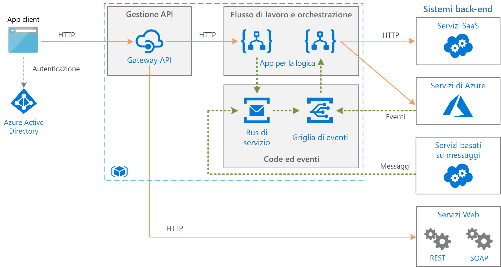

# Integrazione aziendale in Azure con code ed eventi di messaggi

Questa architettura di riferimento integra i sistemi back-end aziendali mediante code ed eventi di messaggi per disaccoppiare i servizi per una maggiore scalabilità e affidabilità. I sistemi back-end possono includere sistemi software come un servizio (SaaS), servizi di Azure e servizi Web esistenti nell'organizzazione.

## Architettura

L'architettura illustrata in questo articolo si basa su un'architettura più semplice illustrata nell'articolo [Integrazione aziendale di base][basic-enterprise-integration]. Questa architettura usa [App per la logica][logic-apps] per orchestrare i flussi di lavoro e [Gestione API][apim] per creare cataloghi di API.

Questa versione dell'architettura aggiunge due componenti che contribuiscono a rendere il sistema più affidabile e scalabile:

- **[Bus di servizio di Azure][service-bus]**. Il bus di servizio è un broker di messaggi sicuro e affidabile.

- **[Griglia di eventi di Azure][event-grid]**. Griglia di eventi è un servizio di routing di eventi. Usa un modello di gestione degli eventi di [pubblicazione/sottoscrizione](../../patterns/publisher-subscriber.md) (pub/sub).

La comunicazione asincrona tramite un broker di messaggi offre una serie di vantaggi rispetto alle chiamate sincrone dirette ai servizi back-end:

- Fornisce il livellamento del carico per gestire i picchi di carichi di lavoro usando lo [Schema di livellamento del carico basato sulle code](../../patterns/queue-based-load-leveling.md).
- Tiene traccia in modo affidabile dello stato di avanzamento dei flussi di lavoro a esecuzione prolungata che coinvolgono più fasi o più applicazioni.
- Consente di disaccoppiare le applicazioni.
- Si integra con i sistemi di messaggistica esistenti.
- Consente di mettere in coda un lavoro quando non è disponibile un sistema back-end.

Griglia di eventi consente ai vari componenti del sistema di reagire agli eventi man mano che si verificano, anziché basarsi su attività pianificate o di polling. Come per una coda di messaggi, consente di disaccoppiare applicazioni e servizi. Un'applicazione o un servizio può pubblicare eventi e i sottoscrittori interessati riceveranno una notifica. È possibile aggiungere nuovi sottoscrittori senza aggiornare il mittente.

Molti servizi di Azure seguenti supportano l'invio degli eventi a Griglia di eventi. Ad esempio, un'app per la logica può essere in ascolto di un evento quando nuovi file vengono aggiunti a un archivio BLOB. Questo modello consente flussi di lavoro reattivi, in cui il caricamento di un file o l'inserimento di un messaggio in coda dà il via a una serie di processi. I processi possono essere eseguiti in parallelo o in una sequenza specifica.

## Consigli

A questa architettura si applicano i consigli descritti in [Integrazione aziendale di base][basic-enterprise-integration]. Si applicano anche i consigli seguenti:

### Bus di servizio

Il bus di servizio supporta due modalità di recapito: *pull* o *push*. Nel modello pull il ricevitore esegue continuamente il polling di nuovi messaggi. Il polling può risultare inefficiente, soprattutto se si hanno molte code ognuna delle quali riceve pochi messaggi o se intercorre molto tempo tra un messaggio e l'altro. Nel modello push il bus di servizio invia un evento tramite Griglia di eventi quando sono presenti nuovi messaggi. Il ricevitore sottoscrive l'evento. Quando viene attivato l'evento, il ricevitore eseguire il pull del successivo batch di messaggi dal bus di servizio.

Quando si crea un'app per la logica per utilizzare i messaggi del bus di servizio, è consigliabile usare il modello push con l'integrazione di Griglia di eventi. Spesso è più efficiente in termini di costi, perché l'app per la logica non deve eseguire il polling del bus di servizio. Per altre informazioni, vedere [Panoramica dell'integrazione del bus di servizio di Azure in Griglia di eventi](/azure/service-bus-messaging/service-bus-to-event-grid-integration-concept). Attualmente, è necessario il [livello Premium](https://azure.microsoft.com/pricing/details/service-bus/) del bus di servizio per le notifiche di Griglia di eventi.

Usare [PeekLock](/azure/service-bus-messaging/service-bus-messaging-overview#queues) per accedere a un gruppo di messaggi. Con PeekLock, l'app per la logica può eseguire i passaggi per convalidare ogni messaggio prima di completarlo o abbandonarlo. Questo approccio protegge dalla perdita accidentale dei messaggi.

### Griglia di eventi

Quando viene attivato un trigger di Griglia di eventi, significa che si è verificato *almeno* un evento. Ad esempio, quando un'app per la logica riceve un trigger di Griglia di eventi per un messaggio del bus di servizio, dovrebbe presumere che diversi messaggi potrebbero essere disponibili per l'elaborazione.

Griglia di eventi usa un modello senza server. La fatturazione viene calcolata in base al numero di operazioni (esecuzioni di eventi). Per altre informazioni, vedere [Prezzi di Griglia di eventi](https://azure.microsoft.com/pricing/details/event-grid/). Attualmente non sono previste indicazioni per la scelta del piano tariffario per Griglia di eventi.

## Considerazioni sulla scalabilità

Il piano Premium del bus di servizio consente di aumentare il numero di unità di messaggistica per offrire una maggiore scalabilità. Le configurazioni del piano Premium possono prevedere una, due o quattro unità di messaggistica. Per altre informazioni sul ridimensionamento del bus di servizio, vedere [Procedure consigliate per il miglioramento delle prestazioni tramite la messaggistica del bus di servizio](/azure/service-bus-messaging/service-bus-performance-improvements).

## Considerazioni sulla disponibilità

Esaminare il contratto per ogni servizio:

- [Contratto di servizio di Gestione API][apim-sla]
- [Contratto di Servizio per Griglia di eventi][event-grid-sla]
- [Contratto di servizio di App per la logica][logic-apps-sla]
- [Contratto di Servizio per Bus di servizio][sb-sla]

Nell'ambito del piano Premium del bus di servizio è consigliabile implementare il ripristino di emergenza geografico per abilitare il failover in caso di grave interruzione. Per altre informazioni, vedere [Ripristino di emergenza geografico per il bus di servizio di Azure](/azure/service-bus-messaging/service-bus-geo-dr).

## Considerazioni relative alla sicurezza

Per proteggere il bus di servizio, usare una firma di accesso condiviso (SAS). È possibile usare l'[autenticazione basata sulla firma di accesso condiviso](/azure/service-bus-messaging/service-bus-sas) per concedere agli utenti l'accesso alle risorse del bus di servizio con diritti specifici. Per altre informazioni, vedere [Autenticazione e autorizzazione del bus di servizio](/azure/service-bus-messaging/service-bus-authentication-and-authorization).

Se è necessario esporre una coda del bus di servizio come endpoint HTTP, ad esempio per la pubblicazione nuovi messaggi, utilizzare Gestione API per proteggere la coda mettendo al sicuro l'endpoint. L'endpoint può quindi essere protetto tramite certificati o autenticazione OAuth, a seconda delle esigenze. Il modo più semplice per proteggere un endpoint è quello di usare un'app per la logica con un trigger di richiesta/risposta HTTP come intermediario.

Il servizio Griglia di eventi consente di proteggere il recapito dell'evento tramite un codice di convalida. Se si usa App per la logica per gestire l'evento, la convalida viene eseguita automaticamente. Per altre informazioni, vedere [Event Grid security and authentication](/azure/event-grid/security-authentication) (Sicurezza e autenticazione di Griglia di eventi).

[apim]: /azure/api-management
[apim-sla]: https://azure.microsoft.com/support/legal/sla/api-management/
[event-grid]: /azure/event-grid/
[event-grid-sla]: https://azure.microsoft.com/support/legal/sla/event-grid
[logic-apps]: /azure/logic-apps/logic-apps-overview
[logic-apps-sla]: https://azure.microsoft.com/support/legal/sla/logic-apps
[sb-sla]: https://azure.microsoft.com/support/legal/sla/service-bus/
[service-bus]: /azure/service-bus-messaging/
[basic-enterprise-integration]: ./basic-enterprise-integration.md
