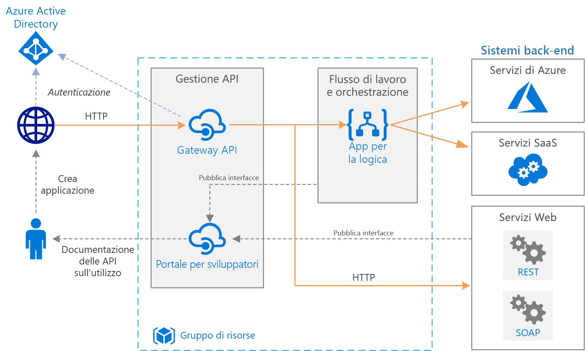

# Integrazione aziendale semplice

Questa architettura di riferimento usa i [servizi di integrazione di Azure Services][integration-services] per orchestrare le chiamate ai sistemi back-end aziendali. I sistemi back-end possono includere sistemi software come un servizio (SaaS), servizi di Azure e servizi Web esistenti nell'organizzazione.

I servizi di integrazione di Azure includono servizi per integrare applicazioni e dati. Questa architettura usa due di questi servizi: [App per la logica][logic-apps], per orchestrare i flussi di lavoro, e [Gestione API][apim], per creare cataloghi di API.

## Architettura

L'architettura include i componenti seguenti:

- **Sistemi back-end**. A destra del diagramma ci sono i diversi sistemi back-end che l'organizzazione ha distribuito o sui cui si basa. Possono includere sistemi SaaS, altri servizi di Azure o servizi Web che espongono gli endpoint REST o SOAP.

- **App per la logica di Azure**. [App per la logica][logic-apps] è una piattaforma serverless per la creazione di flussi di lavoro aziendali che integrano applicazioni, dati e servizi. In questa architettura le app per la logica sono attivate da richieste HTTP. È inoltre possibile annidare i flussi di lavoro per un'orchestrazione più complessa. App per la logica usa [connettori][logic-apps-connectors] per integrarsi con i servizi di uso comune. App per la logica offre centinaia di connettori ed è possibile creare connettori personalizzati.

- **Gestione API di Azure**. [Gestione API][apim] è un servizio gestito per pubblicare cataloghi di API HTTP in modo da promuovere il riuso e l'individuazione. Gestione API consiste di due componenti correlati:

    - **Gateway API**. Il gateway API accetta le chiamate HTTP e le instrada al back-end. 

    - **Portale per sviluppatori**. Ogni istanza di Gestione API di Azure offre accesso a un [portale per sviluppatori][apim-dev-portal]. Il portale offre agli sviluppatori l'accesso alla documentazione e agli esempi di codice per chiamare le API. Nel portale per sviluppatori è possibile anche testare le API.

    In questa architettura le API composite vengono costruite [importando app per la logica][apim-logic-app] come API. È anche possibile importare i servizi Web esistenti [importando le specifiche di OpenAPI][apim-openapi] (Swagger) o [importando le API SOAP][apim-soap] dalle specifiche di WSDL. 

    Il gateway API consente di disaccoppiare i client front-end da quelli back-end. È possibile, ad esempio, riscrivere gli URL o trasformare le richieste prima che raggiungano il back-end. Gestisce anche molte problematiche trasversali come autenticazione, supporto della condivisione di risorse tra le origini (CORS) e memorizzazione nella cache della risposta.

- **DNS di Azure**. [DNS di Azure][dns] è un servizio di hosting per i domini DNS che fornisce la risoluzione dei nomi tramite l'infrastruttura di Microsoft Azure. Ospitando i domini in Azure, è possibile gestire i record DNS usando le credenziali, le API, gli strumenti e il sistema di fatturazione degli altri servizi di Azure. Per usare un nome di dominio personalizzato, ad esempio contoso.com, creare record DNS che eseguono il mapping del nome di dominio personalizzato all'indirizzo IP. Per altre informazioni, vedere [Configurare un nome di dominio personalizzato in Gestione API][apim-domain].

- **Azure Active Directory (Azure AD)**. Usare [Azure AD][aad] per autenticare i client che chiamano il gateway API. Azure AD supporta il protocollo OpenID Connect. I client ottengono un token di accesso da Azure AD e il gateway API [convalida il token][apim-jwt] per autorizzare la richiesta. Quando si usa il livello Standard o Premium di Gestione API, Azure AD può anche proteggere l'accesso al portale per sviluppatori.

## Consigli

I requisiti specifici dell'utente possono variare rispetto all'architettura generica descritta illustrata qui. Seguire le raccomandazioni contenute in questa sezione come punto di partenza.

### Gestione API

Usare i livelli di Gestione API Basic, Standard o Premium perché offrono un contratto di servizio di produzione e supportano l'aumento delle istanze nell'area di Azure. La capacità della velocità effettiva per Gestione API viene misurata in *unità*. Ogni piano tariffario prevede un limite massimo di aumento delle istanze. Il livello Premium supporta anche l'aumento delle istanze in più aree di Azure. Scegliere il livello adeguato alle proprie esigenze in base al set di funzionalità e al livello di velocità effettiva necessaria. Per altre informazioni, vedere [Prezzi di Gestione API][apim-pricing] e [Capacità di un'istanza di Gestione API di Azure][apim-capacity].

Ogni istanza di Gestione API di Azure ha un nome di dominio predefinito, ovvero un sottodominio di `azure-api.net`, ad esempio `contoso.azure-api.net`. Si consiglia di configurare un [dominio personalizzato][apim-domain] per l'organizzazione.

### App per la logica 

App per la logica funziona meglio negli scenari che non richiedono una latenza bassa. È particolarmente consigliata ad esempio per le chiamate API asincrone o a esecuzione semi prolungata. Se è richiesta una latenza bassa, ad esempio nel caso di chiamate che bloccano un'interfaccia utente, è consigliabile implementare l'operazione o l'API usando una tecnologia diversa, ad esempio Funzioni di Azure o l'API Web distribuita tramite Servizio app. Usare Gestione API a fronte dell'API per i consumer di API.

### Region

Per ridurre la latenza di rete, collocare Gestione API e App per la logica nella stessa area. In genere è consigliabile scegliere l'area più vicina agli utenti (o più vicina ai servizi back-end).

Anche il gruppo di risorse è associato a un'area Questa area specifica il percorso in cui archiviare i metadati di distribuzione e in cui eseguire il modello di distribuzione. Per migliorare la disponibilità durante la distribuzione, aggiungere il gruppo di risorse e le risorse nella stessa area.

## Considerazioni sulla scalabilità

Per migliorare la scalabilità di Gestione API, aggiungere [criteri di memorizzazione nella cache][apim-caching] laddove appropriato e ridurre il carico sui servizi di back-end.

Per offrire una maggiore capacità, è possibile effettuare lo scale-out dei livelli Basic, Standard e Premium di Gestione API di Azure in un'area di Azure. Per analizzare l'utilizzo per il servizio, nel menu **Metriche** selezionare l'opzione **Metrica della capacità** e quindi aumentare o ridurre le prestazioni in base alle esigenze. Il processo di aggiornamento o ridimensionamento può richiedere da 15 a 45 minuti.

Elementi consigliati per la scalabilità di un servizio Gestione API:

- Quando si scala un servizio, considerare i modelli di traffico. I clienti con modelli di traffico più volatili necessitano di una capacità maggiore.

- Una capacità costante superiore al 66% può indicare la necessità di aumentare le prestazioni.

- Una capacità costante inferiore al 20% può indicare un'opportunità per ridurre le prestazioni.

- Prima di consentire il carico in produzione, è sempre consigliabile testare il carico nel servizio di Gestione API usando un carico rappresentativo.

Con il livello Premium, è possibile scalare un'istanza di Gestione API in più aree di Azure. In questo modo Gestione API è idoneo a un contratto di servizio superiore e consente di eseguire il provisioning dei servizi in prossimità degli utenti in più aree.

Il modello serverless di App per la logica di Azure prevede che gli amministratori non debbano pianificare la scalabilità dei servizi. Il servizio offre scalabilità automatica per soddisfare la richiesta.

## Considerazioni sulla disponibilità

Esaminare il contratto per ogni servizio:

- [Contratto di servizio di Gestione API][apim-sla]
- [Contratto di servizio di App per la logica][logic-apps-sla]

Se Gestione API è distribuito in due o più aree con il livello Premium, è idoneo a un contratto di servizio superiore. Vedere [Prezzi di Gestione API][apim-pricing].

### Backup

[Eseguire regolarmente il backup][apim-backup] della configurazione di Gestione API. Archiviare i file di backup in una posizione o un'area di Azure diversa rispetto a quella in cui è distribuito il servizio. Scegliere una strategia di ripristino di emergenza in base all'[RTO][rto]:

* In caso di ripristino di emergenza effettuare il provisioning di una nuova istanza di Gestione API, ripristinare il backup nella nuova istanza ed eseguire un nuovo puntamento dei record DNS.

* Mantenere un'istanza passiva del servizio Gestione API in un'altra area di Azure. Ripristinare regolarmente i backup nell'istanza, in modo da mantenerla sincronizzata con il servizio attivo. Per ripristinare il servizio durante un evento di ripristino di emergenza, occorre solo eseguire un nuovo puntamento dei record DNS. Questo approccio comporta un costo aggiuntivo perché l'istanza passiva è a pagamento, tuttavia riduce i tempi di recupero. 

Per le app per la logica, è consigliabile un approccio di configurazione come codice per il backup e ripristino. Poiché le app per la logica sono serverless, è possibile ricrearle rapidamente da modelli di Azure Resource Manager. Salvare i modelli nel controllo del codice sorgente e integrare i modelli con il processo di integrazione continua/distribuzione continua (CI/CD). In un evento di ripristino di emergenza, distribuire il modello in una nuova area.

Se si distribuisce un'app per la logica in un'area diversa, aggiornare la configurazione in Gestione API. È possibile aggiornare la proprietà **back-end** dell'API usando uno script di PowerShell di base.

## Considerazioni sulla gestibilità

Creare gruppi di risorse separati per gli ambienti di produzione, sviluppo e test. L'uso di gruppi di risorse separati semplifica la gestione delle distribuzioni, l'eliminazione delle distribuzioni di test e l'assegnazione dei diritti di accesso.

Quando si assegnano risorse a gruppi di risorse, considerare i fattori seguenti:

* **Ciclo di vita**. In generale, includere le risorse con un ciclo di vita identico nello stesso gruppo.

* **Accesso**. Per applicare i criteri di accesso alle risorse in un gruppo, è possibile usare il [controllo degli accessi in base al ruolo][rbac].

* **Fatturazione**. È possibile visualizzare il riepilogo dei costi per il gruppo di risorse.

* **Piano tariffario per Gestione API**. Per gli ambienti di sviluppo e test è opportuno usare un livello Developer. Per ridurre al minimo i costi durante la pre-produzione, distribuire una replica dell'ambiente di produzione, eseguire i test e quindi arrestare il sistema.

### Distribuzione

Per distribuire le risorse di Azure, usare i [modelli di Azure Resource Manager][arm], che semplificano l'automazione delle distribuzioni tramite PowerShell o l'interfaccia della riga di comando di Azure.

Aggiungere Gestione API e qualsiasi app per la logica individuale nei rispettivi modelli di Resource Manager separati. L'uso di modelli separati consente di archiviare le risorse in sistemi di controllo del codice sorgente. È quindi possibile distribuire questi modelli insieme o separatamente come parte di un processo di integrazione continua/distribuzione continua (CI/CD).

### Versioni

Ogni volta che si modifica la configurazione di un'app per la logica o si distribuisce un aggiornamento attraverso un modello di Resource Manager, Azure conserva una copia di tale versione oltre a tutte le versioni che hanno una cronologia di esecuzione. È possibile usare queste versioni per tenere traccia delle modifiche cronologiche o per promuovere una versione come configurazione corrente dell'app per la logica. Ad esempio, è possibile eseguire il rollback di un'app per la logica a una versione precedente.

Gestione API include due concetti di controllo delle versioni distinti ma complementari:

* *Versioni*: consentono ai consumer di API di scegliere una versione dell'API in base alle esigenze, ad esempio v1, v2, beta o di produzione.

* *Revisioni*: consentono agli amministratori di API di apportare modifiche che non causano interruzioni e distribuirle insieme a un log delle modifiche per informare i consumer di API.

È possibile effettuare una revisione in un ambiente di sviluppo e distribuire la modifica in altri ambienti usando i modelli di Resource Manager. Per altre informazioni, vedere [Pubblicare più versioni dell'API][apim-versions]

È anche possibile usare le revisioni per testare un'API prima di rendere le modifiche attuali e accessibili agli utenti. Tuttavia, questo metodo non è consigliato per test di carico o test di integrazione. Utilizzare invece ambienti di test o di preproduzione separati.

## Diagnostica e monitoraggio

Usare [Monitoraggio di Azure][monitor] per il monitoraggio operativo sia in Gestione API che in App per la logica. Il servizio Monitoraggio di Azure include informazioni basate sulle metriche configurate per ogni servizio ed è abilitato per impostazione predefinita. Per altre informazioni, vedere:

- [Monitorare le API pubblicate][apim-monitor]
- [Monitorare lo stato, configurare la registrazione diagnostica e attivare gli avvisi per App per la logica di Azure][logic-apps-monitor]

Ogni servizio dispone inoltre di queste opzioni:

* Per un'analisi approfondita e la creazione di dashboard, inviare i registri di App per la logica ad [Azure Log Analytics][logic-apps-log-analytics].

* Per il monitoraggio DevOps, configurare Azure Application Insights per Gestione API.

* Gestione API supporta il [modello di soluzione Power BI per l'analisi personalizzata delle API][apim-pbi]. È possibile usare questo modello di soluzione per creare una soluzione di analisi personalizzata. Per gli utenti aziendali sono disponibili report in Power BI.

## Considerazioni relative alla sicurezza

Sebbene questo elenco non descriva completamente tutte le procedure consigliate per la sicurezza, ecco alcune considerazioni sulla sicurezza che si applicano nello specifico a questa architettura:

* Il servizio Gestione API di Azure ha un indirizzo IP pubblico fisso. Limitare l'accesso per chiamare gli endpoint di App per la logica esclusivamente all'indirizzo IP di Gestione API. Per altre informazioni, vedere [Limitare gli indirizzi IP in ingresso][logic-apps-restrict-ip].

* Per assicurarsi che gli utenti dispongano dei livelli di accesso appropriati, usare il controllo degli accessi in base al ruolo.

* Proteggere gli endpoint dell'API pubblici in Gestione API tramite OAuth o OpenID Connect. Per proteggere gli endpoint dell'API pubblici, configurare un provider di identità e aggiungere criteri di convalida JSON Web Token (JWT). Per maggiori informazioni, vedere [Proteggere un'API usando OAuth 2.0 con Azure Active Directory e Gestione API][apim-oauth].

* Connettersi ai servizi back-end da Gestione API usando certificati basati sull'autenticazione reciproca.

* Imporre HTTPS nelle API di Gestione API.

### Archiviazione dei segreti

Non archiviare mai le password, le chiavi di accesso o le stringhe di connessione nel controllo del codice sorgente, Se questi valori sono necessari, usare le tecniche appropriate per distribuire e proteggere questi valori. 

Se un'app per la logica richiede qualsiasi valore sensibile che non è possibile creare all'interno di un connettore, archiviare questo valore in Azure Key Vault e farvi riferimento da un modello di Resource Manager. Usare i parametri del modello di distribuzione e i file di parametri per ogni ambiente. Per altre informazioni consultare [Proteggere i parametri e gli input all'interno di un flusso di lavoro][logic-apps-secure].

In Gestione API i segreti vengono gestiti usando oggetti chiamati *Valori denominati* o *Proprietà*. Questi oggetti archiviano in modo sicuro valori a cui è possibile accedere attraverso i criteri di Gestione API. Per altre informazioni vedere [Come usare i valori denominati nei criteri di Gestione API di Azure][apim-properties].

## Considerazioni sul costo

Tutte le istanze di Gestione API comportano un addebito quando sono in esecuzione. Se sono state aumentate le prestazioni e tale livello di prestazioni non è costantemente necessario, passare manualmente a un piano inferiore o configurare la [scalabilità automatica][apim-autoscale].

App per la logica funziona come modello [senza server](/azure/logic-apps/logic-apps-serverless-overview). La fatturazione viene calcolata in base all'esecuzione del connettore e dell'azione. Per altre informazioni, vedere [Prezzi di App per la logica](https://azure.microsoft.com/pricing/details/logic-apps/). Attualmente non sono disponibili considerazioni per la scelta del livello per App per la logica.

## Passaggi successivi

* Altre informazioni sull'[integrazione aziendale con code ed eventi](/azure/logic-apps/logic-apps-architectures-enterprise-integration-with-queues-events)

<!-- links -->

[aad]: /azure/active-directory
[apim]: /azure/api-management
[apim-autoscale]: /azure/api-management/api-management-howto-autoscale
[apim-backup]: /azure/api-management/api-management-howto-disaster-recovery-backup-restore
[apim-caching]: /azure/api-management/api-management-howto-cache
[apim-capacity]: /azure/api-management/api-management-capacity
[apim-dev-portal]: /azure/api-management/api-management-key-concepts#a-namedeveloper-portal-a-developer-portal
[apim-domain]: /azure/api-management/configure-custom-domain
[apim-jwt]: /azure/api-management/policies/authorize-request-based-on-jwt-claims
[apim-logic-app]: /azure/api-management/import-logic-app-as-api
[apim-monitor]: /azure/api-management/api-management-howto-use-azure-monitor
[apim-oauth]: /azure/api-management/api-management-howto-protect-backend-with-aad
[apim-openapi]: /azure/api-management/import-api-from-oas
[apim-pbi]: http://aka.ms/apimpbi
[apim-pricing]: https://azure.microsoft.com/pricing/details/api-management/
[apim-properties]: /azure/api-management/api-management-howto-properties
[apim-sla]: https://azure.microsoft.com/support/legal/sla/api-management/
[apim-soap]: /azure/api-management/import-soap-api
[apim-versions]: /azure/api-management/api-management-get-started-publish-versions
[arm]: /azure/azure-resource-manager/resource-group-authoring-templates
[dns]: /azure/dns/
[integration-services]: https://azure.microsoft.com/product-categories/integration/
[logic-apps]: /azure/logic-apps/logic-apps-overview
[logic-apps-connectors]: /azure/connectors/apis-list
[logic-apps-log-analytics]: /azure/logic-apps/logic-apps-monitor-your-logic-apps-oms
[logic-apps-monitor]: /azure/logic-apps/logic-apps-monitor-your-logic-apps
[logic-apps-restrict-ip]: /azure/logic-apps/logic-apps-securing-a-logic-app#restrict-incoming-ip-addresses
[logic-apps-secure]: /azure/logic-apps/logic-apps-securing-a-logic-app#secure-parameters-and-inputs-within-a-workflow
[logic-apps-sla]: https://azure.microsoft.com/support/legal/sla/logic-apps
[monitor]: /azure/azure-monitor/overview
[rbac]: /azure/role-based-access-control/overview
[rto]: ../../resiliency/index.md#rto-and-rpo