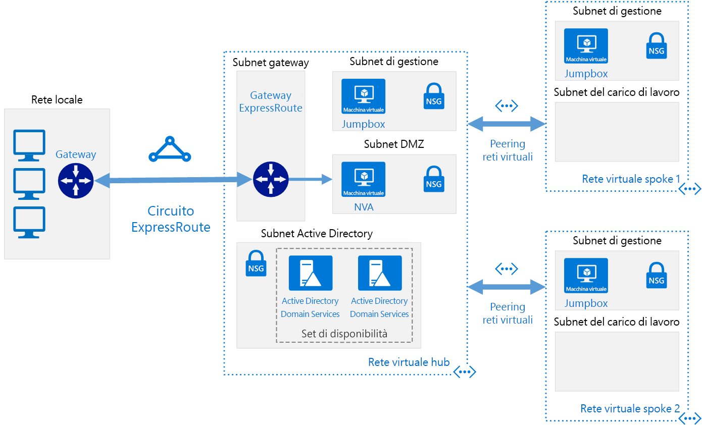

# <a name="implement-a-hub-spoke-network-topology-with-shared-services-in-azure"></a><span data-ttu-id="a26c0-103">Implementare una topologia di rete hub-spoke con servizi condivisi in Azure</span><span class="sxs-lookup"><span data-stu-id="a26c0-103">Implement a hub-spoke network topology with shared services in Azure</span></span>

<span data-ttu-id="a26c0-104">Questa architettura di riferimento, basata sull'architettura di riferimento [hub-spoke][guidance-hub-spoke], include nell'hub servizi condivisi che potranno essere utilizzati da tutti gli spoke.</span><span class="sxs-lookup"><span data-stu-id="a26c0-104">This reference architecture builds on the [hub-spoke][guidance-hub-spoke] reference architecture to include shared services in the hub that can be consumed by all spokes.</span></span> <span data-ttu-id="a26c0-105">Come primo passo per la migrazione di un data center al cloud e la creazione di un [data center virtuale], i primi servizi da condividere sono quelli di gestione delle identità e di sicurezza.</span><span class="sxs-lookup"><span data-stu-id="a26c0-105">As a first step toward migrating a datacenter to the cloud, and building a [virtual datacenter], the first services you need to share are identity and security.</span></span> <span data-ttu-id="a26c0-106">Questa architettura di riferimento illustra come estendere i servizi di Active Directory dal data center locale ad Azure e come aggiungere un'appliance virtuale di rete che possa fungere da firewall in una topologia hub-spoke.</span><span class="sxs-lookup"><span data-stu-id="a26c0-106">This reference architecture shows you how to extend your Active Directory services from your on-premises datacenter to Azure, and how to add a network virtual appliance (NVA) that can act as a firewall, in a hub-spoke topology.</span></span>  <span data-ttu-id="a26c0-107">[**Distribuire questa soluzione**](#deploy-the-solution).</span><span class="sxs-lookup"><span data-stu-id="a26c0-107">[**Deploy this solution**](#deploy-the-solution).</span></span>

> [!NOTE]
> <span data-ttu-id="a26c0-108">Questo scenario può essere eseguito anche usando [Firewall di Azure](/azure/firewall/), un servizio di sicurezza di rete basato sul cloud.</span><span class="sxs-lookup"><span data-stu-id="a26c0-108">This scenario can also be accomplished using [Azure Firewall](/azure/firewall/), a cloud-based network security service.</span></span>



<span data-ttu-id="a26c0-110">*Scaricare un [file di Visio][visio-download] di questa architettura*</span><span class="sxs-lookup"><span data-stu-id="a26c0-110">*Download a [Visio file][visio-download] of this architecture*</span></span>

<span data-ttu-id="a26c0-111">I vantaggi di questa topologia includono:</span><span class="sxs-lookup"><span data-stu-id="a26c0-111">The benefits of this topology include:</span></span>

- <span data-ttu-id="a26c0-112">**Risparmio sui costi**, centralizzando in un'unica posizione i servizi che possono essere condivisi da più carichi di lavoro, ad esempio appliance virtuali di rete e server DNS.</span><span class="sxs-lookup"><span data-stu-id="a26c0-112">**Cost savings** by centralizing services that can be shared by multiple workloads, such as network virtual appliances (NVAs) and DNS servers, in a single location.</span></span>
- <span data-ttu-id="a26c0-113">**Superamento dei limiti delle sottoscrizioni** eseguendo il peering delle reti virtuali da sottoscrizioni diverse all'hub centrale.</span><span class="sxs-lookup"><span data-stu-id="a26c0-113">**Overcome subscriptions limits** by peering VNets from different subscriptions to the central hub.</span></span>
- <span data-ttu-id="a26c0-114">**Separazione dei compiti** tra IT centrale (SecOPs, InfraOps) e carichi di lavoro (DevOps).</span><span class="sxs-lookup"><span data-stu-id="a26c0-114">**Separation of concerns** between central IT (SecOps, InfraOps) and workloads (DevOps).</span></span>

<span data-ttu-id="a26c0-115">Tra gli usi tipici di questa architettura vi sono:</span><span class="sxs-lookup"><span data-stu-id="a26c0-115">Typical uses for this architecture include:</span></span>

- <span data-ttu-id="a26c0-116">Carichi di lavoro distribuiti in ambienti diversi, ad esempio sviluppo, test e produzione, che richiedono servizi condivisi, ad esempio DNS, IDS, NTP o Active Directory Domain Services.</span><span class="sxs-lookup"><span data-stu-id="a26c0-116">Workloads deployed in different environments, such as development, testing, and production, that require shared services such as DNS, IDS, NTP, or AD DS.</span></span> <span data-ttu-id="a26c0-117">I servizi condivisi vengono inseriti nella rete virtuale dell'hub, mentre ogni ambiente viene distribuito in uno spoke per mantenere l'isolamento.</span><span class="sxs-lookup"><span data-stu-id="a26c0-117">Shared services are placed in the hub VNet, while each environment is deployed to a spoke to maintain isolation.</span></span>
- <span data-ttu-id="a26c0-118">Carichi di lavoro che non richiedono connettività uno con l'altro, ma richiedono l'accesso ai servizi condivisi.</span><span class="sxs-lookup"><span data-stu-id="a26c0-118">Workloads that do not require connectivity to each other, but require access to shared services.</span></span>
- <span data-ttu-id="a26c0-119">Aziende che richiedono il controllo centrale sugli aspetti di sicurezza, ad esempio un firewall nell'hub come rete perimetrale, e gestione separata per i carichi di lavoro in ogni spoke.</span><span class="sxs-lookup"><span data-stu-id="a26c0-119">Enterprises that require central control over security aspects, such as a firewall in the hub as a DMZ, and segregated management for the workloads in each spoke.</span></span>

## <a name="architecture"></a><span data-ttu-id="a26c0-120">Architettura</span><span class="sxs-lookup"><span data-stu-id="a26c0-120">Architecture</span></span>

<span data-ttu-id="a26c0-121">L'architettura è costituita dai componenti seguenti.</span><span class="sxs-lookup"><span data-stu-id="a26c0-121">The architecture consists of the following components.</span></span>

- <span data-ttu-id="a26c0-122">**Rete locale**.</span><span class="sxs-lookup"><span data-stu-id="a26c0-122">**On-premises network**.</span></span> <span data-ttu-id="a26c0-123">Una rete LAN privata in esecuzione all'interno di un'organizzazione.</span><span class="sxs-lookup"><span data-stu-id="a26c0-123">A private local-area network running within an organization.</span></span>

- <span data-ttu-id="a26c0-124">**Dispositivo VPN**.</span><span class="sxs-lookup"><span data-stu-id="a26c0-124">**VPN device**.</span></span> <span data-ttu-id="a26c0-125">Un dispositivo o un servizio che offre connettività esterna alla rete locale.</span><span class="sxs-lookup"><span data-stu-id="a26c0-125">A device or service that provides external connectivity to the on-premises network.</span></span> <span data-ttu-id="a26c0-126">Il dispositivo VPN può essere un dispositivo hardware o una soluzione software, ad esempio il Servizio Routing e Accesso remoto (RRAS) in Windows Server 2012.</span><span class="sxs-lookup"><span data-stu-id="a26c0-126">The VPN device may be a hardware device, or a software solution such as the Routing and Remote Access Service (RRAS) in Windows Server 2012.</span></span> <span data-ttu-id="a26c0-127">Per un elenco delle appliance VPN supportate e per informazioni sulla configurazione di appliance VPN selezionate per connettersi ad Azure, vedere [Informazioni sui dispositivi VPN per le connessioni di gateway VPN da sito a sito][vpn-appliance].</span><span class="sxs-lookup"><span data-stu-id="a26c0-127">For a list of supported VPN appliances and information on configuring selected VPN appliances for connecting to Azure, see [About VPN devices for Site-to-Site VPN Gateway connections][vpn-appliance].</span></span>

- <span data-ttu-id="a26c0-128">**Gateway di rete virtuale VPN o gateway ExpressRoute**.</span><span class="sxs-lookup"><span data-stu-id="a26c0-128">**VPN virtual network gateway or ExpressRoute gateway**.</span></span> <span data-ttu-id="a26c0-129">Il gateway di rete virtuale consente di connettere la rete virtuale al dispositivo VPN o al circuito ExpressRoute usato per la connettività con la propria rete locale.</span><span class="sxs-lookup"><span data-stu-id="a26c0-129">The virtual network gateway enables the VNet to connect to the VPN device, or ExpressRoute circuit, used for connectivity with your on-premises network.</span></span> <span data-ttu-id="a26c0-130">Per altre informazioni, vedere [Connettere una rete locale a una rete virtuale di Microsoft Azure][connect-to-an-Azure-vnet].</span><span class="sxs-lookup"><span data-stu-id="a26c0-130">For more information, see [Connect an on-premises network to a Microsoft Azure virtual network][connect-to-an-Azure-vnet].</span></span>

> [!NOTE]
> <span data-ttu-id="a26c0-131">Gli script di distribuzione per questa architettura di riferimento usano un gateway VPN per la connettività e una rete virtuale in Azure per simulare la rete locale.</span><span class="sxs-lookup"><span data-stu-id="a26c0-131">The deployment scripts for this reference architecture use a VPN gateway for connectivity, and a VNet in Azure to simulate your on-premises network.</span></span>

- <span data-ttu-id="a26c0-132">**Rete virtuale dell'hub**.</span><span class="sxs-lookup"><span data-stu-id="a26c0-132">**Hub VNet**.</span></span> <span data-ttu-id="a26c0-133">Rete virtuale di Azure usata come hub nella topologia hub-spoke.</span><span class="sxs-lookup"><span data-stu-id="a26c0-133">Azure VNet used as the hub in the hub-spoke topology.</span></span> <span data-ttu-id="a26c0-134">L'hub è il punto di connettività centrale alla rete locale e offre una posizione in cui ospitare servizi che possono essere utilizzati da carichi di lavoro diversi ospitati nelle reti virtuali spoke.</span><span class="sxs-lookup"><span data-stu-id="a26c0-134">The hub is the central point of connectivity to your on-premises network, and a place to host services that can be consumed by the different workloads hosted in the spoke VNets.</span></span>

- <span data-ttu-id="a26c0-135">**Subnet del gateway**.</span><span class="sxs-lookup"><span data-stu-id="a26c0-135">**Gateway subnet**.</span></span> <span data-ttu-id="a26c0-136">I gateway di rete virtuale vengono mantenuti nella stessa subnet.</span><span class="sxs-lookup"><span data-stu-id="a26c0-136">The virtual network gateways are held in the same subnet.</span></span>

- <span data-ttu-id="a26c0-137">**Subnet dei servizi condivisi**.</span><span class="sxs-lookup"><span data-stu-id="a26c0-137">**Shared services subnet**.</span></span> <span data-ttu-id="a26c0-138">Una subnet nella rete virtuale dell'hub usata per ospitare servizi che possono essere condivisi tra tutti gli spoke, ad esempio DNS o Active Directory Domain Services.</span><span class="sxs-lookup"><span data-stu-id="a26c0-138">A subnet in the hub VNet used to host services that can be shared among all spokes, such as DNS or AD DS.</span></span>

- <span data-ttu-id="a26c0-139">**Subnet della rete perimetrale**.</span><span class="sxs-lookup"><span data-stu-id="a26c0-139">**DMZ subnet**.</span></span> <span data-ttu-id="a26c0-140">Subnet nella rete virtuale hub usata per ospitare appliance virtuali di rete che possono fungere da appliance di sicurezza, ad esempio da firewall.</span><span class="sxs-lookup"><span data-stu-id="a26c0-140">A subnet in the hub VNet used to host NVAs that can act as security appliances, such as firewalls.</span></span>

- <span data-ttu-id="a26c0-141">**Reti virtuali spoke**.</span><span class="sxs-lookup"><span data-stu-id="a26c0-141">**Spoke VNets**.</span></span> <span data-ttu-id="a26c0-142">Una o più reti virtuali di Azure usate come spoke nella topologia hub-spoke.</span><span class="sxs-lookup"><span data-stu-id="a26c0-142">One or more Azure VNets that are used as spokes in the hub-spoke topology.</span></span> <span data-ttu-id="a26c0-143">Gli spoke possono essere usati per isolare i carichi di lavoro nelle reti virtuali corrispondenti, gestite separatamente rispetto agli altri spoke.</span><span class="sxs-lookup"><span data-stu-id="a26c0-143">Spokes can be used to isolate workloads in their own VNets, managed separately from other spokes.</span></span> <span data-ttu-id="a26c0-144">Ogni carico di lavoro può includere più livelli, con più subnet connesse tramite i servizi di bilanciamento del carico di Azure.</span><span class="sxs-lookup"><span data-stu-id="a26c0-144">Each workload might include multiple tiers, with multiple subnets connected through Azure load balancers.</span></span> <span data-ttu-id="a26c0-145">Per ulteriori informazioni sull'infrastruttura dell'applicazione, vedere [Esecuzione di carichi di lavoro della macchina virtuale Windows][windows-vm-ra] e [Esecuzione di carichi di lavoro della macchina virtuale Linux][linux-vm-ra].</span><span class="sxs-lookup"><span data-stu-id="a26c0-145">For more information about the application infrastructure, see [Running Windows VM workloads][windows-vm-ra] and [Running Linux VM workloads][linux-vm-ra].</span></span>

- <span data-ttu-id="a26c0-146">**Peering reti virtuali**.</span><span class="sxs-lookup"><span data-stu-id="a26c0-146">**VNet peering**.</span></span> <span data-ttu-id="a26c0-147">È possibile connettere due reti virtuali nella stessa area di Azure tramite una [connessione peering][vnet-peering].</span><span class="sxs-lookup"><span data-stu-id="a26c0-147">Two VNets in the same Azure region can be connected using a [peering connection][vnet-peering].</span></span> <span data-ttu-id="a26c0-148">Le connessioni peering sono connessioni non transitive a bassa latenza tra reti virtuali.</span><span class="sxs-lookup"><span data-stu-id="a26c0-148">Peering connections are non-transitive, low latency connections between VNets.</span></span> <span data-ttu-id="a26c0-149">Dopo il peering, le reti virtuali si scambiano traffico tramite il backbone di Azure, senza bisogno di un router.</span><span class="sxs-lookup"><span data-stu-id="a26c0-149">Once peered, the VNets exchange traffic by using the Azure backbone, without the need for a router.</span></span> <span data-ttu-id="a26c0-150">In una topologia hub-spoke di rete si usa il peering reti virtuali per connettere l'hub a ogni spoke.</span><span class="sxs-lookup"><span data-stu-id="a26c0-150">In a hub-spoke network topology, you use VNet peering to connect the hub to each spoke.</span></span>

> [!NOTE]
> <span data-ttu-id="a26c0-151">Questo articolo illustra solo le distribuzioni [Resource Manager](/azure/azure-resource-manager/resource-group-overview), ma è anche possibile connettere una rete virtuale classica a una rete virtuale di Resource Manager nella stessa sottoscrizione.</span><span class="sxs-lookup"><span data-stu-id="a26c0-151">This article only covers [Resource Manager](/azure/azure-resource-manager/resource-group-overview) deployments, but you can also connect a classic VNet to a Resource Manager VNet in the same subscription.</span></span> <span data-ttu-id="a26c0-152">In questo modo, gli spoke possono ospitare distribuzioni classiche e trarre comunque vantaggio dai servizi condivisi nell'hub.</span><span class="sxs-lookup"><span data-stu-id="a26c0-152">That way, your spokes can host classic deployments and still benefit from services shared in the hub.</span></span>

## <a name="recommendations"></a><span data-ttu-id="a26c0-153">Consigli</span><span class="sxs-lookup"><span data-stu-id="a26c0-153">Recommendations</span></span>

<span data-ttu-id="a26c0-154">Tutte le raccomandazioni per l'architettura di riferimento [hub-spoke][guidance-hub-spoke] si applicano anche all'architettura di riferimento con servizi condivisi.</span><span class="sxs-lookup"><span data-stu-id="a26c0-154">All the recommendations for the [hub-spoke][guidance-hub-spoke] reference architecture also apply to the shared services reference architecture.</span></span>

<span data-ttu-id="a26c0-155">Per la maggior parte degli scenari con servizi condivisi sono valide anche le raccomandazioni seguenti.</span><span class="sxs-lookup"><span data-stu-id="a26c0-155">Also, the following recommendations apply for most scenarios under shared services.</span></span> <span data-ttu-id="a26c0-156">Seguire queste indicazioni, a meno che non si disponga di un requisito specifico che le escluda.</span><span class="sxs-lookup"><span data-stu-id="a26c0-156">Follow these recommendations unless you have a specific requirement that overrides them.</span></span>

### <a name="identity"></a><span data-ttu-id="a26c0-157">Identità</span><span class="sxs-lookup"><span data-stu-id="a26c0-157">Identity</span></span>

<span data-ttu-id="a26c0-158">La maggior parte delle organizzazioni aziendali ha un ambiente Active Directory Domain Services nel proprio data center locale.</span><span class="sxs-lookup"><span data-stu-id="a26c0-158">Most enterprise organizations have an Active Directory Directory Services (ADDS) environment in their on-premises datacenter.</span></span> <span data-ttu-id="a26c0-159">Per facilitare la gestione degli asset spostati dalla rete locale ad Azure che dipendono da Active Directory Domain Services, è consigliabile ospitare i controller di dominio di Active Directory Domain Services in Azure.</span><span class="sxs-lookup"><span data-stu-id="a26c0-159">To facilitate management of assets moved to Azure from your on-premises network that depend on ADDS, it is recommended to host ADDS domain controllers in Azure.</span></span>

<span data-ttu-id="a26c0-160">Se si usano oggetti Criteri di gruppo che si preferisce controllare separatamente per Azure e l'ambiente locale, usare un diverso sito AD per ogni area di Azure.</span><span class="sxs-lookup"><span data-stu-id="a26c0-160">If you make use of Group Policy Objects, that you want to control separately for Azure and your on-premises environment, use a different AD site for each Azure region.</span></span> <span data-ttu-id="a26c0-161">Inserire i controller di dominio in una rete virtuale centrale (hub) accessibile dai carichi di lavoro dipendenti.</span><span class="sxs-lookup"><span data-stu-id="a26c0-161">Place your domain controllers in a central VNet (hub) that dependent workloads can access.</span></span>

### <a name="security"></a><span data-ttu-id="a26c0-162">Security</span><span class="sxs-lookup"><span data-stu-id="a26c0-162">Security</span></span>

<span data-ttu-id="a26c0-163">Quando si spostano carichi di lavoro dall'ambiente locale ad Azure, alcuni di questi dovranno essere ospitati in VM.</span><span class="sxs-lookup"><span data-stu-id="a26c0-163">As you move workloads from your on-premises environment to Azure, some of these workloads will require to be hosted in VMs.</span></span> <span data-ttu-id="a26c0-164">Per motivi di conformità, potrebbe essere necessario applicare restrizioni sul traffico correlato a tali carichi di lavoro.</span><span class="sxs-lookup"><span data-stu-id="a26c0-164">For compliance reasons, you may need to enforce restrictions on traffic traversing those workloads.</span></span>

<span data-ttu-id="a26c0-165">È possibile usare appliance virtuali di rete in Azure per ospitare diversi tipi di servizi di sicurezza e gestione delle prestazioni.</span><span class="sxs-lookup"><span data-stu-id="a26c0-165">You can use network virtual appliances (NVAs) in Azure to host different types of security and performance services.</span></span> <span data-ttu-id="a26c0-166">Se si ha attualmente familiarità con un determinato set di appliance in locale, è consigliabile usare le stesse appliance virtualizzate in Azure, se possibile.</span><span class="sxs-lookup"><span data-stu-id="a26c0-166">If you are familiar with a given set of appliances on-premises today, it is recommended to use the same virtualized appliances in Azure, where applicable.</span></span>

> [!NOTE]
> <span data-ttu-id="a26c0-167">Gli script di distribuzione per questa architettura di riferimento usano una macchina virtuale Ubuntu con inoltro IP abilitato per simulare un'appliance virtuale di rete.</span><span class="sxs-lookup"><span data-stu-id="a26c0-167">The deployment scripts for this reference architecture use an Ubuntu VM with IP forwarding enabled to mimic a network virtual appliance.</span></span>

## <a name="considerations"></a><span data-ttu-id="a26c0-168">Considerazioni</span><span class="sxs-lookup"><span data-stu-id="a26c0-168">Considerations</span></span>

### <a name="overcoming-vnet-peering-limits"></a><span data-ttu-id="a26c0-169">Superamento dei limiti del peering reti virtuali</span><span class="sxs-lookup"><span data-stu-id="a26c0-169">Overcoming VNet peering limits</span></span>

<span data-ttu-id="a26c0-170">Assicurarsi di considerare il [limite sul numero di peering reti virtuali per ogni rete virtuale][vnet-peering-limit] in Azure.</span><span class="sxs-lookup"><span data-stu-id="a26c0-170">Make sure you consider the [limitation on number of VNets peerings per VNet][vnet-peering-limit] in Azure.</span></span> <span data-ttu-id="a26c0-171">Se si stabilisce che saranno necessari più spoke di quanto consentito dal limite, valutare la creazione di una topologia hub-spoke-hub-spoke, in cui il primo livello di spoke funge anche da hub.</span><span class="sxs-lookup"><span data-stu-id="a26c0-171">If you decide you need more spokes than the limit will allow, consider creating a hub-spoke-hub-spoke topology, where the first level of spokes also act as hubs.</span></span> <span data-ttu-id="a26c0-172">Il diagramma seguente illustra questo approccio.</span><span class="sxs-lookup"><span data-stu-id="a26c0-172">The following diagram shows this approach.</span></span>


<span data-ttu-id="a26c0-174">Considerare inoltre i servizi condivisi nell'hub, per assicurarsi che quest'ultimo sia scalabile per un numero superiore di spoke.</span><span class="sxs-lookup"><span data-stu-id="a26c0-174">Also consider what services are shared in the hub, to ensure the hub scales for a larger number of spokes.</span></span> <span data-ttu-id="a26c0-175">Ad esempio, se l'hub fornisce servizi firewall, valutare i limiti di larghezza di banda della soluzione firewall quando si aggiungono più spoke.</span><span class="sxs-lookup"><span data-stu-id="a26c0-175">For instance, if your hub provides firewall services, consider the bandwidth limits of your firewall solution when adding multiple spokes.</span></span> <span data-ttu-id="a26c0-176">Può essere utile spostare alcuni dei servizi condivisi in un secondo livello di hub.</span><span class="sxs-lookup"><span data-stu-id="a26c0-176">You might want to move some of these shared services to a second level of hubs.</span></span>

## <a name="deploy-the-solution"></a><span data-ttu-id="a26c0-177">Distribuire la soluzione</span><span class="sxs-lookup"><span data-stu-id="a26c0-177">Deploy the solution</span></span>

<span data-ttu-id="a26c0-178">Una distribuzione di questa architettura è disponibile in [GitHub][ref-arch-repo].</span><span class="sxs-lookup"><span data-stu-id="a26c0-178">A deployment for this architecture is available on [GitHub][ref-arch-repo].</span></span> <span data-ttu-id="a26c0-179">La distribuzione crea i seguenti gruppi di risorse nella sottoscrizione:</span><span class="sxs-lookup"><span data-stu-id="a26c0-179">The deployment creates the following resource groups in your subscription:</span></span>

- <span data-ttu-id="a26c0-180">hub-adds-rg</span><span class="sxs-lookup"><span data-stu-id="a26c0-180">hub-adds-rg</span></span>
- <span data-ttu-id="a26c0-181">hub-nva-rg</span><span class="sxs-lookup"><span data-stu-id="a26c0-181">hub-nva-rg</span></span>
- <span data-ttu-id="a26c0-182">hub-vnet-rg</span><span class="sxs-lookup"><span data-stu-id="a26c0-182">hub-vnet-rg</span></span>
- <span data-ttu-id="a26c0-183">onprem-vnet-rg</span><span class="sxs-lookup"><span data-stu-id="a26c0-183">onprem-vnet-rg</span></span>
- <span data-ttu-id="a26c0-184">spoke1-vnet-rg</span><span class="sxs-lookup"><span data-stu-id="a26c0-184">spoke1-vnet-rg</span></span>
- <span data-ttu-id="a26c0-185">spoke2-vnet-rg</span><span class="sxs-lookup"><span data-stu-id="a26c0-185">spoke2-vnet-rg</span></span>

<span data-ttu-id="a26c0-186">I file parametro di modello fanno riferimento a questi nomi; pertanto, se questi vengono modificati, aggiornare i file parametro in modo che corrispondano.</span><span class="sxs-lookup"><span data-stu-id="a26c0-186">The template parameter files refer to these names, so if you change them, update the parameter files to match.</span></span>

### <a name="prerequisites"></a><span data-ttu-id="a26c0-187">Prerequisiti</span><span class="sxs-lookup"><span data-stu-id="a26c0-187">Prerequisites</span></span>

[!INCLUDE [ref-arch-prerequisites.md](../../../includes/ref-arch-prerequisites.md)]

### <a name="deploy-the-simulated-on-premises-datacenter-using-azbb"></a><span data-ttu-id="a26c0-188">Distribuire il data center locale simulato con azbb</span><span class="sxs-lookup"><span data-stu-id="a26c0-188">Deploy the simulated on-premises datacenter using azbb</span></span>

<span data-ttu-id="a26c0-189">Questo passaggio distribuisce il data center locale simulato come rete virtuale di Azure.</span><span class="sxs-lookup"><span data-stu-id="a26c0-189">This step deploys the simulated on-premises datacenter as an Azure VNet.</span></span>

1. <span data-ttu-id="a26c0-190">Passare alla cartella `hybrid-networking\shared-services-stack\` del repository GitHub.</span><span class="sxs-lookup"><span data-stu-id="a26c0-190">Navigate to the `hybrid-networking\shared-services-stack\` folder of the GitHub repository.</span></span>

2. <span data-ttu-id="a26c0-191">Aprire il file `onprem.json` .</span><span class="sxs-lookup"><span data-stu-id="a26c0-191">Open the `onprem.json` file.</span></span>

3. <span data-ttu-id="a26c0-192">Cercare tutte le istanze di `UserName`, `adminUserName`, `Password` e `adminPassword`.</span><span class="sxs-lookup"><span data-stu-id="a26c0-192">Search for all instances of `UserName`, `adminUserName`,`Password`, and `adminPassword`.</span></span> <span data-ttu-id="a26c0-193">Immettere i valori per nome utente e password nei parametri e salvare il file.</span><span class="sxs-lookup"><span data-stu-id="a26c0-193">Enter values for the user name and password in the parameters and save the file.</span></span>

4. <span data-ttu-id="a26c0-194">Eseguire il comando seguente:</span><span class="sxs-lookup"><span data-stu-id="a26c0-194">Run the following command:</span></span>

   ```bash
   azbb -s <subscription_id> -g onprem-vnet-rg -l <location> -p onprem.json --deploy
   ```

5. <span data-ttu-id="a26c0-195">Attendere il completamento della distribuzione.</span><span class="sxs-lookup"><span data-stu-id="a26c0-195">Wait for the deployment to finish.</span></span> <span data-ttu-id="a26c0-196">Questa distribuzione crea una rete virtuale, una macchina virtuale che esegue Windows e un gateway VPN.</span><span class="sxs-lookup"><span data-stu-id="a26c0-196">This deployment creates a virtual network, a virtual machine running Windows, and a VPN gateway.</span></span> <span data-ttu-id="a26c0-197">La creazione del gateway VPN può richiedere più di 40 minuti.</span><span class="sxs-lookup"><span data-stu-id="a26c0-197">The VPN gateway creation can take more than 40 minutes to complete.</span></span>

### <a name="deploy-the-hub-vnet"></a><span data-ttu-id="a26c0-198">Distribuire la rete virtuale dell'hub</span><span class="sxs-lookup"><span data-stu-id="a26c0-198">Deploy the hub VNet</span></span>

<span data-ttu-id="a26c0-199">Questo passaggio distribuisce la rete virtuale dell'hub e la connette alla rete virtuale locale simulata.</span><span class="sxs-lookup"><span data-stu-id="a26c0-199">This step deploys the hub VNet and connects it to the simulated on-premises VNet.</span></span>

1. <span data-ttu-id="a26c0-200">Aprire il file `hub-vnet.json` .</span><span class="sxs-lookup"><span data-stu-id="a26c0-200">Open the `hub-vnet.json` file.</span></span>

2. <span data-ttu-id="a26c0-201">Cercare `adminPassword` e immettere un nome utente e una password nei parametri.</span><span class="sxs-lookup"><span data-stu-id="a26c0-201">Search for `adminPassword` and enter a user name and password in the parameters.</span></span>

3. <span data-ttu-id="a26c0-202">Cercare tutte le istanze di `sharedKey` e immettere un valore per una chiave condivisa.</span><span class="sxs-lookup"><span data-stu-id="a26c0-202">Search for all instances of `sharedKey` and enter a value for a shared key.</span></span> <span data-ttu-id="a26c0-203">Salvare il file.</span><span class="sxs-lookup"><span data-stu-id="a26c0-203">Save the file.</span></span>

   ```json
   "sharedKey": "abc123",
   ```

4. <span data-ttu-id="a26c0-204">Eseguire il comando seguente:</span><span class="sxs-lookup"><span data-stu-id="a26c0-204">Run the following command:</span></span>

   ```bash
   azbb -s <subscription_id> -g hub-vnet-rg -l <location> -p hub-vnet.json --deploy
   ```

5. <span data-ttu-id="a26c0-205">Attendere il completamento della distribuzione.</span><span class="sxs-lookup"><span data-stu-id="a26c0-205">Wait for the deployment to finish.</span></span> <span data-ttu-id="a26c0-206">Questa distribuzione crea una rete virtuale, una macchina virtuale, un gateway VPN e una connessione al gateway creato nella sezione precedente.</span><span class="sxs-lookup"><span data-stu-id="a26c0-206">This deployment creates a virtual network, a virtual machine, a VPN gateway, and a connection to the gateway created in the previous section.</span></span> <span data-ttu-id="a26c0-207">Il completamento del gateway VPN può richiedere più di 40 minuti.</span><span class="sxs-lookup"><span data-stu-id="a26c0-207">The VPN gateway can take more than 40 minutes to complete.</span></span>

### <a name="deploy-ad-ds-in-azure"></a><span data-ttu-id="a26c0-208">Distribuire AD DS in Azure</span><span class="sxs-lookup"><span data-stu-id="a26c0-208">Deploy AD DS in Azure</span></span>

<span data-ttu-id="a26c0-209">Questo passaggio distribuisce i controller di dominio di AD DS in Azure.</span><span class="sxs-lookup"><span data-stu-id="a26c0-209">This step deploys AD DS domain controllers in Azure.</span></span>

1. <span data-ttu-id="a26c0-210">Aprire il file `hub-adds.json` .</span><span class="sxs-lookup"><span data-stu-id="a26c0-210">Open the `hub-adds.json` file.</span></span>

2. <span data-ttu-id="a26c0-211">Cercare tutte le istanze di `Password` e `adminPassword`.</span><span class="sxs-lookup"><span data-stu-id="a26c0-211">Search for all instances of `Password` and `adminPassword`.</span></span> <span data-ttu-id="a26c0-212">Immettere i valori per nome utente e password nei parametri e salvare il file.</span><span class="sxs-lookup"><span data-stu-id="a26c0-212">Enter values for the user name and password in the parameters and save the file.</span></span>

3. <span data-ttu-id="a26c0-213">Eseguire il comando seguente:</span><span class="sxs-lookup"><span data-stu-id="a26c0-213">Run the following command:</span></span>

   ```bash
   azbb -s <subscription_id> -g hub-adds-rg -l <location> -p hub-adds.json --deploy
   ```

<span data-ttu-id="a26c0-214">Questo passaggio della distribuzione può richiedere alcuni minuti perché aggiunge le due macchine virtuali al dominio ospitato nel data center locale simulato e installa AD DS nelle due VM.</span><span class="sxs-lookup"><span data-stu-id="a26c0-214">This deployment step may take several minutes, because it joins the two VMs to the domain hosted in the simulated on-premises datacenter, and installs AD DS on them.</span></span>

### <a name="deploy-the-spoke-vnets"></a><span data-ttu-id="a26c0-215">Distribuire le reti virtuali spoke</span><span class="sxs-lookup"><span data-stu-id="a26c0-215">Deploy the spoke VNets</span></span>

<span data-ttu-id="a26c0-216">Questo passaggio distribuisce le reti virtuali spoke.</span><span class="sxs-lookup"><span data-stu-id="a26c0-216">This step deploys the spoke VNets.</span></span>

1. <span data-ttu-id="a26c0-217">Aprire il file `spoke1.json` .</span><span class="sxs-lookup"><span data-stu-id="a26c0-217">Open the `spoke1.json` file.</span></span>

2. <span data-ttu-id="a26c0-218">Cercare `adminPassword` e immettere un nome utente e una password nei parametri.</span><span class="sxs-lookup"><span data-stu-id="a26c0-218">Search for `adminPassword` and enter a user name and password in the parameters.</span></span>

3. <span data-ttu-id="a26c0-219">Eseguire il comando seguente:</span><span class="sxs-lookup"><span data-stu-id="a26c0-219">Run the following command:</span></span>

   ```bash
   azbb -s <subscription_id> -g spoke1-vnet-rg -l <location> -p spoke1.json --deploy
   ```

4. <span data-ttu-id="a26c0-220">Ripetere i passaggi 1 e 2 per il file `spoke2.json`.</span><span class="sxs-lookup"><span data-stu-id="a26c0-220">Repeat steps 1 and 2 for the file `spoke2.json`.</span></span>

5. <span data-ttu-id="a26c0-221">Eseguire il comando seguente:</span><span class="sxs-lookup"><span data-stu-id="a26c0-221">Run the following command:</span></span>

   ```bash
   azbb -s <subscription_id> -g spoke2-vnet-rg -l <location> -p spoke2.json --deploy
   ```

### <a name="peer-the-hub-vnet-to-the-spoke-vnets"></a><span data-ttu-id="a26c0-222">Eseguire il peering della rete virtuale dell'hub e delle reti virtuali spoke</span><span class="sxs-lookup"><span data-stu-id="a26c0-222">Peer the hub VNet to the spoke VNets</span></span>

<span data-ttu-id="a26c0-223">Per creare una connessione peering dalla rete virtuale dell'hub alle reti virtuali spoke, eseguire questo comando:</span><span class="sxs-lookup"><span data-stu-id="a26c0-223">To create a peering connection from the hub VNet to the spoke VNets, run the following command:</span></span>

```bash
azbb -s <subscription_id> -g hub-vnet-rg -l <location> -p hub-vnet-peering.json --deploy
```

### <a name="deploy-the-nva"></a><span data-ttu-id="a26c0-224">Distribuire un'appliance virtuale di rete</span><span class="sxs-lookup"><span data-stu-id="a26c0-224">Deploy the NVA</span></span>

<span data-ttu-id="a26c0-225">Questo passaggio distribuisce un'appliance virtuale di rete nella subnet `dmz`.</span><span class="sxs-lookup"><span data-stu-id="a26c0-225">This step deploys an NVA in the `dmz` subnet.</span></span>

1. <span data-ttu-id="a26c0-226">Aprire il file `hub-nva.json` .</span><span class="sxs-lookup"><span data-stu-id="a26c0-226">Open the `hub-nva.json` file.</span></span>

2. <span data-ttu-id="a26c0-227">Cercare `adminPassword` e immettere un nome utente e una password nei parametri.</span><span class="sxs-lookup"><span data-stu-id="a26c0-227">Search for `adminPassword` and enter a user name and password in the parameters.</span></span>

3. <span data-ttu-id="a26c0-228">Eseguire il comando seguente:</span><span class="sxs-lookup"><span data-stu-id="a26c0-228">Run the following command:</span></span>

   ```bash
   azbb -s <subscription_id> -g hub-nva-rg -l <location> -p hub-nva.json --deploy
   ```

### <a name="test-connectivity"></a><span data-ttu-id="a26c0-229">Testare la connettività</span><span class="sxs-lookup"><span data-stu-id="a26c0-229">Test connectivity</span></span>

<span data-ttu-id="a26c0-230">Testare la connettività dall'ambiente locale simulato alla rete virtuale hub dell'hub.</span><span class="sxs-lookup"><span data-stu-id="a26c0-230">Test conectivity from the simulated on-premises environment to the hub VNet.</span></span>

1. <span data-ttu-id="a26c0-231">Usare il portale di Azure per trovare la macchina virtuale denominata `jb-vm1` nel gruppo di risorse `onprem-jb-rg`.</span><span class="sxs-lookup"><span data-stu-id="a26c0-231">Use the Azure portal to find the VM named `jb-vm1` in the `onprem-jb-rg` resource group.</span></span>

2. <span data-ttu-id="a26c0-232">Fare clic su `Connect` per aprire una sessione di desktop remoto per la macchina virtuale.</span><span class="sxs-lookup"><span data-stu-id="a26c0-232">Click `Connect` to open a remote desktop session to the VM.</span></span> <span data-ttu-id="a26c0-233">Usare la password specificata nel file parametro `onprem.json`.</span><span class="sxs-lookup"><span data-stu-id="a26c0-233">Use the password that you specified in the `onprem.json` parameter file.</span></span>

3. <span data-ttu-id="a26c0-234">Aprire una console PowerShell nella VM e usare il cmdlet `Test-NetConnection` per verificare la possibilità di connettersi alla macchina virtuale jumpbox nella rete virtuale dell'hub.</span><span class="sxs-lookup"><span data-stu-id="a26c0-234">Open a PowerShell console in the VM, and use the `Test-NetConnection` cmdlet to verify that you can connect to the jumpbox VM in the hub VNet.</span></span>

   ```powershell
   Test-NetConnection 10.0.0.68 -CommonTCPPort RDP
   ```

<span data-ttu-id="a26c0-235">L'output dovrebbe essere simile al seguente:</span><span class="sxs-lookup"><span data-stu-id="a26c0-235">The output should look similar to the following:</span></span>

```powershell
ComputerName     : 10.0.0.68
RemoteAddress    : 10.0.0.68
RemotePort       : 3389
InterfaceAlias   : Ethernet 2
SourceAddress    : 192.168.1.000
TcpTestSucceeded : True
```

> [!NOTE]
> <span data-ttu-id="a26c0-236">Per impostazione predefinita, le VM Windows Server non consentono risposte ICMP in Azure.</span><span class="sxs-lookup"><span data-stu-id="a26c0-236">By default, Windows Server VMs do not allow ICMP responses in Azure.</span></span> <span data-ttu-id="a26c0-237">Se si vuole usare `ping` per testare la connettività, è necessario abilitare il traffico ICMP in Windows Firewall con sicurezza avanzata per ogni VM.</span><span class="sxs-lookup"><span data-stu-id="a26c0-237">If you want to use `ping` to test connectivity, you need to enable ICMP traffic in the Windows Advanced Firewall for each VM.</span></span>

<span data-ttu-id="a26c0-238">Ripetere gli stessi passaggi per testare la connettività alle reti virtuali spoke:</span><span class="sxs-lookup"><span data-stu-id="a26c0-238">Repeat the sames steps to test connectivity to the spoke VNets:</span></span>

```powershell
Test-NetConnection 10.1.0.68 -CommonTCPPort RDP
Test-NetConnection 10.2.0.68 -CommonTCPPort RDP
```

<!-- links -->

[azure-cli-2]: /azure/install-azure-cli
[azbb]: https://github.com/mspnp/template-building-blocks/wiki/Install-Azure-Building-Blocks
[guidance-hub-spoke]: ./hub-spoke.md
[azure-vpn-gateway]: /azure/vpn-gateway/vpn-gateway-about-vpngateways
[best-practices-security]: /azure/best-practices-network-securit
[connect-to-an-Azure-vnet]: https://technet.microsoft.com/library/dn786406.aspx
[guidance-expressroute]: ./expressroute.md
[guidance-vpn]: ./vpn.md
[linux-vm-ra]: ../virtual-machines-linux/index.md
[hybrid-ha]: ./expressroute-vpn-failover.md
[naming conventions]: /azure/guidance/guidance-naming-conventions
[resource-manager-overview]: /azure/azure-resource-manager/resource-group-overview
[data center virtuale]: https://aka.ms/vdc
[virtual datacenter]: https://aka.ms/vdc
[vnet-peering]: /azure/virtual-network/virtual-network-peering-overview
[vnet-peering-limit]: /azure/azure-subscription-service-limits#networking-limits
[vpn-appliance]: /azure/vpn-gateway/vpn-gateway-about-vpn-devices
[windows-vm-ra]: ../virtual-machines-windows/index.md

[visio-download]: https://archcenter.blob.core.windows.net/cdn/hybrid-network-hub-spoke.vsdx
[ref-arch-repo]: https://github.com/mspnp/reference-architectures
