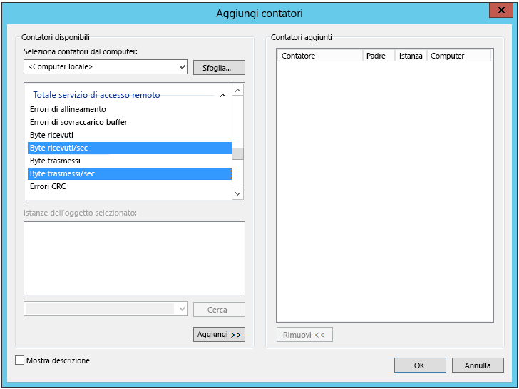

# <a name="troubleshoot-a-hybrid-vpn-connection"></a>Risolvere i problemi relativi a una connessione VPN ibrida

Questo articolo offre alcuni suggerimenti per la risoluzione dei problemi relativi a una connessione gateway VPN tra una rete locale e Azure. Per informazioni generali sulla risoluzione dei problemi relativi a errori comuni correlati alla VPN, vedere [Troubleshooting common VPN related errors (Risoluzione dei problemi relativi a errori comuni correlati alla VPN)][troubleshooting-vpn-errors].

## <a name="verify-the-vpn-appliance-is-functioning-correctly"></a>Verificare che l'appliance VPN funzioni correttamente

Le raccomandazioni seguenti sono utili per determinare se l'appliance VPN locale funziona correttamente.

**Controllare la presenza di problemi o errori nei file di log generati dall'appliance VPN.** Ciò consentirà di determinare se l'appliance VPN funziona correttamente. La posizione di tali informazioni varia in base all'appliance. Se ad esempio si usa RRAS in Windows Server 2012, è possibile usare il comando PowerShell seguente per visualizzare informazioni sugli eventi di errore per il servizio RRAS:

```PowerShell
Get-EventLog -LogName System -EntryType Error -Source RemoteAccess | Format-List -Property *
```

La proprietà *Message* di ciascuna voce offre una descrizione dell'errore. Di seguito sono riportati alcuni esempi comuni:

- impossibilità di connettersi, probabilmente a causa di un indirizzo IP non corretto, specificato per il gateway VPN di Azure nella configurazione di interfaccia di rete VPN RRAS.

  ```console
  EventID            : 20111
  MachineName        : on-premises-vm
  Data               : {41, 3, 0, 0}
  Index              : 14231
  Category           : (0)
  CategoryNumber     : 0
  EntryType          : Error
  Message            : RoutingDomainID- {00000000-0000-0000-0000-000000000000}: A demand dial connection to the remote
                          interface AzureGateway on port VPN2-4 was successfully initiated but failed to complete
                          successfully because of the  following error: The network connection between your computer and
                          the VPN server could not be established because the remote server is not responding. This could
                          be because one of the network devices (for example, firewalls, NAT, routers, and so on) between your computer
                          and the remote server is not configured to allow VPN connections. Please contact your
                          Administrator or your service provider to determine which device may be causing the problem.
  Source             : RemoteAccess
  ReplacementStrings : {{00000000-0000-0000-0000-000000000000}, AzureGateway, VPN2-4, The network connection between
                          your computer and the VPN server could not be established because the remote server is not
                          responding. This could be because one of the network devices (for example, firewalls, NAT, routers, and so on)
                          between your computer and the remote server is not configured to allow VPN connections. Please
                          contact your Administrator or your service provider to determine which device may be causing the
                          problem.}
  InstanceId         : 20111
  TimeGenerated      : 3/18/2016 1:26:02 PM
  TimeWritten        : 3/18/2016 1:26:02 PM
  UserName           :
  Site               :
  Container          :
  ```

- La chiave condivisa non corretta viene specificata nella configurazione di interfaccia di rete VPN RRAS.

  ```console
  EventID            : 20111
  MachineName        : on-premises-vm
  Data               : {233, 53, 0, 0}
  Index              : 14245
  Category           : (0)
  CategoryNumber     : 0
  EntryType          : Error
  Message            : RoutingDomainID- {00000000-0000-0000-0000-000000000000}: A demand dial connection to the remote
                          interface AzureGateway on port VPN2-4 was successfully initiated but failed to complete
                          successfully because of the  following error: Internet key exchange (IKE) authentication credentials are unacceptable.

  Source             : RemoteAccess
  ReplacementStrings : {{00000000-0000-0000-0000-000000000000}, AzureGateway, VPN2-4, IKE authentication credentials are
                          unacceptable.
                          }
  InstanceId         : 20111
  TimeGenerated      : 3/18/2016 1:34:22 PM
  TimeWritten        : 3/18/2016 1:34:22 PM
  UserName           :
  Site               :
  Container          :
  ```

È anche possibile usare il comando PowerShell seguente per ottenere informazioni del log eventi sui tentativi di connessione tramite il servizio RRAS:

```powershell
Get-EventLog -LogName Application -Source RasClient | Format-List -Property *
```

In caso di un errore di connessione, questo log conterrà errori simili al seguente:

```console
EventID            : 20227
MachineName        : on-premises-vm
Data               : {}
Index              : 4203
Category           : (0)
CategoryNumber     : 0
EntryType          : Error
Message            : CoId={B4000371-A67F-452F-AA4C-3125AA9CFC78}: The user SYSTEM dialed a connection named
                        AzureGateway that has failed. The error code returned on failure is 809.
Source             : RasClient
ReplacementStrings : {{B4000371-A67F-452F-AA4C-3125AA9CFC78}, SYSTEM, AzureGateway, 809}
InstanceId         : 20227
TimeGenerated      : 3/18/2016 1:29:21 PM
TimeWritten        : 3/18/2016 1:29:21 PM
UserName           :
Site               :
Container          :
```

## <a name="verify-connectivity"></a>Verificare la connettività

**Verificare la connettività e il routing attraverso il gateway VPN.** L'appliance VPN potrebbe non essere in grado di eseguire correttamente il routing del traffico attraverso Gateway VPN di Azure. Usare uno strumento come [PsPing][psping] per verificare la connettività e il routing attraverso il gateway VPN. Per eseguire il test della connettività da un computer locale a un server Web situato nella rete virtuale, usare ad esempio questo comando (sostituendo `<<web-server-address>>` con l'indirizzo del server Web):

```console
PsPing -t <<web-server-address>>:80
```

Se il computer locale può eseguire il routing del traffico verso il server Web, è possibile che venga visualizzato un output simile al seguente:

```console
D:\PSTools>psping -t 10.20.0.5:80

PsPing v2.01 - PsPing - ping, latency, bandwidth measurement utility
Copyright (C) 2012-2014 Mark Russinovich
Sysinternals - www.sysinternals.com

TCP connect to 10.20.0.5:80:
Infinite iterations (warmup 1) connecting test:
Connecting to 10.20.0.5:80 (warmup): 6.21ms
Connecting to 10.20.0.5:80: 3.79ms
Connecting to 10.20.0.5:80: 3.44ms
Connecting to 10.20.0.5:80: 4.81ms

    Sent = 3, Received = 3, Lost = 0 (0% loss),
    Minimum = 3.44ms, Maximum = 4.81ms, Average = 4.01ms
```

Se il computer locale non può comunicare con la destinazione specificata, si visualizzeranno messaggi simili al seguente:

```console
D:\PSTools>psping -t 10.20.1.6:80

PsPing v2.01 - PsPing - ping, latency, bandwidth measurement utility
Copyright (C) 2012-2014 Mark Russinovich
Sysinternals - www.sysinternals.com

TCP connect to 10.20.1.6:80:
Infinite iterations (warmup 1) connecting test:
Connecting to 10.20.1.6:80 (warmup): This operation returned because the timeout period expired.
Connecting to 10.20.1.6:80: This operation returned because the timeout period expired.
Connecting to 10.20.1.6:80: This operation returned because the timeout period expired.
Connecting to 10.20.1.6:80: This operation returned because the timeout period expired.
Connecting to 10.20.1.6:80:
    Sent = 3, Received = 0, Lost = 3 (100% loss),
    Minimum = 0.00ms, Maximum = 0.00ms, Average = 0.00ms
```

**Verificare che il firewall locale consenta il passaggio del traffico VPN e che le porte appropriate siano aperte.**

**Verificare che l'appliance VPN locale usi un metodo di crittografia compatibile con il gateway VPN di Azure.** Per il routing basato su criteri, il gateway VPN di Azure supporta gli algoritmi di crittografia AES256, AES128 e 3DES. I gateway basati su route supportano AES256 e 3DES. Per altre informazioni, vedere [Informazioni sui dispositivi VPN e sui parametri IPsec/IKE per connessioni del Gateway VPN da sito a sito][vpn-appliance].

## <a name="check-for-problems-with-the-azure-vpn-gateway"></a>Verificare la presenza di problemi con il gateway VPN di Azure

Le raccomandazioni seguenti sono utili per determinare se si è verificato un problema con il gateway VPN di Azure:

**Esaminare i log di diagnostica del gateway VPN di Azure al fine di individuare potenziali problemi.** Vedere [Procedura dettagliata: Acquisizione dei log di diagnostica del Gateway di rete virtuale di Azure Resource Manager][gateway-diagnostic-logs].

**Verificare che il gateway VPN di Azure e l'appliance VPN locale siano configurati con la stessa chiave di autenticazione condivisa.** È possibile visualizzare la chiave condivisa archiviata dal gateway VPN di Azure usando questo comando dell'interfaccia della riga di comando di Azure:

```azurecli
azure network vpn-connection shared-key show <<resource-group>> <<vpn-connection-name>>
```

Usare il comando appropriato per l'appliance VPN locale per visualizzare la chiave condivisa configurata per l'appliance.

Verificare che la subnet *GatewaySubnet* che contiene il gateway VPN di Azure non sia associata a un gruppo di sicurezza di rete (NSG).

È possibile visualizzare i dettagli della subnet usando questo comando dell'interfaccia della riga di comando di Azure:

```azurecli
azure network vnet subnet show -g <<resource-group>> -e <<vnet-name>> -n GatewaySubnet
```

Verificare che non sia presente alcun campo dati denominato *ID gruppo di sicurezza di rete*. L'esempio seguente mostra i risultati di un'istanza di *GatewaySubnet* a cui è assegnato un gruppo di sicurezza di rete (*VPN-Gateway-Group*). Ciò può impedire il corretto funzionamento del gateway qualora siano definite eventuali regole per questo gruppo di sicurezza di rete.

```console
C:\>azure network vnet subnet show -g profx-prod-rg -e profx-vnet -n GatewaySubnet
    info:    Executing command network vnet subnet show
    + Looking up virtual network "profx-vnet"
    + Looking up the subnet "GatewaySubnet"
    data:    Id                              : /subscriptions/########-####-####-####-############/resourceGroups/profx-prod-rg/providers/Microsoft.Network/virtualNetworks/profx-vnet/subnets/GatewaySubnet
    data:    Name                            : GatewaySubnet
    data:    Provisioning state              : Succeeded
    data:    Address prefix                  : 10.20.3.0/27
    data:    Network Security Group id       : /subscriptions/########-####-####-####-############/resourceGroups/profx-prod-rg/providers/Microsoft.Network/networkSecurityGroups/VPN-Gateway-Group
    info:    network vnet subnet show command OK
```

**Verificare che le macchine virtuali nella rete virtuale di Azure siano configurate per consentire il traffico in arrivo dall'esterno della rete virtuale.** Controllare eventuali regole del gruppo di sicurezza di rete associate alle subnet contenenti queste macchine virtuali. È possibile visualizzare tutte le regole del gruppo di sicurezza di rete usando questo comando dell'interfaccia della riga di comando di Azure:

```azurecli
azure network nsg show -g <<resource-group>> -n <<nsg-name>>
```

**Verificare che il gateway VPN di Azure sia connesso.** È possibile usare il comando di Azure PowerShell seguente per controllare lo stato corrente della connessione VPN di Azure. Il parametro `<<connection-name>>` è il nome della connessione VPN di Azure che collega il gateway di rete virtuale e il gateway locale.

```powershell
Get-AzureRmVirtualNetworkGatewayConnection -Name <<connection-name>> - ResourceGroupName <<resource-group>>
```

I frammenti di codice seguenti mostrano l'output generato se il gateway è connesso (nel primo esempio) e disconnesso (nel secondo esempio):

```powershell
PS C:\> Get-AzureRmVirtualNetworkGatewayConnection -Name profx-gateway-connection -ResourceGroupName profx-prod-rg

AuthorizationKey           :
VirtualNetworkGateway1     : Microsoft.Azure.Commands.Network.Models.PSVirtualNetworkGateway
VirtualNetworkGateway2     :
LocalNetworkGateway2       : Microsoft.Azure.Commands.Network.Models.PSLocalNetworkGateway
Peer                       :
ConnectionType             : IPsec
RoutingWeight              : 0
SharedKey                  : ####################################
ConnectionStatus           : Connected
EgressBytesTransferred     : 55254803
IngressBytesTransferred    : 32227221
ProvisioningState          : Succeeded
...
```

```powershell
PS C:\> Get-AzureRmVirtualNetworkGatewayConnection -Name profx-gateway-connection2 -ResourceGroupName profx-prod-rg

AuthorizationKey           :
VirtualNetworkGateway1     : Microsoft.Azure.Commands.Network.Models.PSVirtualNetworkGateway
VirtualNetworkGateway2     :
LocalNetworkGateway2       : Microsoft.Azure.Commands.Network.Models.PSLocalNetworkGateway
Peer                       :
ConnectionType             : IPsec
RoutingWeight              : 0
SharedKey                  : ####################################
ConnectionStatus           : NotConnected
EgressBytesTransferred     : 0
IngressBytesTransferred    : 0
ProvisioningState          : Succeeded
...
```

## <a name="miscellaneous-issues"></a>Problemi vari

Le raccomandazioni seguenti sono utili per determinare se per la macchina virtuale host è presente un problema di configurazione, di utilizzo della larghezza di banda di rete o di prestazioni dell'applicazione:

**Verifica configurazione firewall.** Verificare che il firewall nel sistema operativo guest in esecuzione su macchine virtuali di Azure nella subnet sia configurato correttamente per consentire il traffico proveniente dagli intervalli di IP locali.

**Verificare che il volume di traffico non sia prossimo al limite della larghezza di banda disponibile per il gateway VPN di Azure.** Il modo per verificare tali aspetti varia in base all'appliance VPN eseguita in locale. Se ad esempio si usa RRAS in Windows Server 2012, è possibile servirsi di Performance Monitor per tenere traccia del volume dei dati ricevuti e trasmessi tramite una connessione VPN. Usando l'oggetto *Totale RAS*, selezionare i contatori *Byte ricevuti/sec* e *Byte trasmessi/sec*:



È necessario confrontare i risultati con la larghezza di banda disponibile per il gateway VPN (da 100 Mbps per lo SKU Basic e 1.25 Gbps per lo SKU VpnGw3):


**Verificare di aver distribuito le dimensioni e il numero corretto di macchine virtuali per il carico dell'applicazione.** Determinare la presenza nella rete virtuale di Azure di eventuali macchine virtuali eseguite lentamente. In tal caso, è possibile che vi sia un sovraccarico sulle macchine virtuali, che il numero di macchine virtuali sia insufficiente per gestire il carico o che i servizi di bilanciamento del carico non siano configurati correttamente. [Acquisire e analizzare le informazioni di diagnostica][azure-vm-diagnostics] per individuare la causa di tale situazione. È possibile esaminare i risultati tramite il portale di Azure, ma sono disponibili anche molti strumenti di terze parti in grado di fornire informazioni dettagliate sui dati sulle prestazioni.

**Verificare che l'applicazione usi le risorse cloud in modo efficiente.** Instrumentare il codice applicazione in esecuzione in ogni macchina virtuale per determinare se le applicazioni usano le risorse in modo ottimale. È possibile usare strumenti come [Application Insights][application-insights].

<!-- links -->

[application-insights]: /azure/application-insights/app-insights-overview-usage
[azure-vm-diagnostics]: https://azure.microsoft.com/blog/windows-azure-virtual-machine-monitoring-with-wad-extension/
[gateway-diagnostic-logs]: https://blogs.technet.microsoft.com/keithmayer/2016/10/12/step-by-step-capturing-azure-resource-manager-arm-vnet-gateway-diagnostic-logs/
[psping]: https://technet.microsoft.com/sysinternals/jj729731.aspx
[troubleshooting-vpn-errors]: https://blogs.technet.microsoft.com/rrasblog/2009/08/12/troubleshooting-common-vpn-related-errors/
[vpn-appliance]: /azure/vpn-gateway/vpn-gateway-about-vpn-devices
