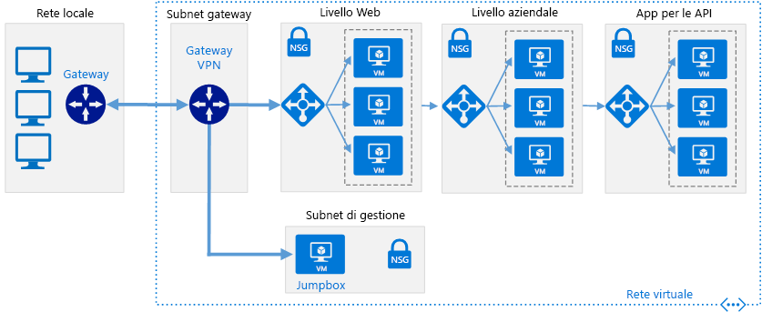
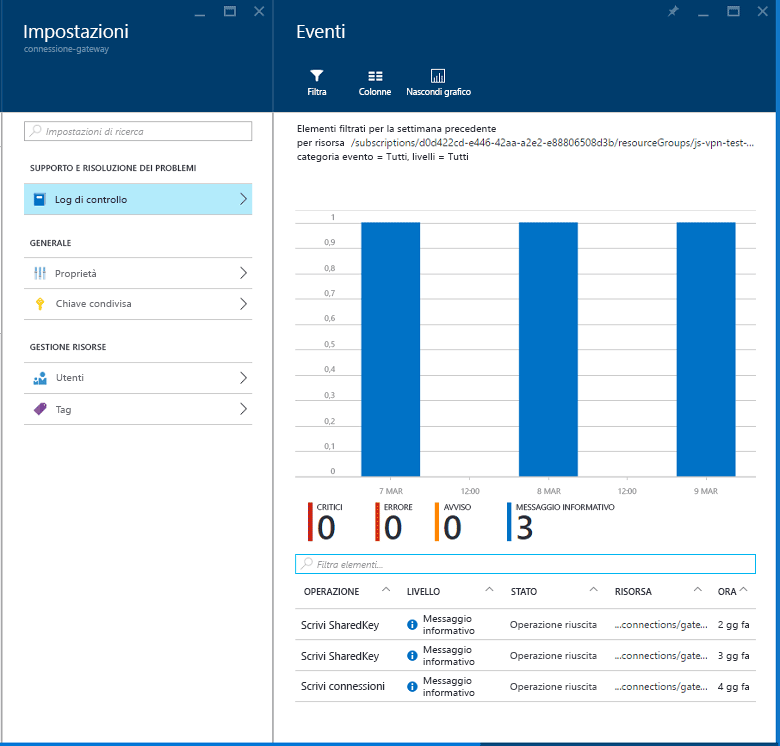

# Connettere una rete locale ad Azure tramite un gateway VPNConnect an on-premises network to Azure using a VPN gateway

Questa architettura di riferimento mostra come estendere una rete locale ad Azure tramite una rete privata virtuale (VPN) da sito a sito.This reference architecture shows how to extend an on-premises network to Azure, using a site-to-site virtual private network (VPN). Il traffico passa tra la rete locale e la rete virtuale di Azure tramite un tunnel per VPN IPSec.Traffic flows between the on-premises network and an Azure Virtual Network (VNet) through an IPSec VPN tunnel. [**Distribuire questa soluzione**](#deploy-the-solution).[**Deploy this solution**](#deploy-the-solution).

*Scaricare un [file Visio][visio-download] di questa architettura.**Download a [Visio file][visio-download] of this architecture.*

## ArchitetturaArchitecture

L'architettura è costituita dai componenti seguenti.The architecture consists of the following components.

- **Rete locale**.**On-premises network**. Una rete LAN privata in esecuzione all'interno di un'organizzazione.A private local-area network running within an organization.

- **Appliance VPN**.**VPN appliance**. Un dispositivo o un servizio che offre connettività esterna alla rete locale.A device or service that provides external connectivity to the on-premises network. L'appliance VPN può essere un dispositivo hardware o una soluzione software, ad esempio il servizio Routing e Accesso remoto (RRAS) in Windows Server 2012.The VPN appliance may be a hardware device, or it can be a software solution such as the Routing and Remote Access Service (RRAS) in Windows Server 2012. Per un elenco di appliance VPN supportate e per informazioni su come configurarle per la connessione a un gateway VPN di Azure, vedere le istruzioni per il dispositivo selezionato nell'articolo [Informazioni sui dispositivi VPN per connessioni del Gateway VPN da sito a sito][vpn-appliance].For a list of supported VPN appliances and information on configuring them to connect to an Azure VPN gateway, see the instructions for the selected device in the article [About VPN devices for Site-to-Site VPN Gateway connections][vpn-appliance].

- **Rete virtuale**.**Virtual network (VNet)**. L'applicazione cloud e i componenti del gateway VPN di Azure si trovano nella stessa [rete virtuale][azure-virtual-network].The cloud application and the components for the Azure VPN gateway reside in the same [VNet][azure-virtual-network].

- **Gateway VPN di Azure**.**Azure VPN gateway**. Il servizio [gateway VPN][azure-vpn-gateway] consente di connettere la rete virtuale alla rete locale tramite un'appliance VPN.The [VPN gateway][azure-vpn-gateway] service enables you to connect the VNet to the on-premises network through a VPN appliance. Per maggiori informazioni, consultare [Connettere una rete locale a una rete virtuale di Microsoft Azure][connect-to-an-Azure-vnet].For more information, see [Connect an on-premises network to a Microsoft Azure virtual network][connect-to-an-Azure-vnet]. Il gateway VPN include gli elementi seguenti:The VPN gateway includes the following elements:

  - **Gateway di rete virtuale**.**Virtual network gateway**. Risorsa che fornisce un'appliance VPN virtuale per la rete virtualeA resource that provides a virtual VPN appliance for the VNet. ed è responsabile del routing del traffico dalla rete locale alla rete virtuale.It is responsible for routing traffic from the on-premises network to the VNet.
  - **Gateway di rete locale**.**Local network gateway**. Astrazione dell'appliance VPN locale.An abstraction of the on-premises VPN appliance. Il routing del traffico di rete dall'applicazione cloud alla rete locale viene eseguito tramite il gateway.Network traffic from the cloud application to the on-premises network is routed through this gateway.
  - **Connessione**.**Connection**. La connessione ha proprietà che specificano il tipo di connessione (IPSec) e la chiave condivisa con l'appliance VPN locale per crittografare il traffico.The connection has properties that specify the connection type (IPSec) and the key shared with the on-premises VPN appliance to encrypt traffic.
  - **Subnet del gateway**:**Gateway subnet**. Il gateway di rete virtuale viene mantenuto nella propria subnet, che è soggetta a vari requisiti, descritti nella sezione Raccomandazioni di seguito.The virtual network gateway is held in its own subnet, which is subject to various requirements, described in the Recommendations section below.

- **Applicazione cloud**.**Cloud application**. Applicazione contenuta in Azure.The application hosted in Azure. Può includere più livelli, con più subnet connesse tramite i servizi di bilanciamento del carico di Azure.It might include multiple tiers, with multiple subnets connected through Azure load balancers. Per altre informazioni sull'infrastruttura dell'applicazione, vedere [Esecuzione di carichi di lavoro della macchina virtuale Windows][windows-vm-ra] ed [Esecuzione di carichi di lavoro della macchina virtuale di Linux][linux-vm-ra].For more information about the application infrastructure, see [Running Windows VM workloads][windows-vm-ra] and [Running Linux VM workloads][linux-vm-ra].

- **Servizio di bilanciamento del carico interno**.**Internal load balancer**. Il routing del traffico di rete dal gateway VPN viene eseguito per l'applicazione cloud tramite un servizio di bilanciamento del carico interno.Network traffic from the VPN gateway is routed to the cloud application through an internal load balancer. Il servizio di bilanciamento del carico si trova nella subnet front-end dell'applicazione.The load balancer is located in the front-end subnet of the application.

## ConsigliRecommendations

Le raccomandazioni seguenti sono valide per la maggior parte degli scenari.The following recommendations apply for most scenarios. Seguire queste indicazioni, a meno che non si disponga di un requisito specifico che le escluda.Follow these recommendations unless you have a specific requirement that overrides them.

### Rete virtuale e subnet gatewayVNet and gateway subnet

Creare una rete virtuale di Azure con uno spazio indirizzi sufficientemente grande per tutte le risorse necessarie.Create an Azure VNet with an address space large enough for all of your required resources. Verificare che lo spazio indirizzi di rete virtuale disponga di spazio sufficiente per la crescita se le macchine virtuali aggiuntive sono necessarie in futuro.Ensure that the VNet address space has sufficient room for growth if additional VMs are likely to be needed in the future. Lo spazio indirizzi della rete virtuale non deve sovrapporsi con la rete locale.The address space of the VNet must not overlap with the on-premises network. Il diagramma precedente usa ad esempio lo spazio indirizzi 10.20.0.0/16 per la rete virtuale.For example, the diagram above uses the address space 10.20.0.0/16 for the VNet.

Creare una subnet denominata *GatewaySubnet*, con un intervallo di indirizzi /27.Create a subnet named *GatewaySubnet*, with an address range of /27. Questa subnet è necessaria per il gateway di rete virtuale.This subnet is required by the virtual network gateway. Allocare 32 indirizzi a questa subnet contribuirà in futuro a evitare di raggiungere i limiti di dimensioni del gateway.Allocating 32 addresses to this subnet will help to prevent reaching gateway size limitations in the future. Evitare inoltre di inserire questa subnet all'interno dello spazio indirizzi.Also, avoid placing this subnet in the middle of the address space. Una procedura consigliata consiste nell'impostare lo spazio indirizzi per la subnet del gateway all'estremità superiore dello spazio indirizzi della rete virtuale.A good practice is to set the address space for the gateway subnet at the upper end of the VNet address space. L'esempio illustrato nel diagramma usa 10.20.255.224/27.The example shown in the diagram uses 10.20.255.224/27.  Di seguito è riportata una procedura rapida per calcolare il [CIDR]:Here is a quick procedure to calculate the [CIDR]:

1. Impostare i bit variabili nello spazio indirizzi della rete virtuale su 1, fino ai bit usati dalla subnet del gateway, quindi impostare i bit rimanenti su 0.Set the variable bits in the address space of the VNet to 1, up to the bits being used by the gateway subnet, then set the remaining bits to 0.
2. Convertire i bit risultanti in decimali ed esprimerli sotto forma di uno spazio indirizzi con la lunghezza del prefisso impostata sulle dimensioni della subnet del gateway.Convert the resulting bits to decimal and express it as an address space with the prefix length set to the size of the gateway subnet.

Per una rete virtuale con un intervallo di indirizzi IP di 10.20.0.0/16, applicando il passaggio 1 precedente si ottiene 10.20.0b11111111.0b11100000.For example, for a VNet with an IP address range of 10.20.0.0/16, applying step #1 above becomes 10.20.0b11111111.0b11100000.  Se si converte tale risultato in numero decimale e lo si esprime come uno spazio indirizzi, si ottiene 10.20.255.224/27.Converting that to decimal and expressing it as an address space yields 10.20.255.224/27.

> [!WARNING]
> Non distribuire le macchine virtuali nella subnet del gateway.Do not deploy any VMs to the gateway subnet. Non assegnare inoltre un gruppo di sicurezza di rete a questa subnet, in quanto verrebbe causata l'interruzione del funzionamento del gateway.Also, do not assign an NSG to this subnet, as it will cause the gateway to stop functioning.
>

### Gateway di rete virtualeVirtual network gateway

Allocare un indirizzo IP pubblico per il gateway di rete virtuale.Allocate a public IP address for the virtual network gateway.

Creare il gateway di rete virtuale nella subnet del gateway e assegnare a esso il nuovo indirizzo IP pubblico allocato.Create the virtual network gateway in the gateway subnet and assign it the newly allocated public IP address. Usare il tipo di gateway che soddisfa maggiormente i propri requisiti e che sia abilitato dall'appliance VPN in uso:Use the gateway type that most closely matches your requirements and that is enabled by your VPN appliance:

- Creare un [gateway basato su criteri][policy-based-routing] se è necessario controllare da vicino il modo in cui viene eseguito il routing delle richieste in base ai criteri, ad esempio i prefissi di indirizzo.Create a [policy-based gateway][policy-based-routing] if you need to closely control how requests are routed based on policy criteria such as address prefixes. I gateway basati su criteri usano il routing statico e funzionano solo con le connessioni da sito a sito.Policy-based gateways use static routing, and only work with site-to-site connections.

- Creare un [gateway basato su route][route-based-routing] se ci si connette alla rete locale mediante RRAS, sono supportate le connessioni multisito o tra più aree o sono implementate le connessioni da rete virtuale a rete virtuale (incluse le route che attraversano più reti virtuali).Create a [route-based gateway][route-based-routing] if you connect to the on-premises network using RRAS, support multi-site or cross-region connections, or implement VNet-to-VNet connections (including routes that traverse multiple VNets). I gateway basati su route usano il routing dinamico per indirizzare il traffico tra le reti.Route-based gateways use dynamic routing to direct traffic between networks. Sono caratterizzati da una maggiore tolleranza degli errori nel percorso di rete rispetto alle route statiche poiché sono in grado di provare route alternative.They can tolerate failures in the network path better than static routes because they can try alternative routes. I gateway basati su route possono anche ridurre il sovraccarico di gestione, poiché potrebbe non essere necessario aggiornare le route manualmente quando cambiano gli indirizzi di rete.Route-based gateways can also reduce the management overhead because routes might not need to be updated manually when network addresses change.

Per un elenco di appliance VPN supportate, vedere [Informazioni sui dispositivi VPN per connessioni del Gateway VPN da sito a sito][vpn-appliances].For a list of supported VPN appliances, see [About VPN devices for Site-to-Site VPN Gateway connections][vpn-appliances].

> [!NOTE]
> Una volta creato il gateway, non è possibile passare da un tipo di gateway a un altro senza eliminare e ricreare il gateway.After the gateway has been created, you cannot change between gateway types without deleting and re-creating the gateway.
>

Selezionare lo SKU del gateway VPN di Azure che soddisfa maggiormente i requisiti di velocità effettiva.Select the Azure VPN gateway SKU that most closely matches your throughput requirements. Per altre informazioni, vedere [SKU del gateway][azure-gateway-skus]For more information, see [Gateway SKUs][azure-gateway-skus]

> [!NOTE]
> Lo SKU di base non è compatibile con Azure ExpressRoute.The Basic SKU is not compatible with Azure ExpressRoute. È possibile [modificare lo SKU][changing-SKUs] dopo che il gateway è stato creato.You can [change the SKU][changing-SKUs] after the gateway has been created.
>

L'importo addebitato è basato sulla quantità di tempo durante il quale il gateway viene sottoposto a provisioning e risulta disponibile.You are charged based on the amount of time that the gateway is provisioned and available. Vedere [Prezzi di Gateway VPN][azure-gateway-charges].See [VPN Gateway Pricing][azure-gateway-charges].

Creare regole di routing per la subnet del gateway che indirizzano il traffico dell'applicazione in ingresso dal gateway al servizio di bilanciamento del carico interno, anziché consentire alle richieste di passare direttamente alle macchine virtuali dell'applicazione.Create routing rules for the gateway subnet that direct incoming application traffic from the gateway to the internal load balancer, rather than allowing requests to pass directly to the application VMs.

### Connessione di rete localeOn-premises network connection

Creare un gateway di rete locale.Create a local network gateway. Specificare l'indirizzo IP pubblico dell'appliance VPN locale e lo spazio indirizzi della rete locale.Specify the public IP address of the on-premises VPN appliance, and the address space of the on-premises network. Si noti che l'appliance VPN locale deve avere un indirizzo IP pubblico a cui è possibile accedere tramite il gateway di rete locale in Gateway VPN di Azure.Note that the on-premises VPN appliance must have a public IP address that can be accessed by the local network gateway in Azure VPN Gateway. Il dispositivo VPN non può trovarsi dietro un dispositivo NAT (Network Address Translation).The VPN device cannot be located behind a network address translation (NAT) device.

Creare una connessione da sito a sito per il gateway di rete virtuale e il gateway di rete locale.Create a site-to-site connection for the virtual network gateway and the local network gateway. Selezionare il tipo di connessione da sito a sito (IPSec) e specificare la chiave condivisa.Select the site-to-site (IPSec) connection type, and specify the shared key. La crittografia da sito a sito con il gateway VPN di Azure è basata sul protocollo IPSec, usando le chiavi precondivise per l'autenticazione.Site-to-site encryption with the Azure VPN gateway is based on the IPSec protocol, using preshared keys for authentication. Quando si crea il gateway VPN di Azure, si specifica la chiave.You specify the key when you create the Azure VPN gateway. È necessario configurare l'appliance VPN eseguita in locale con la stessa chiave.You must configure the VPN appliance running on-premises with the same key. Altri meccanismi di autenticazione non sono attualmente supportati.Other authentication mechanisms are not currently supported.

Verificare che l'infrastruttura di routing locale sia configurata per inoltrare al dispositivo VPN le richieste destinate agli indirizzi nella rete virtuale di Azure.Ensure that the on-premises routing infrastructure is configured to forward requests intended for addresses in the Azure VNet to the VPN device.

Aprire le porte necessarie all'applicazione cloud nella rete locale.Open any ports required by the cloud application in the on-premises network.

Eseguire il test della connessione per verificare che:Test the connection to verify that:

- L'appliance VPN locale esegua in modo corretto il routing del traffico all'applicazione cloud tramite il gateway VPN di Azure.The on-premises VPN appliance correctly routes traffic to the cloud application through the Azure VPN gateway.
- La rete virtuale esegua in modo corretto il routing del traffico alla rete locale.The VNet correctly routes traffic back to the on-premises network.
- Il traffico non consentito in entrambe le direzioni sia bloccato in modo corretto.Prohibited traffic in both directions is blocked correctly.

## Considerazioni sulla scalabilitàScalability considerations

È possibile ottenere la scalabilità verticale limitata passando dallo SKU del Gateway VPN standard o di base allo SKU VPN a prestazioni elevate.You can achieve limited vertical scalability by moving from the Basic or Standard VPN Gateway SKUs to the High Performance VPN SKU.

Per le reti virtuali che prevedono un volume elevato di traffico VPN, è possibile considerare di distribuire diversi carichi di lavoro in reti virtuali separate di dimensioni più piccole e di configurare un gateway VPN per ognuno di essi.For VNets that expect a large volume of VPN traffic, consider distributing the different workloads into separate smaller VNets and configuring a VPN gateway for each of them.

È possibile eseguire il partizionamento orizzontale o verticale della rete virtuale.You can partition the VNet either horizontally or vertically. Per eseguire il partizionamento orizzontale, spostare alcune istanze della macchina virtuale di ciascun livello nelle subnet della nuova rete virtuale.To partition horizontally, move some VM instances from each tier into subnets of the new VNet. Ogni rete virtuale avrà a questo punto la stessa struttura e la stessa funzionalità.The result is that each VNet has the same structure and functionality. Per eseguire il partizionamento verticale, riprogettare ogni livello in modo da dividere la funzionalità in diverse aree logiche, ad esempio la gestione degli ordini, la fatturazione, la gestione degli account cliente e così via.To partition vertically, redesign each tier to divide the functionality into different logical areas (such as handling orders, invoicing, customer account management, and so on). Ogni area funzionale può quindi essere inserita nella propria rete virtuale.Each functional area can then be placed in its own VNet.

La replica di un controller di dominio Active Directory locale nella rete virtuale e l'implementazione di DNS nella rete virtuale possono aiutare a limitare il flusso di traffico amministrativo e correlato alla sicurezza locale verso il cloud.Replicating an on-premises Active Directory domain controller in the VNet, and implementing DNS in the VNet, can help to reduce some of the security-related and administrative traffic flowing from on-premises to the cloud. Per altre informazioni, vedere [Estensione di Active Directory Domain Services in Azure][adds-extend-domain].For more information, see [Extending Active Directory Domain Services (AD DS) to Azure][adds-extend-domain].

## Considerazioni sulla disponibilitàAvailability considerations

Se è necessario assicurarsi che la rete locale rimanga disponibile per il gateway VPN di Azure, implementare un cluster di failover per il gateway VPN locale.If you need to ensure that the on-premises network remains available to the Azure VPN gateway, implement a failover cluster for the on-premises VPN gateway.

Se l'organizzazione dispone di più siti locali, creare [connessioni mulsito][vpn-gateway-multi-site] per una o più reti virtuali di Azure.If your organization has multiple on-premises sites, create [multi-site connections][vpn-gateway-multi-site] to one or more Azure VNets. Questo approccio richiede il routing dinamico (basato su route), assicurarsi quindi che il gateway VPN locale supporti questa funzionalità.This approach requires dynamic (route-based) routing, so make sure that the on-premises VPN gateway supports this feature.

Per dettagli sui contratti di servizio, vedere [Contratto di Servizio per Gateway VPN][sla-for-vpn-gateway].For details about service level agreements, see [SLA for VPN Gateway][sla-for-vpn-gateway].

## Considerazioni sulla gestibilitàManageability considerations

Monitorare le informazioni di diagnostica da appliance VPN locali.Monitor diagnostic information from on-premises VPN appliances. Questo processo dipende dalle funzionalità fornite dall'appliance VPN.This process depends on the features provided by the VPN appliance. Se si usa ad esempio il servizio Routing e Accesso remoto in Windows Server 2012, servirsi della [registrazione RRAS][rras-logging].For example, if you are using the Routing and Remote Access Service on Windows Server 2012, [RRAS logging][rras-logging].

Usare la [diagnostica del gateway VPN di Azure][gateway-diagnostic-logs] per acquisire informazioni sui problemi di connettività.Use [Azure VPN gateway diagnostics][gateway-diagnostic-logs] to capture information about connectivity issues. È possibile usare questi log per tenere traccia delle informazioni, ad esempio l'origine e le destinazioni delle richieste di connessione, il protocollo usato e la modalità con cui è stata stabilita la connessione (o il motivo per cui il tentativo non è riuscito).These logs can be used to track information such as the source and destinations of connection requests, which protocol was used, and how the connection was established (or why the attempt failed).

Monitorare i log operativi del gateway VPN di Azure usando i log di controllo disponibili nel portale di Azure.Monitor the operational logs of the Azure VPN gateway using the audit logs available in the Azure portal. Sono disponibili log distinti per il gateway di rete locale, il gateway di rete di Azure e la connessione.Separate logs are available for the local network gateway, the Azure network gateway, and the connection. Queste informazioni possono essere usate per tenere traccia di tutte le modifiche apportate al gateway e possono essere utili se, per qualche motivo, si verificano problemi su un gateway precedentemente funzionante.This information can be used to track any changes made to the gateway, and can be useful if a previously functioning gateway stops working for some reason.

Monitorare la connettività e tenere traccia degli eventi di errore di connettività.Monitor connectivity, and track connectivity failure events. È possibile usare un pacchetto di monitoraggio, ad esempio [Nagios][nagios], per acquisire queste informazioni e creare appositi report.You can use a monitoring package such as [Nagios][nagios] to capture and report this information.

## Considerazioni relative alla sicurezzaSecurity considerations

Generare una chiave condivisa diversa per ogni gateway VPN.Generate a different shared key for each VPN gateway. Usare una chiave condivisa complessa per resistere agli attacchi di forza bruta.Use a strong shared key to help resist brute-force attacks.

> [!NOTE]
> Non è attualmente possibile usare Azure Key Vault per precondividere le chiavi per il gateway VPN di Azure.Currently, you cannot use Azure Key Vault to preshare keys for the Azure VPN gateway.
>

Verificare che il dispositivo VPN locale usi un metodo di crittografia [compatibile con il gateway VPN di Azure][vpn-appliance-ipsec].Ensure that the on-premises VPN appliance uses an encryption method that is [compatible with the Azure VPN gateway][vpn-appliance-ipsec]. Per il routing basato su criteri, il gateway VPN di Azure supporta gli algoritmi di crittografia AES256, AES128 e 3DES.For policy-based routing, the Azure VPN gateway supports the AES256, AES128, and 3DES encryption algorithms. I gateway basati su route supportano AES256 e 3DES.Route-based gateways support AES256 and 3DES.

Se l'appliance VPN locale si trova su una rete perimetrale con un firewall tra la rete perimetrale e Internet, potrebbe essere necessario configurare [regole del firewall aggiuntive][additional-firewall-rules] per consentire la connessione VPN da sito a sito.If your on-premises VPN appliance is on a perimeter network (DMZ) that has a firewall between the perimeter network and the Internet, you might have to configure [additional firewall rules][additional-firewall-rules] to allow the site-to-site VPN connection.

Se l'applicazione nella rete virtuale invia dati a Internet, è possibile considerare l'[implementazione del tunneling forzato][forced-tunneling] per eseguire il routing di tutto il traffico associato a Internet attraverso la rete locale.If the application in the VNet sends data to the Internet, consider [implementing forced tunneling][forced-tunneling] to route all Internet-bound traffic through the on-premises network. Questo approccio consente di controllare le richieste in uscita eseguite tramite l'applicazione dall'infrastruttura locale.This approach enables you to audit outgoing requests made by the application from the on-premises infrastructure.

> [!NOTE]
> Il tunneling forzato può influire sulla connettività ai servizi di Azure, ad esempio Servizio di archiviazione, e sulla gestione delle licenze di Windows.Forced tunneling can impact connectivity to Azure services (the Storage Service, for example) and the Windows license manager.
>

## Distribuire la soluzioneDeploy the solution

**Prerequisiti**.**Prerequisites**. È necessario disporre di un'infrastruttura locale esistente già configurata con un'appliance di rete adatta.You must have an existing on-premises infrastructure already configured with a suitable network appliance.

Per distribuire la soluzione, seguire questa procedura.To deploy the solution, perform the following steps.

<!-- markdownlint-disable MD033 -->

1. Fare clic sul pulsante seguente:Click the button below: 
2. Attendere che il collegamento si apra nel portale di Azure e quindi eseguire questi passaggi:Wait for the link to open in the Azure portal, then follow these steps:
   - Poiché il nome del **gruppo di risorse** è già definito nel file dei parametri, selezionare **Crea nuovo** e immettere `ra-hybrid-vpn-rg` nella casella di testo.The **Resource group** name is already defined in the parameter file, so select **Create New** and enter `ra-hybrid-vpn-rg` in the text box.
   - Selezionare l'area dalla casella di riepilogo a discesa **Località**.Select the region from the **Location** drop down box.
   - Non modificare le caselle di testo **Template Root Uri** (URI radice modello) né **Parameter Root Uri** (URI radice parametro).Do not edit the **Template Root Uri** or the **Parameter Root Uri** text boxes.
   - Leggere i termini e le condizioni, quindi fare clic sulla casella di controllo **Accetto le condizioni riportate sopra**.Review the terms and conditions, then click the **I agree to the terms and conditions stated above** checkbox.
   - Fare clic sul pulsante **Acquista**.Click the **Purchase** button.
3. Attendere il completamento della distribuzione.Wait for the deployment to complete.

<!-- markdownlint-enable MD033 -->

Per risolvere i problemi di connessione, consultare [Risolvere i problemi relativi a una connessione VPN ibrida](./troubleshoot-vpn.md).To troubleshoot the connection, see [Troubleshoot a hybrid VPN connection](./troubleshoot-vpn.md).

<!-- links -->

[adds-extend-domain]: ../identity/adds-extend-domain.md
[windows-vm-ra]: ../virtual-machines-windows/index.md
[linux-vm-ra]: ../virtual-machines-linux/index.md

[azure-cli]: /azure/virtual-machines-command-line-tools
[azure-virtual-network]: /azure/virtual-network/virtual-networks-overview
[vpn-appliance]: /azure/vpn-gateway/vpn-gateway-about-vpn-devices
[azure-vpn-gateway]: https://azure.microsoft.com/services/vpn-gateway/
[azure-gateway-charges]: https://azure.microsoft.com/pricing/details/vpn-gateway/
[azure-gateway-skus]: /azure/vpn-gateway/vpn-gateway-about-vpngateways#gwsku
[connect-to-an-Azure-vnet]: https://technet.microsoft.com/library/dn786406.aspx
[vpn-gateway-multi-site]: /azure/vpn-gateway/vpn-gateway-multi-site
[policy-based-routing]: https://en.wikipedia.org/wiki/Policy-based_routing
[route-based-routing]: https://en.wikipedia.org/wiki/Static_routing
[sla-for-vpn-gateway]: https://azure.microsoft.com/support/legal/sla/vpn-gateway/
[additional-firewall-rules]: https://technet.microsoft.com/library/dn786406.aspx#firewall
[nagios]: https://www.nagios.org/
[changing-SKUs]: https://azure.microsoft.com/blog/azure-virtual-network-gateway-improvements/
[gateway-diagnostic-logs]: https://blogs.technet.microsoft.com/keithmayer/2016/10/12/step-by-step-capturing-azure-resource-manager-arm-vnet-gateway-diagnostic-logs/
[rras-logging]: https://www.petri.com/enable-diagnostic-logging-in-windows-server-2012-r2-routing-and-remote-access
[forced-tunneling]: /azure/vpn-gateway/vpn-gateway-about-forced-tunneling
[vpn-appliances]: /azure/vpn-gateway/vpn-gateway-about-vpn-devices
[visio-download]: https://archcenter.blob.core.windows.net/cdn/hybrid-network-architectures.vsdx
[vpn-appliance-ipsec]: /azure/vpn-gateway/vpn-gateway-about-vpn-devices#ipsec-parameters
[azure-cli]: /cli/azure/install-azure-cli
[CIDR]: https://en.wikipedia.org/wiki/Classless_Inter-Domain_Routing
