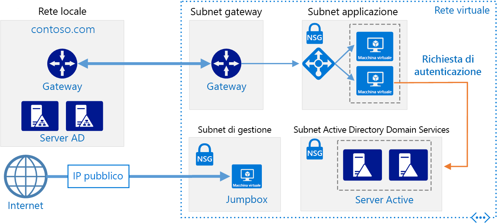

# <a name="extend-active-directory-domain-services-ad-ds-to-azure"></a><span data-ttu-id="e6b69-103">Estendere Active Directory Domain Services in Azure</span><span class="sxs-lookup"><span data-stu-id="e6b69-103">Extend Active Directory Domain Services (AD DS) to Azure</span></span>

<span data-ttu-id="e6b69-104">Questa architettura di riferimento mostra come estendere l'ambiente Active Directory in Azure per fornire servizi di autenticazione distribuiti usando Active Directory Domain Services.</span><span class="sxs-lookup"><span data-stu-id="e6b69-104">This reference architecture shows how to extend your Active Directory environment to Azure to provide distributed authentication services using Active Directory Domain Services (AD DS).</span></span> <span data-ttu-id="e6b69-105">[**Distribuire questa soluzione**](#deploy-the-solution).</span><span class="sxs-lookup"><span data-stu-id="e6b69-105">[**Deploy this solution**](#deploy-the-solution).</span></span>



<span data-ttu-id="e6b69-107">*Scaricare un [file Visio][visio-download] di questa architettura.*</span><span class="sxs-lookup"><span data-stu-id="e6b69-107">*Download a [Visio file][visio-download] of this architecture.*</span></span>

<span data-ttu-id="e6b69-108">Active Directory Domain Services viene usato per autenticare utenti, computer, applicazioni o altre identità incluse in un dominio di sicurezza.</span><span class="sxs-lookup"><span data-stu-id="e6b69-108">AD DS is used to authenticate user, computer, application, or other identities that are included in a security domain.</span></span> <span data-ttu-id="e6b69-109">Può essere ospitato in locale, ma se l'applicazione è ospitata in parte in locale e in parte in Azure, potrebbe essere più efficiente replicare questa funzionalità in Azure.</span><span class="sxs-lookup"><span data-stu-id="e6b69-109">It can be hosted on-premises, but if your application is hosted partly on-premises and partly in Azure, it may be more efficient to replicate this functionality in Azure.</span></span> <span data-ttu-id="e6b69-110">Questo consente di ridurre la latenza dovuta all'invio di richieste di autenticazione e di autorizzazione locali dal cloud di nuovo all'istanza di Active Directory Domain Services in esecuzione in locale.</span><span class="sxs-lookup"><span data-stu-id="e6b69-110">This can reduce the latency caused by sending authentication and local authorization requests from the cloud back to AD DS running on-premises.</span></span>

<span data-ttu-id="e6b69-111">Questa architettura viene comunemente usata quando la rete locale e la rete virtuale di Azure sono connesse tramite una connessione VPN o ExpressRoute.</span><span class="sxs-lookup"><span data-stu-id="e6b69-111">This architecture is commonly used when the on-premises network and the Azure virtual network are connected by a VPN or ExpressRoute connection.</span></span> <span data-ttu-id="e6b69-112">L'architettura supporta anche la replica bidirezionale. Ciò vuol dire che è possibile apportare modifiche sia in locale che nel cloud ed entrambe le origini verranno mantenute coerenti.</span><span class="sxs-lookup"><span data-stu-id="e6b69-112">This architecture also supports bidirectional replication, meaning changes can be made either on-premises or in the cloud, and both sources will be kept consistent.</span></span> <span data-ttu-id="e6b69-113">Gli usi tipici di questa architettura includono applicazioni ibride in cui la funzionalità viene distribuita tra origini locali e Azure, oltre che applicazioni e servizi che eseguono l'autenticazione tramite Active Directory.</span><span class="sxs-lookup"><span data-stu-id="e6b69-113">Typical uses for this architecture include hybrid applications in which functionality is distributed between on-premises and Azure, and applications and services that perform authentication using Active Directory.</span></span>

<span data-ttu-id="e6b69-114">Per altre considerazioni, vedere l'articolo su come [scegliere una soluzione per l'integrazione di Active Directory locale con Azure][considerations].</span><span class="sxs-lookup"><span data-stu-id="e6b69-114">For additional considerations, see [Choose a solution for integrating on-premises Active Directory with Azure][considerations].</span></span>

## <a name="architecture"></a><span data-ttu-id="e6b69-115">Architettura</span><span class="sxs-lookup"><span data-stu-id="e6b69-115">Architecture</span></span>

<span data-ttu-id="e6b69-116">Questa architettura estende l'architettura illustrata in [Rete perimetrale tra Azure e Internet][implementing-a-secure-hybrid-network-architecture-with-internet-access].</span><span class="sxs-lookup"><span data-stu-id="e6b69-116">This architecture extends the architecture shown in [DMZ between Azure and the Internet][implementing-a-secure-hybrid-network-architecture-with-internet-access].</span></span> <span data-ttu-id="e6b69-117">Include i componenti seguenti.</span><span class="sxs-lookup"><span data-stu-id="e6b69-117">It has the following components.</span></span>

- <span data-ttu-id="e6b69-118">**Rete locale**.</span><span class="sxs-lookup"><span data-stu-id="e6b69-118">**On-premises network**.</span></span> <span data-ttu-id="e6b69-119">La rete locale include i server Active Directory locali che possono gestire l'autenticazione e l'autorizzazione per i componenti situati in locale.</span><span class="sxs-lookup"><span data-stu-id="e6b69-119">The on-premises network includes local Active Directory servers that can perform authentication and authorization for components located on-premises.</span></span>
- <span data-ttu-id="e6b69-120">**Server Active Directory**.</span><span class="sxs-lookup"><span data-stu-id="e6b69-120">**Active Directory servers**.</span></span> <span data-ttu-id="e6b69-121">Sono i controller di dominio che implementano i servizi directory (Active Directory Domain Services) in esecuzione come macchine virtuali nel cloud.</span><span class="sxs-lookup"><span data-stu-id="e6b69-121">These are domain controllers implementing directory services (AD DS) running as VMs in the cloud.</span></span> <span data-ttu-id="e6b69-122">Questi server possono fornire l'autenticazione dei componenti in esecuzione nella rete virtuale di Azure.</span><span class="sxs-lookup"><span data-stu-id="e6b69-122">These servers can provide authentication of components running in your Azure virtual network.</span></span>
- <span data-ttu-id="e6b69-123">**Subnet di Active Directory**.</span><span class="sxs-lookup"><span data-stu-id="e6b69-123">**Active Directory subnet**.</span></span> <span data-ttu-id="e6b69-124">I server di Active Directory Domain Services sono ospitati in una subnet separata.</span><span class="sxs-lookup"><span data-stu-id="e6b69-124">The AD DS servers are hosted in a separate subnet.</span></span> <span data-ttu-id="e6b69-125">Le regole del gruppo di sicurezza di rete (NSG) proteggono i server di Active Directory Domain Services e fungono da firewall per il traffico da origini non previste.</span><span class="sxs-lookup"><span data-stu-id="e6b69-125">Network security group (NSG) rules protect the AD DS servers and provide a firewall against traffic from unexpected sources.</span></span>
- <span data-ttu-id="e6b69-126">**Gateway di Azure e sincronizzazione di Active Directory**.</span><span class="sxs-lookup"><span data-stu-id="e6b69-126">**Azure Gateway and Active Directory synchronization**.</span></span> <span data-ttu-id="e6b69-127">Il gateway di Azure fornisce una connessione tra la rete virtuale di Azure e la rete locale.</span><span class="sxs-lookup"><span data-stu-id="e6b69-127">The Azure gateway provides a connection between the on-premises network and the Azure VNet.</span></span> <span data-ttu-id="e6b69-128">Può trattarsi di una [connessione VPN][azure-vpn-gateway] o [Azure ExpressRoute][azure-expressroute].</span><span class="sxs-lookup"><span data-stu-id="e6b69-128">This can be a [VPN connection][azure-vpn-gateway] or [Azure ExpressRoute][azure-expressroute].</span></span> <span data-ttu-id="e6b69-129">Tutte le richieste di sincronizzazione tra i server Active Directory nel cloud e locali passano attraverso il gateway.</span><span class="sxs-lookup"><span data-stu-id="e6b69-129">All synchronization requests between the Active Directory servers in the cloud and on-premises pass through the gateway.</span></span> <span data-ttu-id="e6b69-130">Le route definite dall'utente gestiscono il routing per il traffico locale che passa in Azure.</span><span class="sxs-lookup"><span data-stu-id="e6b69-130">User-defined routes (UDRs) handle routing for on-premises traffic that passes to Azure.</span></span> <span data-ttu-id="e6b69-131">Il traffico da e verso i server Active Directory non passa attraverso le appliance virtuali di rete (NVA) usate in questo scenario.</span><span class="sxs-lookup"><span data-stu-id="e6b69-131">Traffic to and from the Active Directory servers does not pass through the network virtual appliances (NVAs) used in this scenario.</span></span>

<span data-ttu-id="e6b69-132">Per altre informazioni sulla configurazione delle route definite dall'utente e delle appliance virtuali di rete, vedere [Implementazione di un'architettura di rete ibrida sicura in Azure][implementing-a-secure-hybrid-network-architecture].</span><span class="sxs-lookup"><span data-stu-id="e6b69-132">For more information about configuring UDRs and the NVAs, see [Implementing a secure hybrid network architecture in Azure][implementing-a-secure-hybrid-network-architecture].</span></span>

## <a name="recommendations"></a><span data-ttu-id="e6b69-133">Consigli</span><span class="sxs-lookup"><span data-stu-id="e6b69-133">Recommendations</span></span>

<span data-ttu-id="e6b69-134">Le raccomandazioni seguenti sono valide per la maggior parte degli scenari.</span><span class="sxs-lookup"><span data-stu-id="e6b69-134">The following recommendations apply for most scenarios.</span></span> <span data-ttu-id="e6b69-135">Seguire queste indicazioni, a meno che non si disponga di un requisito specifico che le escluda.</span><span class="sxs-lookup"><span data-stu-id="e6b69-135">Follow these recommendations unless you have a specific requirement that overrides them.</span></span>

### <a name="vm-recommendations"></a><span data-ttu-id="e6b69-136">Indicazioni per le VM</span><span class="sxs-lookup"><span data-stu-id="e6b69-136">VM recommendations</span></span>

<span data-ttu-id="e6b69-137">Determinare i requisiti di [dimensioni delle macchine virtuali][vm-windows-sizes] in base al volume di richieste di autenticazione previsto.</span><span class="sxs-lookup"><span data-stu-id="e6b69-137">Determine your [VM size][vm-windows-sizes] requirements based on the expected volume of authentication requests.</span></span> <span data-ttu-id="e6b69-138">Usare le specifiche dei computer che ospitano Active Directory Domain Services in locale come punto di partenza e associarle alle dimensioni delle macchine virtuali di Azure.</span><span class="sxs-lookup"><span data-stu-id="e6b69-138">Use the specifications of the machines hosting AD DS on premises as a starting point, and match them with the Azure VM sizes.</span></span> <span data-ttu-id="e6b69-139">Dopo la distribuzione, monitorare l'utilizzo e aumentare o ridurre le prestazioni in base al carico effettivo sulle macchine virtuali.</span><span class="sxs-lookup"><span data-stu-id="e6b69-139">Once deployed, monitor utilization and scale up or down based on the actual load on the VMs.</span></span> <span data-ttu-id="e6b69-140">Per altre informazioni sul dimensionamento dei controller di dominio Active Directory Domain Services, vedere [Capacity Planning for Active Directory Domain Services][capacity-planning-for-adds] (Pianificazione della capacità per Active Directory Domain Services).</span><span class="sxs-lookup"><span data-stu-id="e6b69-140">For more information about sizing AD DS domain controllers, see [Capacity Planning for Active Directory Domain Services][capacity-planning-for-adds].</span></span>

<span data-ttu-id="e6b69-141">Creare un disco dati virtuale separato per archiviare il database, i log e SYSVOL per Active Directory.</span><span class="sxs-lookup"><span data-stu-id="e6b69-141">Create a separate virtual data disk for storing the database, logs, and SYSVOL for Active Directory.</span></span> <span data-ttu-id="e6b69-142">Non archiviare questi elementi nello stesso disco del sistema operativo.</span><span class="sxs-lookup"><span data-stu-id="e6b69-142">Do not store these items on the same disk as the operating system.</span></span> <span data-ttu-id="e6b69-143">Si noti che, per impostazione predefinita, le unità disco dati collegate a una macchina virtuale usano la funzionalità cache write-through.</span><span class="sxs-lookup"><span data-stu-id="e6b69-143">Note that by default, data disks that are attached to a VM use write-through caching.</span></span> <span data-ttu-id="e6b69-144">Tuttavia, questa forma di memorizzazione nella cache può essere in conflitto con i requisiti di Active Directory Domain Services.</span><span class="sxs-lookup"><span data-stu-id="e6b69-144">However, this form of caching can conflict with the requirements of AD DS.</span></span> <span data-ttu-id="e6b69-145">Per questo motivo, impostare l'opzione *Preferenze cache dell'host* del disco dati su *Nessuna*.</span><span class="sxs-lookup"><span data-stu-id="e6b69-145">For this reason, set the *Host Cache Preference* setting on the data disk to *None*.</span></span> <span data-ttu-id="e6b69-146">Per altre informazioni, vedere [Linee guida per la distribuzione di Active Directory di Windows Server in macchine virtuali di Azure][adds-data-disks].</span><span class="sxs-lookup"><span data-stu-id="e6b69-146">For more information, see [Guidelines for Deploying Windows Server Active Directory on Azure Virtual Machines][adds-data-disks].</span></span>

<span data-ttu-id="e6b69-147">Distribuire almeno due macchine virtuali che eseguono Active Directory Domain Services come controller di dominio e aggiungerle a un [set di disponibilità][availability-set].</span><span class="sxs-lookup"><span data-stu-id="e6b69-147">Deploy at least two VMs running AD DS as domain controllers and add them to an [availability set][availability-set].</span></span>

### <a name="networking-recommendations"></a><span data-ttu-id="e6b69-148">Raccomandazioni di rete</span><span class="sxs-lookup"><span data-stu-id="e6b69-148">Networking recommendations</span></span>

<span data-ttu-id="e6b69-149">Configurare l'interfaccia di rete della macchina virtuale (NIC) per ogni server di Active Directory Domain Services con un indirizzo IP privato statico per il supporto completo del servizio DNS (Domain Name Service).</span><span class="sxs-lookup"><span data-stu-id="e6b69-149">Configure the VM network interface (NIC) for each AD DS server with a static private IP address for full domain name service (DNS) support.</span></span> <span data-ttu-id="e6b69-150">Per altre informazioni, vedere [Come impostare un indirizzo IP statico privato nel portale di Azure][set-a-static-ip-address].</span><span class="sxs-lookup"><span data-stu-id="e6b69-150">For more information, see [How to set a static private IP address in the Azure portal][set-a-static-ip-address].</span></span>

> [!NOTE]
> <span data-ttu-id="e6b69-151">Non configurare la scheda di interfaccia di rete per Active Directory Domain Services con un indirizzo IP pubblico.</span><span class="sxs-lookup"><span data-stu-id="e6b69-151">Do not configure the VM NIC for any AD DS with a public IP address.</span></span> <span data-ttu-id="e6b69-152">Vedere le [considerazioni relative alla sicurezza][security-considerations] per altri dettagli.</span><span class="sxs-lookup"><span data-stu-id="e6b69-152">See [Security considerations][security-considerations] for more details.</span></span>
>

<span data-ttu-id="e6b69-153">Il gruppo di sicurezza di rete della subnet di Active Directory richiede regole per consentire il traffico in ingresso da origini locali.</span><span class="sxs-lookup"><span data-stu-id="e6b69-153">The Active Directory subnet NSG requires rules to permit incoming traffic from on-premises.</span></span> <span data-ttu-id="e6b69-154">Per informazioni dettagliate sulle porte usate da Active Directory Domain Services, vedere [Active Directory and Active Directory Domain Services Port Requirements][ad-ds-ports] (Requisiti delle porte per Active Directory e Active Directory Domain Services).</span><span class="sxs-lookup"><span data-stu-id="e6b69-154">For detailed information on the ports used by AD DS, see [Active Directory and Active Directory Domain Services Port Requirements][ad-ds-ports].</span></span> <span data-ttu-id="e6b69-155">Verificare inoltre che le tabelle di route definite dall'utente non indirizzino il traffico di Active Directory Domain Services attraverso le appliance virtuali di rete usate in questa architettura.</span><span class="sxs-lookup"><span data-stu-id="e6b69-155">Also, ensure the UDR tables do not route AD DS traffic through the NVAs used in this architecture.</span></span>

### <a name="active-directory-site"></a><span data-ttu-id="e6b69-156">Sito Active Directory</span><span class="sxs-lookup"><span data-stu-id="e6b69-156">Active Directory site</span></span>

<span data-ttu-id="e6b69-157">In Active Directory Domain Services, un sito rappresenta un percorso fisico, una rete o una raccolta di dispositivi.</span><span class="sxs-lookup"><span data-stu-id="e6b69-157">In AD DS, a site represents a physical location, network, or collection of devices.</span></span> <span data-ttu-id="e6b69-158">I siti Active Directory Domain Services vengono usati per gestire la replica dei database di Active Directory Domain Services mediante il raggruppamento degli oggetti di Active Directory Domain Services vicini tra loro e connessi tramite una rete ad alta velocità.</span><span class="sxs-lookup"><span data-stu-id="e6b69-158">AD DS sites are used to manage AD DS database replication by grouping together AD DS objects that are located close to one another and are connected by a high speed network.</span></span> <span data-ttu-id="e6b69-159">Active Directory Domain Services include logica per selezionare la strategia ottimale per la replica del database di Active Directory Domain Services tra siti.</span><span class="sxs-lookup"><span data-stu-id="e6b69-159">AD DS includes logic to select the best strategy for replacating the AD DS database between sites.</span></span>

<span data-ttu-id="e6b69-160">È consigliabile creare un sito Active Directory Domain Services che includa le subnet definite per l'applicazione in Azure.</span><span class="sxs-lookup"><span data-stu-id="e6b69-160">We recommend that you create an AD DS site including the subnets defined for your application in Azure.</span></span> <span data-ttu-id="e6b69-161">Quindi, configurare un collegamento di sito tra i siti Active Directory Domain Services locali e Active Directory Domain Services eseguirà automaticamente la replica di database più efficiente possibile.</span><span class="sxs-lookup"><span data-stu-id="e6b69-161">Then, configure a site link between your on-premises AD DS sites, and AD DS will automatically perform the most efficient database replication possible.</span></span> <span data-ttu-id="e6b69-162">Si noti che questa replica del database richiede poco altro oltre la configurazione iniziale.</span><span class="sxs-lookup"><span data-stu-id="e6b69-162">Note that this database replication requires little beyond the initial configuration.</span></span>

### <a name="active-directory-operations-masters"></a><span data-ttu-id="e6b69-163">Master operazioni di Active Directory</span><span class="sxs-lookup"><span data-stu-id="e6b69-163">Active Directory operations masters</span></span>

<span data-ttu-id="e6b69-164">È possibile assegnare il ruolo di master operazioni ai controller di dominio Active Directory Domain Services per supportare la coerenza tra le istanze di database di Active Directory Domain Services replicati.</span><span class="sxs-lookup"><span data-stu-id="e6b69-164">The operations masters role can be assigned to AD DS domain controllers to support consistency checking between instances of replicated AD DS databases.</span></span> <span data-ttu-id="e6b69-165">Esistono cinque ruoli di master operazioni: master schema, master per la denominazione dei domini, master RID, master emulatore controller di dominio primario e master infrastrutture.</span><span class="sxs-lookup"><span data-stu-id="e6b69-165">There are five operations master roles: schema master, domain naming master, relative identifier master, primary domain controller master emulator, and infrastructure master.</span></span> <span data-ttu-id="e6b69-166">Per altre informazioni su questi ruoli, vedere [What are Operations Masters?][ad-ds-operations-masters] (Cosa sono i master operazioni?).</span><span class="sxs-lookup"><span data-stu-id="e6b69-166">For more information about these roles, see [What are Operations Masters?][ad-ds-operations-masters].</span></span>

<span data-ttu-id="e6b69-167">È consigliabile non assegnare ruoli di master operazioni ai controller di dominio distribuiti in Azure.</span><span class="sxs-lookup"><span data-stu-id="e6b69-167">We recommend you do not assign operations masters roles to the domain controllers deployed in Azure.</span></span>

### <a name="monitoring"></a><span data-ttu-id="e6b69-168">Monitoraggio</span><span class="sxs-lookup"><span data-stu-id="e6b69-168">Monitoring</span></span>

<span data-ttu-id="e6b69-169">Monitorare le risorse delle macchine virtuali controller di dominio, nonché i servizi di Active Directory Domain Services e creare un piano per risolvere rapidamente eventuali problemi.</span><span class="sxs-lookup"><span data-stu-id="e6b69-169">Monitor the resources of the domain controller VMs as well as the AD DS Services and create a plan to quickly correct any problems.</span></span> <span data-ttu-id="e6b69-170">Per altre informazioni, vedere [Monitoring Active Directory][monitoring_ad] (Monitoraggio di Active Directory).</span><span class="sxs-lookup"><span data-stu-id="e6b69-170">For more information, see [Monitoring Active Directory][monitoring_ad].</span></span> <span data-ttu-id="e6b69-171">È anche possibile installare strumenti come [Microsoft Systems Center][microsoft_systems_center] nel server di monitoraggio (vedere il diagramma dell'architettura) per agevolare l'esecuzione di queste attività.</span><span class="sxs-lookup"><span data-stu-id="e6b69-171">You can also install tools such as [Microsoft Systems Center][microsoft_systems_center] on the monitoring server (see the architecture diagram) to help perform these tasks.</span></span>

## <a name="scalability-considerations"></a><span data-ttu-id="e6b69-172">Considerazioni sulla scalabilità</span><span class="sxs-lookup"><span data-stu-id="e6b69-172">Scalability considerations</span></span>

<span data-ttu-id="e6b69-173">Active Directory Domain Services è progettato per la scalabilità.</span><span class="sxs-lookup"><span data-stu-id="e6b69-173">AD DS is designed for scalability.</span></span> <span data-ttu-id="e6b69-174">Non è necessario configurare un servizio di bilanciamento del carico o un controller del traffico per indirizzare le richieste ai controller di dominio Active Directory Domain Services.</span><span class="sxs-lookup"><span data-stu-id="e6b69-174">You don't need to configure a load balancer or traffic controller to direct requests to AD DS domain controllers.</span></span> <span data-ttu-id="e6b69-175">L'unica considerazione rispetto alla scalabilità riguarda la necessità di configurare le macchine virtuali che eseguono Active Directory Domain Services con le dimensioni corrette per i requisiti di carico della rete, monitorare il carico sulle macchine virtuali e aumentare o ridurre le prestazioni in base alle esigenze.</span><span class="sxs-lookup"><span data-stu-id="e6b69-175">The only scalability consideration is to configure the VMs running AD DS with the correct size for your network load requirements, monitor the load on the VMs, and scale up or down as necessary.</span></span>

## <a name="availability-considerations"></a><span data-ttu-id="e6b69-176">Considerazioni sulla disponibilità</span><span class="sxs-lookup"><span data-stu-id="e6b69-176">Availability considerations</span></span>

<span data-ttu-id="e6b69-177">Distribuire le macchine virtuali che eseguono Active Directory Domain Services in un [set di disponibilità][availability-set].</span><span class="sxs-lookup"><span data-stu-id="e6b69-177">Deploy the VMs running AD DS into an [availability set][availability-set].</span></span> <span data-ttu-id="e6b69-178">Inoltre, valutare l'assegnazione del ruolo di [master operazioni in standby][standby-operations-masters] ad almeno un server ed eventualmente di più, a seconda dei requisiti.</span><span class="sxs-lookup"><span data-stu-id="e6b69-178">Also, consider assigning the role of [standby operations master][standby-operations-masters] to at least one server, and possibly more depending on your requirements.</span></span> <span data-ttu-id="e6b69-179">Un master operazioni in standby è una copia attiva del master operazioni che può essere usata al posto dei master operazioni principali durante il failover.</span><span class="sxs-lookup"><span data-stu-id="e6b69-179">A standby operations master is an active copy of the operations master that can be used in place of the primary operations masters server during fail over.</span></span>

## <a name="manageability-considerations"></a><span data-ttu-id="e6b69-180">Considerazioni sulla gestibilità</span><span class="sxs-lookup"><span data-stu-id="e6b69-180">Manageability considerations</span></span>

<span data-ttu-id="e6b69-181">Eseguire backup regolari di Active Directory Domain Services.</span><span class="sxs-lookup"><span data-stu-id="e6b69-181">Perform regular AD DS backups.</span></span> <span data-ttu-id="e6b69-182">Non limitarsi a copiare i file VHD dei controller di dominio anziché eseguire backup regolari, perché il file di database di Active Directory Domain Services nel disco rigido virtuale potrebbe non essere in stato coerente quando viene copiato, rendendo impossibile riavviare il database.</span><span class="sxs-lookup"><span data-stu-id="e6b69-182">Don't simply copy the VHD files of domain controllers instead of performing regular backups, because the AD DS database file on the VHD may not be in a consistent state when it's copied, making it impossible to restart the database.</span></span>

<span data-ttu-id="e6b69-183">Non arrestare una macchina virtuale del controller di dominio tramite il portale di Azure.</span><span class="sxs-lookup"><span data-stu-id="e6b69-183">Do not shut down a domain controller VM using Azure portal.</span></span> <span data-ttu-id="e6b69-184">Al contrario, arrestare e riavviare dal sistema operativo guest.</span><span class="sxs-lookup"><span data-stu-id="e6b69-184">Instead, shut down and restart from the guest operating system.</span></span> <span data-ttu-id="e6b69-185">L'arresto tramite il portale determina la deallocazione della VM e di conseguenza la reimpostazione di entrambi i valori `VM-GenerationID` e `invocationID` del repository Active Directory.</span><span class="sxs-lookup"><span data-stu-id="e6b69-185">Shutting down through the portal causes the VM to be deallocated, which resets both the `VM-GenerationID` and the `invocationID` of the Active Directory repository.</span></span> <span data-ttu-id="e6b69-186">Questo rimuove il pool di identificatori relativi (RID) di Active Directory Domain Services, contrassegna SYSVOL come non autorevole e può richiedere la riconfigurazione del controller di dominio.</span><span class="sxs-lookup"><span data-stu-id="e6b69-186">This discards the AD DS relative identifier (RID) pool and marks SYSVOL as nonauthoritative, and may require reconfiguration of the domain controller.</span></span>

## <a name="security-considerations"></a><span data-ttu-id="e6b69-187">Considerazioni relative alla sicurezza</span><span class="sxs-lookup"><span data-stu-id="e6b69-187">Security considerations</span></span>

<span data-ttu-id="e6b69-188">I server di Active Directory Domain Services offrono servizi di autenticazione e rappresentano un obiettivo ideale per eventuali attacchi.</span><span class="sxs-lookup"><span data-stu-id="e6b69-188">AD DS servers provide authentication services and are an attractive target for attacks.</span></span> <span data-ttu-id="e6b69-189">Per proteggere gli oggetti, impedire la connettività Internet diretta inserendo i server di Active Directory Domain Services in una subnet separata con un gruppo di sicurezza di rete che svolga la funzione di firewall.</span><span class="sxs-lookup"><span data-stu-id="e6b69-189">To secure them, prevent direct Internet connectivity by placing the AD DS servers in a separate subnet with an NSG acting as a firewall.</span></span> <span data-ttu-id="e6b69-190">Chiudere tutte le porte nei server di Active Directory Domain Services ad eccezione di quelle necessarie per l'autenticazione, l'autorizzazione e la sincronizzazione dei server.</span><span class="sxs-lookup"><span data-stu-id="e6b69-190">Close all ports on the AD DS servers except those necessary for authentication, authorization, and server synchronization.</span></span> <span data-ttu-id="e6b69-191">Per altre informazioni, vedere [Active Directory and Active Directory Domain Services Port Requirements][ad-ds-ports] (Requisiti delle porte per Active Directory e Active Directory Domain Services).</span><span class="sxs-lookup"><span data-stu-id="e6b69-191">For more information, see [Active Directory and Active Directory Domain Services Port Requirements][ad-ds-ports].</span></span>

<span data-ttu-id="e6b69-192">Considerare la possibilità di implementare un perimetro di sicurezza aggiuntivo attorno ai server con una coppia di subnet e appliance virtuali di rete, come descritto nell'articolo su come [implementare un'architettura di rete ibrida sicura con accesso a Internet in Azure][implementing-a-secure-hybrid-network-architecture-with-internet-access].</span><span class="sxs-lookup"><span data-stu-id="e6b69-192">Consider implementing an additional security perimeter around servers with a pair of subnets and NVAs, as described in [Implementing a secure hybrid network architecture with Internet access in Azure][implementing-a-secure-hybrid-network-architecture-with-internet-access].</span></span>

<span data-ttu-id="e6b69-193">Usare BitLocker o Crittografia dischi di Azure per crittografare il disco che ospita il database di Active Directory Domain Services.</span><span class="sxs-lookup"><span data-stu-id="e6b69-193">Use either BitLocker or Azure disk encryption to encrypt the disk hosting the AD DS database.</span></span>

## <a name="deploy-the-solution"></a><span data-ttu-id="e6b69-194">Distribuire la soluzione</span><span class="sxs-lookup"><span data-stu-id="e6b69-194">Deploy the solution</span></span>

<span data-ttu-id="e6b69-195">Una distribuzione di questa architettura è disponibile in [GitHub][github].</span><span class="sxs-lookup"><span data-stu-id="e6b69-195">A deployment for this architecture is available on [GitHub][github].</span></span> <span data-ttu-id="e6b69-196">Si noti che l'intera distribuzione può richiedere fino a due ore, incluso la creazione del gateway VPN e l'esecuzione degli script che consentono di configurare Active Directory Domain Services.</span><span class="sxs-lookup"><span data-stu-id="e6b69-196">Note that the entire deployment can take up to two hours, which includes creating the VPN gateway and running the scripts that configure AD DS.</span></span>

### <a name="prerequisites"></a><span data-ttu-id="e6b69-197">Prerequisiti</span><span class="sxs-lookup"><span data-stu-id="e6b69-197">Prerequisites</span></span>

1. <span data-ttu-id="e6b69-198">Clonare, creare una copia tramite fork o scaricare il file ZIP per il [repository GitHub](https://github.com/mspnp/identity-reference-architectures).</span><span class="sxs-lookup"><span data-stu-id="e6b69-198">Clone, fork, or download the zip file for the [GitHub repository](https://github.com/mspnp/identity-reference-architectures).</span></span>

2. <span data-ttu-id="e6b69-199">Installare l'[interfaccia della riga di comando di Azure 2.0](/cli/azure/install-azure-cli?view=azure-cli-latest).</span><span class="sxs-lookup"><span data-stu-id="e6b69-199">Install [Azure CLI 2.0](/cli/azure/install-azure-cli?view=azure-cli-latest).</span></span>

3. <span data-ttu-id="e6b69-200">Installare il pacchetto npm dei [blocchi predefiniti di Azure](https://github.com/mspnp/template-building-blocks/wiki/Install-Azure-Building-Blocks).</span><span class="sxs-lookup"><span data-stu-id="e6b69-200">Install the [Azure building blocks](https://github.com/mspnp/template-building-blocks/wiki/Install-Azure-Building-Blocks) npm package.</span></span>

   ```bash
   npm install -g @mspnp/azure-building-blocks
   ```

4. <span data-ttu-id="e6b69-201">Al prompt dei comandi, di Bash o di PowerShell accedere all'account Azure come illustrato di seguito:</span><span class="sxs-lookup"><span data-stu-id="e6b69-201">From a command prompt, bash prompt, or PowerShell prompt, sign into your Azure account as follows:</span></span>

   ```bash
   az login
   ```

### <a name="deploy-the-simulated-on-premises-datacenter"></a><span data-ttu-id="e6b69-202">Distribuire il data center locale simulato</span><span class="sxs-lookup"><span data-stu-id="e6b69-202">Deploy the simulated on-premises datacenter</span></span>

1. <span data-ttu-id="e6b69-203">Passare alla cartella `identity/adds-extend-domain` del repository GitHub.</span><span class="sxs-lookup"><span data-stu-id="e6b69-203">Navigate to the `identity/adds-extend-domain` folder of the GitHub repository.</span></span>

2. <span data-ttu-id="e6b69-204">Aprire il file `onprem.json` .</span><span class="sxs-lookup"><span data-stu-id="e6b69-204">Open the `onprem.json` file.</span></span> <span data-ttu-id="e6b69-205">Cercare istanze di `adminPassword` e `Password` e aggiungere i valori per le password.</span><span class="sxs-lookup"><span data-stu-id="e6b69-205">Search for instances of `adminPassword` and `Password` and add values for the passwords.</span></span>

3. <span data-ttu-id="e6b69-206">Eseguire il comando seguente e attendere il completamento della distribuzione:</span><span class="sxs-lookup"><span data-stu-id="e6b69-206">Run the following command and wait for the deployment to finish:</span></span>

    ```bash
    azbb -s <subscription_id> -g <resource group> -l <location> -p onprem.json --deploy
    ```

### <a name="deploy-the-azure-vnet"></a><span data-ttu-id="e6b69-207">Distribuire la rete virtuale di Azure</span><span class="sxs-lookup"><span data-stu-id="e6b69-207">Deploy the Azure VNet</span></span>

1. <span data-ttu-id="e6b69-208">Aprire il file `azure.json` .</span><span class="sxs-lookup"><span data-stu-id="e6b69-208">Open the `azure.json` file.</span></span>  <span data-ttu-id="e6b69-209">Cercare istanze di `adminPassword` e `Password` e aggiungere i valori per le password.</span><span class="sxs-lookup"><span data-stu-id="e6b69-209">Search for instances of `adminPassword` and `Password` and add values for the passwords.</span></span>

2. <span data-ttu-id="e6b69-210">Nello stesso file cercare le istanze di `sharedKey` e immettere le chiavi condivise per la connessione VPN.</span><span class="sxs-lookup"><span data-stu-id="e6b69-210">In the same file, search for instances of `sharedKey` and enter shared keys for the VPN connection.</span></span>

    ```json
    "sharedKey": "",
    ```

3. <span data-ttu-id="e6b69-211">Eseguire il comando seguente e attendere il completamento della distribuzione.</span><span class="sxs-lookup"><span data-stu-id="e6b69-211">Run the following command and wait for the deployment to finish.</span></span>

    ```bash
    azbb -s <subscription_id> -g <resource group> -l <location> -p onoprem.json --deploy
    ```

   <span data-ttu-id="e6b69-212">Eseguire la distribuzione nello stesso gruppo di risorse della rete virtuale locale.</span><span class="sxs-lookup"><span data-stu-id="e6b69-212">Deploy to the same resource group as the on-premises VNet.</span></span>

### <a name="test-connectivity-with-the-azure-vnet"></a><span data-ttu-id="e6b69-213">Testare la connettività con la rete virtuale di Azure</span><span class="sxs-lookup"><span data-stu-id="e6b69-213">Test connectivity with the Azure VNet</span></span>

<span data-ttu-id="e6b69-214">Dopo aver completato la distribuzione, è possibile testare la connettività dall'ambiente locale simulato nella rete virtuale di Azure.</span><span class="sxs-lookup"><span data-stu-id="e6b69-214">After deployment completes, you can test conectivity from the simulated on-premises environment to the Azure VNet.</span></span>

1. <span data-ttu-id="e6b69-215">Usare il portale di Azure per passare al gruppo di risorse creato.</span><span class="sxs-lookup"><span data-stu-id="e6b69-215">Use the Azure portal, navigate to the resource group that you created.</span></span>

2. <span data-ttu-id="e6b69-216">Trovare la macchina virtuale denominata `ra-onpremise-mgmt-vm1`.</span><span class="sxs-lookup"><span data-stu-id="e6b69-216">Find the VM named `ra-onpremise-mgmt-vm1`.</span></span>

3. <span data-ttu-id="e6b69-217">Fare clic su `Connect` per aprire una sessione di desktop remoto per la macchina virtuale.</span><span class="sxs-lookup"><span data-stu-id="e6b69-217">Click `Connect` to open a remote desktop session to the VM.</span></span> <span data-ttu-id="e6b69-218">Il nome utente è `contoso\testuser` e la password è quella specificata nel file parametro `onprem.json`.</span><span class="sxs-lookup"><span data-stu-id="e6b69-218">The username is `contoso\testuser`, and the password is the one that you specified in the `onprem.json` parameter file.</span></span>

4. <span data-ttu-id="e6b69-219">All'interno della sessione di desktop remoto, aprire un'altra sessione di desktop remoto per 10.0.4.4, ovvero l'indirizzo IP della macchina virtuale denominata `adds-vm1`.</span><span class="sxs-lookup"><span data-stu-id="e6b69-219">From inside your remote desktop session, open another remote desktop session to 10.0.4.4, which is the IP address of the VM named `adds-vm1`.</span></span> <span data-ttu-id="e6b69-220">Il nome utente è `contoso\testuser` e la password è quella specificata nel file parametro `azure.json`.</span><span class="sxs-lookup"><span data-stu-id="e6b69-220">The username is `contoso\testuser`, and the password is the one that you specified in the `azure.json` parameter file.</span></span>

5. <span data-ttu-id="e6b69-221">Dalla sessione di desktop remoto per `adds-vm1`, passare a **Server Manager** e fare clic su **Aggiungi altri server da gestire**.</span><span class="sxs-lookup"><span data-stu-id="e6b69-221">From inside the remote desktop session for `adds-vm1`, go to **Server Manager** and click **Add other servers to manage**.</span></span>

6. <span data-ttu-id="e6b69-222">Nella scheda **Active Directory**, fare clic su **Find now** (Trova ora).</span><span class="sxs-lookup"><span data-stu-id="e6b69-222">In the **Active Directory** tab, click **Find now**.</span></span> <span data-ttu-id="e6b69-223">Verrà visualizzato un elenco di Active Directory, Active Directory Domain Services e macchine virtuali Web.</span><span class="sxs-lookup"><span data-stu-id="e6b69-223">You should see a list of the AD, AD DS, and Web VMs.</span></span>

   

## <a name="next-steps"></a><span data-ttu-id="e6b69-225">Passaggi successivi</span><span class="sxs-lookup"><span data-stu-id="e6b69-225">Next steps</span></span>

- <span data-ttu-id="e6b69-226">Procedure consigliate per [creare una foresta di risorse di Active Directory Domain Services][adds-resource-forest] in Azure.</span><span class="sxs-lookup"><span data-stu-id="e6b69-226">Learn the best practices for [creating an AD DS resource forest][adds-resource-forest] in Azure.</span></span>
- <span data-ttu-id="e6b69-227">Procedure consigliate per [creare un'infrastruttura Active Directory Federation Services][adfs] in Azure.</span><span class="sxs-lookup"><span data-stu-id="e6b69-227">Learn the best practices for [creating an Active Directory Federation Services (AD FS) infrastructure][adfs] in Azure.</span></span>

<!-- links -->

[adds-resource-forest]: adds-forest.md
[adfs]: adfs.md
[azure-cli-2]: /azure/install-azure-cli
[azbb]: https://github.com/mspnp/template-building-blocks/wiki/Install-Azure-Building-Blocks
[implementing-a-secure-hybrid-network-architecture]: ../dmz/secure-vnet-hybrid.md
[implementing-a-secure-hybrid-network-architecture-with-internet-access]: ../dmz/secure-vnet-dmz.md

[adds-data-disks]: https://msdn.microsoft.com/en-us/library/mt674703.aspx
[ad-ds-operations-masters]: https://technet.microsoft.com/library/cc779716(v=ws.10).aspx
[ad-ds-ports]: https://technet.microsoft.com/library/dd772723(v=ws.11).aspx
[availability-set]: /azure/virtual-machines/virtual-machines-windows-create-availability-set
[azure-expressroute]: /azure/expressroute/expressroute-introduction
[azure-vpn-gateway]: /azure/vpn-gateway/vpn-gateway-about-vpngateways
[capacity-planning-for-adds]: https://social.technet.microsoft.com/wiki/contents/articles/14355.capacity-planning-for-active-directory-domain-services.aspx
[considerations]: ./considerations.md
[GitHub]: https://github.com/mspnp/identity-reference-architectures/tree/master/adds-extend-domain
[microsoft_systems_center]: https://www.microsoft.com/download/details.aspx?id=50013
[monitoring_ad]: https://msdn.microsoft.com/library/bb727046.aspx
[security-considerations]: #security-considerations
[set-a-static-ip-address]: /azure/virtual-network/virtual-networks-static-private-ip-arm-pportal
[standby-operations-masters]: https://technet.microsoft.com/library/cc794737(v=ws.10).aspx
[visio-download]: https://archcenter.blob.core.windows.net/cdn/identity-architectures.vsdx
[vm-windows-sizes]: /azure/virtual-machines/virtual-machines-windows-sizes

[0]: ./images/adds-extend-domain.png "Architettura di rete ibrida protetta con Active Directory Domain Services"
