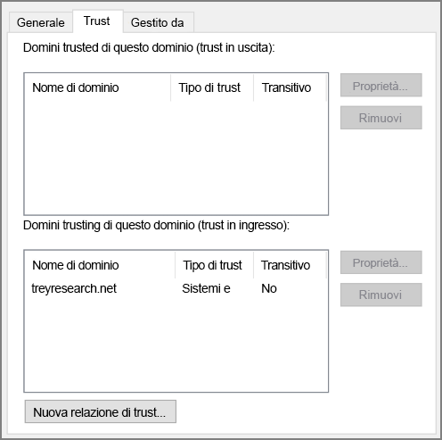

# <a name="create-an-active-directory-domain-services-ad-ds-resource-forest-in-azure"></a><span data-ttu-id="18f53-104">Creare una foresta di risorse di Active Directory Domain Services in Azure</span><span class="sxs-lookup"><span data-stu-id="18f53-104">Create an Active Directory Domain Services (AD DS) resource forest in Azure</span></span>

<span data-ttu-id="18f53-105">Questa architettura di riferimento illustra come creare un dominio di Active Directory separato in Azure considerato attendibile dai domini nella foresta di Active Directory locale.</span><span class="sxs-lookup"><span data-stu-id="18f53-105">This reference architecture shows how to create a separate Active Directory domain in Azure that is trusted by domains in your on-premises AD forest.</span></span> [<span data-ttu-id="18f53-106">**Distribuire questa soluzione**.</span><span class="sxs-lookup"><span data-stu-id="18f53-106">**Deploy this solution**.</span></span>](#deploy-the-solution)

<span data-ttu-id="18f53-107">[![0]][0]</span><span class="sxs-lookup"><span data-stu-id="18f53-107">[![0]][0]</span></span> 

<span data-ttu-id="18f53-108">*Scaricare un [file Visio][visio-download] di questa architettura.*</span><span class="sxs-lookup"><span data-stu-id="18f53-108">*Download a [Visio file][visio-download] of this architecture.*</span></span>

<span data-ttu-id="18f53-109">Active Directory Domain Services archivia le informazioni di identità in una struttura gerarchica.</span><span class="sxs-lookup"><span data-stu-id="18f53-109">Active Directory Domain Services (AD DS) stores identity information in a hierarchical structure.</span></span> <span data-ttu-id="18f53-110">Il nodo principale nella struttura gerarchica è noto come foresta.</span><span class="sxs-lookup"><span data-stu-id="18f53-110">The top node in the hierarchical structure is known as a forest.</span></span> <span data-ttu-id="18f53-111">Una foresta contiene domini e i domini contengono altri tipi di oggetti.</span><span class="sxs-lookup"><span data-stu-id="18f53-111">A forest contains domains, and domains contain other types of objects.</span></span> <span data-ttu-id="18f53-112">Questa architettura di riferimento crea una foresta di Active Directory Domain Services in Azure con una relazione di trust unidirezionale in uscita con un dominio locale.</span><span class="sxs-lookup"><span data-stu-id="18f53-112">This reference architecture creates an AD DS forest in Azure with a one-way outgoing trust relationship with an on-premises domain.</span></span> <span data-ttu-id="18f53-113">La foresta in Azure contiene un dominio che non esiste in locale.</span><span class="sxs-lookup"><span data-stu-id="18f53-113">The forest in Azure contains a domain that does not exist on-premises.</span></span> <span data-ttu-id="18f53-114">A causa della relazione di trust, gli accessi effettuati nei domini locali possono essere considerati attendibili per accedere alle risorse nel dominio di Azure separato.</span><span class="sxs-lookup"><span data-stu-id="18f53-114">Because of the trust relationship, logons made against on-premises domains can be trusted for access to resources in the separate Azure domain.</span></span> 

<span data-ttu-id="18f53-115">Gli usi tipici di questa architettura includono mantenere la separazione della sicurezza per le identità e gli oggetti contenuti nel cloud ed eseguire la migrazione di singoli domini da un ambiente locale al cloud.</span><span class="sxs-lookup"><span data-stu-id="18f53-115">Typical uses for this architecture include maintaining security separation for objects and identities held in the cloud, and migrating individual domains from on-premises to the cloud.</span></span> 

<span data-ttu-id="18f53-116">Per altre considerazioni, vedere l'articolo su come [scegliere una soluzione per l'integrazione di Active Directory locale con Azure][considerations].</span><span class="sxs-lookup"><span data-stu-id="18f53-116">For additional considerations, see [Choose a solution for integrating on-premises Active Directory with Azure][considerations].</span></span> 

## <a name="architecture"></a><span data-ttu-id="18f53-117">Architettura</span><span class="sxs-lookup"><span data-stu-id="18f53-117">Architecture</span></span>

<span data-ttu-id="18f53-118">L'architettura include i componenti indicati di seguito.</span><span class="sxs-lookup"><span data-stu-id="18f53-118">The architecture has the following components.</span></span>

* <span data-ttu-id="18f53-119">**Rete locale**.</span><span class="sxs-lookup"><span data-stu-id="18f53-119">**On-premises network**.</span></span> <span data-ttu-id="18f53-120">La rete locale contiene la propria foresta di Active Directory con i relativi domini.</span><span class="sxs-lookup"><span data-stu-id="18f53-120">The on-premises network contains its own Active Directory forest and domains.</span></span>
* <span data-ttu-id="18f53-121">**Server Active Directory**.</span><span class="sxs-lookup"><span data-stu-id="18f53-121">**Active Directory servers**.</span></span> <span data-ttu-id="18f53-122">Sono i controller di dominio che implementano i servizi di dominio in esecuzione come macchine virtuali nel cloud.</span><span class="sxs-lookup"><span data-stu-id="18f53-122">These are domain controllers implementing domain services running as VMs in the cloud.</span></span> <span data-ttu-id="18f53-123">Questi server ospitano una foresta che contiene uno o più domini, separati da quelli locali.</span><span class="sxs-lookup"><span data-stu-id="18f53-123">These servers host a forest containing one or more domains, separate from those located on-premises.</span></span>
* <span data-ttu-id="18f53-124">**Relazione di trust unidirezionale**.</span><span class="sxs-lookup"><span data-stu-id="18f53-124">**One-way trust relationship**.</span></span> <span data-ttu-id="18f53-125">L'esempio nel diagramma mostra una relazione di trust unidirezionale dal dominio in Azure al dominio locale.</span><span class="sxs-lookup"><span data-stu-id="18f53-125">The example in the diagram shows a one-way trust from the domain in Azure to the on-premises domain.</span></span> <span data-ttu-id="18f53-126">Questa relazione consente agli utenti locali di accedere alle risorse nel dominio in Azure, ma non viceversa.</span><span class="sxs-lookup"><span data-stu-id="18f53-126">This relationship enables on-premises users to access resources in the domain in Azure, but not the other way around.</span></span> <span data-ttu-id="18f53-127">È possibile creare un trust bidirezionale se gli utenti cloud richiedono l'accesso anche alle risorse locali.</span><span class="sxs-lookup"><span data-stu-id="18f53-127">It is possible to create a two-way trust if cloud users also require access to on-premises resources.</span></span>
* <span data-ttu-id="18f53-128">**Subnet di Active Directory**.</span><span class="sxs-lookup"><span data-stu-id="18f53-128">**Active Directory subnet**.</span></span> <span data-ttu-id="18f53-129">I server di Active Directory Domain Services sono ospitati in una subnet separata.</span><span class="sxs-lookup"><span data-stu-id="18f53-129">The AD DS servers are hosted in a separate subnet.</span></span> <span data-ttu-id="18f53-130">Le regole del gruppo di sicurezza di rete (NSG) proteggono i server di Active Directory Domain Services e fungono da firewall per il traffico da origini non previste.</span><span class="sxs-lookup"><span data-stu-id="18f53-130">Network security group (NSG) rules protect the AD DS servers and provide a firewall against traffic from unexpected sources.</span></span>
* <span data-ttu-id="18f53-131">**Gateway di Azure**.</span><span class="sxs-lookup"><span data-stu-id="18f53-131">**Azure gateway**.</span></span> <span data-ttu-id="18f53-132">Il gateway di Azure fornisce una connessione tra la rete virtuale di Azure e la rete locale.</span><span class="sxs-lookup"><span data-stu-id="18f53-132">The Azure gateway provides a connection between the on-premises network and the Azure VNet.</span></span> <span data-ttu-id="18f53-133">Può trattarsi di una [connessione VPN][azure-vpn-gateway] o [Azure ExpressRoute][azure-expressroute].</span><span class="sxs-lookup"><span data-stu-id="18f53-133">This can be a [VPN connection][azure-vpn-gateway] or [Azure ExpressRoute][azure-expressroute].</span></span> <span data-ttu-id="18f53-134">Per altre informazioni, vedere [Implementazione di un'architettura di rete ibrida sicura in Azure][implementing-a-secure-hybrid-network-architecture].</span><span class="sxs-lookup"><span data-stu-id="18f53-134">For more information, see [Implementing a secure hybrid network architecture in Azure][implementing-a-secure-hybrid-network-architecture].</span></span>

## <a name="recommendations"></a><span data-ttu-id="18f53-135">Consigli</span><span class="sxs-lookup"><span data-stu-id="18f53-135">Recommendations</span></span>

<span data-ttu-id="18f53-136">Per consigli specifici sull'implementazione di Active Directory in Azure, vedere gli articoli seguenti:</span><span class="sxs-lookup"><span data-stu-id="18f53-136">For specific recommendations on implementing Active Directory in Azure, see the following articles:</span></span>

- <span data-ttu-id="18f53-137">[Estensione di Active Directory Domain Services in Azure][adds-extend-domain].</span><span class="sxs-lookup"><span data-stu-id="18f53-137">[Extending Active Directory Domain Services (AD DS) to Azure][adds-extend-domain].</span></span> 
- <span data-ttu-id="18f53-138">[Linee guida per la distribuzione di Active Directory di Windows Server in macchine virtuali di Azure][ad-azure-guidelines].</span><span class="sxs-lookup"><span data-stu-id="18f53-138">[Guidelines for Deploying Windows Server Active Directory on Azure Virtual Machines][ad-azure-guidelines].</span></span>

### <a name="trust"></a><span data-ttu-id="18f53-139">Trust</span><span class="sxs-lookup"><span data-stu-id="18f53-139">Trust</span></span>

<span data-ttu-id="18f53-140">I domini locali sono contenuti in una foresta diversa rispetto ai domini nel cloud.</span><span class="sxs-lookup"><span data-stu-id="18f53-140">The on-premises domains are contained within a different forest from the domains in the cloud.</span></span> <span data-ttu-id="18f53-141">Per abilitare l'autenticazione degli utenti locali nel cloud, i domini in Azure devono considerare attendibile il dominio di accesso nella foresta locale.</span><span class="sxs-lookup"><span data-stu-id="18f53-141">To enable authentication of on-premises users in the cloud, the domains in Azure must trust the logon domain in the on-premises forest.</span></span> <span data-ttu-id="18f53-142">Analogamente, se il cloud offre un dominio di accesso per gli utenti esterni, può essere necessario che la foresta locale consideri attendibile il dominio cloud.</span><span class="sxs-lookup"><span data-stu-id="18f53-142">Similarly, if the cloud provides a logon domain for external users, it may be necessary for the on-premises forest to trust the cloud domain.</span></span>

<span data-ttu-id="18f53-143">È possibile stabilire relazioni di trust a livello di foresta, [creando trust tra foreste][creating-forest-trusts], o a livello di dominio, [creando trust esterni][creating-external-trusts].</span><span class="sxs-lookup"><span data-stu-id="18f53-143">You can establish trusts at the forest level by [creating forest trusts][creating-forest-trusts], or at the domain level by [creating external trusts][creating-external-trusts].</span></span> <span data-ttu-id="18f53-144">Un trust a livello di foresta crea una relazione tra tutti i domini in due foreste.</span><span class="sxs-lookup"><span data-stu-id="18f53-144">A forest level trust creates a relationship between all domains in two forests.</span></span> <span data-ttu-id="18f53-145">Un trust a livello di dominio esterno crea solo una relazione tra i due domini specificati.</span><span class="sxs-lookup"><span data-stu-id="18f53-145">An external domain level trust only creates a relationship between two specified domains.</span></span> <span data-ttu-id="18f53-146">È consigliabile creare trust a livello di dominio esterno solo tra domini in foreste diverse.</span><span class="sxs-lookup"><span data-stu-id="18f53-146">You should only create external domain level trusts between domains in different forests.</span></span>

<span data-ttu-id="18f53-147">I trust possono essere unidirezionali o bidirezionali:</span><span class="sxs-lookup"><span data-stu-id="18f53-147">Trusts can be unidirectional (one-way) or bidirectional (two-way):</span></span>

* <span data-ttu-id="18f53-148">Un trust unidirezionale consente agli utenti in un dominio o foresta (noti come dominio o foresta *in ingresso*) per accedere alle risorse contenute in un altro dominio o foresta (il dominio o foresta *in uscita*).</span><span class="sxs-lookup"><span data-stu-id="18f53-148">A one-way trust enables users in one domain or forest (known as the *incoming* domain or forest) to access the resources held in another (the *outgoing* domain or forest).</span></span>
* <span data-ttu-id="18f53-149">Un trust bidirezionale consente agli utenti nel dominio o nella foresta di accedere alle risorse contenute nell'altro dominio o foresta.</span><span class="sxs-lookup"><span data-stu-id="18f53-149">A two-way trust enables users in either domain or forest to access resources held in the other.</span></span>

<span data-ttu-id="18f53-150">La tabella seguente presenta un riepilogo delle configurazioni di trust per alcuni semplici scenari:</span><span class="sxs-lookup"><span data-stu-id="18f53-150">The following table summarizes trust configurations for some simple scenarios:</span></span>

| <span data-ttu-id="18f53-151">Scenario</span><span class="sxs-lookup"><span data-stu-id="18f53-151">Scenario</span></span> | <span data-ttu-id="18f53-152">Trust locale</span><span class="sxs-lookup"><span data-stu-id="18f53-152">On-premises trust</span></span> | <span data-ttu-id="18f53-153">Trust cloud</span><span class="sxs-lookup"><span data-stu-id="18f53-153">Cloud trust</span></span> |
| --- | --- | --- |
| <span data-ttu-id="18f53-154">Gli utenti locali richiedono l'accesso alle risorse nel cloud, ma non viceversa</span><span class="sxs-lookup"><span data-stu-id="18f53-154">On-premises users require access to resources in the cloud, but not vice versa</span></span> |<span data-ttu-id="18f53-155">Unidirezionale in ingresso</span><span class="sxs-lookup"><span data-stu-id="18f53-155">One-way, incoming</span></span> |<span data-ttu-id="18f53-156">Unidirezionale in uscita</span><span class="sxs-lookup"><span data-stu-id="18f53-156">One-way, outgoing</span></span> |
| <span data-ttu-id="18f53-157">Gli utenti nel cloud richiedono l'accesso alle risorse nel cloud, ma non viceversa</span><span class="sxs-lookup"><span data-stu-id="18f53-157">Users in the cloud require access to resources located on-premises, but not vice versa</span></span> |<span data-ttu-id="18f53-158">Unidirezionale in uscita</span><span class="sxs-lookup"><span data-stu-id="18f53-158">One-way, outgoing</span></span> |<span data-ttu-id="18f53-159">Unidirezionale in ingresso</span><span class="sxs-lookup"><span data-stu-id="18f53-159">One-way, incoming</span></span> |
| <span data-ttu-id="18f53-160">Gli utenti locali e nel cloud richiedono entrambi l'accesso alle risorse contenute nel cloud e locali</span><span class="sxs-lookup"><span data-stu-id="18f53-160">Users in the cloud and on-premises both requires access to resources held in the cloud and on-premises</span></span> |<span data-ttu-id="18f53-161">Bidirezionale, in ingresso e in uscita</span><span class="sxs-lookup"><span data-stu-id="18f53-161">Two-way, incoming and outgoing</span></span> |<span data-ttu-id="18f53-162">Bidirezionale, in ingresso e in uscita</span><span class="sxs-lookup"><span data-stu-id="18f53-162">Two-way, incoming and outgoing</span></span> |

## <a name="scalability-considerations"></a><span data-ttu-id="18f53-163">Considerazioni sulla scalabilità</span><span class="sxs-lookup"><span data-stu-id="18f53-163">Scalability considerations</span></span>

<span data-ttu-id="18f53-164">Active Directory offre scalabilità automatica per i controller di dominio che fanno parte dello stesso dominio.</span><span class="sxs-lookup"><span data-stu-id="18f53-164">Active Directory is automatically scalable for domain controllers that are part of the same domain.</span></span> <span data-ttu-id="18f53-165">Le richieste vengono distribuite tra tutti i controller all'interno di un dominio.</span><span class="sxs-lookup"><span data-stu-id="18f53-165">Requests are distributed across all controllers within a domain.</span></span> <span data-ttu-id="18f53-166">È possibile aggiungere un altro controller di dominio, che viene sincronizzato automaticamente con il dominio.</span><span class="sxs-lookup"><span data-stu-id="18f53-166">You can add another domain controller, and it synchronizes automatically with the domain.</span></span> <span data-ttu-id="18f53-167">Non configurare un dispositivo di bilanciamento del carico separato per indirizzare il traffico verso i controller all'interno del dominio.</span><span class="sxs-lookup"><span data-stu-id="18f53-167">Do not configure a separate load balancer to direct traffic to controllers within the domain.</span></span> <span data-ttu-id="18f53-168">Verificare che tutti i controller di dominio dispongano di risorse di memoria e archiviazione sufficienti per gestire il database del dominio.</span><span class="sxs-lookup"><span data-stu-id="18f53-168">Ensure that all domain controllers have sufficient memory and storage resources to handle the domain database.</span></span> <span data-ttu-id="18f53-169">Impostare dimensioni uguali per tutte le macchine virtuali del controller di dominio.</span><span class="sxs-lookup"><span data-stu-id="18f53-169">Make all domain controller VMs the same size.</span></span>

## <a name="availability-considerations"></a><span data-ttu-id="18f53-170">Considerazioni sulla disponibilità</span><span class="sxs-lookup"><span data-stu-id="18f53-170">Availability considerations</span></span>

<span data-ttu-id="18f53-171">Eseguire il provisioning di almeno due controller di dominio per ogni dominio.</span><span class="sxs-lookup"><span data-stu-id="18f53-171">Provision at least two domain controllers for each domain.</span></span> <span data-ttu-id="18f53-172">Questo consente la replica automatica tra server.</span><span class="sxs-lookup"><span data-stu-id="18f53-172">This enables automatic replication between servers.</span></span> <span data-ttu-id="18f53-173">Creare un set di disponibilità per le macchine virtuali che fungono da server Active Directory per la gestione di ogni dominio.</span><span class="sxs-lookup"><span data-stu-id="18f53-173">Create an availability set for the VMs acting as Active Directory servers handling each domain.</span></span> <span data-ttu-id="18f53-174">In questo set di disponibilità, inserire almeno due server.</span><span class="sxs-lookup"><span data-stu-id="18f53-174">Put at least two servers in this availability set.</span></span>

<span data-ttu-id="18f53-175">Inoltre, è opportuno designare uno o più server in ogni dominio come [master operazioni in standby][standby-operations-masters], in caso di errori di connettività con un server che riveste il ruolo FSMO (Flexible Single Master Operation).</span><span class="sxs-lookup"><span data-stu-id="18f53-175">Also, consider designating one or more servers in each domain as [standby operations masters][standby-operations-masters] in case connectivity to a server acting as a flexible single master operation (FSMO) role fails.</span></span>

## <a name="manageability-considerations"></a><span data-ttu-id="18f53-176">Considerazioni sulla gestibilità</span><span class="sxs-lookup"><span data-stu-id="18f53-176">Manageability considerations</span></span>

<span data-ttu-id="18f53-177">Per considerazioni sulla gestione e il monitoraggio, vedere [Estensione di Active Directory Domain Services in Azure][adds-extend-domain].</span><span class="sxs-lookup"><span data-stu-id="18f53-177">For information about management and monitoring considerations, see [Extending Active Directory to Azure][adds-extend-domain].</span></span> 
 
<span data-ttu-id="18f53-178">Per altre informazioni, vedere [Monitoring Active Directory][monitoring_ad] (Monitoraggio di Active Directory).</span><span class="sxs-lookup"><span data-stu-id="18f53-178">For additional information, see [Monitoring Active Directory][monitoring_ad].</span></span> <span data-ttu-id="18f53-179">È possibile installare strumenti come [Microsoft Systems Center][microsoft_systems_center] in un server di monitoraggio della subnet di gestione per agevolare l'esecuzione di queste attività.</span><span class="sxs-lookup"><span data-stu-id="18f53-179">You can install tools such as [Microsoft Systems Center][microsoft_systems_center] on a monitoring server in the management subnet to help perform these tasks.</span></span>

## <a name="security-considerations"></a><span data-ttu-id="18f53-180">Considerazioni relative alla sicurezza</span><span class="sxs-lookup"><span data-stu-id="18f53-180">Security considerations</span></span>

<span data-ttu-id="18f53-181">I trust a livello di foresta sono transitivi.</span><span class="sxs-lookup"><span data-stu-id="18f53-181">Forest level trusts are transitive.</span></span> <span data-ttu-id="18f53-182">Se si stabilisce un trust a livello di foresta tra una foresta locale e una foresta nel cloud, la relazione di trust viene estesa ai nuovi domini creati in entrambe le foreste.</span><span class="sxs-lookup"><span data-stu-id="18f53-182">If you establish a forest level trust between an on-premises forest and a forest in the cloud, this trust is extended to other new domains created in either forest.</span></span> <span data-ttu-id="18f53-183">Se si usano i domini per implementare la separazione a scopo di sicurezza, è consigliabile creare trust solo a livello di dominio.</span><span class="sxs-lookup"><span data-stu-id="18f53-183">If you use domains to provide separation for security purposes, consider creating trusts at the domain level only.</span></span> <span data-ttu-id="18f53-184">I trust a livello di dominio sono non transitivi.</span><span class="sxs-lookup"><span data-stu-id="18f53-184">Domain level trusts are non-transitive.</span></span>

<span data-ttu-id="18f53-185">Per considerazioni sulla sicurezza specifiche di Active Directory, vedere la sezione corrispondente in [Estensione di Active Directory Domain Services in Azure][adds-extend-domain].</span><span class="sxs-lookup"><span data-stu-id="18f53-185">For Active Directory-specific security considerations, see the security considerations section in [Extending Active Directory to Azure][adds-extend-domain].</span></span>

## <a name="deploy-the-solution"></a><span data-ttu-id="18f53-186">Distribuire la soluzione</span><span class="sxs-lookup"><span data-stu-id="18f53-186">Deploy the solution</span></span>

<span data-ttu-id="18f53-187">Una distribuzione di questa architettura è disponibile in [GitHub][github].</span><span class="sxs-lookup"><span data-stu-id="18f53-187">A deployment for this architecture is available on [GitHub][github].</span></span> <span data-ttu-id="18f53-188">Si noti che l'intera distribuzione può richiedere fino a due ore, incluso la creazione del gateway VPN e l'esecuzione degli script che consentono di configurare Active Directory Domain Services.</span><span class="sxs-lookup"><span data-stu-id="18f53-188">Note that the entire deployment can take up to two hours, which includes creating the VPN gateway and running the scripts that configure AD DS.</span></span>

### <a name="prerequisites"></a><span data-ttu-id="18f53-189">Prerequisiti</span><span class="sxs-lookup"><span data-stu-id="18f53-189">Prerequisites</span></span>

[!INCLUDE [ref-arch-prerequisites.md](../../../includes/ref-arch-prerequisites.md)]

### <a name="deploy-the-simulated-on-premises-datacenter"></a><span data-ttu-id="18f53-190">Distribuire il data center locale simulato</span><span class="sxs-lookup"><span data-stu-id="18f53-190">Deploy the simulated on-premises datacenter</span></span>

1. <span data-ttu-id="18f53-191">Passare alla cartella `identity/adds-forest` del repository GitHub.</span><span class="sxs-lookup"><span data-stu-id="18f53-191">Navigate to the `identity/adds-forest` folder of the GitHub repository.</span></span>

2. <span data-ttu-id="18f53-192">Aprire il file `onprem.json` .</span><span class="sxs-lookup"><span data-stu-id="18f53-192">Open the `onprem.json` file.</span></span> <span data-ttu-id="18f53-193">Cercare istanze di `adminPassword` e `Password` e aggiungere i valori per le password.</span><span class="sxs-lookup"><span data-stu-id="18f53-193">Search for instances of `adminPassword` and `Password` and add values for the passwords.</span></span>

3. <span data-ttu-id="18f53-194">Eseguire il comando seguente e attendere il completamento della distribuzione:</span><span class="sxs-lookup"><span data-stu-id="18f53-194">Run the following command and wait for the deployment to finish:</span></span>

    ```bash
    azbb -s <subscription_id> -g <resource group> -l <location> -p onprem.json --deploy
    ```

### <a name="deploy-the-azure-vnet"></a><span data-ttu-id="18f53-195">Distribuire la rete virtuale di Azure</span><span class="sxs-lookup"><span data-stu-id="18f53-195">Deploy the Azure VNet</span></span>

1. <span data-ttu-id="18f53-196">Aprire il file `azure.json` .</span><span class="sxs-lookup"><span data-stu-id="18f53-196">Open the `azure.json` file.</span></span> <span data-ttu-id="18f53-197">Cercare istanze di `adminPassword` e `Password` e aggiungere i valori per le password.</span><span class="sxs-lookup"><span data-stu-id="18f53-197">Search for instances of `adminPassword` and `Password` and add values for the passwords.</span></span>

2. <span data-ttu-id="18f53-198">Nello stesso file cercare le istanze di `sharedKey` e immettere le chiavi condivise per la connessione VPN.</span><span class="sxs-lookup"><span data-stu-id="18f53-198">In the same file, search for instances of `sharedKey` and enter shared keys for the VPN connection.</span></span> 

    ```bash
    "sharedKey": "",
    ```

3. <span data-ttu-id="18f53-199">Eseguire il comando seguente e attendere il completamento della distribuzione.</span><span class="sxs-lookup"><span data-stu-id="18f53-199">Run the following command and wait for the deployment to finish.</span></span>

    ```bash
    azbb -s <subscription_id> -g <resource group> -l <location> -p onoprem.json --deploy
    ```

   <span data-ttu-id="18f53-200">Eseguire la distribuzione nello stesso gruppo di risorse della rete virtuale locale.</span><span class="sxs-lookup"><span data-stu-id="18f53-200">Deploy to the same resource group as the on-premises VNet.</span></span>


### <a name="test-the-ad-trust-relation"></a><span data-ttu-id="18f53-201">Testare la relazione di trust di Active Directory</span><span class="sxs-lookup"><span data-stu-id="18f53-201">Test the AD trust relation</span></span>

1. <span data-ttu-id="18f53-202">Usare il portale di Azure per passare al gruppo di risorse creato.</span><span class="sxs-lookup"><span data-stu-id="18f53-202">Use the Azure portal, navigate to the resource group that you created.</span></span>

2. <span data-ttu-id="18f53-203">Usare il portale di Azure per trovare la macchina virtuale di Azure denominata `ra-adt-mgmt-vm1`.</span><span class="sxs-lookup"><span data-stu-id="18f53-203">Use the Azure portal to find the VM named `ra-adt-mgmt-vm1`.</span></span>

2. <span data-ttu-id="18f53-204">Fare clic su `Connect` per aprire una sessione di desktop remoto per la macchina virtuale.</span><span class="sxs-lookup"><span data-stu-id="18f53-204">Click `Connect` to open a remote desktop session to the VM.</span></span> <span data-ttu-id="18f53-205">Il nome utente è `contoso\testuser` e la password è quella specificata nel file parametro `onprem.json`.</span><span class="sxs-lookup"><span data-stu-id="18f53-205">The username is `contoso\testuser`, and the password is the one that you specified in the `onprem.json` parameter file.</span></span>

3. <span data-ttu-id="18f53-206">All'interno della sessione Desktop remoto, aprire un'altra sessione Desktop remoto per 192.168.0.4, ovvero l'indirizzo IP della macchina virtuale denominata `ra-adtrust-onpremise-ad-vm1`.</span><span class="sxs-lookup"><span data-stu-id="18f53-206">From inside your remote desktop session, open another remote desktop session to 192.168.0.4, which is the IP address of the VM named `ra-adtrust-onpremise-ad-vm1`.</span></span> <span data-ttu-id="18f53-207">Il nome utente è `contoso\testuser` e la password è quella specificata nel file parametro `azure.json`.</span><span class="sxs-lookup"><span data-stu-id="18f53-207">The username is `contoso\testuser`, and the password is the one that you specified in the `azure.json` parameter file.</span></span>

4. <span data-ttu-id="18f53-208">Dall'interno della sessione Desktop remoto per `ra-adtrust-onpremise-ad-vm1`, passare a **Server Manager** e fare clic su **Strumenti** > **Domini e trust di Active Directory**.</span><span class="sxs-lookup"><span data-stu-id="18f53-208">From inside the remote desktop session for `ra-adtrust-onpremise-ad-vm1`, go to **Server Manager** and click **Tools** > **Active Directory Domains and Trusts**.</span></span> 

5. <span data-ttu-id="18f53-209">Nel riquadro sinistro fare clic su contoso.com e selezionare **Proprietà**.</span><span class="sxs-lookup"><span data-stu-id="18f53-209">In the left pane, right-click on the contoso.com and select **Properties**.</span></span>

6. <span data-ttu-id="18f53-210">Scegliere la scheda **Trust**. Sarà visibile treyresearch.net elencato come trust in ingresso.</span><span class="sxs-lookup"><span data-stu-id="18f53-210">Click the **Trusts** tab. You should see treyresearch.net listed as an incoming trust.</span></span>




## <a name="next-steps"></a><span data-ttu-id="18f53-211">Passaggi successivi</span><span class="sxs-lookup"><span data-stu-id="18f53-211">Next steps</span></span>

* <span data-ttu-id="18f53-212">Procedure consigliate per [estendere il dominio di Active Directory Domain Services in Azure][adds-extend-domain]</span><span class="sxs-lookup"><span data-stu-id="18f53-212">Learn the best practices for [extending your on-premises AD DS domain to Azure][adds-extend-domain]</span></span>
* <span data-ttu-id="18f53-213">Procedure consigliate per [creare un'infrastruttura Active Directory Federation Services][adfs] in Azure.</span><span class="sxs-lookup"><span data-stu-id="18f53-213">Learn the best practices for [creating an AD FS infrastructure][adfs] in Azure.</span></span>

<!-- links -->
[adds-extend-domain]: adds-extend-domain.md
[adfs]: adfs.md
[azure-cli-2]: /azure/install-azure-cli
[azbb]: https://github.com/mspnp/template-building-blocks/wiki/Install-Azure-Building-Blocks

[implementing-a-secure-hybrid-network-architecture]: ../dmz/secure-vnet-hybrid.md
[implementing-a-secure-hybrid-network-architecture-with-internet-access]: ../dmz/secure-vnet-dmz.md

[running-VMs-for-an-N-tier-architecture-on-Azure]: ../virtual-machines-windows/n-tier.md

[ad-azure-guidelines]: https://msdn.microsoft.com/library/azure/jj156090.aspx
[azure-expressroute]: https://azure.microsoft.com/documentation/articles/expressroute-introduction/
[azure-vpn-gateway]: https://azure.microsoft.com/documentation/articles/vpn-gateway-about-vpngateways/
[considerations]: ./considerations.md
[creating-external-trusts]: https://technet.microsoft.com/library/cc816837(v=ws.10).aspx
[creating-forest-trusts]: https://technet.microsoft.com/library/cc816810(v=ws.10).aspx
[github]: https://github.com/mspnp/identity-reference-architectures/tree/master/adds-forest
[incoming-trust]: https://raw.githubusercontent.com/mspnp/identity-reference-architectures/master/adds-forest/extensions/incoming-trust.ps1
[microsoft_systems_center]: https://microsoft.com/cloud-platform/system-center
[monitoring_ad]: https://msdn.microsoft.com/library/bb727046.aspx
[resource-manager-overview]: /azure/azure-resource-manager/resource-group-overview
[solution-script]: https://raw.githubusercontent.com/mspnp/identity-reference-architectures/master/adds-forest/Deploy-ReferenceArchitecture.ps1
[standby-operations-masters]: https://technet.microsoft.com/library/cc794737(v=ws.10).aspx
[outgoing-trust]: https://raw.githubusercontent.com/mspnp/identity-reference-architectures/master/adds-forest/extensions/outgoing-trust.ps1
[verify-a-trust]: https://technet.microsoft.com/library/cc753821.aspx
[visio-download]: https://archcenter.blob.core.windows.net/cdn/identity-architectures.vsdx
[0]: ./images/adds-forest.png "Architettura di rete ibrida sicura con domini di Active Directory separati"
