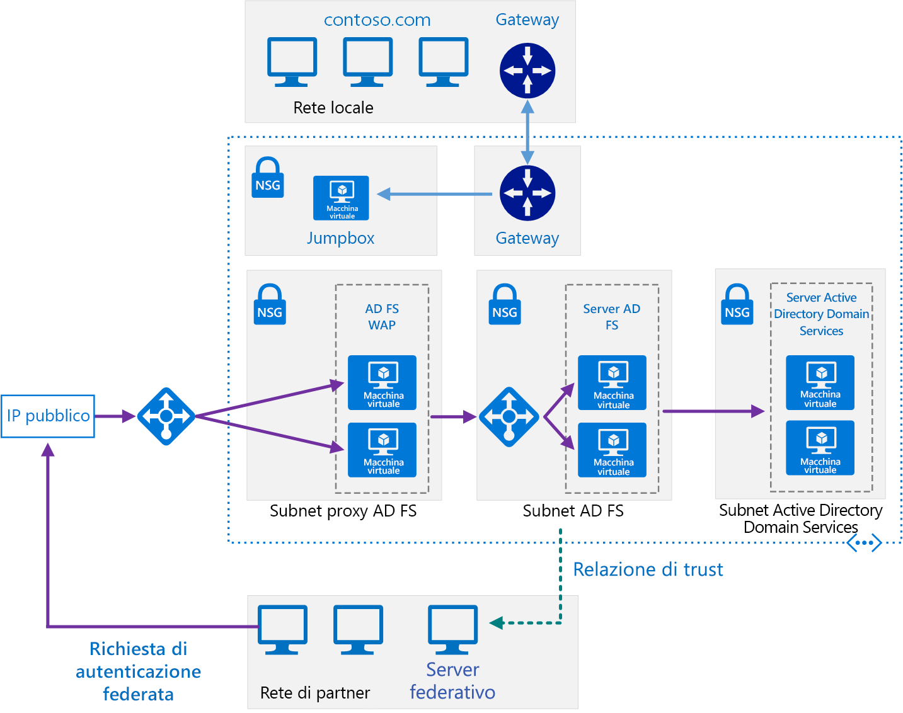

# <a name="extend-active-directory-federation-services-ad-fs-to-azure"></a><span data-ttu-id="71742-103">Estendere Active Directory Federation Services in Azure</span><span class="sxs-lookup"><span data-stu-id="71742-103">Extend Active Directory Federation Services (AD FS) to Azure</span></span>

<span data-ttu-id="71742-104">Questa architettura di riferimento implementa una rete ibrida protetta che consente di estendere la rete locale in Azure e usa [Active Directory Federation Services (ADFS)][active-directory-federation-services] per eseguire l'autorizzazione e l'autenticazione federate per i componenti in esecuzione in Azure.</span><span class="sxs-lookup"><span data-stu-id="71742-104">This reference architecture implements a secure hybrid network that extends your on-premises network to Azure and uses [Active Directory Federation Services (AD FS)][active-directory-federation-services] to perform federated authentication and authorization for components running in Azure.</span></span> <span data-ttu-id="71742-105">[**Distribuire questa soluzione**](#deploy-the-solution).</span><span class="sxs-lookup"><span data-stu-id="71742-105">[**Deploy this solution**](#deploy-the-solution).</span></span>



<span data-ttu-id="71742-107">*Scaricare un [file Visio][visio-download] di questa architettura.*</span><span class="sxs-lookup"><span data-stu-id="71742-107">*Download a [Visio file][visio-download] of this architecture.*</span></span>

<span data-ttu-id="71742-108">AD FS può essere ospitato in locale ma, se l'applicazione è un ibrido in cui alcune parti vengono implementate in Azure, potrebbe essere più efficace replicare AD FS nel cloud.</span><span class="sxs-lookup"><span data-stu-id="71742-108">AD FS can be hosted on-premises, but if your application is a hybrid in which some parts are implemented in Azure, it may be more efficient to replicate AD FS in the cloud.</span></span>

<span data-ttu-id="71742-109">Il diagramma illustra gli scenari seguenti:</span><span class="sxs-lookup"><span data-stu-id="71742-109">The diagram shows the following scenarios:</span></span>

- <span data-ttu-id="71742-110">Il codice dell'applicazione di un'organizzazione partner accede a un'applicazione Web ospitata all'interno della rete virtuale di Azure.</span><span class="sxs-lookup"><span data-stu-id="71742-110">Application code from a partner organization accesses a web application hosted inside your Azure VNet.</span></span>
- <span data-ttu-id="71742-111">Un utente esterno registrato con le credenziali archiviate all'interno di Active Directory Domain Services (AD DS) accede a un'applicazione Web ospitata nella rete virtuale di Azure.</span><span class="sxs-lookup"><span data-stu-id="71742-111">An external, registered user with credentials stored inside Active Directory Domain Services (DS) accesses a web application hosted inside your Azure VNet.</span></span>
- <span data-ttu-id="71742-112">Un utente connesso alla rete virtuale con un dispositivo autorizzato esegue un'applicazione Web ospitata nella rete virtuale di Azure.</span><span class="sxs-lookup"><span data-stu-id="71742-112">A user connected to your VNet using an authorized device executes a web application hosted inside your Azure VNet.</span></span>

<span data-ttu-id="71742-113">Tra gli usi tipici di questa architettura sono inclusi:</span><span class="sxs-lookup"><span data-stu-id="71742-113">Typical uses for this architecture include:</span></span>

- <span data-ttu-id="71742-114">Applicazioni ibride in cui i carichi di lavoro vengono eseguiti in parte in locale e in parte in Azure.</span><span class="sxs-lookup"><span data-stu-id="71742-114">Hybrid applications where workloads run partly on-premises and partly in Azure.</span></span>
- <span data-ttu-id="71742-115">Soluzioni che usano l'autorizzazione federata per esporre le applicazioni Web per le organizzazioni partner.</span><span class="sxs-lookup"><span data-stu-id="71742-115">Solutions that use federated authorization to expose web applications to partner organizations.</span></span>
- <span data-ttu-id="71742-116">Sistemi che supportano l'accesso da Web browser in esecuzione all'esterno del firewall aziendale.</span><span class="sxs-lookup"><span data-stu-id="71742-116">Systems that support access from web browsers running outside of the organizational firewall.</span></span>
- <span data-ttu-id="71742-117">Sistemi che consentono agli utenti di accedere alle applicazioni Web tramite la connessione da dispositivi esterni autorizzati, ad esempio computer remoti, notebook e altri dispositivi mobili.</span><span class="sxs-lookup"><span data-stu-id="71742-117">Systems that enable users to access to web applications by connecting from authorized external devices such as remote computers, notebooks, and other mobile devices.</span></span>

<span data-ttu-id="71742-118">Questa architettura di riferimento è incentrata sulla *federazione passiva*, in cui i server federativi decidono come e quando autenticare un utente.</span><span class="sxs-lookup"><span data-stu-id="71742-118">This reference architecture focuses on *passive federation*, in which the federation servers decide how and when to authenticate a user.</span></span> <span data-ttu-id="71742-119">L'utente fornisce informazioni di accesso quando l'applicazione viene avviata.</span><span class="sxs-lookup"><span data-stu-id="71742-119">The user provides sign in information when the application is started.</span></span> <span data-ttu-id="71742-120">Questo meccanismo viene usato più comunemente dai Web browser e prevede un protocollo che reindirizza il browser a un sito in cui l'utente viene autenticato.</span><span class="sxs-lookup"><span data-stu-id="71742-120">This mechanism is most commonly used by web browsers and involves a protocol that redirects the browser to a site where the user authenticates.</span></span> <span data-ttu-id="71742-121">AD FS supporta anche la *federazione attiva*, in cui un'applicazione si assume la responsabilità di fornire le credenziali senza ulteriore intervento dell'utente, ma questo scenario non rientra nell'ambito di questa architettura.</span><span class="sxs-lookup"><span data-stu-id="71742-121">AD FS also supports *active federation*, where an application takes on responsibility for supplying credentials without further user interaction, but that scenario is outside the scope of this architecture.</span></span>

<span data-ttu-id="71742-122">Per altre considerazioni, vedere l'articolo su come [scegliere una soluzione per l'integrazione di Active Directory locale con Azure][considerations].</span><span class="sxs-lookup"><span data-stu-id="71742-122">For additional considerations, see [Choose a solution for integrating on-premises Active Directory with Azure][considerations].</span></span>

## <a name="architecture"></a><span data-ttu-id="71742-123">Architettura</span><span class="sxs-lookup"><span data-stu-id="71742-123">Architecture</span></span>

<span data-ttu-id="71742-124">Questa architettura estende l'implementazione descritta nell'articolo relativo all'[estensione di Active Directory Domain Services (AD DS) in Azure][extending-ad-to-azure].</span><span class="sxs-lookup"><span data-stu-id="71742-124">This architecture extends the implementation described in [Extending AD DS to Azure][extending-ad-to-azure].</span></span> <span data-ttu-id="71742-125">Contiene i componenti seguenti.</span><span class="sxs-lookup"><span data-stu-id="71742-125">It contains the followign components.</span></span>

- <span data-ttu-id="71742-126">**Subnet di Active Directory Domain Services**.</span><span class="sxs-lookup"><span data-stu-id="71742-126">**AD DS subnet**.</span></span> <span data-ttu-id="71742-127">I server Active Directory Domain Services sono inclusi nella propria subnet con regole NSG (network security group) che fungono da firewall.</span><span class="sxs-lookup"><span data-stu-id="71742-127">The AD DS servers are contained in their own subnet with network security group (NSG) rules acting as a firewall.</span></span>

- <span data-ttu-id="71742-128">**Server Active Directory Domain Services**.</span><span class="sxs-lookup"><span data-stu-id="71742-128">**AD DS servers**.</span></span> <span data-ttu-id="71742-129">Controller di dominio in esecuzione come macchine virtuali in Azure.</span><span class="sxs-lookup"><span data-stu-id="71742-129">Domain controllers running as VMs in Azure.</span></span> <span data-ttu-id="71742-130">Questi server forniscono l'autenticazione delle identità locali all'interno del dominio.</span><span class="sxs-lookup"><span data-stu-id="71742-130">These servers provide authentication of local identities within the domain.</span></span>

- <span data-ttu-id="71742-131">**Subnet di AD FS**.</span><span class="sxs-lookup"><span data-stu-id="71742-131">**AD FS subnet**.</span></span> <span data-ttu-id="71742-132">I server AD FS si trovano all'interno della propria subnet con regole NSG che fungono da firewall.</span><span class="sxs-lookup"><span data-stu-id="71742-132">The AD FS servers are located within their own subnet with NSG rules acting as a firewall.</span></span>

- <span data-ttu-id="71742-133">**Server AD FS**.</span><span class="sxs-lookup"><span data-stu-id="71742-133">**AD FS servers**.</span></span> <span data-ttu-id="71742-134">I server AD FS forniscono autenticazione e autorizzazione federate.</span><span class="sxs-lookup"><span data-stu-id="71742-134">The AD FS servers provide federated authorization and authentication.</span></span> <span data-ttu-id="71742-135">In questa architettura eseguono le attività seguenti:</span><span class="sxs-lookup"><span data-stu-id="71742-135">In this architecture, they perform the following tasks:</span></span>

  - <span data-ttu-id="71742-136">Ricevono i token di sicurezza contenenti attestazioni eseguite da un server federativo partner per conto di un utente partner.</span><span class="sxs-lookup"><span data-stu-id="71742-136">Receiving security tokens containing claims made by a partner federation server on behalf of a partner user.</span></span> <span data-ttu-id="71742-137">AD FS verifica che i token siano validi prima di passare le attestazioni all'applicazione Web in esecuzione in Azure per autorizzare le richieste.</span><span class="sxs-lookup"><span data-stu-id="71742-137">AD FS verifies that the tokens are valid before passing the claims to the web application running in Azure to authorize requests.</span></span>

    <span data-ttu-id="71742-138">L'applicazione in esecuzione in Azure è la *relying party*.</span><span class="sxs-lookup"><span data-stu-id="71742-138">The application running in Azure is the *relying party*.</span></span> <span data-ttu-id="71742-139">Il server federativo partner deve rilasciare attestazioni riconosciute dall'applicazione Web.</span><span class="sxs-lookup"><span data-stu-id="71742-139">The partner federation server must issue claims that are understood by the web application.</span></span> <span data-ttu-id="71742-140">I server federativi partner sono detti *partner account*, perché inviano richieste di accesso per conto di account autenticati nell'organizzazione partner.</span><span class="sxs-lookup"><span data-stu-id="71742-140">The partner federation servers are referred to as *account partners*, because they submit access requests on behalf of authenticated accounts in the partner organization.</span></span> <span data-ttu-id="71742-141">Il server AD FS sono denominati *partner risorse*, in quanto forniscono l'accesso alle risorse (l'applicazione Web).</span><span class="sxs-lookup"><span data-stu-id="71742-141">The AD FS servers are called *resource partners* because they provide access to resources (the web application).</span></span>

  - <span data-ttu-id="71742-142">Autenticano e autorizzano le richieste in entrata degli utenti esterni che eseguono un Web browser o un dispositivo che richiede l'accesso alle applicazioni Web usando Active Directory Domain Services e [AD Device Registration Service] [ ADDRS].</span><span class="sxs-lookup"><span data-stu-id="71742-142">Authenticating and authorizing incoming requests from external users running a web browser or device that needs access to web applications, by using AD DS and the [Active Directory Device Registration Service][ADDRS].</span></span>

  <span data-ttu-id="71742-143">I server AD FS sono configurati come una farm a cui si accede tramite un servizio di bilanciamento del carico di Azure.</span><span class="sxs-lookup"><span data-stu-id="71742-143">The AD FS servers are configured as a farm accessed through an Azure load balancer.</span></span> <span data-ttu-id="71742-144">Questa implementazione migliora la disponibilità e la scalabilità.</span><span class="sxs-lookup"><span data-stu-id="71742-144">This implementation improves availability and scalability.</span></span> <span data-ttu-id="71742-145">I server AD FS non sono esposti direttamente a Internet.</span><span class="sxs-lookup"><span data-stu-id="71742-145">The AD FS servers are not exposed directly to the Internet.</span></span> <span data-ttu-id="71742-146">Tutto il traffico Internet viene filtrato attraverso i server proxy delle applicazioni Web AD FS e una DMZ (definita anche rete perimetrale).</span><span class="sxs-lookup"><span data-stu-id="71742-146">All Internet traffic is filtered through AD FS web application proxy servers and a DMZ (also referred to as a perimeter network).</span></span>

  <span data-ttu-id="71742-147">Per altre informazioni sul funzionamento di AD FS, vedere la panoramica su [Active Directory Federation Services][active-directory-federation-services-overview].</span><span class="sxs-lookup"><span data-stu-id="71742-147">For more information about how AD FS works, see [Active Directory Federation Services Overview][active-directory-federation-services-overview].</span></span> <span data-ttu-id="71742-148">Inoltre, l'articolo [Distribuzione di Active Directory Federation Services in Azure][adfs-intro] contiene un'introduzione dettagliata all'implementazione.</span><span class="sxs-lookup"><span data-stu-id="71742-148">Also, the article [AD FS deployment in Azure][adfs-intro] contains a detailed step-by-step introduction to implementation.</span></span>

- <span data-ttu-id="71742-149">**Subnet proxy di AD FS**.</span><span class="sxs-lookup"><span data-stu-id="71742-149">**AD FS proxy subnet**.</span></span> <span data-ttu-id="71742-150">I server proxy AD FS possono essere inclusi nelle proprie subnet, con regole NSG che ne garantiscono la protezione.</span><span class="sxs-lookup"><span data-stu-id="71742-150">The AD FS proxy servers can be contained within their own subnet, with NSG rules providing protection.</span></span> <span data-ttu-id="71742-151">I server di questa subnet sono esposti a Internet tramite un set di dispositivi virtuali di rete che forniscono un firewall tra la rete virtuale di Azure e Internet.</span><span class="sxs-lookup"><span data-stu-id="71742-151">The servers in this subnet are exposed to the Internet through a set of network virtual appliances that provide a firewall between your Azure virtual network and the Internet.</span></span>

- <span data-ttu-id="71742-152">**Server WAP (web application proxy) AD FS**.</span><span class="sxs-lookup"><span data-stu-id="71742-152">**AD FS web application proxy (WAP) servers**.</span></span> <span data-ttu-id="71742-153">Queste macchine virtuali fungono da server AD FS per le richieste in ingresso di organizzazioni partner e dispositivi esterni.</span><span class="sxs-lookup"><span data-stu-id="71742-153">These VMs act as AD FS servers for incoming requests from partner organizations and external devices.</span></span> <span data-ttu-id="71742-154">I server WAP fungono da filtro, proteggendo i server AD FS dall'accesso diretto da Internet.</span><span class="sxs-lookup"><span data-stu-id="71742-154">The WAP servers act as a filter, shielding the AD FS servers from direct access from the Internet.</span></span> <span data-ttu-id="71742-155">Come accade con i server AD FS, la distribuzione dei server WAP in una farm con il bilanciamento del carico garantisce maggiore disponibilità e scalabilità rispetto alla distribuzione di una raccolta di server autonomi.</span><span class="sxs-lookup"><span data-stu-id="71742-155">As with the AD FS servers, deploying the WAP servers in a farm with load balancing gives you greater availability and scalability than deploying a collection of stand-alone servers.</span></span>

  > [!NOTE]
  > <span data-ttu-id="71742-156">Per informazioni dettagliate sull'installazione dei server WAP, vedere [Installare e configurare il server del proxy dell'applicazione Web][install_and_configure_the_web_application_proxy_server]</span><span class="sxs-lookup"><span data-stu-id="71742-156">For detailed information about installing WAP servers, see [Install and Configure the Web Application Proxy Server][install_and_configure_the_web_application_proxy_server]</span></span>
  >

- <span data-ttu-id="71742-157">**Organizzazione partner**.</span><span class="sxs-lookup"><span data-stu-id="71742-157">**Partner organization**.</span></span> <span data-ttu-id="71742-158">Un'organizzazione partner che esegue un'applicazione Web che richiede l'accesso a un'applicazione Web in esecuzione in Azure.</span><span class="sxs-lookup"><span data-stu-id="71742-158">A partner organization running a web application that requests access to a web application running in Azure.</span></span> <span data-ttu-id="71742-159">Il server federativo nell'organizzazione partner autentica le richieste in locale e invia i token di sicurezza contenenti le attestazioni ad AD FS in esecuzione in Azure.</span><span class="sxs-lookup"><span data-stu-id="71742-159">The federation server at the partner organization authenticates requests locally, and submits security tokens containing claims to AD FS running in Azure.</span></span> <span data-ttu-id="71742-160">AD FS in Azure convalida i token di sicurezza e, se sono validi, può trasferire le attestazioni all'applicazione Web in esecuzione in Azure per autorizzarle.</span><span class="sxs-lookup"><span data-stu-id="71742-160">AD FS in Azure validates the security tokens, and if valid can pass the claims to the web application running in Azure to authorize them.</span></span>

  > [!NOTE]
  > <span data-ttu-id="71742-161">È inoltre possibile configurare un tunnel VPN tramite il gateway di Azure per consentire ai partner attendibili l'accesso diretto ad AD FS.</span><span class="sxs-lookup"><span data-stu-id="71742-161">You can also configure a VPN tunnel using Azure gateway to provide direct access to AD FS for trusted partners.</span></span> <span data-ttu-id="71742-162">Le richieste ricevute da tali partner non passano attraverso i server WAP.</span><span class="sxs-lookup"><span data-stu-id="71742-162">Requests received from these partners do not pass through the WAP servers.</span></span>
  >

## <a name="recommendations"></a><span data-ttu-id="71742-163">Consigli</span><span class="sxs-lookup"><span data-stu-id="71742-163">Recommendations</span></span>

<span data-ttu-id="71742-164">Le raccomandazioni seguenti sono valide per la maggior parte degli scenari.</span><span class="sxs-lookup"><span data-stu-id="71742-164">The following recommendations apply for most scenarios.</span></span> <span data-ttu-id="71742-165">Seguire queste indicazioni, a meno che non si disponga di un requisito specifico che le escluda.</span><span class="sxs-lookup"><span data-stu-id="71742-165">Follow these recommendations unless you have a specific requirement that overrides them.</span></span>

### <a name="networking-recommendations"></a><span data-ttu-id="71742-166">Raccomandazioni di rete</span><span class="sxs-lookup"><span data-stu-id="71742-166">Networking recommendations</span></span>

<span data-ttu-id="71742-167">Configurare l'interfaccia di rete per tutte le macchine virtuali che ospitano i server AD FS e WAP con indirizzi IP privati statici.</span><span class="sxs-lookup"><span data-stu-id="71742-167">Configure the network interface for each of the VMs hosting AD FS and WAP servers with static private IP addresses.</span></span>

<span data-ttu-id="71742-168">Non assegnare indirizzi IP pubblici alle macchine virtuali AD FS.</span><span class="sxs-lookup"><span data-stu-id="71742-168">Do not give the AD FS VMs public IP addresses.</span></span> <span data-ttu-id="71742-169">Per altre informazioni, vedere la sezione [Considerazioni relative alla sicurezza](#security-considerations).</span><span class="sxs-lookup"><span data-stu-id="71742-169">For more information, see the [Security considerations](#security-considerations) section.</span></span>

<span data-ttu-id="71742-170">Impostare l'indirizzo IP dei server DNS (domain name service) preferito e secondario per le interfacce di rete per ogni macchina virtuale AD FS e WAP che faccia riferimento alle macchine virtuali Active Directory DS.</span><span class="sxs-lookup"><span data-stu-id="71742-170">Set the IP address of the preferred and secondary domain name service (DNS) servers for the network interfaces for each AD FS and WAP VM to reference the Active Directory DS VMs.</span></span> <span data-ttu-id="71742-171">Sulle macchine virtuali Active Directory DS deve essere in esecuzione DNS.</span><span class="sxs-lookup"><span data-stu-id="71742-171">The Active Directory DS VMs should be running DNS.</span></span> <span data-ttu-id="71742-172">Questo passaggio è necessario per consentire di aggiunger ogni macchina virtuale al dominio.</span><span class="sxs-lookup"><span data-stu-id="71742-172">This step is necessary to enable each VM to join the domain.</span></span>

### <a name="ad-fs-installation"></a><span data-ttu-id="71742-173">Installazione di AD FS</span><span class="sxs-lookup"><span data-stu-id="71742-173">AD FS installation</span></span>

<span data-ttu-id="71742-174">L'articolo [Distribuzione di Active Directory Federation Services in Azure] [ Deploying_a_federation_server_farm] fornisce istruzioni dettagliate per l'installazione e la configurazione di AD FS.</span><span class="sxs-lookup"><span data-stu-id="71742-174">The article [Deploying a Federation Server Farm][Deploying_a_federation_server_farm] provides detailed instructions for installing and configuring AD FS.</span></span> <span data-ttu-id="71742-175">Prima di configurare il primo server AD FS nella farm, eseguire le attività seguenti:</span><span class="sxs-lookup"><span data-stu-id="71742-175">Perform the following tasks before configuring the first AD FS server in the farm:</span></span>

1. <span data-ttu-id="71742-176">Ottenere un certificato attendibile pubblicamente per eseguire l'autenticazione server.</span><span class="sxs-lookup"><span data-stu-id="71742-176">Obtain a publicly trusted certificate for performing server authentication.</span></span> <span data-ttu-id="71742-177">Il *nome soggetto* deve contenere il nome usato dai client per accedere al servizio federativo.</span><span class="sxs-lookup"><span data-stu-id="71742-177">The *subject name* must contain the name clients use to access the federation service.</span></span> <span data-ttu-id="71742-178">Può trattarsi del nome DNS registrato per il bilanciamento del carico, ad esempio *adfs.contoso.com* (per motivi di sicurezza, evitare di usare nomi con caratteri jolly, come \**.contoso.com*).</span><span class="sxs-lookup"><span data-stu-id="71742-178">This can be the DNS name registered for the load balancer, for example, *adfs.contoso.com* (avoid using wildcard names such as \**.contoso.com*, for security reasons).</span></span> <span data-ttu-id="71742-179">Usare lo stesso certificato in tutte le macchine virtuali del server AD FS.</span><span class="sxs-lookup"><span data-stu-id="71742-179">Use the same certificate on all AD FS server VMs.</span></span> <span data-ttu-id="71742-180">È possibile acquistare un certificato da un'autorità di certificazione attendibile ma, se l'organizzazione usa Servizi certificati Active Directory, è possibile crearne uno personalizzato.</span><span class="sxs-lookup"><span data-stu-id="71742-180">You can purchase a certificate from a trusted certification authority, but if your organization uses Active Directory Certificate Services you can create your own.</span></span>

    <span data-ttu-id="71742-181">Il *nome alternativo del soggetto* viene usato dal servizio Registrazione dispositivi (DRS) per consentire l'accesso dai dispositivi esterni.</span><span class="sxs-lookup"><span data-stu-id="71742-181">The *subject alternative name* is used by the device registration service (DRS) to enable access from external devices.</span></span> <span data-ttu-id="71742-182">Deve essere nel formato *enterpriseregistration.contoso.com*.</span><span class="sxs-lookup"><span data-stu-id="71742-182">This should be of the form *enterpriseregistration.contoso.com*.</span></span>

    <span data-ttu-id="71742-183">Per altre informazioni, vedere [Ottenere e configurare un certificato SSL (Secure Sockets Layer) per AD FS][adfs_certificates].</span><span class="sxs-lookup"><span data-stu-id="71742-183">For more information, see [Obtain and Configure a Secure Sockets Layer (SSL) Certificate for AD FS][adfs_certificates].</span></span>

2. <span data-ttu-id="71742-184">Nel controller di dominio generare una nuova chiave radice per il servizio di distribuzione chiavi.</span><span class="sxs-lookup"><span data-stu-id="71742-184">On the domain controller, generate a new root key for the Key Distribution Service.</span></span> <span data-ttu-id="71742-185">Impostare il periodo di validità sull'ora corrente meno 10 ore (questa configurazione riduce il ritardo che può verificarsi durante la distribuzione e la sincronizzazione delle chiavi all'interno del dominio).</span><span class="sxs-lookup"><span data-stu-id="71742-185">Set the effective time to the current time minus 10 hours (this configuration reduces the delay that can occur in distributing and synchronizing keys across the domain).</span></span> <span data-ttu-id="71742-186">Questo passaggio è necessario per supportare la creazione dell'account del servizio di gruppo usato per eseguire il servizio AD FS.</span><span class="sxs-lookup"><span data-stu-id="71742-186">This step is necessary to support creating the group service account that is used to run the AD FS service.</span></span> <span data-ttu-id="71742-187">Il comando PowerShell seguente illustra un esempio di come eseguire questa operazione:</span><span class="sxs-lookup"><span data-stu-id="71742-187">The following PowerShell command shows an example of how to do this:</span></span>

    ```powershell
    Add-KdsRootKey -EffectiveTime (Get-Date).AddHours(-10)
    ```

3. <span data-ttu-id="71742-188">Aggiungere ogni macchina virtuale del server AD FS al dominio.</span><span class="sxs-lookup"><span data-stu-id="71742-188">Add each AD FS server VM to the domain.</span></span>

> [!NOTE]
> <span data-ttu-id="71742-189">Per installare AD FS, il controller di dominio che esegue il ruolo FSMO (flexible single master operation) emulatore PDC (primary domain controller) per il dominio deve essere in esecuzione e accessibile dalle macchine virtuali AD FS.</span><span class="sxs-lookup"><span data-stu-id="71742-189">To install AD FS, the domain controller running the primary domain controller (PDC) emulator flexible single master operation (FSMO) role for the domain must be running and accessible from the AD FS VMs.</span></span> <span data-ttu-id="71742-190"><<RBC: Is there a way to make this less repetitive?>></span><span class="sxs-lookup"><span data-stu-id="71742-190"><<RBC: Is there a way to make this less repetitive?>></span></span>
>

### <a name="ad-fs-trust"></a><span data-ttu-id="71742-191">Trust AD FS</span><span class="sxs-lookup"><span data-stu-id="71742-191">AD FS trust</span></span>

<span data-ttu-id="71742-192">Stabilire una relazione di trust federativa tra l'installazione di AD FS e i server federativi di tutte le organizzazioni partner.</span><span class="sxs-lookup"><span data-stu-id="71742-192">Establish federation trust between your AD FS installation, and the federation servers of any partner organizations.</span></span> <span data-ttu-id="71742-193">Configurare i filtri e il mapping di attestazioni richiesti.</span><span class="sxs-lookup"><span data-stu-id="71742-193">Configure any claims filtering and mapping required.</span></span>

- <span data-ttu-id="71742-194">Il personale DevOps di ogni organizzazione partner deve aggiungere un trust della relying party per le applicazioni Web accessibili attraverso i server AD FS.</span><span class="sxs-lookup"><span data-stu-id="71742-194">DevOps staff at each partner organization must add a relying party trust for the web applications accessible through your AD FS servers.</span></span>
- <span data-ttu-id="71742-195">Il personale DevOps dell'organizzazione deve configurare il trust del provider di attestazioni per consentire ai server AD FS di considerare attendibili le attestazioni fornite dalle organizzazioni partner.</span><span class="sxs-lookup"><span data-stu-id="71742-195">DevOps staff in your organization must configure claims-provider trust to enable your AD FS servers to trust the claims that partner organizations provide.</span></span>
- <span data-ttu-id="71742-196">Il personale DevOps dell'organizzazione deve inoltre configurare AD FS per passare le attestazioni alle applicazioni Web dell'organizzazione.</span><span class="sxs-lookup"><span data-stu-id="71742-196">DevOps staff in your organization must also configure AD FS to pass claims on to your organization's web applications.</span></span>

<span data-ttu-id="71742-197">Per altre informazioni, vedere l'articolo su come [stabilire una relazione di trust federativa][establishing-federation-trust].</span><span class="sxs-lookup"><span data-stu-id="71742-197">For more information, see [Establishing Federation Trust][establishing-federation-trust].</span></span>

<span data-ttu-id="71742-198">Pubblicare le applicazioni Web dell'organizzazione e renderle disponibili ai partner esterni con la preautenticazione tramite i server WAP.</span><span class="sxs-lookup"><span data-stu-id="71742-198">Publish your organization's web applications and make them available to external partners by using preauthentication through the WAP servers.</span></span> <span data-ttu-id="71742-199">Per altre informazioni, vedere [Pubblicare applicazioni con la preautenticazione di ADFS][publish_applications_using_AD_FS_preauthentication]</span><span class="sxs-lookup"><span data-stu-id="71742-199">For more information, see [Publish Applications using AD FS Preauthentication][publish_applications_using_AD_FS_preauthentication]</span></span>

<span data-ttu-id="71742-200">AD FS supporta il potenziamento e la trasformazione dei token.</span><span class="sxs-lookup"><span data-stu-id="71742-200">AD FS supports token transformation and augmentation.</span></span> <span data-ttu-id="71742-201">Azure Active Directory non offre questa funzionalità.</span><span class="sxs-lookup"><span data-stu-id="71742-201">Azure Active Directory does not provide this feature.</span></span> <span data-ttu-id="71742-202">Con AD FS, quando si configurano le relazioni di trust, è possibile:</span><span class="sxs-lookup"><span data-stu-id="71742-202">With AD FS, when you set up the trust relationships, you can:</span></span>

- <span data-ttu-id="71742-203">Configurare le trasformazioni delle attestazioni per le regole di autorizzazione.</span><span class="sxs-lookup"><span data-stu-id="71742-203">Configure claim transformations for authorization rules.</span></span> <span data-ttu-id="71742-204">È ad esempio possibile eseguire il mapping di sicurezza del gruppo da una rappresentazione usata da un'organizzazione partner non Microsoft a un elemento che può autorizzare il servizio di Directory Active Directory nell'organizzazione.</span><span class="sxs-lookup"><span data-stu-id="71742-204">For example, you can map group security from a representation used by a non-Microsoft partner organization to something that that Active Directory DS can authorize in your organization.</span></span>
- <span data-ttu-id="71742-205">Trasformare le attestazioni da un formato a un altro.</span><span class="sxs-lookup"><span data-stu-id="71742-205">Transform claims from one format to another.</span></span> <span data-ttu-id="71742-206">È ad esempio possibile eseguire il mapping da SAML 2.0 a SAML 1.1 se l'applicazione supporta solo attestazioni SAML 1.1.</span><span class="sxs-lookup"><span data-stu-id="71742-206">For example, you can map from SAML 2.0 to SAML 1.1 if your application only supports SAML 1.1 claims.</span></span>

### <a name="ad-fs-monitoring"></a><span data-ttu-id="71742-207">Monitoraggio AD FS</span><span class="sxs-lookup"><span data-stu-id="71742-207">AD FS monitoring</span></span>

<span data-ttu-id="71742-208">Il [Management Pack Microsoft System Center per Active Directory Federation Services 2012 R2][oms-adfs-pack] offre il monitoraggio sia proattivo sia reattivo della distribuzione AD FS per il server federativo.</span><span class="sxs-lookup"><span data-stu-id="71742-208">The [Microsoft System Center Management Pack for Active Directory Federation Services 2012 R2][oms-adfs-pack] provides both proactive and reactive monitoring of your AD FS deployment for the federation server.</span></span> <span data-ttu-id="71742-209">Questo management pack esegue il monitoraggio di:</span><span class="sxs-lookup"><span data-stu-id="71742-209">This management pack monitors:</span></span>

- <span data-ttu-id="71742-210">Eventi che il servizio AD FS registra nel log eventi.</span><span class="sxs-lookup"><span data-stu-id="71742-210">Events that the AD FS service records in its event logs.</span></span>
- <span data-ttu-id="71742-211">Dati sulle prestazioni raccolti dai contatori delle prestazioni di AD FS.</span><span class="sxs-lookup"><span data-stu-id="71742-211">The performance data that the AD FS performance counters collect.</span></span>
- <span data-ttu-id="71742-212">Integrità generale del sistema AD FS e delle applicazioni Web (relying party) e fornisce avvisi per problemi critici e avvertenze.</span><span class="sxs-lookup"><span data-stu-id="71742-212">The overall health of the AD FS system and web applications (relying parties), and provides alerts for critical issues and warnings.</span></span>

## <a name="scalability-considerations"></a><span data-ttu-id="71742-213">Considerazioni sulla scalabilità</span><span class="sxs-lookup"><span data-stu-id="71742-213">Scalability considerations</span></span>

<span data-ttu-id="71742-214">Le considerazioni seguenti, riepilogate dall'articolo [Pianificazione della distribuzione di ADFS][plan-your-adfs-deployment], offrono un punto di partenza per il ridimensionamento delle farm di AD FS:</span><span class="sxs-lookup"><span data-stu-id="71742-214">The following considerations, summarized from the article [Plan your AD FS deployment][plan-your-adfs-deployment], give a starting point for sizing AD FS farms:</span></span>

- <span data-ttu-id="71742-215">Se gli utenti sono meno di 1000, non creare un server dedicato, ma installare AD FS in tutti i server di Active Directory DS nel cloud.</span><span class="sxs-lookup"><span data-stu-id="71742-215">If you have fewer than 1000 users, do not create dedicated servers, but instead install AD FS on each of the Active Directory DS servers in the cloud.</span></span> <span data-ttu-id="71742-216">Assicurarsi di avere almeno due server di dominio Active Directory DS per gestire la disponibilità.</span><span class="sxs-lookup"><span data-stu-id="71742-216">Make sure that you have at least two Active Directory DS servers to maintain availability.</span></span> <span data-ttu-id="71742-217">Creare un singolo server WAP.</span><span class="sxs-lookup"><span data-stu-id="71742-217">Create a single WAP server.</span></span>
- <span data-ttu-id="71742-218">Se il numero di utenti è compreso tra 1.000 e 15.000, creare due server AD FS dedicati e due server WAP dedicati.</span><span class="sxs-lookup"><span data-stu-id="71742-218">If you have between 1000 and 15000 users, create two dedicated AD FS servers and two dedicated WAP servers.</span></span>
- <span data-ttu-id="71742-219">Se il numero di utenti è compreso tra 15.000 e 60.000, creare tra tre e cinque server AD FS dedicati e almeno due server WAP dedicati.</span><span class="sxs-lookup"><span data-stu-id="71742-219">If you have between 15000 and 60000 users, create between three and five dedicated AD FS servers and at least two dedicated WAP servers.</span></span>

<span data-ttu-id="71742-220">Queste considerazioni presuppongono che si usi una macchina virtuale dual core/quad core (D4_v2 standard o versione successiva) in Azure.</span><span class="sxs-lookup"><span data-stu-id="71742-220">These considerations assume that you are using dual quad-core VM (Standard D4_v2, or better) sizes in Azure.</span></span>

<span data-ttu-id="71742-221">Se si usa il database interno di Windows per archiviare i dati di configurazione di AD FS, i server AD FS della farm non possono essere più di otto.</span><span class="sxs-lookup"><span data-stu-id="71742-221">If you are using the Windows Internal Database to store AD FS configuration data, you are limited to eight AD FS servers in the farm.</span></span> <span data-ttu-id="71742-222">Se si prevede che in futuro ne servirà un numero maggiore, usare SQL Server.</span><span class="sxs-lookup"><span data-stu-id="71742-222">If you anticipate that you will need more in the future, use SQL Server.</span></span> <span data-ttu-id="71742-223">Per altre informazioni, vedere [Ruolo del database di configurazione di AD FS][adfs-configuration-database].</span><span class="sxs-lookup"><span data-stu-id="71742-223">For more information, see [The Role of the AD FS Configuration Database][adfs-configuration-database].</span></span>

## <a name="availability-considerations"></a><span data-ttu-id="71742-224">Considerazioni sulla disponibilità</span><span class="sxs-lookup"><span data-stu-id="71742-224">Availability considerations</span></span>

<span data-ttu-id="71742-225">Creare una farm AD FS con almeno due server per aumentare la disponibilità del servizio.</span><span class="sxs-lookup"><span data-stu-id="71742-225">Create an AD FS farm with at least two servers to increase availability of the service.</span></span> <span data-ttu-id="71742-226">Usare account di archiviazione diversi per ogni VM AD FS nella farm.</span><span class="sxs-lookup"><span data-stu-id="71742-226">Use different storage accounts for each AD FS VM in the farm.</span></span> <span data-ttu-id="71742-227">Questo approccio garantisce che un errore in un singolo account di archiviazione non renda inaccessibile l'intera farm.</span><span class="sxs-lookup"><span data-stu-id="71742-227">This approach helps to ensure that a failure in a single storage account does not make the entire farm inaccessible.</span></span>

<span data-ttu-id="71742-228">Creare set di disponibilità di Azure separati per le macchine virtuali WAP e AD FS.</span><span class="sxs-lookup"><span data-stu-id="71742-228">Create separate Azure availability sets for the AD FS and WAP VMs.</span></span> <span data-ttu-id="71742-229">Verificare che in ogni set siano presenti almeno due macchine virtuali.</span><span class="sxs-lookup"><span data-stu-id="71742-229">Ensure that there are at least two VMs in each set.</span></span> <span data-ttu-id="71742-230">Ogni set di disponibilità deve avere almeno due domini di aggiornamento e due domini di errore.</span><span class="sxs-lookup"><span data-stu-id="71742-230">Each availability set must have at least two update domains and two fault domains.</span></span>

<span data-ttu-id="71742-231">Configurare i servizi di bilanciamento del carico per le macchine virtuali AD FS e WAP come segue:</span><span class="sxs-lookup"><span data-stu-id="71742-231">Configure the load balancers for the AD FS VMs and WAP VMs as follows:</span></span>

- <span data-ttu-id="71742-232">Usare un bilanciamento del carico di Azure per fornire l'accesso esterno alle macchine virtuali WAP e un bilanciamento del carico interno per distribuire il carico tra i server AD FS nella farm.</span><span class="sxs-lookup"><span data-stu-id="71742-232">Use an Azure load balancer to provide external access to the WAP VMs, and an internal load balancer to distribute the load across the AD FS servers in the farm.</span></span>
- <span data-ttu-id="71742-233">Passare solo il traffico presente sulla porta 443 (HTTPS) ai server AD FS/WAP.</span><span class="sxs-lookup"><span data-stu-id="71742-233">Only pass traffic appearing on port 443 (HTTPS) to the AD FS/WAP servers.</span></span>
- <span data-ttu-id="71742-234">Assegnare un indirizzo IP statico al bilanciamento del carico.</span><span class="sxs-lookup"><span data-stu-id="71742-234">Give the load balancer a static IP address.</span></span>
- <span data-ttu-id="71742-235">Creare un probe di integrità usando HTTP in `/adfs/probe`.</span><span class="sxs-lookup"><span data-stu-id="71742-235">Create a health probe using HTTP against `/adfs/probe`.</span></span> <span data-ttu-id="71742-236">Per altre informazioni, vedere [Hardware Load Balancer Health Checks and Web Application Proxy / AD FS 2012 R2](https://blogs.technet.microsoft.com/applicationproxyblog/2014/10/17/hardware-load-balancer-health-checks-and-web-application-proxy-ad-fs-2012-r2/) (Controlli di integrità del servizio Load Balancer hardware e Proxy applicazione Web/AD FS 2012 R2).</span><span class="sxs-lookup"><span data-stu-id="71742-236">For more information, see [Hardware Load Balancer Health Checks and Web Application Proxy / AD FS 2012 R2](https://blogs.technet.microsoft.com/applicationproxyblog/2014/10/17/hardware-load-balancer-health-checks-and-web-application-proxy-ad-fs-2012-r2/).</span></span>

  > [!NOTE]
  > <span data-ttu-id="71742-237">I server AD FS usano il protocollo SNI (Server Name Indication), pertanto il tentativo di eseguire il probe tramite un endpoint HTTPS dal bilanciamento del carico non riesce.</span><span class="sxs-lookup"><span data-stu-id="71742-237">AD FS servers use the Server Name Indication (SNI) protocol, so attempting to probe using an HTTPS endpoint from the load balancer fails.</span></span>
  >

- <span data-ttu-id="71742-238">Aggiungere un record DNS *A* al dominio per il bilanciamento del carico di AD FS.</span><span class="sxs-lookup"><span data-stu-id="71742-238">Add a DNS *A* record to the domain for the AD FS load balancer.</span></span> <span data-ttu-id="71742-239">Specificare l'indirizzo IP del bilanciamento del carico e assegnargli un nome nel dominio (ad esempio adfs.contoso.com).</span><span class="sxs-lookup"><span data-stu-id="71742-239">Specify the IP address of the load balancer, and give it a name in the domain (such as adfs.contoso.com).</span></span> <span data-ttu-id="71742-240">Si tratta del nome usato dai client e dai server WAP per accedere alla farm di server AD FS.</span><span class="sxs-lookup"><span data-stu-id="71742-240">This is the name clients and the WAP servers use to access the AD FS server farm.</span></span>

<span data-ttu-id="71742-241">È possibile usare SQL Server o il database interno di Windows per memorizzare le informazioni di configurazione di AD FS.</span><span class="sxs-lookup"><span data-stu-id="71742-241">You can use either SQL Server or the Windows Internal Database to hold AD FS configuration information.</span></span> <span data-ttu-id="71742-242">Il database interno di Windows fornisce la ridondanza di base.</span><span class="sxs-lookup"><span data-stu-id="71742-242">The Windows Internal Database provides basic redundancy.</span></span> <span data-ttu-id="71742-243">Le modifiche vengono scritte direttamente in uno solo dei database di AD FS nel cluster AD FS, mentre gli altri server usano la replica pull per mantenere aggiornati i database.</span><span class="sxs-lookup"><span data-stu-id="71742-243">Changes are written directly to only one of the AD FS databases in the AD FS cluster, while the other servers use pull replication to keep their databases up to date.</span></span> <span data-ttu-id="71742-244">L'uso di SQL Server consente di ottenere le ridondanza completa del database e disponibilità elevata tramite il clustering di failover o il mirroring.</span><span class="sxs-lookup"><span data-stu-id="71742-244">Using SQL Server can provide full database redundancy and high availability using failover clustering or mirroring.</span></span>

## <a name="manageability-considerations"></a><span data-ttu-id="71742-245">Considerazioni sulla gestibilità</span><span class="sxs-lookup"><span data-stu-id="71742-245">Manageability considerations</span></span>

<span data-ttu-id="71742-246">Il personale DevOps deve essere preparato per eseguire le attività seguenti:</span><span class="sxs-lookup"><span data-stu-id="71742-246">DevOps staff should be prepared to perform the following tasks:</span></span>

- <span data-ttu-id="71742-247">Gestire i server federativi, inclusa la gestione della farm di AD FS, la gestione dei criteri di attendibilità su server federativi e la gestione dei certificati usati dai servizi di federazione.</span><span class="sxs-lookup"><span data-stu-id="71742-247">Managing the federation servers, including managing the AD FS farm, managing trust policy on the federation servers, and managing the certificates used by the federation services.</span></span>
- <span data-ttu-id="71742-248">Gestire i server WAP, inclusa la gestione della farm WAP e dei certificati.</span><span class="sxs-lookup"><span data-stu-id="71742-248">Managing the WAP servers including managing the WAP farm and certificates.</span></span>
- <span data-ttu-id="71742-249">Gestire le applicazioni Web, inclusa la configurazione delle relying party, dei metodi di autenticazione e dei mapping di attestazioni.</span><span class="sxs-lookup"><span data-stu-id="71742-249">Managing web applications including configuring relying parties, authentication methods, and claims mappings.</span></span>
- <span data-ttu-id="71742-250">Eseguire l backup dei componenti di AD FS.</span><span class="sxs-lookup"><span data-stu-id="71742-250">Backing up AD FS components.</span></span>

## <a name="security-considerations"></a><span data-ttu-id="71742-251">Considerazioni relative alla sicurezza</span><span class="sxs-lookup"><span data-stu-id="71742-251">Security considerations</span></span>

<span data-ttu-id="71742-252">AD FS usa HTTPS, pertanto verificare che le regole NSG per la subnet contenente le macchine virtuali del livello Web consentano le richieste HTTPS.</span><span class="sxs-lookup"><span data-stu-id="71742-252">AD FS uses HTTPS, so make sure that the NSG rules for the subnet containing the web tier VMs permit HTTPS requests.</span></span> <span data-ttu-id="71742-253">Queste richieste possono avere origine dalla rete locale, dalle subnet contenenti il livello Web, dal livello business, dal livello dati, dalla DMZ privata, dalla DMZ pubblica e dalla subnet contenente i server AD FS.</span><span class="sxs-lookup"><span data-stu-id="71742-253">These requests can originate from the on-premises network, the subnets containing the web tier, business tier, data tier, private DMZ, public DMZ, and the subnet containing the AD FS servers.</span></span>

<span data-ttu-id="71742-254">Evitare l'esposizione diretta dei server AD FS a Internet.</span><span class="sxs-lookup"><span data-stu-id="71742-254">Prevent direct exposure of the AD FS servers to the Internet.</span></span> <span data-ttu-id="71742-255">I server AD FS sono computer appartenenti a un dominio con autorizzazione completa di concedere token di sicurezza.</span><span class="sxs-lookup"><span data-stu-id="71742-255">AD FS servers are domain-joined computers that have full authorization to grant security tokens.</span></span> <span data-ttu-id="71742-256">Se un server viene compromesso, un utente malintenzionato può rilasciare token di accesso completo a tutte le applicazioni Web e a tutti i server federativi che sono protetti da AD FS.</span><span class="sxs-lookup"><span data-stu-id="71742-256">If a server is compromised, a malicious user can issue full access tokens to all web applications and to all federation servers that are protected by AD FS.</span></span> <span data-ttu-id="71742-257">Usare i server WAP se il sistema deve gestire richieste di utenti esterni che non si connettono da siti partner attendibili.</span><span class="sxs-lookup"><span data-stu-id="71742-257">If your system must handle requests from external users not connecting from trusted partner sites, use WAP servers to handle these requests.</span></span> <span data-ttu-id="71742-258">Per altre informazioni, vedere [Dove posizionare un Proxy Server federativo][where-to-place-an-fs-proxy].</span><span class="sxs-lookup"><span data-stu-id="71742-258">For more information, see [Where to Place a Federation Server Proxy][where-to-place-an-fs-proxy].</span></span>

<span data-ttu-id="71742-259">Posizionare i server AD FS e WAP in subnet separate con i propri firewall.</span><span class="sxs-lookup"><span data-stu-id="71742-259">Place AD FS servers and WAP servers in separate subnets with their own firewalls.</span></span> <span data-ttu-id="71742-260">È possibile usare le regole NSG per definire le regole del firewall.</span><span class="sxs-lookup"><span data-stu-id="71742-260">You can use NSG rules to define firewall rules.</span></span> <span data-ttu-id="71742-261">Tutti i firewall devono consentire il traffico sulla porta 443 (HTTPS).</span><span class="sxs-lookup"><span data-stu-id="71742-261">All firewalls should allow traffic on port 443 (HTTPS).</span></span>

<span data-ttu-id="71742-262">Limitare l'accesso diretto ai server AD FS e WAP.</span><span class="sxs-lookup"><span data-stu-id="71742-262">Restrict direct sign in access to the AD FS and WAP servers.</span></span> <span data-ttu-id="71742-263">Solo il personale DevOps deve essere in grado di connettersi.</span><span class="sxs-lookup"><span data-stu-id="71742-263">Only DevOps staff should be able to connect.</span></span> <span data-ttu-id="71742-264">Non aggiungere i server WAP al dominio.</span><span class="sxs-lookup"><span data-stu-id="71742-264">Do not join the WAP servers to the domain.</span></span>

<span data-ttu-id="71742-265">È consigliabile usare un set di appliance virtuali di rete che registra informazioni dettagliate sul traffico che attraversa il perimetro della rete virtuale a fini di controllo.</span><span class="sxs-lookup"><span data-stu-id="71742-265">Consider using a set of network virtual appliances that logs detailed information on traffic traversing the edge of your virtual network for auditing purposes.</span></span>

## <a name="deploy-the-solution"></a><span data-ttu-id="71742-266">Distribuire la soluzione</span><span class="sxs-lookup"><span data-stu-id="71742-266">Deploy the solution</span></span>

<span data-ttu-id="71742-267">Una distribuzione di questa architettura è disponibile in [GitHub][github].</span><span class="sxs-lookup"><span data-stu-id="71742-267">A deployment for this architecture is available on [GitHub][github].</span></span> <span data-ttu-id="71742-268">Si noti che l'intera distribuzione può richiedere fino a due ore, inclusa la creazione del gateway VPN e l'esecuzione degli script che consentono di configurare Active Directory e AD FS.</span><span class="sxs-lookup"><span data-stu-id="71742-268">Note that the entire deployment can take up to two hours, which includes creating the VPN gateway and running the scripts that configure Active Directory and AD FS.</span></span>

### <a name="prerequisites"></a><span data-ttu-id="71742-269">Prerequisiti</span><span class="sxs-lookup"><span data-stu-id="71742-269">Prerequisites</span></span>

1. <span data-ttu-id="71742-270">Clonare, creare una copia tramite fork o scaricare il file ZIP per il [repository GitHub](https://github.com/mspnp/identity-reference-architectures).</span><span class="sxs-lookup"><span data-stu-id="71742-270">Clone, fork, or download the zip file for the [GitHub repository](https://github.com/mspnp/identity-reference-architectures).</span></span>

1. <span data-ttu-id="71742-271">Installare l'[interfaccia della riga di comando di Azure 2.0](/cli/azure/install-azure-cli?view=azure-cli-latest).</span><span class="sxs-lookup"><span data-stu-id="71742-271">Install [Azure CLI 2.0](/cli/azure/install-azure-cli?view=azure-cli-latest).</span></span>

1. <span data-ttu-id="71742-272">Installare il pacchetto npm dei [blocchi predefiniti di Azure](https://github.com/mspnp/template-building-blocks/wiki/Install-Azure-Building-Blocks).</span><span class="sxs-lookup"><span data-stu-id="71742-272">Install the [Azure building blocks](https://github.com/mspnp/template-building-blocks/wiki/Install-Azure-Building-Blocks) npm package.</span></span>

   ```bash
   npm install -g @mspnp/azure-building-blocks
   ```

1. <span data-ttu-id="71742-273">Al prompt dei comandi, di Bash o di PowerShell accedere all'account Azure come illustrato di seguito:</span><span class="sxs-lookup"><span data-stu-id="71742-273">From a command prompt, bash prompt, or PowerShell prompt, sign into your Azure account as follows:</span></span>

   ```bash
   az login
   ```

### <a name="deploy-the-simulated-on-premises-datacenter"></a><span data-ttu-id="71742-274">Distribuire il data center locale simulato</span><span class="sxs-lookup"><span data-stu-id="71742-274">Deploy the simulated on-premises datacenter</span></span>

1. <span data-ttu-id="71742-275">Passare alla cartella `adfs` del repository GitHub.</span><span class="sxs-lookup"><span data-stu-id="71742-275">Navigate to the `adfs` folder of the GitHub repository.</span></span>

1. <span data-ttu-id="71742-276">Aprire il file `onprem.json` .</span><span class="sxs-lookup"><span data-stu-id="71742-276">Open the `onprem.json` file.</span></span> <span data-ttu-id="71742-277">Cercare istanze di `adminPassword`, `Password` e `SafeModeAdminPassword` e aggiornare le password.</span><span class="sxs-lookup"><span data-stu-id="71742-277">Search for instances of `adminPassword`, `Password`, and `SafeModeAdminPassword` and update the passwords.</span></span>

1. <span data-ttu-id="71742-278">Eseguire il comando seguente e attendere il completamento della distribuzione:</span><span class="sxs-lookup"><span data-stu-id="71742-278">Run the following command and wait for the deployment to finish:</span></span>

    ```bash
    azbb -s <subscription_id> -g <resource group> -l <location> -p onprem.json --deploy
    ```

### <a name="deploy-the-azure-infrastructure"></a><span data-ttu-id="71742-279">Distribuire l'infrastruttura di Azure</span><span class="sxs-lookup"><span data-stu-id="71742-279">Deploy the Azure infrastructure</span></span>

1. <span data-ttu-id="71742-280">Aprire il file `azure.json` .</span><span class="sxs-lookup"><span data-stu-id="71742-280">Open the `azure.json` file.</span></span>  <span data-ttu-id="71742-281">Cercare istanze di `adminPassword` e `Password` e aggiungere i valori per le password.</span><span class="sxs-lookup"><span data-stu-id="71742-281">Search for instances of `adminPassword` and `Password` and add values for the passwords.</span></span>

1. <span data-ttu-id="71742-282">Eseguire il comando seguente e attendere il completamento della distribuzione:</span><span class="sxs-lookup"><span data-stu-id="71742-282">Run the following command and wait for the deployment to finish:</span></span>

    ```bash
    azbb -s <subscription_id> -g <resource group> -l <location> -p azure.json --deploy
    ```

### <a name="set-up-the-ad-fs-farm"></a><span data-ttu-id="71742-283">Configurare la farm AD FS</span><span class="sxs-lookup"><span data-stu-id="71742-283">Set up the AD FS farm</span></span>

1. <span data-ttu-id="71742-284">Aprire il file `adfs-farm-first.json` .</span><span class="sxs-lookup"><span data-stu-id="71742-284">Open the `adfs-farm-first.json` file.</span></span>  <span data-ttu-id="71742-285">Cercare `AdminPassword` e sostituire la password predefinita.</span><span class="sxs-lookup"><span data-stu-id="71742-285">Search for `AdminPassword` and replace the default password.</span></span>

1. <span data-ttu-id="71742-286">Eseguire il comando seguente:</span><span class="sxs-lookup"><span data-stu-id="71742-286">Run the following command:</span></span>

    ```bash
    azbb -s <subscription_id> -g <resource group> -l <location> -p adfs-farm-first.json --deploy
    ```

1. <span data-ttu-id="71742-287">Aprire il file `adfs-farm-rest.json` .</span><span class="sxs-lookup"><span data-stu-id="71742-287">Open the `adfs-farm-rest.json` file.</span></span>  <span data-ttu-id="71742-288">Cercare `AdminPassword` e sostituire la password predefinita.</span><span class="sxs-lookup"><span data-stu-id="71742-288">Search for `AdminPassword` and replace the default password.</span></span>

1. <span data-ttu-id="71742-289">Eseguire il comando seguente e attendere il completamento della distribuzione:</span><span class="sxs-lookup"><span data-stu-id="71742-289">Run the following command and wait for the deployment to finish:</span></span>

    ```bash
    azbb -s <subscription_id> -g <resource group> -l <location> -p adfs-farm-rest.json --deploy
    ```

### <a name="configure-ad-fs-part-1"></a><span data-ttu-id="71742-290">Configurare AD FS (parte 1)</span><span class="sxs-lookup"><span data-stu-id="71742-290">Configure AD FS (part 1)</span></span>

1. <span data-ttu-id="71742-291">Aprire una sessione di desktop remoto per la macchina virtuale denominata `ra-adfs-jb-vm1`, ovvero la macchina virtuale del jumpbox.</span><span class="sxs-lookup"><span data-stu-id="71742-291">Open a remote desktop session to the VM named `ra-adfs-jb-vm1`, which is the jumpbox VM.</span></span> <span data-ttu-id="71742-292">Il nome utente è `testuser`.</span><span class="sxs-lookup"><span data-stu-id="71742-292">The user name is `testuser`.</span></span>

1. <span data-ttu-id="71742-293">Dal jumpbox aprire una sessione di desktop remoto per la macchina virtuale denominata `ra-adfs-proxy-vm1`.</span><span class="sxs-lookup"><span data-stu-id="71742-293">From the jumpbox, open a remote desktop session to the VM named `ra-adfs-proxy-vm1`.</span></span> <span data-ttu-id="71742-294">L'indirizzo IP privato è 10.0.6.4.</span><span class="sxs-lookup"><span data-stu-id="71742-294">The private IP address is 10.0.6.4.</span></span>

1. <span data-ttu-id="71742-295">Da questa sessione di desktop remoto eseguire [PowerShell ISE](/powershell/scripting/components/ise/windows-powershell-integrated-scripting-environment--ise-).</span><span class="sxs-lookup"><span data-stu-id="71742-295">From this remote desktop session, run the [PowerShell ISE](/powershell/scripting/components/ise/windows-powershell-integrated-scripting-environment--ise-).</span></span>

1. <span data-ttu-id="71742-296">In PowerShell passare alla directory seguente:</span><span class="sxs-lookup"><span data-stu-id="71742-296">In PowerShell, navigate to the following directory:</span></span>

    ```powershell
    C:\Packages\Plugins\Microsoft.Powershell.DSC\2.77.0.0\DSCWork\adfs-v2.0
    ```

1. <span data-ttu-id="71742-297">Incollare il codice seguente nel riquadro di script ed eseguirlo:</span><span class="sxs-lookup"><span data-stu-id="71742-297">Paste the following code into a script pane and run it:</span></span>

    ```powershell
    . .\adfs-webproxy.ps1
    $cd = @{
        AllNodes = @(
            @{
                NodeName = 'localhost'
                PSDscAllowPlainTextPassword = $true
                PSDscAllowDomainUser = $true
            }
        )
    }

    $c1 = Get-Credential -UserName testuser -Message "Enter password"
    InstallWebProxyApp -DomainName contoso.com -FederationName adfs.contoso.com -WebApplicationProxyName "Contoso App" -AdminCreds $c1 -ConfigurationData $cd
    Start-DscConfiguration .\InstallWebProxyApp
    ```

    <span data-ttu-id="71742-298">Al prompt `Get-Credential` immettere la password specificata nel file dei parametri di distribuzione.</span><span class="sxs-lookup"><span data-stu-id="71742-298">At the `Get-Credential` prompt, enter the password that you specified in the deployment parameter file.</span></span>

1. <span data-ttu-id="71742-299">Eseguire il comando seguente per monitorare lo stato della configurazione [DSC](/powershell/dsc/overview/overview):</span><span class="sxs-lookup"><span data-stu-id="71742-299">Run the following command to monitor the progress of the [DSC](/powershell/dsc/overview/overview) configuration:</span></span>

    ```powershell
    Get-DscConfigurationStatus
    ```

    <span data-ttu-id="71742-300">Possono essere necessari alcuni minuti per ottenere la coerenza.</span><span class="sxs-lookup"><span data-stu-id="71742-300">It can take several minutes to reach consistency.</span></span> <span data-ttu-id="71742-301">Durante questo periodo, potrebbero essere visualizzati errori dal comando.</span><span class="sxs-lookup"><span data-stu-id="71742-301">During this time, you may see errors from the command.</span></span> <span data-ttu-id="71742-302">Quando la configurazione ha esito positivo, l'output dovrebbe essere simile al seguente:</span><span class="sxs-lookup"><span data-stu-id="71742-302">When the configuration succeeds, the output should look similar to the following:</span></span>

    ```powershell
    PS C:\Packages\Plugins\Microsoft.Powershell.DSC\2.77.0.0\DSCWork\adfs-v2.0> Get-DscConfigurationStatus

    Status     StartDate                 Type            Mode  RebootRequested      NumberOfResources
    ------     ---------                 ----            ----  ---------------      -----------------
    Success    12/17/2018 8:21:09 PM     Consistency     PUSH  True                 4
    ```

### <a name="configure-ad-fs-part-2"></a><span data-ttu-id="71742-303">Configurare AD FS (parte 2)</span><span class="sxs-lookup"><span data-stu-id="71742-303">Configure AD FS (part 2)</span></span>

1. <span data-ttu-id="71742-304">Dal jumpbox aprire una sessione di desktop remoto per la macchina virtuale denominata `ra-adfs-proxy-vm2`.</span><span class="sxs-lookup"><span data-stu-id="71742-304">From the jumpbox, open a remote desktop session to the VM named `ra-adfs-proxy-vm2`.</span></span> <span data-ttu-id="71742-305">L'indirizzo IP privato è 10.0.6.5.</span><span class="sxs-lookup"><span data-stu-id="71742-305">The private IP address is 10.0.6.5.</span></span>

1. <span data-ttu-id="71742-306">Da questa sessione di desktop remoto eseguire [PowerShell ISE](/powershell/scripting/components/ise/windows-powershell-integrated-scripting-environment--ise-).</span><span class="sxs-lookup"><span data-stu-id="71742-306">From this remote desktop session, run the [PowerShell ISE](/powershell/scripting/components/ise/windows-powershell-integrated-scripting-environment--ise-).</span></span>

1. <span data-ttu-id="71742-307">Passare alla cartella seguente:</span><span class="sxs-lookup"><span data-stu-id="71742-307">Navigate to the following directory:</span></span>

    ```powershell
    C:\Packages\Plugins\Microsoft.Powershell.DSC\2.77.0.0\DSCWork\adfs-v2.0
    ```

1. <span data-ttu-id="71742-308">Incollare il codice seguente in un riquadro di script ed eseguire lo script:</span><span class="sxs-lookup"><span data-stu-id="71742-308">Past the following in a script pane and run the script:</span></span>

    ```powershell
    . .\adfs-webproxy-rest.ps1
    $cd = @{
        AllNodes = @(
            @{
                NodeName = 'localhost'
                PSDscAllowPlainTextPassword = $true
                PSDscAllowDomainUser = $true
            }
        )
    }

    $c1 = Get-Credential -UserName testuser -Message "Enter password"
    InstallWebProxy -DomainName contoso.com -FederationName adfs.contoso.com -WebApplicationProxyName "Contoso App" -AdminCreds $c1 -ConfigurationData $cd
    Start-DscConfiguration .\InstallWebProxy
    ```

    <span data-ttu-id="71742-309">Al prompt `Get-Credential` immettere la password specificata nel file dei parametri di distribuzione.</span><span class="sxs-lookup"><span data-stu-id="71742-309">At the `Get-Credential` prompt, enter the password that you specified in the deployment parameter file.</span></span>

1. <span data-ttu-id="71742-310">Eseguire il comando seguente per monitorare lo stato della configurazione DSC:</span><span class="sxs-lookup"><span data-stu-id="71742-310">Run the following command to monitor the progress of the DSC configuration:</span></span>

    ```powershell
    Get-DscConfigurationStatus
    ```

    <span data-ttu-id="71742-311">Possono essere necessari alcuni minuti per ottenere la coerenza.</span><span class="sxs-lookup"><span data-stu-id="71742-311">It can take several minutes to reach consistency.</span></span> <span data-ttu-id="71742-312">Durante questo periodo, potrebbero essere visualizzati errori dal comando.</span><span class="sxs-lookup"><span data-stu-id="71742-312">During this time, you may see errors from the command.</span></span> <span data-ttu-id="71742-313">Quando la configurazione ha esito positivo, l'output dovrebbe essere simile al seguente:</span><span class="sxs-lookup"><span data-stu-id="71742-313">When the configuration succeeds, the output should look similar to the following:</span></span>

    ```powershell
    PS C:\Packages\Plugins\Microsoft.Powershell.DSC\2.77.0.0\DSCWork\adfs-v2.0> Get-DscConfigurationStatus

    Status     StartDate                 Type            Mode  RebootRequested      NumberOfResources
    ------     ---------                 ----            ----  ---------------      -----------------
    Success    12/17/2018 8:21:09 PM     Consistency     PUSH  True                 4
    ```

    <span data-ttu-id="71742-314">In alcuni casi la configurazione DSC ha esito negativo.</span><span class="sxs-lookup"><span data-stu-id="71742-314">Sometimes this DSC fails.</span></span> <span data-ttu-id="71742-315">Se il controllo dello stato indica `Status=Failure` e `Type=Consistency`, provare a eseguire di nuovo il passaggio 4.</span><span class="sxs-lookup"><span data-stu-id="71742-315">If the status check shows `Status=Failure` and `Type=Consistency`, try re-running step 4.</span></span>

### <a name="sign-into-ad-fs"></a><span data-ttu-id="71742-316">Accedere ad AD FS</span><span class="sxs-lookup"><span data-stu-id="71742-316">Sign into AD FS</span></span>

1. <span data-ttu-id="71742-317">Dal jumpbox aprire una sessione di desktop remoto per la macchina virtuale denominata `ra-adfs-adfs-vm1`.</span><span class="sxs-lookup"><span data-stu-id="71742-317">From the jumpbox, open a remote desktop session to the VM named `ra-adfs-adfs-vm1`.</span></span> <span data-ttu-id="71742-318">L'indirizzo IP privato è 10.0.5.4.</span><span class="sxs-lookup"><span data-stu-id="71742-318">The private IP address is 10.0.5.4.</span></span>

1. <span data-ttu-id="71742-319">Seguire i passaggi descritti in [Enable the Idp-Intiated Sign on page](/windows-server/identity/ad-fs/troubleshooting/ad-fs-tshoot-initiatedsignon#enable-the-idp-intiated-sign-on-page) (Abilitare la pagina di accesso inizializzata da Idp) per abilitare la pagina di accesso.</span><span class="sxs-lookup"><span data-stu-id="71742-319">Follow the steps in [Enable the Idp-Intiated Sign on page](/windows-server/identity/ad-fs/troubleshooting/ad-fs-tshoot-initiatedsignon#enable-the-idp-intiated-sign-on-page) to enable the sign-on page.</span></span>

1. <span data-ttu-id="71742-320">Dal jumpbox passare a `https://adfs.contoso.com/adfs/ls/idpinitiatedsignon.htm`.</span><span class="sxs-lookup"><span data-stu-id="71742-320">From the jump box, browse to `https://adfs.contoso.com/adfs/ls/idpinitiatedsignon.htm`.</span></span> <span data-ttu-id="71742-321">Si potrebbe ricevere un avviso relativo al certificato che è possibile ignorare per questo test.</span><span class="sxs-lookup"><span data-stu-id="71742-321">You may receive a certificate warning that you can ignore for this test.</span></span>

1. <span data-ttu-id="71742-322">Verificare che venga visualizzata la pagina di accesso di Contoso Corporation.</span><span class="sxs-lookup"><span data-stu-id="71742-322">Verify that the Contoso Corporation sign-in page appears.</span></span> <span data-ttu-id="71742-323">Accedere come **contoso\testuser**.</span><span class="sxs-lookup"><span data-stu-id="71742-323">Sign in as **contoso\testuser**.</span></span>

<!-- links -->
[extending-ad-to-azure]: adds-extend-domain.md

[vm-recommendations]: ../virtual-machines-windows/single-vm.md
[implementing-a-secure-hybrid-network-architecture]: ../dmz/secure-vnet-hybrid.md
[implementing-a-secure-hybrid-network-architecture-with-internet-access]: ../dmz/secure-vnet-dmz.md
[hybrid-azure-on-prem-vpn]: ../hybrid-networking/vpn.md

[azure-cli]: /azure/azure-resource-manager/xplat-cli-azure-resource-manager
[DRS]: https://technet.microsoft.com/library/dn280945.aspx
[where-to-place-an-fs-proxy]: https://technet.microsoft.com/library/dd807048.aspx
[ADDRS]: https://technet.microsoft.com/library/dn486831.aspx
[plan-your-adfs-deployment]: https://msdn.microsoft.com/library/azure/dn151324.aspx
[ad_network_recommendations]: #network_configuration_recommendations_for_AD_DS_VMs
[adfs_certificates]: https://technet.microsoft.com/library/dn781428(v=ws.11).aspx
[create_service_account_for_adfs_farm]: https://technet.microsoft.com/library/dd807078.aspx
[adfs-configuration-database]: https://technet.microsoft.com/library/ee913581(v=ws.11).aspx
[active-directory-federation-services]: https://technet.microsoft.com/windowsserver/dd448613.aspx
[security-considerations]: #security-considerations
[recommendations]: #recommendations
[active-directory-federation-services-overview]: https://technet.microsoft.com/library/hh831502(v=ws.11).aspx
[establishing-federation-trust]: https://blogs.msdn.microsoft.com/alextch/2011/06/27/establishing-federation-trust/
[Deploying_a_federation_server_farm]:  /windows-server/identity/ad-fs/deployment/deploying-a-federation-server-farm
[install_and_configure_the_web_application_proxy_server]: https://technet.microsoft.com/library/dn383662.aspx
[publish_applications_using_AD_FS_preauthentication]: https://technet.microsoft.com/library/dn383640.aspx
[managing-adfs-components]: https://technet.microsoft.com/library/cc759026.aspx
[oms-adfs-pack]: https://www.microsoft.com/download/details.aspx?id=41184
[azure-powershell-download]: https://azure.microsoft.com/documentation/articles/powershell-install-configure/
[aad]: https://azure.microsoft.com/documentation/services/active-directory/
[aadb2c]: https://azure.microsoft.com/documentation/services/active-directory-b2c/
[adfs-intro]: /azure/active-directory/hybrid/whatis-hybrid-identity
[github]: https://github.com/mspnp/identity-reference-architectures/tree/master/adfs
[adfs_certificates]: https://technet.microsoft.com/library/dn781428(v=ws.11).aspx
[considerations]: ./considerations.md
[visio-download]: https://archcenter.blob.core.windows.net/cdn/identity-architectures.vsdx
