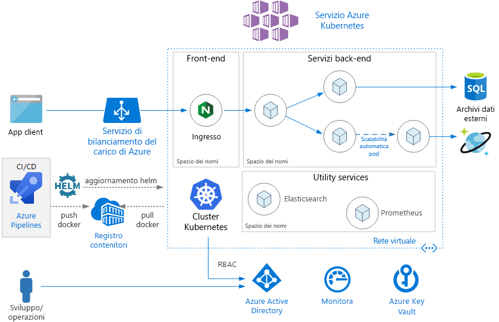
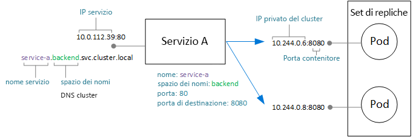
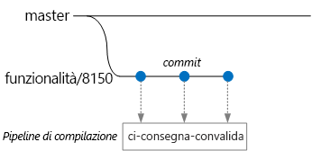
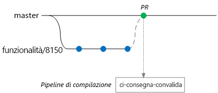
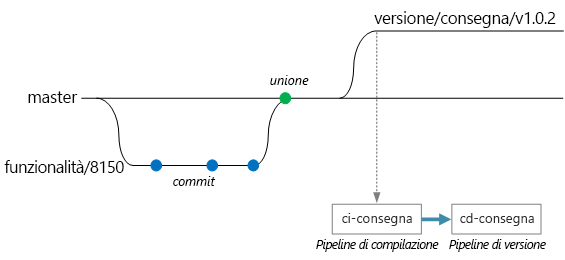

# <a name="microservices-architecture-on-azure-kubernetes-service-aks"></a>Architettura di microservizi nel servizio Azure Kubernetes (AKS)

Questa architettura di riferimento mostra un'applicazione di microservizi distribuita al servizio Azure Kubernetes (AKS). Mostra una configurazione di base del servizio Azure Kubernetes, che può costituire il punto di partenza per la maggior parte delle distribuzioni. Le opzioni più avanzate, incluse le opzioni avanzate di rete, verranno trattate in un'architettura di riferimento separata.

Questo articolo presuppone conoscenze di base di Kubernetes. L'articolo si concentra principalmente sull'infrastruttura e sulle considerazioni relative a DevOps sull'esecuzione di un'architettura di microservizi nel servizio Azure Kubernetes. Per indicazioni su come progettare i microservizi da una prospettiva di progettazione basata su dominio (DDD), vedere [Progettazione, compilazione e gestione di microservizi in Azure](/azure/architecture/microservices).



## <a name="architecture"></a>Architettura

L'architettura è costituita dai componenti seguenti.

**Servizio Azure Kubernetes** (AKS). Il servizio Azure Kubernetes è un servizio di Azure che distribuisce un cluster Kubernetes gestito. 

**Cluster Kubernetes**. Il servizio Azure Kubernetes è responsabile della distribuzione del cluster e della gestione dei master di Kubernetes. Si gestiscono solo i nodi agente.

**Rete virtuale**. Per impostazione predefinita, il servizio Azure Kubernetes crea una rete virtuale per distribuirvi all'interno i nodi agente. Per scenari più avanzati, è possibile creare innanzitutto la rete virtuale, la quale consente di controllare aspetti come la configurazione di subnet, la connettività locale e l'indirizzamento IP. Per altre informazioni, vedere [Configurare funzionalità di rete avanzate nel servizio Azure Kubernetes (AKS)](/azure/aks/configure-advanced-networking).

**Dati in ingresso**. Un dato in ingresso espone le route HTTP (S) ai servizi all'interno del cluster. Per altre informazioni, vedere la sezione [API gateway](#api-gateway) di seguito.

**Origine dati esterna**. I microservizi sono in genere senza stati; la scrittura dello stato avviene in archivi di dati esterni, ad esempio database SQL di Azure o Cosmos DB.

**Azure Active Directory**. Il servizio Azure Kubernetes usa un'identità di Azure Active Directory (Azure AD) per creare e gestire altre risorse di Azure, ad esempio i servizi di bilanciamento del carico di Azure. Azure AD è consigliabile inoltre per l'autenticazione utente nelle applicazioni client.

**Registro Azure Container**. Usare Registro Azure Container per archiviare le immagini Docker private, che vengono distribuite nel cluster. Il servizio Azure Kubernetes può eseguire l'autenticazione con Registro Azure Container usando la relativa identità di Azure AD. Il servizio Azure Kubernetes non richiede Registro Azure Container. È possibile usare altri registri di contenitori, ad esempio l'hub Docker.

**Azure Pipelines**. Pipeline fa parte di Azure DevOps Services ed esegue build automatizzate, test e distribuzioni. È inoltre possibile usare soluzioni CI/CD di terze parti come Jenkins. 

**Helm**. Helm è, come Gestione pacchetti per Kubernetes &mdash;, un modo per raggruppare gli oggetti Kubernetes in una singola unità che si può pubblicare, distribuire, effettuare il controllo versione e aggiornare.

**Monitoraggio di Azure**. Monitoraggio di Azure raccoglie e archivia log e metriche, incluse le metriche di piattaforma per i servizi di Azure nella soluzione e in telemetria applicazioni. Usare questi dati per monitorare l'applicazione, configurare avvisi e dashboard ed eseguire l'analisi delle cause principali di errore. Monitoraggio di Azure si integra con il servizio Azure Kubernetes per raccogliere le metriche da controller, nodi e contenitori, nonché dai log contenitore e dai log del nodo master.

## <a name="design-considerations"></a>Considerazioni sulla progettazione

Questa architettura di riferimento è incentrata su architetture di microservizi, anche se molte delle procedure consigliate si applicano per altri carichi di lavoro in esecuzione nel servizio Azure Kubernetes.

### <a name="microservices"></a>Microservizi

L'oggetto Kubernetes Service è un modo semplice per adattare i microservizi in Kubernetes. Un microservizio è un'unità di codice a regime di controllo libero, distribuibile in modo indipendente. In genere, i Microservizi comunicano tramite API ben definite e possono essere individuati tramite alcune forme di individuazione del servizio. L'oggetto Kubernetes Service fornisce un set di funzionalità che corrispondono a questi requisiti:

- Indirizzo IP. L'oggetto service fornisce un indirizzo IP interno statico per un gruppo di pod (ReplicaSet). Quando i pod vengono creati o spostati, il servizio è sempre raggiungibile in questo indirizzo IP interno.

- Bilanciamento del carico. Il traffico inviato all'indirizzo IP del servizio è a carico bilanciato per il numero di pod. 

- Individuazione dei servizi. Il servizio DNS di Kubernetes assegna ai servizi le voci DNS interne. Ciò significa che il gateway API può chiamare un servizio back-end usando il nome DNS. Lo stesso meccanismo può essere usato per la comunicazione da servizio a servizio. Le voci DNS sono organizzate per spazio dei nomi, pertanto se gli spazi dei nomi corrispondono a contesti delimitati, il nome DNS per un servizio eseguirà naturalmente il mapping al dominio dell'applicazione.

Il diagramma seguente mostra la relazione concettuale tra servizi e i pod. Il mapping effettivo degli indirizzi IP e delle porte degli endpoint viene effettuata da kube-proxy, il proxy di rete Kubernetes.



### <a name="api-gateway"></a>API Gateway

Un *gateway API* è un gateway che si trova tra i client esterni e i microservizi e funge da proxy inverso, indirizzando le richieste dai client ai microservizi. Può anche eseguire varie attività trasversali come l'autenticazione, la terminazione SSL e la limitazione della frequenza. 

Le funzionalità fornite da un gateway possono essere raggruppate nel modo seguente:

- [Routing del gateway](../../patterns/gateway-routing.md): routing delle richieste client ai servizi back-end corretti. Questo offre un singolo endpoint per i client e consente di separare i client dai servizi.

- [Aggregazione tramite il gateway](../../patterns/gateway-aggregation.md): aggregazione di più richieste in una sola, per ridurre la frammentarietà tra il client e il back-end.

- [Offload al gateway](../../patterns/gateway-offloading.md). Un gateway può eseguire l'offload delle funzionalità dai servizi back-end, ad esempio la terminazione SSL, l'autenticazione, inserimento nell'elenco di IP consentiti o limitazione della frequenza dei client (limitazione delle richieste).

I gateway API sono uno schema [progettuale generale di microservizi](https://microservices.io/patterns/apigateway.html). Possono essere implementati usando una serie di tecnologie diverse. Probabilmente l'implementazione più comune consiste nel distribuire un router perimetrale o proxy inversi, ad esempio Nginx, HAProxy o Traefik, all'interno del cluster. 

Altre opzioni includono:

- Gateway applicazione Azure e/o Azure gestione API, entrambi servizi gestiti che si trovano all'esterno del cluster. Un controller di ingresso del gateway applicazione è attualmente in versione beta.

- Proxy di Funzioni di Azure. I proxy possono modificare richieste e risposte e indirizzare le richieste in base a un indirizzo Web.

Il tipo di risorsa **Ingress** di Kubernetes, astrae le impostazioni di configurazione per un server proxy. Funziona in combinazione con un controller in ingresso, che fornisce l'implementazione sottostante della risorsa Ingress. Sono presenti controller in ingresso per Nginx, HAProxy, Traefik e gateway applicazione (anteprima), tra gli altri.

Il controller di ingresso gestisce la configurazione del server proxy. Spesso questi controller richiedono file di configurazione complessi, che possono essere difficili da ottimizzare se non si è esperti, in modo che il controller di ingresso funzioni da astrazione. Inoltre, il controller di ingresso ha accesso all'API di Kubernetes, affinché possa prendere decisioni intelligenti sul routing e sul bilanciamento del carico. Ad esempio, il controller di ingress Nginx consente di ignorare il proxy di rete di kube-proxy.

D'altra parte, se serve completare un controllo sulle impostazioni, è possibile ignorare questa astrazione e configurare manualmente il server proxy. 

Il server proxy inverso è un potenziale collo di bottiglia o singolo punto di guasto nel sistema: distribuire sempre almeno due repliche per garantire disponibilità elevata.

### <a name="data-storage"></a>Archiviazione dei dati

In un'architettura di microservizi i servizi non devono condividere archiviazione dei dati. Ogni servizio deve possedere i propri dati privati in una risorsa di archiviazione logica separata, per evitare dipendenze nascoste tra servizi. Il motivo è evitare l'accoppiamento accidentale tra i servizi, come può accadere quando i servizi condividono gli stessi schemi di dati sottostanti. Inoltre, quando servizi gestiscono i propri archivi dati, possono usare l'archivio dati corretto per requisiti specifici. Per altre informazioni, vedere [Progettazione di microservizi: considerazioni sui dati](/azure/architecture/microservices/data-considerations).

Evitare l'archiviazione persistente dei dati nel cluster locale poiché in questo modo si legano i dati al nodo. In alternativa, 

- usare un servizio esterno, ad esempio database SQL di Azure, Cosmos DB, *o*

- montare un volume permanente usando dischi o file di Azure. Se lo stesso volume deve essere condiviso da più pod, usare file di Azure.

### <a name="namespaces"></a>Spazi dei nomi

Usare gli spazi dei nomi per organizzare i servizi all'interno del cluster. Ogni oggetto in un cluster Kubernetes appartiene a uno spazio dei nomi. Per impostazione predefinita, quando si crea un nuovo oggetto, questi viene inserito all'interno dello`default` spazio dei nomi. Tuttavia è buona norma creare spazi dei nomi più descrittivi per aiutare a organizzare le risorse nel cluster.

In primo luogo, gli spazi dei nomi aiutano a evitare conflitti di denominazione. Quando più team distribuiscono i microservizi nello stesso cluster, assieme a circa un centinaio di microservizi, diventa difficile da gestire se passano tutti nello stesso spazio dei nomi. Inoltre, gli spazi dei nomi consentono di:

- Applicare vincoli delle risorse a uno spazio dei nomi, in modo che il set complessivo di pod assegnati allo spazio dei nomi non possa superare la quota delle risorse in spazio dei nomi.

- Applicare criteri a livello di spazio dei nomi, inclusi i criteri di Controllo degli accessi in base al ruolo e di sicurezza.

Per un'architettura di microservizi, prendere in considerazione l'organizzazione di microservizi in contesti delimitati e la creazione di spazi dei nomi per ciascun contesto delimitato. Ad esempio, tutti i microservizi correlati al contesto delimitato "Evasione degli ordini" potrebbero essere inseriti nello stesso spazio dei nomi. In alternativa, creare uno spazio dei nomi per ogni team di sviluppo.

Posizionare i servizi di utilità nel proprio spazio dei nomi separato. Ad esempio, è possibile distribuire Elasticsearch o Prometheus per il monitoraggio del cluster o Tiller per Helm.

## <a name="scalability-considerations"></a>Considerazioni sulla scalabilità

Kubernetes supporta la scalabilità orizzontale a due livelli:

- Ridimensionare il numero di pod allocati a una distribuzione.
- Ridimensionare i nodi del cluster, per aumentare le risorse di calcolo totale disponibili per il cluster.

Anche se è possibile scalare orizzontalmente i pod e nodi manualmente, è consigliabile usare la scalabilità automatica, per ridurre al minimo le probabilità che i servizi vengano configurati come risorse esaurite sotto un carico elevato. Una strategia di scalabilità automatica deve prendere in considerazione sia i pod che i nodi. Se si scalano orizzontalmente i pod, alla fine si raggiungono i limiti di risorse dei nodi. 

### <a name="pod-autoscaling"></a>Scalabilità automatica dei pod

La scalabilità automatica orizzontale dei pod (HPA) consente di scalare i pod basati su CPU osservata, memoria o metriche personalizzate. Per configurare la scalabilità orizzontale dei pod, specificare una metrica di destinazione (ad esempio, il 70% della CPU) e il numero minimo e massimo di repliche. È consigliabile testare i servizi per derivare i numeri.

Un effetto collaterale della scalabilità automatica è che i pod possono essere creati o rimossi più spesso, quando si verifica un evento di aumento e riduzione del numero. Per attenuare gli effetti di questa operazione:

- Usare probe di idoneità per consentire a Kubernetes di sapere quando un nuovo pod è pronto per accettare il traffico.
- Usare i budget di interruzioni di pod per limitare il numero di pod che possono essere eliminati da un servizio alla volta.

### <a name="cluster-autoscaling"></a>La scalabilità automatica del cluster

La scalabilità automatica dei cluster aumenta il numero di nodi. Se non è possibile pianificare i pod a causa di vincoli delle risorse, il ridimensionamento automatico del cluster eseguirà il provisioning di più nodi.  (Nota: l'integrazione tra il servizio Azure Kubernetes e il ridimensionamento automatico del cluster è attualmente in anteprima.)

Mentre l'HPA esamina le risorse effettivamente consumate o altre metriche dai pod in esecuzione, la scalabilità automatica del cluster effettua il provisioning dei nodi per i pod che non sono stati ancora pianificati. Pertanto, analizza le risorse richieste come indicato nella specifica di pod Kubernetes per una distribuzione. Per ottimizzare questi valori, usare il test di carico.

Non è possibile modificare la dimensione della macchina virtuale dopo aver creato il cluster, pertanto, quando si crea il cluster, sarebbe necessario fare una pianificazione della capacità iniziale per scegliere una dimensione della macchina virtuale appropriata per i nodi agente. 

## <a name="availability-considerations"></a>Considerazioni sulla disponibilità

### <a name="health-probes"></a>Probe di integrità

Kubernetes definisce due tipi di probe di integrità che un pod può esporre:

- Conformità del probe: Indica a Kubernetes se il pod è pronto per accettare le richieste.

- Probe di attività: Indica a Kubernetes. se un pod deve essere rimosso e se viene avviata una nuova istanza.

Quando si pensa a un probe, è utile ricordare il funzionamento di un servizio in Kubernetes. Un servizio dispone di un selettore di etichetta che corrisponde a un set di pod (zero o più). Kubernetes bilancia il carico di traffico verso i pod che corrispondono al selettore. Ricevono il traffico solo i pod avviati correttamente e integri. Se si blocca un contenitore, Kubernetes termina il pod e pianifica una sostituzione.

Un pod in alcuni casi, potrebbe non essere pronto a ricevere il traffico, anche se è stato avviato correttamente. Ad esempio, ci possono essere attività di inizializzazione, in cui l'applicazione in esecuzione nel contenitore carica dati in memoria o legge dati di configurazione. Per indicare che un pod è integro ma non è pronto a ricevere il traffico, definire un probe di idoneità. 

I probe attività gestiscono situazioni in cui un pod è ancora in esecuzione, ma non è integro e deve essere riciclato. Ad esempio, si supponga che un contenitore gestisca le richieste HTTP ma si blocchi per qualche motivo. Il contenitore non si arresta in modo anomalo, ma smette di gestire qualsiasi richiesta. Se si definisce un probe di attività HTTP, il probe smetterà di rispondere e comunicherà a Kubernetes di riavviare il pod.

Di seguito sono riportate alcune considerazioni in caso di progettazione di probe:

- Se il codice ha un tempo di avvio di lunga durata, vi è il rischio che un probe di attività possa segnalare l'errore prima che venga completato l'avvio. Per evitare questo problema, usare l'impostazione initialDelaySeconds, che ritarda l'avvio del probe.

- Un probe di attività non è utile, a meno che il riavvio del pod non sia in grado di ripristinarne lo stato di integrità. È possibile usare un probe di attività per ridurre perdite di memoria o deadlock imprevisti, tuttavia non ha senso riavviare un pod che darà nuovamente errore subito dopo.

- In alcuni casi i probe di idoneità vengono usati per controllare i servizi dipendenti. Ad esempio, se un pod è dipendente da un database, il probe di attività può controllare la connessione al database stesso. Tuttavia, questo è un approccio che può creare problemi imprevisti. Per qualche motivo, un servizio esterno potrebbe essere temporaneamente non disponibile. In tal modo il probe di idoneità avrà esito negativo per tutti i pod nel servizio, causandone la rimozione dal bilanciamento del carico e, pertanto, la creazione di errori a catena upstream. Un approccio migliore è quello di implementare la gestione dei tentativi all'interno del servizio, in modo che questi possa ripristinarsi correttamente dagli errori temporanei.

### <a name="resource-constraints"></a>Vincoli delle risorse

I vincoli delle risorse possono influire sulla disponibilità di un servizio. Definire i vincoli delle risorse per i contenitori, in modo che un singolo contenitore non possa superare le risorse del cluster (memoria e CPU). Per le risorse non contenitore, come thread o connessioni di rete, è consigliabile usare il [Modello a scomparti](/azure/architecture/patterns/bulkhead) per isolare le risorse.

Usare le quote di risorse per limitare il numero di risorse totali consentite per uno spazio dei nomi. In questo modo, il front-end non può privare i servizi di backend per le risorse o viceversa.

## <a name="security-considerations"></a>Considerazioni relative alla sicurezza

### <a name="role-based-access-control-rbac"></a>Controllo degli accessi in base al ruolo (RBAC)

Kubernetes e Azure dispongono di meccanismi per il controllo degli accessi in base al ruolo (RBAC):

- Azure RBAC controlla l'accesso alle risorse in Azure, inclusa la possibilità di creare nuove risorse di Azure. Questi ruoli possono essere assegnati a utenti, gruppi o entità servizio (un'entità servizio è un'identità di sicurezza usata dalle applicazioni).

- I controlli degli accessi in base al ruolo di Kubernetes consentoni di controllare le autorizzazioni per l'API di Kubernetes. Ad esempio, la creazione e inserzione dei pod sono azioni che possono essere autorizzate (o negate) a un utente tramite controlli degli accessi in base al ruolo. Per assegnare le autorizzazioni di Kubernetes agli utenti, creare *ruoli* e *associazioni di ruolo*:

  - Un ruolo è un set di autorizzazioni che si applica all'interno di uno spazio dei nomi. Le autorizzazioni sono definite come verbi (ottenere, aggiornare, creare ed eliminare) sulle risorse (pod, distribuzioni e così via).

  - Un RoleBinding assegna gli utenti o i gruppi a un ruolo.

  - È inoltre disponibile un oggetto ClusterRole, che è simile a un ruolo, ma si applica all'intero cluster, tra tutti gli spazi dei nomi. Per assegnare utenti o gruppi a un ClusterRole, creare un ClusterRoleBinding.

Il servizio Azure Kubernetes integra questi due meccanismi RBAC. Quando si crea un cluster del servizio Azure Kubernetes, è possibile configurarlo in modo da usare Azure AD per l'autenticazione utente. Per informazioni dettagliate su questa configurazione, vedere [Integrare Azure Active Directory con il servizio Azure Kubernetes](/azure/aks/aad-integration).

Dopo la configurazione, un utente che desidera accedere all'API di Kubernetes (ad esempio, tramite kubectl) dovrà accedere usando le proprie credenziali Azure AD.

Per impostazione predefinita, un utente Azure AD non ha accesso al cluster. Per concedere l'accesso, l'amministratore del cluster crea RoleBindings che fanno riferimento a gruppi o utenti Azure AD. Se un utente non dispone delle autorizzazioni per una determinata operazione, questa avrà esito negativo.

Se gli utenti non hanno accesso per impostazione predefinita, come fa l'amministratore del cluster ad avere il permesso di creare le associazioni di ruolo in primo luogo? Un cluster del servizio Azure Kubernetes include effettivamente due tipi di credenziali per la chiamata al server API di Kubernetes: utente del cluster e amministratore del cluster. Le credenziali di amministratore del cluster concedono accesso completo a quest'ultimo. Il comando dell'interfaccia della riga di comando di Azure `az aks get-credentials --admin` scarica le credenziali di amministratore cluster e li salva nel file kubeconfig. L'amministratore del cluster può usare questo file kubeconfig per creare i ruoli e le associazioni di ruolo.

Poiché le credenziali di amministratore del cluster sono così avanzate, usare il controllo degli accessi in base al ruolo di Azure per limitare l'accesso ad essi:

- Il "ruolo Admin del cluster servizio Azure Kubernetes" dispone dell'autorizzazione per scaricare le credenziali di amministratore cluster. Solo gli amministratori del cluster devono essere assegnati a questo ruolo.

- Il "ruolo Utente del cluster Servizio Azure Kubernetes" dispone dell'autorizzazione per scaricare le credenziali di utente cluster. Gli utenti senza privilegi di amministratore possono essere assegnati a questo ruolo. Questo ruolo non concede alcuna autorizzazione particolare sulle risorse all'interno del cluster di Kubernetes &mdash; consente solo ad un utente di connettersi al server API. 

Quando si definiscono i criteri di controllo degli accessi in base al ruolo (Kubernetes e Azure), considerare i ruoli all'interno della propria organizzazione:

- Chi può creare o eliminare un cluster del servizio Azure Kubernetes e scaricare le credenziali amministratore?
- Chi ha l'autorizzazione ad amministrare un cluster?
- Chi può creare o aggiornare le risorse all'interno di uno spazio dei nomi?

È buona norma esaminare i permessi del controllo degli accessi in base al ruolo di Kubernetes tramite spazio dei nomi, usando ruoli e RoleBindings, anziché ClusterRoles e ClusterRoleBindings.

Infine, è naturale chiedersi di quali autorizzazioni abbia a disposizione il servizio Azure Kubernetes per creare e gestire le risorse di Azure, ad esempio i servizi di bilanciamento del carico, rete o archiviazione. Per l'autenticazione con le API di Azure, il cluster usa un'entità servizio di Azure AD. Se non si specifica un'entità servizio quando si crea il cluster, ne viene creato uno automaticamente. Tuttavia è buona norma creare innanzitutto l'entità servizio, a cui assegnare le autorizzazioni minime per il controllo degli accessi in base al ruolo. Per altre informazioni, vedere [Entità servizio con il servizio Azure Kubernetes](/azure/aks/kubernetes-service-principal).

### <a name="secrets-management-and-application-credentials"></a>Gestione dei segreti e credenziali dell'applicazione

Le applicazioni e i servizi spesso necessitano di credenziali che consentono loro di connettersi ai servizi esterni, ad esempio archiviazione di Azure o Database SQL. La sfida consiste nel proteggere queste credenziali e far sì che non vengano perse. 

Per le risorse di Azure, una possibilità è quella di usare le identità gestite. L'idea di un'identità gestita è che un'applicazione o un servizio abbia un'identità archiviata in Azure AD e che usi questa identità per l'autenticazione con un servizio di Azure. L'applicazione o il servizio dispone di un'entità servizio creata in Azure AD e viene autenticato mediante i token OAuth 2.0. Il processo in esecuzione chiama un indirizzo localhost per ottenere il token. In questo modo, non è necessario archiviare le password o le stringhe di connessione. È possibile usare le identità gestite nel servizio Azure Kubernetes tramite l'assegnazione di identità ai singoli pod, usando il progetto [aad-pod-identity](https://github.com/Azure/aad-pod-identity).

Attualmente, non tutti i servizi di Azure supportano l'autenticazione con identità gestite. Per un elenco completo, vedere [Servizi di Azure che supportano l'autenticazione di Azure AD](/azure/active-directory/managed-identities-azure-resources/services-support-msi).

Anche con le identità gestite, sarà probabilmente necessario memorizzare alcune credenziali o altri segreti dell'applicazione, ad esempio per servizi di Azure che non supportano l'identità gestite, servizi di terze parti, le chiavi API e così via. Ecco alcune opzioni per l'archiviazione sicura di segreti:

- Azure Key Vault. Nel servizio Azure Kubernetes, è possibile montare uno o più segreti da Key Vault come volume. Il volume legge i segreti da Key Vault. Il pod può quindi leggere i segreti come un volume normale. Per altre informazioni, vedere il progetto [Kubernetes-KeyVault-FlexVolume](https://github.com/Azure/kubernetes-keyvault-flexvol) su GitHub.

    Il pod esegue l'autenticazione usando un'identità di pod (descritta in precedenza) oppure un'entità servizio Azure AD insieme a un segreto client. È consigliabile usare le identità di pod poiché il segreto client non è necessario in questo caso. 

- Insieme di credenziali HashiCorp. Le applicazioni Kubernetes possono eseguire l'autenticazione con l'insieme di credenziali HashiCorp usando le identità di Azure AD. Vedere [Insieme di credenziali di HashiCorp comunicano con Azure Active Directory](https://open.microsoft.com/2018/04/10/scaling-tips-hashicorp-vault-azure-active-directory/). È possibile distribuire l'insieme di credenziali a Kubernetes, ma è consigliabile eseguirlo in un cluster dedicato, separato dal cluster dell'applicazione. 

- Segreti di Kubernetes. Un'altra opzione consiste semplicemente nell'usare segreti Kubernetes. Questa opzione è più semplice da configurare ma presenta alcuni problemi. I segreti vengono archiviati in etcd, ovvero un archivio chiave-valore. Il servizio Azure Kubernetes [crittografa etcd inattivi](https://github.com/Azure/kubernetes-kms#azure-kubernetes-service-aks). Le chiavi di crittografia sono gestite da Microsoft.

Usare un sistema come HashiCorp Vault o Azure Key Vault offre diversi vantaggi, ad esempio:

- Controllo centralizzato dei segreti.
- Verifica che tutti i segreti vengano crittografati quando inattivi.
- Gestione centralizzata delle chiavi.
- Controllo dell'accesso dei segreti.
- Controllo

### <a name="pod-and-container-security"></a>Pod e sicurezza del contenitore

Di seguito un elenco non esaustivo di alcune procedure consigliate per proteggere i pod e i contenitori: 

Non eseguire i contenitori in modalità privilegiata. La modalità privilegiata fornisce a un contenitore l'accesso a tutti i dispositivi nell'host. È possibile impostare criteri di sicurezza pod per non consentire ai contenitori l'esecuzione in modalità privilegiata. 

Quando possibile, evitare di eseguire i processi come radice all'interno di contenitori. I contenitori non forniscono isolamento completo dal punto di vista della sicurezza, di conseguenza è preferibile eseguire un processo del contenitore come utente senza privilegi. 

Archiviare immagini in un registro privato attendibile, ad esempio in Registro Azure Container o nel Registro Docker Trusted. Usare un webhook di ammissione e di convalida in Kubernetes per garantire che i pod possano eseguire il pull delle immagini solamente dal registro di sistema attendibile.

Analizzare le immagini per le vulnerabilità note usando una soluzione di analisi, ad esempio Twistlock e Aqua, disponibili su Azure Marketplace.

Automatizzare l'applicazione di patch all'immagine usando le attività di Registro Azure Container, una funzionalità di Registro Azure Container. Un'immagine del contenitore viene costruita a partire da livelli. I livelli di base includono l'immagine del sistema operativo e le immagini di framework dell'applicazione, ad esempio ASP.NET Core o Node. js. Le immagini di base vengono in genere create upstream dagli sviluppatori delle applicazioni e gestite da altri gestori di progetti. Quando a queste immagini vengono applicate patch upstream, è importante aggiornare, testare e ridistribuire le proprie immagini, in modo da non lasciare alcuna vulnerabilità di sicurezza nota. Le Attività del Registro Azure Container sono in grado di automatizzare questo processo.

## <a name="deployment-cicd-considerations"></a>Considerazioni sulla distribuzione (CI/CD)

Di seguito alcuni obiettivi relativi a un processo di CI/CD affidabile per un'architettura di microservizi:

- Ogni team può creare e distribuire i servizi di sua proprietà in modo indipendente, senza influenzare o interrompere gli altri team.

- Prima che una nuova versione di un servizio venga distribuita all'ambiente di produzione, viene distribuita agli ambienti di sviluppo/test/controllo qualità per la convalida. I controlli di qualità vengono applicati in ogni fase.

- Una nuova versione di un servizio può essere distribuita side-by-side con la versione precedente.

- Vengono applicati sufficienti criteri di controllo di accesso.

- Si possono considerare attendibili le immagini del contenitore che vengono distribuite all'ambiente di produzione.

### <a name="isolation-of-environments"></a>Isolamento degli ambienti

Si avranno più ambienti in cui si distribuiscono servizi, inclusi gli ambienti: per lo sviluppo, per lo smoke test, per il test di integrazione, per il test di carico e infine per la produzione. Per questi ambienti è necessario un certo livello di isolamento. In Kubernetes, è possibile scegliere tra isolamento fisico e isolamento logico. Per isolamento fisico si intende la distribuzione atta a separare i cluster. L'isolamento logico usa spazi dei nomi e criteri, come descritto in precedenza.

Si consiglia di creare un cluster di produzione dedicato insieme a un cluster separato per gli ambienti di sviluppo/prova. Usare l'isolamento logico per separare gli ambienti all'interno del cluster di sviluppo/prova. I servizi distribuiti nel cluster di sviluppo/prova non avranno accesso agli archivi dati che contengono dati aziendali. 

### <a name="helm"></a>Helm

È consigliabile usare Helm per gestire la compilazione e distribuzione di servizi. Di seguito alcune delle funzionalità di Helm che costituiscono una guida a CI/CD:

- Organizzazione di tutti gli oggetti Kubernetes per un determinato microservizio in un singolo grafico Helm.
- Distribuzione del grafico come un comando di Helm singolo, invece di una serie di comandi di kubectl.
- Rilevamento aggiornamenti e revisioni, con controllo delle versioni semantico, nonché la possibilità di eseguire il rollback a una versione precedente.
- Uso dei modelli per evitare la duplicazione delle informazioni, ad esempio etichette e i selettori, attraverso più file.
- Gestione delle dipendenze tra grafici.
- Pubblicazione di grafici in un repository Helm, ad esempio il Registro Azure Container, e integrazione con la pipeline di compilazione.

Per altre informazioni sull'uso del Registro Container come repository Helm, vedere [Usare il Registro Azure Container come repository Helm per i grafici di applicazione](/azure/container-registry/container-registry-helm-repos).

### <a name="cicd-workflow"></a>Flusso di lavoro CI/CD

Prima di creare un flusso di lavoro CI/CD, è necessario sapere come verrà strutturata e gestita la base di codice.

- I team lavorano in repository separati o in un singolo repository?
- Qual è la strategia per la creazione dei rami?
- Chi può eseguire il push del codice nell'ambiente di produzione? Esiste un ruolo di responsabile del rilascio?

L'approccio con singolo repository sta diventando popolare, ma esistono vantaggi e svantaggi per entrambi.

| &nbsp; | Singolo repository | Più repository |
|--------|----------|----------------|
| **Vantaggi** | Condivisione del codice<br/>Più facile standardizzare codice e strumenti<br/>Più semplice effettuare il refactoring del codice<br/>Individuabilità - singola visualizzazione del codice<br/> | Proprietà chiara per ogni team<br/>Potenzialmente meno conflitti di merge<br/>Favorire la separazione dei microservizi |
| **Problematiche** | Le modifiche al codice condiviso possono influire su più microservizi<br/>Maggiore rischio di conflitti di merge<br/>Gli strumenti devono supportare una base di codice di grandi dimensioni<br/>Controllo di accesso<br/>Processo di distribuzione più complesso | Più difficile la condivisione del codice<br/>Più difficile applicare standard di codifica<br/>Gestione delle dipendenze<br/>Base di codice diffusa, scarsa individuabilità<br/>Mancanza di un'infrastruttura condivisa

In questa sezione viene presentato un possibile flusso di lavoro CI/CD basato sui presupposti seguenti:

- Il repository del codice è singolo, con cartelle organizzate in base ai microservizi.
- La strategia di creazione dei rami del team è basata sullo [sviluppo basato su trunk](https://trunkbaseddevelopment.com/).
- Il team usa [Azure Pipelines](/azure/devops/pipelines) per eseguire il processo CI/CD.
- Il team usa [spazi dei nomi](/azure/container-registry/container-registry-best-practices#repository-namespaces) nel Registro Azure Container per isolare le immagini approvate per la produzione dalle immagini ancora in corso di test.

In questo esempio, uno sviluppatore sta lavorando a un microservizio denominato Delivery Service (Servizio di recapito). (Il nome deriva dall'implementazione di riferimento descritta [qui](../../microservices/design/index.md#scenario).) Durante lo sviluppo di una nuova funzionalità, lo sviluppatore archivia il codice in un ramo di funzionalità.



Il push dei commit per questo ramo attiva una compilazione CI per il microservizio. Per convenzione, i rami di funzionalità sono denominati `feature/*`. Il [file di definizione di compilazione](/azure/devops/pipelines/yaml-schema) include un trigger che applica un filtro in base al nome del ramo e al percorso di origine. Con questo approccio, ogni team può avere una propria pipeline di compilazione.

```yaml
trigger:
  batch: true
  branches:
    include:
    - master
    - feature/*

    exclude:
    - feature/experimental/*

  paths:
     include:
     - /src/shipping/delivery/
```

A questo punto nel flusso di lavoro, la compilazione CI esegue alcune verifiche minime del codice:

1. Compilare il codice
1. Eseguire unit test

L'obiettivo è mantenere brevi i tempi di compilazione in modo che lo sviluppatore possa ottenere un feedback rapido. Quando la funzionalità è pronta per il merge nel master, lo sviluppatore apre una richiesta pull. In questo modo viene attivata un'altra compilazione CI che esegue alcuni controlli aggiuntivi:

1. Compilare il codice
1. Eseguire unit test
1. Compilare l'immagine del contenitore di runtime
1. Eseguire analisi delle vulnerabilità sull'immagine



> [!NOTE]
> In Azure Repos è possibile definire [criteri](/azure/devops/repos/git/branch-policies) per proteggere i rami. Ad esempio, i criteri potrebbero richiedere una compilazione CI riuscita oltre all'approvazione da un responsabile per poter eseguire il merge nel master.

A un certo punto, il team è pronto per distribuire una nuova versione del servizio di recapito. A tale scopo, il responsabile del rilascio crea un ramo dal master con questo modello di denominazione: `release/<microservice name>/<semver>`. Ad esempio: `release/delivery/v1.0.2`.
Viene così attivata una compilazione CI completa che esegue tutti i passaggi precedenti oltre a:

1. Eseguire il push dell'immagine Docker nel Registro Azure Container. L'immagine viene contrassegnata con il numero di versione ottenuto dal nome del ramo.
2. Eseguire `helm package` per creare un pacchetto del grafico Helm
3. Eseguire il push del pacchetto Helm nel Registro Container eseguendo `az acr helm push`.

Supponendo che la compilazione abbia esito positivo, viene attivato un processo di distribuzione tramite una [pipeline di rilascio](/azure/devops/pipelines/release/what-is-release-management) di Azure Pipelines. Questa pipeline

1. Eseguire `helm upgrade` per distribuire il grafico Helm in un ambiente per il controllo di qualità.
1. Un responsabile dà l'approvazione prima che il pacchetto venga spostato nell'ambiente di produzione. Vedere [Release deployment control using approvals](/azure/devops/pipelines/release/approvals/approvals) (Controllo della distribuzione della versione tramite approvazioni).
1. Contrassegnare di nuovo l'immagine Docker per lo spazio dei nomi di produzione nel Registro Azure Container. Ad esempio, se il tag corrente è `myrepo.azurecr.io/delivery:v1.0.2`, il tag di produzione è `myrepo.azurecr.io/prod/delivery:v1.0.2`.
1. Eseguire `helm upgrade` per distribuire il grafico Helm nell'ambiente di produzione.



È importante ricordare che anche in un repository singolo, queste attività possono essere limitate a singoli microservizi, in modo che i team possano eseguire la distribuzione con velocità elevata. Il processo include alcuni passaggi manuali: Approvazione delle richieste pull, creazione di rami di rilascio e approvazione delle distribuzioni nel cluster di produzione. Questi passaggi sono manuali per definizione, ma possono essere completamente automatizzati se l'organizzazione lo preferisce.
