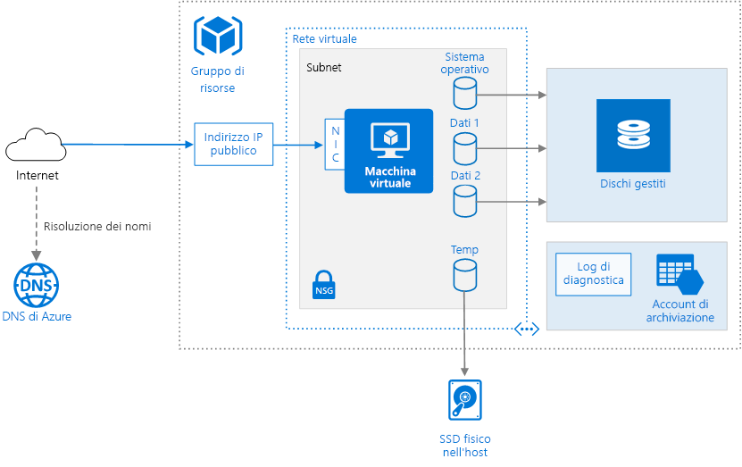

# <a name="run-a-linux-virtual-machine-on-azure"></a><span data-ttu-id="4371d-103">Eseguire una macchina virtuale Linux in Azure</span><span class="sxs-lookup"><span data-stu-id="4371d-103">Run a Linux virtual machine on Azure</span></span>

<span data-ttu-id="4371d-104">Il provisioning di una macchina virtuale di Azure richiede componenti aggiuntivi oltre alla macchina virtuale stessa, incluse risorse di rete e di archiviazione.</span><span class="sxs-lookup"><span data-stu-id="4371d-104">Provisioning a virtual machine (VM) in Azure requires some additional components besides the VM itself, including networking and storage resources.</span></span> <span data-ttu-id="4371d-105">Questo articolo illustra le procedure consigliate per l'esecuzione di una macchina virtuale Linux in Azure.</span><span class="sxs-lookup"><span data-stu-id="4371d-105">This article shows best practices for running a Linux VM on Azure.</span></span>



## <a name="resource-group"></a><span data-ttu-id="4371d-107">Gruppo di risorse</span><span class="sxs-lookup"><span data-stu-id="4371d-107">Resource group</span></span>

<span data-ttu-id="4371d-108">Un [gruppo di risorse][resource-manager-overview] è un contenitore logico di risorse correlate di Azure.</span><span class="sxs-lookup"><span data-stu-id="4371d-108">A [resource group][resource-manager-overview] is a logical container that holds related Azure resources.</span></span> <span data-ttu-id="4371d-109">È generalmente necessario raggruppare le risorse in base alla loro durata e alle persone che le gestiranno.</span><span class="sxs-lookup"><span data-stu-id="4371d-109">In general, group resources based on their lifetime and who will manage them.</span></span>

<span data-ttu-id="4371d-110">Inserire nello stesso [gruppo di risorse][resource-manager-overview] le risorse strettamente associate che condividono lo stesso ciclo di vita.</span><span class="sxs-lookup"><span data-stu-id="4371d-110">Put closely associated resources that share the same lifecycle into the same [resource group][resource-manager-overview].</span></span> <span data-ttu-id="4371d-111">I gruppi di risorse consentono di distribuire e monitorare le risorse come gruppo, tenendo traccia dei costi per ogni gruppo di risorse.</span><span class="sxs-lookup"><span data-stu-id="4371d-111">Resource groups allow you to deploy and monitor resources as a group and track billing costs by resource group.</span></span> <span data-ttu-id="4371d-112">È anche possibile eliminare un intero set di risorse, operazione molto utile nelle distribuzioni di prova.</span><span class="sxs-lookup"><span data-stu-id="4371d-112">You can also delete resources as a set, which is useful for test deployments.</span></span> <span data-ttu-id="4371d-113">Assegnare nomi di risorsa significativi per semplificare l'individuazione di una risorsa specifica e comprenderne il ruolo.</span><span class="sxs-lookup"><span data-stu-id="4371d-113">Assign meaningful resource names to simplify locating a specific resource and understanding its role.</span></span> <span data-ttu-id="4371d-114">Per altre informazioni, vedere [Convenzioni di denominazione][naming-conventions].</span><span class="sxs-lookup"><span data-stu-id="4371d-114">For more information, see [Recommended Naming Conventions for Azure Resources][naming-conventions].</span></span>

## <a name="virtual-machine"></a><span data-ttu-id="4371d-115">Macchina virtuale</span><span class="sxs-lookup"><span data-stu-id="4371d-115">Virtual machine</span></span>

<span data-ttu-id="4371d-116">È possibile eseguire il provisioning di una macchina virtuale da un elenco di immagini pubblicate, da un'immagine gestita personalizzata o da un file del disco rigido virtuale (VHD) caricato nell'archivio BLOB di Azure.</span><span class="sxs-lookup"><span data-stu-id="4371d-116">You can provision a VM from a list of published images, or from a custom managed image or virtual hard disk (VHD) file uploaded to Azure Blob storage.</span></span>  <span data-ttu-id="4371d-117">Azure supporta l'esecuzione di molte distribuzioni Linux diffuse, tra cui CentOS, Debian, Red Hat Enterprise, Ubuntu e FreeBSD.</span><span class="sxs-lookup"><span data-stu-id="4371d-117">Azure supports running various popular Linux distributions, including CentOS, Debian, Red Hat Enterprise, Ubuntu, and FreeBSD.</span></span> <span data-ttu-id="4371d-118">Per altre informazioni, vedere [Azure e Linux][azure-linux].</span><span class="sxs-lookup"><span data-stu-id="4371d-118">For more information, see [Azure and Linux][azure-linux].</span></span>

<span data-ttu-id="4371d-119">Azure offre macchine virtuali di diverse dimensioni.</span><span class="sxs-lookup"><span data-stu-id="4371d-119">Azure offers many different virtual machine sizes.</span></span> <span data-ttu-id="4371d-120">Per altre informazioni, vedere [Dimensioni delle macchine virtuali in Azure][virtual-machine-sizes].</span><span class="sxs-lookup"><span data-stu-id="4371d-120">For more information, see [Sizes for virtual machines in Azure][virtual-machine-sizes].</span></span> <span data-ttu-id="4371d-121">Se si sposta un carico di lavoro esistente in Azure, per iniziare scegliere le dimensioni della VM più simili a quelle dei server locali.</span><span class="sxs-lookup"><span data-stu-id="4371d-121">If you are moving an existing workload to Azure, start with the VM size that's the closest match to your on-premises servers.</span></span> <span data-ttu-id="4371d-122">Misurare quindi le prestazioni del carico di lavoro effettivo in relazione alla CPU, alla memoria e alle operazioni di input/output al secondo (IOPS) del disco e regolare le dimensioni in base alle necessità.</span><span class="sxs-lookup"><span data-stu-id="4371d-122">Then measure the performance of your actual workload in terms of CPU, memory, and disk input/output operations per second (IOPS), and adjust the size as needed.</span></span> 

<span data-ttu-id="4371d-123">È in genere consigliabile scegliere l'area di Azure più vicina agli utenti interni o ai clienti.</span><span class="sxs-lookup"><span data-stu-id="4371d-123">Generally, choose an Azure region that is closest to your internal users or customers.</span></span> <span data-ttu-id="4371d-124">Non tutte le dimensioni di macchina virtuale sono disponibili in tutte le aree.</span><span class="sxs-lookup"><span data-stu-id="4371d-124">Not all VM sizes are available in all regions.</span></span> <span data-ttu-id="4371d-125">Per altre informazioni, vedere i [servizi disponibili in base all'area][services-by-region].</span><span class="sxs-lookup"><span data-stu-id="4371d-125">For more information, see [Services by region][services-by-region].</span></span> <span data-ttu-id="4371d-126">Per visualizzare un elenco delle dimensioni di macchina virtuale disponibili in un'area specifica, eseguire il comando seguente dall'interfaccia della riga di comando di Azure:</span><span class="sxs-lookup"><span data-stu-id="4371d-126">For a list of the VM sizes available in a specific region, run the following command from the Azure command-line interface (CLI):</span></span>

```azurecli
az vm list-sizes --location <location>
```

<span data-ttu-id="4371d-127">Per informazioni sulla scelta di un'immagine di macchina virtuale pubblicata, vedere [Come trovare immagini di macchine virtuali Linux][select-vm-image].</span><span class="sxs-lookup"><span data-stu-id="4371d-127">For information about choosing a published VM image, see [Find Linux VM images][select-vm-image].</span></span>

## <a name="disks"></a><span data-ttu-id="4371d-128">Dischi</span><span class="sxs-lookup"><span data-stu-id="4371d-128">Disks</span></span>

<span data-ttu-id="4371d-129">Per ottimizzare le prestazioni I/O del disco, si consiglia di usare [Archiviazione Premium][premium-storage], che archivia i dati in unità SSD (Solid State Drive).</span><span class="sxs-lookup"><span data-stu-id="4371d-129">For best disk I/O performance, we recommend [Premium Storage][premium-storage], which stores data on solid-state drives (SSDs).</span></span> <span data-ttu-id="4371d-130">I costi dipendono dalla capacità del disco sottoposto a provisioning.</span><span class="sxs-lookup"><span data-stu-id="4371d-130">Cost is based on the capacity of the provisioned disk.</span></span> <span data-ttu-id="4371d-131">Anche IOPS e velocità effettiva, ovvero la velocità di trasferimento dati, dipendono dalle dimensioni del disco. Quando si effettua il provisioning di un disco è quindi consigliabile tenere in considerazione tutti e tre i fattori, ovvero capacità, IOPS e velocità effettiva.</span><span class="sxs-lookup"><span data-stu-id="4371d-131">IOPS and throughput (that is, data transfer rate) also depend on disk size, so when you provision a disk, consider all three factors (capacity, IOPS, and throughput).</span></span>

<span data-ttu-id="4371d-132">È anche consigliabile usare [Managed Disks][managed-disks].</span><span class="sxs-lookup"><span data-stu-id="4371d-132">We also recommend using [Managed Disks][managed-disks].</span></span> <span data-ttu-id="4371d-133">I dischi gestiti semplificano la gestione dei dischi, gestendo automaticamente le risorse di archiviazione.</span><span class="sxs-lookup"><span data-stu-id="4371d-133">Managed disks simplify disk management by handling the storage for you.</span></span> <span data-ttu-id="4371d-134">I dischi gestiti non richiedono un account di archiviazione.</span><span class="sxs-lookup"><span data-stu-id="4371d-134">Managed disks do not require a storage account.</span></span> <span data-ttu-id="4371d-135">È sufficiente specificare le dimensioni e il tipo di disco per distribuirlo come risorsa a disponibilità elevata.</span><span class="sxs-lookup"><span data-stu-id="4371d-135">You simply specify the size and type of disk and it is deployed as a highly available resource</span></span>

<span data-ttu-id="4371d-136">Il disco del sistema operativo è un disco rigido virtuale archiviato in [Archiviazione di Azure][azure-storage], dove viene conservato anche quando il computer host è inattivo.</span><span class="sxs-lookup"><span data-stu-id="4371d-136">The OS disk is a VHD stored in [Azure Storage][azure-storage], so it persists even when the host machine is down.</span></span>  <span data-ttu-id="4371d-137">Per le macchine virtuali Linux, il disco del sistema operativo è `/dev/sda1`.</span><span class="sxs-lookup"><span data-stu-id="4371d-137">For Linux VMs, the OS disk is `/dev/sda1`.</span></span> <span data-ttu-id="4371d-138">Si consiglia anche di creare uno o più [dischi dati][data-disk], ovvero dischi rigidi virtuali usati per i dati dell'applicazione.</span><span class="sxs-lookup"><span data-stu-id="4371d-138">We also recommend creating one or more [data disks][data-disk], which are persistent VHDs used for application data.</span></span>

<span data-ttu-id="4371d-139">Quando si crea un VHD, il disco non è formattato.</span><span class="sxs-lookup"><span data-stu-id="4371d-139">When you create a VHD, it is unformatted.</span></span> <span data-ttu-id="4371d-140">Accedere alla VM per formattare il disco.</span><span class="sxs-lookup"><span data-stu-id="4371d-140">Log into the VM to format the disk.</span></span> <span data-ttu-id="4371d-141">Nella shell di Linux, i dischi dati vengono visualizzati come `/dev/sdc`, `/dev/sdd` e così via.</span><span class="sxs-lookup"><span data-stu-id="4371d-141">In the Linux shell, data disks are displayed as `/dev/sdc`, `/dev/sdd`, and so on.</span></span> <span data-ttu-id="4371d-142">È possibile eseguire `lsblk` per elencare i dispositivi a blocchi, ad esempio i dischi.</span><span class="sxs-lookup"><span data-stu-id="4371d-142">You can run `lsblk` to list the block devices, including the disks.</span></span> <span data-ttu-id="4371d-143">Per usare un disco dati, creare una partizione e un file system, quindi montare il disco.</span><span class="sxs-lookup"><span data-stu-id="4371d-143">To use a data disk, create a partition and file system, and mount the disk.</span></span> <span data-ttu-id="4371d-144">Ad esempio: </span><span class="sxs-lookup"><span data-stu-id="4371d-144">For example:</span></span>

```bash
# Create a partition.
sudo fdisk /dev/sdc     # Enter 'n' to partition, 'w' to write the change.

# Create a file system.
sudo mkfs -t ext3 /dev/sdc1

# Mount the drive.
sudo mkdir /data1
sudo mount /dev/sdc1 /data1
```

<span data-ttu-id="4371d-145">Quando si aggiunge un disco dati, al disco viene assegnato un ID numero di unità logica (LUN).</span><span class="sxs-lookup"><span data-stu-id="4371d-145">When you add a data disk, a logical unit number (LUN) ID is assigned to the disk.</span></span> <span data-ttu-id="4371d-146">È anche possibile specificare l'ID LUN &mdash; ad esempio se si intende sostituire un disco e si vuole mantenere lo stesso ID LUN o se si ha un'applicazione che cerca un ID LUN specifico.</span><span class="sxs-lookup"><span data-stu-id="4371d-146">Optionally, you can specify the LUN ID &mdash; for example, if you're replacing a disk and want to retain the same LUN ID, or you have an application that looks for a specific LUN ID.</span></span> <span data-ttu-id="4371d-147">Tuttavia, tenere presente che gli ID LUN devono essere univoci per ogni disco.</span><span class="sxs-lookup"><span data-stu-id="4371d-147">However, remember that LUN IDs must be unique for each disk.</span></span>

<span data-ttu-id="4371d-148">È possibile modificare l'utilità di pianificazione I/O per ottimizzare le prestazioni nelle unità SSD, dato che i dischi delle VM negli account di archiviazione Premium sono SSD.</span><span class="sxs-lookup"><span data-stu-id="4371d-148">You may want to change the I/O scheduler to optimize for performance on SSDs because the disks for VMs with premium storage accounts are SSDs.</span></span> <span data-ttu-id="4371d-149">Normalmente si consiglia di usare l'utilità di pianificazione NOOP per le unità SSD, ma è necessario usare uno strumento come [iostat] per monitorare le prestazioni di I/O del disco relative al proprio carico di lavoro.</span><span class="sxs-lookup"><span data-stu-id="4371d-149">A common recommendation is to use the NOOP scheduler for SSDs, but you should use a tool such as [iostat] to monitor disk I/O performance for your workload.</span></span>

<span data-ttu-id="4371d-150"> La VM viene creata con un disco temporaneo.</span><span class="sxs-lookup"><span data-stu-id="4371d-150">The VM is created with a temporary disk.</span></span> <span data-ttu-id="4371d-151">Questo disco viene archiviato in un'unità fisica nel computer host.</span><span class="sxs-lookup"><span data-stu-id="4371d-151">This disk is stored on a physical drive on the host machine.</span></span> <span data-ttu-id="4371d-152">*Non* viene salvato nell'Archiviazione di Azure ed è possibile che venga eliminato durante i riavvii e altri eventi del ciclo di vita della macchina virtuale.</span><span class="sxs-lookup"><span data-stu-id="4371d-152">It is *not* saved in Azure Storage and may be deleted during reboots and other VM lifecycle events.</span></span> <span data-ttu-id="4371d-153">Usare questo disco solo per dati temporanei, ad esempio file di paging o di scambio.</span><span class="sxs-lookup"><span data-stu-id="4371d-153">Use this disk only for temporary data, such as page or swap files.</span></span> <span data-ttu-id="4371d-154">Per le macchine virtuali Linux, il disco temporaneo è `/dev/sdb1` ed è montato in `/mnt/resource` o `/mnt`.</span><span class="sxs-lookup"><span data-stu-id="4371d-154">For Linux VMs, the temporary disk is `/dev/sdb1` and is mounted at `/mnt/resource` or `/mnt`.</span></span>

## <a name="network"></a><span data-ttu-id="4371d-155">Rete</span><span class="sxs-lookup"><span data-stu-id="4371d-155">Network</span></span>

<span data-ttu-id="4371d-156">I componenti di rete includono le risorse seguenti:</span><span class="sxs-lookup"><span data-stu-id="4371d-156">The networking components include the following resources:</span></span>

- <span data-ttu-id="4371d-157">**Rete virtuale**.</span><span class="sxs-lookup"><span data-stu-id="4371d-157">**Virtual network**.</span></span> <span data-ttu-id="4371d-158">Ogni macchina virtuale viene distribuita in una rete virtuale che può essere suddivisa in più subnet.</span><span class="sxs-lookup"><span data-stu-id="4371d-158">Every VM is deployed into a virtual network that can be segmented into multiple subnets.</span></span>

- <span data-ttu-id="4371d-159">**Interfaccia di rete (NIC)**.</span><span class="sxs-lookup"><span data-stu-id="4371d-159">**Network interface (NIC)**.</span></span> <span data-ttu-id="4371d-160">La scheda di interfaccia di rete consente alla VM di comunicare con la rete virtuale.</span><span class="sxs-lookup"><span data-stu-id="4371d-160">The NIC enables the VM to communicate with the virtual network.</span></span> <span data-ttu-id="4371d-161">Se sono necessarie più schede di interfaccia di rete per la macchina virtuale, tenere presente che per ogni [dimensione di macchina virtuale][vm-size-tables] è definito un numero massimo di schede.</span><span class="sxs-lookup"><span data-stu-id="4371d-161">If you need multiple NICs for your VM, be aware that a maximum number of NICs is defined for each [VM size][vm-size-tables].</span></span>

- <span data-ttu-id="4371d-162">**Indirizzo IP pubblico**.</span><span class="sxs-lookup"><span data-stu-id="4371d-162">**Public IP address**.</span></span> <span data-ttu-id="4371d-163">Un indirizzo IP pubblico è necessario per comunicare con la VM &mdash;, ad esempio tramite Desktop remoto.</span><span class="sxs-lookup"><span data-stu-id="4371d-163">A public IP address is needed to communicate with the VM &mdash; for example, via remote desktop (RDP).</span></span> <span data-ttu-id="4371d-164">L'indirizzo IP pubblico può essere dinamico o statico.</span><span class="sxs-lookup"><span data-stu-id="4371d-164">The public IP address can be dynamic or static.</span></span> <span data-ttu-id="4371d-165">Per impostazione predefinita, è dinamico.</span><span class="sxs-lookup"><span data-stu-id="4371d-165">The default is dynamic.</span></span>

- <span data-ttu-id="4371d-166">Riservare un [indirizzo IP statico][static-ip] se è necessario un indirizzo IP fisso che non subisca modifiche &mdash; ad esempio se è necessario creare un record "A" nel DNS o se è necessario aggiungere l'indirizzo IP a un elenco di indirizzi attendibili.</span><span class="sxs-lookup"><span data-stu-id="4371d-166">Reserve a [static IP address][static-ip] if you need a fixed IP address that won't change &mdash; for example, if you need to create a DNS 'A' record or add the IP address to a safe list.</span></span>
- <span data-ttu-id="4371d-167">È inoltre possibile creare un nome di dominio completo (FQDN) per l'indirizzo IP.</span><span class="sxs-lookup"><span data-stu-id="4371d-167">You can also create a fully qualified domain name (FQDN) for the IP address.</span></span> <span data-ttu-id="4371d-168">È quindi possibile registrare un [record CNAME][cname-record] nel DNS che punta al nome FQDN.</span><span class="sxs-lookup"><span data-stu-id="4371d-168">You can then register a [CNAME record][cname-record] in DNS that points to the FQDN.</span></span> <span data-ttu-id="4371d-169">Per altre informazioni, vedere [Creare un nome di dominio completo nel portale di Azure][fqdn].</span><span class="sxs-lookup"><span data-stu-id="4371d-169">For more information, see [Create a fully qualified domain name in the Azure portal][fqdn].</span></span>

- <span data-ttu-id="4371d-170">**Gruppo di sicurezza di rete**.</span><span class="sxs-lookup"><span data-stu-id="4371d-170">**Network security group (NSG)**.</span></span> <span data-ttu-id="4371d-171">I [gruppi di sicurezza di rete][nsg] vengono usati per consentire o negare il traffico di rete verso le macchine virtuali.</span><span class="sxs-lookup"><span data-stu-id="4371d-171">[Network security groups][nsg] are used to allow or deny network traffic to VMs.</span></span> <span data-ttu-id="4371d-172">I gruppi di sicurezza di rete possono essere associati a subnet o singole istanze di macchina virtuale.</span><span class="sxs-lookup"><span data-stu-id="4371d-172">NSGs can be associated either with subnets or with individual VM instances.</span></span>

<span data-ttu-id="4371d-173">Tutti i gruppi di sicurezza di rete contengono un set di [regole predefinite][nsg-default-rules], inclusa una regola che blocca tutto il traffico Internet in ingresso.</span><span class="sxs-lookup"><span data-stu-id="4371d-173">All NSGs contain a set of [default rules][nsg-default-rules], including a rule that blocks all inbound Internet traffic.</span></span> <span data-ttu-id="4371d-174">Le regole predefinite non possono essere eliminate, ma altre regole possono eseguirne l'override.</span><span class="sxs-lookup"><span data-stu-id="4371d-174">The default rules cannot be deleted, but other rules can override them.</span></span> <span data-ttu-id="4371d-175">Per consentire il traffico Internet, creare regole per indirizzare il traffico in ingresso a determinate porte &mdash; ad esempio la porta 80 per il traffico HTTP.</span><span class="sxs-lookup"><span data-stu-id="4371d-175">To enable Internet traffic, create rules that allow inbound traffic to specific ports &mdash; for example, port 80 for HTTP.</span></span> <span data-ttu-id="4371d-176">Per abilitare l'accesso SSH, aggiungere una regola al gruppo di sicurezza di rete per consentire il traffico in arrivo sulla porta TCP 22.</span><span class="sxs-lookup"><span data-stu-id="4371d-176">To enable SSH, add an NSG rule that allows inbound traffic to TCP port 22.</span></span>

## <a name="operations"></a><span data-ttu-id="4371d-177">Operazioni</span><span class="sxs-lookup"><span data-stu-id="4371d-177">Operations</span></span>

<span data-ttu-id="4371d-178">**SSH**.</span><span class="sxs-lookup"><span data-stu-id="4371d-178">**SSH**.</span></span> <span data-ttu-id="4371d-179">Prima di creare una VM Linux, generare una coppia di chiavi RSA pubblica/privata a 2.048 bit.</span><span class="sxs-lookup"><span data-stu-id="4371d-179">Before you create a Linux VM, generate a 2048-bit RSA public-private key pair.</span></span> <span data-ttu-id="4371d-180">Quando si crea la VM, utilizzare il file di chiave pubblica.</span><span class="sxs-lookup"><span data-stu-id="4371d-180">Use the public key file when you create the VM.</span></span> <span data-ttu-id="4371d-181">Per altre informazioni, vedere [Come usare SSH con Linux e Mac in Azure][ssh-linux].</span><span class="sxs-lookup"><span data-stu-id="4371d-181">For more information, see [How to Use SSH with Linux and Mac on Azure][ssh-linux].</span></span>

<span data-ttu-id="4371d-182">**Diagnostica**.</span><span class="sxs-lookup"><span data-stu-id="4371d-182">**Diagnostics**.</span></span> <span data-ttu-id="4371d-183">Abilitare il monitoraggio e la diagnostica, tra cui le metriche di base sull'integrità, i log relativi all'infrastruttura di diagnostica e la [diagnostica di avvio][boot-diagnostics].</span><span class="sxs-lookup"><span data-stu-id="4371d-183">Enable monitoring and diagnostics, including basic health metrics, diagnostics infrastructure logs, and [boot diagnostics][boot-diagnostics].</span></span> <span data-ttu-id="4371d-184">La diagnostica di avvio permette di diagnosticare gli errori di avvio quando la VM passa a uno stato non avviabile.</span><span class="sxs-lookup"><span data-stu-id="4371d-184">Boot diagnostics can help you diagnose boot failure if your VM gets into a non-bootable state.</span></span> <span data-ttu-id="4371d-185">Creare un account di archiviazione di Azure per archiviare i log.</span><span class="sxs-lookup"><span data-stu-id="4371d-185">Create an Azure Storage account to store the logs.</span></span> <span data-ttu-id="4371d-186">Un account di archiviazione con ridondanza locale standard è sufficiente per i log di diagnostica.</span><span class="sxs-lookup"><span data-stu-id="4371d-186">A standard locally redundant storage (LRS) account is sufficient for diagnostic logs.</span></span> <span data-ttu-id="4371d-187">Per altre informazioni, vedere [Abilitare il monitoraggio e la diagnostica][enable-monitoring].</span><span class="sxs-lookup"><span data-stu-id="4371d-187">For more information, see [Enable monitoring and diagnostics][enable-monitoring].</span></span>

<span data-ttu-id="4371d-188">**Disponibilità**.</span><span class="sxs-lookup"><span data-stu-id="4371d-188">**Availability**.</span></span> <span data-ttu-id="4371d-189">È possibile che la macchina virtuale sia interessata da attività di [manutenzione pianificata][planned-maintenance] o da [tempo di inattività non pianificato][manage-vm-availability].</span><span class="sxs-lookup"><span data-stu-id="4371d-189">Your VM may be affected by [planned maintenance][planned-maintenance] or [unplanned downtime][manage-vm-availability].</span></span> <span data-ttu-id="4371d-190">È possibile usare i [log di riavvio della VM][reboot-logs] per determinare se un riavvio della VM è stato provocato da attività di manutenzione pianificata.</span><span class="sxs-lookup"><span data-stu-id="4371d-190">You can use [VM reboot logs][reboot-logs] to determine whether a VM reboot was caused by planned maintenance.</span></span> <span data-ttu-id="4371d-191">Per una disponibilità più elevata, distribuire più macchine virtuali in un [set di disponibilità](/azure/virtual-machines/linux/manage-availability#configure-multiple-virtual-machines-in-an-availability-set-for-redundancy).</span><span class="sxs-lookup"><span data-stu-id="4371d-191">For higher availability, deploy multiple VMs in an [availability set](/azure/virtual-machines/linux/manage-availability#configure-multiple-virtual-machines-in-an-availability-set-for-redundancy).</span></span> <span data-ttu-id="4371d-192">Questa configurazione offre un [contratto di servizio][vm-sla] di livello più elevato.</span><span class="sxs-lookup"><span data-stu-id="4371d-192">This configuration provides a higher [service level agreement (SLA)][vm-sla].</span></span>

<span data-ttu-id="4371d-193">**Backup** Per proteggersi da perdite di dati accidentali, usare il servizio [Backup di Azure](/azure/backup/) per eseguire il backup delle macchine virtuali in un archivio con ridondanza geografica.</span><span class="sxs-lookup"><span data-stu-id="4371d-193">**Backups** To protect against accidental data loss, use the [Azure Backup](/azure/backup/) service to back up your VMs to geo-redundant storage.</span></span> <span data-ttu-id="4371d-194">Backup di Azure offre backup coerenti con le applicazioni.</span><span class="sxs-lookup"><span data-stu-id="4371d-194">Azure Backup provides application-consistent backups.</span></span>

<span data-ttu-id="4371d-195">**Arresto di una VM**.</span><span class="sxs-lookup"><span data-stu-id="4371d-195">**Stopping a VM**.</span></span> <span data-ttu-id="4371d-196"> Azure distingue tra gli stati "Arrestato" e "Deallocato".</span><span class="sxs-lookup"><span data-stu-id="4371d-196">Azure makes a distinction between "stopped" and "deallocated" states.</span></span> <span data-ttu-id="4371d-197">L'addebito avviene quando lo stato della VM viene arrestato, ma non quando la VM viene deallocata.</span><span class="sxs-lookup"><span data-stu-id="4371d-197">You are charged when the VM status is stopped, but not when the VM is deallocated.</span></span> <span data-ttu-id="4371d-198">Anche il pulsante **Arresta** nel portale di Azure consente di deallocare la VM.</span><span class="sxs-lookup"><span data-stu-id="4371d-198">In the Azure portal, the **Stop** button deallocates the VM.</span></span> <span data-ttu-id="4371d-199">Se l'arresto viene effettuato tramite il sistema operativo ad accesso eseguito, la VM viene arrestata ma **non** deallocata, quindi gli addebiti continueranno a essere effettuati.</span><span class="sxs-lookup"><span data-stu-id="4371d-199">If you shut down through the OS while logged in, the VM is stopped but **not** deallocated, so you will still be charged.</span></span>

<span data-ttu-id="4371d-200">**Eliminazione di una VM**.</span><span class="sxs-lookup"><span data-stu-id="4371d-200">**Deleting a VM**.</span></span> <span data-ttu-id="4371d-201"> Se si elimina una VM, i VHD non vengono eliminati.</span><span class="sxs-lookup"><span data-stu-id="4371d-201">If you delete a VM, the VHDs are not deleted.</span></span> <span data-ttu-id="4371d-202">È quindi possibile eliminare in modo sicuro la macchina virtuale senza perdere dati.</span><span class="sxs-lookup"><span data-stu-id="4371d-202">That means you can safely delete the VM without losing data.</span></span> <span data-ttu-id="4371d-203">Verranno tuttavia applicati comunque addebiti per l'archiviazione.</span><span class="sxs-lookup"><span data-stu-id="4371d-203">However, you will still be charged for storage.</span></span> <span data-ttu-id="4371d-204">Per eliminare il VHD, eliminare il file dall'[archivio BLOB][blob-storage].</span><span class="sxs-lookup"><span data-stu-id="4371d-204">To delete the VHD, delete the file from [Blob storage][blob-storage].</span></span> <span data-ttu-id="4371d-205">Per impedire l'eliminazione accidentale, usare un [blocco di risorsa][resource-lock] per bloccare l'intero gruppo di risorse o le singole risorse, ad esempio una macchina virtuale.</span><span class="sxs-lookup"><span data-stu-id="4371d-205">To prevent accidental deletion, use a [resource lock][resource-lock] to lock the entire resource group or lock individual resources, such as a VM.</span></span>

## <a name="security-considerations"></a><span data-ttu-id="4371d-206">Considerazioni relative alla sicurezza</span><span class="sxs-lookup"><span data-stu-id="4371d-206">Security considerations</span></span>

<span data-ttu-id="4371d-207">Usare il [Centro sicurezza di Azure][security-center] per ottenere una visualizzazione centrale dello stato di sicurezza delle risorse di Azure.</span><span class="sxs-lookup"><span data-stu-id="4371d-207">Use [Azure Security Center][security-center] to get a central view of the security state of your Azure resources.</span></span> <span data-ttu-id="4371d-208">Il Centro sicurezza monitora potenziali problemi di sicurezza e offre un'immagine completa dello stato della sicurezza della distribuzione.</span><span class="sxs-lookup"><span data-stu-id="4371d-208">Security Center monitors potential security issues and provides a comprehensive picture of the security health of your deployment.</span></span> <span data-ttu-id="4371d-209">Il Centro sicurezza è configurato per ogni sottoscrizione di Azure.</span><span class="sxs-lookup"><span data-stu-id="4371d-209">Security Center is configured per Azure subscription.</span></span> <span data-ttu-id="4371d-210">Abilitare la raccolta dei dati sulla sicurezza come illustrato nell'articolo relativo all'[onboarding della sottoscrizione di Azure nel Centro sicurezza Standard][security-center-get-started].</span><span class="sxs-lookup"><span data-stu-id="4371d-210">Enable security data collection as described in [Onboard your Azure subscription to Security Center Standard][security-center-get-started].</span></span> <span data-ttu-id="4371d-211">Quando la raccolta dei dati è abilitata, il Centro sicurezza analizza automaticamente tutte le macchine virtuali create nell'ambito della sottoscrizione.</span><span class="sxs-lookup"><span data-stu-id="4371d-211">When data collection is enabled, Security Center automatically scans any VMs created under that subscription.</span></span>

<span data-ttu-id="4371d-212">**Gestione delle patch**.</span><span class="sxs-lookup"><span data-stu-id="4371d-212">**Patch management**.</span></span> <span data-ttu-id="4371d-213">Se abilitato, Centro sicurezza controlla se mancano aggiornamenti critici e della sicurezza.</span><span class="sxs-lookup"><span data-stu-id="4371d-213">If enabled, Security Center checks whether any security and critical updates are missing.</span></span> <span data-ttu-id="4371d-214">Usare le [impostazioni di Criteri di gruppo][group-policy] nella VM per abilitare gli aggiornamenti automatici del sistema.</span><span class="sxs-lookup"><span data-stu-id="4371d-214">Use [Group Policy settings][group-policy] on the VM to enable automatic system updates.</span></span>

<span data-ttu-id="4371d-215">**Antimalware**.</span><span class="sxs-lookup"><span data-stu-id="4371d-215">**Antimalware**.</span></span> <span data-ttu-id="4371d-216"> Se abilitato, Centro sicurezza PC controlla se è installato il software antimalware.</span><span class="sxs-lookup"><span data-stu-id="4371d-216">If enabled, Security Center checks whether antimalware software is installed.</span></span> <span data-ttu-id="4371d-217">È inoltre possibile utilizzare Centro sicurezza PC per installare il software antimalware all'interno del portale di Azure.</span><span class="sxs-lookup"><span data-stu-id="4371d-217">You can also use Security Center to install antimalware software from inside the Azure portal.</span></span>

<span data-ttu-id="4371d-218">**Controllo dell'accesso**.</span><span class="sxs-lookup"><span data-stu-id="4371d-218">**Access control**.</span></span> <span data-ttu-id="4371d-219">Usare il [controllo degli accessi in base al ruolo][rbac] per controllare l'accesso alle risorse di Azure.</span><span class="sxs-lookup"><span data-stu-id="4371d-219">Use [role-based access control (RBAC)][rbac] to control access to Azure resources.</span></span> <span data-ttu-id="4371d-220">Il controllo degli accessi in base al ruolo consente di assegnare i ruoli di autorizzazione ai membri del proprio team DevOps.</span><span class="sxs-lookup"><span data-stu-id="4371d-220">RBAC lets you assign authorization roles to members of your DevOps team.</span></span> <span data-ttu-id="4371d-221">Ad esempio, il ruolo di lettura permette di visualizzare le risorse di Azure, ma non di crearle, gestirle o eliminarle.</span><span class="sxs-lookup"><span data-stu-id="4371d-221">For example, the Reader role can view Azure resources but not create, manage, or delete them.</span></span> <span data-ttu-id="4371d-222">Alcune autorizzazioni sono specifiche di un tipo di risorsa di Azure.</span><span class="sxs-lookup"><span data-stu-id="4371d-222">Some permissions are specific to an Azure resource type.</span></span> <span data-ttu-id="4371d-223">Ad esempio, il ruolo di Collaboratore Macchina virtuale consente di riavviare o deallocare una VM, reimpostare la password di amministratore, creare una nuova VM e così via.</span><span class="sxs-lookup"><span data-stu-id="4371d-223">For example, the Virtual Machine Contributor role can restart or deallocate a VM, reset the administrator password, create a new VM, and so on.</span></span> <span data-ttu-id="4371d-224">Altri [ruoli predefiniti di Controllo degli accessi in base al ruolo][rbac-roles] che potrebbero essere utili per questa architettura includono [Utente DevTest Labs][rbac-devtest] e [Collaboratore Rete][rbac-network].</span><span class="sxs-lookup"><span data-stu-id="4371d-224">Other [built-in RBAC roles][rbac-roles] that may be useful for this architecture include [DevTest Labs User][rbac-devtest] and [Network Contributor][rbac-network].</span></span>

> [!NOTE]
> <span data-ttu-id="4371d-225">Il controllo degli accessi in base al ruolo non limita le azioni eseguibili da un utente registrato in una VM.</span><span class="sxs-lookup"><span data-stu-id="4371d-225">RBAC does not limit the actions that a user logged into a VM can perform.</span></span> <span data-ttu-id="4371d-226">Le autorizzazioni sono determinate dal tipo di account sul sistema operativo guest.</span><span class="sxs-lookup"><span data-stu-id="4371d-226">Those permissions are determined by the account type on the guest OS.</span></span>

<span data-ttu-id="4371d-227">**Log di controllo**.</span><span class="sxs-lookup"><span data-stu-id="4371d-227">**Audit logs**.</span></span> <span data-ttu-id="4371d-228">Per verificare le azioni di provisioning e altri eventi della VM, usare i [log di controllo][audit-logs].</span><span class="sxs-lookup"><span data-stu-id="4371d-228">Use [audit logs][audit-logs] to see provisioning actions and other VM events.</span></span>

<span data-ttu-id="4371d-229">**Crittografia dei dati**.</span><span class="sxs-lookup"><span data-stu-id="4371d-229">**Data encryption**.</span></span> <span data-ttu-id="4371d-230">Se è necessario crittografare i dischi del sistema operativo e i dischi dati, usare [Crittografia dischi di Azure][disk-encryption].</span><span class="sxs-lookup"><span data-stu-id="4371d-230">Use [Azure Disk Encryption][disk-encryption] if you need to encrypt the OS and data disks.</span></span>

## <a name="next-steps"></a><span data-ttu-id="4371d-231">Passaggi successivi</span><span class="sxs-lookup"><span data-stu-id="4371d-231">Next steps</span></span>

- <span data-ttu-id="4371d-232">Per effettuare il provisioning di una macchina virtuale Linux, vedere [Creare e gestire VM Linux con l'interfaccia della riga di comando di Azure](/azure/virtual-machines/linux/tutorial-manage-vm).</span><span class="sxs-lookup"><span data-stu-id="4371d-232">To provision a Linux VM, see [Create and Manage Linux VMs with the Azure CLI](/azure/virtual-machines/linux/tutorial-manage-vm)</span></span>
- <span data-ttu-id="4371d-233">Per un'architettura a più livelli completa in macchine virtuali Linux, vedere [Applicazione a più livelli Linux in Azure con Apache Cassandra](./n-tier-cassandra.md).</span><span class="sxs-lookup"><span data-stu-id="4371d-233">For a complete N-tier architecture on Linux VMs, see [Linux N-tier application in Azure with Apache Cassandra](./n-tier-cassandra.md).</span></span>

<!-- links -->
[audit-logs]: https://azure.microsoft.com/blog/analyze-azure-audit-logs-in-powerbi-more/
[azure-linux]: /azure/virtual-machines/virtual-machines-linux-azure-overview
[azure-storage]: /azure/storage/storage-introduction
[blob-storage]: /azure/storage/storage-introduction
[boot-diagnostics]: https://azure.microsoft.com/blog/boot-diagnostics-for-virtual-machines-v2/
[cname-record]: https://en.wikipedia.org/wiki/CNAME_record
[data-disk]: /azure/virtual-machines/virtual-machines-linux-about-disks-vhds
[disk-encryption]: /azure/security/azure-security-disk-encryption
[enable-monitoring]: /azure/monitoring-and-diagnostics/insights-how-to-use-diagnostics
[fqdn]: /azure/virtual-machines/virtual-machines-linux-portal-create-fqdn
[group-policy]: /windows-server/administration/windows-server-update-services/deploy/4-configure-group-policy-settings-for-automatic-updates
[iostat]: https://en.wikipedia.org/wiki/Iostat
[manage-vm-availability]: /azure/virtual-machines/virtual-machines-linux-manage-availability
[managed-disks]: /azure/storage/storage-managed-disks-overview
[naming-conventions]: ../../best-practices/naming-conventions.md
[nsg]: /azure/virtual-network/virtual-networks-nsg
[nsg-default-rules]: /azure/virtual-network/virtual-networks-nsg#default-rules
[planned-maintenance]: /azure/virtual-machines/virtual-machines-linux-planned-maintenance
[premium-storage]: /azure/virtual-machines/linux/premium-storage
[rbac]: /azure/active-directory/role-based-access-control-what-is
[rbac-roles]: /azure/active-directory/role-based-access-built-in-roles
[rbac-devtest]: /azure/active-directory/role-based-access-built-in-roles#devtest-labs-user
[rbac-network]: /azure/active-directory/role-based-access-built-in-roles#network-contributor
[reboot-logs]: https://azure.microsoft.com/blog/viewing-vm-reboot-logs/
[resource-lock]: /azure/resource-group-lock-resources
[resource-manager-overview]: /azure/azure-resource-manager/resource-group-overview
[security-center]: /azure/security-center/security-center-intro
[security-center-get-started]: /azure/security-center/security-center-get-started
[select-vm-image]: /azure/virtual-machines/virtual-machines-linux-cli-ps-findimage
[services-by-region]: https://azure.microsoft.com/regions/#services
[ssh-linux]: /azure/virtual-machines/virtual-machines-linux-mac-create-ssh-keys
[static-ip]: /azure/virtual-network/virtual-networks-reserved-public-ip
[virtual-machine-sizes]: /azure/virtual-machines/virtual-machines-linux-sizes
[visio-download]: https://archcenter.blob.core.windows.net/cdn/vm-reference-architectures.vsdx
[vm-size-tables]: /azure/virtual-machines/virtual-machines-linux-sizes
[vm-sla]: https://azure.microsoft.com/support/legal/sla/virtual-machines
