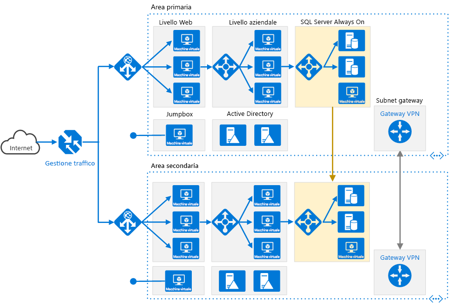

# <a name="run-an-n-tier-application-in-multiple-azure-regions-for-high-availability"></a>Eseguire un'applicazione a più livelli in più aree di Azure per una disponibilità elevata

Questa architettura di riferimento mostra un set di procedure consolidate per l'esecuzione di un'applicazione a più livelli in più aree di Azure, per ottenere disponibilità e un'infrastruttura di ripristino di emergenza affidabile.



*Scaricare un [file Visio][visio-download] di questa architettura.*

## <a name="architecture"></a>Architettura

Questa architettura si basa su quella illustrata in [Applicazione a più livelli con SQL Server](n-tier-sql-server.md).

- **Aree primarie e secondarie**. Usare due aree per ottenere una maggiore disponibilità: una è l'area primaria, l'altra è per il failover.

- **Gestione traffico di Azure**. [Gestione traffico][traffic-manager] indirizza le richieste in ingresso a una delle aree. Durante il normale funzionamento, le richieste vengono indirizzate all'area primaria. Se tale area non è più disponibile, Gestione traffico effettua il failover all'area secondaria. Per altre informazioni, vedere la sezione [Configurazione di Gestione traffico](#traffic-manager-configuration).

- **Gruppi di risorse**. Creare [gruppi di risorse][resource groups] distinti per l'area primaria, l'area secondaria e Gestione traffico. In questo modo si ottiene la flessibilità necessaria per gestire ogni area come un'unica raccolta di risorse. Ad esempio, è possibile ridistribuire un'area, senza rendere non disponibile l'altra. [Collegare i gruppi di risorse][resource-group-links], in modo che sia possibile eseguire una query per elencare tutte le risorse per l'applicazione.

- **Reti virtuali**. Creare una rete virtuale distinta per ogni area. Assicurarsi che gli spazi degli indirizzi non si sovrappongano.

- **Gruppo di disponibilità Always On di SQL Server**. Se si usa SQL Server, è consigliabile usare i [gruppi di disponibilità Always On di SQL Server][sql-always-on] per la disponibilità elevata. Creare un unico gruppo di disponibilità che includa le istanze di SQL Server in entrambe le aree.

    > [!NOTE]
    > Prendere in considerazione anche l'uso del [database SQL di Azure][azure-sql-db], che fornisce un database relazionale come servizio cloud. Con il database SQL, non è necessario configurare un gruppo di disponibilità o gestire il failover.
    >

- **Gateway VPN**. Creare un [gateway VPN][vpn-gateway] in ogni rete virtuale e configurare una [connessione da rete virtuale a rete virtuale][vnet-to-vnet] per consentire il traffico di rete tra le due reti virtuali. Questa condizione è richiesta per il gruppo di disponibilità Always On di SQL Server.

## <a name="recommendations"></a>Consigli

Un'architettura di tipo multi-area può fornire una maggiore disponibilità rispetto alla distribuzione in un'unica area. Se un'interruzione a livello di area interessa l'area primaria, è possibile usare [Gestione traffico][traffic-manager] per effettuare il failover all'area secondaria. Questa architettura è utile anche in caso di errore di un singolo sottosistema dell'applicazione.

Sono disponibili diversi approcci generali per ottenere una disponibilità elevata tra le diverse aree geografiche:

- Attivo/passivo con hot standby. Il traffico viene indirizzato a un'area, mentre l'altra attende in modalità hot standby. Hot standby significa che le macchine virtuali nell'area secondaria sono allocate e in esecuzione in qualsiasi momento.
- Attivo/passivo con cold standby. Il traffico viene indirizzato a un'area, mentre l'altra attende in modalità cold standby. Cold standby significa che le macchine virtuali nell'area secondaria non vengono allocate finché non diventa necessario per il failover. Questo approccio presenta costi inferiori in termini di esecuzione, ma in genere richiederà più tempo per portare online le risorse in caso di errore.
- Attivo/attivo. Entrambe le aree sono attive e viene effettuato un bilanciamento del carico tra le richieste. Se un'area non è più disponibile, viene esclusa dalla rotazione.

Questa architettura di riferimento è incentrata sulla modalità attivo/passivo con hot standby, usando Gestione traffico per il failover. Si noti che è possibile distribuire un numero ridotto di macchine virtuali per la modalità hot standby e quindi aumentare il numero di istanze in base alle esigenze.

### <a name="regional-pairing"></a>Coppie di aree

Ogni area di Azure è abbinata a un'altra area con la stessa collocazione geografica. In generale, è consigliabile scegliere aree della stessa coppia di aree (ad esempio, Stati Uniti orientali 2 e Stati Uniti centrali). I vantaggi di questa operazione includono i seguenti:

- In caso di interruzione su vasta scala, viene data priorità al ripristino di almeno un'area di ogni coppia.
- Gli aggiornamenti di sistema di Azure pianificati vengono implementati in sequenza tra le aree abbinate, per ridurre al minimo l'eventuale tempo di inattività.
- Le coppie si trovano nella stessa area geografica, per soddisfare i requisiti di residenza dei dati.

Assicurarsi tuttavia che entrambe le aree supportino tutti i servizi di Azure necessari per l'applicazione (vedere i [servizi disponibili in base all'area][services-by-region]). Per altre informazioni sulle coppie di aree, vedere [Continuità aziendale e ripristino di emergenza (BCDR): aree geografiche abbinate di Azure][regional-pairs].

### <a name="traffic-manager-configuration"></a>Configurazione di Gestione traffico

Quando si configura Gestione traffico, tenere presente quanto segue:

- **Routing**. Gestione traffico supporta diversi [algoritmi di routing][tm-routing]. Per lo scenario descritto in questo articolo, usare il routing *Priorità* (precedentemente denominato routing *Failover*). Con questa impostazione, Gestione traffico invia tutte le richieste all'area primaria, a meno che l'area primaria non diventi irraggiungibile. A questo punto, viene automaticamente effettuato il failover all'area secondaria. Vedere [Configurare il metodo di routing failover][tm-configure-failover].
- **Probe di integrità**. Gestione traffico usa un [probe][tm-monitoring] HTTP (o HTTPS) per monitorare la disponibilità di ogni area. Il probe verifica una risposta HTTP 200 per un percorso URL specificato. Come procedura consigliata, creare un endpoint che segnali l'integrità complessiva dell'applicazione e usare questo endpoint per il probe di integrità. In caso contrario, il probe potrebbe segnalare un endpoint integro quando le parti più importanti dell'applicazione in realtà hanno esito negativo. Per altre informazioni, vedere [Modello di monitoraggio endpoint di integrità][health-endpoint-monitoring-pattern].

Quando Gestione traffico effettua il failover, per un periodo di tempo i client non riescono a raggiungere l'applicazione. La durata di questo periodo è influenzata dai fattori seguenti:

- Il probe di integrità deve rilevare che l'area primaria è diventata irraggiungibile.
- I server DNS devono aggiornare i record DNS memorizzati nella cache per l'indirizzo IP, che dipende dalla durata (TTL) DNS. Il valore TTL predefinito è di 300 secondi (5 minuti), ma è possibile configurare questo valore durante la creazione del profilo di Gestione traffico.

Per dettagli, vedere [Informazioni sul monitoraggio di Gestione traffico][tm-monitoring].

Se Gestione traffico effettua il failover, è consigliabile eseguire un failback manuale invece di implementare un failback automatico. In caso contrario, si potrebbe creare una situazione in cui l'applicazione passa alternativamente da un'area all'altra. Verificare che tutti i sottosistemi dell'applicazione siano integri prima del failback.

Si noti che Gestione traffico effettua automaticamente il failback per impostazione predefinita. Per evitare questa situazione, ridurre manualmente la priorità dell'area primaria dopo un evento di failover. Ad esempio, si supponga che l'area primaria sia di priorità 1 e la secondaria di priorità 2. Dopo un failover, impostare l'area primaria sul livello di priorità 3 per evitare il failback automatico. Quando si è pronti per il cambio, aggiornare la priorità impostandola su 1.

Il comando seguente dell'[interfaccia della riga di comando di Azure][azure-cli] aggiorna la priorità:

```azurecli
az network traffic-manager endpoint update --resource-group <resource-group> --profile-name <profile>
    --name <endpoint-name> --type azureEndpoints --priority 3
```

Un altro approccio consiste nel disabilitare temporaneamente l'endpoint finché non si è pronti per eseguire il failback:

```azurecli
az network traffic-manager endpoint update --resource-group <resource-group> --profile-name <profile>
    --name <endpoint-name> --type azureEndpoints --endpoint-status Disabled
```

A seconda della causa di un failover, potrebbe essere necessario ridistribuire le risorse all'interno di un'area. Prima di eseguire nuovamente il failback, eseguire un test della conformità operativa, che avrà lo scopo di verificare gli elementi seguenti:

- Le macchine virtuali sono configurate correttamente (tutto il software richiesto è installato, IIS è in esecuzione e così via).
- I sottosistemi dell'applicazione sono integri.
- Test funzionale (ad esempio, il livello del database è raggiungibile dal livello Web).

### <a name="configure-sql-server-always-on-availability-groups"></a>Configurare i gruppi di disponibilità Always On di SQL Server

Nelle versioni precedenti a Windows Server 2016 i gruppi di disponibilità Always On di SQL Server richiedono un controller di dominio e tutti i nodi del gruppo di disponibilità devono far parte dello stesso dominio Active Directory (AD).

Per configurare il gruppo di disponibilità:

- Collocare almeno due controller di dominio in ogni area.
- Assegnare a ogni controller di dominio un indirizzo IP statico.
- Creare una connessione da rete virtuale a rete virtuale per consentire la comunicazione tra le reti virtuali.
- Per ogni rete virtuale, aggiungere gli indirizzi IP dei controller di dominio (da entrambe le aree) all'elenco dei server DNS. È possibile usare il comando dell'interfaccia della riga di comando seguente. Per altre informazioni, vedere [Modificare i server DNS][vnet-dns].

    ```azurecli
    az network vnet update --resource-group <resource-group> --name <vnet-name> --dns-servers "10.0.0.4,10.0.0.6,172.16.0.4,172.16.0.6"
    ```

- Creare un [Windows Server Failover Clustering][wsfc] (WSFC) che includa le istanze di SQL Server in entrambe le aree.
- Creare un gruppo di disponibilità Always On di SQL Server che includa le istanze di SQL Server in entrambe le aree primaria e secondaria. Per la procedura, vedere [Extending Always On Availability Group to Remote Azure Datacenter (PowerShell)](https://blogs.msdn.microsoft.com/sqlcat/2014/09/22/extending-alwayson-availability-group-to-remote-azure-datacenter-powershell/) (Estensione del gruppo di disponibilità Always On al data center di Azure remoto (PowerShell)).

  - Inserire la replica primaria nell'area primaria.
  - Inserire una o più repliche secondarie nell'area primaria. Configurarle per l'uso del commit sincrono con il failover automatico.
  - Inserire una o più repliche secondarie nell'area secondaria. Configurarle per l'uso del commit *asincrono* per motivi di prestazioni (in caso contrario, tutte le transazioni T-SQL dovranno attendere l'esecuzione di un round trip in rete all'area secondaria).

    > [!NOTE]
    > Le repliche con commit asincrono non supportano il failover automatico.

## <a name="availability-considerations"></a>Considerazioni sulla disponibilità

Con un'app complessa a più livelli, potrebbe non essere necessario replicare l'intera applicazione nell'area secondaria. In alternativa, è possibile replicare solo un sottosistema critico indispensabile per supportare la continuità aziendale.

Gestione traffico è un possibile punto di guasto nel sistema. In caso di interruzione del servizio Gestione traffico, i client non riescono ad accedere all'applicazione durante il tempo di inattività. Rivedere il [contratto di servizio di Gestione traffico][tm-sla] e determinare se l'uso di Gestione traffico da solo soddisfa i requisiti aziendali per la disponibilità elevata. In caso contrario, considerare di aggiungere un'altra soluzione di gestione del traffico come failback. In caso di errore del servizio Gestione traffico di Azure, modificare i record CNAME in DNS in modo da puntare all'altro servizio di gestione del traffico (questo passaggio deve essere eseguito manualmente e l'applicazione non sarà disponibile finché non vengono propagate le modifiche al DNS).

Per il cluster di SQL Server, sono da considerare due scenari di failover:

- Tutte le repliche del database SQL Server nell'area primaria hanno esito negativo. Ad esempio, questo problema potrebbe verificarsi durante un'interruzione a livello di area. In questo caso, è necessario effettuare manualmente il failover del gruppo di disponibilità, anche se Gestione traffico effettua il failover automaticamente sul front-end. Seguire i passaggi in [Eseguire un failover manuale forzato di un gruppo di disponibilità di SQL Server](https://msdn.microsoft.com/library/ff877957.aspx), che descrive come effettuare un failover forzato usando SQL Server Management Studio, Transact-SQL o PowerShell in SQL Server 2016.

   > [!WARNING]
   > Con il failover forzato, sussiste il rischio di perdita dei dati. Quando l'area primaria torna online, eseguire uno snapshot del database e usare [tablediff] per individuare le differenze.

- Gestione traffico effettua il failover all'area secondaria, ma la replica primaria del database SQL Server è ancora disponibile. Ad esempio, nel livello front-end potrebbe verificarsi un errore che non si ripercuote sulle macchine virtuali di SQL Server. In tal caso, il traffico Internet viene indirizzato all'area secondaria e tale area può comunque connettersi alla replica primaria. Tuttavia, vi sarà un aumento della latenza, poiché le connessioni di SQL Server attraversano le aree geografiche. In questa situazione è necessario effettuare un failover manuale come indicato di seguito:

   1. Passare temporaneamente una replica del database SQL Server nell'area secondaria al commit *sincrono*, in modo da garantire che non si verifichino perdite di dati durante il failover.
   2. Effettuare il failover a tale replica.
   3. Quando si effettua il failback all'area primaria, ripristinare l'impostazione di commit asincrono.

## <a name="manageability-considerations"></a>Considerazioni sulla gestibilità

Quando si aggiorna la distribuzione, aggiornare un'area alla volta per ridurre la probabilità di un errore globale da una configurazione errata o un errore nell'applicazione.

Testare la resilienza del sistema agli errori. Di seguito sono riportati alcuni scenari di errore comuni da testare:

- Arrestare le istanze di macchina virtuale.
- Esercitare un uso elevato delle risorse come CPU e memoria.
- Disconnettere/ritardare la rete.
- Arrestare in modo anomalo i processi.
- Far scadere i certificati.
- Simulare errori hardware.
- Arrestare il servizio DNS nei controller di dominio.

Misurare i tempi di ripristino e verificare che soddisfino i requisiti aziendali. Testare anche le combinazioni di modalità di errore.

## <a name="related-resources"></a>Risorse correlate

Può essere utile esaminare gli [scenari di esempio di Azure](/azure/architecture/example-scenario) seguenti, che illustrano soluzioni specifiche usando alcune delle stesse tecnologie:

- [Applicazione Web multilivello per disponibilità elevata e ripristino di emergenza in Azure](/azure/architecture/example-scenario/infrastructure/multi-tier-app-disaster-recovery)
- [Creazione di applicazioni Web sicure con macchine virtuali Windows in Azure](/azure/architecture/example-scenario/infrastructure/regulated-multitier-app)

<!-- links -->

[hybrid-vpn]: ../hybrid-networking/vpn.md
[azure-dns]: /azure/dns/dns-overview
[azure-sla]: https://azure.microsoft.com/support/legal/sla/
[azure-sql-db]: /azure/sql-database/
[health-endpoint-monitoring-pattern]: https://msdn.microsoft.com/library/dn589789.aspx
[azure-cli]: /cli/azure/
[regional-pairs]: /azure/best-practices-availability-paired-regions
[resource groups]: /azure/azure-resource-manager/resource-group-overview
[resource-group-links]: /azure/resource-group-link-resources
[resource-manager-overview]: /azure/azure-resource-manager/resource-group-overview
[services-by-region]: https://azure.microsoft.com/regions/#services
[sql-always-on]: https://msdn.microsoft.com/library/hh510230.aspx
[tablediff]: https://msdn.microsoft.com/library/ms162843.aspx
[tm-configure-failover]: /azure/traffic-manager/traffic-manager-configure-failover-routing-method
[tm-monitoring]: /azure/traffic-manager/traffic-manager-monitoring
[tm-routing]: /azure/traffic-manager/traffic-manager-routing-methods
[tm-sla]: https://azure.microsoft.com/support/legal/sla/traffic-manager
[traffic-manager]: https://azure.microsoft.com/services/traffic-manager
[visio-download]: https://archcenter.blob.core.windows.net/cdn/vm-reference-architectures.vsdx
[vnet-dns]: /azure/virtual-network/manage-virtual-network#change-dns-servers
[vnet-to-vnet]: /azure/vpn-gateway/vpn-gateway-vnet-vnet-rm-ps
[vpn-gateway]: /azure/vpn-gateway/vpn-gateway-about-vpngateways
[wsfc]: https://msdn.microsoft.com/library/hh270278.aspx
