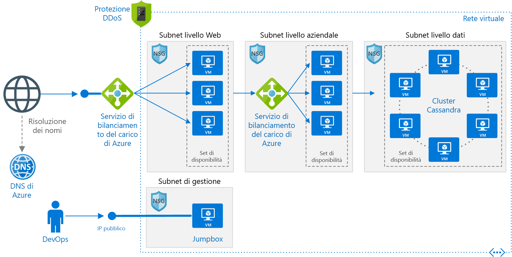

# <a name="linux-n-tier-application-in-azure-with-apache-cassandra"></a><span data-ttu-id="34dad-103">Applicazione a più livelli Linux in Azure con Apache Cassandra</span><span class="sxs-lookup"><span data-stu-id="34dad-103">Linux N-tier application in Azure with Apache Cassandra</span></span>

<span data-ttu-id="34dad-104">Questa architettura di riferimento illustra come distribuire macchine virtuali (VM) e una rete virtuale configurata per un'applicazione [a più livelli](../../guide/architecture-styles/n-tier.md) tramite Apache Cassandra in Linux per il livello dati.</span><span class="sxs-lookup"><span data-stu-id="34dad-104">This reference architecture shows how to deploy virtual machines (VMs) and a virtual network configured for an [N-tier](../../guide/architecture-styles/n-tier.md) application, using Apache Cassandra on Linux for the data tier.</span></span> <span data-ttu-id="34dad-105">[**Distribuire questa soluzione**](#deploy-the-solution).</span><span class="sxs-lookup"><span data-stu-id="34dad-105">[**Deploy this solution**](#deploy-the-solution).</span></span>



<span data-ttu-id="34dad-107">*Scaricare un [file Visio][visio-download] di questa architettura.*</span><span class="sxs-lookup"><span data-stu-id="34dad-107">*Download a [Visio file][visio-download] of this architecture.*</span></span>

## <a name="architecture"></a><span data-ttu-id="34dad-108">Architettura</span><span class="sxs-lookup"><span data-stu-id="34dad-108">Architecture</span></span>

<span data-ttu-id="34dad-109">L'architettura include i componenti seguenti:</span><span class="sxs-lookup"><span data-stu-id="34dad-109">The architecture has the following components:</span></span>

- <span data-ttu-id="34dad-110">**Gruppo di risorse**.</span><span class="sxs-lookup"><span data-stu-id="34dad-110">**Resource group**.</span></span> <span data-ttu-id="34dad-111">I [gruppi di risorse][resource-manager-overview] vengono usati per raggruppare le risorse in modo che possano essere gestite in base alla durata, al proprietario o ad altri criteri.</span><span class="sxs-lookup"><span data-stu-id="34dad-111">[Resource groups][resource-manager-overview] are used to group resources so they can be managed by lifetime, owner, or other criteria.</span></span>

- <span data-ttu-id="34dad-112">**Rete virtuale (VNet) e subnet**.</span><span class="sxs-lookup"><span data-stu-id="34dad-112">**Virtual network (VNet) and subnets**.</span></span> <span data-ttu-id="34dad-113">Ogni VM di Azure viene distribuita in una rete virtuale che può essere segmentata in subnet.</span><span class="sxs-lookup"><span data-stu-id="34dad-113">Every Azure VM is deployed into a VNet that can be segmented into subnets.</span></span> <span data-ttu-id="34dad-114">Creare una subnet separata per ogni livello.</span><span class="sxs-lookup"><span data-stu-id="34dad-114">Create a separate subnet for each tier.</span></span>

- <span data-ttu-id="34dad-115">**Gruppi di sicurezza di rete**.</span><span class="sxs-lookup"><span data-stu-id="34dad-115">**NSGs**.</span></span> <span data-ttu-id="34dad-116">Usare i [gruppi di sicurezza di rete][nsg] (NSG) per limitare il traffico di rete nella rete virtuale.</span><span class="sxs-lookup"><span data-stu-id="34dad-116">Use [network security groups][nsg] (NSGs) to restrict network traffic within the VNet.</span></span> <span data-ttu-id="34dad-117">Nell'architettura a tre livelli qui illustrata, ad esempio, il livello database accetta traffico dal livello business e dalla subnet di gestione, ma non dal front-end Web.</span><span class="sxs-lookup"><span data-stu-id="34dad-117">For example, in the three-tier architecture shown here, the database tier accepts traffic from the business tier and the management subnet, but not the web front end.</span></span>

- <span data-ttu-id="34dad-118">**Protezione DDoS**.</span><span class="sxs-lookup"><span data-stu-id="34dad-118">**DDoS Protection**.</span></span> <span data-ttu-id="34dad-119">Nonostante la piattaforma Azure offra protezione di base dagli attacchi Distributed Denial of Service (DDoS), è consigliabile usare [Protezione DDoS Standard][ddos], che include funzionalità di mitigazione DDoS avanzate.</span><span class="sxs-lookup"><span data-stu-id="34dad-119">Although the Azure platform provides basic protection against distributed denial of service (DDoS) attacks, we recommend using [DDoS Protection Standard][ddos], which has enhanced DDoS mitigation features.</span></span> <span data-ttu-id="34dad-120">Vedere [Considerazioni relative alla sicurezza](#security-considerations).</span><span class="sxs-lookup"><span data-stu-id="34dad-120">See [Security considerations](#security-considerations).</span></span>

- <span data-ttu-id="34dad-121">**Macchine virtuali**.</span><span class="sxs-lookup"><span data-stu-id="34dad-121">**Virtual machines**.</span></span> <span data-ttu-id="34dad-122">Per indicazioni su come configurare le macchine virtuali, vedere [Eseguire una VM Windows in Azure](./windows-vm.md) ed [Eseguire una VM Linux in Azure](./linux-vm.md).</span><span class="sxs-lookup"><span data-stu-id="34dad-122">For recommendations on configuring VMs, see [Run a Windows VM on Azure](./windows-vm.md) and [Run a Linux VM on Azure](./linux-vm.md).</span></span>

- <span data-ttu-id="34dad-123">**Set di disponibilità**.</span><span class="sxs-lookup"><span data-stu-id="34dad-123">**Availability sets**.</span></span> <span data-ttu-id="34dad-124">Per ogni livello creare un [set di disponibilità][azure-availability-sets] ed effettuare il provisioning di almeno due VM, rendendo così le VM idonee per un [contratto di servizio][vm-sla] superiore.</span><span class="sxs-lookup"><span data-stu-id="34dad-124">Create an [availability set][azure-availability-sets] for each tier, and provision at least two VMs in each tier, which makes the VMs eligible for a higher [service level agreement (SLA)][vm-sla].</span></span>

- <span data-ttu-id="34dad-125">**Servizi di bilanciamento del carico di Azure**.</span><span class="sxs-lookup"><span data-stu-id="34dad-125">**Azure load balancers**.</span></span> <span data-ttu-id="34dad-126">I [servizi di bilanciamento del carico][load-balancer] distribuiscono le richieste Internet in ingresso alle istanze delle macchine virtuali.</span><span class="sxs-lookup"><span data-stu-id="34dad-126">The [load balancers][load-balancer] distribute incoming Internet requests to the VM instances.</span></span> <span data-ttu-id="34dad-127">Usare un [servizio di bilanciamento del carico pubblico][load-balancer-external] per distribuire il traffico Internet in ingresso al livello Web e un [servizio di bilanciamento del carico interno][load-balancer-internal] per distribuire il traffico di rete dal livello Web al livello business.</span><span class="sxs-lookup"><span data-stu-id="34dad-127">Use a [public load balancer][load-balancer-external] to distribute incoming Internet traffic to the web tier, and an [internal load balancer][load-balancer-internal] to distribute network traffic from the web tier to the business tier.</span></span>

- <span data-ttu-id="34dad-128">**Indirizzo IP pubblico**.</span><span class="sxs-lookup"><span data-stu-id="34dad-128">**Public IP address**.</span></span> <span data-ttu-id="34dad-129">È necessario un indirizzo IP pubblico per consentire al servizio di bilanciamento del carico pubblico di ricevere il traffico Internet.</span><span class="sxs-lookup"><span data-stu-id="34dad-129">A public IP address is needed for the public load balancer to receive Internet traffic.</span></span>

- <span data-ttu-id="34dad-130">**Jumpbox**.</span><span class="sxs-lookup"><span data-stu-id="34dad-130">**Jumpbox**.</span></span> <span data-ttu-id="34dad-131">Detto anche [bastion host].</span><span class="sxs-lookup"><span data-stu-id="34dad-131">Also called a [bastion host].</span></span> <span data-ttu-id="34dad-132">È una macchina virtuale sicura in rete che viene usata dagli amministratori per connettersi alle altre macchine virtuali.</span><span class="sxs-lookup"><span data-stu-id="34dad-132">A secure VM on the network that administrators use to connect to the other VMs.</span></span> <span data-ttu-id="34dad-133">Il jumpbox ha un gruppo di sicurezza di rete che consente il traffico remoto solo da indirizzi IP pubblici inclusi in un elenco di indirizzi attendibili.</span><span class="sxs-lookup"><span data-stu-id="34dad-133">The jumpbox has an NSG that allows remote traffic only from public IP addresses on a safe list.</span></span> <span data-ttu-id="34dad-134">Il gruppo di sicurezza di rete deve consentire il traffico SSH.</span><span class="sxs-lookup"><span data-stu-id="34dad-134">The NSG should allow ssh traffic.</span></span>

- <span data-ttu-id="34dad-135">**Database Apache Cassandra.**</span><span class="sxs-lookup"><span data-stu-id="34dad-135">**Apache Cassandra database**.</span></span> <span data-ttu-id="34dad-136">Assicura disponibilità elevata al livello dati, abilitando la replica e il failover.</span><span class="sxs-lookup"><span data-stu-id="34dad-136">Provides high availability at the data tier, by enabling replication and failover.</span></span>

- <span data-ttu-id="34dad-137">**DNS di Azure**.</span><span class="sxs-lookup"><span data-stu-id="34dad-137">**Azure DNS**.</span></span> <span data-ttu-id="34dad-138">[DNS di Azure][azure-dns] è un servizio di hosting per i domini DNS</span><span class="sxs-lookup"><span data-stu-id="34dad-138">[Azure DNS][azure-dns] is a hosting service for DNS domains.</span></span> <span data-ttu-id="34dad-139">che esegue la risoluzione dei nomi usando l'infrastruttura di Microsoft Azure.</span><span class="sxs-lookup"><span data-stu-id="34dad-139">It provides name resolution using Microsoft Azure infrastructure.</span></span> <span data-ttu-id="34dad-140">Ospitando i domini in Azure, è possibile gestire i record DNS usando le stesse credenziali, API, strumenti e fatturazione come per gli altri servizi Azure.</span><span class="sxs-lookup"><span data-stu-id="34dad-140">By hosting your domains in Azure, you can manage your DNS records using the same credentials, APIs, tools, and billing as your other Azure services.</span></span>

## <a name="recommendations"></a><span data-ttu-id="34dad-141">Consigli</span><span class="sxs-lookup"><span data-stu-id="34dad-141">Recommendations</span></span>

<span data-ttu-id="34dad-142">I requisiti della propria organizzazione potrebbero essere diversi da quelli dell'architettura descritta in questo articolo.</span><span class="sxs-lookup"><span data-stu-id="34dad-142">Your requirements might differ from the architecture described here.</span></span> <span data-ttu-id="34dad-143">Usare queste indicazioni come punto di partenza.</span><span class="sxs-lookup"><span data-stu-id="34dad-143">Use these recommendations as a starting point.</span></span>

### <a name="vnet--subnets"></a><span data-ttu-id="34dad-144">Rete virtuale/subnet</span><span class="sxs-lookup"><span data-stu-id="34dad-144">VNet / Subnets</span></span>

<span data-ttu-id="34dad-145">Quando si crea la rete virtuale, determinare quanti indirizzi IP saranno necessari alle risorse in ogni subnet.</span><span class="sxs-lookup"><span data-stu-id="34dad-145">When you create the VNet, determine how many IP addresses your resources in each subnet require.</span></span> <span data-ttu-id="34dad-146">Specificare una subnet mask e un intervallo di indirizzi della rete virtuale abbastanza ampio da contenere gli indirizzi IP necessari, usando la notazione [CIDR].</span><span class="sxs-lookup"><span data-stu-id="34dad-146">Specify a subnet mask and a VNet address range large enough for the required IP addresses, using [CIDR] notation.</span></span> <span data-ttu-id="34dad-147">Usare uno spazio indirizzi che rientri nei [blocchi di indirizzi IP privati][private-ip-space] standard, ossia 10.0.0.0/8, 172.16.0.0/12 e 192.168.0.0/16.</span><span class="sxs-lookup"><span data-stu-id="34dad-147">Use an address space that falls within the standard [private IP address blocks][private-ip-space], which are 10.0.0.0/8, 172.16.0.0/12, and 192.168.0.0/16.</span></span>

<span data-ttu-id="34dad-148">Scegliere un intervallo di indirizzi che non si sovrapponga alla rete locale, nel caso sia in seguito necessario configurare un gateway tra la rete virtuale e la rete locale.</span><span class="sxs-lookup"><span data-stu-id="34dad-148">Choose an address range that doesn't overlap with your on-premises network, in case you need to set up a gateway between the VNet and your on-premise network later.</span></span> <span data-ttu-id="34dad-149">Una volta creata la rete virtuale, non è più possibile cambiare l'intervallo di indirizzi.</span><span class="sxs-lookup"><span data-stu-id="34dad-149">Once you create the VNet, you can't change the address range.</span></span>

<span data-ttu-id="34dad-150">Progettare le subnet tenendo presenti i requisiti di funzionamento e sicurezza.</span><span class="sxs-lookup"><span data-stu-id="34dad-150">Design subnets with functionality and security requirements in mind.</span></span> <span data-ttu-id="34dad-151">Tutte le macchine virtuali nello stesso livello o nello stesso ruolo dovrebbero far parte della stessa subnet, che può essere un limite di sicurezza.</span><span class="sxs-lookup"><span data-stu-id="34dad-151">All VMs within the same tier or role should go into the same subnet, which can be a security boundary.</span></span> <span data-ttu-id="34dad-152">Per altre informazioni sulla progettazione di reti virtuali e subnet, vedere [Pianificare e progettare reti virtuali di Azure][plan-network].</span><span class="sxs-lookup"><span data-stu-id="34dad-152">For more information about designing VNets and subnets, see [Plan and design Azure Virtual Networks][plan-network].</span></span>

### <a name="load-balancers"></a><span data-ttu-id="34dad-153">Servizi di bilanciamento del carico</span><span class="sxs-lookup"><span data-stu-id="34dad-153">Load balancers</span></span>

<span data-ttu-id="34dad-154">Non esporre le VM direttamente in Internet.</span><span class="sxs-lookup"><span data-stu-id="34dad-154">Do not expose the VMs directly to the Internet.</span></span> <span data-ttu-id="34dad-155">Assegnare invece a ogni VM un indirizzo IP privato.</span><span class="sxs-lookup"><span data-stu-id="34dad-155">Instead, give each VM a private IP address.</span></span> <span data-ttu-id="34dad-156">I client si connettono usando l'indirizzo IP del servizio di bilanciamento del carico pubblico.</span><span class="sxs-lookup"><span data-stu-id="34dad-156">Clients connect using the IP address of the public load balancer.</span></span>

<span data-ttu-id="34dad-157">Definire regole di bilanciamento del carico per indirizzare il traffico di rete alle macchine virtuali.</span><span class="sxs-lookup"><span data-stu-id="34dad-157">Define load balancer rules to direct network traffic to the VMs.</span></span> <span data-ttu-id="34dad-158">Ad esempio, per consentire il traffico HTTP, creare una regola che esegua il mapping della porta 80 dalla configurazione front-end alla porta 80 sul pool di indirizzi back-end.</span><span class="sxs-lookup"><span data-stu-id="34dad-158">For example, to enable HTTP traffic, create a rule that maps port 80 from the front-end configuration to port 80 on the back-end address pool.</span></span> <span data-ttu-id="34dad-159">Quando un client invia una richiesta HTTP alla porta 80, il servizio di bilanciamento del carico consente di selezionare un indirizzo IP back-end usando un [algoritmo di hash][load-balancer-hashing] che include l'indirizzo IP di origine.</span><span class="sxs-lookup"><span data-stu-id="34dad-159">When a client sends an HTTP request to port 80, the load balancer selects a back-end IP address by using a [hashing algorithm][load-balancer-hashing] that includes the source IP address.</span></span> <span data-ttu-id="34dad-160">Le richieste client vengono distribuite tra tutte le VM.</span><span class="sxs-lookup"><span data-stu-id="34dad-160">Client requests are distributed across all the VMs.</span></span>

### <a name="network-security-groups"></a><span data-ttu-id="34dad-161">Gruppi di sicurezza di rete</span><span class="sxs-lookup"><span data-stu-id="34dad-161">Network security groups</span></span>

<span data-ttu-id="34dad-162">Usare le regole NSG per limitare il traffico fra livelli.</span><span class="sxs-lookup"><span data-stu-id="34dad-162">Use NSG rules to restrict traffic between tiers.</span></span> <span data-ttu-id="34dad-163">Nell'architettura a tre livelli illustrata sopra, ad esempio, il livello Web non comunica direttamente con il livello database.</span><span class="sxs-lookup"><span data-stu-id="34dad-163">For example, in the three-tier architecture shown above, the web tier does not communicate directly with the database tier.</span></span> <span data-ttu-id="34dad-164">Per applicare questo comportamento, il livello database deve bloccare il traffico in entrata dalla subnet del livello Web.</span><span class="sxs-lookup"><span data-stu-id="34dad-164">To enforce this, the database tier should block incoming traffic from the web tier subnet.</span></span>

1. <span data-ttu-id="34dad-165">Rifiutare tutto il traffico in ingresso dalla rete virtuale.</span><span class="sxs-lookup"><span data-stu-id="34dad-165">Deny all inbound traffic from the VNet.</span></span> <span data-ttu-id="34dad-166">(usare il tag `VIRTUAL_NETWORK` nella regola).</span><span class="sxs-lookup"><span data-stu-id="34dad-166">(Use the `VIRTUAL_NETWORK` tag in the rule.)</span></span>
2. <span data-ttu-id="34dad-167">Consentire il traffico in ingresso dalla subnet del livello business.</span><span class="sxs-lookup"><span data-stu-id="34dad-167">Allow inbound traffic from the business tier subnet.</span></span>
3. <span data-ttu-id="34dad-168">Consentire il traffico in ingresso dalla subnet del livello database.</span><span class="sxs-lookup"><span data-stu-id="34dad-168">Allow inbound traffic from the database tier subnet itself.</span></span> <span data-ttu-id="34dad-169">Questa regola consente la comunicazione tra le macchine virtuali del database, condizione necessaria per la replica e il failover del database.</span><span class="sxs-lookup"><span data-stu-id="34dad-169">This rule allows communication between the database VMs, which is needed for database replication and failover.</span></span>
4. <span data-ttu-id="34dad-170">Consentire il traffico SSH (porta 22) dalla subnet del jumpbox.</span><span class="sxs-lookup"><span data-stu-id="34dad-170">Allow ssh traffic (port 22) from the jumpbox subnet.</span></span> <span data-ttu-id="34dad-171">Questa regola consente agli amministratori di connettersi al livello database dal jumpbox.</span><span class="sxs-lookup"><span data-stu-id="34dad-171">This rule lets administrators connect to the database tier from the jumpbox.</span></span>

<span data-ttu-id="34dad-172">Creare le regole 2 &ndash; 4 con priorità più alta rispetto alla prima regola, in modo da eseguirne l'override.</span><span class="sxs-lookup"><span data-stu-id="34dad-172">Create rules 2 &ndash; 4 with higher priority than the first rule, so they override it.</span></span>

### <a name="cassandra"></a><span data-ttu-id="34dad-173">Cassandra</span><span class="sxs-lookup"><span data-stu-id="34dad-173">Cassandra</span></span>

<span data-ttu-id="34dad-174">In ambiente di produzione è consigliabile usare [DataStax Enterprise][datastax], ma questi suggerimenti sono validi per qualsiasi edizione di Cassandra.</span><span class="sxs-lookup"><span data-stu-id="34dad-174">We recommend [DataStax Enterprise][datastax] for production use, but these recommendations apply to any Cassandra edition.</span></span> <span data-ttu-id="34dad-175">Per altre informazioni sull'esecuzione di DataStax in Azure, vedere [DataStax Enterprise Deployment Guide for Azure][cassandra-in-azure] (Guida alla distribuzione di DataStax Enterprise per Azure).</span><span class="sxs-lookup"><span data-stu-id="34dad-175">For more information on running DataStax in Azure, see [DataStax Enterprise Deployment Guide for Azure][cassandra-in-azure].</span></span>

<span data-ttu-id="34dad-176">Inserire le macchine virtuali per un cluster Cassandra in un set di disponibilità in modo che le repliche di Cassandra vengano distribuite in più domini di errore e domini di aggiornamento.</span><span class="sxs-lookup"><span data-stu-id="34dad-176">Put the VMs for a Cassandra cluster in an availability set to ensure that the Cassandra replicas are distributed across multiple fault domains and upgrade domains.</span></span> <span data-ttu-id="34dad-177">Per altre informazioni sui domini di errore e sui domini di aggiornamento, vedere [Gestire la disponibilità delle macchine virtuali Linux][azure-availability-sets].</span><span class="sxs-lookup"><span data-stu-id="34dad-177">For more information about fault domains and upgrade domains, see [Manage the availability of virtual machines][azure-availability-sets].</span></span>

<span data-ttu-id="34dad-178">Configurare tre domini di errore (il massimo) e 18 domini di aggiornamento per ogni set di disponibilità.</span><span class="sxs-lookup"><span data-stu-id="34dad-178">Configure three fault domains (the maximum) per availability set and 18 upgrade domains per availability set.</span></span> <span data-ttu-id="34dad-179">In questo modo si fornisce il numero massimo di domini di aggiornamento che possono essere distribuiti uniformemente tra i domini di errore.</span><span class="sxs-lookup"><span data-stu-id="34dad-179">This provides the maximum number of upgrade domains that can still be distributed evenly across the fault domains.</span></span>

<span data-ttu-id="34dad-180">Configurare i nodi in modo che riconoscano il rack.</span><span class="sxs-lookup"><span data-stu-id="34dad-180">Configure nodes in rack-aware mode.</span></span> <span data-ttu-id="34dad-181">Eseguire il mapping dei domini di errore ai rack nel file `cassandra-rackdc.properties`.</span><span class="sxs-lookup"><span data-stu-id="34dad-181">Map fault domains to racks in the `cassandra-rackdc.properties` file.</span></span>

<span data-ttu-id="34dad-182">Non è necessario un servizio di bilanciamento del carico davanti al cluster.</span><span class="sxs-lookup"><span data-stu-id="34dad-182">You don't need a load balancer in front of the cluster.</span></span> <span data-ttu-id="34dad-183">Il client si connette direttamente a un nodo nel cluster.</span><span class="sxs-lookup"><span data-stu-id="34dad-183">The client connects directly to a node in the cluster.</span></span>

<span data-ttu-id="34dad-184">Per la disponibilità elevata, distribuire Cassandra in più aree di Azure.</span><span class="sxs-lookup"><span data-stu-id="34dad-184">For high availability, deploy Cassandra in more than one Azure region.</span></span> <span data-ttu-id="34dad-185">I nodi in ogni area sono configurati in modalità riconoscimento del rack con domini di errore e di aggiornamento, per garantire la resilienza all'interno dell'area.</span><span class="sxs-lookup"><span data-stu-id="34dad-185">Nodes within each region are configured in rack-aware mode with fault and upgrade domains, for resiliency inside the region.</span></span>

### <a name="jumpbox"></a><span data-ttu-id="34dad-186">Jumpbox</span><span class="sxs-lookup"><span data-stu-id="34dad-186">Jumpbox</span></span>

<span data-ttu-id="34dad-187">Non consentire l'accesso SSH dalla rete Internet pubblica alle VM che eseguono il carico di lavoro dell'applicazione.</span><span class="sxs-lookup"><span data-stu-id="34dad-187">Don't allow ssh access from the public Internet to the VMs that run the application workload.</span></span> <span data-ttu-id="34dad-188">L'accesso SSH a queste macchine virtuali deve passare attraverso il jumpbox.</span><span class="sxs-lookup"><span data-stu-id="34dad-188">Instead, all ssh access to these VMs must come through the jumpbox.</span></span> <span data-ttu-id="34dad-189">Un amministratore accede al jumpbox, quindi accede alle altre macchine virtuali dal jumpbox.</span><span class="sxs-lookup"><span data-stu-id="34dad-189">An administrator logs into the jumpbox, and then logs into the other VM from the jumpbox.</span></span> <span data-ttu-id="34dad-190">Il jumpbox consente il traffico SSH da Internet, ma solo da indirizzi IP conosciuti e attendibili.</span><span class="sxs-lookup"><span data-stu-id="34dad-190">The jumpbox allows ssh traffic from the Internet, but only from known, safe IP addresses.</span></span>

<span data-ttu-id="34dad-191">Il jumpbox ha requisiti di prestazioni minimi, quindi selezionare una macchina virtuale di piccole dimensioni.</span><span class="sxs-lookup"><span data-stu-id="34dad-191">The jumpbox has minimal performance requirements, so select a small VM size.</span></span> <span data-ttu-id="34dad-192">Creare un [indirizzo IP pubblico] per il jumpbox.</span><span class="sxs-lookup"><span data-stu-id="34dad-192">Create a [public IP address] for the jumpbox.</span></span> <span data-ttu-id="34dad-193">Collocare il jumpbox nella stessa rete virtuale delle altre macchine virtuali, ma in una subnet di gestione separata.</span><span class="sxs-lookup"><span data-stu-id="34dad-193">Place the jumpbox in the same VNet as the other VMs, but in a separate management subnet.</span></span>

<span data-ttu-id="34dad-194">Per proteggere il jumpbox aggiungere una regola del gruppo di sicurezza di rete che consenta le connessioni SSH solo da un set di indirizzi IP pubblici attendibili.</span><span class="sxs-lookup"><span data-stu-id="34dad-194">To secure the jumpbox, add an NSG rule that allows ssh connections only from a safe set of public IP addresses.</span></span> <span data-ttu-id="34dad-195">Configurare i gruppi di sicurezza di rete per le altre subnet per consentire il traffico SSH dalla subnet di gestione.</span><span class="sxs-lookup"><span data-stu-id="34dad-195">Configure the NSGs for the other subnets to allow ssh traffic from the management subnet.</span></span>

## <a name="scalability-considerations"></a><span data-ttu-id="34dad-196">Considerazioni sulla scalabilità</span><span class="sxs-lookup"><span data-stu-id="34dad-196">Scalability considerations</span></span>

<span data-ttu-id="34dad-197">Per i livelli Web e business, valutare la possibilità di usare [set di scalabilità di macchine virtuali][vmss], invece di distribuire VM separate in un set di disponibilità.</span><span class="sxs-lookup"><span data-stu-id="34dad-197">For the web and business tiers, consider using [virtual machine scale sets][vmss], instead of deploying separate VMs into an availability set.</span></span> <span data-ttu-id="34dad-198">Un set di scalabilità facilita la distribuzione e la gestione di un set di VM identiche e il ridimensionamento automatico delle VM in base alle metriche delle prestazioni.</span><span class="sxs-lookup"><span data-stu-id="34dad-198">A scale set makes it easy to deploy and manage a set of identical VMs, and autoscale the VMs based on performance metrics.</span></span> <span data-ttu-id="34dad-199">Di pari passo con l'aumento del carico sulle macchine virtuali, vengono aggiunte automaticamente altre macchine virtuali al servizio di bilanciamento del carico.</span><span class="sxs-lookup"><span data-stu-id="34dad-199">As the load on the VMs increases, additional VMs are automatically added to the load balancer.</span></span> <span data-ttu-id="34dad-200">Prendere in considerazione i set di scalabilità se è necessario aumentare rapidamente le istanze delle macchine virtuali o se si necessita del ridimensionamento automatico.</span><span class="sxs-lookup"><span data-stu-id="34dad-200">Consider scale sets if you need to quickly scale out VMs, or need to autoscale.</span></span>

<span data-ttu-id="34dad-201">Esistono due modi per configurare le macchine virtuali distribuite in un set di scalabilità:</span><span class="sxs-lookup"><span data-stu-id="34dad-201">There are two basic ways to configure VMs deployed in a scale set:</span></span>

- <span data-ttu-id="34dad-202">Usare le estensioni per configurare la VM dopo la distribuzione.</span><span class="sxs-lookup"><span data-stu-id="34dad-202">Use extensions to configure the VM after it's deployed.</span></span> <span data-ttu-id="34dad-203">Con questo approccio, le nuove istanze delle macchine virtuali possono richiedere più tempo per l'avvio di una macchina virtuale senza estensioni.</span><span class="sxs-lookup"><span data-stu-id="34dad-203">With this approach, new VM instances may take longer to start up than a VM with no extensions.</span></span>

- <span data-ttu-id="34dad-204">Distribuire un [disco gestito](/azure/storage/storage-managed-disks-overview) con un'immagine del disco personalizzata.</span><span class="sxs-lookup"><span data-stu-id="34dad-204">Deploy a [managed disk](/azure/storage/storage-managed-disks-overview) with a custom disk image.</span></span> <span data-ttu-id="34dad-205">Questa opzione può risultare più veloce da distribuire.</span><span class="sxs-lookup"><span data-stu-id="34dad-205">This option may be quicker to deploy.</span></span> <span data-ttu-id="34dad-206">Richiede, tuttavia, che l'immagine venga mantenuta aggiornata.</span><span class="sxs-lookup"><span data-stu-id="34dad-206">However, it requires you to keep the image up-to-date.</span></span>

<span data-ttu-id="34dad-207">Per altre informazioni, vedere [Considerazioni sulla progettazione per i set di scalabilità][vmss-design].</span><span class="sxs-lookup"><span data-stu-id="34dad-207">For more information, see [Design considerations for scale sets][vmss-design].</span></span>

> [!TIP]
> <span data-ttu-id="34dad-208">Quando si usa una soluzione di ridimensionamento automatico, occorre testarla in anticipo con carichi di lavoro a livello di produzione.</span><span class="sxs-lookup"><span data-stu-id="34dad-208">When using any autoscale solution, test it with production-level workloads well in advance.</span></span>

<span data-ttu-id="34dad-209">Ogni sottoscrizione di Azure ha limiti predefiniti, tra cui il numero massimo di macchine virtuali per area.</span><span class="sxs-lookup"><span data-stu-id="34dad-209">Each Azure subscription has default limits in place, including a maximum number of VMs per region.</span></span> <span data-ttu-id="34dad-210">È possibile aumentare il limite presentando una richiesta di supporto.</span><span class="sxs-lookup"><span data-stu-id="34dad-210">You can increase the limit by filing a support request.</span></span> <span data-ttu-id="34dad-211">Per altre informazioni, vedere [Sottoscrizione di Azure e limiti, quote e vincoli dei servizi][subscription-limits].</span><span class="sxs-lookup"><span data-stu-id="34dad-211">For more information, see [Azure subscription and service limits, quotas, and constraints][subscription-limits].</span></span>

## <a name="availability-considerations"></a><span data-ttu-id="34dad-212">Considerazioni sulla disponibilità</span><span class="sxs-lookup"><span data-stu-id="34dad-212">Availability considerations</span></span>

<span data-ttu-id="34dad-213">Se non si usano set di scalabilità di macchine virtuali, inserire le VM per lo stesso livello in un set di disponibilità.</span><span class="sxs-lookup"><span data-stu-id="34dad-213">If you don't use virtual machine scale sets, put VMs for the same tier into an availability set.</span></span> <span data-ttu-id="34dad-214">Creare almeno due macchine virtuali nel set di disponibilità in modo da supportare il [contratto di servizio relativo alla disponibilità per le macchine virtuali di Azure][vm-sla].</span><span class="sxs-lookup"><span data-stu-id="34dad-214">Create at least two VMs in the availability set to support the [availability SLA for Azure VMs][vm-sla].</span></span> <span data-ttu-id="34dad-215">Per altre informazioni, vedere [Gestire la disponibilità delle macchine virtuali][availability-set].</span><span class="sxs-lookup"><span data-stu-id="34dad-215">For more information, see [Manage the availability of virtual machines][availability-set].</span></span> <span data-ttu-id="34dad-216">I set di scalabilità usano automaticamente *gruppi di posizionamento*, che fungono da set di disponibilità impliciti.</span><span class="sxs-lookup"><span data-stu-id="34dad-216">Scale sets automatically use *placement groups*, which act as an implicit availability set.</span></span>

<span data-ttu-id="34dad-217">Il servizio di bilanciamento del carico usa i [probe di integrità][health-probes] per monitorare la disponibilità delle istanze delle macchine virtuali.</span><span class="sxs-lookup"><span data-stu-id="34dad-217">The load balancer uses [health probes][health-probes] to monitor the availability of VM instances.</span></span> <span data-ttu-id="34dad-218">Se un probe non riesce a raggiungere un'istanza entro il periodo di timeout, il servizio di bilanciamento del carico interrompe l'invio di traffico alla VM.</span><span class="sxs-lookup"><span data-stu-id="34dad-218">If a probe can't reach an instance within a timeout period, the load balancer stops sending traffic to that VM.</span></span> <span data-ttu-id="34dad-219">Il servizio di bilanciamento del carico continuerà a eseguire il probe e riprenderà a inviare il traffico alla VM se questa diventa nuovamente disponibile.</span><span class="sxs-lookup"><span data-stu-id="34dad-219">The load balancer will continue to probe, and if the VM becomes available again, the load balancer resumes sending traffic to that VM.</span></span>

<span data-ttu-id="34dad-220">Ecco alcune raccomandazioni per i probe di integrità del servizio di bilanciamento del carico:</span><span class="sxs-lookup"><span data-stu-id="34dad-220">Here are some recommendations on load balancer health probes:</span></span>

- <span data-ttu-id="34dad-221">I probe possono testare protocolli HTTP o TCP.</span><span class="sxs-lookup"><span data-stu-id="34dad-221">Probes can test either HTTP or TCP.</span></span> <span data-ttu-id="34dad-222">Se le macchine virtuali eseguono un server HTTP, creare un probe HTTP.</span><span class="sxs-lookup"><span data-stu-id="34dad-222">If your VMs run an HTTP server, create an HTTP probe.</span></span> <span data-ttu-id="34dad-223">In caso contrario, creare un probe TCP.</span><span class="sxs-lookup"><span data-stu-id="34dad-223">Otherwise create a TCP probe.</span></span>
- <span data-ttu-id="34dad-224">Per un probe HTTP, specificare il percorso di un endpoint HTTP.</span><span class="sxs-lookup"><span data-stu-id="34dad-224">For an HTTP probe, specify the path to an HTTP endpoint.</span></span> <span data-ttu-id="34dad-225">Il probe controlla una risposta HTTP 200 da questo percorso.</span><span class="sxs-lookup"><span data-stu-id="34dad-225">The probe checks for an HTTP 200 response from this path.</span></span> <span data-ttu-id="34dad-226">Può trattarsi del percorso radice ("/") o di un endpoint di monitoraggio dell'integrità che implementa una logica personalizzata per controllare l'integrità dell'applicazione.</span><span class="sxs-lookup"><span data-stu-id="34dad-226">This can be the root path ("/"), or a health-monitoring endpoint that implements some custom logic to check the health of the application.</span></span> <span data-ttu-id="34dad-227">L'endpoint deve consentire richieste HTTP anonime.</span><span class="sxs-lookup"><span data-stu-id="34dad-227">The endpoint must allow anonymous HTTP requests.</span></span>
- <span data-ttu-id="34dad-228">Il probe viene inviato da un [indirizzo IP noto][health-probe-ip], 168.63.129.16.</span><span class="sxs-lookup"><span data-stu-id="34dad-228">The probe is sent from a [known IP address][health-probe-ip], 168.63.129.16.</span></span> <span data-ttu-id="34dad-229">Verificare che nessun criterio del firewall o nessuna regola del gruppo di sicurezza di rete blocchi il traffico da o verso questo indirizzo IP.</span><span class="sxs-lookup"><span data-stu-id="34dad-229">Make sure you don't block traffic to or from this IP address in any firewall policies or NSG rules.</span></span>
- <span data-ttu-id="34dad-230">Usare i [log dei probe di integrità][health-probe-log] per visualizzare lo stato dei probe di integrità.</span><span class="sxs-lookup"><span data-stu-id="34dad-230">Use [health probe logs][health-probe-log] to view the status of the health probes.</span></span> <span data-ttu-id="34dad-231">Abilitare la registrazione nel portale di Azure per ogni servizio di bilanciamento del carico.</span><span class="sxs-lookup"><span data-stu-id="34dad-231">Enable logging in the Azure portal for each load balancer.</span></span> <span data-ttu-id="34dad-232">I log vengono scritti in Archiviazione BLOB di Azure.</span><span class="sxs-lookup"><span data-stu-id="34dad-232">Logs are written to Azure Blob storage.</span></span> <span data-ttu-id="34dad-233">I log mostrano quante VM non ricevono traffico di rete a causa di risposte di probe con esito negativo.</span><span class="sxs-lookup"><span data-stu-id="34dad-233">The logs show how many VMs aren't getting network traffic because of failed probe responses.</span></span>

<span data-ttu-id="34dad-234">Per il cluster Cassandra, gli scenari di failover dipendono dai livelli di coerenza usati dall'applicazione e dal numero di repliche.</span><span class="sxs-lookup"><span data-stu-id="34dad-234">For the Cassandra cluster, the failover scenarios depend on the consistency levels used by the application and the number of replicas.</span></span> <span data-ttu-id="34dad-235">Per i livelli di coerenza e l'uso in Cassandra, vedere [Configurazione della coerenza dei dati][cassandra-consistency] e [Cassandra: con quanti nodi si stabilisce una comunicazione con Quorum?][cassandra-consistency-usage]</span><span class="sxs-lookup"><span data-stu-id="34dad-235">For consistency levels and usage in Cassandra, see [Configuring data consistency][cassandra-consistency] and [Cassandra: How many nodes are talked to with Quorum?][cassandra-consistency-usage]</span></span> <span data-ttu-id="34dad-236">La disponibilità dei dati in Cassandra è determinata dal livello di coerenza usato dall'applicazione e dal meccanismo di replica.</span><span class="sxs-lookup"><span data-stu-id="34dad-236">Data availability in Cassandra is determined by the consistency level used by the application and the replication mechanism.</span></span> <span data-ttu-id="34dad-237">Per la replica in Cassandra, vedere [Data Replication in NoSQL Databases Explained][cassandra-replication] (Spiegazione della replica dei dati nei database NoSQL).</span><span class="sxs-lookup"><span data-stu-id="34dad-237">For replication in Cassandra, see [Data Replication in NoSQL Databases Explained][cassandra-replication].</span></span>

## <a name="security-considerations"></a><span data-ttu-id="34dad-238">Considerazioni relative alla sicurezza</span><span class="sxs-lookup"><span data-stu-id="34dad-238">Security considerations</span></span>

<span data-ttu-id="34dad-239">Le reti virtuali sono un limite di isolamento del traffico in Azure.</span><span class="sxs-lookup"><span data-stu-id="34dad-239">Virtual networks are a traffic isolation boundary in Azure.</span></span> <span data-ttu-id="34dad-240">Le VM in una rete virtuale non possono comunicare direttamente con quelle in un'altra rete virtuale.</span><span class="sxs-lookup"><span data-stu-id="34dad-240">VMs in one VNet can't communicate directly with VMs in a different VNet.</span></span> <span data-ttu-id="34dad-241">Le macchine virtuali all'interno della stessa rete virtuale possono comunicare, a meno che non si creino [gruppi di sicurezza di rete][nsg] per limitare il traffico.</span><span class="sxs-lookup"><span data-stu-id="34dad-241">VMs within the same VNet can communicate, unless you create [network security groups][nsg] (NSGs) to restrict traffic.</span></span> <span data-ttu-id="34dad-242">Per altre informazioni, vedere [Servizi cloud Microsoft e sicurezza di rete][network-security].</span><span class="sxs-lookup"><span data-stu-id="34dad-242">For more information, see [Microsoft cloud services and network security][network-security].</span></span>

<span data-ttu-id="34dad-243">Per il traffico Internet in ingresso, le regole di bilanciamento del carico definiscono il tipo di traffico che può raggiungere il back-end.</span><span class="sxs-lookup"><span data-stu-id="34dad-243">For incoming Internet traffic, the load balancer rules define which traffic can reach the back end.</span></span> <span data-ttu-id="34dad-244">Tuttavia, le regole di bilanciamento del carico non supportano gli elenchi di indirizzi IP attendibili, pertanto se si vogliono aggiungere determinati indirizzi IP pubblici a un elenco di indirizzi attendibili, aggiungere un gruppo di sicurezza di rete alla subnet.</span><span class="sxs-lookup"><span data-stu-id="34dad-244">However, load balancer rules don't support IP safe lists, so if you want to add certain public IP addresses to a safe list, add an NSG to the subnet.</span></span>

<span data-ttu-id="34dad-245">**Rete perimetrale**.</span><span class="sxs-lookup"><span data-stu-id="34dad-245">**DMZ**.</span></span> <span data-ttu-id="34dad-246">Valutare l'aggiunta di un'appliance virtuale di rete per creare una rete perimetrale tra la rete Internet e la rete virtuale di Azure.</span><span class="sxs-lookup"><span data-stu-id="34dad-246">Consider adding a network virtual appliance (NVA) to create a DMZ between the Internet and the Azure virtual network.</span></span> <span data-ttu-id="34dad-247">Un'appliance virtuale di rete esegue attività correlate alla rete, ad esempio impostazione di un firewall, ispezione di pacchetti, controllo e routing personalizzato.</span><span class="sxs-lookup"><span data-stu-id="34dad-247">NVA is a generic term for a virtual appliance that can perform network-related tasks, such as firewall, packet inspection, auditing, and custom routing.</span></span> <span data-ttu-id="34dad-248">Per altre informazioni, vedere [Implementazione di una rete perimetrale tra Azure e Internet][dmz].</span><span class="sxs-lookup"><span data-stu-id="34dad-248">For more information, see [Implementing a DMZ between Azure and the Internet][dmz].</span></span>

<span data-ttu-id="34dad-249">**Crittografia**.</span><span class="sxs-lookup"><span data-stu-id="34dad-249">**Encryption**.</span></span> <span data-ttu-id="34dad-250">Crittografare i dati sensibili inattivi e usare[Azure Key Vault][azure-key-vault] per gestire le chiavi di crittografia del database.</span><span class="sxs-lookup"><span data-stu-id="34dad-250">Encrypt sensitive data at rest and use [Azure Key Vault][azure-key-vault] to manage the database encryption keys.</span></span> <span data-ttu-id="34dad-251">Key Vault consente di archiviare le chiavi di crittografia in moduli di protezione hardware.</span><span class="sxs-lookup"><span data-stu-id="34dad-251">Key Vault can store encryption keys in hardware security modules (HSMs).</span></span> <span data-ttu-id="34dad-252">È anche consigliabile archiviare in Key Vault i segreti dell'applicazione, ad esempio le stringhe di connessione di database.</span><span class="sxs-lookup"><span data-stu-id="34dad-252">It's also recommended to store application secrets, such as database connection strings, in Key Vault.</span></span>

<span data-ttu-id="34dad-253">**Protezione DDoS**.</span><span class="sxs-lookup"><span data-stu-id="34dad-253">**DDoS protection**.</span></span> <span data-ttu-id="34dad-254">La piattaforma Azure offre protezione DDoS di base per impostazione predefinita.</span><span class="sxs-lookup"><span data-stu-id="34dad-254">The Azure platform provides basic DDoS protection by default.</span></span> <span data-ttu-id="34dad-255">Tale protezione di base mira a proteggere l'infrastruttura complessiva di Azure.</span><span class="sxs-lookup"><span data-stu-id="34dad-255">This basic protection is targeted at protecting the Azure infrastructure as a whole.</span></span> <span data-ttu-id="34dad-256">Nonostante la protezione DDoS di base sia automaticamente abilitata, è consigliabile usare [Protezione DDoS Standard][ddos].</span><span class="sxs-lookup"><span data-stu-id="34dad-256">Although basic DDoS protection is automatically enabled, we recommend using [DDoS Protection Standard][ddos].</span></span> <span data-ttu-id="34dad-257">Per rilevare le minacce, la protezione Standard usa l'ottimizzazione adattiva in base ai modelli di traffico di rete dell'applicazione.</span><span class="sxs-lookup"><span data-stu-id="34dad-257">Standard protection uses adaptive tuning, based on your application's network traffic patterns, to detect threats.</span></span> <span data-ttu-id="34dad-258">Ciò consente di applicare procedure di mitigazione per attacchi DDoS che potrebbero non essere rilevati dai criteri DDoS a livello di infrastruttura.</span><span class="sxs-lookup"><span data-stu-id="34dad-258">This allows it to apply mitigations against DDoS attacks that might go unnoticed by the infrastructure-wide DDoS policies.</span></span> <span data-ttu-id="34dad-259">La protezione Standard offre anche funzionalità di avviso, telemetria e analisi tramite Monitoraggio di Azure.</span><span class="sxs-lookup"><span data-stu-id="34dad-259">Standard protection also provides alerting, telemetry, and analytics through Azure Monitor.</span></span> <span data-ttu-id="34dad-260">Per altre informazioni, vedere [Protezione DDoS di Azure: Procedure consigliate e architetture di riferimento][ddos-best-practices].</span><span class="sxs-lookup"><span data-stu-id="34dad-260">For more information, see [Azure DDoS Protection: Best practices and reference architectures][ddos-best-practices].</span></span>

## <a name="deploy-the-solution"></a><span data-ttu-id="34dad-261">Distribuire la soluzione</span><span class="sxs-lookup"><span data-stu-id="34dad-261">Deploy the solution</span></span>

<span data-ttu-id="34dad-262">Una distribuzione di questa architettura di riferimento è disponibile in [GitHub][github-folder].</span><span class="sxs-lookup"><span data-stu-id="34dad-262">A deployment for this reference architecture is available on [GitHub][github-folder].</span></span>

### <a name="prerequisites"></a><span data-ttu-id="34dad-263">Prerequisiti</span><span class="sxs-lookup"><span data-stu-id="34dad-263">Prerequisites</span></span>

[!INCLUDE [ref-arch-prerequisites.md](../../../includes/ref-arch-prerequisites.md)]

### <a name="deploy-the-solution-using-azbb"></a><span data-ttu-id="34dad-264">Distribuire la soluzione mediante azbb</span><span class="sxs-lookup"><span data-stu-id="34dad-264">Deploy the solution using azbb</span></span>

<span data-ttu-id="34dad-265">Per distribuire le macchine virtuali Linux per un'architettura di riferimento per applicazioni a più livelli, seguire questi passaggi:</span><span class="sxs-lookup"><span data-stu-id="34dad-265">To deploy the Linux VMs for an N-tier application reference architecture, follow these steps:</span></span>

1. <span data-ttu-id="34dad-266">Passare alla cartella `virtual-machines\n-tier-linux` per il repository clonato nel passaggio 1 dei prerequisiti nella sezione precedente.</span><span class="sxs-lookup"><span data-stu-id="34dad-266">Navigate to the `virtual-machines\n-tier-linux` folder for the repository you cloned in step 1 of the pre-requisites above.</span></span>

2. <span data-ttu-id="34dad-267">Il file di parametri specifica un nome utente amministratore predefinito e una password per ogni macchina virtuale nella distribuzione.</span><span class="sxs-lookup"><span data-stu-id="34dad-267">The parameter file specifies a default administrator user name and password for each VM in the deployment.</span></span> <span data-ttu-id="34dad-268">Modificare tali elementi prima di distribuire l'architettura di riferimento.</span><span class="sxs-lookup"><span data-stu-id="34dad-268">Change these before you deploy the reference architecture.</span></span> <span data-ttu-id="34dad-269">Aprire il file `n-tier-linux.json` e sostituire ogni campo **adminUsername** e **adminPassword** con le nuove impostazioni.</span><span class="sxs-lookup"><span data-stu-id="34dad-269">Open the `n-tier-linux.json` file and replace each **adminUsername** and **adminPassword** field with your new settings.</span></span>   <span data-ttu-id="34dad-270">Salvare il file.</span><span class="sxs-lookup"><span data-stu-id="34dad-270">Save the file.</span></span>

3. <span data-ttu-id="34dad-271">Distribuire l'architettura di riferimento usando lo strumento **azbb** come illustrato di seguito.</span><span class="sxs-lookup"><span data-stu-id="34dad-271">Deploy the reference architecture using the **azbb** tool as shown below.</span></span>

   ```azurecli
   azbb -s <your subscription_id> -g <your resource_group_name> -l <azure region> -p n-tier-linux.json --deploy
   ```

<span data-ttu-id="34dad-272">Per altre informazioni sulla distribuzione di questa architettura di riferimento di esempio usando blocchi predefiniti di Azure, visitare il [repository GitHub][git].</span><span class="sxs-lookup"><span data-stu-id="34dad-272">For more information on deploying this sample reference architecture using Azure Building Blocks, visit the [GitHub repository][git].</span></span>

## <a name="next-steps"></a><span data-ttu-id="34dad-273">Passaggi successivi</span><span class="sxs-lookup"><span data-stu-id="34dad-273">Next steps</span></span>

- [<span data-ttu-id="34dad-274">Modulo Microsoft Learn: Visualizzare una presentazione dello stile di architettura a più livelli</span><span class="sxs-lookup"><span data-stu-id="34dad-274">Microsoft Learn module: Tour the N-tier architecture style</span></span>](/learn/modules/n-tier-architecture/)

<!-- links -->

[dmz]: ../dmz/secure-vnet-dmz.md
[multi-vm]: ./multi-vm.md
[naming conventions]: /azure/guidance/guidance-naming-conventions
[azure-availability-sets]: /azure/virtual-machines/virtual-machines-linux-manage-availability
[azure-dns]: /azure/dns/dns-overview
[azure-key-vault]: https://azure.microsoft.com/services/key-vault

[bastion host]: https://en.wikipedia.org/wiki/Bastion_host
[cassandra-in-azure]: https://academy.datastax.com/resources/deployment-guide-azure
[cassandra-consistency]: https://docs.datastax.com/en/cassandra/2.0/cassandra/dml/dml_config_consistency_c.html
[cassandra-replication]: https://academy.datastax.com/planet-cassandra/data-replication-in-nosql-databases-explained
[cassandra-consistency-usage]: https://medium.com/@foundev/cassandra-how-many-nodes-are-talked-to-with-quorum-also-should-i-use-it-98074e75d7d5#.b4pb4alb2

[CIDR]: https://en.wikipedia.org/wiki/Classless_Inter-Domain_Routing
[cidr]: https://en.wikipedia.org/wiki/Classless_Inter-Domain_Routing
[datastax]: https://www.datastax.com/products/datastax-enterprise
[ddos]: /azure/virtual-network/ddos-protection-overview
[ddos-best-practices]: /azure/security/azure-ddos-best-practices
[git]: https://github.com/mspnp/template-building-blocks
[github-folder]: https://github.com/mspnp/reference-architectures/tree/master/virtual-machines/n-tier-linux
[load-balancer-external]: /azure/load-balancer/load-balancer-internet-overview
[load-balancer-internal]: /azure/load-balancer/load-balancer-internal-overview
[nsg]: /azure/virtual-network/virtual-networks-nsg
[nsg-rules]: /azure/azure-resource-manager/best-practices-resource-manager-security#network-security-groups
[plan-network]: /azure/virtual-network/virtual-network-vnet-plan-design-arm
[private-ip-space]: https://en.wikipedia.org/wiki/Private_network#Private_IPv4_address_spaces
[indirizzo IP pubblico]: /azure/virtual-network/virtual-network-ip-addresses-overview-arm
[public IP address]: /azure/virtual-network/virtual-network-ip-addresses-overview-arm
[vm-sla]: https://azure.microsoft.com/support/legal/sla/virtual-machines
[visio-download]: https://archcenter.blob.core.windows.net/cdn/vm-reference-architectures.vsdx

[resource-manager-overview]: /azure/azure-resource-manager/resource-group-overview
[vmss]: /azure/virtual-machine-scale-sets/virtual-machine-scale-sets-overview
[load-balancer]: /azure/load-balancer/load-balancer-get-started-internet-arm-cli
[load-balancer-hashing]: /azure/load-balancer/load-balancer-overview#load-balancer-features
[vmss-design]: /azure/virtual-machine-scale-sets/virtual-machine-scale-sets-design-overview
[subscription-limits]: /azure/azure-subscription-service-limits
[availability-set]: /azure/virtual-machines/virtual-machines-windows-manage-availability
[health-probes]: /azure/load-balancer/load-balancer-overview#load-balancer-features
[health-probe-log]: /azure/load-balancer/load-balancer-monitor-log
[health-probe-ip]: /azure/virtual-network/virtual-networks-nsg#special-rules
[network-security]: /azure/best-practices-network-security
