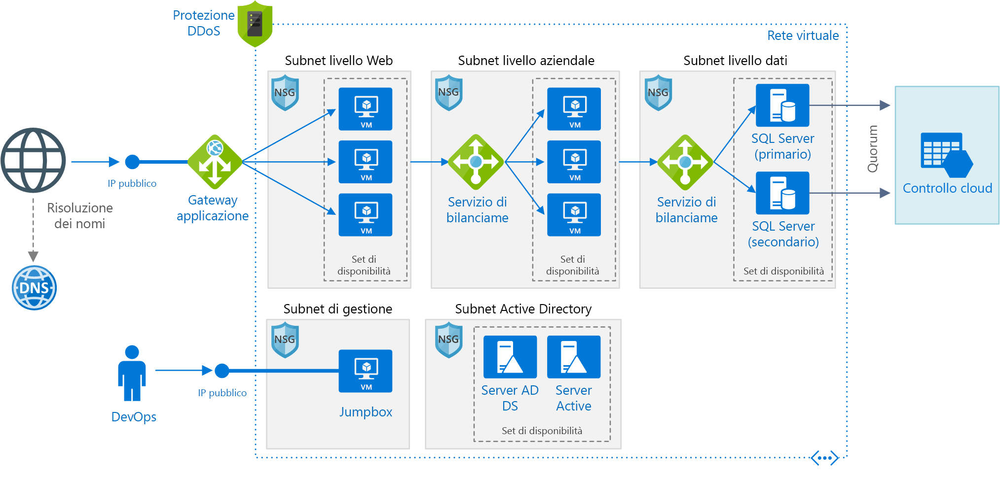

# <a name="windows-n-tier-application-on-azure-with-sql-server"></a><span data-ttu-id="f441c-103">Applicazione a più livelli Windows in Azure con SQL Server</span><span class="sxs-lookup"><span data-stu-id="f441c-103">Windows N-tier application on Azure with SQL Server</span></span>

<span data-ttu-id="f441c-104">Questa architettura di riferimento illustra come distribuire macchine virtuali e una rete virtuale configurata per un'applicazione [a più livelli](../../guide/architecture-styles/n-tier.md) tramite SQL Server in Windows per il livello dati.</span><span class="sxs-lookup"><span data-stu-id="f441c-104">This reference architecture shows how to deploy VMs and a virtual network configured for an [N-tier](../../guide/architecture-styles/n-tier.md) application, using SQL Server on Windows for the data tier.</span></span> <span data-ttu-id="f441c-105">[**Distribuire questa soluzione**](#deploy-the-solution).</span><span class="sxs-lookup"><span data-stu-id="f441c-105">[**Deploy this solution**](#deploy-the-solution).</span></span>



<span data-ttu-id="f441c-107">*Scaricare un [file Visio][visio-download] di questa architettura.*</span><span class="sxs-lookup"><span data-stu-id="f441c-107">*Download a [Visio file][visio-download] of this architecture.*</span></span>

## <a name="architecture"></a><span data-ttu-id="f441c-108">Architettura</span><span class="sxs-lookup"><span data-stu-id="f441c-108">Architecture</span></span>

<span data-ttu-id="f441c-109">L'architettura include i componenti seguenti:</span><span class="sxs-lookup"><span data-stu-id="f441c-109">The architecture has the following components:</span></span>

- <span data-ttu-id="f441c-110">**Gruppo di risorse**.</span><span class="sxs-lookup"><span data-stu-id="f441c-110">**Resource group**.</span></span> <span data-ttu-id="f441c-111">I [gruppi di risorse][resource-manager-overview] vengono usati per raggruppare le risorse in modo che possano essere gestite in base alla durata, al proprietario o ad altri criteri.</span><span class="sxs-lookup"><span data-stu-id="f441c-111">[Resource groups][resource-manager-overview] are used to group resources so they can be managed by lifetime, owner, or other criteria.</span></span>

- <span data-ttu-id="f441c-112">**Rete virtuale (VNet) e subnet**.</span><span class="sxs-lookup"><span data-stu-id="f441c-112">**Virtual network (VNet) and subnets**.</span></span> <span data-ttu-id="f441c-113">Ogni VM di Azure viene distribuita in una rete virtuale che può essere segmentata in subnet.</span><span class="sxs-lookup"><span data-stu-id="f441c-113">Every Azure VM is deployed into a VNet that can be segmented into subnets.</span></span> <span data-ttu-id="f441c-114">Creare una subnet separata per ogni livello.</span><span class="sxs-lookup"><span data-stu-id="f441c-114">Create a separate subnet for each tier.</span></span>

- <span data-ttu-id="f441c-115">**Gateway applicazione**.</span><span class="sxs-lookup"><span data-stu-id="f441c-115">**Application gateway**.</span></span> <span data-ttu-id="f441c-116">Il [gateway applicazione di Azure](/azure/application-gateway/) è un servizio di bilanciamento del carico di livello 7.</span><span class="sxs-lookup"><span data-stu-id="f441c-116">[Azure Application Gateway](/azure/application-gateway/) is a layer 7 load balancer.</span></span> <span data-ttu-id="f441c-117">In questa architettura, instrada le richieste HTTP al front-end Web.</span><span class="sxs-lookup"><span data-stu-id="f441c-117">In this architecture, it routes HTTP requests to the web front end.</span></span> <span data-ttu-id="f441c-118">Il gateway applicazione fornisce anche un [Web application firewall](/azure/application-gateway/waf-overview) (WAF) che protegge l'applicazione da exploit e vulnerabilità comuni.</span><span class="sxs-lookup"><span data-stu-id="f441c-118">Application Gateway also provides a [web application firewall](/azure/application-gateway/waf-overview) (WAF) that protects the application from common exploits and vulnerabilities.</span></span>

- <span data-ttu-id="f441c-119">**Gruppi di sicurezza di rete**.</span><span class="sxs-lookup"><span data-stu-id="f441c-119">**NSGs**.</span></span> <span data-ttu-id="f441c-120">Usare i [gruppi di sicurezza di rete][nsg] (NSG) per limitare il traffico di rete nella rete virtuale.</span><span class="sxs-lookup"><span data-stu-id="f441c-120">Use [network security groups][nsg] (NSGs) to restrict network traffic within the VNet.</span></span> <span data-ttu-id="f441c-121">Nell'architettura a tre livelli qui illustrata, ad esempio, il livello database non accetta traffico dal front-end Web, ma solo dal livello business e dalla subnet di gestione.</span><span class="sxs-lookup"><span data-stu-id="f441c-121">For example, in the three-tier architecture shown here, the database tier does not accept traffic from the web front end, only from the business tier and the management subnet.</span></span>

- <span data-ttu-id="f441c-122">**Protezione DDoS**.</span><span class="sxs-lookup"><span data-stu-id="f441c-122">**DDoS Protection**.</span></span> <span data-ttu-id="f441c-123">Nonostante la piattaforma Azure offra protezione di base dagli attacchi Distributed Denial of Service (DDoS), è consigliabile usare [Protezione DDoS Standard][ddos], che include funzionalità di mitigazione DDoS avanzate.</span><span class="sxs-lookup"><span data-stu-id="f441c-123">Although the Azure platform provides basic protection against distributed denial of service (DDoS) attacks, we recommend using [DDoS Protection Standard][ddos], which has enhanced DDoS mitigation features.</span></span> <span data-ttu-id="f441c-124">Vedere [Considerazioni relative alla sicurezza](#security-considerations).</span><span class="sxs-lookup"><span data-stu-id="f441c-124">See [Security considerations](#security-considerations).</span></span>

- <span data-ttu-id="f441c-125">**Macchine virtuali**.</span><span class="sxs-lookup"><span data-stu-id="f441c-125">**Virtual machines**.</span></span> <span data-ttu-id="f441c-126">Per indicazioni su come configurare le macchine virtuali, vedere [Eseguire una VM Windows in Azure](./windows-vm.md) ed [Eseguire una VM Linux in Azure](./linux-vm.md).</span><span class="sxs-lookup"><span data-stu-id="f441c-126">For recommendations on configuring VMs, see [Run a Windows VM on Azure](./windows-vm.md) and [Run a Linux VM on Azure](./linux-vm.md).</span></span>

- <span data-ttu-id="f441c-127">**Set di disponibilità**.</span><span class="sxs-lookup"><span data-stu-id="f441c-127">**Availability sets**.</span></span> <span data-ttu-id="f441c-128">Per ogni livello creare un [set di disponibilità][azure-availability-sets] ed effettuare il provisioning di almeno due VM, rendendo così le VM idonee per un [contratto di servizio][vm-sla] superiore.</span><span class="sxs-lookup"><span data-stu-id="f441c-128">Create an [availability set][azure-availability-sets] for each tier, and provision at least two VMs in each tier, which makes the VMs eligible for a higher [service level agreement (SLA)][vm-sla].</span></span>

- <span data-ttu-id="f441c-129">**Servizi di bilanciamento del carico**.</span><span class="sxs-lookup"><span data-stu-id="f441c-129">**Load balancers**.</span></span> <span data-ttu-id="f441c-130">Usare [Azure Load Balancer][load-balancer] per distribuire il traffico di rete dal livello Web al livello aziendale e dal livello aziendale a SQL Server.</span><span class="sxs-lookup"><span data-stu-id="f441c-130">Use [Azure Load Balancer][load-balancer] to distribute network traffic from the web tier to the business tier, and from the business tier to SQL Server.</span></span>

- <span data-ttu-id="f441c-131">**Indirizzo IP pubblico**.</span><span class="sxs-lookup"><span data-stu-id="f441c-131">**Public IP address**.</span></span> <span data-ttu-id="f441c-132">Affinché l'applicazione possa ricevere il traffico Internet, è necessario un indirizzo IP pubblico.</span><span class="sxs-lookup"><span data-stu-id="f441c-132">A public IP address is needed for the application to receive Internet traffic.</span></span>

- <span data-ttu-id="f441c-133">**Jumpbox**.</span><span class="sxs-lookup"><span data-stu-id="f441c-133">**Jumpbox**.</span></span> <span data-ttu-id="f441c-134">Detto anche [bastion host].</span><span class="sxs-lookup"><span data-stu-id="f441c-134">Also called a [bastion host].</span></span> <span data-ttu-id="f441c-135">È una macchina virtuale sicura in rete che viene usata dagli amministratori per connettersi alle altre macchine virtuali.</span><span class="sxs-lookup"><span data-stu-id="f441c-135">A secure VM on the network that administrators use to connect to the other VMs.</span></span> <span data-ttu-id="f441c-136">Il jumpbox ha un gruppo di sicurezza di rete (NSG) che consente il traffico remoto solo da Indirizzi IP pubblici inclusi in un elenco di indirizzi attendibili.</span><span class="sxs-lookup"><span data-stu-id="f441c-136">The jumpbox has an NSG that allows remote traffic only from public IP addresses on a safe list.</span></span> <span data-ttu-id="f441c-137">L'NSG dovrebbe consentire il traffico RDP (Remote Desktop Protocol).</span><span class="sxs-lookup"><span data-stu-id="f441c-137">The NSG should permit remote desktop (RDP) traffic.</span></span>

- <span data-ttu-id="f441c-138">**Gruppo di disponibilità Always On di SQL Server**.</span><span class="sxs-lookup"><span data-stu-id="f441c-138">**SQL Server Always On Availability Group**.</span></span> <span data-ttu-id="f441c-139">Assicura disponibilità elevata al livello dati, abilitando la replica e il failover.</span><span class="sxs-lookup"><span data-stu-id="f441c-139">Provides high availability at the data tier, by enabling replication and failover.</span></span> <span data-ttu-id="f441c-140">Usa la tecnologia Windows Server Failover Cluster (WSFC) per il failover.</span><span class="sxs-lookup"><span data-stu-id="f441c-140">It uses Windows Server Failover Cluster (WSFC) technology for failover.</span></span>

- <span data-ttu-id="f441c-141">**Server di Active Directory Domain Services.**</span><span class="sxs-lookup"><span data-stu-id="f441c-141">**Active Directory Domain Services (AD DS) Servers**.</span></span> <span data-ttu-id="f441c-142">Gli oggetti computer per il cluster di failover e i ruoli del cluster associati vengono creati in Active Directory Domain Services (AD DS).</span><span class="sxs-lookup"><span data-stu-id="f441c-142">The computer objects for the failover cluster and its associated clustered roles are created in Active Directory Domain Services (AD DS).</span></span>

- <span data-ttu-id="f441c-143">**Cloud di controllo**.</span><span class="sxs-lookup"><span data-stu-id="f441c-143">**Cloud Witness**.</span></span> <span data-ttu-id="f441c-144">Un cluster di failover richiede che più della metà dei nodi sia in esecuzione (quorum).</span><span class="sxs-lookup"><span data-stu-id="f441c-144">A failover cluster requires more than half of its nodes to be running, which is known as having quorum.</span></span> <span data-ttu-id="f441c-145">Se il cluster ha solo due nodi, una partizione di rete potrebbe indurre ogni nodo a ritenere di essere il nodo master.</span><span class="sxs-lookup"><span data-stu-id="f441c-145">If the cluster has just two nodes, a network partition could cause each node to think it's the master node.</span></span> <span data-ttu-id="f441c-146">In tal caso, è necessario un *controllo* per stabilire la prevalenza e ottenere il quorum.</span><span class="sxs-lookup"><span data-stu-id="f441c-146">In that case, you need a *witness* to break ties and establish quorum.</span></span> <span data-ttu-id="f441c-147">Un controllo è una risorsa, ad esempio un disco condiviso, che può stabilire la prevalenza per ottenere il quorum.</span><span class="sxs-lookup"><span data-stu-id="f441c-147">A witness is a resource such as a shared disk that can act as a tie breaker to establish quorum.</span></span> <span data-ttu-id="f441c-148">Il cloud di controllo è un tipo di controllo che usa Archiviazione BLOB di Azure.</span><span class="sxs-lookup"><span data-stu-id="f441c-148">Cloud Witness is a type of witness that uses Azure Blob Storage.</span></span> <span data-ttu-id="f441c-149">Per altre informazioni sul concetto di quorum, vedere [Understanding cluster and pool quorum](/windows-server/storage/storage-spaces/understand-quorum) (Informazioni su cluster e quorum del pool).</span><span class="sxs-lookup"><span data-stu-id="f441c-149">To learn more about the concept of quorum, see [Understanding cluster and pool quorum](/windows-server/storage/storage-spaces/understand-quorum).</span></span> <span data-ttu-id="f441c-150">Per altre informazioni sul controllo cloud, vedere [Distribuire un cloud di controllo per un cluster di failover](/windows-server/failover-clustering/deploy-cloud-witness).</span><span class="sxs-lookup"><span data-stu-id="f441c-150">For more information about Cloud Witness, see [Deploy a Cloud Witness for a Failover Cluster](/windows-server/failover-clustering/deploy-cloud-witness).</span></span>

- <span data-ttu-id="f441c-151">**DNS di Azure**.</span><span class="sxs-lookup"><span data-stu-id="f441c-151">**Azure DNS**.</span></span> <span data-ttu-id="f441c-152">[DNS di Azure][azure-dns] è un servizio di hosting per i domini DNS</span><span class="sxs-lookup"><span data-stu-id="f441c-152">[Azure DNS][azure-dns] is a hosting service for DNS domains.</span></span> <span data-ttu-id="f441c-153">che esegue la risoluzione dei nomi usando l'infrastruttura di Microsoft Azure.</span><span class="sxs-lookup"><span data-stu-id="f441c-153">It provides name resolution using Microsoft Azure infrastructure.</span></span> <span data-ttu-id="f441c-154">Ospitando i domini in Azure, è possibile gestire i record DNS usando le stesse credenziali, API, strumenti e fatturazione come per gli altri servizi Azure.</span><span class="sxs-lookup"><span data-stu-id="f441c-154">By hosting your domains in Azure, you can manage your DNS records using the same credentials, APIs, tools, and billing as your other Azure services.</span></span>

## <a name="recommendations"></a><span data-ttu-id="f441c-155">Consigli</span><span class="sxs-lookup"><span data-stu-id="f441c-155">Recommendations</span></span>

<span data-ttu-id="f441c-156">I requisiti della propria organizzazione potrebbero essere diversi da quelli dell'architettura descritta in questo articolo.</span><span class="sxs-lookup"><span data-stu-id="f441c-156">Your requirements might differ from the architecture described here.</span></span> <span data-ttu-id="f441c-157">Usare queste indicazioni come punto di partenza.</span><span class="sxs-lookup"><span data-stu-id="f441c-157">Use these recommendations as a starting point.</span></span>

### <a name="vnet--subnets"></a><span data-ttu-id="f441c-158">Rete virtuale/subnet</span><span class="sxs-lookup"><span data-stu-id="f441c-158">VNet / Subnets</span></span>

<span data-ttu-id="f441c-159">Quando si crea la rete virtuale, determinare quanti indirizzi IP saranno necessari alle risorse in ogni subnet.</span><span class="sxs-lookup"><span data-stu-id="f441c-159">When you create the VNet, determine how many IP addresses your resources in each subnet require.</span></span> <span data-ttu-id="f441c-160">Specificare una subnet mask e un intervallo di indirizzi della rete virtuale abbastanza ampio da contenere gli indirizzi IP necessari, usando la notazione [CIDR].</span><span class="sxs-lookup"><span data-stu-id="f441c-160">Specify a subnet mask and a VNet address range large enough for the required IP addresses, using [CIDR] notation.</span></span> <span data-ttu-id="f441c-161">Usare uno spazio indirizzi che rientri nei [blocchi di indirizzi IP privati][private-ip-space] standard, ossia 10.0.0.0/8, 172.16.0.0/12 e 192.168.0.0/16.</span><span class="sxs-lookup"><span data-stu-id="f441c-161">Use an address space that falls within the standard [private IP address blocks][private-ip-space], which are 10.0.0.0/8, 172.16.0.0/12, and 192.168.0.0/16.</span></span>

<span data-ttu-id="f441c-162">Scegliere un intervallo di indirizzi che non si sovrapponga alla rete locale, in caso occorra in seguito configurare un gateway tra la rete virtuale e la rete locale.</span><span class="sxs-lookup"><span data-stu-id="f441c-162">Choose an address range that does not overlap with your on-premises network, in case you need to set up a gateway between the VNet and your on-premise network later.</span></span> <span data-ttu-id="f441c-163">Una volta creata la rete virtuale, non è più possibile cambiare l'intervallo di indirizzi.</span><span class="sxs-lookup"><span data-stu-id="f441c-163">Once you create the VNet, you can't change the address range.</span></span>

<span data-ttu-id="f441c-164">Progettare le subnet tenendo presenti i requisiti di funzionamento e sicurezza.</span><span class="sxs-lookup"><span data-stu-id="f441c-164">Design subnets with functionality and security requirements in mind.</span></span> <span data-ttu-id="f441c-165">Tutte le macchine virtuali nello stesso livello o nello stesso ruolo dovrebbero far parte della stessa subnet, che può essere un limite di sicurezza.</span><span class="sxs-lookup"><span data-stu-id="f441c-165">All VMs within the same tier or role should go into the same subnet, which can be a security boundary.</span></span> <span data-ttu-id="f441c-166">Per altre informazioni sulla progettazione di reti virtuali e subnet, vedere [Pianificare e progettare reti virtuali di Azure][plan-network].</span><span class="sxs-lookup"><span data-stu-id="f441c-166">For more information about designing VNets and subnets, see [Plan and design Azure Virtual Networks][plan-network].</span></span>

### <a name="load-balancers"></a><span data-ttu-id="f441c-167">Servizi di bilanciamento del carico</span><span class="sxs-lookup"><span data-stu-id="f441c-167">Load balancers</span></span>

<span data-ttu-id="f441c-168">Non esporre le VM direttamente in Internet, ma assegnare invece a ogni VM un indirizzo IP privato.</span><span class="sxs-lookup"><span data-stu-id="f441c-168">Don't expose the VMs directly to the Internet, but instead give each VM a private IP address.</span></span> <span data-ttu-id="f441c-169">I client si connettono usando l'indirizzo IP pubblico associato al gateway applicazione.</span><span class="sxs-lookup"><span data-stu-id="f441c-169">Clients connect using the public IP address associated with the Application Gateway.</span></span>

<span data-ttu-id="f441c-170">Definire regole di bilanciamento del carico per indirizzare il traffico di rete alle macchine virtuali.</span><span class="sxs-lookup"><span data-stu-id="f441c-170">Define load balancer rules to direct network traffic to the VMs.</span></span> <span data-ttu-id="f441c-171">Per consentire il traffico HTTP, ad esempio, eseguire il mapping della porta 80 della configurazione front-end alla porta 80 nel pool di indirizzi back-end.</span><span class="sxs-lookup"><span data-stu-id="f441c-171">For example, to enable HTTP traffic, map port 80 from the front-end configuration to port 80 on the back-end address pool.</span></span> <span data-ttu-id="f441c-172">Quando un client invia una richiesta HTTP alla porta 80, il servizio di bilanciamento del carico consente di selezionare un indirizzo IP back-end usando un [algoritmo di hash][load-balancer-hashing] che include l'indirizzo IP di origine.</span><span class="sxs-lookup"><span data-stu-id="f441c-172">When a client sends an HTTP request to port 80, the load balancer selects a back-end IP address by using a [hashing algorithm][load-balancer-hashing] that includes the source IP address.</span></span> <span data-ttu-id="f441c-173">Le richieste client vengono distribuite tra tutte le VM nel pool di indirizzi back-end.</span><span class="sxs-lookup"><span data-stu-id="f441c-173">Client requests are distributed across all the VMs in the back-end address pool.</span></span>

### <a name="network-security-groups"></a><span data-ttu-id="f441c-174">Gruppi di sicurezza di rete</span><span class="sxs-lookup"><span data-stu-id="f441c-174">Network security groups</span></span>

<span data-ttu-id="f441c-175">Usare le regole NSG per limitare il traffico fra livelli.</span><span class="sxs-lookup"><span data-stu-id="f441c-175">Use NSG rules to restrict traffic between tiers.</span></span> <span data-ttu-id="f441c-176">Nell'architettura a tre livelli illustrata sopra, il livello Web non comunica direttamente con il livello database.</span><span class="sxs-lookup"><span data-stu-id="f441c-176">In the three-tier architecture shown above, the web tier does not communicate directly with the database tier.</span></span> <span data-ttu-id="f441c-177">Per applicare questo comportamento, il livello database deve bloccare il traffico in entrata dalla subnet del livello Web.</span><span class="sxs-lookup"><span data-stu-id="f441c-177">To enforce this, the database tier should block incoming traffic from the web tier subnet.</span></span>

1. <span data-ttu-id="f441c-178">Rifiutare tutto il traffico in ingresso dalla rete virtuale.</span><span class="sxs-lookup"><span data-stu-id="f441c-178">Deny all inbound traffic from the VNet.</span></span> <span data-ttu-id="f441c-179">(usare il tag `VIRTUAL_NETWORK` nella regola).</span><span class="sxs-lookup"><span data-stu-id="f441c-179">(Use the `VIRTUAL_NETWORK` tag in the rule.)</span></span>
2. <span data-ttu-id="f441c-180">Consentire il traffico in ingresso dalla subnet del livello business.</span><span class="sxs-lookup"><span data-stu-id="f441c-180">Allow inbound traffic from the business tier subnet.</span></span>
3. <span data-ttu-id="f441c-181">Consentire il traffico in ingresso dalla subnet del livello database.</span><span class="sxs-lookup"><span data-stu-id="f441c-181">Allow inbound traffic from the database tier subnet itself.</span></span> <span data-ttu-id="f441c-182">Questa regola consente la comunicazione tra le macchine virtuali del database, condizione necessaria per la replica e il failover del database.</span><span class="sxs-lookup"><span data-stu-id="f441c-182">This rule allows communication between the database VMs, which is needed for database replication and failover.</span></span>
4. <span data-ttu-id="f441c-183">Consentire il traffico RDP (porta 3389) dalla subnet del jumpbox.</span><span class="sxs-lookup"><span data-stu-id="f441c-183">Allow RDP traffic (port 3389) from the jumpbox subnet.</span></span> <span data-ttu-id="f441c-184">Questa regola consente agli amministratori di connettersi al livello database dal jumpbox.</span><span class="sxs-lookup"><span data-stu-id="f441c-184">This rule lets administrators connect to the database tier from the jumpbox.</span></span>

<span data-ttu-id="f441c-185">Creare le regole 2 &ndash; 4 con priorità più alta rispetto alla prima regola, in modo da eseguirne l'override.</span><span class="sxs-lookup"><span data-stu-id="f441c-185">Create rules 2 &ndash; 4 with higher priority than the first rule, so they override it.</span></span>

### <a name="sql-server-always-on-availability-groups"></a><span data-ttu-id="f441c-186">Gruppi di disponibilità Always On di SQL Server</span><span class="sxs-lookup"><span data-stu-id="f441c-186">SQL Server Always On Availability Groups</span></span>

<span data-ttu-id="f441c-187">È consigliabile usare i [gruppi di disponibilità AlwaysOn][sql-alwayson] per ottenere la disponibilità elevata di SQL Server.</span><span class="sxs-lookup"><span data-stu-id="f441c-187">We recommend [Always On Availability Groups][sql-alwayson] for SQL Server high availability.</span></span> <span data-ttu-id="f441c-188">Nelle versioni precedenti a Windows Server 2016 i gruppi di disponibilità AlwaysOn richiedono un controller di dominio e tutti i nodi del gruppo di disponibilità devono far parte dello stesso dominio Active Directory.</span><span class="sxs-lookup"><span data-stu-id="f441c-188">Prior to Windows Server 2016, Always On Availability Groups require a domain controller, and all nodes in the availability group must be in the same AD domain.</span></span>

<span data-ttu-id="f441c-189">Altri livelli si connettono al database tramite un [listener del gruppo di disponibilità][sql-alwayson-listeners].</span><span class="sxs-lookup"><span data-stu-id="f441c-189">Other tiers connect to the database through an [availability group listener][sql-alwayson-listeners].</span></span> <span data-ttu-id="f441c-190">Il listener consente a un client SQL di connettersi senza conoscere il nome dell'istanza fisica di SQL Server.</span><span class="sxs-lookup"><span data-stu-id="f441c-190">The listener enables a SQL client to connect without knowing the name of the physical instance of SQL Server.</span></span> <span data-ttu-id="f441c-191">Le macchine virtuali che accedono al database devono far parte del dominio.</span><span class="sxs-lookup"><span data-stu-id="f441c-191">VMs that access the database must be joined to the domain.</span></span> <span data-ttu-id="f441c-192">Il client (in questo caso un altro livello) usa il DNS per risolvere il nome della rete virtuale del listener in indirizzi IP.</span><span class="sxs-lookup"><span data-stu-id="f441c-192">The client (in this case, another tier) uses DNS to resolve the listener's virtual network name into IP addresses.</span></span>

<span data-ttu-id="f441c-193">Configurare il gruppo di disponibilità AlwaysOn di SQL Server nel modo seguente:</span><span class="sxs-lookup"><span data-stu-id="f441c-193">Configure the SQL Server Always On Availability Group as follows:</span></span>

1. <span data-ttu-id="f441c-194">Creare un cluster WSFC (Windows Server Failover Clustering), un gruppo di disponibilità AlwaysOn di SQL Server e una replica primaria.</span><span class="sxs-lookup"><span data-stu-id="f441c-194">Create a Windows Server Failover Clustering (WSFC) cluster, a SQL Server Always On Availability Group, and a primary replica.</span></span> <span data-ttu-id="f441c-195">Per altre informazioni, vedere [Introduzione ai gruppi di disponibilità AlwaysOn (SQL Server)][sql-alwayson-getting-started].</span><span class="sxs-lookup"><span data-stu-id="f441c-195">For more information, see [Getting Started with Always On Availability Groups][sql-alwayson-getting-started].</span></span>
2. <span data-ttu-id="f441c-196">Creare un servizio di bilanciamento del carico interno con un indirizzo privato statico.</span><span class="sxs-lookup"><span data-stu-id="f441c-196">Create an internal load balancer with a static private IP address.</span></span>
3. <span data-ttu-id="f441c-197">Creare un listener del gruppo di disponibilità ed eseguire il mapping del nome DNS del listener all'indirizzo IP di un servizio di bilanciamento del carico interno.</span><span class="sxs-lookup"><span data-stu-id="f441c-197">Create an availability group listener, and map the listener's DNS name to the IP address of an internal load balancer.</span></span>
4. <span data-ttu-id="f441c-198">Creare una regola di bilanciamento del carico per la porta di ascolto di SQL Server (porta TCP 1433 per impostazione predefinita).</span><span class="sxs-lookup"><span data-stu-id="f441c-198">Create a load balancer rule for the SQL Server listening port (TCP port 1433 by default).</span></span> <span data-ttu-id="f441c-199">La regola di bilanciamento del carico deve abilitare l'*indirizzo IP mobile*, detto anche Direct Server Return,</span><span class="sxs-lookup"><span data-stu-id="f441c-199">The load balancer rule must enable *floating IP*, also called Direct Server Return.</span></span> <span data-ttu-id="f441c-200">per fare in modo che la macchina virtuale risponda direttamente al client, permettendo una connessione diretta alla replica primaria.</span><span class="sxs-lookup"><span data-stu-id="f441c-200">This causes the VM to reply directly to the client, which enables a direct connection to the primary replica.</span></span>

   > [!NOTE]
   > <span data-ttu-id="f441c-201">Quando l'indirizzo IP mobile è abilitato, il numero di porta front-end deve corrispondere al numero di porta back-end nella regola di bilanciamento del carico.</span><span class="sxs-lookup"><span data-stu-id="f441c-201">When floating IP is enabled, the front-end port number must be the same as the back-end port number in the load balancer rule.</span></span>
   >

<span data-ttu-id="f441c-202">Quando un client SQL cerca di connettersi, il servizio di bilanciamento del carico indirizza la richiesta di connessione alla replica primaria.</span><span class="sxs-lookup"><span data-stu-id="f441c-202">When a SQL client tries to connect, the load balancer routes the connection request to the primary replica.</span></span> <span data-ttu-id="f441c-203">In caso di failover a un'altra replica, il servizio di bilanciamento del carico indirizza automaticamente le nuove richieste a una nuova replica primaria.</span><span class="sxs-lookup"><span data-stu-id="f441c-203">If there is a failover to another replica, the load balancer automatically routes new requests to a new primary replica.</span></span> <span data-ttu-id="f441c-204">Per altre informazioni, vedere [Configure an ILB listener for SQL Server Always On Availability Groups][sql-alwayson-ilb] (Configurare un listener ILB per i gruppi di disponibilità AlwaysOn di SQL Server).</span><span class="sxs-lookup"><span data-stu-id="f441c-204">For more information, see [Configure an ILB listener for SQL Server Always On Availability Groups][sql-alwayson-ilb].</span></span>

<span data-ttu-id="f441c-205">Durante un failover, le connessioni client esistenti vengono chiuse.</span><span class="sxs-lookup"><span data-stu-id="f441c-205">During a failover, existing client connections are closed.</span></span> <span data-ttu-id="f441c-206">Dopo il completamento del failover, le nuove connessioni verranno indirizzate alla nuova replica primaria.</span><span class="sxs-lookup"><span data-stu-id="f441c-206">After the failover completes, new connections will be routed to the new primary replica.</span></span>

<span data-ttu-id="f441c-207">Se l'applicazione esegue molte più letture che scritture, è possibile eseguire l'offload di alcune delle query di sola lettura a una replica secondaria.</span><span class="sxs-lookup"><span data-stu-id="f441c-207">If your application makes significantly more reads than writes, you can offload some of the read-only queries to a secondary replica.</span></span> <span data-ttu-id="f441c-208">Vedere [Utilizzo di un listener per connettersi a una replica secondaria di sola lettura (routing di sola lettura)][sql-alwayson-read-only-routing].</span><span class="sxs-lookup"><span data-stu-id="f441c-208">See [Using a Listener to Connect to a Read-Only Secondary Replica (Read-Only Routing)][sql-alwayson-read-only-routing].</span></span>

<span data-ttu-id="f441c-209">Testare la distribuzione [forzando un failover manuale][sql-alwayson-force-failover] del gruppo di disponibilità.</span><span class="sxs-lookup"><span data-stu-id="f441c-209">Test your deployment by [forcing a manual failover][sql-alwayson-force-failover] of the availability group.</span></span>

### <a name="jumpbox"></a><span data-ttu-id="f441c-210">Jumpbox</span><span class="sxs-lookup"><span data-stu-id="f441c-210">Jumpbox</span></span>

<span data-ttu-id="f441c-211">Non consentire l'accesso RDP dalla rete Internet pubblica alle VM che eseguono il carico di lavoro dell'applicazione.</span><span class="sxs-lookup"><span data-stu-id="f441c-211">Don't allow RDP access from the public Internet to the VMs that run the application workload.</span></span> <span data-ttu-id="f441c-212">L'accesso RDP a queste macchine virtuali deve sempre passare attraverso il jumpbox.</span><span class="sxs-lookup"><span data-stu-id="f441c-212">Instead, all RDP access to these VMs must come through the jumpbox.</span></span> <span data-ttu-id="f441c-213">Un amministratore accede al jumpbox, quindi accede alle altre macchine virtuali dal jumpbox.</span><span class="sxs-lookup"><span data-stu-id="f441c-213">An administrator logs into the jumpbox, and then logs into the other VM from the jumpbox.</span></span> <span data-ttu-id="f441c-214">Il jumpbox consente il traffico RDP da Internet, ma solo da indirizzi IP conosciuti e attendibili.</span><span class="sxs-lookup"><span data-stu-id="f441c-214">The jumpbox allows RDP traffic from the Internet, but only from known, safe IP addresses.</span></span>

<span data-ttu-id="f441c-215">Il jumpbox ha requisiti di prestazioni minimi, quindi selezionare una macchina virtuale di piccole dimensioni.</span><span class="sxs-lookup"><span data-stu-id="f441c-215">The jumpbox has minimal performance requirements, so select a small VM size.</span></span> <span data-ttu-id="f441c-216">Creare un [indirizzo IP pubblico] per il jumpbox.</span><span class="sxs-lookup"><span data-stu-id="f441c-216">Create a [public IP address] for the jumpbox.</span></span> <span data-ttu-id="f441c-217">Collocare il jumpbox nella stessa rete virtuale delle altre macchine virtuali, ma in una subnet di gestione separata.</span><span class="sxs-lookup"><span data-stu-id="f441c-217">Place the jumpbox in the same VNet as the other VMs, but in a separate management subnet.</span></span>

<span data-ttu-id="f441c-218">Per proteggere il jumpbox aggiungere una regola del gruppo di sicurezza di rete che consenta le connessioni RDP solo da un set di indirizzi IP pubblici attendibili.</span><span class="sxs-lookup"><span data-stu-id="f441c-218">To secure the jumpbox, add an NSG rule that allows RDP connections only from a safe set of public IP addresses.</span></span> <span data-ttu-id="f441c-219">Configurare i gruppi di sicurezza di rete per le altre subnet per consentire il traffico RDP dalla subnet di gestione.</span><span class="sxs-lookup"><span data-stu-id="f441c-219">Configure the NSGs for the other subnets to allow RDP traffic from the management subnet.</span></span>

## <a name="scalability-considerations"></a><span data-ttu-id="f441c-220">Considerazioni sulla scalabilità</span><span class="sxs-lookup"><span data-stu-id="f441c-220">Scalability considerations</span></span>

<span data-ttu-id="f441c-221">Per i livelli Web e business, valutare la possibilità di usare [set di scalabilità di macchine virtuali][vmss], invece di distribuire VM separate in un set di disponibilità.</span><span class="sxs-lookup"><span data-stu-id="f441c-221">For the web and business tiers, consider using [virtual machine scale sets][vmss], instead of deploying separate VMs into an availability set.</span></span> <span data-ttu-id="f441c-222">Un set di scalabilità facilita la distribuzione e la gestione di un set di VM identiche e il ridimensionamento automatico delle VM in base alle metriche delle prestazioni.</span><span class="sxs-lookup"><span data-stu-id="f441c-222">A scale set makes it easy to deploy and manage a set of identical VMs, and autoscale the VMs based on performance metrics.</span></span> <span data-ttu-id="f441c-223">Di pari passo con l'aumento del carico sulle macchine virtuali, vengono aggiunte automaticamente altre macchine virtuali al servizio di bilanciamento del carico.</span><span class="sxs-lookup"><span data-stu-id="f441c-223">As the load on the VMs increases, additional VMs are automatically added to the load balancer.</span></span> <span data-ttu-id="f441c-224">Prendere in considerazione i set di scalabilità se è necessario aumentare rapidamente le istanze delle macchine virtuali o se si necessita del ridimensionamento automatico.</span><span class="sxs-lookup"><span data-stu-id="f441c-224">Consider scale sets if you need to quickly scale out VMs, or need to autoscale.</span></span>

<span data-ttu-id="f441c-225">Esistono due modi per configurare le macchine virtuali distribuite in un set di scalabilità:</span><span class="sxs-lookup"><span data-stu-id="f441c-225">There are two basic ways to configure VMs deployed in a scale set:</span></span>

- <span data-ttu-id="f441c-226">Usare le estensioni per configurare la VM dopo la distribuzione.</span><span class="sxs-lookup"><span data-stu-id="f441c-226">Use extensions to configure the VM after it's deployed.</span></span> <span data-ttu-id="f441c-227">Con questo approccio, le nuove istanze delle macchine virtuali possono richiedere più tempo per l'avvio di una macchina virtuale senza estensioni.</span><span class="sxs-lookup"><span data-stu-id="f441c-227">With this approach, new VM instances may take longer to start up than a VM with no extensions.</span></span>

- <span data-ttu-id="f441c-228">Distribuire un [disco gestito](/azure/storage/storage-managed-disks-overview) con un'immagine del disco personalizzata.</span><span class="sxs-lookup"><span data-stu-id="f441c-228">Deploy a [managed disk](/azure/storage/storage-managed-disks-overview) with a custom disk image.</span></span> <span data-ttu-id="f441c-229">Questa opzione può risultare più veloce da distribuire.</span><span class="sxs-lookup"><span data-stu-id="f441c-229">This option may be quicker to deploy.</span></span> <span data-ttu-id="f441c-230">Richiede, tuttavia, che l'immagine venga mantenuta aggiornata.</span><span class="sxs-lookup"><span data-stu-id="f441c-230">However, it requires you to keep the image up-to-date.</span></span>

<span data-ttu-id="f441c-231">Per altre informazioni, vedere [Considerazioni sulla progettazione per i set di scalabilità][vmss-design].</span><span class="sxs-lookup"><span data-stu-id="f441c-231">For more information, see [Design considerations for scale sets][vmss-design].</span></span>

> [!TIP]
> <span data-ttu-id="f441c-232">Quando si usa una soluzione di ridimensionamento automatico, occorre testarla in anticipo con carichi di lavoro a livello di produzione.</span><span class="sxs-lookup"><span data-stu-id="f441c-232">When using any autoscale solution, test it with production-level workloads well in advance.</span></span>

<span data-ttu-id="f441c-233">Ogni sottoscrizione di Azure ha limiti predefiniti, tra cui il numero massimo di macchine virtuali per area.</span><span class="sxs-lookup"><span data-stu-id="f441c-233">Each Azure subscription has default limits in place, including a maximum number of VMs per region.</span></span> <span data-ttu-id="f441c-234">È possibile aumentare il limite presentando una richiesta di supporto.</span><span class="sxs-lookup"><span data-stu-id="f441c-234">You can increase the limit by filing a support request.</span></span> <span data-ttu-id="f441c-235">Per altre informazioni, vedere [Sottoscrizione di Azure e limiti, quote e vincoli dei servizi][subscription-limits].</span><span class="sxs-lookup"><span data-stu-id="f441c-235">For more information, see [Azure subscription and service limits, quotas, and constraints][subscription-limits].</span></span>

## <a name="availability-considerations"></a><span data-ttu-id="f441c-236">Considerazioni sulla disponibilità</span><span class="sxs-lookup"><span data-stu-id="f441c-236">Availability considerations</span></span>

<span data-ttu-id="f441c-237">Se non si usano set di scalabilità di macchine virtuali, inserire le VM per lo stesso livello in un set di disponibilità.</span><span class="sxs-lookup"><span data-stu-id="f441c-237">If you don't use virtual machine scale sets, put VMs for the same tier into an availability set.</span></span> <span data-ttu-id="f441c-238">Creare almeno due macchine virtuali nel set di disponibilità in modo da supportare il [contratto di servizio relativo alla disponibilità per le macchine virtuali di Azure][vm-sla].</span><span class="sxs-lookup"><span data-stu-id="f441c-238">Create at least two VMs in the availability set to support the [availability SLA for Azure VMs][vm-sla].</span></span> <span data-ttu-id="f441c-239">Per altre informazioni, vedere [Gestire la disponibilità delle macchine virtuali][availability-set].</span><span class="sxs-lookup"><span data-stu-id="f441c-239">For more information, see [Manage the availability of virtual machines][availability-set].</span></span> <span data-ttu-id="f441c-240">I set di scalabilità usano automaticamente *gruppi di posizionamento*, che fungono da set di disponibilità impliciti.</span><span class="sxs-lookup"><span data-stu-id="f441c-240">Scale sets automatically use *placement groups*, which act as an implicit availability set.</span></span>

<span data-ttu-id="f441c-241">Il servizio di bilanciamento del carico usa i [probe di integrità][health-probes] per monitorare la disponibilità delle istanze delle macchine virtuali.</span><span class="sxs-lookup"><span data-stu-id="f441c-241">The load balancer uses [health probes][health-probes] to monitor the availability of VM instances.</span></span> <span data-ttu-id="f441c-242">Se un probe non riesce a raggiungere un'istanza entro il periodo di timeout, il servizio di bilanciamento del carico interrompe l'invio di traffico alla VM.</span><span class="sxs-lookup"><span data-stu-id="f441c-242">If a probe can't reach an instance within a timeout period, the load balancer stops sending traffic to that VM.</span></span> <span data-ttu-id="f441c-243">Tuttavia, il servizio di bilanciamento del carico continuerà a eseguire la verifica e, se la macchina virtuale diventa nuovamente disponibile, il servizio di bilanciamento del carico riprenderà a inviare il traffico a quella macchina virtuale.</span><span class="sxs-lookup"><span data-stu-id="f441c-243">However, the load balancer will continue to probe, and if the VM becomes available again, the load balancer resumes sending traffic to that VM.</span></span>

<span data-ttu-id="f441c-244">Ecco alcune raccomandazioni per i probe di integrità del servizio di bilanciamento del carico:</span><span class="sxs-lookup"><span data-stu-id="f441c-244">Here are some recommendations on load balancer health probes:</span></span>

- <span data-ttu-id="f441c-245">I probe possono testare protocolli HTTP o TCP.</span><span class="sxs-lookup"><span data-stu-id="f441c-245">Probes can test either HTTP or TCP.</span></span> <span data-ttu-id="f441c-246">Se le macchine virtuali eseguono un server HTTP, creare un probe HTTP.</span><span class="sxs-lookup"><span data-stu-id="f441c-246">If your VMs run an HTTP server, create an HTTP probe.</span></span> <span data-ttu-id="f441c-247">In caso contrario, creare un probe TCP.</span><span class="sxs-lookup"><span data-stu-id="f441c-247">Otherwise create a TCP probe.</span></span>
- <span data-ttu-id="f441c-248">Per un probe HTTP, specificare il percorso di un endpoint HTTP.</span><span class="sxs-lookup"><span data-stu-id="f441c-248">For an HTTP probe, specify the path to an HTTP endpoint.</span></span> <span data-ttu-id="f441c-249">Il probe controlla una risposta HTTP 200 da questo percorso.</span><span class="sxs-lookup"><span data-stu-id="f441c-249">The probe checks for an HTTP 200 response from this path.</span></span> <span data-ttu-id="f441c-250">Può trattarsi del percorso radice ("/") o di un endpoint di monitoraggio dell'integrità che implementa logica personalizzata per controllare l'integrità dell'applicazione.</span><span class="sxs-lookup"><span data-stu-id="f441c-250">This path can be the root path ("/"), or a health-monitoring endpoint that implements some custom logic to check the health of the application.</span></span> <span data-ttu-id="f441c-251">L'endpoint deve consentire richieste HTTP anonime.</span><span class="sxs-lookup"><span data-stu-id="f441c-251">The endpoint must allow anonymous HTTP requests.</span></span>
- <span data-ttu-id="f441c-252">Il probe viene inviato da un [indirizzo IP noto][health-probe-ip], 168.63.129.16.</span><span class="sxs-lookup"><span data-stu-id="f441c-252">The probe is sent from a [known IP address][health-probe-ip], 168.63.129.16.</span></span> <span data-ttu-id="f441c-253">Nessun criterio del firewall o nessuna regola del gruppo di sicurezza di rete deve bloccare il traffico da o verso questo indirizzo IP.</span><span class="sxs-lookup"><span data-stu-id="f441c-253">Don't block traffic to or from this IP address in any firewall policies or NSG rules.</span></span>
- <span data-ttu-id="f441c-254">Usare i [log dei probe di integrità][health-probe-log] per visualizzare lo stato dei probe di integrità.</span><span class="sxs-lookup"><span data-stu-id="f441c-254">Use [health probe logs][health-probe-log] to view the status of the health probes.</span></span> <span data-ttu-id="f441c-255">Abilitare la registrazione nel portale di Azure per ogni servizio di bilanciamento del carico.</span><span class="sxs-lookup"><span data-stu-id="f441c-255">Enable logging in the Azure portal for each load balancer.</span></span> <span data-ttu-id="f441c-256">I log vengono scritti in Archiviazione BLOB di Azure.</span><span class="sxs-lookup"><span data-stu-id="f441c-256">Logs are written to Azure Blob storage.</span></span> <span data-ttu-id="f441c-257">I log mostrano quante VM non ricevono traffico di rete a causa di risposte di probe con esito negativo.</span><span class="sxs-lookup"><span data-stu-id="f441c-257">The logs show how many VMs aren't getting network traffic because of failed probe responses.</span></span>

<span data-ttu-id="f441c-258">Se occorre una disponibilità più elevata di quella fornita dal [contratto di servizio di Azure per le macchine virtuali][vm-sla], è consigliabile eseguire la replica dell'applicazione in due aree e usare Gestione traffico di Azure per il failover.</span><span class="sxs-lookup"><span data-stu-id="f441c-258">If you need higher availability than the [Azure SLA for VMs][vm-sla] provides, consider replication the application across two regions, using Azure Traffic Manager for failover.</span></span> <span data-ttu-id="f441c-259">Per altre informazioni, vedere [Applicazione a più livelli per più aree per la disponibilità elevata][multi-dc].</span><span class="sxs-lookup"><span data-stu-id="f441c-259">For more information, see [Multi-region N-tier application for high availability][multi-dc].</span></span>

## <a name="security-considerations"></a><span data-ttu-id="f441c-260">Considerazioni relative alla sicurezza</span><span class="sxs-lookup"><span data-stu-id="f441c-260">Security considerations</span></span>

<span data-ttu-id="f441c-261">Le reti virtuali sono un limite di isolamento del traffico in Azure.</span><span class="sxs-lookup"><span data-stu-id="f441c-261">Virtual networks are a traffic isolation boundary in Azure.</span></span> <span data-ttu-id="f441c-262">Le VM in una rete virtuale non possono comunicare direttamente con quelle in un'altra rete virtuale.</span><span class="sxs-lookup"><span data-stu-id="f441c-262">VMs in one VNet can't communicate directly with VMs in a different VNet.</span></span> <span data-ttu-id="f441c-263">Le macchine virtuali all'interno della stessa rete virtuale possono comunicare, a meno che non si creino [gruppi di sicurezza di rete][nsg] per limitare il traffico.</span><span class="sxs-lookup"><span data-stu-id="f441c-263">VMs within the same VNet can communicate, unless you create [network security groups][nsg] (NSGs) to restrict traffic.</span></span> <span data-ttu-id="f441c-264">Per altre informazioni, vedere [Servizi cloud Microsoft e sicurezza di rete][network-security].</span><span class="sxs-lookup"><span data-stu-id="f441c-264">For more information, see [Microsoft cloud services and network security][network-security].</span></span>

<span data-ttu-id="f441c-265">**Rete perimetrale**.</span><span class="sxs-lookup"><span data-stu-id="f441c-265">**DMZ**.</span></span> <span data-ttu-id="f441c-266">Valutare l'aggiunta di un'appliance virtuale di rete per creare una rete perimetrale tra la rete Internet e la rete virtuale di Azure.</span><span class="sxs-lookup"><span data-stu-id="f441c-266">Consider adding a network virtual appliance (NVA) to create a DMZ between the Internet and the Azure virtual network.</span></span> <span data-ttu-id="f441c-267">Un'appliance virtuale di rete esegue attività correlate alla rete, ad esempio impostazione di un firewall, ispezione di pacchetti, controllo e routing personalizzato.</span><span class="sxs-lookup"><span data-stu-id="f441c-267">NVA is a generic term for a virtual appliance that can perform network-related tasks, such as firewall, packet inspection, auditing, and custom routing.</span></span> <span data-ttu-id="f441c-268">Per altre informazioni, vedere [Implementazione di una rete perimetrale tra Azure e Internet][dmz].</span><span class="sxs-lookup"><span data-stu-id="f441c-268">For more information, see [Implementing a DMZ between Azure and the Internet][dmz].</span></span>

<span data-ttu-id="f441c-269">**Crittografia**.</span><span class="sxs-lookup"><span data-stu-id="f441c-269">**Encryption**.</span></span> <span data-ttu-id="f441c-270">Crittografare i dati sensibili inattivi e usare[Azure Key Vault][azure-key-vault] per gestire le chiavi di crittografia del database.</span><span class="sxs-lookup"><span data-stu-id="f441c-270">Encrypt sensitive data at rest and use [Azure Key Vault][azure-key-vault] to manage the database encryption keys.</span></span> <span data-ttu-id="f441c-271">Key Vault consente di archiviare le chiavi di crittografia in moduli di protezione hardware.</span><span class="sxs-lookup"><span data-stu-id="f441c-271">Key Vault can store encryption keys in hardware security modules (HSMs).</span></span> <span data-ttu-id="f441c-272">Per altre informazioni, vedere [Configurare l'integrazione di Azure Key Vault per SQL Server in macchine virtuali di Azure][sql-keyvault].</span><span class="sxs-lookup"><span data-stu-id="f441c-272">For more information, see [Configure Azure Key Vault Integration for SQL Server on Azure VMs][sql-keyvault].</span></span> <span data-ttu-id="f441c-273">È anche consigliabile archiviare in Key Vault i segreti dell'applicazione, ad esempio le stringhe di connessione di database.</span><span class="sxs-lookup"><span data-stu-id="f441c-273">It's also recommended to store application secrets, such as database connection strings, in Key Vault.</span></span>

<span data-ttu-id="f441c-274">**Protezione DDoS**.</span><span class="sxs-lookup"><span data-stu-id="f441c-274">**DDoS protection**.</span></span> <span data-ttu-id="f441c-275">La piattaforma Azure offre protezione DDoS di base per impostazione predefinita.</span><span class="sxs-lookup"><span data-stu-id="f441c-275">The Azure platform provides basic DDoS protection by default.</span></span> <span data-ttu-id="f441c-276">Tale protezione di base mira a proteggere l'infrastruttura complessiva di Azure.</span><span class="sxs-lookup"><span data-stu-id="f441c-276">This basic protection is targeted at protecting the Azure infrastructure as a whole.</span></span> <span data-ttu-id="f441c-277">Nonostante la protezione DDoS di base sia automaticamente abilitata, è consigliabile usare [Protezione DDoS Standard][ddos].</span><span class="sxs-lookup"><span data-stu-id="f441c-277">Although basic DDoS protection is automatically enabled, we recommend using [DDoS Protection Standard][ddos].</span></span> <span data-ttu-id="f441c-278">Per rilevare le minacce, la protezione Standard usa l'ottimizzazione adattiva in base ai modelli di traffico di rete dell'applicazione.</span><span class="sxs-lookup"><span data-stu-id="f441c-278">Standard protection uses adaptive tuning, based on your application's network traffic patterns, to detect threats.</span></span> <span data-ttu-id="f441c-279">Ciò consente di applicare procedure di mitigazione per attacchi DDoS che potrebbero non essere rilevati dai criteri DDoS a livello di infrastruttura.</span><span class="sxs-lookup"><span data-stu-id="f441c-279">This allows it to apply mitigations against DDoS attacks that might go unnoticed by the infrastructure-wide DDoS policies.</span></span> <span data-ttu-id="f441c-280">La protezione Standard offre anche funzionalità di avviso, telemetria e analisi tramite Monitoraggio di Azure.</span><span class="sxs-lookup"><span data-stu-id="f441c-280">Standard protection also provides alerting, telemetry, and analytics through Azure Monitor.</span></span> <span data-ttu-id="f441c-281">Per altre informazioni, vedere [Protezione DDoS di Azure: Procedure consigliate e architetture di riferimento][ddos-best-practices].</span><span class="sxs-lookup"><span data-stu-id="f441c-281">For more information, see [Azure DDoS Protection: Best practices and reference architectures][ddos-best-practices].</span></span>

## <a name="deploy-the-solution"></a><span data-ttu-id="f441c-282">Distribuire la soluzione</span><span class="sxs-lookup"><span data-stu-id="f441c-282">Deploy the solution</span></span>

<span data-ttu-id="f441c-283">Una distribuzione di questa architettura di riferimento è disponibile in [GitHub][github-folder].</span><span class="sxs-lookup"><span data-stu-id="f441c-283">A deployment for this reference architecture is available on [GitHub][github-folder].</span></span> <span data-ttu-id="f441c-284">L'intera distribuzione può richiedere fino a due ore, includendo l'esecuzione degli script per configurare Active Directory Domain Services, il cluster di failover di Windows Server e il gruppo di disponibilità di SQL Server.</span><span class="sxs-lookup"><span data-stu-id="f441c-284">The entire deployment can take up to two hours, which includes running the scripts to configure AD DS, the Windows Server failover cluster, and the SQL Server availability group.</span></span>

### <a name="prerequisites"></a><span data-ttu-id="f441c-285">Prerequisiti</span><span class="sxs-lookup"><span data-stu-id="f441c-285">Prerequisites</span></span>

[!INCLUDE [ref-arch-prerequisites.md](../../../includes/ref-arch-prerequisites.md)]

### <a name="deployment-steps"></a><span data-ttu-id="f441c-286">Passaggi di distribuzione</span><span class="sxs-lookup"><span data-stu-id="f441c-286">Deployment steps</span></span>

1. <span data-ttu-id="f441c-287">Usare il comando seguente per creare un gruppo di risorse.</span><span class="sxs-lookup"><span data-stu-id="f441c-287">Run the following command to create a resource group.</span></span>

    ```azurecli
    az group create --location <location> --name <resource-group-name>
    ```

2. <span data-ttu-id="f441c-288">Usare il comando seguente per creare un account di archiviazione per il cloud di controllo.</span><span class="sxs-lookup"><span data-stu-id="f441c-288">Run the following command to create a Storage account for the Cloud Witness.</span></span>

    ```azurecli
    az storage account create --location <location> \
      --name <storage-account-name> \
      --resource-group <resource-group-name> \
      --sku Standard_LRS
    ```

3. <span data-ttu-id="f441c-289">Passare alla cartella `virtual-machines\n-tier-windows` del repository GitHub di architetture di riferimento.</span><span class="sxs-lookup"><span data-stu-id="f441c-289">Navigate to the `virtual-machines\n-tier-windows` folder of the reference architectures GitHub repository.</span></span>

4. <span data-ttu-id="f441c-290">Aprire il file `n-tier-windows.json` .</span><span class="sxs-lookup"><span data-stu-id="f441c-290">Open the `n-tier-windows.json` file.</span></span>

5. <span data-ttu-id="f441c-291">Cercare tutte le istanze di "witnessStorageBlobEndPoint" e sostituire il testo segnaposto con il nome dell'account di archiviazione del passaggio 2.</span><span class="sxs-lookup"><span data-stu-id="f441c-291">Search for all instances of "witnessStorageBlobEndPoint" and replace the placeholder text with the name of the Storage account from step 2.</span></span>

    ```json
    "witnessStorageBlobEndPoint": "https://[replace-with-storageaccountname].blob.core.windows.net",
    ```

6. <span data-ttu-id="f441c-292">Usare il comando seguente per elencare le chiavi dell'account di archiviazione.</span><span class="sxs-lookup"><span data-stu-id="f441c-292">Run the following command to list the account keys for the storage account.</span></span>

    ```azurecli
    az storage account keys list \
      --account-name <storage-account-name> \
      --resource-group <resource-group-name>
    ```

    <span data-ttu-id="f441c-293">L'output sarà simile al seguente.</span><span class="sxs-lookup"><span data-stu-id="f441c-293">The output should look like the following.</span></span> <span data-ttu-id="f441c-294">Copiare il valore di `key1`.</span><span class="sxs-lookup"><span data-stu-id="f441c-294">Copy the value of `key1`.</span></span>

    ```json
    [
    {
        "keyName": "key1",
        "permissions": "Full",
        "value": "..."
    },
    {
        "keyName": "key2",
        "permissions": "Full",
        "value": "..."
    }
    ]
    ```

7. <span data-ttu-id="f441c-295">Nel file `n-tier-windows.json` cercare tutte le istanze di "witnessStorageAccountKey" e incollare la chiave dell'account.</span><span class="sxs-lookup"><span data-stu-id="f441c-295">In the `n-tier-windows.json` file, search for all instances of "witnessStorageAccountKey" and paste in the account key.</span></span>

    ```json
    "witnessStorageAccountKey": "[replace-with-storagekey]"
    ```

8. <span data-ttu-id="f441c-296">Nel file `n-tier-windows.json` cercare tutte le istanze di `[replace-with-password]` e `[replace-with-sql-password]`, poi sostituirle con una password complessa.</span><span class="sxs-lookup"><span data-stu-id="f441c-296">In the `n-tier-windows.json` file, search for all instances of `[replace-with-password]` and `[replace-with-sql-password]` replace them with a strong password.</span></span> <span data-ttu-id="f441c-297">Salvare il file.</span><span class="sxs-lookup"><span data-stu-id="f441c-297">Save the file.</span></span>

    > [!NOTE]
    > <span data-ttu-id="f441c-298">Se si modifica il nome dell'utente amministratore, è necessario aggiornare anche i blocchi `extensions` nel file JSON.</span><span class="sxs-lookup"><span data-stu-id="f441c-298">If you change the adminstrator user name, you must also update the `extensions` blocks in the JSON file.</span></span>

9. <span data-ttu-id="f441c-299">Usare il comando seguente per distribuire l'architettura.</span><span class="sxs-lookup"><span data-stu-id="f441c-299">Run the following command to deploy the architecture.</span></span>

    ```azurecli
    azbb -s <your subscription_id> -g <resource_group_name> -l <location> -p n-tier-windows.json --deploy
    ```

<span data-ttu-id="f441c-300">Per altre informazioni sulla distribuzione di questa architettura di riferimento di esempio usando blocchi predefiniti di Azure, visitare il [repository GitHub][git].</span><span class="sxs-lookup"><span data-stu-id="f441c-300">For more information on deploying this sample reference architecture using Azure Building Blocks, visit the [GitHub repository][git].</span></span>

## <a name="next-steps"></a><span data-ttu-id="f441c-301">Passaggi successivi</span><span class="sxs-lookup"><span data-stu-id="f441c-301">Next steps</span></span>

- [<span data-ttu-id="f441c-302">Modulo Microsoft Learn: Visualizzare una presentazione dello stile di architettura a più livelli</span><span class="sxs-lookup"><span data-stu-id="f441c-302">Microsoft Learn module: Tour the N-tier architecture style</span></span>](/learn/modules/n-tier-architecture/)

<!-- links -->
[dmz]: ../dmz/secure-vnet-dmz.md
[multi-dc]: multi-region-sql-server.md
[n-tier]: n-tier.md
[azure-availability-sets]: /azure/virtual-machines/virtual-machines-windows-manage-availability#configure-each-application-tier-into-separate-availability-sets
[azure-dns]: /azure/dns/dns-overview
[azure-key-vault]: https://azure.microsoft.com/services/key-vault
[bastion host]: https://en.wikipedia.org/wiki/Bastion_host
[CIDR]: https://en.wikipedia.org/wiki/Classless_Inter-Domain_Routing
[cidr]: https://en.wikipedia.org/wiki/Classless_Inter-Domain_Routing
[ddos]: /azure/virtual-network/ddos-protection-overview
[ddos-best-practices]: /azure/security/azure-ddos-best-practices
[git]: https://github.com/mspnp/template-building-blocks
[github-folder]: https://github.com/mspnp/reference-architectures/tree/master/virtual-machines/n-tier-windows
[nsg]: /azure/virtual-network/virtual-networks-nsg
[plan-network]: /azure/virtual-network/virtual-network-vnet-plan-design-arm
[private-ip-space]: https://en.wikipedia.org/wiki/Private_network#Private_IPv4_address_spaces
[indirizzo IP pubblico]: /azure/virtual-network/virtual-network-ip-addresses-overview-arm
[public IP address]: /azure/virtual-network/virtual-network-ip-addresses-overview-arm
[sql-alwayson]: https://msdn.microsoft.com/library/hh510230.aspx
[sql-alwayson-force-failover]: https://msdn.microsoft.com/library/ff877957.aspx
[sql-alwayson-getting-started]: https://msdn.microsoft.com/library/gg509118.aspx
[sql-alwayson-ilb]: /azure/virtual-machines/windows/sql/virtual-machines-windows-portal-sql-alwayson-int-listener
[sql-alwayson-listeners]: https://msdn.microsoft.com/library/hh213417.aspx
[sql-alwayson-read-only-routing]: https://technet.microsoft.com/library/hh213417.aspx#ConnectToSecondary
[sql-keyvault]: /azure/virtual-machines/virtual-machines-windows-ps-sql-keyvault
[vm-sla]: https://azure.microsoft.com/support/legal/sla/virtual-machines
[vnet faq]: /azure/virtual-network/virtual-networks-faq
[wsfc-whats-new]: https://technet.microsoft.com/windows-server-docs/failover-clustering/whats-new-in-failover-clustering
[visio-download]: https://archcenter.blob.core.windows.net/cdn/vm-reference-architectures.vsdx
[resource-manager-overview]: /azure/azure-resource-manager/resource-group-overview
[vmss]: /azure/virtual-machine-scale-sets/virtual-machine-scale-sets-overview
[load-balancer]: /azure/load-balancer/
[load-balancer-hashing]: /azure/load-balancer/load-balancer-overview#load-balancer-features
[vmss-design]: /azure/virtual-machine-scale-sets/virtual-machine-scale-sets-design-overview
[subscription-limits]: /azure/azure-subscription-service-limits
[availability-set]: /azure/virtual-machines/virtual-machines-windows-manage-availability
[health-probes]: /azure/load-balancer/load-balancer-overview#load-balancer-features
[health-probe-log]: /azure/load-balancer/load-balancer-monitor-log
[health-probe-ip]: /azure/virtual-network/virtual-networks-nsg#special-rules
[network-security]: /azure/best-practices-network-security
