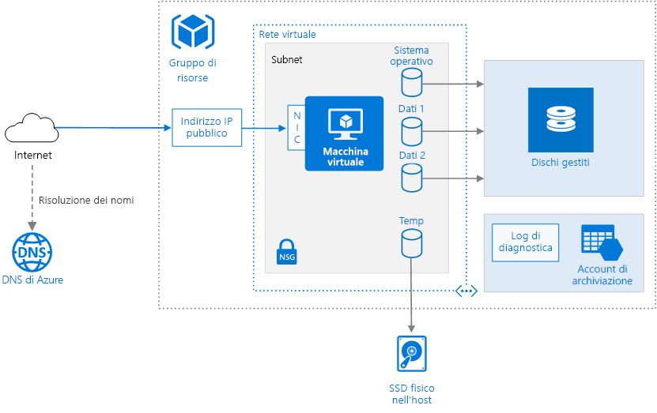

# <a name="run-a-windows-virtual-machine-on-azure"></a>Eseguire una macchina virtuale Windows in Azure

Il provisioning di una macchina virtuale di Azure richiede componenti aggiuntivi oltre alla macchina virtuale stessa, incluse risorse di rete e di archiviazione. Questo articolo illustra le procedure consigliate per l'esecuzione di una macchina virtuale Windows in Azure.



## <a name="resource-group"></a>Gruppo di risorse

Un [gruppo di risorse][resource-manager-overview] è un contenitore logico di risorse correlate di Azure. È generalmente necessario raggruppare le risorse in base alla loro durata e alle persone che le gestiranno.

Inserire nello stesso [gruppo di risorse][resource-manager-overview] le risorse strettamente associate che condividono lo stesso ciclo di vita. I gruppi di risorse consentono di distribuire e monitorare le risorse come gruppo, tenendo traccia dei costi per ogni gruppo di risorse. È inoltre possibile eliminare un intero set di risorse, operazione molto utile nelle distribuzioni di test. Assegnare nomi di risorsa significativi per semplificare l'individuazione di una risorsa specifica e comprenderne il ruolo. Per altre informazioni, vedere [Convenzioni di denominazione][naming-conventions].

## <a name="virtual-machine"></a>Macchina virtuale

È possibile eseguire il provisioning di una macchina virtuale da un elenco di immagini pubblicate, da un'immagine gestita personalizzata o da un file del disco rigido virtuale (VHD) caricato nell'archivio BLOB di Azure.

Azure offre macchine virtuali di diverse dimensioni. Per altre informazioni, vedere [Dimensioni delle macchine virtuali in Azure][virtual-machine-sizes]. Se si sposta un carico di lavoro esistente in Azure, per iniziare scegliere le dimensioni della VM più simili a quelle dei server locali. Misurare quindi le prestazioni del carico di lavoro effettivo in relazione alla CPU, alla memoria e alle operazioni di input/output al secondo (IOPS) del disco e regolare le dimensioni in base alle necessità.

È in genere consigliabile scegliere l'area di Azure più vicina agli utenti interni o ai clienti. Non tutte le dimensioni di macchina virtuale sono disponibili in tutte le aree. Per altre informazioni, vedere i [servizi disponibili in base all'area][services-by-region]. Per visualizzare un elenco delle dimensioni di macchina virtuale disponibili in un'area specifica, eseguire il comando seguente dall'interfaccia della riga di comando di Azure:

```azurecli
az vm list-sizes --location <location>
```

Per informazioni sulla scelta di un'immagine di macchina virtuale pubblicata, vedere [Come trovare immagini di macchine virtuali Windows][select-vm-image].

## <a name="disks"></a>Dischi

Per ottimizzare le prestazioni I/O del disco, si consiglia di usare [Archiviazione Premium][premium-storage], che archivia i dati in unità SSD (Solid State Drive). I costi dipendono dalla capacità del disco sottoposto a provisioning. Anche IOPS e velocità effettiva dipendono dalle dimensioni del disco. Quando si effettua il provisioning di un disco è quindi consigliabile tenere in considerazione tutti e tre i fattori, ovvero capacità, IOPS e velocità effettiva.

È anche consigliabile usare [Managed Disks][managed-disks]. I dischi gestiti semplificano la gestione dei dischi, gestendo automaticamente le risorse di archiviazione. I dischi gestiti non richiedono un account di archiviazione. È sufficiente specificare le dimensioni e il tipo di disco per distribuirlo come risorsa a disponibilità elevata.

Il disco del sistema operativo è un disco rigido virtuale archiviato in [Archiviazione di Azure][azure-storage], dove viene conservato anche quando il computer host è inattivo. Si consiglia anche di creare uno o più [dischi dati][data-disk], ovvero dischi rigidi virtuali usati per i dati dell'applicazione. Quando possibile, installare applicazioni su un disco dati, anziché sul disco del sistema operativo. Potrebbe essere che alcune applicazioni legacy installino componenti nell'unità C:; In tal caso, è possibile [ridimensionare il disco del sistema operativo] [ resize-os-disk] tramite PowerShell.

La macchina virtuale viene creata con un disco temporaneo, ovvero l'unità `D:` in Windows. Questo disco viene archiviato in un'unità fisica nel computer host. *Non* viene salvato nell'Archiviazione di Azure ed è possibile che venga eliminato durante i riavvii e altri eventi del ciclo di vita della macchina virtuale. Usare questo disco solo per dati temporanei, ad esempio file di paging o di scambio.

## <a name="network"></a>Rete

I componenti di rete includono le risorse seguenti:

- **Rete virtuale**. Ogni macchina virtuale viene distribuita in una rete virtuale che può essere suddivisa in più subnet.

- **Interfaccia di rete (NIC)**. La scheda di interfaccia di rete consente alla VM di comunicare con la rete virtuale. Se sono necessarie più schede di interfaccia di rete per la macchina virtuale, tenere presente che per ogni [dimensione di macchina virtuale][vm-size-tables] è definito un numero massimo di schede.

- **Indirizzo IP pubblico**. Un indirizzo IP pubblico è necessario per comunicare con la VM &mdash;, ad esempio tramite Desktop remoto. L'indirizzo IP pubblico può essere dinamico o statico. Per impostazione predefinita, è dinamico.

- Riservare un [indirizzo IP statico][static-ip] se è necessario un indirizzo IP fisso che non subisca modifiche &mdash; ad esempio se è necessario creare un record "A" nel DNS o se è necessario aggiungere l'indirizzo IP a un elenco di indirizzi attendibili.
- È inoltre possibile creare un nome di dominio completo (FQDN) per l'indirizzo IP. È quindi possibile registrare un [record CNAME][cname-record] nel DNS che punta al nome FQDN. Per altre informazioni, vedere [Creare un nome di dominio completo nel portale di Azure][fqdn].

- **Gruppo di sicurezza di rete**. I [gruppi di sicurezza di rete][nsg] vengono usati per consentire o negare il traffico di rete verso le macchine virtuali. I gruppi di sicurezza di rete possono essere associati a subnet o singole istanze di macchina virtuale.

Tutti i gruppi di sicurezza di rete contengono un set di [regole predefinite][nsg-default-rules], inclusa una regola che blocca tutto il traffico Internet in ingresso. Le regole predefinite non possono essere eliminate, ma altre regole possono eseguirne l'override. Per consentire il traffico Internet, creare regole per indirizzare il traffico in ingresso a determinate porte &mdash; ad esempio la porta 80 per il traffico HTTP. Per abilitare Desktop remoto, aggiungere una regola all'NSG per consentire il traffico in arrivo sulla porta TCP 3389.

## <a name="operations"></a>Operazioni

**Diagnostica**. Abilitare il monitoraggio e la diagnostica, tra cui le metriche di base sull'integrità, i log relativi all'infrastruttura di diagnostica e la [diagnostica di avvio][boot-diagnostics]. La diagnostica di avvio permette di diagnosticare gli errori di avvio quando la VM passa a uno stato non avviabile. Creare un account di archiviazione di Azure per archiviare i log. Un account di archiviazione con ridondanza locale standard è sufficiente per i log di diagnostica. Per altre informazioni, vedere [Abilitare il monitoraggio e la diagnostica][enable-monitoring].

**Disponibilità**. È possibile che la macchina virtuale sia interessata da attività di [manutenzione pianificata][planned-maintenance] o da [tempo di inattività non pianificato][manage-vm-availability]. È possibile usare i [log di riavvio della VM][reboot-logs] per determinare se un riavvio della VM è stato provocato da attività di manutenzione pianificata. Per una disponibilità più elevata, distribuire più macchine virtuali in un [set di disponibilità](/azure/virtual-machines/windows/manage-availability#configure-multiple-virtual-machines-in-an-availability-set-for-redundancy). Questa configurazione offre un [contratto di servizio][vm-sla] di livello più elevato.

**Backup** Per proteggersi da perdite di dati accidentali, usare il servizio [Backup di Azure](/azure/backup/) per eseguire il backup delle macchine virtuali in un archivio con ridondanza geografica. Backup di Azure offre backup coerenti con le applicazioni.

**Arresto di una VM**.  Azure distingue tra gli stati "Arrestato" e "Deallocato". L'addebito avviene quando lo stato della VM viene arrestato, ma non quando la VM viene deallocata. Anche il pulsante **Arresta** nel portale di Azure consente di deallocare la VM. Se l'arresto viene effettuato tramite il sistema operativo ad accesso eseguito, la VM viene arrestata ma **non** deallocata, quindi gli addebiti continueranno a essere effettuati.

**Eliminazione di una VM**.  Se si elimina una VM, i VHD non vengono eliminati. È quindi possibile eliminare in modo sicuro la macchina virtuale senza perdere dati. Verranno tuttavia applicati comunque addebiti per l'archiviazione. Per eliminare il VHD, eliminare il file dall'[archivio BLOB][blob-storage]. Per impedire l'eliminazione accidentale, usare un [blocco di risorsa][resource-lock] per bloccare l'intero gruppo di risorse o le singole risorse, ad esempio una macchina virtuale.

## <a name="security-considerations"></a>Considerazioni relative alla sicurezza

Usare il [Centro sicurezza di Azure][security-center] per ottenere una visualizzazione centrale dello stato di sicurezza delle risorse di Azure. Il Centro sicurezza monitora potenziali problemi di sicurezza e offre un'immagine completa dello stato della sicurezza della distribuzione. Il Centro sicurezza è configurato per ogni sottoscrizione di Azure. Abilitare la raccolta dei dati sulla sicurezza come illustrato nell'articolo relativo all'[onboarding della sottoscrizione di Azure nel Centro sicurezza Standard][security-center-get-started]. Quando la raccolta dei dati è abilitata, il Centro sicurezza analizza automaticamente tutte le macchine virtuali create nell'ambito della sottoscrizione.

**Gestione delle patch**. Se abilitato, Centro sicurezza controlla se mancano aggiornamenti critici e della sicurezza. Usare le [impostazioni di Criteri di gruppo][group-policy] nella VM per abilitare gli aggiornamenti automatici del sistema.

**Antimalware**.  Se abilitato, Centro sicurezza PC controlla se è installato il software antimalware. È inoltre possibile utilizzare Centro sicurezza PC per installare il software antimalware all'interno del portale di Azure.

**Controllo dell'accesso**. Usare il [controllo degli accessi in base al ruolo][rbac] per controllare l'accesso alle risorse di Azure. Il controllo degli accessi in base al ruolo consente di assegnare i ruoli di autorizzazione ai membri del proprio team DevOps. Ad esempio, il ruolo di lettura permette di visualizzare le risorse di Azure, ma non di crearle, gestirle o eliminarle. Alcune autorizzazioni sono specifiche di un tipo di risorsa di Azure. Ad esempio, il ruolo di Collaboratore Macchina virtuale consente di riavviare o deallocare una VM, reimpostare la password di amministratore, creare una nuova VM e così via. Altri [ruoli predefiniti di Controllo degli accessi in base al ruolo][rbac-roles] che potrebbero essere utili per questa architettura includono [Utente DevTest Labs][rbac-devtest] e [Collaboratore Rete][rbac-network]. 

> [!NOTE]
> Il controllo degli accessi in base al ruolo non limita le azioni eseguibili da un utente registrato in una VM. Le autorizzazioni sono determinate dal tipo di account sul sistema operativo guest.

**Log di controllo**. Per verificare le azioni di provisioning e altri eventi della VM, usare i [log di controllo][audit-logs].

**Crittografia dei dati**. Se è necessario crittografare i dischi del sistema operativo e i dischi dati, usare [Crittografia dischi di Azure][disk-encryption].

## <a name="next-steps"></a>Passaggi successivi

- Per eseguire il provisioning di una macchina virtuale Windows, vedere [Creare e gestire macchine virtuali Windows con Azure PowerShell](/azure/virtual-machines/windows/tutorial-manage-vm).
- Per un'architettura a più livelli completa nelle macchine virtuali Windows, vedere [Applicazione a più livelli Windows in Azure con SQL Server](./n-tier-sql-server.md).

<!-- links -->
[audit-logs]: https://azure.microsoft.com/blog/analyze-azure-audit-logs-in-powerbi-more/
[azure-storage]: /azure/storage/storage-introduction
[blob-storage]: /azure/storage/storage-introduction
[boot-diagnostics]: https://azure.microsoft.com/blog/boot-diagnostics-for-virtual-machines-v2/
[cname-record]: https://en.wikipedia.org/wiki/CNAME_record
[data-disk]: /azure/virtual-machines/virtual-machines-windows-about-disks-vhds
[disk-encryption]: /azure/security/azure-security-disk-encryption
[enable-monitoring]: /azure/monitoring-and-diagnostics/insights-how-to-use-diagnostics
[fqdn]: /azure/virtual-machines/virtual-machines-windows-portal-create-fqdn
[group-policy]: /windows-server/administration/windows-server-update-services/deploy/4-configure-group-policy-settings-for-automatic-updates
[manage-vm-availability]: /azure/virtual-machines/virtual-machines-windows-manage-availability
[managed-disks]: /azure/storage/storage-managed-disks-overview
[naming-conventions]: ../../best-practices/naming-conventions.md
[nsg]: /azure/virtual-network/virtual-networks-nsg
[nsg-default-rules]: /azure/virtual-network/virtual-networks-nsg#default-rules
[planned-maintenance]: /azure/virtual-machines/virtual-machines-windows-planned-maintenance
[premium-storage]: /azure/virtual-machines/windows/premium-storage
[rbac]: /azure/active-directory/role-based-access-control-what-is
[rbac-roles]: /azure/active-directory/role-based-access-built-in-roles
[rbac-devtest]: /azure/active-directory/role-based-access-built-in-roles#devtest-labs-user
[rbac-network]: /azure/active-directory/role-based-access-built-in-roles#network-contributor
[reboot-logs]: https://azure.microsoft.com/blog/viewing-vm-reboot-logs/
[resize-os-disk]: /azure/virtual-machines/virtual-machines-windows-expand-os-disk
[resource-lock]: /azure/resource-group-lock-resources
[resource-manager-overview]: /azure/azure-resource-manager/resource-group-overview
[security-center]: /azure/security-center/security-center-intro
[security-center-get-started]: /azure/security-center/security-center-get-started
[select-vm-image]: /azure/virtual-machines/virtual-machines-windows-cli-ps-findimage
[services-by-region]: https://azure.microsoft.com/regions/#services
[static-ip]: /azure/virtual-network/virtual-networks-reserved-public-ip
[virtual-machine-sizes]: /azure/virtual-machines/virtual-machines-windows-sizes
[visio-download]: https://archcenter.blob.core.windows.net/cdn/vm-reference-architectures.vsdx
[vm-size-tables]: /azure/virtual-machines/virtual-machines-windows-sizes
[vm-sla]: https://azure.microsoft.com/support/legal/sla/virtual-machines
