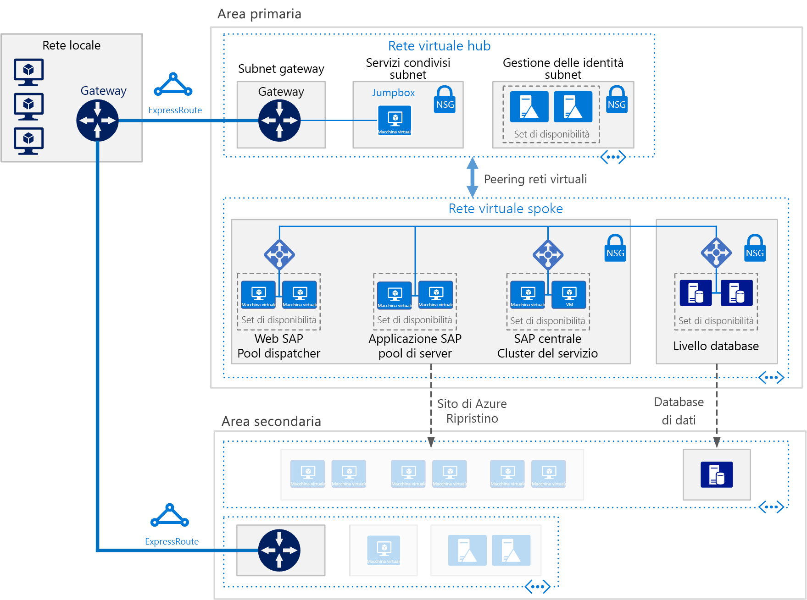

# Distribuire SAP NetWeaver (Windows) per AnyDB in macchine virtuali di Azure

Questa architettura di riferimento mostra un set di procedure consolidate per l'esecuzione di SAP NetWeaver in un ambiente Windows su Azure con disponibilità elevata. Il database è AnyDB, il termine SAP che indica qualsiasi DBMS supportato oltre a SAP HANA. Questa architettura viene distribuita con dimensioni di macchina virtuale (VM) specifiche, che possono essere modificate in base alle esigenze dell'organizzazione.

*Scaricare un [file Visio][visio-download] di questa architettura.*

> [!NOTE] 
> La distribuzione di questa architettura di riferimento richiede una licenza adeguata dei prodotti SAP e altre tecnologie non Microsoft.

## Architettura
L'architettura è costituita dall'infrastruttura e dai principali componenti software seguenti.

**Rete virtuale**. Il servizio Rete virtuale di Azure connette in modo sicuro tra loro le risorse di Azure. In questa architettura la rete virtuale si connette a un ambiente locale tramite un gateway VPN distribuito nell'hub di una topologia [hub-spoke](../hybrid-networking/hub-spoke.md). Lo spoke è la rete virtuale usata per le applicazioni SAP e il livello database.

**Subnet**. La rete virtuale è suddivisa in subnet separate per ogni livello: applicazione (SAP NetWeaver), database, servizi condivisi (il jumpbox) e Active Directory.
    
**Macchine virtuali**. Questa architettura usa macchine virtuali per il livello applicazione e il livello database, raggruppate in questo modo:

- **SAP NetWeaver**. Il livello applicazione usa macchine virtuali Windows ed esegue SAP Central Services e i server applicazioni SAP. Le macchine virtuali che eseguono Central Services sono configurate come ambiente Windows Server Failover Cluster per la disponibilità elevata, supportato da SIOS DataKeeper Cluster Edition.
- **AnyDB**. Il livello database esegue AnyDB come database di origine, ad esempio Microsoft SQL Server, Oracle o IBM DB2.
- **Jumpbox**. Detto anche bastion host. È una macchina virtuale sicura in rete usata dagli amministratori per connettersi alle altre macchine virtuali.
- **Controller di dominio Active Directory di Windows Server**. I controller di dominio vengono usati in tutte le macchine virtuali e tutti gli utenti nel dominio.

**Servizi di bilanciamento del carico**. Le istanze di [Azure Load Balancer](/azure/load-balancer/load-balancer-overview) vengono usate per distribuire il carico alle macchine virtuali nella subnet del livello applicazione. Al livello dati è possibile ottenere la disponibilità elevata usando i servizi di bilanciamento del carico SAP predefiniti, Azure Load Balancer o altri meccanismi, a seconda del sistema di gestione database. Per altre informazioni, vedere [Distribuzione DBMS di Macchine virtuali di Azure per SAP NetWeaver](/azure/virtual-machines/workloads/sap/dbms-guide). 

**Set di disponibilità**. Le macchine virtuali per i ruoli SAP Web Dispatcher, server applicazioni SAP e (A)SCS sono raggruppate in [set di disponibilità](/azure/virtual-machines/windows/tutorial-availability-sets) e viene effettuato il provisioning di almeno due macchine virtuali per ogni ruolo. Questo approccio rende le macchine virtuali idonee per un [contratto di servizio](https://azure.microsoft.com/support/legal/sla/virtual-machines) di livello superiore.

**Schede di rete**. Le [schede di interfaccia di rete](/azure/virtual-network/virtual-network-network-interface) (NIC) permettono tutta la comunicazione delle macchine virtuali in una rete virtuale.

**Gruppi di sicurezza di rete**. Per limitare il traffico in ingresso, in uscita e tra subnet nella rete virtuale, è possibile creare [gruppi di sicurezza di rete](/azure/virtual-network/virtual-networks-nsg).

**Gateway**. Un gateway estende la rete locale alla rete virtuale di Azure. [ExpressRoute](/azure/architecture/reference-architectures/hybrid-networking/expressroute) è il servizio di Azure consigliato per creare connessioni private che non passano attraverso la rete Internet pubblica, ma è possibile usare anche una connessione [da sito a sito](/azure/vpn-gateway/vpn-gateway-howto-site-to-site-resource-manager-portal).

**Archiviazione di Azure**. Per fornire l'archiviazione permanente di un disco rigido virtuale di una macchina virtuale, è necessario usare [Archiviazione di Azure](/azure/storage/storage-standard-storage). Il servizio viene usato anche da [Cloud Witness](/windows-server/failover-clustering/deploy-cloud-witness) per implementare un'operazione del cluster di failover. 

## Consigli
I requisiti della propria organizzazione potrebbero essere diversi da quelli dell'architettura descritta in questo articolo. Usare queste indicazioni come punto di partenza.

### Pool di componenti SAP Web Dispatcher

Il componente Web Dispatcher viene usato come servizio di bilanciamento del carico per il traffico SAP tra i server applicazioni SAP. Per ottenere la disponibilità elevata per il componente Web Dispatcher, viene usato Azure Load Balancer per implementare la configurazione di Web Dispatcher parallela. Web Dispatcher usa una configurazione round robin per la distribuzione del traffico HTTP(S) tra i componenti Web Dispatcher disponibili nel pool di bilanciamento del carico.

Per informazioni dettagliate sull'esecuzione di SAP NetWeaver in macchine virtuali di Azure, vedere [Guida alla pianificazione e all'implementazione di macchine virtuali di Azure per SAP NetWeaver](/azure/virtual-machines/workloads/sap/planning-guide).

### Pool di server applicazioni

Per gestire i gruppi di accesso per i server applicazioni ABAP, viene usata la transazione SMLG. Questa usa la funzione di bilanciamento del carico nel server messaggi di Central Services per distribuire il carico di lavoro nel pool di server applicazioni SAP per le interfacce utente grafiche di SAP e il traffico RFC. La connessione del server applicazioni a Central Services con disponibilità elevata avviene tramite il nome di rete virtuale del cluster.

### Cluster SAP Central Services

Questa architettura di riferimento esegue Central Services in macchine virtuali nel livello applicazione. Central Services è un singolo punto di errore potenziale se distribuito in un'unica macchina virtuale, che è la distribuzione tipica quando la disponibilità elevata non è un requisito. Per implementare una soluzione a disponibilità elevata, è possibile usare un cluster di dischi condivisi o un cluster di condivisioni file.

Per configurare le macchine virtuali per un cluster di dischi condivisi, usare [Windows Server Failover Cluster](https://blogs.sap.com/2018/01/25/how-to-create-sap-resources-in-windows-failover-cluster/). [Cloud Witness](/windows-server/failover-clustering/deploy-cloud-witness) è consigliato come quorum di controllo. Per supportare l'ambiente cluster di failover, [SIOS DataKeeper Cluster Edition](https://azuremarketplace.microsoft.com/marketplace/apps/sios_datakeeper.sios-datakeeper-8) svolge la funzione di volume condiviso del cluster replicando i dischi indipendenti di proprietà dei nodi del cluster. Azure non supporta in modo nativo i dischi condivisi e di conseguenza richiede soluzioni fornite da SIOS.

Per informazioni dettagliate, vedere la sezione sull'aggiornamento importante per i clienti SAP che eseguono ASCS su SIOS in Azure in [Running SAP applications on the Microsoft platform](https://blogs.msdn.microsoft.com/saponsqlserver/2017/05/04/sap-on-azure-general-update-for-customers-partners-april-2017/) (Esecuzione di applicazioni SAP nella piattaforma Microsoft).

Un altro modo di gestire il clustering consiste nell'implementare un cluster di condivisioni file tramite Windows Server Failover Cluster. [SAP](https://blogs.sap.com/2018/03/19/migration-from-a-shared-disk-cluster-to-a-file-share-cluster/) ha di recente modificato il modello di distribuzione di Central Services in modo da permettere l'accesso alle directory globali /sapmnt tramite un percorso UNC. Questa modifica [elimina il requisito](https://blogs.msdn.microsoft.com/saponsqlserver/2017/08/10/high-available-ascs-for-windows-on-file-share-shared-disk-no-longer-required/) relativo a SIOS o ad altre soluzioni con dischi condivisi nelle macchine virtuali di Central Services. È comunque consigliabile assicurarsi che la condivisione UNC /sapmnt abbia [disponibilità elevata](https://blogs.sap.com/2017/07/21/how-to-create-a-high-available-sapmnt-share/). A questo scopo, nell'istanza di Central Services usare Windows Server Failover Cluster con [File server di scalabilità orizzontale](https://blogs.msdn.microsoft.com/saponsqlserver/2017/11/14/file-server-with-sofs-and-s2d-as-an-alternative-to-cluster-shared-disk-for-clustering-of-an-sap-ascs-instance-in-azure-is-generally-available/) e la funzionalità [Storage Spaces Direct](https://blogs.sap.com/2018/03/07/your-sap-on-azure-part-5-ascs-high-availability-with-storage-spaces-direct/) in Windows Server 2016. 

### Set di disponibilità

I set di disponibilità distribuiscono i server in un'infrastruttura fisica diversa e aggiornano i gruppi per migliorare la disponibilità del servizio. Inserire le macchine virtuali che eseguono lo stesso ruolo in un set di disponibilità per prevenire il tempo di inattività causato dalla manutenzione dell'infrastruttura di Azure e soddisfare i [contratti di servizio](https://azure.microsoft.com/support/legal/sla/virtual-machines). Sono consigliate due o più macchine virtuali per ogni set di disponibilità.

Tutte le macchine virtuali in un set devono eseguire lo stesso ruolo. Non inserire server di ruoli diversi nello stesso set di disponibilità. Ad esempio, non inserire un nodo Central Services nello stesso set di disponibilità del server applicazioni.

### Schede di interfaccia di rete

Le tradizionali distribuzioni SAP locali implementano più schede di interfaccia di rete (NIC) per ogni macchina per segregare il traffico amministrativo rispetto al traffico aziendale. In Azure la rete virtuale è una rete software-defined che invia tutto il traffico attraverso la stessa infrastruttura di rete. Di conseguenza, l'uso di più schede di interfaccia di rete non è necessario. Tuttavia, se l'organizzazione deve segregare il traffico, è possibile distribuire più schede di interfaccia di rete per ogni macchina virtuale, connettere ogni scheda di interfaccia di rete a una subnet diversa e quindi usare i gruppi di sicurezza di rete per applicare diversi criteri di controllo di accesso.

### Subnet e gruppi di sicurezza di rete

Questa architettura suddivide lo spazio degli indirizzi delle rete virtuale in subnet. Questa architettura di riferimento è incentrata prevalentemente sulla subnet del livello applicazione. Ogni subnet può essere associata a un gruppo di sicurezza di rete che definisce i criteri di accesso per la subnet. Posizionare i server applicazioni in una subnet separata in modo da proteggerli più facilmente gestendo i criteri di sicurezza della subnet anziché i singoli server.

Quando un gruppo di sicurezza di rete viene associato a una subnet, viene applicato a tutti i server all'interno della subnet. Per altre informazioni sull'uso di gruppi di sicurezza di rete per il controllo granulare dei server in una subnet, vedere [Filtrare il traffico di rete con gruppi di sicurezza di rete](https://azure.microsoft.com/en-us/blog/multiple-vm-nics-and-network-virtual-appliances-in-azure/).

### Servizi di bilanciamento del carico

[SAP Web Dispatcher](https://help.sap.com/doc/saphelp_nw73ehp1/7.31.19/en-US/48/8fe37933114e6fe10000000a421937/frameset.htm) gestisce il bilanciamento del carico del traffico HTTP(S) in un pool di server applicazioni SAP.

Per il traffico proveniente dai client con interfaccia utente grafica SAP che si connettono a un server SAP tramite il protocollo DIAG o Remote Function Call (RFC), il server messaggi Central Services bilancia il carico tramite [gruppi di accesso](https://wiki.scn.sap.com/wiki/display/SI/ABAP+Logon+Group+based+Load+Balancing) del server applicazioni SAP e di conseguenza non è necessario bilanciamento del carico aggiuntivo.

### Archiviazione di Azure

Per tutte le macchine virtuali del server di database, è consigliabile usare Archiviazione Premium di Azure per ottenere una latenza di lettura/scrittura coerente. Per qualsiasi macchina virtuale a istanza singola che usa Archiviazione Premium per tutti i dischi del sistema operativo e i dischi dati, vedere [Contratto di servizio per Macchine virtuali](https://azure.microsoft.com/support/legal/sla/virtual-machines). Inoltre, per i sistemi SAP di produzione è consigliabile usare [Azure Managed Disks](/azure/storage/storage-managed-disks-overview) Premium in tutti i casi. Ai fini dell'affidabilità, viene usato Azure Managed Disks per gestire i file VHD per i dischi. Managed Disks garantisce l'isolamento dei dischi per le macchine virtuali all'interno di un set di disponibilità, in modo da evitare singoli punti di errore.

Per i server applicazioni SAP, tra cui le macchine virtuali di Central Services, è possibile usare Archiviazione Standard di Azure per ridurre i costi, perché l'esecuzione delle applicazioni avviene in memoria e i dischi vengono usati solo per la registrazione. Tuttavia, attualmente Archiviazione Standard è certificato solo per l'archiviazione non gestita. Poiché i server applicazioni non ospitano dati, è possibile usare i dischi di Archiviazione Premium P4 e P6 di dimensioni minori per ridurre i costi.

Archiviazione di Azure viene usato anche da [Cloud Witness](/windows-server/failover-clustering/deploy-cloud-witness) per mantenere il quorum con un dispositivo in un'area di Azure remota lontano dall'area primaria in cui si trova il cluster.

Per l'archivio dati di backup, è consigliabile usare il [livello ad accesso sporadico](/azure/storage/storage-blob-storage-tiers) e il [livello di accesso archivio](/azure/storage/storage-blob-storage-tiers) di Azure per l'archiviazione. Questi livelli di archiviazione sono convenienti per archiviare dati di durata elevata cui si accede meno di frequente.

## Considerazioni sulle prestazioni

I server applicazioni SAP svolgono comunicazioni costanti con i server di database. Per le applicazioni critiche a livello di prestazioni in esecuzione in qualsiasi piattaforma di database, tra cui SAP HANA, provare ad abilitare l'[acceleratore di scrittura](/azure/virtual-machines/linux/how-to-enable-write-accelerator) per migliorare la latenza di scrittura dei log. Per ottimizzare le comunicazioni tra server, usare la [rete accelerata](https://azure.microsoft.com/blog/linux-and-windows-networking-performance-enhancements-accelerated-networking/). Notare che questi acceleratori sono disponibili solo per determinate serie di macchine virtuali.

Per ottenere valori elevati per le operazioni di I/O al secondo e la velocità effettiva della larghezza di banda dei dischi, vengono usate le procedure comuni per l'[ottimizzazione delle prestazioni](/azure/virtual-machines/windows/premium-storage-performance) dei volumi di archiviazione per il layout di archiviazione di Azure. Ad esempio, la combinazione di più dischi per creare un volume di dischi con striping migliora le prestazioni di I/O. L'abilitazione della cache di lettura sul contenuto di archiviazione che viene modificato raramente migliora la velocità di recupero di dati.

Per SAP su SQL, il blog [Top 10 Key Considerations for Deploying SAP Applications on Azure](https://blogs.msdn.microsoft.com/saponsqlserver/2015/05/25/top-10-key-considerations-for-deploying-sap-applications-on-azure/) (10 principali considerazioni per la distribuzione di applicazioni SAP in Azure) offre ottimi consigli per l'ottimizzazione dell'archiviazione di Azure per carichi di lavoro SAP in SQL Server.

## Considerazioni sulla scalabilità

A livello dell'applicazione SAP, Azure offre un'ampia gamma di dimensioni di macchina virtuale per la scalabilità verticale e orizzontale. Per un elenco completo, vedere la [nota SAP 1928533](https://launchpad.support.sap.com/#/notes/1928533) sulle applicazioni SAP in Azure e sui prodotti e i tipi di macchina virtuale di Azure supportati. Per l'accesso, è necessario un account di SAP Service Marketplace. I server applicazioni SAP e i cluster Central Services possono essere ridimensionati aggiungendo più istanze. Il database AnyDB può essere aumentato o ridotto, ma non può essere scalato orizzontalmente. Il contenitore di database SAP per AnyDB non supporta il partizionamento orizzontale.

## Considerazioni sulla disponibilità

La ridondanza delle risorse è il tema generale nelle soluzioni di infrastruttura a disponibilità elevata. Per le organizzazioni che hanno contratti di servizio meno rigorosi, le macchine virtuali di Azure a istanza singola offrono un contratto di servizio per il tempo di attività. Per altre informazioni, vedere [Contratti di servizio di Azure](https://azure.microsoft.com/support/legal/sla/).

In questa installazione distribuita dell'applicazione SAP l'installazione di base viene replicata per ottenere la disponibilità elevata. Per ogni livello dell'architettura, la progettazione a disponibilità elevata varia.

### Livello applicazione

La disponibilità elevata per SAP Web Dispatcher viene ottenuta con istanze ridondanti. Vedere [SAP Web Dispatcher](https://help.sap.com/doc/saphelp_nw70ehp2/7.02.16/en-us/48/8fe37933114e6fe10000000a421937/frameset.htm) nella documentazione di SAP.

La disponibilità elevata di Central Services viene implementata con Windows Server Failover Cluster. Se distribuita in Azure, l'archiviazione cluster per il cluster di failover può essere configurata usando due approcci: un volume condiviso in cluster o una condivisione file.

Poiché i dischi condivisi non sono possibili in Azure, viene usato SIOS Datakeeper per replicare il contenuto dei dischi indipendenti collegati ai nodi del cluster e per astrarre le unità come volume condiviso del cluster per la gestione dei cluster. Per informazioni dettagliate sull'implementazione, vedere [Clustering SAP ASCS in Azure](https://blogs.msdn.microsoft.com/saponsqlserver/2015/05/20/clustering-sap-ascs-instance-using-windows-server-failover-cluster-on-microsoft-azure-with-sios-datakeeper-and-azure-internal-load-balancer/) (Clustering di SAP ASCS in Azure).

Un'altra opzione consiste nell'usare una condivisione file distribuita tramite [File server di scalabilità orizzontale](https://blogs.msdn.microsoft.com/saponsqlserver/2017/11/14/file-server-with-sofs-and-s2d-as-an-alternative-to-cluster-shared-disk-for-clustering-of-an-sap-ascs-instance-in-azure-is-generally-available/). La funzionalità File server di scalabilità orizzontale offre condivisioni file resilienti che è possibile usare come volume condiviso del cluster per il cluster di Windows. Un cluster File server di scalabilità orizzontale può essere condiviso tra più nodi Central Services. Al momento della redazione di questo articolo, la funzionalità File server di scalabilità orizzontale viene usata solo per una progettazione a disponibilità elevata, perché il cluster File server di scalabilità orizzontale non si estende tra aree per fornire supporto per il ripristino di emergenza.

La disponibilità elevata per i server applicazioni SAP viene ottenuta bilanciando il carico del traffico all'interno di un pool di server applicazioni.
Vedere [Configurazioni e certificazioni SAP in esecuzione su Microsoft Azure](/azure/virtual-machines/workloads/sap/sap-certifications).

### Livello database

Questa architettura di riferimento presuppone che il database di origine venga eseguito in AnyDB, ovvero un DBMS come SQL Server, SAP ASE, IBM DB2 o Oracle. La funzionalità di replica nativa del livello database offre failover manuale o automatico tra i nodi replicati.

Per informazioni di implementazione dettagliate per sistemi di database specifici, vedere [Distribuzione DBMS di Macchine virtuali di Azure per SAP NetWeaver](/azure/virtual-machines/workloads/sap/dbms-guide).

## Considerazioni sul ripristino di emergenza

Per il ripristino di emergenza, è necessario essere in grado di eseguire il failover in un'area secondaria. Ogni livello usa una strategia diversa per fornire una protezione con ripristino di emergenza.

- **Livello server applicazioni**. I server applicazioni SAP non contengono dati aziendali. In Azure, una semplice strategia di ripristino di emergenza consiste nel creare server applicazioni SAP nell'area secondaria e quindi arrestarli. In caso di modifiche di configurazione o aggiornamenti del kernel nel server applicazioni primario, le stesse modifiche devono essere copiate nelle macchine virtuali nell'area secondaria. Ad esempio, gli eseguibili del kernel copiati nelle macchine virtuali di ripristino di emergenza. Per la replica automatica dei server applicazioni in un'area secondaria, la soluzione consigliata è [Azure Site Recovery](/azure/site-recovery/site-recovery-overview).

- **Central Services**. Anche questo componente dello stack di applicazioni SAP non salva in modo permanente i dati aziendali. È possibile compilare una macchina virtuale nell'area di ripristino di emergenza per eseguire il ruolo Central Services. L'unico contenuto dal nodo Central Services primario per la sincronizzazione è il contenuto della condivisione /sapmnt. Inoltre, se le modifiche di configurazione o gli aggiornamenti del kernel avvengono nei server Central Services primari, devono essere ripetuti nella macchina virtuale nell'area di ripristino di emergenza che esegue Central Services. Per sincronizzare i due server, è possibile usare Azure Site Recovery per replicare i nodi del cluster oppure è sufficiente usare un processo di copia pianificato regolarmente per copiare /sapmnt nell'area di ripristino di emergenza. Per informazioni dettagliate sul processo di failover di compilazione, copia e test di questo semplice metodo di replica, scaricare [SAP NetWeaver: Building a Hyper-V and Microsoft Azure–based Disaster Recovery Solution](https://download.microsoft.com/download/9/5/6/956FEDC3-702D-4EFB-A7D3-2DB7505566B6/SAP%20NetWeaver%20-%20Building%20an%20Azure%20based%20Disaster%20Recovery%20Solution%20V1_5%20.docx) (SAP NetWeaver: Compilazione di una soluzione di ripristino di emergenza basata su Hyper-V e Microsoft) e fare riferimento alla sezione "4.3. Livello di SPOF SAP (ASCS)."

- **Livello database**. Il ripristino di emergenza viene implementato in modo ottimale con la tecnologia di replica integrata propria del database. Nel caso di SQL Server, ad esempio, è consigliabile usare un gruppo di disponibilità AlwaysOn per definire una replica in un'area remota, replicando le transazioni in modo asincrono con il failover manuale. La replica asincrona non influisce sulle prestazioni dei carichi di lavoro interattivi nel sito primario. Il failover manuale permette a un utente di valutare l'impatto del ripristino di emergenza e scegliere se è giustificato operare dal sito di ripristino di emergenza.

Per usare Azure Site Recovery in modo da compilare automaticamente un sito di produzione completamente replicato del sito originale, è necessario eseguire [script di distribuzione](/azure/site-recovery/site-recovery-runbook-automation) personalizzati. Site Recovery distribuisce prima di tutto le macchine virtuali nei set di disponibilità e quindi esegue gli script per aggiungere risorse, come i servizi di bilanciamento del carico.

## Considerazioni sulla gestibilità

Azure offre diverse funzioni per [monitoraggio e diagnostica](/azure/architecture/best-practices/monitoring) dell'infrastruttura complessiva. Inoltre, il monitoraggio avanzato delle macchine virtuali di Azure viene gestito da Azure Operations Management Suite (OMS).

Per fornire il monitoraggio basato su SAP delle risorse e delle prestazioni del servizio dell'infrastruttura SAP, viene usata l'estensione [Azure Enhanced Monitoring SAP](/azure/virtual-machines/workloads/sap/deployment-guide#detailed-tasks-for-sap-software-deployment). Questa estensione aumenta le statistiche di monitoraggio nell'applicazione SAP per il monitoraggio del sistema operativo e le funzioni del Pannello di controllo DBA.

## Considerazioni relative alla sicurezza

SAP dispone del proprio motore di gestione di utenti (UME) per controllare l'accesso basato sui ruoli e l'autorizzazione all'interno dell'applicazione SAP. Per informazioni dettagliate, vedere [SAP NetWeaver Application Server for ABAP Security Guide](https://help.sap.com/doc/7b932ef4728810148a4b1a83b0e91070/1610 001/en-US/frameset.htm?4dde53b3e9142e51e10000000a42189c.html) (Guida alla sicurezza del server applicazioni SAP NetWeaver per ABAP) e [SAP NetWeaver Application Server Java Security Guide](https://help.sap.com/doc/saphelp_snc_uiaddon_10/1.0/en-US/57/d8bfcf38f66f48b95ce1f52b3f5184/frameset.htm) (Guida alla sicurezza in Java del server applicazioni SAP NetWeaver).

Per ottenere sicurezza di rete aggiuntiva, valutare se implementare una [rete perimetrale](../dmz/secure-vnet-hybrid.md), che usa un'appliance di rete virtuale per creare un firewall davanti alla subnet per Web Dispatcher.

Per la sicurezza dell'infrastruttura, vengono crittografati sia i dati in transito sia quelli inattivi. La sezione "Considerazioni relative alla sicurezza" di [Guida alla pianificazione e all'implementazione di macchine virtuali di Azure per SAP NetWeaver](/azure/virtual-machines/workloads/sap/planning-guide) presenta alcune informazioni iniziali per soddisfare la sicurezza di rete. La guida specifica anche le porte di rete che devono essere aperte sui firewall per consentire la comunicazione dell'applicazione.

Per crittografare dischi di macchine virtuali di Azure, è possibile usare [Crittografia dischi di Azure](/azure/security/azure-security-disk-encryption). Questo servizio usa la funzionalità BitLocker di Windows per fornire la crittografia del volume per i dischi dati e del sistema operativo. La soluzione può essere usata anche con Azure Key Vault per semplificare il controllo e la gestione dei segreti e delle chiavi di crittografia dei dischi nella sottoscrizione dell'insieme di credenziali delle chiavi. I dati nei dischi delle macchine virtuali vengano crittografati quando inattivi in Archiviazione di Azure.

## Community

Le community possono rispondere alle domande ed essere utili per configurare correttamente la distribuzione. Valutare gli aspetti seguenti:

- Blog [Running SAP Applications on the Microsoft Platform](https://blogs.msdn.microsoft.com/saponsqlserver/2017/05/04/sap-on-azure-general-update-for-customers-partners-april-2017/) (Esecuzione di applicazioni SAP nella piattaforma Microsoft)
- [Supporto della community di Azure](https://azure.microsoft.com/support/community/)
- [Community SAP](https://www.sap.com/community.html)
- [Stack Overflow](https://stackoverflow.com/tags/sap/)

[visio-download]: https://archcenter.blob.core.windows.net/cdn/sap-reference-architectures.vsdx
