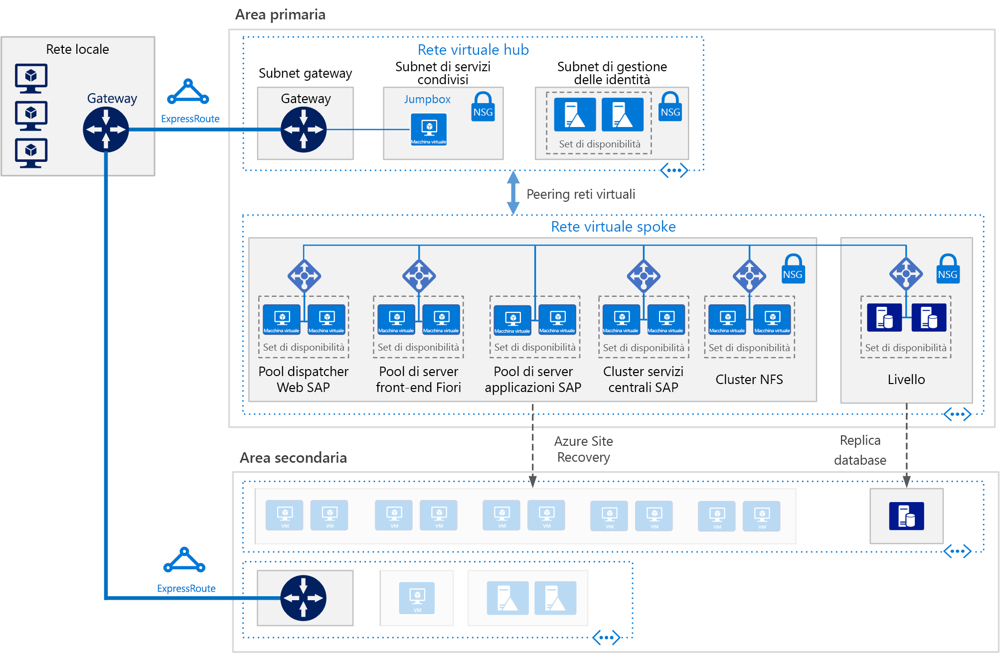

# SAP S/4HANA per le macchine virtuali Linux in AzureSAP S/4HANA for Linux virtual machines on Azure

Questa architettura di riferimento mostra un set di procedure consolidate per l'esecuzione di S/4HANA in un ambiente a disponibilità elevata che supporta il ripristino di emergenza in Azure.This reference architecture shows a set of proven practices for running S/4HANA in a high availability environment that supports disaster recovery on Azure. Questa architettura viene distribuita con dimensioni di macchina virtuale (VM) specifiche, che possono essere modificate in base alle esigenze dell'organizzazione.This architecture is deployed with specific virtual machine (VM) sizes that can be changed to accommodate your organization's needs.

*Scaricare un [file Visio][visio-download] di questa architettura.**Download a [Visio file][visio-download] of this architecture.*

> [!NOTE]
> La distribuzione di questa architettura di riferimento richiede una licenza adeguata dei prodotti SAP e altre tecnologie non Microsoft.Deploying this reference architecture requires appropriate licensing of SAP products and other non-Microsoft technologies.

## ArchitetturaArchitecture

Questa architettura di riferimento descrive un sistema di produzione di livello aziendale.This reference architecture describes a enterprise-grade, production-level system. Questa configurazione può essere ridotta a una singola macchina virtuale in base alle esigenze aziendali.To suit your business needs, this configuration can be reduced to a single virtual machine. Sono tuttavia necessari i componenti seguenti:However, the following components are required:

**Rete virtuale**.**Virtual network**. Il servizio [Rete virtuale di Azure](/azure/virtual-network/virtual-networks-overview) connette in modo sicuro tra loro le risorse di Azure.The [Azure Virtual Network](/azure/virtual-network/virtual-networks-overview) service securely connects Azure resources to each other. In questa architettura la rete virtuale si connette a un ambiente locale tramite un gateway distribuito nell'hub di una [topologia hub-spoke](../hybrid-networking/hub-spoke.md).In this architecture, the virtual network connects to an on-premises environment through a gateway deployed in the hub of a [hub-spoke topology](../hybrid-networking/hub-spoke.md). Lo spoke è la rete virtuale usata per le applicazioni SAP.The spoke is the virtual network used for the SAP applications.

**Subnet**.**Subnets**. La rete virtuale è suddivisa in [subnet](/azure/virtual-network/virtual-network-manage-subnet) separate per ogni livello: gateway, applicazione, database e servizi condivisi.The virtual network is subdivided into separate [subnets](/azure/virtual-network/virtual-network-manage-subnet) for each tier: gateway, application, database, and shared services.

**Macchine virtuali**.**Virtual machines**. Questa architettura usa macchine virtuali che eseguono Linux per il livello applicazione e il livello database, raggruppate in questo modo:This architecture uses virtual machines running Linux for the application tier and database tier, grouped as follows:

- **Livello applicazione**.**Application tier**. Include il pool di server front-end Fiori, il pool di Dispatcher Web SAP, il pool di server applicazioni e il cluster SAP Central Services.Includes the Fiori Front-end Server pool, SAP Web Dispatcher pool, application server pool, and SAP Central Services cluster. Per la disponibilità elevata di Central Services nelle macchine virtuali Linux di Azure, è necessario un servizio NFS (Network File System) a disponibilità elevata.For high availability of Central Services on Azure Linux virtual machines, a highly available Network File System (NFS) service is required.
- **Cluster NFS**.**NFS cluster**. Questa architettura usa un server [NFS](/azure/virtual-machines/workloads/sap/high-availability-guide-suse-nfs) server in esecuzione in un cluster Linux per archiviare i dati condivisi tra sistemi SAP.This architecture uses an [NFS](/azure/virtual-machines/workloads/sap/high-availability-guide-suse-nfs) server running on a Linux cluster to store data shared between SAP systems. Questo cluster centralizzato può essere condiviso tra più sistemi SAP.This centralized cluster can be shared across multiple SAP systems. Per la disponibilità elevata del servizio NFS, viene usata l'estensione a disponibilità elevata appropriata per la distribuzione Linux selezionata.For high availability of the NFS service, the appropriate High Availability Extension for the selected Linux distribution is used.
- **SAP HANA**.**SAP HANA**. Il livello database usa due o più macchine virtuali Linux in un cluster per ottenere la disponibilità elevata.The database tier uses two or more Linux virtual machines in a cluster to achieve high availability. La replica di sistema HANA (HSR) viene usata per replicare il contenuto tra i sistemi HANA primari e secondari.HANA System Replication (HSR) is used to replicate contents between primary and secondary HANA systems. Il clustering Linux viene usato per rilevare gli errori di sistema e semplificare il failover automatico.Linux clustering is used to detect system failures and facilitate automatic failover. È possibile usare un meccanismo di isolamento basato su cloud o archiviazione per assicurarsi che il sistema con errori venga isolato o arrestato per evitare la condizione split-brain del cluster.A storage-based or cloud-based fencing mechanism can be used to ensure the failed system is isolated or shut down to avoid the cluster split-brain condition.
- **Jumpbox**.**Jumpbox**. Detto anche bastion host.Also called a bastion host. È una macchina virtuale sicura in rete usata dagli amministratori per connettersi alle altre macchine virtuali.This is a secure virtual machine on the network that administrators use to connect to the other virtual machines. Può eseguire Windows o Linux.It can run Windows or Linux. Usare Windows jumpbox per semplificare l'esplorazione Web quando si usano gli strumenti di gestione HANA Cockpit o HANA Studio.Use a Windows jumpbox for web browsing convenience when using HANA Cockpit or HANA Studio management tools.

**Servizi di bilanciamento del carico**.**Load balancers**. Per ottenere disponibilità elevata, vengono usati sia servizi di bilanciamento del carico SAP sia [Azure Load Balancer](/azure/load-balancer/load-balancer-overview).Both built-in SAP load balancers and [Azure Load Balancer](/azure/load-balancer/load-balancer-overview) are used to achieve HA. Le istanze di Azure Load Balancer vengono usate per distribuire il carico alle macchine virtuali nella subnet del livello applicazione.Azure Load Balancer instances are used to distribute traffic to virtual machines in the application tier subnet.

**Set di disponibilità**.**Availability sets**. Le macchine virtuali per tutti i pool e u cluster (Web Dispatcher, server applicazioni SAP, Central Services, NFS e HANA) sono raggruppate in [set di disponibilità](/azure/virtual-machines/windows/tutorial-availability-sets), e viene effettuato il provisioning di almeno due macchine virtuali per ogni ruolo.Virtual machines for all pools and clusters (Web Dispatcher, SAP application servers, Central Services, NFS, and HANA) are grouped into separate [availability sets](/azure/virtual-machines/windows/tutorial-availability-sets), and at least two virtual machines are provisioned per role. Questo approccio rende le macchine virtuali idonee per un [contratto di servizio](https://azure.microsoft.com/support/legal/sla/virtual-machines) di livello superiore.This makes the virtual machines eligible for a higher [service level agreement](https://azure.microsoft.com/support/legal/sla/virtual-machines) (SLA).

**Schede di rete**.**NICs**. Le [schede di interfaccia di rete](/azure/virtual-network/virtual-network-network-interface) (NIC) permettono tutta la comunicazione delle macchine virtuali in una rete virtuale.[Network interface cards](/azure/virtual-network/virtual-network-network-interface) (NICs) enable all communication of virtual machines on a virtual network.

**Gruppi di sicurezza di rete**.**Network security groups**. Per limitare il traffico in ingresso, in uscita e tra subnet nella rete virtuale, vengono usati i [gruppi di sicurezza di rete](/azure/virtual-network/virtual-networks-nsg).To restrict incoming, outgoing, and intra-subnet traffic in the virtual network, [network security groups](/azure/virtual-network/virtual-networks-nsg) (NSGs) are used.

**Gateway**.**Gateway**. Un gateway estende la rete locale alla rete virtuale di Azure.A gateway extends your on-premises network to the Azure virtual network. [ExpressRoute](/azure/architecture/reference-architectures/hybrid-networking/expressroute) è il servizio di Azure consigliato per creare connessioni private che non passano attraverso la rete Internet pubblica, ma è possibile usare anche una connessione [da sito a sito](/azure/vpn-gateway/vpn-gateway-howto-site-to-site-resource-manager-portal).[ExpressRoute](/azure/architecture/reference-architectures/hybrid-networking/expressroute) is the recommended Azure service for creating private connections that do not go over the public Internet, but a [Site-to-Site](/azure/vpn-gateway/vpn-gateway-howto-site-to-site-resource-manager-portal) connection can also be used.

**Archiviazione di Azure**.**Azure Storage**. Per fornire l'archiviazione permanente di un disco rigido virtuale di una macchina virtuale, è necessario usare [Archiviazione di Azure](/azure/storage/).To provide persistent storage of a virtual machine's virtual hard disk (VHD), [Azure Storage](/azure/storage/) is required.

## ConsigliRecommendations

Questa architettura descrive una distribuzione aziendale di piccole dimensioni a livello di produzione.This architecture describes a small production-level enterprise deployment. La distribuzione varia in base ai requisiti aziendali.Your deployment will differ based on your business requirements. Usare queste indicazioni come punto di partenza.Use these recommendations as a starting point.

### Macchine virtualiVirtual machines

Nei pool di server applicazioni e nei cluster regolare il numero di macchine virtuali in base ai requisiti specifici.In application server pools and clusters, adjust the number of virtual machines based on your requirements. La [guida alla pianificazione e all'implementazione di macchine virtuali di Azure](/azure/virtual-machines/workloads/sap/planning-guide) include informazioni dettagliate sull'esecuzione di SAP NetWeaver in macchine virtuali, ma le informazioni si applicano anche a SAP S/4HANA.The [Azure Virtual Machines planning and implementation guide](/azure/virtual-machines/workloads/sap/planning-guide) includes details about running SAP NetWeaver on virtual machines, but the information applies to SAP S/4HANA as well.

Per informazioni dettagliate sul supporto SAP per i tipi di macchine virtuali di Azure e le metriche di elaborazione (SAPS), vedere la [nota SAP 1928533](https://launchpad.support.sap.com/#/notes/1928533).For details about SAP support for Azure virtual machine types and throughput metrics (SAPS), see [SAP Note 1928533](https://launchpad.support.sap.com/#/notes/1928533).

### Pool di componenti SAP Web DispatcherSAP Web Dispatcher pool

Il componente Web Dispatcher viene usato come servizio di bilanciamento del carico per il traffico SAP tra i server applicazioni SAP.The Web Dispatcher component is used as a load balancer for SAP traffic among the SAP application servers. Per ottenere la disponibilità elevata per il componente Web Dispatcher, viene usato Azure Load Balancer per implementare la configurazione di Web Dispatcher parallela in una configurazione round robin per la distribuzione del traffico HTTP(S) tra i componenti Web Dispatcher disponibili nel pool back-end di bilanciamento del carico.To achieve high availability for the Web Dispatcher component, Azure Load Balancer is used to implement the parallel Web Dispatcher setup in a round-robin configuration for HTTP(S) traffic distribution among the available Web Dispatchers in the balancers back-end pool.

### Server front-end FioriFiori Front-end Server

Il server front-end Fiori usa un [gateway NetWeaver](https://help.sap.com/doc/saphelp_gateway20sp12/2.0/en-US/76/08828d832e4aa78748e9f82204a864/content.htm?no_cache=true).The Fiori Front-end Server uses a [NetWeaver Gateway](https://help.sap.com/doc/saphelp_gateway20sp12/2.0/en-US/76/08828d832e4aa78748e9f82204a864/content.htm?no_cache=true). Per distribuzioni di piccole dimensioni può essere caricato nel server Fiori.For small deployments, it can be loaded on the Fiori server. Per distribuzioni di grandi dimensioni è possibile distribuire un server separato per il gateway NetWeaver prima del pool di server front-end Fiori.For large deployments, a separate server for the NetWeaver Gateway may be deployed in front of the Fiori Front-end Server pool.

### Pool di server applicazioniApplication servers pool

Per gestire i gruppi di accesso per i server applicazioni ABAP, viene usata la transazione SMLG.To manage logon groups for ABAP application servers, the SMLG transaction is used. Questa usa la funzione di bilanciamento del carico nel server messaggi di Central Services per distribuire il carico di lavoro nel pool di server applicazioni SAP per le interfacce utente grafiche di SAP e il traffico RFC.It uses the load balancing function within the message server of the Central Services to distribute workload among SAP application servers pool for SAPGUIs and RFC traffic. La connessione del server applicazioni a Central Services con disponibilità elevata avviene tramite il nome di rete virtuale del cluster.The application server connection to the highly available Central Services is through the cluster virtual network name. In questo modo si evita la necessità di modificare il profilo del server applicazioni per la connettività di Central Services dopo un failover locale.This avoids the need to change the application server profile for Central Services connectivity after a local failover.

### Cluster SAP Central ServicesSAP Central Services cluster

Central Services può essere distribuito in una singola macchina virtuale quando la disponibilità elevata non è un requisito.Central Services can be deployed to a single virtual machine when high availability is not a requirement. Tuttavia, la singola macchina virtuale diventa un singolo punto di errore potenziale per l'ambiente SAP.However, the single virtual machine becomes a potential single point of failure (SPOF) for the SAP environment. Per una distribuzione di Central Services a disponibilità elevata, vengono usati un cluster NFS a disponibilità elevata e un cluster Central Services a disponibilità elevata.For a highly available Central Services deployment, a highly available NFS cluster and a highly available Central Services cluster are used.

### Cluster NFSNFS cluster

DRBD (Distributed replicati blocco dispositivo) viene usato per la replica tra i nodi del cluster NFS.DRBD (Distributed Replicated Block Device) is used for replication between the nodes of the NFS cluster.

### Set di disponibilitàAvailability sets

I set di disponibilità distribuiscono i server in un'infrastruttura fisica diversa e aggiornano i gruppi per migliorare la disponibilità del servizio.Availability sets distribute servers to different physical infrastructure and update groups to improve service availability. Inserire le macchine virtuali che eseguono lo stesso ruolo in un set di disponibilità per prevenire il tempo di inattività causato dalla manutenzione dell'infrastruttura di Azure e soddisfare i [contratti di servizio](https://azure.microsoft.com/support/legal/sla/virtual-machines).Put virtual machines that perform the same role into an availability sets to help guard against downtime caused by Azure infrastructure maintenance and to meet [SLAs](https://azure.microsoft.com/support/legal/sla/virtual-machines). Sono consigliate due o più macchine virtuali per ogni set di disponibilità.Two or more virtual machines per availability set is recommended.

Tutte le macchine virtuali in un set devono eseguire lo stesso ruolo.All virtual machines in a set must perform the same role. Non inserire server di ruoli diversi nello stesso set di disponibilità.Do not mix servers of different roles in the same availability set. Ad esempio, non inserire un nodo ASCS nello stesso set di disponibilità del server applicazioni.For example, don't place a ASCS node in the same availability set with the application server.

### Schede di interfaccia di reteNICs

I tradizionali panorami applicativi SAP locali implementano più schede di interfaccia di rete (NIC) per ogni macchina per segregare il traffico amministrativo rispetto al traffico aziendale.Traditional on-premises SAP landscapes implement multiple network interface cards (NICs) per machine to segregate administrative traffic from business traffic. In Azure la rete virtuale è una rete software-defined che invia tutto il traffico attraverso la stessa infrastruttura di rete.On Azure, the virtual network is a software-defined network that sends all traffic through the same network fabric. Di conseguenza, l'uso di più schede di interfaccia di rete non è necessario.Therefore, the use of multiple NICs is unnecessary. Tuttavia, se l'organizzazione deve segregare il traffico, è possibile distribuire più schede di interfaccia di rete per ogni macchina virtuale, connettere ogni scheda di interfaccia di rete a una subnet diversa e quindi usare i gruppi di sicurezza di rete per applicare diversi criteri di controllo di accesso.However, if your organization needs to segregate traffic, you can deploy multiple NICs per VM, connect each NIC to a different subnet, and then use NSGs to enforce different access control policies.

### Subnet e gruppi di sicurezza di reteSubnets and NSGs

Questa architettura suddivide lo spazio degli indirizzi delle rete virtuale in subnet.This architecture subdivides the virtual network address space into subnets. Ogni subnet può essere associata a un gruppo di sicurezza di rete che definisce i criteri di accesso per la subnet.Each subnet can be associated with a NSG that defines the access policies for the subnet. Posizionare i server applicazioni in una subnet separata in modo da proteggerli più facilmente gestendo i criteri di sicurezza della subnet anziché i singoli server.Place application servers on a separate subnet so you can secure them more easily by managing the subnet security policies, not the individual servers.

Quando un gruppo di sicurezza di rete viene associato a una subnet, viene applicato a tutti i server all'interno della subnet.When a NSG is associated with a subnet, it then applies to all the servers within the subnet. Per altre informazioni sull'uso di gruppi di sicurezza di rete per il controllo granulare dei server in una subnet, vedere [Filtrare il traffico di rete con gruppi di sicurezza di rete](https://azure.microsoft.com/blog/multiple-vm-nics-and-network-virtual-appliances-in-azure/).For more information about using NSGs for fine-grained control over the servers in a subnet, see [Filter network traffic with network security groups](https://azure.microsoft.com/blog/multiple-vm-nics-and-network-virtual-appliances-in-azure/).

Vedere anche [Pianificazione e progettazione per il gateway VPN](/azure/vpn-gateway/vpn-gateway-plan-design).See also [Planning and design for VPN Gateway](/azure/vpn-gateway/vpn-gateway-plan-design).

### Servizi di bilanciamento del caricoLoad balancers

[SAP Web Dispatcher](https://help.sap.com/doc/saphelp_nw73ehp1/7.31.19/en-US/48/8fe37933114e6fe10000000a421937/frameset.htm) gestisce il bilanciamento del carico del traffico HTTP(S) comprese le applicazioni tipo Fiori in un pool di server applicazioni SAP.[SAP Web Dispatcher](https://help.sap.com/doc/saphelp_nw73ehp1/7.31.19/en-US/48/8fe37933114e6fe10000000a421937/frameset.htm) handles load balancing of HTTP(S) traffic including Fiori style applications to a pool of SAP application servers.

Per il traffico proveniente dai client con interfaccia utente grafica SAP che si connettono a un server SAP tramite il protocollo DIAG o Remote Function Call (RFC), il server messaggi Central Services bilancia il carico tramite [gruppi di accesso](https://wiki.scn.sap.com/wiki/display/SI/ABAP+Logon+Group+based+Load+Balancing) del server applicazioni SAP e di conseguenza non è necessario bilanciamento del carico aggiuntivo.For traffic from SAP GUI clients connecting a SAP server via DIAG or Remote Function Calls (RFC), the Central Service message server balances the load through SAP application server [logon groups](https://wiki.scn.sap.com/wiki/display/SI/ABAP+Logon+Group+based+Load+Balancing), so no additional load balancer is needed.

### Archiviazione di AzureAzure Storage

È consigliabile usare Archiviazione Premium di Azure per le macchine virtuali del server di database.We recommend using Azure Premium Storage for the database server virtual machines. Archiviazione Premium offre una latenza di lettura/scrittura coerente.Premium storage provides consistent read/write latency. Per informazioni dettagliate sull'uso di Archiviazione Premium per i dischi del sistema operativo e i dischi dati di una macchina virtuale a istanza singola, vedere [Contratto di servizio per Macchine virtuali](https://azure.microsoft.com/support/legal/sla/virtual-machines/).For details about using Premium Storage for the operating system disks and data disks of a single-instance virtual machine, see [SLA for Virtual Machines](https://azure.microsoft.com/support/legal/sla/virtual-machines/).

Per tutti i sistemi SAP di produzione è consigliabile usare [Azure Managed Disks](/azure/storage/storage-managed-disks-overview) Premium.For all production SAP systems, we recommend using Premium [Azure Managed Disks](/azure/storage/storage-managed-disks-overview). Managed Disks viene usato per gestire i file VHD per i dischi ai fini dell'affidabilità.Managed Disks are used to manage the VHD files for the disks, adding reliability. Garantisce inoltre l'isolamento dei dischi per le macchine virtuali all'interno di un set di disponibilità, in modo da evitare singoli punti di errore.They also ensure that the disks for virtual machines within an availability set are isolated to avoid single points of failure.

Per i server applicazioni SAP, tra cui le macchine virtuali di Central Services, è possibile usare Archiviazione Standard di Azure per ridurre i costi, perché l'esecuzione delle applicazioni avviene in memoria e i dischi vengono usati solo per la registrazione.For SAP application servers, including the Central Services virtual machines, you can use Azure Standard Storage to reduce cost, because application execution takes place in memory and uses disks for logging only. Tuttavia, attualmente Archiviazione Standard è certificato solo per l'archiviazione non gestita.However, at this time, Standard Storage is only certified for unmanaged storage. Poiché i server applicazioni non ospitano dati, è possibile usare i dischi di Archiviazione Premium P4 e P6 di dimensioni minori per ridurre i costi.Since application servers do not host any data, you can also use the smaller P4 and P6 Premium Storage disks to help minimize cost.

Per l'archivio dati di backup, è consigliabile usare il [livello ad accesso sporadico e il livello di accesso archivio di Azure per l'archiviazione](/azure/storage/storage-blob-storage-tiers).For the backup data store, we recommend using Azure [cool access tier storage and/or archive access tier storage](/azure/storage/storage-blob-storage-tiers). Questi livelli di archiviazione sono convenienti per archiviare dati di durata elevata cui si accede meno di frequente.These storage tiers are cost-effective ways to store long-lived data that is less frequently accessed.

## Considerazioni sulle prestazioniPerformance considerations

I server applicazioni SAP svolgono comunicazioni costanti con i server di database.SAP application servers carry on constant communications with the database servers. Per le macchine virtuali del database HANA provare ad abilitare l'[acceleratore di scrittura](/azure/virtual-machines/linux/how-to-enable-write-accelerator) per migliorare la latenza di scrittura dei log.For the HANA database virtual machines, consider enabling [Write Accelerator](/azure/virtual-machines/linux/how-to-enable-write-accelerator) to improve log write latency. Per ottimizzare le comunicazioni tra server, usare la [rete accelerata](https://azure.microsoft.com/blog/linux-and-windows-networking-performance-enhancements-accelerated-networking/).To optimize inter-server communications, use the [Accelerated Network](https://azure.microsoft.com/blog/linux-and-windows-networking-performance-enhancements-accelerated-networking/). Notare che questi acceleratori sono disponibili solo per determinate serie di macchine virtuali.Note that these accelerators are available only for certain VM series.

Per ottenere valori elevati per le operazioni di I/O al secondo e la velocità effettiva della larghezza di banda dei dischi, vengono usate le procedure comuni per l'[ottimizzazione delle prestazioni](/azure/virtual-machines/linux/premium-storage-performance) dei volumi di archiviazione per il layout di archiviazione di Azure.To achieve high IOPS and disk bandwidth throughput, the common practices in storage volume [performance optimization](/azure/virtual-machines/linux/premium-storage-performance) apply to Azure storage layout. Ad esempio, la combinazione di più dischi per creare un volume di dischi con striping migliora le prestazioni di I/O.For example, combining multiple disks together to create a striped disk volume improves IO performance. L'abilitazione della cache di lettura sul contenuto di archiviazione che viene modificato raramente migliora la velocità di recupero di dati.Enabling the read cache on storage content that changes infrequently enhances the speed of data retrieval. Per informazioni dettagliate sui requisiti delle prestazioni, vedere [SAP note 1943937 - Hardware Configuration Check Tool](https://launchpad.support.sap.com/#/notes/1943937) (Nota SAP 1943937 - Strumento di controllo della configurazione dell'hardware). Per l'accesso, è necessario un account di SAP Service Marketplace.For details about performance requirements, see [SAP note 1943937 - Hardware Configuration Check Tool](https://launchpad.support.sap.com/#/notes/1943937) (SAP Service Marketplace account required for access).

## Considerazioni sulla scalabilitàScalability considerations

A livello dell'applicazione SAP, Azure offre un'ampia gamma di dimensioni di macchina virtuale per la scalabilità verticale e orizzontale. Per altre informazioni, consultare la [Nota SAP 1928533](https://launchpad.support.sap.com/#/notes/1928533) - Applicazioni SAP in Azure: prodotti supportati e tipi di macchine virtuali di Azure (per l’accesso è necessario un account di SAP Service Marketplace).At the SAP application layer, Azure offers a wide range of virtual machine sizes for scaling up and scaling out. For an inclusive list, see [SAP Note 1928533](https://launchpad.support.sap.com/#/notes/1928533) - SAP Applications on Azure: Supported Products and Azure VM types (SAP Service Marketplace account required for access). Man mano che vengono certificati più tipi di macchine virtuali, è possibile aumentare o ridurre le prestazioni con la stessa distribuzione cloud.As we continue to certify more virtual machines types, you can scale up or down with the same cloud deployment.

A livello di database questa architettura esegue HANA in macchine virtuali.At the database layer, this architecture runs HANA on VMs. Se il carico di lavoro supera le dimensioni massime delle macchine virtuali, Microsoft offre inoltre [istanze Large di Azure](/azure/virtual-machines/workloads/sap/hana-overview-architecture) per SAP HANA.If your workload exceeds the maximum VM size, Microsoft also offers [Azure Large Instances](/azure/virtual-machines/workloads/sap/hana-overview-architecture) for SAP HANA. Questi server fisici vengono posizionati in un centro dati certificato di Microsoft Azure che fornisce attualmente fino a 20 TB di capacità di memoria per una singola istanza.These physical servers are co-located in a Microsoft Azure certified datacenter and as of this writing, provide up to 20 TB of memory capacity for a single instance. La configurazione a più nodi è anche possibile con una capacità di memoria totale di 60 TB.Multi-node configuration is also possible with a total memory capacity of up to 60 TB.

## Considerazioni sulla disponibilitàAvailability considerations

La ridondanza delle risorse è il tema generale nelle soluzioni di infrastruttura a disponibilità elevata.Resource redundancy is the general theme in highly available infrastructure solutions. Per le organizzazioni che hanno contratti di servizio meno rigorosi, le macchine virtuali di Azure a istanza singola offrono un contratto di servizio per il tempo di attività.For enterprises that have a less stringent SLA, single-instance Azure VMs offer an uptime SLA. Per altre informazioni, vedere [Contratti di servizio di Azure](https://azure.microsoft.com/support/legal/sla/).For more information, see [Azure Service Level Agreement](https://azure.microsoft.com/support/legal/sla/).

In questa installazione distribuita dell'applicazione SAP l'installazione di base viene replicata per ottenere la disponibilità elevata.In this distributed installation of the SAP application, the base installation is replicated to achieve high availability. Per ogni livello dell'architettura, la progettazione a disponibilità elevata varia.For each layer of the architecture, the high availability design varies.

### Livello applicazioneApplication tier

- Web Dispatcher.Web Dispatcher. La disponibilità elevata viene ottenuta con istanze ridondanti di Web Dispatcher.High availability is achieved with redundant Web Dispatcher instances. Vedere [SAP Web Dispatcher](https://help.sap.com/doc/saphelp_nw70ehp2/7.02.16/en-us/48/8fe37933114e6fe10000000a421937/frameset.htm) nella documentazione di SAP.See [SAP Web Dispatcher](https://help.sap.com/doc/saphelp_nw70ehp2/7.02.16/en-us/48/8fe37933114e6fe10000000a421937/frameset.htm) in the SAP documentation.
- Server Fiori.Fiori servers. La disponibilità elevata viene ottenuta bilanciando il carico del traffico all'interno di un pool di server.High availability is achieved by load balancing traffic within a pool of servers.
- Central Services.Central Services. Per la disponibilità elevata di Central Services nelle macchine virtuali Linux di Azure, viene usata l'estensione a disponibilità elevata appropriata per la distribuzione Linux selezionata e il cluster NFS a disponibilità elevata ospita l'archiviazione DRBD.For high availability of Central Services on Azure Linux virtual machines, the appropriate High Availability Extension for the selected Linux distribution is used, and the highly available NFS cluster hosts DRBD storage.
- Server applicazioni.Application servers. Si ottiene la disponibilità elevata dal traffico del bilanciamento del carico in un pool di server di applicazioni.High availability is achieved by load balancing traffic within a pool of application servers.

### Livello databaseDatabase tier

Questa architettura di riferimento illustra un sistema di database SAP HANA a disponibilità elevata costituito da due macchine virtuali di Azure.This reference architecture depicts a highly available SAP HANA database system consisting of two Azure virtual machines. La funzionalità di replica del sistema nativo del livello database offre failover manuale o automatico tra i nodi replicati:The database tier's native system replication feature provides either manual or automatic failover between replicated nodes:

- Per il failover manuale distribuire più di un'istanza di HANA e usare la replica di sistema HANA (HSR).For manual failover, deploy more than one HANA instance and use HANA System Replication (HSR).
- Per il failover automatico usare sia HSR sia l'estensione a disponibilità elevata (HAE) Linux per la distribuzione Linux.For automatic failover, use both HSR and Linux High Availability Extension (HAE) for your Linux distribution. Linux HAE fornisce i servizi cluster alle risorse HANA rilevando gli eventi di errore e orchestrando il failover dei servizi in errore nel nodo integro.Linux HAE provides the cluster services to the HANA resources, detecting failure events and orchestrating the failover of errant services to the healthy node.

Vedere [Configurazioni e certificazioni SAP in esecuzione su Microsoft Azure](/azure/virtual-machines/workloads/sap/sap-certifications).See [SAP certifications and configurations running on Microsoft Azure](/azure/virtual-machines/workloads/sap/sap-certifications).

### Considerazioni sul ripristino di emergenzaDisaster recovery considerations

Ogni livello usa una strategia diversa per fornire una protezione con ripristino di emergenza.Each tier uses a different strategy to provide disaster recovery (DR) protection.

- **Livello server applicazioni**.**Application servers tier**. I server applicazioni SAP non contengono dati aziendali.SAP application servers do not contain business data. In Azure, una semplice strategia di ripristino di emergenza consiste nel creare server applicazioni SAP nell'area secondaria e quindi arrestarli.On Azure, a simple DR strategy is to create SAP application servers in the secondary region, then shut them down. In caso di modifiche di configurazione o aggiornamenti del kernel nel server applicazioni primario, le stesse modifiche devono essere applicate alle macchine virtuali nell'area secondaria.Upon any configuration changes or kernel updates on the primary application server, the same changes must be applied to the virtual machines in the secondary region. Ad esempio, copiare gli eseguibili del kernel SAP nelle macchine virtuali di ripristino di emergenza.For example, copy the SAP kernel executables to the DR virtual machines. Per la replica automatica dei server applicazioni in un'area secondaria, la soluzione consigliata è [Azure Site Recovery](/azure/site-recovery/site-recovery-overview).For automatic replication of application servers to a secondary region, [Azure Site Recovery](/azure/site-recovery/site-recovery-overview) is the recommended solution. Attualmente ASR non supporta ancora la replica dell'impostazione di configurazione della rete accelerata nelle macchine virtuali di Azure.As of the writing of this paper, ASR doesn't yet support the replication of the Accelerated Network configuration setting in Azure VMs.

- **Central Services**.**Central Services**. Anche questo componente dello stack di applicazioni SAP non salva in modo permanente i dati aziendali.This component of the SAP application stack also does not persist business data. È possibile compilare una macchina virtuale nell'area secondaria per eseguire il ruolo Central Services.You can build a VM in the secondary region to run the Central Services role. L'unico contenuto dal nodo Central Services primario per la sincronizzazione è il contenuto della condivisione /sapmnt.The only content from the primary Central Services node to synchronize is the /sapmnt share content. Inoltre, se le modifiche di configurazione o gli aggiornamenti del kernel avvengono nei server Central Services primari, devono essere ripetuti nella macchina virtuale nell'area secondaria che esegue Central Services.Also, if configuration changes or kernel updates take place on the primary Central Services servers, they must be repeated on the VM in the secondary region running Central Services. Per sincronizzare i due server, è possibile usare Azure Site Recovery per replicare i nodi del cluster oppure è sufficiente usare un processo di copia pianificato regolarmente per copiare /sapmnt nell'area di ripristino di emergenza.To synchronize the two servers, you can use either Azure Site Recovery, to replicate the cluster nodes, or simply use a regularly scheduled copy job to copy /sapmnt to the DR side. Per informazioni dettagliate sulla build, sulla compilazione e sul processo di failover di test, scaricare [SAP NetWeaver: creazione di una soluzione di ripristino di emergenza basata su Hyper-V e Microsoft Azure](https://download.microsoft.com/download/9/5/6/956FEDC3-702D-4EFB-A7D3-2DB7505566B6/SAP%20NetWeaver%20-%20Building%20an%20Azure%20based%20Disaster%20Recovery%20Solution%20V1_5%20.docx) e fare riferimento a alla sezione 4.3 "Livello SAP SPOF (ASCS)."For details about the build, copy, and test failover process, download [SAP NetWeaver: Building a Hyper-V and Microsoft Azure–based Disaster Recovery Solution](https://download.microsoft.com/download/9/5/6/956FEDC3-702D-4EFB-A7D3-2DB7505566B6/SAP%20NetWeaver%20-%20Building%20an%20Azure%20based%20Disaster%20Recovery%20Solution%20V1_5%20.docx), and refer to section 4.3, "SAP SPOF layer (ASCS)." Questo documento si applica a NetWeaver in esecuzione su Windows, ma è possibile creare la configurazione equivalente per Linux.This paper applies to NetWeaver running on Windows, but you can create the equivalent configuration for Linux. Per Central Services usare [Azure Site Recovery](/en-us/azure/site-recovery/site-recovery-overview) per replicare i nodi del cluster e l'archiviazione.For Central Services, use [Azure Site Recovery](/en-us/azure/site-recovery/site-recovery-overview) to replicate the cluster nodes and storage. Per Linux creare un geo-cluster a tre nodi con un'estensione a disponibilità elevata.For Linux, create a three node geo-cluster using a High Availability Extension.

- **Livello database SAP**.**SAP database tier**. Usare HSR per la replica supportata da HANA.Use HSR for HANA-supported replication. In aggiunta a una configurazione a disponibilità elevata locale a due nodi, HSR supporta la replica multilivello, in cui un terzo nodo in un'area di Azure separata agisce come entità esterna, non appartenente al cluster, e si registra nella replica secondaria della coppia HSR in cluster come destinazione di replica.In addition to a local, two-node high availability setup, HSR supports multi-tier replication where a third node in a separate Azure region acts as a foreign entity, not part of the cluster, and registers to the secondary replica of the clustered HSR pair as its replication target. In questo modo si forma un collegamento a margherita di repliche.This form a replication daisy chain. Il failover al nodo di ripristino di emergenza è un processo manuale.The failover to the DR node is a manual process.

Per usare Azure Site Recovery in modo da compilare automaticamente un sito di produzione completamente replicato del sito originale, è necessario eseguire [script di distribuzione](/azure/site-recovery/site-recovery-runbook-automation) personalizzati.To use Azure Site Recovery to automatically build a fully replicated production site of your original, you must run customized [deployment scripts](/azure/site-recovery/site-recovery-runbook-automation). Site Recovery distribuisce prima di tutto le macchine virtuali nei set di disponibilità e quindi esegue gli script per aggiungere risorse, come i servizi di bilanciamento del carico.Site Recovery first deploys the virtual machines in availability sets, then runs scripts to add resources such as load balancers.

## Considerazioni sulla gestibilitàManageability considerations

SAP HANA ha una funzionalità di backup che usa l'infrastruttura di Azure sottostante.SAP HANA has a backup feature that makes use of the underlying Azure infrastructure. Per eseguire il backup del database SAP HANA in esecuzione nelle macchine virtuali di Azure, sia lo snapshot di SAP HANA sia lo snapshot di archiviazione di Azure vengono usati per garantire la coerenza dei file di backup.To back up the SAP HANA database running on Azure virtual machines, both the SAP HANA snapshot and Azure storage snapshot are used to ensure the backup files' consistency. Per informazioni dettagliate, vedere [Guida del backup di SAP HANA in macchine virtuali di Azure](/azure/virtual-machines/workloads/sap/sap-hana-backup-guide) e [Domande frequenti sul servizio Backup di Azure](/azure/backup/backup-azure-backup-faq).For details, see [Backup guide for SAP HANA on Azure Virtual Machines](/azure/virtual-machines/workloads/sap/sap-hana-backup-guide) and the [Azure Backup service FAQ](/azure/backup/backup-azure-backup-faq). Solo le distribuzioni in un singolo contenitore HANA supportano snapshot di archiviazione di Azure.Only HANA single container deployments support Azure storage snapshot.

### Gestione delle identitàIdentity management

Controllare l'accesso alle risorse usando un sistema di gestione delle identità centralizzato a tutti i livelli:Control access to resources by using a centralized identity management system at all levels:

- Fornire l'accesso alle risorse di Azure tramite il [controllo degli accessi in base al ruolo](/azure/active-directory/role-based-access-control-what-is).Provide access to Azure resources through [role-based access control](/azure/active-directory/role-based-access-control-what-is) (RBAC).
- Concedere l'accesso alle macchine virtuali di Azure tramite LDAP, Azure Active Directory, Kerberos o un altro sistema.Grant access to Azure VMs through LDAP, Azure Active Directory, Kerberos, or another system.
- Supportare l'accesso dall'interno delle app stesse tramite i servizi forniti da SAP oppure usare [OAuth 2.0 e Azure Active Directory](/azure/active-directory/develop/active-directory-protocols-oauth-code).Support access within the apps themselves through the services that SAP provides, or use [OAuth 2.0 and Azure Active Directory](/azure/active-directory/develop/active-directory-protocols-oauth-code).

### MonitoraggioMonitoring

Azure offre diverse funzioni per [monitoraggio e diagnostica](/azure/architecture/best-practices/monitoring) dell'infrastruttura complessiva.Azure provides several functions for [monitoring and diagnostics](/azure/architecture/best-practices/monitoring) of the overall infrastructure. Inoltre, il monitoraggio avanzato delle macchine virtuali di Azure (Linux o Windows) viene gestito da Azure Operations Management Suite (OMS).Also, enhanced monitoring of Azure virtual machines (Linux or Windows) is handled by Azure Operations Management Suite (OMS).

Per fornire il monitoraggio basato su SAP delle risorse e delle prestazioni del servizio dell'infrastruttura SAP, viene usata l'estensione [Azure Enhanced Monitoring SAP](/azure/virtual-machines/workloads/sap/deployment-guide#d98edcd3-f2a1-49f7-b26a-07448ceb60ca).To provide SAP-based monitoring of resources and service performance of the SAP infrastructure, the [Azure SAP Enhanced Monitoring](/azure/virtual-machines/workloads/sap/deployment-guide#d98edcd3-f2a1-49f7-b26a-07448ceb60ca) extension is used. Questa estensione aumenta le statistiche di monitoraggio nell'applicazione SAP per il monitoraggio del sistema operativo e le funzioni del Pannello di controllo DBA.This extension feeds Azure monitoring statistics into the SAP application for operating system monitoring and DBA Cockpit functions. L'estensione Enhanced Monitoring SAP è un prerequisito obbligatorio per l'esecuzione di SAP in Azure.SAP enhanced monitoring is a mandatory prerequisite to run SAP on Azure. Per informazioni dettagliate, vedere ["Nota SAP 2191498](https://launchpad.support.sap.com/#/notes/2191498) – SAP in Linux con Azure: monitoraggio avanzato."For details, see [SAP Note 2191498](https://launchpad.support.sap.com/#/notes/2191498) – "SAP on Linux with Azure: Enhanced Monitoring."

## Considerazioni relative alla sicurezzaSecurity considerations

SAP dispone del proprio motore di gestione di utenti (UME) per controllare l'accesso basato sui ruoli e l'autorizzazione all'interno dell'applicazione SAP.SAP has its own Users Management Engine (UME) to control role-based access and authorization within the SAP application. Per informazioni dettagliate, vedere [SAP HANA Security - An Overview](https://archive.sap.com/documents/docs/DOC-62943) (Sicurezza SAP HANA - Panoramica). Per l'accesso è necessario un account SAP Service Marketplace.For details, see [SAP HANA Security—An Overview](https://archive.sap.com/documents/docs/DOC-62943) (SAP Service Marketplace account required for access.)

Per ottenere sicurezza di rete aggiuntiva, valutare se implementare una [rete perimetrale](/azure/architecture/reference-architectures/dmz/secure-vnet-hybrid), che usa un'appliance di rete virtuale per creare un firewall davanti alla subnet per Web Dispatcher e i pool di server front-end Fiori.For additional network security, consider implementing a [Network DMZ](/azure/architecture/reference-architectures/dmz/secure-vnet-hybrid), which uses a network virtual appliance to create a firewall in front of the subnet for Web Dispatcher and Fiori Front-End Server pools.

Per la sicurezza dell'infrastruttura, vengono crittografati sia i dati in transito sia quelli inattivi.For infrastructure security, data is encrypted in transit and at rest. La sezione "Considerazioni relative alla sicurezza" di [Guida alla pianificazione e all'implementazione di macchine virtuali di Azure per SAP NetWeaver](/azure/virtual-machines/workloads/sap/planning-guide) presenta alcune informazioni iniziali per soddisfare la sicurezza di rete e si applica a S/4HANA.The "Security considerations" section of the [SAP NetWeaver on Azure Virtual Machines–Planning and Implementation Guide](/azure/virtual-machines/workloads/sap/planning-guide) begins to address network security and applies to S/4HANA. La guida specifica anche le porte di rete che devono essere aperte sui firewall per consentire la comunicazione dell'applicazione.The guide also specifies the network ports you must open on the firewalls to allow application communication.

Per crittografare i dischi delle macchine virtuali IaaS Linux, è possibile usare [Crittografia dischi di Azure](/azure/security/azure-security-disk-encryption).To encrypt Linux IaaS virtual machine disks, you can use [Azure Disk Encryption](/azure/security/azure-security-disk-encryption). Questo servizio usa la funzionalità DM-Crypt di Linux per fornire la crittografia del volume per i dischi dati e del sistema operativo.It uses the DM-Crypt feature of Linux to provide volume encryption for the operating system and the data disks. La soluzione può essere usata anche con Azure Key Vault per semplificare il controllo e la gestione dei segreti e delle chiavi di crittografia dei dischi nella sottoscrizione dell'insieme di credenziali delle chiavi.The solution also works with Azure Key Vault to help you control and manage the disk-encryption keys and secrets in your key vault subscription. I dati nei dischi delle macchine virtuali vengano crittografati quando inattivi in Archiviazione di Azure.Data on the virtual machine disks are encrypted at rest in your Azure storage.

Per la crittografia dei dati a riposo SAP HANA, è consigliabile usare la tecnologia di crittografia nativa SAP HANA.For SAP HANA data-at-rest encryption, we recommend using the SAP HANA native encryption technology.

> [!NOTE]
> Non usare la crittografia di dati inattivi HANA con Crittografia dischi di Azure nello stesso server.Do not use the HANA data-at-rest encryption with Azure Disk Encryption on the same server. Per HANA usare solo la crittografia dei dati HANA.For HANA, use only HANA data encryption.

## CommunityCommunities

Le community possono rispondere alle domande ed essere utili per configurare correttamente la distribuzione.Communities can answer questions and help you set up a successful deployment. Valutare gli aspetti seguenti:Consider the following:

- Blog [Running SAP Applications on the Microsoft Platform](https://blogs.msdn.microsoft.com/saponsqlserver/2017/05/04/sap-on-azure-general-update-for-customers-partners-april-2017/) (Esecuzione di applicazioni SAP nella piattaforma Microsoft)[Running SAP Applications on the Microsoft Platform Blog](https://blogs.msdn.microsoft.com/saponsqlserver/2017/05/04/sap-on-azure-general-update-for-customers-partners-april-2017/)
- [Supporto della community di AzureAzure Community Support](https://azure.microsoft.com/support/community/)
- [Community SAPSAP Community](https://www.sap.com/community.html)
- [Stack OverflowStack Overflow](https://stackoverflow.com/tags/sap/)

## Risorse correlateRelated resources

Può essere utile esaminare gli [scenari di esempio di Azure](/azure/architecture/example-scenario) seguenti, che illustrano soluzioni specifiche usando alcune delle stesse tecnologie:You may wish to review the following [Azure example scenarios](/azure/architecture/example-scenario) that demonstrate specific solutions using some of the same technologies:

- [Esecuzione di carichi di lavoro di produzione SAP con un database Oracle in AzureRunning SAP production workloads using an Oracle Database on Azure](/azure/architecture/example-scenario/apps/sap-production)
- [Ambienti di sviluppo/test per i carichi di lavoro SAP in AzureDev/test environments for SAP workloads on Azure](/azure/architecture/example-scenario/apps/sap-dev-test)

<!-- links -->

[visio-download]: https://archcenter.blob.core.windows.net/cdn/sap-reference-architectures.vsdx
