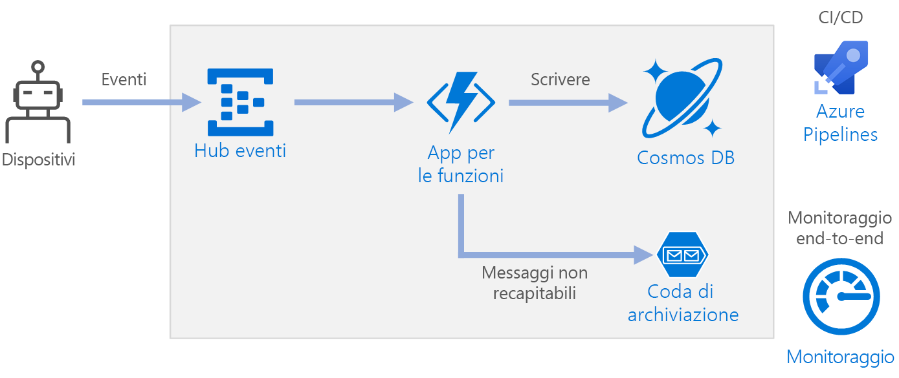

# <a name="serverless-event-processing-using-azure-functions"></a>Funzioni di Azure per l'elaborazione degli eventi senza server

Questa architettura di riferimento illustra un'architettura [senza server](https://azure.microsoft.com/solutions/serverless/) e basata su eventi, che inserisce un flusso di dati, li elabora e scrive i risultati in un database back-end. Un'implementazione di riferimento per questa architettura è disponibile in [GitHub][github].



## <a name="architecture"></a>Architettura

**Hub eventi** inserisce il flusso di dati. [Hub eventi][eh] è progettato per scenari di flusso di dati con velocità effettiva elevata.

> [!NOTE]
> Per gli scenari IoT, è consigliabile usare l'hub IoT. L'hub IoT ha un endpoint predefinito che è compatibile con l'API di Hub eventi di Azure, pertanto è possibile usare uno dei due servizi nell'architettura senza apportare modifiche rilevanti nell'elaborazione back-end. Per informazioni, consultare [Connessione di dispositivi IoT ad Azure: hub IoT e hub eventi][iot].

**App per le funzioni**. [Funzioni di Azure][functions] è un'opzione di calcolo senza server. Usa un modello basato su eventi, in cui un frammento di codice, vale a dire una "funzione", viene richiamato da un trigger. In questa architettura, quando gli eventi arrivano a Hub eventi, attivano una funzione che elabora gli eventi e scrive i risultati nell'archiviazione.

Le app per le funzioni sono adatte per l'elaborazione di singoli record da Hub eventi. Per gli scenari di elaborazione del flusso più complessi, prendere in considerazione Apache Spark con Azure Databricks, oppure Analisi di flusso di Azure.

**Cosmos DB**. [Cosmos DB][cosmosdb] è un servizio database multimodello. Per questo scenario, la funzione di elaborazione di eventi archivia i record JSON, usando l'[API SQL][cosmosdb-sql] di Cosmos DB.

**Archiviazione code**. [Archiviazione code][queue] viene usato per i messaggi non recapitabili. Se si verifica un errore durante l'elaborazione di un evento, la funzione archivia i dati dell'evento in una coda di messaggi non recapitabili per elaborali in seguito. Per altre informazioni, vedere [Resiliency Considerations](#resiliency-considerations) (Considerazioni sulla resilienza).

**Monitoraggio di Azure**. [Monitoraggio][monitor] raccoglie le metriche relative alle prestazioni dei servizi di Azure distribuiti nella soluzione. La visualizzazione delle metriche in una dashboard consente di ottenere visibilità sull'integrità della soluzione.

**Azure Pipelines**. [Pipelines][pipelines] è un servizio di integrazione continua, ovvero CI, e recapito continuo, ovvero CD, che compila, verifica e distribuisce l'applicazione.

## <a name="scalability-considerations"></a>Considerazioni sulla scalabilità

### <a name="event-hubs"></a>Hub eventi

La capacità di elaborazione di Hub eventi viene misurata in [unità elaborate][eh-throughput]. È possibile ridimensionare automaticamente un hub eventi abilitando l'[aumento automatico][eh-autoscale], che ridimensiona automaticamente le unità elaborate in base al traffico, fino a un limite massimo configurato.

Il [trigger di Hub eventi][eh-trigger] nell'app per le funzioni viene ridimensionato in base al numero di partizioni nell'hub eventi. A ogni partizione viene assegnata un'istanza di funzione alla volta. Per ottimizzare la velocità effettiva, ricevere gli eventi in batch, anziché uno alla volta.

### <a name="cosmos-db"></a>Cosmos DB

La capacità di elaborazione per Cosmos DB viene misurata in [unità richiesta][ru] (UR). Per ridimensionare un contenitore Cosmos DB fino a un valore superiore a 10.000 UR, è necessario specificare una [chiave di partizione][partition-key] quando si crea il contenitore e includere la chiave di partizione in ogni documento creato dall'utente.

Ecco alcune caratteristiche di una chiave di partizione efficace:

- Lo spazio dei valori della chiave è grande.
- Si verificherà una distribuzione uniforme delle operazioni di lettura/scrittura per ogni valore della chiave, evitando le chiavi usate di frequente.
- Il numero massimo di dati archiviati per ogni singolo valore della chiave non supererà le dimensioni massime di una partizione fisica (10 GB).
- La chiave di partizione per un documento non cambierà. Non è possibile aggiornare la chiave di partizione su un documento esistente.

Nello scenario per questa architettura di riferimento la funzione archivia esattamente un documento per ogni dispositivo che invia dati. La funzione aggiorna continuamente i documenti con lo stato del dispositivo più recente, mediante un'operazione upsert. L'ID dispositivo rappresenta una chiave di partizione efficace per questo scenario, perché le scritture verranno distribuite in modo uniforme tra le chiavi e le dimensioni di ogni partizione verranno rigorosamente limitate, essendo presente un solo documento per ogni valore di chiave. Per altre informazioni sulle chiavi di partizione, vedere [Partizionamento e ridimensionamento in Azure Cosmos DB][cosmosdb-scale].

## <a name="resiliency-considerations"></a>Considerazioni sulla resilienza

Quando si usa il trigger di Hub eventi con Funzioni, intercettare le eccezioni all'interno del ciclo di elaborazione. Se si verifica un'eccezione non gestita, il runtime di Funzioni non ripete i messaggi. Se non è possibile elaborare un messaggio, inserire il messaggio in una coda di messaggi non recapitabili. Usare un processo fuori banda per esaminare i messaggi e determinare l'azione correttiva.

Il codice seguente illustra in che modo la funzione di inserimento intercetta le eccezioni e inserisce i messaggi non elaborati in una coda di messaggi non recapitabili.

```csharp
[FunctionName("RawTelemetryFunction")]
[StorageAccount("DeadLetterStorage")]
public static async Task RunAsync(
    [EventHubTrigger("%EventHubName%", Connection = "EventHubConnection", ConsumerGroup ="%EventHubConsumerGroup%")]EventData[] messages,
    [Queue("deadletterqueue")] IAsyncCollector<DeadLetterMessage> deadLetterMessages,
    ILogger logger)
{
    foreach (var message in messages)
    {
        DeviceState deviceState = null;

        try
        {
            deviceState = telemetryProcessor.Deserialize(message.Body.Array, logger);
        }
        catch (Exception ex)
        {
            logger.LogError(ex, "Error deserializing message", message.SystemProperties.PartitionKey, message.SystemProperties.SequenceNumber);
            await deadLetterMessages.AddAsync(new DeadLetterMessage { Issue = ex.Message, EventData = message });
        }

        try
        {
            await stateChangeProcessor.UpdateState(deviceState, logger);
        }
        catch (Exception ex)
        {
            logger.LogError(ex, "Error updating status document", deviceState);
            await deadLetterMessages.AddAsync(new DeadLetterMessage { Issue = ex.Message, EventData = message, DeviceState = deviceState });
        }
    }
}
```

Si noti che la funzione usa l'[associazione di output di archiviazione code][queue-binding] per inserire elementi nella coda.

Il codice illustrato sopra registra anche le eccezioni per Application Insights. È possibile usare il numero di sequenza e la chiave di partizione per correlare i messaggi non recapitabili con le eccezioni nei log.

I messaggi nella coda di messaggi non recapitabili avranno sufficienti informazioni in modo da poter comprendere il contesto dell'errore. In questo esempio, la classe `DeadLetterMessage` contiene il messaggio di eccezione, i dati dell'evento originale e il messaggio di evento deserializzato, se disponibile.

```csharp
public class DeadLetterMessage
{
    public string Issue { get; set; }
    public EventData EventData { get; set; }
    public DeviceState DeviceState { get; set; }
}
```

Usare [Monitoraggio di Azure][monitor] per monitorare l'hub eventi. Se viene visualizzato un input ma non un output, significa che i messaggi non vengono elaborati. In tal caso, passare a [Log Analytics][log-analytics] e cercare le eccezioni o altri errori.

## <a name="disaster-recovery-considerations"></a>Considerazioni sul ripristino di emergenza

La distribuzione illustrata di seguito si trova in una sola area di Azure. Per un approccio più resiliente al ripristino di emergenza, sfruttare le funzionalità di distribuzione a livello geografico nei vari servizi:

- **Hub eventi**. Creare due spazi dei nomi di Hub eventi, uno spazio dei nomi primario (attivo) e un spazio dei nomi secondario (passivo). I messaggi vengono indirizzati automaticamente allo spazio dei nomi attivo a meno che non si esegua il failover nello spazio dei nomi secondario. Per altre informazioni, vedere [Ripristino di emergenza geografico nel servizio Hub eventi di Azure][eh-dr].

- **App per le funzioni**. Distribuire una seconda app per le funzioni che è in attesa di leggere lo spazio dei nomi secondario di Hub eventi. Questa funzione scrive in un account di archiviazione secondario per la coda di messaggi non recapitabili.

- **Cosmos DB**. Cosmos DB supporta [più aree master][cosmosdb-geo], che consentono di effettuare operazioni di scrittura in tutte le aree aggiunte al proprio account Cosmos DB. Se non si abilita multimaster, è comunque possibile eseguire il failover dell'area di scrittura primaria. Gli SDK del client Cosmos DB e le associazioni di Funzioni di Azure gestiscono automaticamente il failover, quindi non è necessario aggiornare le impostazioni di configurazione dell'applicazione.

- **Archiviazione di Azure**. Usare lo spazio di archiviazione [RA-GRS][ra-grs] per la coda di messaggi non recapitabili. Verrà creata una replica di sola lettura in un'altra area. Se l'area primaria diventa non disponibile, è possibile leggere gli elementi attualmente presenti nella coda. In aggiunta eseguire il provisioning di un altro account di archiviazione nella regione secondaria in cui la funzione può scrivere dopo un failover.

## <a name="deploy-the-solution"></a>Distribuire la soluzione

Per distribuire questa architettura di riferimento, consultare il [file leggimi di GitHub][readme].

<!-- links -->

[cosmosdb]: /azure/cosmos-db/introduction
[cosmosdb-geo]: /azure/cosmos-db/distribute-data-globally
[cosmosdb-scale]: /azure/cosmos-db/partition-data
[cosmosdb-sql]: /azure/cosmos-db/sql-api-introduction
[eh]: /azure/event-hubs/
[eh-autoscale]: /azure/event-hubs/event-hubs-auto-inflate
[eh-dr]: /azure/event-hubs/event-hubs-geo-dr
[eh-throughput]: /azure/event-hubs/event-hubs-features#throughput-units
[eh-trigger]: /azure/azure-functions/functions-bindings-event-hubs
[functions]: /azure/azure-functions/functions-overview
[iot]: /azure/iot-hub/iot-hub-compare-event-hubs
[log-analytics]: /azure/log-analytics/log-analytics-queries
[monitor]: /azure/azure-monitor/overview
[partition-key]: /azure/cosmos-db/partition-data
[pipelines]: /azure/devops/pipelines/index
[queue]: /azure/storage/queues/storage-queues-introduction
[queue-binding]: /azure/azure-functions/functions-bindings-storage-queue#output
[ra-grs]: /azure/storage/common/storage-redundancy-grs
[ru]: /azure/cosmos-db/request-units

[github]: https://github.com/mspnp/serverless-reference-implementation
[readme]: https://github.com/mspnp/serverless-reference-implementation/blob/master/README.md
