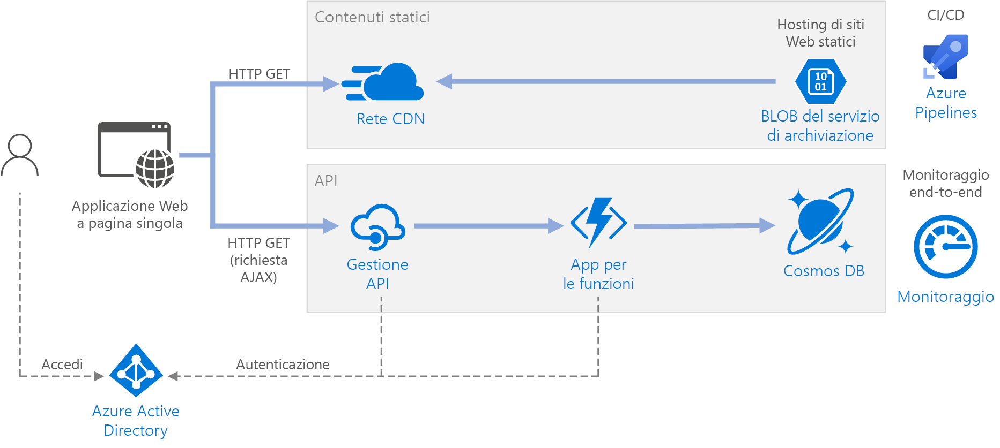

# <a name="serverless-web-application"></a>Applicazione Web senza server 

Questa architettura di riferimento illustra un'applicazione Web senza server. L'applicazione rende disponibile il contenuto statico di Archiviazione BLOB di Azure e implementa un'API che usa Funzioni di Azure. L'API legge i dati di Cosmos DB e restituisce i risultati per l'app Web. Un'implementazione di riferimento per questa architettura è disponibile in [GitHub][github].


 
Il termine senza server ha due significati distinti ma correlati:

- **Back-end come servizio** (BaaS). I servizi cloud di back-end, ad esempio database e archiviazione, offrono le API che consentono alle applicazioni client di connettersi direttamente a questi servizi. 
- **Funzioni come servizio** (FaaS). In questo modello una "funzione" è un frammento di codice che viene distribuito nel cloud ed eseguito all'interno di un ambiente di hosting che elimina completamente i server che eseguono il codice. 

Entrambe le definizioni hanno in comune l'idea che gli sviluppatori e il personale DevOps non dovranno distribuire, configurare o gestire i server. Questa architettura di riferimento è incentrata su FaaS che usa Funzioni di Azure, sebbene rendere disponibile il contenuto Web di Archiviazione BLOB di Azure sia un esempio di BaaS. Alcune caratteristiche importanti di FaaS sono:

1. Le risorse di calcolo vengono allocate in modo dinamico dalla piattaforma in base alle esigenze.
1. Prezzi a consumo: vengono addebitati solo i costi per le risorse di calcolo usate per eseguire il codice.
1. Scalabilità delle risorse di calcolo su richiesta in base al traffico, senza che lo sviluppatore debba eseguire una qualsiasi configurazione.

Le funzioni vengono eseguite quando si verifica un trigger esterno, ad esempio una richiesta HTTP o un messaggio che arriva su una coda. In questo modo, lo [stile di architettura basata su eventi][event-driven] diventa naturale per le architetture senza server. Per coordinare il lavoro tra i componenti dell'architettura, è consigliabile usare i broker di messaggi o i modelli di pubblicazione/sottoscrizione. Per informazioni su come scegliere le tecnologie di messaggistica in Azure, vedere [Scegliere tra i servizi di Azure che recapitano messaggi][azure-messaging].

## <a name="architecture"></a>Architettura
L'architettura è costituita dai componenti seguenti.

**Archiviazione BLOB**. I contenuti Web statici, quali file HTML, CSS e JavaScript, vengono archiviati in Archiviazione BLOB di Azure e resi disponibili ai client tramite l'[hosting di siti Web statici][static-hosting]. Tutte le interazioni dinamiche avvengono tramite il codice JavaScript che effettua le chiamate all'API back-end. Non è presente alcun codice lato server per il rendering della pagina Web. L'hosting di siti Web statici supporta l'indicizzazione dei documenti e le pagine di errore 404 personalizzate.

> [!NOTE]
> L'hosting di siti Web statici è attualmente disponibile in [anteprima][static-hosting-preview].

**Rete CDN**. Usare la [rete per la distribuzione di contenuti di Azure][cdn], ovvero la rete CDN, per memorizzare nella cache il contenuto in modo da ridurre la latenza e accelerare la distribuzione del contenuto, nonché offrire un endpoint HTTPS.

**App per le funzioni**. [Funzioni di Azure][functions] è un'opzione di calcolo senza server. Usa un modello basato su eventi, in cui un frammento di codice, vale a dire una "funzione", viene richiamato da un trigger. In questa architettura la funzione viene richiamata quando un client effettua una richiesta HTTP. La richiesta viene sempre instradata attraverso un gateway API, descritto di seguito.

**Gestione API**. [Gestione API][apim] offre un gateway API posizionato davanti alla funzione HTTP. È possibile usare Gestione API per pubblicare e gestire le API usate dalle applicazioni client. L'uso di un gateway consente di separare l'applicazione front-end dalle API back-end. Gestione API può, ad esempio, riscrivere gli URL, trasformare le richieste prima che raggiungano il back-end, impostare le intestazioni delle richieste o delle risposte e così via.

Gestione API può essere usato anche per implementare le problematiche trasversali quali:

- applicazione delle quote di uso e dei limiti di frequenza
- convalida dei token OAuth per l'autenticazione
- abilitazione di richieste multiorigine (CORS)
- memorizzazione nella cache delle risposte
- monitoraggio e registrazione delle richieste  

Se l'utente non ha bisogno di tutte le funzionalità offerte da Gestione API, un'altra opzione consiste nell'usare [Proxy di Funzioni][functions-proxy]. Questa funzionalità di Funzioni di Azure consente di definire un'unica superficie API per più app per le funzioni, tramite la creazione di route per le funzioni di back-end. Proxy di Funzioni può eseguire anche trasformazioni limitate sulla richiesta e la risposta HTTP. Tuttavia, non offre lo stesso numero di funzionalità basate su criteri di Gestione API.

**Cosmos DB**. [Cosmos DB][cosmosdb] è un servizio database multimodello. Per questo scenario, l'applicazione per le funzioni recupera i documenti da Cosmos DB in risposta alle richieste HTTP GET del client.

**Azure Active Directory** (Azure AD). Gli utenti accedono all'applicazione Web usando le proprie credenziali di Azure AD. Azure AD restituisce un token di accesso per l'API, che l'applicazione Web usa per autenticare le richieste API (vedere [Autenticazione](#authentication)).

**Monitoraggio di Azure**. [Monitoraggio][monitor] raccoglie le metriche relative alle prestazioni dei servizi di Azure distribuiti nella soluzione. La visualizzazione delle metriche in una dashboard consente di ottenere visibilità sull'integrità della soluzione. Vengono raccolti anche i registri applicazioni.

**Azure Pipelines**. [Pipelines][pipelines] è un servizio di integrazione continua, ovvero CI, e recapito continuo, ovvero CD, che compila, verifica e distribuisce l'applicazione.

## <a name="recommendations"></a>Consigli

### <a name="function-app-plans"></a>Piani dell'app per le funzioni

Funzioni di Azure supporta due modelli di hosting. Il **piano a consumo** consente di allocare automaticamente le funzionalità di calcolo durante l'esecuzione del codice.  Il piano di **servizio app** consente di allocare un set di macchine virtuali per il codice. Definisce anche il numero di macchine virtuali e le relative dimensioni. 

Si noti che il piano di servizio app non è inteso *senza server* in senso stretto, in base alla definizione sopra specificata. Il modello di programmazione è lo stesso, tuttavia &mdash; lo stesso codice di funzione può essere eseguito sia in un piano a consumo che in un piano di servizio app.

Ecco alcuni fattori da considerare quando si sceglie il tipo di piano da usare:

- **Avvio a freddo**. Con il piano a consumo, una funzione che non è stata richiamata di recente riscontrerà una maggiore latenza alla successiva esecuzione. Questa maggiore latenza è dovuta all'allocazione e alla preparazione dell'ambiente di runtime. In genere è nell'ordine di secondi, ma questo dipende da diversi fattori, tra cui il numero di dipendenze che devono essere caricate. Per altre informazioni, vedere [Understanding Serverless Cold Start][functions-cold-start] (Informazioni sull'avvio a freddo senza server). L'avvio a freddo riguarda in genere più i carichi di lavoro interattivi, ovvero i trigger HTTP, che i carichi di lavoro asincroni basati sui messaggi, ovvero le code o i trigger basati sugli eventi, perché la maggiore latenza viene osservata direttamente dagli utenti.
- **Periodo di timeout**.  Nel piano a consumo il timeout dell'esecuzione di una funzione si verifica dopo un periodo di tempo [configurabile][functions-timeout] per un massimo di 10 minuti.
- **Isolamento della rete virtuale**. L'uso di un piano di servizio app consente alle funzioni di essere eseguite all'interno di un [ambiente del servizio app][ase], ovvero un ambiente di hosting dedicato e isolato.
- **Modello di prezzi**. Il piano a consumo viene fatturato in base al numero di esecuzioni e al consumo di risorse (memoria &times; tempo di esecuzione). Il piano di servizio app viene fatturato a tariffa oraria in base allo SKU dell'istanza della macchina virtuale. Spesso, il piano a consumo può essere più economico rispetto a un piano di servizio app, perché l'utente paga solo per le risorse di calcolo che usa. Ciò è particolarmente vero se il traffico presenta picchi e valli. Tuttavia, se un'applicazione riscontra una velocità effettiva elevata costante, il piano di servizio app può costare meno del piano a consumo.
- **Ridimensionamento**. Un grande vantaggio del modello a consumo è che viene ridimensionato in modo dinamico a seconda delle esigenze, in base al traffico in ingresso. Sebbene il ridimensionamento si verifichi in modo rapido, c'è comunque un periodo di preparazione. Per alcuni carichi di lavoro, l'utente potrebbe voler eseguire deliberatamente un provisioning eccessivo delle macchine virtuali, in modo che sia possibile gestire i picchi di traffico con un tempo di preparazione pari a zero. In tal caso, prendere in considerazione un piano di servizio app.

### <a name="function-app-boundaries"></a>Limiti di app per le funzioni

Un'*app per le funzioni* ospita l'esecuzione di una o più *funzioni*. È possibile usare un'app per le funzioni per raggruppare diverse funzioni come un'unità logica. All'interno di un'app per le funzioni le funzioni condividono le stesse impostazioni applicazione, piano di hosting e ciclo di vita di distribuzione. Ogni app per le funzioni ha il proprio nome host.  

Usare le app per le funzioni per raggruppare le funzioni che condividono lo stesso ciclo di vita e le stesse impostazioni. Le funzioni che non condividono lo stesso ciclo di vita devono essere ospitate in app per le funzioni diverse. 

È consigliabile adottare un approccio ai microservizi, in cui ogni app per le funzioni rappresenta un microservizio, se possibile costituito da diverse funzioni correlate. In un'architettura dei microservizi, i servizi dovrebbero avere un regime di controllo libero e un'elevata coesione funzionale. Regime di controllo *libero* significa che è possibile apportare modifiche a un servizio senza dover contemporaneamente aggiornare gli altri servizi. *Coesivo* significa che un servizio ha un unico obiettivo ben definito. Per altre informazioni su questi concetti, vedere [Progettazione di microservizi: analisi del dominio][microservices-domain-analysis].

### <a name="function-bindings"></a>Associazioni di funzioni

Usare le [associazioni][functions-bindings] di funzioni quando possibile. Le associazioni offrono una modalità dichiarativa per connettere il codice ai dati e integrare altri servizi di Azure. Un'associazione di input consente di compilare un parametro di input da un'origine dati esterna. Un'associazione di output invia il valore restituito della funzione a un sink di dati, ad esempio una coda o un database.

La funzione `GetStatus` nell'implementazione di riferimento, ad esempio, usa l'[associazione di input][cosmosdb-input-binding] di Cosmos DB. Questa associazione è configurata per cercare un documento in Cosmos DB, usando i parametri di query che vengono eseguiti dalla stringa di query nella richiesta HTTP. Se viene trovato, il documento viene passato alla funzione come parametro.

```csharp
[FunctionName("GetStatusFunction")]
public static Task<IActionResult> Run(
    [HttpTrigger(AuthorizationLevel.Function, "get", Route = null)] HttpRequest req, 
    [CosmosDB(
        databaseName: "%COSMOSDB_DATABASE_NAME%",
        collectionName: "%COSMOSDB_DATABASE_COL%",
        ConnectionStringSetting = "COSMOSDB_CONNECTION_STRING",
        Id = "{Query.deviceId}",
        PartitionKey = "{Query.deviceId}")] dynamic deviceStatus, 
    ILogger log)
{
    ...
}
```

Tramite le associazioni, non è necessario scrivere il codice che comunica direttamente con il servizio e questo semplifica il codice della funzione e inoltre consente di eliminare i dettagli dell'origine dati o del sink. In alcuni casi, tuttavia, potrebbe essere necessaria una logica più complessa rispetto a quella offerta dall'associazione. In tal caso, usare direttamente gli SDK del client Azure.

## <a name="scalability-considerations"></a>Considerazioni sulla scalabilità

**Funzioni**. Per il piano a consumo, il trigger HTTP viene ridimensionato in base al traffico. È previsto un limite al numero di istanze di funzione simultanee, ma ogni istanza può elaborare più di una richiesta alla volta. Per un piano di servizio app, il trigger HTTP viene ridimensionato in base al numero di istanze della macchina virtuale, che può essere un valore fisso oppure può essere ridimensionato in modo automatico in base a un set di regole di scalabilità automatica. Per informazioni vedere [Ridimensionamento e hosting di Funzioni di Azure][functions-scale]. 

**Cosmos DB**. La capacità di elaborazione per Cosmos DB viene misurata in [unità richiesta][ru] (UR). Una velocità effettiva di 1 UR corrisponde alla velocità effettiva necessaria per l'operazione GET su un documento da 1 kB. Per ridimensionare un contenitore Cosmos DB fino a un valore superiore a 10.000 UR, è necessario specificare una [chiave di partizione][partition-key] quando si crea il contenitore e includere la chiave di partizione in ogni documento creato dall'utente. Per altre informazioni sulle chiavi di partizione, vedere [Partizionamento e ridimensionamento in Azure Cosmos DB][cosmosdb-scale].

**Gestione API**. Gestione API consente di aumentare e supportare il ridimensionamento automatico basato su regole. Si noti che il processo di ridimensionamento richiede almeno 20 minuti. Se ci sono picchi di traffico, è necessario eseguire il provisioning per il picco di traffico massimo previsto. Tuttavia, la scalabilità automatica è utile per la gestione delle variazioni orarie o giornaliere del traffico. Per altre informazioni, vedere [Ridimensionare automaticamente un'istanza di Gestione API di Azure][apim-scale].

## <a name="disaster-recovery-considerations"></a>Considerazioni sul ripristino di emergenza

La distribuzione illustrata di seguito si trova in una sola area di Azure. Per un approccio più resiliente al ripristino di emergenza, sfruttare le funzionalità di distribuzione a livello geografico nei vari servizi:

- Gestione API supporta la distribuzione in più aree che può essere usata per distribuire una sola istanza di Gestione API in qualsiasi numero di aree di Azure. Per altre informazioni, vedere [Come distribuire un'istanza del servizio Gestione API di Azure in più aree di Azure][api-geo].

- Usare [Gestione traffico][tm] per indirizzare le richieste HTTP all'area primaria. Se l'app per le funzioni in esecuzione in tale area diventa disponibile, Gestione traffico può effettuare il failover all'area secondaria.

- Cosmos DB supporta [più aree master][cosmosdb-geo], che consentono di effettuare operazioni di scrittura in tutte le aree aggiunte al proprio account Cosmos DB. Se non si abilita multimaster, è comunque possibile eseguire il failover dell'area di scrittura primaria. Gli SDK del client Cosmos DB e le associazioni di Funzioni di Azure gestiscono automaticamente il failover, quindi non è necessario aggiornare le impostazioni di configurazione dell'applicazione.

## <a name="security-considerations"></a>Considerazioni relative alla sicurezza

### <a name="authentication"></a>Authentication

L'API `GetStatus` nell'implementazione di riferimento usa Azure AD per autenticare le richieste. Azure AD supporta il protocollo Open ID Connect, ovvero un protocollo di autenticazione creato sul protocollo OAuth 2.

In questa architettura l'applicazione client è un'applicazione a pagina singola che viene eseguita nel browser. Questo tipo di applicazione client non può tenere un segreto client o un codice di autorizzazione nascosti, pertanto il flusso di concessione implicita è appropriato. Vedere [Which OAuth 2.0 flow should I use?][oauth-flow] (Quale flusso di OAuth 2.0 è necessario usare?). Di seguito è riportato il flusso completo:

1. L'utente fa clic sul collegamento "Accedi" nell'applicazione Web.
1. Il browser viene reindirizzato alla pagina di accesso di Azure AD. 
1. L'utente effettua l'accesso.
1. Azure AD reindirizza all'applicazione client, includendo un token di accesso nel frammento di URL.
1. Quando l'applicazione Web chiama l'API, include il token di accesso nell'intestazione Autenticazione. L'ID dell'applicazione viene inviato come attestazione dei destinatari ("aud") nel token di accesso. 
1. L'API back-end convalida il token di accesso.

Per configurare l'autenticazione:

- Registrare un'applicazione nel tenant di Azure AD. Questa operazione genera un ID applicazione, che il client include con l'URL di accesso.

- Abilitare l'autenticazione di Azure AD nell'app per le funzioni. Per altre informazioni, vedere [Autenticazione e autorizzazione nel servizio app di Azure][app-service-auth].

- Aggiungere il [criterio validate-jwt][apim-validate-jwt] a Gestione API per preautorizzare la richiesta convalidando il token di accesso.

Per altri dettagli, vedere il [file leggimi di GitHub][readme].

È consigliabile creare registrazioni di app separate in Azure AD per l'applicazione client e l'API back-end. Concedere all'applicazione client l'autorizzazione per chiamare l'API. Questo approccio garantisce la possibilità di definire più API e client e controllare le autorizzazioni per ognuno. 

All'interno di un'API, usare gli [ambiti][scopes] per assicurare alle applicazioni un controllo specifico sulle autorizzazioni che richiedono da un utente. Ad esempio, un'API potrebbe avere gli ambiti `Read` e `Write` e una determinata app client potrebbe chiedere all'utente di autorizzare solo le autorizzazioni `Read`.

### <a name="authorization"></a>Authorization

In molte applicazioni l'API back-end deve verificare che l'utente disponga dell'autorizzazione per eseguire una determinata azione. È consigliabile usare l'[autorizzazione basata sulle attestazioni][claims], in cui le informazioni relative all'utente vengono trasmesse dal provider di identità, in questo caso, Azure AD, e usate per prendere decisioni di autorizzazione. 

Alcune attestazioni sono contenute all'interno del token ID restituito da Azure AD al client. È possibile ottenerle nell'app per le funzioni, esaminando l'intestazione X-MS-CLIENT-PRINCIPAL nella richiesta. Per le altre attestazioni, usare [Microsoft Graph][graph] per effettuare una query in Azure AD. A tale scopo è necessario il consenso dell'utente durante l'accesso. 

Ad esempio, quando si registra un'applicazione in Azure AD, è possibile definire un set di ruoli applicazione nel manifesto di registrazione dell'applicazione. Quando un utente accede all'applicazione, Azure AD include un'attestazione "ruoli" per ogni ruolo che viene concesso all'utente, inclusi i ruoli ereditati tramite l'appartenenza a un gruppo. 

Nell'implementazione di riferimento la funzione controlla se l'utente autenticato è un membro del ruolo applicazione `GetStatus`. Se non lo è, la funzione restituisce una risposta HTTP Non autorizzato (401). 

```csharp
[FunctionName("GetStatusFunction")]
public static Task<IActionResult> Run(
    [HttpTrigger(AuthorizationLevel.Function, "get", "post", Route = null)] HttpRequest req, 
    [CosmosDB(
        databaseName: "%COSMOSDB_DATABASE_NAME%",
        collectionName: "%COSMOSDB_DATABASE_COL%",
        ConnectionStringSetting = "COSMOSDB_CONNECTION_STRING",
        Id = "{Query.deviceId}",
        PartitionKey = "{Query.deviceId}")] dynamic deviceStatus, 
    ILogger log)
{
    log.LogInformation("Processing GetStatus request.");

    return req.HandleIfAuthorizedForRoles(new[] { GetDeviceStatusRoleName },
        async () =>
        {
            string deviceId = req.Query["deviceId"];
            if (deviceId == null)
            {
                return new BadRequestObjectResult("Missing DeviceId");
            }

            return await Task.FromResult<IActionResult>(deviceStatus != null
                    ? (ActionResult)new OkObjectResult(deviceStatus)
                    : new NotFoundResult());
        },
        log);
}
```

In questo esempio di codice `HandleIfAuthorizedForRoles` è un metodo di estensione che verifica l'attestazione del ruolo e restituisce un errore HTTP 401 se l'attestazione non viene trovata. Il codice di origine è disponibile [qui][HttpRequestAuthorizationExtensions]. Si noti che `HandleIfAuthorizedForRoles` prende un parametro `ILogger`. È consigliabile registrare le richieste non autorizzate in modo da avere un audit trail e poter diagnosticare i problemi se necessario. Allo stesso tempo, evitare la perdita di eventuali informazioni dettagliate nella risposta HTTP 401.

### <a name="cors"></a>CORS

In questa architettura di riferimento l'applicazione Web e l'API non condividono la stessa origine. Ciò significa che quando l'applicazione chiama l'API, si avvia una richiesta multiorigine. La sicurezza del browser impedisce a una pagina Web di creare richieste AJAX per un altro dominio. Questa restrizione è nota come *criteri di corrispondenza dell'origine* e impedisce a un sito dannoso di leggere dati sensibili da un altro sito. Per abilitare una richiesta multiorigine, aggiungere un [criterio][cors-policy] Condivisione risorse tra le origini, ovvero CORS al gateway di Gestione API:

```xml
<cors allow-credentials="true">
    <allowed-origins>
        <origin>[Website URL]</origin>
    </allowed-origins>
    <allowed-methods>
        <method>GET</method>
    </allowed-methods>
    <allowed-headers>
        <header>*</header>
    </allowed-headers>
</cors>
```

In questo esempio, l'attributo **allow-credentials** è **true**. Questo autorizza il browser a inviare le credenziali, compresi i cookie, con la richiesta. Per impostazione predefinita, altrimenti, il browser non invia le credenziali con una richiesta multiorigine.

> [!NOTE] 
> Prestare particolare attenzione nell'impostare **allow-credentials** su **true**, perché ciò implica che un sito Web può inviare le credenziali dell'utente all'API per conto dell'utente, senza che l'utente ne sia a conoscenza. L'origine consentita deve essere considerata attendibile.

### <a name="enforce-https"></a>Applicare HTTPS

Per garantire la massima sicurezza, richiedere HTTPS attraverso la pipeline della richiesta:

- **Rete CDN**. Per impostazione predefinita, la rete CDN di Azure supporta HTTPS nel sottodominio `*.azureedge.net`. Per abilitare HTTPS nella rete CDN per i nomi di dominio personalizzati, vedere [Esercitazione: Configurare HTTPS in un dominio personalizzato della rete CDN di Azure][cdn-https]. 

- **Hosting di siti Web statici**. Abilitare l'opzione "[Trasferimento sicuro obbligatorio][storage-https]" nell'account di archiviazione. Quando questa opzione è abilitata, l'account di archiviazione consente solo le richieste dalle connessioni HTTPS sicure. 

- **Gestione API**. Configurare le API affinché usino solo il protocollo HTTPS. È possibile configurarle nel portale di Azure o tramite un modello di Resource Manager:

    ```json
    {
        "apiVersion": "2018-01-01",
        "type": "apis",
        "name": "dronedeliveryapi",
        "dependsOn": [
            "[concat('Microsoft.ApiManagement/service/', variables('apiManagementServiceName'))]"
        ],
        "properties": {
            "displayName": "Drone Delivery API",
            "description": "Drone Delivery API",
            "path": "api",
            "protocols": [ "HTTPS" ]
        },
        ...
    }
    ```

- **Funzioni di Azure**. Abilitare l'impostazione "[Solo HTTPS][functions-https]". 

### <a name="lock-down-the-function-app"></a>Bloccare le app per le funzioni

Tutte le chiamate alla funzione devono passare attraverso il gateway dell'API. A tale scopo, procedere come segue:

- Configurare l'app per le funzioni per richiedere una chiave della funzione. Quando chiama l'app per le funzioni, il gateway di Gestione API include la chiave della funzione. Questo impedisce ai client di chiamare direttamente la funzione, ignorando il gateway. 

- Il gateway di Gestione API ha un [indirizzo IP statico][apim-ip]. Limitare Funzioni di Azure per consentire solo le chiamate da tale indirizzo IP statico. Per altre informazioni, vedere [Restrizioni IP statico del Servizio app di Azure][app-service-ip-restrictions]. Questa funzionalità è disponibile solo per i servizi di livello Standard. 

### <a name="protect-application-secrets"></a>Proteggere i segreti dell'applicazione

Non archiviare i segreti dell'applicazione, come le credenziali del database, nel codice o nei file di configurazione. Usare invece le impostazioni dell'app, che vengono archiviate con crittografia in Azure. Per altre informazioni vedere [Sicurezza in Servizio app di Azure e Funzioni di Azure][app-service-security].

In alternativa, è possibile archiviare i segreti dell'applicazione in Key Vault. In questo modo è possibile centralizzare l'archiviazione dei segreti, controllarne la distribuzione e monitorare i momenti e la modalità in cui sono accessibili. Per altre informazioni vedere [Configurare un'applicazione Web di Azure per la lettura di un segreto da un insieme di credenziali delle chiavi][key-vault-web-app]. Si noti tuttavia che i trigger delle funzioni e le associazioni caricano le impostazioni di configurazione dalle impostazioni dell'app. Non esiste un metodo predefinito per configurare i trigger e le associazioni affinché usino i segreti di Key Vault.

## <a name="devops-considerations"></a>Considerazioni su DevOps

### <a name="deployment"></a>Distribuzione

Per distribuire l'app per le funzioni è consigliabile usare [file di pacchetto][functions-run-from-package], ossia l'esecuzione dal pacchetto. Con questo approccio, si carica un file ZIP in un contenitore di archiviazione BLOB e il runtime di Funzioni monta il file ZIP come file system di sola lettura. Questa operazione atomica riduce le probabilità che una distribuzione non riuscita lasci l'applicazione in uno stato non coerente. Può anche migliorare i tempi di avvio a freddo, soprattutto per le app Node.js, perché viene effettuato lo swapping di tutti i file contemporaneamente.

### <a name="api-versioning"></a>Controllo delle versioni API

Un'API è un contratto tra un servizio e i client. In questa architettura, il contratto API è definito al livello di Gestione API. Gestione API supporta due [concetti di controllo delle versioni][apim-versioning] distinti ma complementari.

- *Versioni*: consentono ai consumer di API di scegliere una versione dell'API in base alle esigenze, ad esempio v1 o v2. 

- *Revisioni*: consentono agli amministratori di API di apportare modifiche che non causano interruzioni e distribuirle insieme a un log delle modifiche per informare i consumer di API.

Se si apporta una modifica che causa un'interruzione in un'API, pubblicare una nuova versione in Gestione API. Distribuire la nuova versione side-by-side con la versione originale, in un'app per le funzioni separata. Ciò consente di eseguire la migrazione dei client esistenti alla nuova API senza interrompere le applicazioni client. Infine è possibile deprecare la versione precedente. Gestione API supporta diversi [schemi di controllo delle versioni][apim-versioning-schemes]: percorso URL, intestazione HTTP e stringa di query. Per altre informazioni sul controllo delle versioni delle API in generale, vedere [Controllo delle versioni di un'API Web RESTful][api-versioning].

Per gli aggiornamenti che non interrompono le modifiche dell'API, distribuire la nuova versione in uno slot di staging nella stessa app per le funzioni. Verificare che la distribuzione abbia avuto esito positivo, quindi invertire la versione con gestione temporanea e la versione di produzione. Pubblicare una revisione in Gestione API.

## <a name="deploy-the-solution"></a>Distribuire la soluzione

Per distribuire questa architettura di riferimento, consultare il [file leggimi di GitHub][readme]. 

<!-- links -->

[api-versioning]: ../../best-practices/api-design.md#versioning-a-restful-web-api
[apim]: /azure/api-management/api-management-key-concepts
[apim-ip]: /azure/api-management/api-management-faq#is-the-api-management-gateway-ip-address-constant-can-i-use-it-in-firewall-rules
[api-geo]: /azure/api-management/api-management-howto-deploy-multi-region
[apim-scale]: /azure/api-management/api-management-howto-autoscale
[apim-validate-jwt]: /azure/api-management/api-management-access-restriction-policies#ValidateJWT
[apim-versioning]: /azure/api-management/api-management-get-started-publish-versions
[apim-versioning-schemes]: /azure/api-management/api-management-get-started-publish-versions#choose-a-versioning-scheme
[app-service-auth]: /azure/app-service/app-service-authentication-overview
[app-service-ip-restrictions]: /azure/app-service/app-service-ip-restrictions
[app-service-security]: /azure/app-service/app-service-security
[ase]: /azure/app-service/environment/intro
[azure-messaging]: /azure/event-grid/compare-messaging-services
[claims]: https://en.wikipedia.org/wiki/Claims-based_identity
[cdn]: https://azure.microsoft.com/services/cdn/
[cdn-https]: /azure/cdn/cdn-custom-ssl
[cors-policy]: /azure/api-management/api-management-cross-domain-policies
[cosmosdb]: /azure/cosmos-db/introduction
[cosmosdb-geo]: /azure/cosmos-db/distribute-data-globally
[cosmosdb-input-binding]: /azure/azure-functions/functions-bindings-cosmosdb-v2#input
[cosmosdb-scale]: /azure/cosmos-db/partition-data
[event-driven]: ../../guide/architecture-styles/event-driven.md
[functions]: /azure/azure-functions/functions-overview
[functions-bindings]: /azure/azure-functions/functions-triggers-bindings
[functions-cold-start]: https://blogs.msdn.microsoft.com/appserviceteam/2018/02/07/understanding-serverless-cold-start/
[functions-https]: /azure/app-service/app-service-web-tutorial-custom-ssl#enforce-https
[functions-proxy]: /azure-functions/functions-proxies
[functions-run-from-package]: /azure/azure-functions/run-functions-from-deployment-package
[functions-scale]: /azure/azure-functions/functions-scale
[functions-timeout]: /azure/azure-functions/functions-scale#consumption-plan
[functions-zip-deploy]: /azure/azure-functions/deployment-zip-push
[graph]: https://developer.microsoft.com/graph/docs/concepts/overview
[key-vault-web-app]: /azure/key-vault/tutorial-web-application-keyvault
[microservices-domain-analysis]: ../../microservices/domain-analysis.md
[monitor]: /azure/azure-monitor/overview
[oauth-flow]: https://auth0.com/docs/api-auth/which-oauth-flow-to-use
[partition-key]: /azure/cosmos-db/partition-data
[pipelines]: /azure/devops/pipelines/index
[ru]: /azure/cosmos-db/request-units
[scopes]: /azure/active-directory/develop/v2-permissions-and-consent
[static-hosting]: /azure/storage/blobs/storage-blob-static-website
[static-hosting-preview]: https://azure.microsoft.com/blog/azure-storage-static-web-hosting-public-preview/
[storage-https]: /azure/storage/common/storage-require-secure-transfer
[tm]: /azure/traffic-manager/traffic-manager-overview

[github]: https://github.com/mspnp/serverless-reference-implementation
[HttpRequestAuthorizationExtensions]: https://github.com/mspnp/serverless-reference-implementation/blob/master/src/DroneStatus/dotnet/DroneStatusFunctionApp/HttpRequestAuthorizationExtensions.cs
[readme]: https://github.com/mspnp/serverless-reference-implementation/blob/master/README.md