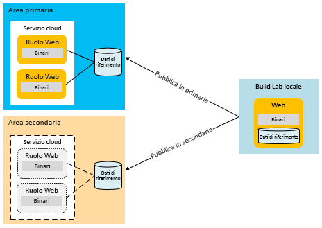
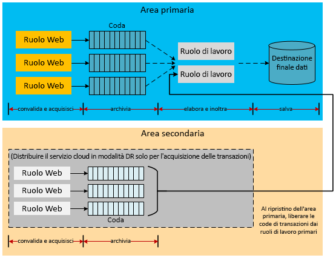
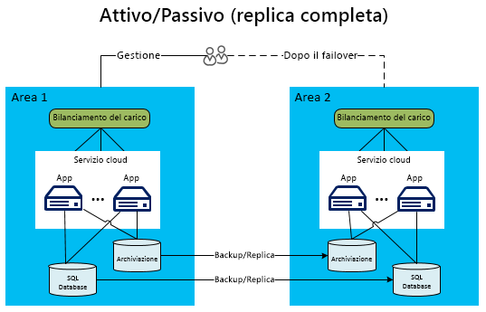

[!INCLUDE [header](../_includes/header.md)]
# Ripristino di emergenza per le applicazioni basate su AzureDisaster recovery for Azure applications
La resilienza e le strategie a disponibilità elevata sono state concepite per gestire condizioni di errore temporaneo.Resiliency and high availability strategies are intended to handling temporary failure conditions. Il ripristino di emergenza è incentrato sul recupero dalla perdita irreversibile di funzionalità delle applicazioni.Disaster recovery (DR) is focused on recovering from a catastrophic loss of application functionality. Se, ad esempio, un'area di Azure che ospita l'applicazione non è più disponibile, è necessario un piano per eseguire l'applicazione o accedere ai dati in un'altra area.For example, if an Azure region hosting your application becomes unavailable, you need a plan for running your application or accessing your data in another region. L'esecuzione di questo piano prevede l'impiego di persone, processi e applicazioni di supporto che consentono al sistema di continuare a funzionare.Executing this plan involves people, processes, and supporting applications that allow the system to continue functioning. Per verificare che sia valido, il piano deve includere le prove di errore e il test del ripristino del database.Your plan should include rehearsing failures and testing the recovery of databases to ensure the plan is sound. Il livello di funzionalità del servizio richiesto durante un'emergenza è determinato dai proprietari dei processi aziendali e delle tecnologie, che definiscono le modalità operative del sistema in caso di emergenza.The business and technology owners who define the system's operational mode for a disaster also determine the level of service functionality required during a disaster. Questo livello di funzionalità può assumere forme diverse e prevedere la completa indisponibilità, una disponibilità parziale, con funzionalità ridotte o ritardi nell'elaborazione, o la disponibilità completa.This level of functionality can take a few forms: completely unavailable, partially available via reduced functionality or delayed processing, or fully available.

## Funzionalità del ripristino di emergenza in AzureAzure disaster recovery features
Come per la disponibilità, Azure offre [indicazioni tecniche sulla resilienza](./index.md) concepite per supportare il ripristino di emergenza.As with availability considerations, Azure provides [resiliency technical guidance](./index.md) designed to support disaster recovery. Esiste anche un rapporto tra le funzionalità di disponibilità di Azure e il ripristino di emergenza.There is also a relationship between availability features of Azure and disaster recovery. Ad esempio, la gestione dei ruoli tra domini di errore aumenta la disponibilità di un'applicazione.For example, the management of roles across fault domains increases the availability of an application. Senza questo tipo di gestione, un errore hardware non gestito diventerebbe uno scenario di "emergenza".Without that management, an unhandled hardware failure would become a “disaster” scenario. L'applicazione corretta delle funzionalità e delle strategie di disponibilità deve essere considerata una parte importante delle iniziative per rendere le applicazioni a prova di emergenza.Leveraging these availability features and strategies is an important part of disaster-proofing your application. Questo articolo, tuttavia, va oltre i problemi generali relativi alla disponibilità per illustrare eventi di emergenza più gravi e più rari.However, this article goes beyond general availability issues to more serious (and rarer) disaster events.

## Più aree di data centerMultiple datacenter regions
I data center di Azure sono dislocati in diverse aree del mondo.Azure maintains datacenters in many regions around the world. Questa infrastruttura supporta diversi scenari di ripristino di emergenza, ad esempio la replica geografica fornita dal sistema di Archiviazione di Azure nelle aree secondarie.This infrastructure supports several disaster recovery scenarios, such as system-provided geo-replication of Azure Storage to secondary regions. È inoltre possibile distribuire in modo semplice ed economico un servizio cloud in diverse località del mondo.You can also easily and inexpensively deploy a cloud service to multiple locations around the world. È utile confrontare questo con i costi e le difficoltà correlate alla creazione e alla gestione di data center propri in più aree.Compare this with the cost and difficulty of building and maintaining your own datacenters in multiple regions. La distribuzione di dati e servizi in più aree consente di proteggere l'applicazione dal rischio di gravi interruzioni in una singola area.Deploying data and services to multiple regions helps protect your application from a major outage in a single region. Quando si progetta il piano di ripristino di emergenza, è importante comprendere il concetto di aree abbinate.As you design your disaster recovery plan, it’s important to understand the concept of paired regions. Per altre informazioni, vedere [Continuità aziendale e ripristino di emergenza nelle aree geografiche abbinate di Azure](/azure/best-practices-availability-paired-regions).For more information, see [Business continuity and disaster recovery (BCDR): Azure Paired Regions](/azure/best-practices-availability-paired-regions).

## Gestione traffico di AzureAzure Traffic Manager
Quando si verifica un problema specifico di un'area, è necessario reindirizzare il traffico a servizi o distribuzioni in un'altra area.When a region-specific failure occurs, you must redirect traffic to services or deployments in another region. Questa operazione risulta più efficace se eseguita tramite servizi, ad esempio Gestione traffico di Azure, che consente di automatizzare il failover del traffico utente in un'altra area se l'area primaria non riesce.It is most effective to handle this via services such as Azure Traffic Manager, which automates the failover of user traffic to another region if the primary region fails. Quando si progetta una strategia di ripristino di emergenza efficace, è importante comprendere le nozioni di base di Gestione traffico.Understanding the fundamentals of Traffic Manager is important when designing an effective DR strategy.

Gestione traffico usa il sistema DNS (Domain Name System) per indirizzare le richieste del client all'endpoint più appropriato in base a un metodo di routing del traffico e all'integrità degli endpoint.Traffic Manager uses the Domain Name System (DNS) to direct client requests to the most appropriate endpoint based on a traffic-routing method and the health of the endpoints. Nel diagramma seguente gli utenti si connettono a un URL di Gestione traffico (`http://myATMURL.trafficmanager.net`) che astrae gli URL del sito effettivo (`http://app1URL.cloudapp.net` e `http://app2URL.cloudapp.net`).In the following diagram, users connect to a Traffic Manager URL (`http://myATMURL.trafficmanager.net`) which abstracts the actual site URLs (`http://app1URL.cloudapp.net` and `http://app2URL.cloudapp.net`). Le richieste utente vengono indirizzate all'URL sottostante appropriato in base al [metodo di instradamento di Gestione traffico](/azure/traffic-manager/traffic-manager-routing-methods) configurato.User requests are routed to the proper underlying URL based on your configured [Traffic Manager routing method](/azure/traffic-manager/traffic-manager-routing-methods). Ai fini di questo articolo si esaminerà solo l'opzione di failover.For the sake of this article, we will be concerned with only the failover option.

Quando si configura Gestione traffico, si fornisce un nuovo prefisso DNS di Gestione traffico che servirà agli utenti per accedere al servizio.When configuring Traffic Manager, you provide a new Traffic Manager DNS prefix, which users will use to access your service. Gestione traffico astrae ora il bilanciamento del carico a un livello superiore rispetto a quello di area.Traffic Manager now abstracts load balancing one level higher that the regional level. Viene eseguito il mapping del DNS di Gestione traffico a un CNAME per tutte le distribuzioni gestite.The Traffic Manager DNS maps to a CNAME for all the deployments that it manages.

In Gestione traffico si specifica la priorità delle distribuzioni a cui gli utenti saranno instradati in caso di errori.Within Traffic Manager, you specify a prioritized list of deployments that users will be routed to when failure occurs. Gestione traffico monitora gli endpoint di distribuzione.Traffic Manager monitors the deployment endpoints. Se la distribuzione primaria diventa non disponibile, Gestione traffico indirizza gli utenti alla distribuzione successiva nell'elenco delle priorità.If the primary deployment becomes unavailable, Traffic Manager routes users to the next deployment on the priority list.

Nonostante spetti a Gestione traffico scegliere la destinazione in caso di failover, è possibile decidere se il dominio di failover deve essere inattivo o attivo quando non è in modalità di failover. Questa impostazione non è correlata a Gestione traffico.Although Traffic Manager decides where to go during a failover, you can decide whether your failover domain is dormant or active while you're not in failover mode (which is unrelated to Traffic Manager). Gestione traffico rileva un errore nel sito primario ed esegue il rollover al sito di failover, anche se gli utenti stanno usando il sito.Traffic Manager detects a failure in the primary site and rolls over to the failover site, regardless of whether that site is currently serving users.

Per altre informazioni sul funzionamento di Gestione traffico, vedere i collegamenti seguenti:For more information on how Azure Traffic Manager works, refer to:

* [Panoramica di Gestione trafficoTraffic Manager overview](/azure/traffic-manager/traffic-manager-overview/)
* [Metodi di routing di Gestione trafficoTraffic Manager routing methods](/azure/traffic-manager/traffic-manager-routing-methods)
* [Configurare metodo di routing failoverConfigure failover routing method](/azure/traffic-manager/traffic-manager-configure-failover-routing-method/)

## Scenari di emergenza in AzureAzure disaster scenarios
Le sezioni seguenti illustrano diversi tipi di scenari di emergenza.The following sections cover several different types of disaster scenarios. Le interruzioni dei servizi a livello di area non sono l'unica causa di errori a livello di applicazione.Region-wide service disruptions are not the only cause of application-wide failures. Le interruzioni dei servizi possono essere determinate anche da errori di progettazione o di amministrazione.Poor design and administrative errors can also lead to outages. È importante prendere in considerazione le possibili cause di un errore durante le fasi di progettazione e di test del piano di ripristino.It's important to consider the possible causes of a failure during both the design and testing phases of your recovery plan. Un buon piano sfrutta le funzionalità di Azure e le integra con strategie specifiche dell'applicazione.A good plan takes advantage of Azure features and augments them with application-specific strategies. La risposta scelta è determinata dall'importanza dell'applicazione nonché dagli obiettivi punto di ripristino (RPO) e tempo di ripristino (RTO).The chosen response is determined by the importance of the application, the recovery point objective (RPO), and the recovery time objective (RTO).

### Errore dell'applicazioneApplication failure
Gestione traffico di Microsoft Azure gestisce automaticamente gli errori derivanti dal software del sistema operativo o dall'hardware sottostante della macchina virtuale host.Azure Traffic Manager automatically handles failures that result from the underlying hardware or operating system software in the host virtual machine. Azure crea una nuova istanza del ruolo e la aggiunge al pool disponibile.Azure creates a new role instance and adds it to the available pool. Se il numero di istanze del ruolo è maggiore di uno, Azure passa l'elaborazione alle altre istanze del ruolo in esecuzione, sostituendo il nodo che non funziona.If  more than one role instance was already running, Azure shifts processing to the other running role instances while replacing the failed node.

Si possono verificare errori gravi di applicazione senza alcun errore dell'hardware o del sistema operativo sottostante.Serious application errors can occur without any underlying failure of the hardware or operating system. L'applicazione può smettere di funzionare a causa di eccezioni irreversibili dovute a logica non corretta o a problemi di integrità dei dati.The application might fail due to catastrophic exceptions caused by bad logic or data integrity issues. È necessario integrare dati di telemetria sufficienti nel codice dell'applicazione in modo che un sistema di monitoraggio possa rilevare le condizioni di errore e inviare notifiche a un amministratore dell'applicazione.You must include sufficient telemetry in the application code so that a monitoring system can detect failure conditions and notify an application administrator. Un amministratore che conosce bene i processi di ripristino di emergenza può decidere se attivare un processo di failover o accettare un'interruzione della disponibilità durante la risoluzione di errori critici.An administrator who has full knowledge of the disaster recovery processes can decide whether to trigger a failover process or accept an availability outage while resolving the critical errors.

### Danneggiamento dei datiData corruption
Azure archivia automaticamente i dati del database SQL di Azure e di Archiviazione di Azure tre volte, in modo ridondante, in diversi domini di errore nella stessa area.Azure automatically stores Azure SQL Database and Azure Storage data three times redundantly within different fault domains in the same region. Se si usa la replica geografica, i dati vengono archiviati altre tre volte in un'area diversa.If you use geo-replication, the data is stored three additional times in a different region. Se tuttavia gli utenti o l'applicazione danneggiano i dati nella copia primaria, questi vengono replicati rapidamente in altre copie.However, if your users or your application corrupts that data in the primary copy, the data quickly replicates to the other copies. Ciò comporta purtroppo la creazione di più copie di dati danneggiati.Unfortunately, this results in multiple copies of corrupt data.

Per gestire il possibile danneggiamento dei dati, sono disponibili due opzioni.To manage potential corruption of your data, you have two options. Prima di tutto, è possibile gestire una strategia di backup personalizzata.First, you can manage a custom backup strategy. È possibile archiviare i backup in Azure oppure in locale in base ai requisiti aziendali o alle normative di governance.You can store your backups in Azure or on-premises, depending on your business requirements or governance regulations. Un'altra possibilità consiste nell'usare l'opzione Ripristino temporizzato per un database SQL.Another option is to use the point-in-time restore option to recover a SQL database. Per altre informazioni, vedere la sezione [Strategie dei dati per il ripristino di emergenza](#data-strategies-for-disaster-recovery) di seguito.For more information, see the [data strategies for disaster recovery](#data-strategies-for-disaster-recovery) section below.

### Interruzione della reteNetwork outage
Se parti della rete di Azure non sono accessibili, potrebbe non essere possibile accedere all'applicazione o ai dati.When parts of the Azure network are inaccessible, you may be unable to access your application or data. Se una o più istanze del ruolo non risultano disponibili a causa di problemi di rete, Azure sfrutta le istanze rimanenti dell'applicazione ancora disponibili.If one or more role instances are unavailable due to network issues, Azure uses the remaining available instances of your application. Se l'applicazione non può accedere ai dati a causa di un'interruzione della rete di Azure, è possibile ricorrere all'esecuzione locale in modalità con funzionalità ridotte usando i dati memorizzati nella cache.If your application cannot access its data because of an Azure network outage, you can potentially run with reduced application functionality locally by using cached data. È necessario progettare la strategia di ripristino di emergenza per l'esecuzione con funzionalità ridotte dell'applicazione.You need to design the disaster recovery strategy to run with reduced functionality in your application. Per alcune applicazioni questa opzione potrebbe non essere praticabile.For some applications, this might not be practical.

Un'altra opzione consiste nell'archiviare i dati in una posizione alternativa finché non viene ripristinata la connettività.Another option is to store data in an alternate location until connectivity is restored. Se la modalità con funzionalità ridotte non è praticabile, le opzioni rimanenti sono l'interruzione dell'applicazione o il failover a un'area alternativa.If reducing functionality is not an option, the remaining options are application downtime or failover to an alternate region. La progettazione di un'applicazione per l'esecuzione con funzionalità ridotte dipende da considerazioni sia di natura aziendale che tecnica.The design of an application running with reduced functionality is as much a business decision as a technical one. Questi aspetti sono illustrati dettagliatamente nella sezione [Esecuzione delle applicazioni con funzionalità ridotte](#reduced-application-functionality).This is discussed further in the section on [reduced application functionality](#reduced-application-functionality).

### Errore di un servizio dipendenteFailure of a dependent service
Azure fornisce molti servizi in cui si possono verificare periodicamente tempi di inattività.Azure provides many services that can experience periodic downtime. Ad esempio, [Cache Redis di Azure](https://azure.microsoft.com/services/cache/) è un servizio multi-tenant che fornisce funzionalità di memorizzazione nella cache per l'applicazione.For example, [Azure Redis Cache](https://azure.microsoft.com/services/cache/) is a multi-tenant service which provides caching capabilities to your application. È importante valutare l'impatto sull'applicazione qualora un servizio dipendente non fosse disponibile.It's important to consider what happens in your application if the dependent service is unavailable. Per molti aspetti questo scenario è analogo a quello di un'interruzione della rete,In many ways, this scenario is similar to the network outage scenario. tuttavia se si considera ogni servizio singolarmente, è possibile apportare miglioramenti al piano generale.However, considering each service independently results in potential improvements to your overall plan.

Cache Redis di Azure conferisce all'applicazione funzionalità di memorizzazione nella cache all'interno della distribuzione del servizio cloud, con conseguenti vantaggi per il ripristino di emergenza.Azure Redis Cache provides caching to your application from within your cloud service deployment, which provides disaster recovery benefits. Prima di tutto, il servizio ora viene eseguito su ruoli locali rispetto alla distribuzione.First, the service now runs on roles that are local to your deployment. È quindi possibile monitorare e gestire in modo più efficace lo stato della cache come parte dei processi di gestione complessivi del servizio cloud.Therefore, you're better able to monitor and manage the status of the cache as part of your overall management processes for the cloud service. Questo tipo di memorizzazione nella cache presenta anche nuove funzionalità, ad esempio la disponibilità elevata per i dati memorizzati nella cache che, in caso di errore di un singolo nodo, conserva copie duplicate dei dati della cache in altri nodi.This type of caching also exposes new features such as high availability for cached data, which preserves cached data if a single node fails by maintaining duplicate copies on other nodes.

Si noti che la disponibilità elevata riduce la velocità effettiva e aumenta la latenza in quanto nelle operazioni di scrittura devono essere aggiornate anche le copie secondarie.Note that high availability decreases throughput and increases latency because write operations must also upedate any secondary copies. Quando si pianifica la capacità, si deve tener conto che la quantità di memoria necessaria per archiviare i dati memorizzati nella cache è di fatto raddoppiata.The amount of memory required to store the cached data is effectively doubled, which must be taken into account during capacity planning.  Questo esempio dimostra che ogni servizio dipendente può avere funzionalità che migliorano in generale la disponibilità e la resistenza agli errori irreversibili.This example demonstrates that each dependent service might have capabilities that improve your overall availability and resistance to catastrophic failures.

È consigliabile comprendere le implicazioni di un'interruzione per ogni servizio dipendenteWith each dependent service, you should understand the implications of a service disruption. Nell'esempio di memorizzazione nella cache, potrebbe risultare possibile accedere ai dati direttamente da un database finché non si ripristina la cache.In the caching example, it might be possible to access the data directly from a database until you restore your cache. Ciò comporta una riduzione delle prestazioni fornendo nel contempo l'accesso completo ai dati dell'applicazione.This would result in reduced performance while providing full access to application data.

### Interruzione del servizio a livello di areaRegion-wide service disruption
Gli errori indicati in precedenza sono principalmente errori gestibili nella stessa area di Azure.The previous failures have primarily been failures that can be managed within the same Azure region. È tuttavia necessario prepararsi anche all'eventualità che si verifichi un'interruzione del servizio nell'intera area.However, you must also prepare for the possibility that there is a service disruption of the entire region. Se si verifica un'interruzione del servizio a livello di area, le copie ridondanti locali dei dati non sono disponibili.If a region-wide service disruption occurs, the locally redundant copies of your data are not available. Se è stata abilitata la replica geografica, esistono altre tre copie dei BLOB e delle tabelle in un'area diversa.If you have enabled geo-replication, there are three additional copies of your blobs and tables in a different region. Se Microsoft dichiara l'area perdita di un'area, Azure esegue di nuovo il mapping di tutte le voci DNS all'area con replica geografica.If Microsoft declares the region lost, Azure remaps all of the DNS entries to the geo-replicated region.

> [!NOTE]
> Tenere presente che non è possibile controllare questo processo e che verrà eseguito solo in caso di interruzione del servizio a livello di area.Be aware that you don't have any control over this process, and it will occur only for region-wide service disruption. Per questo motivo, è necessario affidarsi ad altre strategie di backup specifiche dell'applicazione per ottenere il massimo livello di disponibilità.Because of this, you must rely on other application-specific backup strategies to achieve the highest level of availability. Per altre informazioni, vedere la sezione sulle [strategie dei dati per il ripristino di emergenza](#data-strategies-for-disaster-recovery).For more information, see the section on [data strategies for disaster recovery](#data-strategies-for-disaster-recovery).
> 
> 

### Interruzione del servizio a livello di AzureAzure-wide service disruption
Nella pianificazione delle emergenze, è necessario considerare l'intera gamma delle possibili condizioni.In disaster planning, you must consider the entire range of possible disasters. Una delle interruzioni del servizio più gravi riguarda l'eventuale coinvolgimento contemporaneo di tutte le aree di Azure.One of the most severe service disruptions would involve all Azure regions simultaneously. Come per altre interruzioni del servizio, anche in questo caso è possibile scegliere di accettare il rischio di un tempo di inattività temporaneo.As with other service disruptions, you might decide to accept the risk of temporary downtime in that event. Le interruzioni del servizio diffuse che si estendono a più aree dovrebbero essere più rare rispetto a quelle isolate che interessano servizi dipendenti o singole aree.Widespread service disruptions that span regions are much rarer than isolated service disruptions involving dependent services or single regions.

Tuttavia, è possibile specificare che alcune applicazioni critiche richiedano un piano di backup per un'interruzione del servizio in più aree.However, you may decide that certain mission-critical applications require a backup plan for a multi-region service disruption. Il piano può includere il failover a servizi in [cloud alternativi](#alternative-cloud) o [soluzioni cloud ibride locali](#hybrid-on-premises-and-cloud-solution).This plan might include failing over to services in an [alternative cloud](#alternative-cloud) or a [hybrid on-premises and cloud solution](#hybrid-on-premises-and-cloud-solution).

### Applicazioni con funzionalità ridotteReduced application functionality
Un'applicazione ben progettata in genere usa servizi che comunicano tra loro tramite l'implementazione di modelli di scambio di informazioni a regime di controllo libero.A well-designed application typically uses services that communicate with each other though the implementation of loosely coupled information-interchange patterns. Un'applicazione adatta a scenari di ripristino di emergenza richiede la separazione delle responsabilità a livello di servizio,A DR-friendly application requires separation of responsibilities at the service level. in modo che l'interruzione di un servizio dipendente non causi l'interruzione dell'intera applicazione.This prevents the disruption of a dependent service from bringing down the entire application. Si consideri, ad esempio, un'applicazione Web di e-commerce di una società Y, che potrebbe essere costituita dai moduli seguenti:For example, consider a web commerce application for Company Y. The following modules might constitute the application:

* **Catalogo prodotti** : consente agli utenti di esplorare i prodotti.**Product Catalog** allows users to browse products.
* **Carrello acquisti** : consente agli utenti di aggiungere o rimuovere prodotti nel carrello.**Shopping Cart** allows users to add/remove products in their shopping cart.
* **Stato dell'ordine** : mostra lo stato di spedizione degli ordini dell'utente.**Order Status** shows the shipping status of user orders.
* **Invio dell'ordine** : finalizza la sessione di acquisto tramite l'invio dell'ordine con il pagamento.**Order Submission** finalizes the shopping session by submitting the order with payment.
* **Elaborazione dell'ordine** : convalida l'integrità dei dati dell'ordine e verifica la disponibilità della quantità richiesta.**Order Processing** validates the order for data integrity and performs a quantity availability check.

Quando una dipendenza del servizio in questa applicazione non è disponibile, come fa a funzionare un servizio fino a quando non si ripristina la dipendenza?When a service dependency in this application becomes unavailable, how does the service function until the dependency recovers? Un sistema ben strutturato implementa limiti di isolamento con la separazione delle responsabilità sia in fase di progettazione che di esecuzione.A well-designed system implements isolation boundaries through separation of responsibilities, both at design time and at runtime. È possibile classificare ogni errore come reversibile o irreversibile.You can categorize every failure as recoverable and non-recoverable. Gli errori irreversibili interrompono il funzionamento del servizio, mentre quelli reversibili possono essere attenuati con alternative.Non-recoverable errors will bring down the service, but you can mitigate a recoverable error through alternatives. Alcuni problemi risolti mediante la gestione automatica degli errori e azioni alternative sono trasparenti all'utente.Certain problems addressed by automatically handling faults and taking alternate actions are transparent to the user. In caso di un'interruzione del servizio più grave, l'applicazione potrebbe risultare completamente non disponibile.During a more serious service disruption, the application might be completely unavailable. Una terza opzione consiste nel continuare a gestire le richieste degli utenti con funzionalità ridotte.A third option is to continue handling user requests with reduced functionality.

Se ad esempio il database che ospita gli ordini diventa inattivo, il servizio di elaborazione degli ordini non riesce più a elaborare le transazioni di vendita.For instance, if the database for hosting orders goes down, the Order Processing service loses its ability to process sales transactions. A seconda dell'architettura, potrebbe essere difficile, se non impossibile, continuare a usare i servizi dell'applicazione per l'invio e l'elaborazione degli ordini.Depending on the architecture, it might be difficult or impossible for the Order Submission and Order Processing services of the application to continue. Se l'applicazione non è progettata per gestire questo scenario, potrebbe passare completamente in modalità offline.If the application is not designed to handle this scenario, the entire application might go offline. Tuttavia, se i dati dei prodotti sono archiviati in un percorso diverso, è ancora possibile usare il modulo Catalogo di prodotti per visualizzare i prodotti.However, if the product data is stored in a different location, then the Product Catalog module can still be used for viewing products. Altre parti dell'applicazione, come le query sugli ordini o sull'inventario, non sono invece disponibili.However, other parts of the application are unavailable, such as ordering or inventory queries.

Stabilire quale funzionalità ridotta dell'applicazione deve essere disponibile è una decisione sia aziendale sia tecnica.Deciding what reduced application functionality is available is both a business decision and a technical decision. È inoltre necessario stabilire in che modo l'applicazione informerà gli utenti di eventuali problemi temporanei.You must decide how the application will inform the users of any temporary problems. Nell'esempio l'applicazione può consentire la visualizzazione dei prodotti e la relativa aggiunta al carrello acquisti.In the example above, the application might allow viewing products and adding them to a shopping cart. Quando però l'utente prova a eseguire un acquisto, l'applicazione informa l'utente che la funzionalità di creazione degli ordini è temporaneamente non disponibile.However, when the user attempts to make a purchase, the application notifies the user that the ordering functionality is temporarily unavailable. Non è una situazione ideale per il cliente, ma impedisce un'interruzione del servizio a livello di applicazione.This isn't ideal for the customer, but it does prevent an application-wide service disruption.

## strategie dei dati per il ripristino di emergenzaData strategies for disaster recovery
La gestione corretta dei dati è un aspetto complesso di un piano di ripristino di emergenza.Proper data handling is a challenging aspect of a disaster recovery plan. Durante il processo di ripristino, il recupero dei dati richiede in genere più tempo.During the recovery process, data restoration typically takes the most time. Le diverse opzioni relative ai servizi con funzionalità ridotte implicano sfide complesse per il ripristino e la coerenza dei dati in seguito a un errore.Different choices for reducing functionality result in difficult challenges for data recovery from failure and consistency after failure.

Uno degli aspetti riguarda la necessità di ripristinare o mantenere una copia dei dati dell'applicazione.One consideration is the need to restore or maintain a copy of the application’s data. Questi dati verranno usati per finalità transazionali o di riferimento in un sito secondario.You will use this data for reference and transactional purposes at a secondary site. Una distribuzione locale richiede un processo di pianificazione lungo e costoso per implementare una strategia di ripristino di emergenza in più aree.An on-premises deployment requires an expensive and lengthy planning process to implement a multiple-region disaster recovery strategy. Per praticità, la maggior parte dei provider di servizi cloud, incluso Azure, consente l'immediata distribuzione di applicazioni in più aree.Conveniently, most cloud providers, including Azure, readily allow the deployment of applications to multiple regions. Queste aree sono distribuite geograficamente in modo che l'eventualità che si verifichi un'interruzione del servizio in più aree sia estremamente rara.These regions are geographically distributed in such a way that multiple-region service disruption should be extremely rare. La strategia di gestione dei dati tra più aree è uno dei fattori determinanti per il successo di qualsiasi piano di ripristino di emergenza.The strategy for handling data across regions is one of the contributing factors for the success of any disaster recovery plan.

Le sezioni seguenti illustrano le tecniche di ripristino di emergenza correlate ai backup dei dati, ai dati di riferimento e ai dati transazionali.The following sections discuss disaster recovery techniques related to data backups, reference data, and transactional data.

### Backup e ripristinoBackup and restore
I backup regolari dei dati delle applicazioni possono supportare alcuni scenari di ripristino di emergenza.Regular backups of application data can support some disaster recovery scenarios. Le tecniche variano a seconda delle diverse risorse di archiviazione.Different storage resources require different techniques.

#### Database SQLSQL Database
Per i livelli Basic, Standard e Premium del database SQL è possibile sfruttare la funzionalità di ripristino temporizzato del database.For the Basic, Standard, and Premium SQL Database tiers, you can take advantage of point-in-time restore to recover your database. Per altre informazioni, vedere [Panoramica: Continuità aziendale del cloud e ripristino di emergenza del database con database SQL](/azure/sql-database/sql-database-business-continuity/).For more information, see [Overview: Cloud business continuity and database disaster recovery with SQL Database](/azure/sql-database/sql-database-business-continuity/). Un'altra possibilità consiste nell'usare la replica geografica attiva per il database SQL.Another option is to use Active Geo-Replication for SQL Database. Questa opzione replica automaticamente le modifiche al database nei database secondari nella stessa area di Azure o in un'area di Azure diversaThis automatically replicates database changes to secondary databases in the same Azure region or even in a different Azure region. e offre una potenziale alternativa per alcune delle tecniche di sincronizzazione dei dati più manuali illustrate in questo documento.This provides a potential alternative to some of the more manual data synchronization techniques presented in this article. Per altre informazioni, vedere [Panoramica: Replica geografica attiva per il database SQL di Azure](/azure/sql-database/sql-database-geo-replication-overview/).For more information, see [Overview: SQL Database Active Geo-Replication](/azure/sql-database/sql-database-geo-replication-overview/).

È anche possibile usare un approccio più manuale per backup e ripristino.You can also use a more manual approach for backup and restore. Usare il comando DATABASE COPY per creare una copia di backup del database con coerenza transazionale.Use the DATABASE COPY command to create a backup copy of the database with transactional consistency. È inoltre possibile usare il servizio di importazione/esportazione di Database di SQL Azure, che supporta l'esportazione dei database nei file BACPAC (file compressi contenenti lo schema del database e i dati associati) che vengono archiviati nella risorsa di archiviazione BLOB di Azure.You can also use the import/export service of Azure SQL Database, which supports exporting databases to BACPAC files (compressed files containing your database schema and associated data) that are stored in Azure Blob storage.

La ridondanza predefinita del servizio di archiviazione di Azure crea due repliche del file di backup nella stessa area.The built-in redundancy of Azure Storage creates two replicas of the backup file in the same region. La frequenza di esecuzione del processo di backup determina tuttavia l'RPO, ovvero la quantità di dati che potrebbero andare persi negli scenari di emergenza.However, the frequency of running the backup process determines your RPO, which is the amount of data you might lose in disaster scenarios. Se ad esempio si esegue un backup ogni ora esatta e l'emergenza si verifica due minuti prima dello scadere dell'ora,For example, imagine that you perform a backup at the top of each hour, and a disaster occurs two minutes before the top of the hour. si perderanno 58 minuti di dati registrati dopo l'ultimo backup.You lose 58 minutes of data recorded after the last backup was performed. Inoltre, per tutelarsi da un'eventuale interruzione a livello di un'area, è consigliabile copiare i file BACPAC in un'area alternativa.Also, to protect against a region-wide service disruption, you should copy the BACPAC files to an alternate region. Sarà quindi possibile ripristinare questi backup nell'area alternativa.You then have the option of restoring those backups in the alternate region. Per altre informazioni, vedere [Panoramica: Continuità aziendale del cloud e ripristino di emergenza del database con database SQL](/azure/sql-database/sql-database-business-continuity/).For more details, see [Overview: Cloud business continuity and database disaster recovery with SQL Database](/azure/sql-database/sql-database-business-continuity/).

#### Archiviazione di AzureAzure Storage
Per Archiviazione di Azure è possibile sviluppare un processo di backup personalizzato o usare strumenti di backup di terze parti.For Azure Storage, you can develop a custom backup process or use one of many third-party backup tools. Si noti che nella maggior parte delle progettazioni di applicazioni in cui le risorse di archiviazione fanno riferimento le une alle altre esistono complessità aggiuntive.Note that most application designs have additional complexities where storage resources reference each other. Si consideri ad esempio un database SQL con una colonna di collegamento a un BLOB in Archiviazione di Azure.For example, consider a SQL database that has a column that links to a blob in Azure Storage. Se i backup non vengono eseguiti contemporaneamente, è possibile che il database contenga il puntatore a un BLOB di cui non è stato eseguito il backup prima dell'errore.If the backups do not happen simultaneously, the database might have a pointer to a blob that was not backed up before the failure. L'applicazione o il piano di ripristino di emergenza devono implementare i processi per la gestione di questa incoerenza dopo un ripristino.The application or disaster recovery plan must implement processes to handle this inconsistency after a recovery.

#### Altre piattaforme di datiOther data platforms
Altre piattaforme di dati ospitati IaaS (infrastructure-as-a-service), ad esempio Elasticsearch o MongoDB, prevedono funzionalità e considerazioni specifiche per la creazione di un processo di backup e ripristino integrato.Other infrastructure-as-a-service (IaaS) hosted data platforms, such as Elasticsearch or MongoDB, have their own capabilities and considerations when creating an integrated backup and restore process. Per queste piattaforme di dati, la raccomandazione generale consiste nell'usare qualsiasi capacità di replica o creazione di snapshot nativa o disponibile basata sull'integrazione.For these data platforms, the general recommendation is to use any native or available integration-based replication or snapshotting capabilities. Se queste capacità non esistono o non sono appropriate, valutare l'opportunità di usare il servizio di backup di Azure o gli snapshot dei dischi gestiti/non gestiti per creare una copia identica dei dati di applicazione.If those capabilities do not exist or are not suitable, then consider using Azure Backup Service or managed/unmanaged disk snapshots to create a point-in-time copy of application data. In tutti i casi, è importante stabilire come eseguire backup coerenti, soprattutto quando i dati dell'applicazione sono distribuiti in più file system o se più unità sono combinate in un file system singolo che usa responsabili di volume o un sistema RAID basato su software.In all cases, it’s important to determine how to achieve consistent backups, especially when application data spans multiple files systems, or when multiple drives are combined into a single file system using volume managers or software-based RAID.

### Modelli di dati di riferimento per il ripristino di emergenzaReference data pattern for disaster recovery
I dati di riferimento sono dati di sola lettura che supportano le funzionalità di un'applicazione.Reference data is read-only data that supports application functionality. In genere non sono soggetti a modifiche frequenti.It typically does not change frequently. Anche se il backup e il ripristino rappresentano un metodo per gestire le interruzioni a livello di area, l'RTO è relativamente lungo.Although backup and restore is one method to handle region-wide service disruptions, the RTO is relatively long. Quando si distribuisce l'applicazione in un'area secondaria, è possibile adottare alcune strategie che migliorano l'RTO per i dati di riferimento.When you deploy the application to a secondary region, some strategies can improve the RTO for reference data.

Poiché i dati di riferimento vengono raramente modificati, è possibile migliorare l'RTO mantenendo una copia permanente di tali dati nell'area secondaria.Because reference data changes infrequently, you can improve the RTO by maintaining a permanent copy of the reference data in the secondary region. Ciò consente di eliminare i tempi necessari per ripristinare i backup in caso di emergenza.This eliminates the time required to restore backups in the event of a disaster. Per soddisfare i requisiti di ripristino di emergenza in più aree, è necessario distribuire insieme l'applicazione e i dati di riferimento in più aree.To meet the multiple-region disaster recovery requirements, you must deploy the application and the reference data together in multiple regions. Come indicato in [Modello dei dati di riferimento per la disponibilità elevata](high-availability-azure-applications.md#reference-data-pattern-for-high-availability), i dati di riferimento possono essere distribuiti al ruolo stesso, a una risorsa di archiviazione esterna o a una combinazione di entrambi.As mentioned in [Reference data pattern for high availability](high-availability-azure-applications.md#reference-data-pattern-for-high-availability), you can deploy reference data to the role itself, to external storage, or to a combination of both.

Il modello di distribuzione dei dati di riferimento tra nodi di calcolo soddisfa i requisiti di ripristino di emergenza in modo implicito.The reference data deployment model within compute nodes implicitly satisfies the disaster recovery requirements. La distribuzione dei dati di riferimento al database SQL richiede la distribuzione di una copia dei dati in ogni area.Reference data deployment to SQL Database requires that you deploy a copy of the reference data to each region. La stessa strategia è applicabile ad Archiviazione di Azure.The same strategy applies to Azure Storage. È necessario distribuire una copia di tutti i dati di riferimento archiviati nel servizio Archiviazione di Azure all'area primaria e a quella secondaria.You must deploy a copy of any reference data that's stored in Azure Storage to the primary and secondary regions.

È necessario implementare routine di backup personalizzate specifiche dell'applicazione per tutti i dati, inclusi quelli di riferimento.You must implement your own application-specific backup routines for all data, including reference data. Le copie con replica geografica tra aree vengono usate solo in caso di interruzione del servizio a livello di un'intera area.Geo-replicated copies across regions are used only in a region-wide service disruption. Per evitare tempi di inattività prolungati, distribuire le parti cruciali dei dati dell'applicazione nell'area secondaria.To prevent extended downtime, deploy the mission-critical parts of the application’s data to the secondary region. Per un esempio di questa topologia, vedere il [modello attivo-passivo](#active-passive).For an example of this topology, see the [active-passive model](#active-passive).

### Modelli di dati transazionali per il ripristino di emergenzaTransactional data pattern for disaster recovery
L'implementazione di una strategia che prevede la disponibilità di funzionalità complete in caso di emergenza richiede una replica asincrona dei dati transazionali nell'area secondaria.Implementation of a fully functional disaster mode strategy requires asynchronous replication of the transactional data to the secondary region. Le finestre temporali possibili in cui può essere eseguita la replica determinano le caratteristiche dell'RPO dell'applicazione.The practical time windows within which the replication can occur will determine the RPO characteristics of the application. I dati persi durante la finestra di replica saranno comunque ripristinabili dall'area primariaYou might still recover the data that was lost from the primary region during the replication window. e potranno anche essere uniti successivamente a quelli nell'area secondaria.You might also be able to merge with the secondary region later.

Le architetture di esempio seguenti offrono alcune idee sui diversi modi possibili di gestire i dati transazionali in uno scenario di failover.The following architecture examples provide some ideas on different ways of handling transactional data in a failover scenario. È importante notare che questi esempi non sono esaustivi.It's important to note that these examples are not exhaustive. Ad esempio, le posizioni di archiviazione intermedie, come le code, possono essere sostituite dal database SQL di Azure.For example, intermediate storage locations such as queues might be replaced with Azure SQL Database. Le code stesse possono essere del servizio Archiviazione di Azure o del bus di servizio di Azure. Vedere [Analogie e differenze tra le code di Azure e le code del bus di servizio](/azure/service-bus-messaging/service-bus-azure-and-service-bus-queues-compared-contrasted/).The queues themselves might be either Azure Storage or Azure Service Bus queues (see [Azure queues and Service Bus queues - compared and contrasted](/azure/service-bus-messaging/service-bus-azure-and-service-bus-queues-compared-contrasted/)). Anche le destinazioni di archiviazione server possono variare, ad esempio tabelle di Azure invece del database SQL.Server storage destinations might also vary, such as Azure tables instead of SQL Database. Potrebbero inoltre essere presenti ruoli di lavoro inseriti come intermediari in vari passaggi.In addition, worker roles might be inserted as intermediaries in various steps. Lo scopo è non emulare queste architetture in modo preciso, ma valutare varie alternative per il ripristino di dati transazionali e dei moduli correlati.The intent is not to emulate these architectures exactly, but to consider various alternatives in the recovery of transactional data and related modules.

#### Replica di dati transazionali in preparazione del ripristino di emergenzaReplication of transactional data in preparation for disaster recovery
Si consideri un'applicazione che usa le code di Archiviazione di Azure per i dati transazionaliConsider an application that uses Azure Storage queues to hold transactional data. In questo modo i ruoli di lavoro possono elaborare i dati transazionali nel database server in un'architettura separata.This allows worker roles to process the transactional data to the server database in a decoupled architecture. Ciò richiede l'uso di una qualche forma di memorizzazione temporanea nella cache per le transazioni, se i ruoli front-end richiedono l'esecuzione immediata di query sui dati.This requires the transactions to use some form of temporary caching if the front-end roles require the immediate query of that data. A seconda del livello di tolleranza alla perdita dei dati, si può scegliere di replicare le code, il database o tutte le risorse di archiviazione.Depending on the level of data-loss tolerance, you might choose to replicate the queues, the database, or all of the storage resources. Limitandosi alla replica del database, in caso di interruzione dell'area primaria, i dati nelle code possono essere comunque ripristinati quando l'area primaria torna disponibile.With only database replication, if the primary region goes down, you can still recover the data in the queues when the primary region comes back.

Il diagramma seguente illustra un'architettura in cui il database server è sincronizzato tra più in aree.The following diagram shows an architecture where the server database is synchronized across regions.

Il problema maggiore nell'implementazione di questa architettura consiste nella strategia di replica tra aree.The biggest challenge to implementing this architecture is the replication strategy between regions. Questo tipo di replica può essere eseguito grazie al [servizio di sincronizzazione dati SQL Azure](/azure/sql-database/sql-database-get-started-sql-data-sync/).The [Azure SQL Data Sync](/azure/sql-database/sql-database-get-started-sql-data-sync/) service enables this type of replication. Attualmente questo servizio è ancora in anteprima e non è consigliabile usarlo in ambienti di produzione.As of this writing, the service is in preview and is not yet recommended for production environments. Per altre informazioni, vedere [Panoramica: Continuità aziendale del cloud e ripristino di emergenza del database con database SQL](/azure/sql-database/sql-database-business-continuity/).For more information, see [Overview: Cloud business continuity and database disaster recovery with SQL Database](/azure/sql-database/sql-database-business-continuity/). Per le applicazioni di produzione, è necessario investire in una soluzione di terze parti o creare una logica di replica personalizzata nel codice.For production applications, you must invest in a third-party solution or create your own replication logic in code. In base all'architettura, la replica può anche essere bidirezionale, più complessa.Depending on the architecture, the replication might be bidirectional, which is more complex.

In una potenziale implementazione si potrebbe usare la coda intermedia illustrata nell'esempio precedente.One potential implementation might make use of the intermediate queue in the previous example. Il ruolo di lavoro che elabora i dati nella destinazione di archiviazione finale può apportare la modifica sia nell'area primaria che in quella secondaria.The worker role that processes the data to the final storage destination might make the change in both the primary region and the secondary region. Non si tratta di attività semplici, ma le istruzioni complete relative al codice di replica non rientrano nell'ambito di questo articolo.These are not trivial tasks, and complete guidance for replication code is beyond the scope of this article. Investire tempo per realizzare la strategia di replica dei dati nell'area secondaria e verificarne la validità.Invest significant time and testing into the approach for replicating data to the secondary region. Si consiglia di eseguire anche attività di elaborazione e test aggiuntive per accertarsi che i processi di failover e ripristino gestiscano correttamente eventuali incoerenze dei dati o transazioni duplicate.Additional processing and testing can help ensure that the failover and recovery processes correctly handle any possible data inconsistencies or duplicate transactions.

> [!NOTE]
> Questo articolo si incentra soprattutto sulla piattaforma distribuita come servizio (PaaS).Most of this paper focuses on platform as a service (PaaS). Esistono comunque altre opzioni di replica e disponibilità per applicazioni ibride che usano macchine virtuali di Azure.However, additional replication and availability options for hybrid applications use Azure Virtual Machines. Queste applicazioni ibride usano l'infrastruttura come servizio (IaaS) per ospitare SQL Server in macchine virtuali in Azure.These hybrid applications use infrastructure as a service (IaaS) to host SQL Server on virtual machines in Azure. Ciò consente di adottare gli approcci tradizionali di SQL Server alla disponibilità, ad esempio Gruppi di disponibilità AlwaysOn o il log shipping.This allows traditional availability approaches in SQL Server, such as AlwaysOn Availability Groups or Log Shipping. Alcune tecniche, come AlwaysOn, funzionano solo tra istanze di SQL Server locali e macchine virtuali di Azure.Some techniques, such as AlwaysOn, work only between on-premises SQL Server instances and Azure virtual machines. Per altre informazioni, vedere [Disponibilità elevata e ripristino di emergenza per SQL Server nelle macchine virtuali di Azure](/azure/virtual-machines/windows/sql/virtual-machines-windows-sql-high-availability-dr/).For more information, see [High availability and disaster recovery for SQL Server in Azure Virtual Machines](/azure/virtual-machines/windows/sql/virtual-machines-windows-sql-high-availability-dr/).
> 
> 

#### Funzionalità ridotte dell'applicazione per l'acquisizione di transazioniReduced application functionality for transaction capture
Si consideri una seconda architettura che opera in modalità con funzionalità ridotte.Consider a second architecture that operates with reduced functionality. L'applicazione nell'area secondaria disattiva tutte le funzionalità, ad esempio creazione di report, business intelligence o svuotamento delle code.The application in the secondary region deactivates all the functionality, such as reporting, business intelligence (BI), or draining queues. Accetta solo i tipi di flussi di lavoro transazionali più importanti, secondo quanto definito dai requisiti aziendali.It accepts only the most important types of transactional workflows, as defined by business requirements. Il sistema acquisisce le transazioni e le scrive nelle code.The system captures the transactions and writes them to queues. Può differire l'elaborazione dei dati durante la fase iniziale dell'interruzione del servizio.The system might postpone processing the data during the initial stage of the service disruption. Se il sistema nell'area primaria si riattiva entro l'intervallo di tempo previsto, le code possono essere svuotate dai ruoli di lavoro dell'area primaria,If the system on the primary region is reactivated within the expected time window, the worker roles in the primary region can drain the queues. eliminando così la necessità di unire i database.This process eliminates the need for database merging. Se l'interruzione del servizio nell'area primaria si prolunga oltre l'intervallo accettabile, può iniziare a elaborare le code.If the primary region service disruption goes beyond the tolerable window, the application can start processing the queues.

In questo scenario il database nell'area secondaria contiene dati transazionali incrementali che devono essere uniti dopo la riattivazione dell'area primaria.In this scenario, the database in the secondary region contains incremental transactional data that must be merged after the primary is reactivated. Il diagramma seguente illustra questa strategia per l'archiviazione temporanea di dati transazionali fino al ripristino dell'area primaria.The following diagram shows this strategy for temporarily storing transactional data until the primary region is restored.

Per altre informazioni sulle tecniche di gestione dati per applicazioni Azure resilienti, vedere l'articolo su [FailSafe: Informazioni aggiuntive per architetture cloud resilienti](https://channel9.msdn.com/Series/FailSafe).For more discussion of data management techniques for resilient Azure applications, see [Failsafe: Guidance for Resilient Cloud Architectures](https://channel9.msdn.com/Series/FailSafe).

## Topologie di distribuzione per il ripristino di emergenzaDeployment topologies for disaster recovery
È necessario preparare le applicazioni cruciali per eventuali interruzioni del servizio a livello di area.You must prepare mission-critical applications to handle region-wide service disruptions. Integrare una strategia di distribuzione in più aree nella pianificazione operativa.Incorporate a multiple-region deployment strategy into the operational planning.

Le distribuzioni in più aree possono includere processi IT avanzati per pubblicare l'applicazione e i dati di riferimento nell'area secondaria in seguito a un'emergenza.Multiple-region deployments might involve IT processes to publish the application and reference data to the secondary region after a disaster. Se l'applicazione richiede il failover immediato, il processo di distribuzione può comportare una configurazione di tipo attivo/passivo o attivo/attivo.If the application requires instant failover, the deployment process might involve an active/passive setup or an active/active setup. Questo tipo di distribuzione include istanze esistenti dell'applicazione in esecuzione nell'area alternativa.This type of deployment has existing instances of the application running in the alternate region. Un servizio di routing come Gestione traffico di Azure offre servizi di bilanciamento del carico a livello di DNS.A routing service such as Azure Traffic Manager provides load-balancing services at the DNS level. Può rilevare le interruzioni del servizio e indirizzare gli utenti in aree diverse, quando necessario.It can detect service disruptions and route the users to different regions when needed.

Perché un ripristino di emergenza di Azure sia efficace, è importante che venga creato all'interno della soluzione fin dall'inizio.A successful Azure disaster recovery includes building that recovery into the solution from the start. Il cloud offre opzioni aggiuntive per il ripristino da condizioni di errore durante un'emergenza che non sono disponibili in un provider di hosting tradizionale.The cloud provides additional options for recovering from failures during a disaster that are not available in a traditional hosting provider. In particolare, è possibile allocare risorse in modo rapido e dinamico in un'area diversa, evitando i costi di risorse inattive prima di un errore.Specifically, you can dynamically and quickly allocate resources in a different region, avoiding the cost of idle resources prior to a failure.

Le sezioni seguenti illustrano diverse topologie di distribuzioni per il ripristino di emergenza.The following sections cover different deployment topologies for disaster recovery. Una maggiore disponibilità comporta generalmente un compromesso in termini di aumento dei costi o della complessità.Typically, there's a tradeoff in increased cost or complexity for additional availability.

### Distribuzione in una singola areaSingle-region deployment
Le distribuzioni in una singola area non sono in effetti topologie di ripristino di emergenza, ma sono illustrate come termine di confronto rispetto ad altre architetture.A single-region deployment is not really a disaster recovery topology, but is meant to contrast with the other architectures. Le distribuzioni in una singola area sono frequenti per le applicazioni in Azure, tuttavia, non soddisfano i requisiti delle topologie di ripristino di emergenza.Single-region deployments are common for applications in Azure; however, they do not meet the requirements of a disaster recovery topology.

Il diagramma seguente illustra un'applicazione in esecuzione in una singola area di Azure.The following diagram depicts an application running in a single Azure region. Gestione traffico di Azure e l'uso di domini di errore e di aggiornamento aumentano la disponibilità dell'applicazione nell'area.Azure Traffic Manager and the use of fault and upgrade domains increase availability of the application within the region.

In questo scenario il database rappresenta un singolo punto di errore.In this scenario, the database is a single point of failure. Anche se Azure replica i dati tra diversi domini di errore in repliche interne, il tutto avviene nella stessa area.Though Azure replicates the data across different fault domains to internal replicas, this replication occurs only within the same region. L'applicazione non può quindi supportare un errore irreversibile.The application cannot withstand a catastrophic failure. Se l'area diventa inattiva, tutti i domini di errore diventano inattivi, incluse tutte le istanze dei servizi e le risorse di archiviazione.If the region becomes unavailable, then so do the fault domains, including all service instances and storage resources.

Per tutte le applicazioni tranne le meno importanti è necessario definire un piano per la distribuzione tra più aree.For all but the least critical applications, you must devise a plan to deploy your applications across multiple regions. È inoltre consigliabile tenere conto dell'RTO e dei vincoli di costi quando si valuta la topologia di distribuzione da usare.You should also consider RTO and cost constraints in considering which deployment topology to use.

Di seguito vengono esaminati approcci specifici che supportano il failover tra aree diverse.Let’s take a look now at specific approaches to supporting failover across different regions. In entrambi questi esempi si usano due aree per descrivere il processo.These examples all use two regions to describe the process.

### Ridistribuzione in un'area di Azure secondariaRedeployment to a secondary Azure region
Nell'approccio di ridistribuzione a un'area secondaria, solo l'area primaria presenta applicazioni e database in esecuzione.For the approach of redeployment to a secondary region, only the primary region has applications and databases running. L'area secondaria non è configurata per un failover automatico.The secondary region is not set up for an automatic failover. Quando si verifica un'emergenza, è quindi necessario attivare tutti i componenti del servizio nella nuova area.So when a disaster occurs, you must spin up all the parts of the service in the new region. Sono inclusi il caricamento di un servizio cloud in Azure, la distribuzione del servizio cloud, il ripristino dei dati e la modifica del DNS per il reindirizzamento del traffico.This includes uploading a cloud service to Azure, deploying the cloud service, restoring the data, and changing DNS to reroute the traffic.

Anche se si tratta della più economica tra le opzioni per più aree, è la soluzione con le funzionalità peggiori in termini di RTO.Although this is the most affordable of the multiple-region options, it has the worst RTO characteristics. In questo modello i backup del database e del pacchetto del servizio vengono archiviati in locale o nell'archiviazione BLOB di Azure dell'area secondaria.In this model, the service package and database backups are stored either on-premises or in the Azure Blob storage instance of the secondary region. È tuttavia necessario distribuire un nuovo servizio e ripristinare i dati prima di tornare operativi.However, you must deploy a new service and restore the data before it resumes operation. Anche se si automatizza completamente il trasferimento dati dall'archivio di backup, il provisioning del nuovo ambiente di database richiede comunque molto tempo.Even with full automation of the data transfer from backup storage, provisioning a new database environment consumes a lot of time. Lo spostamento di dati dall'archiviazione del disco di backup al database vuoto nell'area secondaria costituisce la parte più onerosa del processo di ripristino.Moving data from the backup disk storage to the empty database on the secondary region is the most expensive part of the restore process. Si tratta tuttavia di un'operazione necessaria per portare il nuovo database a uno stato operativo dal momento che non viene replicato.You must do this, however, to bring the new database to an operational state because it isn't replicated.

L'approccio migliore consiste nell'archiviare i pacchetti del servizio nell'archiviazione BLOB nell'area secondaria.The best approach is to store the service packages in Blob storage in the secondary region. Questo elimina la necessità di caricare il pacchetto in Azure, come invece avviene quando si esegue la distribuzione da un computer di sviluppo locale.This eliminates the need to upload the package to Azure, which is what happens when you deploy from an on-premises development machine. I pacchetti del servizio possono essere distribuiti rapidamente in un nuovo servizio cloud dall'archiviazione BLOB tramite script di PowerShell.You can quickly deploy the service packages to a new cloud service from Blob storage by using PowerShell scripts.

Questa opzione è utile solo per applicazioni non cruciali che possono tollerare un RTO elevato.This option is practical only for non-critical applications that can tolerate a high RTO. Ad esempio, questa soluzione può funzionare per un'applicazione che può rimanere non disponibile per diverse ore, ma che deve tornare operativa entro 24 ore.For instance, this might work for an application that can be down for several hours but is required to be available within 24 hours.

### Modello attivo/passivoActive-passive
La topologia di tipo attivo/passivo rappresenta la scelta preferita da molte società.An active-passive topology is the choice that many companies favor. Offre miglioramenti in termini di RTO con un aumento dei costi relativamente contenuto rispetto all'approccio di ridistribuzione.This topology provides improvements to the RTO with a relatively small increase in cost over the redeployment approach. Anche questo scenario prevede un'area di Azure primaria e una secondaria.In this scenario, there is again a primary and a secondary Azure region. Tutti il traffico è indirizzato alla distribuzione attiva nell'area primaria.All of the traffic goes to the active deployment on the primary region. L'area secondaria è preparata in modo ottimale per il ripristino di emergenza, perché il database è in esecuzione in entrambe le areeThe secondary region is better prepared for disaster recovery because the database is running on both regions. e tra di esse è inoltre presente un meccanismo di sincronizzazione.Additionally, a synchronization mechanism is in place between them. Questo approccio in stand-by può comportare due varianti: un approccio con il solo database o una distribuzione completa nell'area secondaria.This standby approach can involve two variations: a database-only approach or a complete deployment in the secondary region.

#### Solo databaseDatabase only
Nella prima variante della topologia di tipo attivo/passivo, l'applicazione del servizio cloud è distribuita solo nell'area primaria.In the first variation of the active-passive topology, only the primary region has a deployed cloud service application. Tuttavia, a differenza dell'approccio di ridistribuzione, il contenuto del database è sincronizzato con entrambe le aree.However, unlike the redeployment approach, both regions are synchronized with the contents of the database. Per altre informazioni, vedere la sezione [Modelli di dati transazionali per il ripristino di emergenza](#transactional-data-pattern-for-disaster-recovery). In caso di emergenza, i requisiti di attivazione sono minori.(For more information, see the section on [transactional data pattern for disaster recovery](#transactional-data-pattern-for-disaster-recovery).) When a disaster occurs, there are fewer activation requirements. Si avvia l'applicazione nell'area secondaria, si modificano le stringhe di connessione al nuovo database e si modificano le voci DNS per reindirizzare il traffico.You start the application in the secondary region, change connection strings to the new database, and change the DNS entries to reroute traffic.

Come nell'approccio di ridistribuzione, i pacchetti del servizio devono essere già archiviati nella risorsa di archiviazione BLOB di Azure nell'area secondaria per una distribuzione più rapida.Like the redeployment approach, you should have already stored the service packages in Azure Blob storage in the secondary region for faster deployment. Tuttavia, dal momento che il database è pronto e in esecuzione, non si incorre nella maggior parte degli oneri aggiuntivi necessari per l'operazione di ripristino del database.However, you don’t incur the majority of the overhead that database restore operation requires, because the database is ready and running. Ciò consente di risparmiare una notevole quantità di tempo e rende questo modello conveniente. Non a caso è quello usato con maggiore frequenza.This saves a significant amount of time, making this an affordable DR pattern (and the one most frequently used).

#### Replica completaFull replica
Nella seconda variante della topologia di tipo attivo/passivo è presente una distribuzione completa sia nell'area primaria che in quella secondaria.In the second variation of the active-passive topology, both the primary region and the secondary region have a full deployment. Questa distribuzione include i servizi cloud e un database sincronizzato.This deployment includes the cloud services and a synchronized database. Tuttavia, solo l'area primaria gestisce attivamente le richieste di rete degli utenti.However, only the primary region is actively handling network requests from the users. Quella secondaria si attiva solo quando nell'area primaria si verifica un'interruzione del servizio.The secondary region becomes active only when the primary region experiences a service disruption. In questo caso tutte le richieste di rete vengono reindirizzate all'area secondaria.In that case, all new network requests route to the secondary region. Gestione traffico di Azure può gestire automaticamente questo tipo di failover.Azure Traffic Manager can manage this failover automatically.

Il failover avviene più rapidamente rispetto alla variante con il solo database, perché i servizi sono già distribuiti.Failover occurs faster than the database-only variation because the services are already deployed. Questa topologia assicura un RTO molto basso:This topology provides a very low RTO. l'area di failover secondaria deve essere immediatamente pronta in caso di problemi con quella primaria.The secondary failover region must be ready to go immediately after failure of the primary region.

Oltre a prevedere un tempo di risposta più rapido, questa topologia presuppone la preallocazione e consente di distribuire servizi di backup evitando che si verifichino problemi di mancanza di spazio per allocare nuove istanze durante un'emergenza.Along with a quicker response time, this topology pre-allocates and deploys backup services, avoiding the possibility of a lack of space to allocate new instances during a disaster. Si tratta di un aspetto importante se la capacità dell'area di Azure secondaria è prossima all'esaurimento.This is important if your secondary Azure region is nearing capacity. Nessun contratto di servizio (SLA) garantisce che sia possibile distribuire immediatamente uno o più nuovi servizi cloud in un'area.No service-level agreement (SLA) guarantees that you can instantly deploy one or more new cloud services in any region.

Per ottenere il tempo di risposta più rapido con questo modello, è necessario avere un numero di istanze del ruolo simile nell'area primaria e in quella secondaria.For the fastest response time with this model, you must have similar scale (number of role instances) in the primary and secondary regions. Nonostante i vantaggi, i costi associati alle istanze di calcolo inutilizzate sono elevati e questa potrebbe non essere quindi la scelta finanziaria più prudente.Despite the advantages, paying for unused compute instances is costly, and this might not be the most prudent financial choice. Per questo motivo, nell'area secondaria spesso viene usata una versione leggermente ridotta dei servizi cloud.Because of this, it's more common to use a slightly scaled-down version of cloud services on the secondary region. È quindi possibile eseguire rapidamente il failover e aumentare il numero di istanze della distribuzione secondaria, se necessario.Then you can quickly fail over and scale out the secondary deployment if necessary. È consigliabile automatizzare il processo di failover in modo che, se l'area primaria non è accessibile, vengano attivate istanze aggiuntive a seconda del carico.You should automate the failover process so that after the primary region is inaccessible, you activate additional instances, depending on the load. Ciò può implicare un meccanismo di ridimensionamento automatico come i [set di scalabilità di macchine virtuali](/azure/virtual-machine-scale-sets/virtual-machine-scale-sets-overview/).This might involve the use of an autoscaling mechanism like [virtual machine scale sets](/azure/virtual-machine-scale-sets/virtual-machine-scale-sets-overview/).

Il diagramma seguente illustra un modello in cui l'area primaria e quella secondaria contengono una distribuzione completa del servizio cloud secondo la topologia di tipo attivo/passivo.The following diagram shows the model where the primary and secondary regions contain a fully deployed cloud service in an active-passive topology.

### Modello attivo/attivoActive-active
In una topologia di tipo attivo/attivo i servizi cloud e il database sono distribuiti completamente in entrambe le aree.In an active-active topology, the cloud services and database are fully deployed in both regions. A differenza del modello attivo/passivo, entrambe le aree ricevono il traffico degli utenti.Unlike the active-passive model, both regions receive user traffic. Questa opzione implica il tempo di ripristino più rapido.This option yields the quickest recovery time. I servizi sono già ridimensionati per gestire una parte del carico in ognuna delle areeThe services are already scaled to handle a portion of the load at each region. e il DNS è già abilitato all'uso dell'area secondaria.DNS is already enabled to use the secondary region. La complessità aggiuntiva consiste nel determinare la modalità di indirizzamento degli utenti all'area appropriata.There's additional complexity in determining how to route users to the appropriate region. È possibile adottare una pianificazione di tipo round-robin,Round-robin scheduling might be possible. ma è più probabile che determinati utenti preferiscano usare un'area specifica in cui risiede la copia primaria dei propri dati.It's more likely that certain users would use a specific region where the primary copy of their data resides.

In caso di failover, è sufficiente disabilitare il DNS per l'area primaria,In case of failover, simply disable DNS to the primary region. in modo da indirizzare tutto il traffico a quella secondaria.This routes all traffic to the secondary region.

Anche in questo modello esistono alcune varianti.Even in this model, there are some variations. Ad esempio, il diagramma seguente illustra un modello in cui la copia master del database è di proprietà dell'area primaria.For example, the following diagram depicts a primary region which owns the master copy of the database. I servizi cloud in entrambe le aree scrivono sul database primario.The cloud services in both regions write to that primary database. La distribuzione secondaria può leggere il database primario o quello replicato.The secondary deployment can read from the primary or replicated database. La replica in questo esempio è unidirezionale.Replication in this example is one-way.

Il diagramma precedente presenta un aspetto negativo dell'architettura di tipo attivo/attivo.There is a downside to the active-active architecture in the preceding diagram. La seconda area deve accedere al database nella prima, perché la copia master risiede in quest'ultima.The second region must access the database in the first region because the master copy resides there. Le prestazioni si riducono sensibilmente quando si accede a dati dall'esterno di un'area.Performance significantly drops off when you access data from outside a region. Nelle chiamate di database tra aree è necessario prendere in considerazione un tipo di strategia di invio in batch per migliorare le prestazioni.In cross-region database calls, you should consider some type of batching strategy to improve the performance of these calls. Per altre informazioni, vedere [Come usare l'invio in batch per migliorare le prestazioni delle applicazioni di database SQL](/azure/sql-database/sql-database-use-batching-to-improve-performance/).For more information, see [How to use batching to improve SQL Database application performance](/azure/sql-database/sql-database-use-batching-to-improve-performance/).

Un'architettura alternativa può prevedere che ogni area acceda direttamente il proprio database.An alternative architecture might involve each region accessing its own database directly. In questo modello è necessario un tipo di replica bidirezionale per sincronizzare i database in ogni area.In that model, some type of bidirectional replication is required to synchronize the databases in each region.

Nelle topologie precedenti la riduzione dell'RTO generalmente comporta un aumento di costi e complessità.With the previous topologies, decreasing RTO generally increases costs and complexity. La topologia di tipo attivo-attivo si discosta da questo modello di costo.The active-active topology deviates from this cost pattern. Nella topologia attivo/attivo può non essere necessario avere nell'area primaria lo stesso numero di istanze della topologia di tipo attivo/passivo.In the active-active topology, you might not need as many instances on the primary region as you would in the active-passive topology. Se in un'architettura di tipo attivo/passivo sono disponibili dieci istanze nell'area primaria, in un'architettura di tipo attivo/attivo potrebbero esserne sufficienti solo cinque in ogni area.If you have 10 instances on the primary region in an active-passive architecture, you might need only 5 in each region in an active-active architecture. Entrambe le aree ora condividono il carico.Both regions now share the load. Ciò può determinare una riduzione dei costi rispetto alla topologia di tipo attivo/passivo, se si tiene in warm standby l'area passiva con 10 istanze in attesa di failover.This might be a cost savings over the active-passive topology if you keep a warm standby on the passive region with 10 instances waiting for failover.

Tenere presente che fino a quando non si ripristina l'area primaria, quella secondaria potrebbe ricevere un aumento improvviso di nuovi utenti.Realize that until you restore the primary region, the secondary region might receive a sudden surge of new users. Se sono presenti 10.000 utenti in ogni server quando si verifica un'interruzione del servizio nell'area primaria, quella secondaria potrebbe trovarsi improvvisamente a doverne gestire 20.000.If there are 10,000 users on each server when the primary region experiences a service disruption, the secondary region suddenly has to handle 20,000 users. Le regole di monitoraggio nell'area secondaria devono rilevare questo aumento e raddoppiare le istanze in questa area.Monitoring rules on the secondary region must detect this increase and double the instances in the secondary region. Per altre informazioni su questo aspetto, vedere la sezione sul [rilevamento degli errori](#failure-detection).For more information on this, see the section on [failure detection](#failure-detection).

## soluzioni ibride locali e cloudHybrid on-premises and cloud solution
Un'altra strategia per il ripristino di emergenza consiste nel progettare un'applicazione ibrida eseguita sia in locale che nel cloud.One additional strategy for disaster recovery is to architect a hybrid application that runs on-premises and in the cloud. A seconda dell'applicazione, l'area primaria può trovarsi in una posizione o nell'altra.Depending on the application, the primary region might be either location. Si considerino le architetture precedenti e si immagini l'area primaria o secondaria come una posizione locale.Consider the previous architectures and imagine the primary or secondary region as an on-premises location.

Le architetture ibride presentano alcune sfide.There are some challenges in these hybrid architectures. Per prima cosa, la maggior parte di questo articolo è incentrata su modelli di architettura PaaS.First, most of this article has addressed PaaS architecture patterns. Le applicazioni PaaS in Azure si basano in genere su costrutti specifici di Azure, ad esempio ruoli, servizi cloud e Gestione traffico.Typical PaaS applications in Azure rely on Azure-specific constructs such as roles, cloud services, and Traffic Manager. Per creare una soluzione locale per questo tipo di applicazione PaaS, è necessaria un'architettura sostanzialmente diversa.Creating an on-premises solution for this type of PaaS application would require a significantly different architecture. Ciò potrebbe non essere fattibile dal punto di vista della gestione o dei costi.This might not be feasible from a management or cost perspective.

Una soluzione ibrida per il ripristino di emergenza presenta tuttavia meno ostacoli per le architetture tradizionali che sono state trasferite nel cloud, ad esempio quelle basate su IaaS.However, a hybrid solution for disaster recovery has fewer challenges for traditional architectures that have been migrated to the cloud, such as IaaS-based architectures. Le applicazioni IaaS usano macchine virtuali nel cloud per le quali possono esistere equivalenti diretti in locale.IaaS applications use virtual machines in the cloud that can have direct on-premises equivalents. L'uso di reti virtuali consente anche di connettere macchine nel cloud a risorse di rete locali.You can also use virtual networks to connect machines in the cloud with on-premises network resources. Ciò offre diverse opportunità che non sono possibili con le applicazioni solo PaaS.This allows several possibilities that are not possible with PaaS-only applications. Ad esempio, SQL Server può trarre vantaggio dalle soluzioni di ripristino di emergenza come Gruppi di disponibilità AlwaysOn e il mirroring del database.For example, SQL Server can take advantage of disaster recovery solutions such as AlwaysOn Availability Groups and database mirroring. Per informazioni dettagliate, vedere [Disponibilità elevata e ripristino di emergenza per SQL Server nelle macchine virtuali di Azure](/azure/virtual-machines/windows/sql/virtual-machines-windows-sql-high-availability-dr/).For details, see [High availability and disaster recovery for SQL Server in Azure virtual machines](/azure/virtual-machines/windows/sql/virtual-machines-windows-sql-high-availability-dr/).

Le soluzioni di tipo IaaS forniscono inoltre alle applicazioni locali una modalità più semplice per usare Azure come opzione di failover.IaaS solutions also provide an easier path for on-premises applications to use Azure as the failover option. È possibile avere un'applicazione completamente funzionante in un'area locale esistente.You might have a fully functioning application in an existing on-premises region. Se tuttavia non sono disponibili risorse sufficienti per gestire un'area geograficamente separata per il failover,However, what if you lack the resources to maintain a geographically separate region for failover? è possibile scegliere di usare macchine e reti virtuali per eseguire l'applicazione in Azure.You might decide to use virtual machines and virtual networks to get your application running in Azure. In questo caso, è necessario definire i processi per la sincronizzazione dei dati nel cloud.In that case, define processes that synchronize data to the cloud. La distribuzione di Azure diventa quindi l'area secondaria da usare per il failover.The Azure deployment then becomes the secondary region to use for failover. L'area primaria rimane l'applicazione locale.The primary region remains the on-premises application. Per altre informazioni sulle architetture e le funzionalità IaaS, vedere [Macchine virtuali - Documentazione](https://azure.microsoft.com/documentation/services/virtual-machines/).For more information about IaaS architectures and capabilities, see the [Virtual Machines documentation](https://azure.microsoft.com/documentation/services/virtual-machines/).

## Cloud alternativiAlternative cloud
Esistono casi in cui le funzionalità generali di Microsoft Azure potrebbero comunque non soddisfare le regole di conformità interne o i criteri richiesti dall'organizzazione.There are situations where the broad capabilities of Microsoft Azure still may not meet internal compliance rules or policies required by your organization. Neanche i sistemi di backup meglio progettati e la migliore preparazione possono sopperire a un'interruzione globale del servizio di un provider di servizi cloud.Even the best preparation and design to implement backup systems during a disaster are inadequate during a global service disruption of a cloud service provider.

È consigliabile confrontare i requisiti di disponibilità con i costi e la complessità di una disponibilità maggiore.You should compare availability requirements with the cost and complexity of increased availability. Eseguire un'analisi dei rischi e definire gli obiettivi per RTO e RPO della soluzione.Perform a risk analysis, and define the RTO and RPO for your solution. Se l'applicazione non può tollerare alcun tipo di interruzione, può essere opportuno valutare l'uso di una soluzione cloud aggiuntiva.If your application cannot tolerate any downtime, you might consider using an additional cloud solution. A meno che l'intera rete Internet non diventi inaccessibile, un'altra soluzione cloud può essere ancora disponibile se Azure dovesse diventare inaccessibile a livello globale.Unless the entire Internet goes down, another cloud solution might still be available if Azure becomes globally inaccessible.

Come nello scenario ibrido, le distribuzioni di failover nelle architetture di ripristino di emergenza precedenti possono essere presenti anche in un'altra soluzione cloud.As with the hybrid scenario, the failover deployments in the previous disaster recovery architectures can also exist within another cloud solution. I siti cloud di ripristino di emergenza alternativi devono essere usati solo per soluzioni con un RTO che non ammette periodi di inattività, se non brevissimi.Alternative cloud DR sites should be used only for solutions whose RTO allows very little, if any, downtime. Si noti che una soluzione che usa un sito di ripristino di emergenza esterno ad Azure richiede maggiore impegno per le operazioni di configurazione, sviluppo, distribuzione e gestione.Note that a solution that uses a DR site outside Azure will require more work to configure, develop, deploy, and maintain. Risulta inoltre più difficile implementare le procedure consolidate nelle architetture tra cloud.It's also more difficult to implement proven practices in a cross-cloud architecture. Nonostante le piattaforme cloud si basino su concetti generali simili, le API e le architetture sono diverse.Although cloud platforms have similar high-level concepts, the APIs and architectures are different.

Se la strategia di ripristino di emergenza si basa su più piattaforme cloud, è utile includere i livelli di astrazione nella progettazione della soluzione.If your DR strategy relies upon multiple cloud platforms, it's valuable to include abstraction layers in the design of the solution. In questo modo non sarà necessario sviluppare e gestire due versioni diverse della stessa applicazione per diverse piattaforme cloud in caso di emergenza.This eliminates the need to develop and maintain two different versions of the same application for different cloud platforms in case of disaster. Come nello scenario ibrido, l'uso di macchine virtuali di Azure o del servizio contenitore di Azure potrebbe essere più facile in questi casi rispetto alle progettazioni PaaS specifiche del cloud.As with the hybrid scenario, the use of Azure Virtual Machines or Azure Container Service might be easier in these cases than the use of cloud-specific PaaS designs.

## AutomazioneAutomation
Alcuni modelli fin qui illustrati richiedono l'attivazione rapida delle distribuzioni offline, nonché il ripristino di parti specifiche di un sistema.Some of the patterns that we just discussed require quick activation of offline deployments as well as restoration of specific parts of a system. Gli script di automazione possono attivare le risorse su richiesta e distribuire rapidamente le soluzioni.Automation scripts can activate resources on demand and deploy solutions rapidly. Gli esempi di automazione correlata al ripristino di emergenza sottostanti usano [Azure PowerShell](https://msdn.microsoft.com/library/azure/jj156055.aspx), tuttavia altre opzioni valide sono l'[interfaccia della riga di comando di Azure](https://docs.microsoft.com/en-us/cli/azure/get-started-with-azure-cli) e l'[API REST di gestione dei servizi](https://msdn.microsoft.com/library/azure/ee460799.aspx).The DR-related automation examples below use [Azure PowerShell](https://msdn.microsoft.com/library/azure/jj156055.aspx), but using the [Azure CLI](https://docs.microsoft.com/en-us/cli/azure/get-started-with-azure-cli) or the [Service Management REST API](https://msdn.microsoft.com/library/azure/ee460799.aspx) are also good options.

Gli script di automazione gestiscono aspetti del ripristino di emergenza gestiti da Azure in modo non trasparente.Automation scripts manage aspects of DR not transparently handled by Azure. In questo modo si producono risultati coerenti e ripetibili, riducendo al minimo l'errore umano.This produces consistent and repeatable results, minimizing human error. Gli script di ripristino di emergenza predefiniti consentono inoltre di ridurre i tempi di ricompilazione di un sistema e dei relativi componenti durante una condizione di emergenza.Predefined DR scripts also reduce the time to rebuild a system and its constituent parts during a disaster. Quando il sito è inattivo e si continua a perdere denaro, non è certo il momento adatto per provare a definire manualmente una procedura di ripristino.You don’t want to try to manually figure out how to restore your site while it's down and losing money every minute.

Verificare gli script più volte dall'inizio alla fine.Test your scripts repeatedly from start to finish. Dopo avere verificato le funzionalità di base, testarli nella [simulazione di un'emergenza](#disaster-simulation).After verifying their basic functionality, make sure to test them in [disaster simulation](#disaster-simulation). Ciò consente di rilevare difetti negli script o nei processi.This helps uncover defects in the scripts or processes.

Una procedura consigliata per l'automazione consiste nel creare un repository di script di PowerShell, o script dell'interfaccia della riga di comando, per il ripristino di emergenza di Azure.A best practice with automation is to create a repository of PowerShell scripts or command-line interface (CLI) scripts for Azure disaster recovery. Contrassegnarli e classificarli chiaramente per agevolare l'accesso.Clearly mark and categorize them for quick access. Designare una persona principale che gestisca il repository e il controllo delle versioni degli script.Designate a primary person to manage the repository and versioning of the scripts. Documentarli accuratamente con spiegazioni dei parametri ed esempi di utilizzo.Document them well with explanations of parameters and examples of script use. Accertarsi anche che la documentazione sia sincronizzata con le distribuzioni di Azure.Also ensure that you keep this documentation in sync with your Azure deployments. Ciò evidenzia lo scopo di avere una persona principale responsabile di tutte le parti del repository.This underscores the purpose of having a primary person in charge of all parts of the repository.

## rilevamento degli erroriFailure detection
Per poter gestire correttamente i problemi relativi a disponibilità e ripristino di emergenza, è necessario poter rilevare e diagnosticare gli errori.To correctly handle problems with availability and disaster recovery, you must be able to detect and diagnose failures. Eseguire il monitoraggio avanzato del server e della distribuzione per riconoscere rapidamente quando un sistema o i relativi componenti diventano improvvisamente non disponibili.Perform advanced server and deployment monitoring to quickly recognize when a system or its components suddenly become unavailable. Parte di questa attività può essere eseguita dagli strumenti di monitoraggio che valutano lo stato complessivo del servizio cloud e delle relative dipendenze.Monitoring tools that assess the overall health of the cloud service and its dependencies can perform part of this work. Uno strumento Microsoft appropriato è [System Center 2016](https://www.microsoft.com/en-us/server-cloud/products/system-center-2016/).One suitable Microsoft tool is [System Center 2016](https://www.microsoft.com/en-us/server-cloud/products/system-center-2016/). Anche strumenti di terze parti possono offrire funzionalità di monitoraggio.Third-party tools can also provide monitoring capabilities. La maggior parte delle soluzioni di monitoraggio controlla i contatori delle prestazioni chiave e la disponibilità dei servizi.Most monitoring solutions track key performance counters and service availability.

Anche se questi strumenti sono essenziali, è comunque necessario pianificare il rilevamento e la segnalazione degli errori in un servizio cloud.Although these tools are vital, you must plan for fault detection and reporting within a cloud service. È necessaria anche una pianificazione per un uso corretto della Diagnostica di Microsoft Azure.You must also plan to properly use Azure Diagnostics. Anche contatori delle prestazioni personalizzati o voci del log eventi possono far parte della strategia complessiva.Custom performance counters or event-log entries can also be part of the overall strategy. In questo modo è possibile avere più dati in caso di errore per diagnosticare rapidamente il problema e ripristinare tutte le funzionalità.This provides more data during failures to quickly diagnose the problem and restore full capabilities. Sono inoltre disponibili altre metriche che gli strumenti di monitoraggio possono usare per determinare l'integrità di un'applicazione.It also provides additional metrics that the monitoring tools can use to determine application health. Per altre informazioni, vedere [Abilitazione di Diagnostica di Azure in servizi cloud di Azure](/azure/cloud-services/cloud-services-dotnet-diagnostics/).For more information, see [Enabling Azure Diagnostics in Azure Cloud Services](/azure/cloud-services/cloud-services-dotnet-diagnostics/). Per informazioni su come pianificare un "modello di integrità" generale, vedere l'articolo su [FailSafe: Informazioni aggiuntive per architetture cloud resilienti](https://channel9.msdn.com/Series/FailSafe).For a discussion of how to plan for an overall “health model,” see [Failsafe: Guidance for Resilient Cloud Architectures](https://channel9.msdn.com/Series/FailSafe).

## simulazione di un'emergenzaDisaster simulation
I test di simulazione prevedono la creazione di situazioni reali nell'ambiente operativo effettivo, per osservare in che modo reagiscono i membri del team.Simulation testing involves creating small real-life situations on the work floor to observe how the team members react. Consentono inoltre di valutare l'efficienza delle soluzioni descritte nel piano di ripristino.Simulations also show how effective the solutions are in the recovery plan. Le simulazioni devono essere eseguite in modo che gli scenari creati non interrompano le attività aziendali effettive, senza tuttavia risultare meno "reali".Execute simulations so that the created scenarios don't disrupt actual business, while still feeling like real situations.

Provare a progettare un tipo di "centralino" nell'applicazione per simulare manualmente problemi di disponibilità.Consider architecting a type of “switchboard” in the application to manually simulate availability issues. Ad esempio, tramite un commutatore software, attivare eccezioni di accesso al database per il modulo di elaborazione degli ordini, causandone il malfunzionamento.For instance, through a soft switch, trigger database access exceptions for an ordering module by causing it to malfunction. Approcci semplici di questo tipo possono essere adottati per altri moduli a livello di interfaccia di rete.You can take similar lightweight approaches for other modules at the network interface level.

Durante la simulazione vengono evidenziati eventuali problemi non gestiti in modo adeguato.The simulation highlights any issues that were inadequately addressed. Gli scenari simulati devono essere completamente controllabili.The simulated scenarios must be completely controllable. In questo modo, anche se il piano di ripristino ha esito negativo, è possibile ripristinare la situazione senza causare danni significativi.This means that, even if the recovery plan seems to be failing, you can restore the situation back to normal without causing any significant damage. È inoltre importante che i responsabili ad alto livello siano informati sui tempi e sulle modalità di esecuzione delle simulazioni.It’s also important that you inform higher-level management about when and how the simulation exercises will be executed. Questo piano deve indicare in modo dettagliato il tempo necessario o le risorse coinvolte durante la simulazione.This plan should detail the time or resources affected during the simulation. Definire anche il grado di successo durante il test del piano di ripristino di emergenza.Also define the measures of success when testing your disaster recovery plan.

I piani di ripristino di emergenza possono essere sottoposti a test anche con altre tecniche.Several other techniques can test disaster recovery plans. La maggior parte delle quali tuttavia è costituita semplicemente da varianti delle tecniche di base.However, most of them are simply variations of these basic techniques. Lo scopo di questo test è valutare la fattibilità del piano di ripristino.The intent of this testing is to evaluate the feasibility of the recovery plan. I test del piano di ripristino di emergenza sono incentrati sui dettagli per individuare le falle del piano di base.Disaster recovery testing focuses on the details to discover gaps in the basic recovery plan.

## Indicazioni specifiche dei serviziService-specific guidance

Gli argomenti che seguono descrivono i servizi di Azure specifici per il ripristino di emergenza.The following topics describe disaster recovery specific Azure services:

| ServiceService | ArgomentoTopic |
|---------|-------|
| Servizi cloudCloud Services | [Operazioni da eseguire in caso di un'interruzione del servizio Azure con impatto sui servizi cloud di AzureWhat to do in the event of an Azure service disruption that impacts Azure Cloud Services](/azure/cloud-services/cloud-services-disaster-recovery-guidance) |
| Insieme di credenziali delle chiaviKey Vault | [Disponibilità e ridondanza in Azure Key VaultAzure Key Vault availability and redundancy](/azure/key-vault/key-vault-disaster-recovery-guidance) |
|ArchiviazioneStorage | [Cosa fare se si verifica un'interruzione di Archiviazione di AzureWhat to do if an Azure Storage outage occurs](/azure/storage/storage-disaster-recovery-guidance) |
| Database SQLSQL Database | [Ripristinare un database SQL di Azure o eseguire il failover in un database secondarioRestore an Azure SQL Database or failover to a secondary](/azure/sql-database/sql-database-disaster-recovery) |
| Macchine virtualiVirtual machines | [Cosa fare in caso di un'interruzione di servizio di Azure che influisce sulle macchine virtuali di AzureWhat to do in the event that an Azure service disruption impacts Azure virtual machines](/azure/virtual-machines/virtual-machines-disaster-recovery-guidance) |
| Reti virtualiVirtual networks | [Rete virtuale - Continuità aziendaleVirtual Network – Business Continuity](/azure/virtual-network/virtual-network-disaster-recovery-guidance) |

