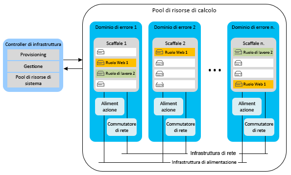
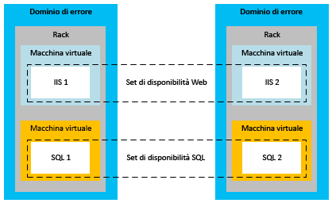
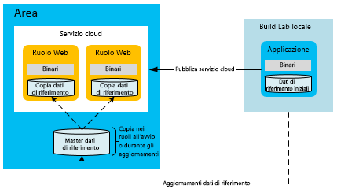
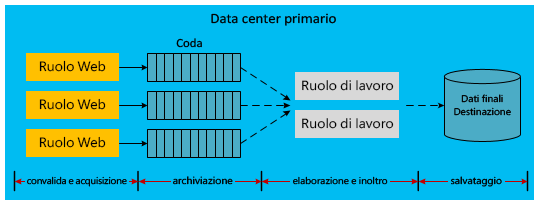

[!INCLUDE [header](../_includes/header.md)]

# Disponibilità elevata per le applicazioni basate su Microsoft Azure
Un'applicazione a disponibilità elevata assorbe le fluttuazioni di disponibilità, carico ed errori temporanei nell'hardware e nei servizi dipendenti. L'applicazione continua a funzionare in modo accettabile in base a quanto definito dai requisiti aziendali o dai contratti di servizio dell'applicazione.

## Funzionalità a disponibilità elevata di Azure
Azure offre numerose funzionalità predefinite della piattaforma che supportano applicazioni a disponibilità elevata. Questa sezione descrive alcune di queste funzionalità chiave.

### Controller di infrastruttura
Il controller di infrastruttura di Azure gestisce il provisioning e il monitoraggio delle condizioni delle istanze di calcolo di Azure. Monitora lo stato dell'hardware e del software delle istanze delle macchine host e guest. Quando rileva un errore, mantiene i contratti di servizio rilocando automaticamente le istanze delle VM. Il contratto di servizio di calcolo è ulteriormente supportato dal concetto dei domini di aggiornamento e di errore.

Quando vengono distribuite più istanze del ruolo del servizio cloud, Azure distribuisce queste istanze in domini di errore diversi. Il limite di un dominio di errore è essenzialmente un diverso rack hardware nella stessa area. I domini di errore riducono le probabilità che un errore hardware localizzato interrompa il servizio di un'applicazione. Non è possibile gestire il numero di domini di errore dei ruoli Web o di lavoro. Il controller di infrastruttura usa risorse dedicate separate dalle applicazioni ospitate in Azure. Richiede un tempo di attività del 100% perché funge da nucleo del sistema Azure e monitora e gestisce le istanze del ruolo nei domini di errore.

La figura seguente illustra le risorse condivise di Azure distribuite e gestite dal controller di infrastruttura nei diversi domini di errore.

Mentre i domini di errore sono separazioni fisiche per l'attenuazione degli errori, i domini di aggiornamento sono unità logiche di separazione delle istanze che determinano quali istanze in un particolare servizio verranno aggiornate in uno specifico momento. Per impostazione predefinita, per la distribuzione del servizio ospitato vengono definiti cinque domini di aggiornamento. È tuttavia possibile modificare tale valore nel file di definizione del servizio. Si supponga ad esempio di avere otto istanze del ruolo Web. Saranno presenti due istanze in tre domini di aggiornamento e due istanze in un dominio di aggiornamento. Azure definisce la sequenza di aggiornamento in base al numero di domini di aggiornamento. Per altre informazioni, vedere [Aggiornare un servizio cloud](/azure/cloud-services/cloud-services-update-azure-service/).

### Funzionalità in altri servizi
Oltre alle funzionalità della piattaforma che supportano la disponibilità elevata delle risorse di calcolo, Azure incorpora funzionalità di disponibilità elevata negli altri servizi. Ad esempio, Archiviazione di Azure mantiene almeno tre repliche di tutti i dati nell'account di archiviazione di Azure. Consente inoltre la replica geografica per archiviare copie dei dati in un'area secondaria. La rete per la distribuzione di contenuti di Azure consente di memorizzare i BLOB nella cache in tutto il mondo a fini di ridondanza, scalabilità e latenza più bassa. Anche il database SQL di Azure gestisce più repliche.

Per una discussione più approfondita sulle funzionalità di disponibilità della piattaforma Azure, vedere [Indicazioni tecniche sulla resilienza](index.md). Vedere inoltre [Best practices for designing large-scale services on Windows Azure](https://azure.microsoft.com/blog/best-practices-for-designing-large-scale-services-on-windows-azure/) (Procedure consigliate per la progettazione di servizi su larga scala in Windows Azure).

Nonostante Azure offra più funzionalità che supportano la disponibilità elevata, è importante conoscerne le limitazioni:

* Per il calcolo, Azure garantisce che i ruoli siano disponibili e in esecuzione, ma non rileva se l'applicazione è in esecuzione o sovraccarica.
* Per il database SQL di Azure, i dati vengono replicati in modo sincrono all'interno dell'area. È possibile scegliere la replica geografica attiva, che consente un massimo di quattro copie aggiuntive del database nella stessa area (o in aree diverse). Mentre le repliche dei database non sono backup temporizzati, il database SQL offre funzionalità di backup temporizzato. Per altre informazioni, vedere [Ripristinare un database SQL di Azure mediante i backup automatici del database: Ripristino temporizzato](/azure/sql-database/sql-database-recovery-using-backups#point-in-time-restore).
* Per Archiviazione di Azure, i dati di BLOB e tabelle vengono replicati per impostazione predefinita in un'area alternativa. Non è tuttavia possibile accedere alle repliche finché Microsoft non sceglie di eseguire il failover nel sito alternativo. Il failover di un'area viene eseguito solo in caso di interruzione prolungata del servizio a livello di area e non esistono contratti di servizio per il tempo di failover geografico. È anche importante notare che qualsiasi danneggiamento dei dati si diffonde rapidamente alle repliche. Per questi motivi, è necessario integrare le funzionalità di disponibilità della piattaforma con funzionalità di disponibilità specifiche dell'applicazione, tra cui la funzionalità di snapshot del BLOB per creare backup temporizzati di dati BLOB.

### Set di disponibilità per le macchine virtuali di Azure
Questo articolo è prevalentemente incentrato sui servizi cloud, che usano un modello di piattaforma distribuita come servizio (PaaS). Esistono anche funzionalità di disponibilità specifiche per le macchine virtuali di Azure, che usano un modello di infrastruttura distribuita come servizio (IaaS). Per ottenere la disponibilità elevata con le macchine virtuali, è necessario usare set di disponibilità, che svolgono una funzione simile ai domini di errore e di aggiornamento. All'interno di un set di disponibilità, Azure posiziona le macchine virtuali in modo da impedire che attività di manutenzione ed errori hardware localizzati arrestino tutte le macchine del gruppo. I set di disponibilità sono necessari per soddisfare i requisiti del contratto di servizio di Azure per la disponibilità delle macchine virtuali.

La figura seguente rappresenta due set di disponibilità, rispettivamente per macchine virtuali Web e di SQL Server.

> [!NOTE]
> Nella figura precedente, SQL Server è installato ed eseguito in macchine virtuali. Il database SQL di Azure, al contrario, viene fornito come servizio gestito.
> 
> 

## Strategie delle applicazioni per la disponibilità elevata
La maggior parte delle strategie delle applicazioni per la disponibilità elevata prevedono la ridondanza o la rimozione di dipendenze rigide tra i componenti dell'applicazione. La progettazione dell'applicazione deve supportare la tolleranza di errore durante sporadici tempi di inattività di Azure o di servizi di terze parti. Le sezioni seguenti descrivono diversi modelli delle applicazioni per migliorare la disponibilità dei servizi cloud.

### Comunicazione asincrona e code durevoli
Per aumentare la disponibilità delle applicazioni Azure, prendere in considerazione la comunicazione asincrona tra servizi a regime di controllo libero. In questo modello, i messaggi vengono scritti nelle code di archiviazione o nelle code del bus di servizio di Azure per l'elaborazione successiva. Quando un messaggio viene scritto nella coda, il controllo torna immediatamente al mittente. L'elaborazione del messaggio viene gestita da un altro servizio dell'applicazione, in genere implementato come ruolo di lavoro. Se il servizio di elaborazione diventa inattivo, i messaggi si accumulano nella coda finché non viene ripristinato il servizio di elaborazione. Non esiste alcuna dipendenza diretta tra mittente front-end ed elaboratore dei messaggi. Questo elimina le chiamate sincrone ai servizi, che nelle applicazioni distribuite possono causare colli di bottiglia.

Una variante di questo modello archivia le informazioni relative alle chiamate al database non riuscite nelle code di Archiviazione di Azure (BLOB, tabelle, code) o del bus di servizio. Se una chiamata sincrona all'interno di un'applicazione verso un altro servizio (come il database SQL di Azure) ha ripetutamente esito negativo, ad esempio, è possibile serializzare tale richiesta in una risorsa di archiviazione durevole. Successivamente, quando il servizio o il database è di nuovo online, l'applicazione può inviare nuovamente la richiesta dalla risorsa di archiviazione. Questo modello si differenzia perché la posizione intermedia viene usata solo in caso di errore e non è una parte costante del flusso di lavoro dell'applicazione.

In entrambi gli scenari, la comunicazione asincrona e l'archiviazione intermedia impediscono a un servizio back-end inattivo di arrestare l'intera applicazione. Le code fungono da intermediario logico. Per altre indicazioni sulla scelta del servizio di accodamento, vedere [Analogie e differenze &mdash; tra le code di Azure e le code del bus di servizio di Azure](/azure/service-bus-messaging/service-bus-azure-and-service-bus-queues-compared-contrasted/).

### Rilevamento degli errori e logica di ripetizione dei tentativi
Un aspetto chiave nella progettazione di applicazioni a disponibilità elevata è l'uso nel codice di logica di ripetizione dei tentativi per gestire correttamente un servizio temporaneamente inattivo. Le versioni recenti degli SDK per Archiviazione di Azure e il bus di servizio di Azure supportano la ripetizione dei tentativi in modo nativo. Per altre informazioni su come fornire logica personalizzata di ripetizione dei tentativi per l'applicazione, vedere [Modello di ripetizione dei tentativi](../patterns/retry.md).

### Modello dei dati di riferimento per la disponibilità elevata
I dati di riferimento sono i dati di sola lettura di un'applicazione. Questi dati forniscono il contesto aziendale all'interno del quale l'applicazione genera dati transazionali nel corso di un'operazione aziendale. L'integrità dei dati transazionali dipende da uno snapshot dei dati di riferimento nel momento in cui la transazione è stata completata.

I dati di riferimento sono necessari per il funzionamento corretto dell'applicazione. Varie applicazioni creano e gestiscono i dati di riferimento. Questa funzione è spesso svolta da sistemi di gestione dei dati master (MDM), Questi sistemi gestiscono il ciclo di vita dei dati di riferimento. I dati di riferimento includono, ad esempio, il catalogo prodotti e i master di dipendenti, parti e attrezzature. I dati di riferimento possono anche avere origine all'esterno dell'organizzazione, come nel caso di CAP e aliquote d'imposta. Le strategie per aumentare la disponibilità dei dati di riferimento sono in genere meno difficoltose di quelle per i dati transazionali. I dati di riferimento hanno il vantaggio di essere prevalentemente immutabili.

I ruoli Web e di lavoro di Azure che usano i dati di riferimento possono essere resi autonomi in fase di esecuzione distribuendo i dati di riferimento con l'applicazione. Questo approccio è ideale se le dimensioni della risorsa di archiviazione locale consentono una distribuzione di questo tipo. L'autonomia delle unità di scala di calcolo di Azure è consentita da database SQL incorporati, database NoSQL o file XML distribuiti in locale. È tuttavia consigliabile usare un meccanismo per aggiornare i dati in ogni ruolo senza che sia necessaria la ridistribuzione. A tale scopo, inserire tutti gli aggiornamenti dei dati di riferimento in un endpoint di archiviazione cloud (ad esempio, il database SQL o l'archiviazione BLOB di Azure). Aggiungere a ogni ruolo codice che scarica gli aggiornamenti dei dati nei nodi di calcolo all'avvio del ruolo. In alternativa, aggiungere codice che consente a un amministratore di eseguire un download forzato nelle istanze del ruolo.

Per aumentare la disponibilità, i ruoli devono contenere anche un set di dati di riferimento nel caso in cui la risorsa di archiviazione sia inattiva. I ruoli possono partire da un set di dati di riferimento di base iniziale finché la risorsa di archiviazione non è disponibile per gli aggiornamenti.

Con questo modello, la distribuzione o il download di grandi quantità di dati di riferimento può aumentare il tempo necessario per avviare nuove distribuzioni o istanze del ruolo. Questo compromesso può essere accettabile per assicurare l'autonomia di avere i dati di riferimento immediatamente disponibili in ogni ruolo anziché dipendere da servizi di archiviazione esterni.

### Modello dei dati transazionali per la disponibilità elevata
I dati transazionali sono i dati generati dall'applicazione in un contesto aziendale. I dati transazionali sono una combinazione dell'insieme dei processi aziendali implementati dall'applicazione e dei dati di riferimento che supportano tali processi. Esempi di dati transazionali possono essere ordini, preavvisi di spedizione, fatture e opportunità di gestione delle relazioni con i clienti (CRM). I dati transazionali vengono inviati a sistemi esterni per il mantenimento dei record o l'ulteriore elaborazione.

I dati di riferimento possono essere modificati nei sistemi responsabili di questi dati. Per questo motivo, i dati transazionali devono salvare il contesto di dati di riferimento temporizzato in modo da ridurre al minimo le dipendenze esterne per la coerenza semantica. Si consideri ad esempio la rimozione di un prodotto dal catalogo alcuni mesi dopo l'evasione di un ordine. In questo caso è consigliabile archiviare con la transazione il massimo contesto di dati di riferimento possibile. In questo modo, la semantica associata alla transazione viene mantenuta anche in caso di modifica dei dati di riferimento dopo l'acquisizione della transazione.

Come indicato in precedenza, le architetture che usano un regime di controllo libero e la comunicazione asincrona possono offrire livelli superiori di disponibilità. Lo stesso vale per i dati transazionali, ma l'implementazione è più complessa. I modelli transazionali tradizionali si basano in genere sul database per garantire la transazione. Quando si introducono livelli intermedi, il codice dell'applicazione deve gestire correttamente i dati a vari livelli per assicurare coerenza e durabilità sufficienti.

La sequenza seguente descrive un flusso di lavoro che separa l'acquisizione dei dati transazionali dalla relativa elaborazione.

1. Nodo di calcolo Web: presentazione dei dati di riferimento.
2. Archiviazione esterna: salvataggio dei dati transazionali intermedi.
3. Nodo di calcolo Web: completamento della transazione dell'utente finale.
4. Nodo di calcolo Web: invio dei dati transazionali completati con il contesto di dati di riferimento a una risorsa di archiviazione durevole temporanea che garantisce una risposta prevedibile.
5. Nodo di calcolo Web: segnalazione all'utente finale del completamento della transazione.
6. Nodo di calcolo in background: estrazione dei dati transazionali, ulteriore elaborazione se necessaria e invio alla posizione di archiviazione finale nel sistema corrente.

La figura seguente illustra una possibile implementazione di questa progettazione in un servizio cloud ospitato in Azure.

Le frecce tratteggiate nella figura precedente indicano l'elaborazione asincrona. Il ruolo Web front-end non rileva questa elaborazione asincrona, che conduce all'archiviazione della transazione nella destinazione finale con riferimento al sistema corrente. A causa della latenza introdotta da questo modello asincrono, i dati transazionali non sono immediatamente disponibili per le query. Ogni unità dei dati transazionali deve quindi essere salvata in una cache o una sessione utente per soddisfare le esigenze immediate dell'interfaccia utente.

Il ruolo Web è autonomo dal resto dell'infrastruttura. Il relativo profilo di disponibilità è dato da una combinazione di ruolo Web e coda di Azure e non dall'intera infrastruttura. Oltre alla disponibilità elevata, questo approccio supporta la scalabilità orizzontale del ruolo Web, indipendentemente dall'archiviazione back-end. Questo modello di disponibilità elevata può influire sull'aspetto economico delle operazioni. Componenti aggiuntivi come ruoli di lavoro e code di Azure possono incidere sui costi d'uso mensili.

La figura precedente illustra un'implementazione di questo approccio disaccoppiato ai dati transazionali. Esistono molte altre possibili implementazioni. Di seguito sono elencate alcune alternative:

* È possibile inserire un ruolo di lavoro tra il ruolo Web e la coda di archiviazione.
* È possibile usare una coda del bus di servizio anziché una coda di Archiviazione di Azure.
* La destinazione finale potrebbe essere Archiviazione di Azure o un diverso provider di database.
* È possibile usare Cache di Azure al livello Web per garantire i requisiti di memorizzazione immediata nella cache dopo la transazione.

### Modelli per la scalabilità
È importante notare che la scalabilità di un servizio cloud influisce direttamente sulla disponibilità. Se il servizio non risponde a causa di un incremento del carico, l'utente ha l'impressione che l'applicazione sia inattiva. Seguire le procedure comprovate per la scalabilità in base al carico previsto per l'applicazione e alle aspettative future. Massimizzare la scalabilità implica molte considerazioni, ad esempio riguardo all'uso di uno o più account di archiviazione, alla condivisione in più database e alle strategie di caching. Per informazioni dettagliate su questi modelli, vedere [Best practices for designing large-scale services on Microsoft Azure](https://azure.microsoft.com/blog/best-practices-for-designing-large-scale-services-on-windows-azure/) (Procedure consigliate per la progettazione di servizi su larga scala in Microsoft Azure).

## Passaggi successivi
Questa serie di documenti illustra il ripristino di emergenza e disponibilità elevata per le applicazioni basate su Microsoft Azure. L'articolo successivo della serie riguarda è [Ripristino di emergenza per le applicazioni basate su Microsoft Azure](disaster-recovery-azure-applications.md).

