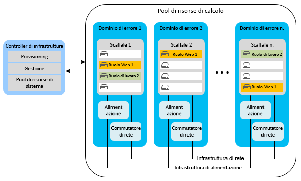
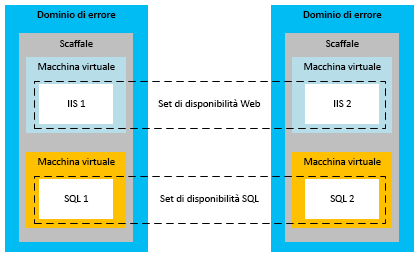
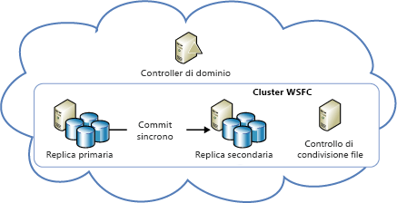
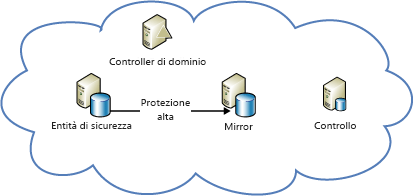

[!INCLUDE [header](../_includes/header.md)]
# Informazioni tecniche sulla resilienza di Azure - Ripristino da errori locali in AzureAzure resiliency technical guidance: Recovery from local failures in Azure

Esistono due principali minacce alla disponibilità delle applicazioni:There are two primary threats to application availability:

* l'errore a livello di dispositivi, come unità e serverThe failure of devices, such as drives and servers
* l'esaurimento di risorse critiche, come in caso di calcolo in condizioni di picco di caricoThe exhaustion of critical resources, such as compute under peak load conditions

Azure offre una combinazione di gestione delle risorse, elasticità, bilanciamento del carico e partizionamento per garantire disponibilità elevata in tali circostanze.Azure provides a combination of resource management, elasticity, load balancing, and partitioning to enable high availability under these circumstances. Alcune di queste funzionalità vengono eseguite automaticamente per tutti i servizi di Azure.Some of these features are performed automatically for all Azure services. In altri casi lo sviluppatore di applicazioni deve completare alcune operazioni aggiuntive per usufruirne.However, in some cases, the application developer must do some additional work to benefit from them.

## Servizi cloudCloud Services
Tutti i servizi cloud di Azure sono raccolte di uno o più ruoli Web o di lavoro.Azure Cloud Services consists of collections of one or more web or worker roles. Una o più istanze di un ruolo possono essere eseguite contemporaneamente.One or more instances of a role can run concurrently. Il numero di istanze è determinato dalla configurazione.The configuration determines the number of instances. Le istanze del ruolo vengono monitorate e gestite con un componente denominato controller di infrastruttura.Role instances are monitored and managed through a component called the fabric controller. Il controller di infrastruttura rileva gli errori software e hardware e risponde a tali errori automaticamente.The fabric controller detects and responds to both software and hardware failures automatically.

Ogni istanza del ruolo viene eseguita in una macchina virtuale (VM) specifica e comunica con il controller di infrastruttura tramite un agente guest.Every role instance runs in its own virtual machine (VM) and communicates with its fabric controller through a guest agent. L'agente guest raccoglie le metriche delle risorse e dei nodi, che includono l'uso della VM, lo stato, i log, l'uso delle risorse, le eccezioni e le condizioni di errore.The guest agent collects resource and node metrics, including VM usage, status, logs, resource usage, exceptions, and failure conditions. Il controller di infrastruttura interroga l'agente guest a intervalli configurabili e riavvia la VM se l'agente guest non risponde.The fabric controller queries the guest agent at configurable intervals, and it restarts the VM if the guest agent fails to respond. In caso di errore hardware, il controller di infrastruttura associato sposta tutte le istanze del ruolo interessate in un nuovo nodo hardware e riconfigura la rete per indirizzare il traffico a tale nodo.In the event of hardware failure, the associated fabric controller moves all affected role instances to a new hardware node and reconfigures the network to route traffic there.

Per usufruire di queste funzionalità, gli sviluppatori devono assicurarsi che tutti i ruoli del servizio evitino di archiviare lo stato nelle istanze del ruolo.To benefit from these features, developers should ensure that all service roles avoid storing state on the role instances. Tutti i dati persistenti devono essere invece accessibili da una risorsa di archiviazione durevole, come i servizi di archiviazione di Azure o il database SQL di Azure.Instead, all persistent data should be accessed from durable storage, such as Azure Storage or Azure SQL Database. In questo modo, qualsiasi ruolo può gestire le richieste.This allows any roles to handle requests. Le istanze del ruolo possono anche diventare inattive in qualsiasi momento senza che si creino incoerenze nello stato temporaneo o permanente del servizio.It also means that role instances can go down at any time without creating inconsistencies in the transient or persistent state of the service.

Il requisito dell'archiviazione dello stato all'esterno dei ruoli ha diverse implicazioni.The requirement to store state externally to the roles has several implications. Implica, ad esempio, che tutte le modifiche correlate in una tabella di archiviazione di Azure dovrebbero essere eseguite, se possibile, in una singola transazione del gruppo di entità.It implies, for example, that all related changes to an Azure Storage table should be changed in a single entity-group transaction, if possible. Naturalmente, non sempre è possibile apportare tutte le modifiche in una singola transazione.Of course, it isn't always possible to make all changes in a single transaction. È necessario prestare particolare attenzione per assicurare che gli errori delle istanze del ruolo non causino problemi quando determinano l'interruzione di operazioni con esecuzione prolungata che coprono due o più aggiornamenti dello stato permanente del servizio.You must take special care to ensure that role instance failures do not cause problems when they interrupt long-running operations that span two or more updates to the persistent state of the service. Se un altro ruolo ritenta un'operazione di questo tipo, deve prevedere e gestire l'eventualità che sia stata parzialmente completata.If another role attempts to retry such an operation, it should anticipate and handle the case where the work was partially completed.

In un servizio che partiziona i dati in più archivi, ad esempio,For example, consider a service that partitions data across multiple stores. se un ruolo di lavoro diventa inattivo durante la rilocazione di una partizione, la rilocazione potrebbe non essere completaIf a worker role goes down while it's relocating a shard, the relocation of the shard might not finish. oppure potrebbe essere ripetuta dall'inizio da un diverso ruolo di lavoro causando potenzialmente dati orfani o un danneggiamento dei dati.Or the relocation might be repeated from its inception by a different worker role, potentially causing orphaned data or data corruption. Per prevenire problemi, è necessario che le operazioni con esecuzione prolungata siano di una o di entrambe le tipologie:To prevent problems, long-running operations must be one or both of the following:

* *Idempotenti*: ripetibili senza effetti collaterali.*Idempotent*: Repeatable without side effects. Per essere idempotente, un'operazione con esecuzione prolungata deve avere lo stesso effetto a prescindere da quante volte viene eseguita, anche in caso di interruzione durante l'esecuzione.To be idempotent, a long-running operation should have the same effect no matter how many times it's executed, even when it's interrupted during execution.
* *Riavviabili in modalità incrementale*: in grado di continuare dal punto di errore più recente.*Incrementally restartable*: Able to continue from the most recent point of failure. Per essere riavviabile in modo incrementale, un'operazione con esecuzione prolungata deve essere costituita da una sequenza di operazioni atomiche più piccole.To be incrementally restartable, a long-running operation should consist of a sequence of smaller atomic operations. Deve inoltre registrare il proprio stato di avanzamento in una risorsa di archiviazione durevole, in modo che ogni successiva chiamata riprenda dal punto in cui è stata interrotta la precedente.It should also record its progress in durable storage, so that each subsequent invocation picks up where its predecessor stopped.

Tutte le operazioni con esecuzione prolungata, infine, devono essere richiamate ripetutamente fino a quando non vengono completate.Finally, all long-running operations should be invoked repeatedly until they succeed. Un'operazione di provisioning, ad esempio, potrebbe essere inserita in una coda di Azure ed essere rimossa dalla coda da un ruolo di lavoro solo quando viene completata.For example, a provisioning operation might be placed in an Azure queue, and then removed from the queue by a worker role only when it succeeds. Per pulire i dati creati dalle operazioni interrotte potrebbe essere necessaria un'operazione di Garbage Collection.Garbage collection might be necessary to clean up data that interrupted operations create.

### ElasticitàElasticity
Il numero iniziale di istanze eseguite per ogni ruolo è determinato nella configurazione del ruolo.The initial number of instances running for each role is determined in each role’s configuration. Gli amministratori devono configurare inizialmente i singoli ruoli per l'esecuzione con due o più istanze in base al carico previsto.Administrators should initially configure each role to run with two or more instances based on expected load. Le istanze del ruolo, tuttavia, possono essere facilmente aumentate o ridotte in caso di variazione dei modelli d'uso.But you can easily scale role instances up or down as usage patterns change. Questa operazione può essere eseguita manualmente nel portale di Azure oppure essere automatizzata con Windows PowerShell, l'API Gestione dei servizi o strumenti di terze parti.You can do this manually in the Azure portal, or you can automate the process by using Windows PowerShell, the Service Management API, or third-party tools. Per altre informazioni, vedere [Come ridimensionare automaticamente un'applicazione](/azure/cloud-services/cloud-services-how-to-scale/).For more information, see [How to autoscale an application](/azure/cloud-services/cloud-services-how-to-scale/).

### PartizionamentoPartitioning
Il controller di infrastruttura di Azure usa due tipi di partizioni:The Azure fabric controller uses two types of partitions:

* Un *dominio di aggiornamento* viene usato per aggiornare le istanze del ruolo di un servizio in gruppi.An *update domain* is used to upgrade a service’s role instances in groups. Azure distribuisce le istanze del servizio in più domini di aggiornamento.Azure deploys service instances into multiple update domains. Per un aggiornamento sul posto, il controller di infrastruttura arresta tutte le istanze in un dominio di aggiornamento, le aggiorna e quindi le riavvia prima di passare al dominio di aggiornamento successivo.For an in-place update, the fabric controller brings down all the instances in one update domain, updates them, and then restarts them before moving to the next update domain. Questo approccio impedisce che l'intero servizio risulti non disponibile durante il processo di aggiornamento.This approach prevents the entire service from being unavailable during the update process.
* Un *dominio di errore* definisce i potenziali punti di errore hardware o di rete.A *fault domain* defines potential points of hardware or network failure. Per qualsiasi ruolo con più istanze, il controller di infrastruttura assicura che le istanze vengano distribuite in più domini di errore, in modo da impedire che errori hardware isolati interrompano il servizio.For any role that has more than one instance, the fabric controller ensures that the instances are distributed across multiple fault domains, to prevent isolated hardware failures from disrupting service. I domini di errore controllano interamente l'esposizione a errori del server o del cluster.Fault domains govern all exposure to server and cluster failures.

In base al [contratto di servizio di Azure](https://azure.microsoft.com/support/legal/sla/), Microsoft garantisce che in caso di distribuzione di due o più istanze di ruoli Web in domini di errore e di aggiornamento diversi sarà disponibile la connessione esterna per almeno il 99,95% del tempo.The [Azure service-level agreement (SLA)](https://azure.microsoft.com/support/legal/sla/) guarantees that when two or more web role instances are deployed to different fault and upgrade domains, they'll have external connectivity at least 99.95 percent of the time. A differenza dei domini di aggiornamento, non è possibile controllare il numero di domini di errore.Unlike update domains, there's no way to control the number of fault domains. Azure esegue automaticamente l'allocazione dei domini di errore e la distribuzione negli stessi delle istanze del ruolo.Azure automatically allocates fault domains and distributes role instances across them. Per garantire che qualsiasi ruolo con almeno due istanze soddisfi i requisiti del contratto di servizio, almeno le prime due istanze di ogni ruolo vengono inserite in domini di errore e di aggiornamento diversi,At least the first two instances of every role are placed in different fault and upgrade domains to ensure that any role with at least two instances will satisfy the SLA. come illustrato nella figura seguente:This is represented in the following diagram.

### Bilanciamento del carico.Load balancing
Tutto il traffico in ingresso verso un ruolo Web passa attraverso un servizio di bilanciamento del carico senza stato che distribuisce le richieste client tra le istanze del ruolo.All inbound traffic to a web role passes through a stateless load balancer, which distributes client requests among the role instances. Le singole istanze di ruoli non dispongono di indirizzi IP pubblici e non sono indirizzabili direttamente da Internet.Individual role instances do not have public IP addresses, and they are not directly addressable from the Internet. Poiché i ruoli Web sono senza stato, qualsiasi richiesta client può essere indirizzata a qualsiasi istanza del ruolo.Web roles are stateless so that any client request can be routed to any role instance. Ogni 15 secondi viene generato un evento [StatusCheck](https://msdn.microsoft.com/library/microsoft.windowsazure.serviceruntime.roleenvironment.statuscheck.aspx),A [StatusCheck](https://msdn.microsoft.com/library/microsoft.windowsazure.serviceruntime.roleenvironment.statuscheck.aspx) event is raised every 15 seconds. che può essere usato per indicare se il ruolo è pronto per ricevere traffico oppure è occupato e deve essere escluso dalla rotazione del servizio di bilanciamento del carico.You can use this to indicate whether the role is ready to receive traffic, or whether it's busy and should be taken out of the load-balancer rotation.

## Macchine virtualiVirtual Machines
In relazione alla disponibilità elevata, Macchine virtuali di Azure si differenzia dai ruoli di calcolo della piattaforma distribuita come servizio (PaaS) sotto diversi aspetti.Azure Virtual Machines differs from platform as a service (PaaS) compute roles in several respects in relation to high availability. In alcuni casi, per garantire disponibilità elevata sono necessarie operazioni aggiuntive.In some instances, you must do additional work to ensure high availability.

### Durabilità dei dischiDisk durability
A differenza delle istanze del ruolo PaaS, i dati archiviati in unità di macchine virtuali sono persistenti anche in caso di rilocazione della macchina virtuale.Unlike PaaS role instances, data stored on virtual machine drives is persistent even when the virtual machine is relocated. Le macchine virtuali di Azure usano dischi di VM esistenti come BLOB in Archiviazione di Azure.Azure virtual machines use VM disks that exist as blobs in Azure Storage. Grazie alle caratteristiche di disponibilità di Archiviazione di Azure, anche i dati archiviati nelle unità di una macchina virtuale sono a disponibilità elevata.Because of the availability characteristics of Azure Storage, the data stored on a virtual machine’s drives is also highly available.

Si noti che l'unità D: nelle macchine virtuali Windows rappresenta un'eccezione a questa regola.Note that drive D (in Windows VMs) is the exception to this rule. L'unità D: è di fatto la risorsa di archiviazione fisica del server del rack che ospita la VM e i relativi dati andranno persi in caso di riciclo della VM.Drive D is actually physical storage on the rack server that hosts the VM, and its data will be lost if the VM is recycled. L'unità D: è destinata esclusivamente all'archiviazione temporanea.Drive D is intended for temporary storage only. In Linux Azure espone "solitamente", ma non sempre, il disco temporaneo locale dome dispositivo di blocco /dev/sdb.In Linux, Azure “usually” (but not always) exposes the local temporary disk as /dev/sdb block device. Viene spesso montato dall'agente Linux di Azure come punti di montaggio /mnt/resource o /mnt. Questo elemento può essere configurato tramite /etc/waagent.conf.It is often mounted by the Azure Linux Agent as /mnt/resource or /mnt mount points (configurable via /etc/waagent.conf).

### PartizionamentoPartitioning
Azure riconosce in modo nativo i livelli in un'applicazione PaaS (ruolo Web e ruolo di lavoro) e può quindi distribuirli correttamente nei domini di errore e di aggiornamento.Azure natively understands the tiers in a PaaS application (web role and worker role) and thus can properly distribute them across fault and update domains. Al contrario, i livelli in un'applicazione di infrastruttura distribuita come servizio (IaaS) devono essere definiti manualmente tramite set di disponibilità.In contrast, the tiers in an infrastructure as a service (IaaS) application must be manually defined through availability sets. I set di disponibilità sono necessari per un contratto di servizio correlato a IaaS.Availability sets are required for an SLA under IaaS.

Nella figura precedente, il livello IIS (Internet Information Services), che funge da livello app Web, e il livello SQL, che funge da livello dati, sono assegnati a set di disponibilità diversi.In the preceding diagram, the Internet Information Services (IIS) tier (which works as a web app tier) and the SQL tier (which works as a data tier) are assigned to different availability sets. Ciò garantisce la ridondanza hardware di tutte le istanze di ogni livello, grazie alla distribuzione delle macchine virtuali nei domini di errore, e assicura che tutti i livelli non vengano disattivati durante un aggiornamento.This ensures that all instances of each tier have hardware redundancy by distributing virtual machines across fault domains, and that entire tiers are not taken down during an update.

### Bilanciamento del carico.Load balancing
Se il traffico deve essere distribuito tra le VM, è necessario raggruppare le VM di un'applicazione e bilanciare il carico in uno specifico endpoint TCP o UDP.If the VMs should have traffic distributed across them, you must group the VMs in an application and load balance across a specific TCP or UDP endpoint. Per altre informazioni, vedere [Bilanciamento del carico delle macchine virtuali](/azure/virtual-machines/virtual-machines-linux-load-balance/?toc=%2fazure%2fvirtual-machines%2flinux%2ftoc.json).For more information, see [Load balancing virtual machines](/azure/virtual-machines/virtual-machines-linux-load-balance/?toc=%2fazure%2fvirtual-machines%2flinux%2ftoc.json). Se le VM ricevono input da un'altra origine (ad esempio, un meccanismo di accodamento), non è necessario un servizio di bilanciamento del carico.If the VMs receive input from another source (for example, a queuing mechanism), a load balancer is not required. Il servizio di bilanciamento del carico usa un controllo dell'integrità di base per determinare se il traffico deve essere inviato al nodo.The load balancer uses a basic health check to determine whether traffic should be sent to the node. È anche possibile creare probe personalizzati per implementare metriche sull'integrità specifiche dell'applicazione che determinano se la VM deve ricevere traffico.It's also possible to create your own probes to implement application-specific health metrics that determine whether the VM should receive traffic.

## ArchiviazioneStorage
Archiviazione di Azure è il servizio dati durevoli di base per Azure,Azure Storage is the baseline durable data service for Azure. che offre archiviazione BLOB, tabelle, code e per dischi di VM.It provides blob, table, queue, and VM disk storage. Per garantire disponibilità elevata in un singolo data center, usa una combinazione di replica e gestione delle risorse.It uses a combination of replication and resource management to provide high availability within a single datacenter. Il contratto di servizio relativo alla disponibilità di Archiviazione di Azure garantisce una disponibilità di almeno il 99,9%:The Azure Storage availability SLA guarantees that at least 99.9 percent of the time:

* Le richieste con formato corretto di aggiungere, aggiornare ed eliminare i dati verranno elaborate correttamente.Correctly formatted requests to add, update, read, and delete data will be successfully and correctly processed.
* Gli account di archiviazione disporranno della connettività al gateway Internet.Storage accounts will have connectivity to the Internet gateway.

### ReplicaReplication
Archiviazione di Azure agevola la durabilità dei dati eseguendo la manutenzione di più copie di tutti i dati in diverse unità che risiedono in sottosistemi di archiviazione fisica completamente indipendenti all'interno dell'area.Azure Storage facilitates data durability by maintaining multiple copies of all data on different drives across fully independent physical storage subsystems within the region. I dati vengono replicati in modo sincrono e prima che la scrittura venga confermata viene eseguito il commit di tutte le copie.Data is replicated synchronously, and all copies are committed before the write is acknowledged. L'elevato livello di coerenza di Archiviazione di Azure garantisce che le letture riflettano le scritture più recenti.Azure Storage is strongly consistent, meaning that reads are guaranteed to reflect the most recent writes. Le copie dei dati, inoltre, vengono continuamente analizzate per rilevare e riparare il decadimento dei bit, che costituisce una minaccia spesso trascurata all'integrità dei dati archiviati.In addition, copies of data are continually scanned to detect and repair bit rot, an often overlooked threat to the integrity of stored data.

I servizi usufruiscono della replica semplicemente usando Archiviazione di Azure.Services benefit from replication just by using Azure Storage. Lo sviluppatore di servizi non deve eseguire operazioni aggiuntive per il ripristino da un errore locale.The service developer doesn't need to do additional work to recover from a local failure.

### Resource managementResource management
Le dimensioni degli account di archiviazione creati dopo il maggio 2014 possono aumentare fino a 500 TB (in precedenza, il massimo era 200 TB).Storage accounts created after May 2014, can grow to up to 500 TB (the previous maximum was 200 TB). Se è necessario spazio aggiuntivo, le applicazioni devono essere progettate in modo da sfruttare più account di archiviazione.If additional space is required, applications must be designed to use multiple storage accounts.

### Dischi delle macchine virtualiVirtual machine disks
Un disco di una macchina virtuale viene archiviato in Archiviazione di Azure come BLOB di pagine, con le stesse caratteristiche di durabilità e scalabilità dell'archiviazione BLOB.A virtual machine’s disk is stored as a page blob in Azure Storage, giving it all the same durability and scalability properties as Blob storage. Questa progettazione assicura la persistenza dei dati in un disco di una macchina virtuale anche se si verifica un errore nel server che esegue la VM e la VM deve essere riavviata in un altro server.This design makes the data on a virtual machine’s disk persistent, even if the server running the VM fails and the VM must be restarted on another server.

## DatabaseDatabase
### Database SQLSQL Database
Il database SQL di Azure offre un database come servizio.Azure SQL Database provides database as a service. Consente alle applicazioni di eseguire il provisioning di database relazionali, inserirvi dati ed eseguire query con rapidità.It allows applications to quickly provision, insert data into, and query relational databases. Fornisce molte delle familiari funzioni e funzionalità di SQL Server eliminando l'impegno in termini di hardware, configurazione, applicazione di patch e resilienza.It provides many of the familiar SQL Server features and functionality, while abstracting the burden of hardware, configuration, patching, and resiliency.

> [!NOTE]
> Il database di SQL Azure non offre parità di funzionalità 1 a 1 con SQL Server.Azure SQL Database does not provide one-to-one feature parity with SQL Server. È destinato a soddisfare un diverso set di requisiti adatto specificamente alle applicazioni cloud: scalabilità elastica, database distribuito come servizio per ridurre i costi di manutenzione e così via.It's intended to fulfill a different set of requirements--one that's uniquely suited to cloud applications (elastic scale, database as a service to reduce maintenance costs, and so on). Per altre informazioni, vedere [Scegliere un'opzione di SQL Server cloud: database SQL di Azure (PaaS) o SQL Server in VM di Azure (IaaS)](/azure/sql-database/sql-database-paas-vs-sql-server-iaas/).For more information, see [Choose a cloud SQL Server option: Azure SQL (PaaS) Database or SQL Server on Azure VMs (IaaS)](/azure/sql-database/sql-database-paas-vs-sql-server-iaas/).
> 
> 

#### ReplicaReplication
Il database SQL di Azure offre resilienza predefinita agli errori a livello di nodo.Azure SQL Database provides built-in resiliency to node-level failure. Tutte le scritture in un database vengono replicate automaticamente in due o più nodi in background tramite una tecnica di commit del quorum.All writes into a database are automatically replicated to two or more background nodes through a quorum commit technique. Il nodo primario e almeno un nodo secondario devono confermare la scrittura dell'attività nel log delle transazioni prima che la transazione venga considerata riuscita e completata. In caso di errore del nodo, viene eseguito automaticamente il failover del database in una delle due repliche secondarie.(The primary and at least one secondary must confirm that the activity is written to the transaction log before the transaction is deemed successful and returns.) In the case of node failure, the database automatically fails over to one of the secondary replicas. Questo causa un'interruzione temporanea della connessione per le applicazioni client.This causes a transient connection interruption for client applications. Per questo motivo, tutti i client del database SQL di Microsoft Azure devono implementare qualche forma di gestione temporanea della connessione.For this reason, all Azure SQL Database clients must implement some form of transient connection handling. Per ulteriori informazioni, vedere [Linee guida specifiche del servizio di ripetizione dei tentativi](/azure/best-practices-retry-service-specific/).For more information, see [Retry service specific guidance](/azure/best-practices-retry-service-specific/).

#### Resource managementResource management
Ogni database, al momento della creazione, viene configurato con un limite massimo di dimensioni.Each database, when created, is configured with an upper size limit. Le dimensioni massime attualmente disponibili sono pari a 1 TB. I limiti per le dimensioni dipendono dal livello di servizio specifico. Vedere [Livelli di servizio e livelli di prestazioni dei database SQL di Azure](/azure/sql-database/sql-database-resource-limits/#service-tiers-and-performance-levels).The currently available maximum size is 1 TB (size limits vary based on your service tier, see [service tiers and performance levels of Azure SQL Databases](/azure/sql-database/sql-database-resource-limits/#service-tiers-and-performance-levels). Quando raggiunge il proprio limite massimo di dimensioni, il database rifiuta i comandi INSERT o UPDATE aggiuntivi.When a database hits its upper size limit, it rejects additional INSERT or UPDATE commands. È ancora possibile eseguire query ed eliminare dati.(Querying and deleting data is still possible.)

All'interno di un database, il database SQL di Microsoft Azure usa un'infrastruttura per gestire le risorse.Within a database, Azure SQL Database uses a fabric to manage resources. Per rilevare gli errori, tuttavia, usa una topologia ad anello anziché un controller di infrastruttura.However, instead of a fabric controller, it uses a ring topology to detect failures. Ogni replica in un cluster ha due vicini e la responsabilità di rilevare quando sono inattivi.Every replica in a cluster has two neighbors and is responsible for detecting when they go down. Quando una replica diventa inattiva, i vicini attivano un agente di riconfigurazione per ricrearla in un'altra macchina.When a replica goes down, its neighbors trigger a reconfiguration agent to re-create it on another machine. La limitazione del motore viene fornita per garantire che un server logico non usi troppe risorse in una macchina o ne superi i limiti fisici.Engine throttling is provided to ensure that a logical server doesn't use too many resources on a machine or exceed the machine’s physical limits.

### ElasticitàElasticity
Se le esigenze dell'applicazione superano il limite di 1 TB del database, deve essere implementato un approccio di aumento delle istanze.If the application requires more than the 1 TB database limit, it must implement a scale-out approach. Con il database SQL di Azure, la scalabilità orizzontale viene eseguita con il partizionamento manuale dei dati, noto anche come partizionamento orizzontale, in più database SQL di Azure.You scale out with Azure SQL Database by manually partitioning, also known as sharding, data across multiple SQL databases. Questo approccio di aumento delle istanze offre l'opportunità di ottenere una crescita proporzionale quasi lineare dei costi.This scale-out approach provides the opportunity to achieve nearly linear cost growth with scale. La crescita elastica consente di aumentare la capacità su richiesta con costi incrementali in base alle esigenze, perché i database vengono fatturati in base alle dimensioni effettive medie usate al giorno, non in base alle dimensioni massime possibili.Elastic growth or capacity on demand can grow with incremental costs as needed because databases are billed based on the average actual size used per day, not based on maximum possible size.

## SQL Server nelle macchine virtualiSQL Server on Virtual Machines
Installando SQL Server (versione 2014 o successiva) in Macchine virtuali di Azure, è possibile sfruttare le funzionalità di disponibilità tradizionali di SQL Server,By installing SQL Server (version 2014 or later) on Azure Virtual Machines, you can take advantage of the traditional availability features of SQL Server. come Gruppi di disponibilità AlwaysOn o il mirroring del database.These features include AlwaysOn Availability Groups and database mirroring. Si noti che le VM, l'archiviazione e la rete di Azure hanno caratteristiche operative diverse rispetto a un'infrastruttura IT locale non virtualizzata.Note that Azure VMs, storage, and networking have different operational characteristics than an on-premises, non-virtualized IT infrastructure. Per la corretta implementazione di una soluzione di disponibilità elevata/ripristino di emergenza (HADR) di SQL Server in Azure è necessario conoscere queste differenze e progettare una soluzione adeguata.A successful implementation of a high availability/disaster recovery (HA/DR) SQL Server solution in Azure requires that you understand these differences and design your solution to accommodate them.

### Nodi a disponibilità elevata in un set di disponibilitàHigh-availability nodes in an availability set
Quando si implementa una soluzione a disponibilità elevata in Azure, è possibile usare il set di disponibilità in Azure per inserire i nodi a disponibilità elevata in domini di errore e di aggiornamento separati.When you implement a high-availability solution in Azure, you can use the availability set in Azure to place the high-availability nodes into separate fault domains and upgrade domains. Per maggiore chiarezza, il set di disponibilità è un concetto di Azure.To be clear, the availability set is an Azure concept. È una procedura consigliata da seguire per assicurarsi che i database siano effettivamente a disponibilità elevata, indipendentemente dal fatto che si usino Gruppi di disponibilità AlwaysOn, il mirroring del database o altro.It's a best practice that you should follow to make sure that your databases are indeed highly available, whether you're using AlwaysOn Availability Groups, database mirroring, or something else. Se non si segue questa procedura consigliata, si potrebbe erroneamente presumere che il sistema sia a disponibilità elevata.If you don't follow this best practice, you might be under the false assumption that your system is highly available. In realtà si possono verificare errori in tutti i nodi simultaneamente perché i nodi sono inseriti nello stesso dominio di errore nell'area di Azure.But in reality, your nodes can all fail simultaneously because they happen to be placed in the same fault domain in the Azure region.

Questa raccomandazione non si applica con il log shipping.This recommendation is not as applicable with log shipping. Con questa funzionalità di ripristino di emergenza è consigliabile assicurarsi che i server siano in esecuzione in aree di Azure separate.As a disaster recovery feature, you should ensure that the servers are running in separate Azure regions. Per definizione, queste aree sono domini di errore separati.By definition, these regions are separate fault domains.

Per fare in modo che le macchine virtuali dei servizi cloud di Azure distribuite tramite il portale classico si trovino nello stesso set di disponibilità, è necessario distribuirle nello stesso servizio cloud.For Azure Cloud Services VMs deployed through the classic portal to be in the same availability set, you must deploy them in the same Cloud Service. Le macchine virtuale distribuite tramite Azure Resource Manager (portale corrente) non presentano questa limitazione.VMs deployed through Azure Resource Manager (the current portal) do not have this limitation. Per le macchine virtuali distribuite tramite il portale classico nel servizio cloud di Azure solo i nodi che si trovano nello stesso servizio cloud possono partecipare allo stesso set di disponibilità.For classic portal deployed VMs in Azure Cloud Service, only nodes in the same Cloud Service can participate in the same availability set. Le VM dei servizi cloud, inoltre, devono far parte della stessa rete virtuale in modo da mantenere i propri IP anche dopo la correzione del servizio.In addition, the Cloud Services VMs should be in the same virtual network to ensure that they maintain their IPs even after service healing. Ciò consente di evitare interruzioni all'aggiornamento DNS.This avoids DNS update disruptions.

### Solo Azure: soluzioni a disponibilità elevataAzure-only: High-availability solutions
È possibile disporre di una soluzione a disponibilità elevata per i database di SQL Server in Azure tramite i gruppi di disponibilità AlwaysOn o il mirroring del database.You can have a high-availability solution for your SQL Server databases in Azure by using AlwaysOn Availability Groups or database mirroring.

La figura seguente illustra l'architettura di Gruppi di disponibilità AlwaysOn in esecuzione in macchine virtuali di Azure.The following diagram demonstrates the architecture of AlwaysOn Availability Groups running on Azure Virtual Machines. Questa figura è tratta dall'articolo di approfondimento sull'argomento [Disponibilità elevata e ripristino di emergenza per SQL Server nelle macchine virtuali di Azure](/azure/virtual-machines/windows/sql/virtual-machines-windows-sql-high-availability-dr/).This diagram was taken from the in-depth article on this subject, [High availability and disaster recovery for SQL Server on Azure Virtual Machines](/azure/virtual-machines/windows/sql/virtual-machines-windows-sql-high-availability-dr/).

È anche possibile effettuare automaticamente il provisioning della distribuzione di un gruppo di disponibilità AlwaysOn end-to-end in VM di Azure usando il modello AlwaysOn nel portale di Azure.You can also automatically provision an AlwaysOn Availability Groups deployment end-to-end on Azure VMs by using the AlwaysOn template in the Azure portal. Per altre informazioni, vedere l' [offerta di SQL Server AlwaysOn nella raccolta del portale di Microsoft Azure](https://blogs.technet.microsoft.com/dataplatforminsider/2014/08/25/sql-server-alwayson-offering-in-microsoft-azure-portal-gallery/).For more information, see [SQL Server AlwaysOn Offering in Microsoft Azure Portal Gallery](https://blogs.technet.microsoft.com/dataplatforminsider/2014/08/25/sql-server-alwayson-offering-in-microsoft-azure-portal-gallery/).

La figura seguente illustra l'uso del mirroring del database nelle macchine virtuali di Azure.The following diagram demonstrates the use of database mirroring on Azure Virtual Machines. Anche questa figura è tratta dall'argomento di approfondimento [Disponibilità elevata e ripristino di emergenza per SQL Server nelle macchine virtuali di Azure](/azure/virtual-machines/windows/sql/virtual-machines-windows-sql-high-availability-dr/).It was also taken from the in-depth topic [High availability and disaster recovery for SQL Server on Azure Virtual Machines](/azure/virtual-machines/windows/sql/virtual-machines-windows-sql-high-availability-dr/).

> [!NOTE]
> In entrambe le architetture è necessario un controller di dominio.Both architectures require a domain controller. Con il mirroring del database, tuttavia, è possibile usare certificati del server per eliminare la necessità di un controller di dominio.However, with database mirroring, it's possible to use server certificates to eliminate the need for a domain controller.
> 
> 

## Altri servizi della piattaforma AzureOther Azure platform services
Le applicazioni basate su Azure usufruiscono delle funzionalità della piattaforma per il ripristino da errori locali.Applications that are built on Azure benefit from platform capabilities to recover from local failures. In alcuni casi, è possibile eseguire azioni specifiche per aumentare la disponibilità per un determinato scenario.In some cases, you can take specific actions to increase availability for your specific scenario.

### Bus di servizioService Bus
Per attenuare gli effetti di un'interruzione temporanea del bus di servizio di Azure, può essere opportuno creare una coda durevole sul lato client.To mitigate against a temporary outage of Azure Service Bus, consider creating a durable client-side queue. In questo modo viene usato temporaneamente un meccanismo di archiviazione locale alternativo per archiviare i messaggi che non possono essere aggiunti alla coda del bus di servizio.This temporarily uses an alternate, local storage mechanism to store messages that cannot be added to the Service Bus queue. L'applicazione può decidere come gestire i messaggi archiviati temporaneamente dopo che è stato ripristinato il servizio.The application can decide how to handle the temporarily stored messages after the service is restored. Per altre informazioni, vedere [Procedure consigliate per il miglioramento delle prestazioni tramite la messaggistica negoziata del bus di servizio](/azure/service-bus-messaging/service-bus-performance-improvements/) e [Bus di servizio (ripristino di emergenza)](recovery-loss-azure-region.md#other-azure-platform-services).For more information, see [Best practices for performance improvements using Service Bus brokered messaging](/azure/service-bus-messaging/service-bus-performance-improvements/) and [Service Bus (disaster recovery)](recovery-loss-azure-region.md#other-azure-platform-services).

### HDInsightHDInsight
I dati associati ad AzureHDInsight vengono archiviati per impostazione predefinita nell'archivio BLOB di Azure.The data that's associated with Azure HDInsight is stored by default in Azure Blob storage. Archiviazione di Azure specifica le proprietà di durabilità e disponibilità elevata per l'archiviazione Blob.Azure Storage specifies high-availability and durability properties for Blob storage. L'elaborazione multinodo associata ai processi Hadoop MapReduce viene eseguita in Hadoop Distributed File System (HDFS), di cui HDInsight effettua il provisioning quando necessario.The multiple-node processing that's associated with Hadoop MapReduce jobs occurs on a transient Hadoop Distributed File System (HDFS) that is provisioned when HDInsight needs it. Anche i risultati di un processo MapReduce vengono archiviati per impostazione predefinita nell'archivio BLOB di Azure, quindi i dati elaborati sono durevoli e mantengono la disponibilità elevata dopo il deprovisioning del cluster Hadoop.Results from a MapReduce job are also stored by default in Azure Blob storage, so that the processed data is durable and remains highly available after the Hadoop cluster is deprovisioned. Per altre informazioni, vedere la sezione relativa a [HDInsight (in relazione al ripristino di emergenza)](recovery-loss-azure-region.md#other-azure-platform-services).For more information, see [HDInsight (disaster recovery)](recovery-loss-azure-region.md#other-azure-platform-services).

## Elenchi di controllo: errori localiChecklists for local failures
### Servizi cloudCloud Services
1. Vedere la sezione Servizi cloud di questo documento.Review the Cloud Services section of this document.
2. Configurare almeno due istanze per ogni ruolo.Configure at least two instances for each role.
3. Rendere persistente lo stato nella risorsa di archiviazione durevole, non nelle istanze del ruolo.Persist state in durable storage, not on role instances.
4. Gestire correttamente l'evento StatusCheck.Correctly handle the StatusCheck event.
5. Eseguire il wrapping in transazioni delle modifiche correlate, quando possibile.Wrap related changes in transactions when possible.
6. Verificare che le attività dei ruoli di lavoro siano idempotenti e riavviabili.Verify that worker role tasks are idempotent and restartable.
7. Continuare a richiamare le operazioni finché non vengono completate.Continue to invoke operations until they succeed.
8. Prendere in considerazione strategie di scalabilità automatica.Consider autoscaling strategies.

### Macchine virtualiVirtual Machines
1. Vedere la sezione Macchine virtuali di questo documento.Review the Virtual Machines section of this document.
2. Non usare l'unità D: per l'archiviazione persistente.Do not use drive D for persistent storage.
3. Raggruppare le macchine di un livello del servizio in un set di disponibilità.Group machines in a service tier into an availability set.
4. Configurare il bilanciamento del carico e probe facoltativi.Configure load balancing and optional probes.

### ArchiviazioneStorage
1. Vedere la sezione Archiviazione di questo documento.Review the Storage section of this document.
2. Quando la larghezza di banda o i dati superano le quote, usare più account di archiviazione.Use multiple storage accounts when data or bandwidth exceeds quotas.

### Database SQLSQL Database
1. Vedere la sezione Database SQL di questo documento.Review the SQL Database section of this document.
2. Implementare un criterio di ripetizione dei tentativi per gestire gli errori temporanei.Implement a retry policy to handle transient errors.
3. Usare il partizionamento orizzontale come strategia di aumento delle istanze.Use partitioning/sharding as a scale-out strategy.

### SQL Server nelle macchine virtualiSQL Server on Virtual Machines
1. Vedere la sezione SQL Server nelle macchine virtuali di questo documento.Review the SQL Server on Virtual Machines section of this document.
2. Seguire le raccomandazioni precedenti per le macchine virtuali.Follow the previous recommendations for Virtual Machines.
3. Usare le funzionalità di disponibilità elevata di SQL Server, come AlwaysOn.Use SQL Server high availability features, such as AlwaysOn.

### Bus di servizioService Bus
1. Vedere la sezione Bus di servizio di questo documento.Review the Service Bus section of this document.
2. Prendere in considerazione la creazione di una coda durevole sul lato client come backup.Consider creating a durable client-side queue as a backup.

### HDInsightHDInsight
1. Vedere la sezione HDInsight di questo documento.Review the HDInsight section of this document.
2. Per gli errori locali non sono necessari passi aggiuntivi relativi alla disponibilità.No additional availability steps are required for local failures.

