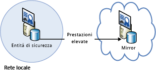

[!INCLUDE [header](../_includes/header.md)]

# Materiale sussidiario sulla resilienza di Azure: ripristino dall'ambiente locale ad AzureAzure resiliency technical guidance: Recovery from on-premises to Azure
Azure offre una serie completa di servizi per abilitare l'estensione di un data center locale ad Azure per scopi di disponibilità elevata e ripristino di emergenza:Azure provides a comprehensive set of services for enabling the extension of an on-premises datacenter to Azure for high availability and disaster recovery purposes:

* **Rete**: con la rete privata virtuale, la rete locale viene estesa in modo sicuro al cloud.**Networking**: With a virtual private network, you securely extend your on-premises network to the cloud.
* **Calcolo**: i clienti che usano Hyper-V in locale possono trasferire le macchine virtuali esistenti in Azure.**Compute**: Customers using Hyper-V on-premises can “lift and shift” existing virtual machines (VMs) to Azure.
* **Archiviazione**: StorSimple estende il file system ad Archiviazione di Azure.**Storage**: StorSimple extends your file system to Azure Storage. Il servizio Backup di Azure consente il backup dei file e dei database SQL in Archiviazione di Azure.The Azure Backup service provides backup for files and SQL databases to Azure Storage.
* **Replica di database**: con i gruppi di disponibilità SQL Server 2014 o versioni successive è possibile implementare disponibilità elevata e ripristino di emergenza per i dati locali.**Database replication**: With SQL Server 2014 (or later) Availability Groups, you can implement high availability and disaster recovery for your on-premises data.

## ReteNetworking
È possibile usare la rete virtuale di Azure per creare una sezione logicamente isolata in Azure e connetterla in modo sicuro a un data center locale o a un singolo computer client usando una connessione IPsec.You can use Azure Virtual Network to create a logically isolated section in Azure and securely connect it to your on-premises datacenter or a single client machine by using an IPsec connection. Con la rete virtuale è possibile sfruttare l'infrastruttura scalabile su richiesta in Azure offrendo connettività ai dati e alle applicazioni locali, inclusi i sistemi in esecuzione in Windows Server, mainframe e UNIX.With Virtual Network, you can take advantage of the scalable, on-demand infrastructure in Azure while providing connectivity to data and applications on-premises, including systems running on Windows Server, mainframes, and UNIX. Per altre informazioni vedere la [documentazione sulla rete di Azure](/azure/virtual-network/virtual-networks-overview/) .See [Azure networking documentation](/azure/virtual-network/virtual-networks-overview/) for more information.

## CalcoloCompute
Se si usa Hyper-V in locale è possibile trasferire le macchine virtuali esistenti in Azure e provider di servizi che eseguono Windows Server 2012 o versioni successive, senza apportare modifiche alle macchine virtuali o convertirne i formati.If you're using Hyper-V on-premises, you can “lift and shift” existing virtual machines to Azure and service providers running Windows Server 2012 (or later), without making changes to the VM or converting VM formats. Per altre informazioni vedere [Informazioni sui dischi e sui dischi rigidi virtuali per le macchine virtuali di Azure](/azure/virtual-machines/virtual-machines-linux-about-disks-vhds/?toc=%2fazure%2fvirtual-machines%2flinux%2ftoc.json).For more information, see [About disks and VHDs for Azure virtual machines](/azure/virtual-machines/virtual-machines-linux-about-disks-vhds/?toc=%2fazure%2fvirtual-machines%2flinux%2ftoc.json).

## Azure Site RecoveryAzure Site Recovery
Se è necessario il ripristino di emergenza distribuito come servizio (DRaaS), Azure offre [Azure Site Recovery](https://azure.microsoft.com/services/site-recovery/).If you want disaster recovery as a service (DRaaS), Azure provides [Azure Site Recovery](https://azure.microsoft.com/services/site-recovery/). Azure Site Recovery offre protezione completa per VMware, Hyper-V e server fisici.Azure Site Recovery offers comprehensive protection for VMware, Hyper-V, and physical servers. Con Azure Site Recovery è possibile usare un altro server locale o Azure come sito di ripristino.With Azure Site Recovery, you can use another on-premises server or Azure as your recovery site. Per altre informazioni su Azure Site Recovery, vedere la [documentazione di Azure Site Recovery](https://azure.microsoft.com/documentation/services/site-recovery/).For more information on Azure Site Recovery, see the [Azure Site Recovery documentation](https://azure.microsoft.com/documentation/services/site-recovery/).

## ArchiviazioneStorage
Sono disponibili diverse opzioni per l'uso di Azure come sito di backup per i dati locali.There are several options for using Azure as a backup site for on-premises data.

### StorSimpleStorSimple
StorSimple integra in modo sicuro e trasparente l'archiviazione cloud per applicazioni locali.StorSimple securely and transparently integrates cloud storage for on-premises applications. Offre una singola appliance che mette a disposizione archiviazione locale e cloud a livelli e a prestazioni elevate, archiviazione live, protezione dei dati basata su cloud e ripristino di emergenza.It also offers a single appliance that delivers high-performance tiered local and cloud storage, live archiving, cloud-based data protection, and disaster recovery. Per altre informazioni vedere la [pagina del prodotto StorSimple](https://azure.microsoft.com/services/storsimple/).For more information, see the [StorSimple product page](https://azure.microsoft.com/services/storsimple/).

### Backup di AzureAzure Backup
Backup di Azure consente il backup cloud con i consueti strumenti in Windows Server 2012 o versioni successive, Windows Server 2012 Essentials o versioni successive e System Center 2012 Data Protection Manager o versioni successive.Azure Backup enables cloud backups by using the familiar backup tools in Windows Server 2012 (or later), Windows Server 2012 Essentials (or later), and System Center 2012 Data Protection Manager (or later). Questi strumenti offrono un flusso di lavoro per la gestione del backup indipendente dalla posizione di archiviazione dei backup, che si tratti di un disco locale o di Archiviazione di Azure.These tools provide a workflow for backup management that is independent of the storage location of the backups, whether a local disk or Azure Storage. Dopo aver eseguito il backup dei dati nel cloud, gli utenti autorizzati possono facilmente recuperare i backup in qualsiasi server.After data is backed up to the cloud, authorized users can easily recover backups to any server.

Con i backup incrementali, solo le modifiche ai file vengono trasferite nel cloud.With incremental backups, only changes to files are transferred to the cloud. È così possibile usare lo spazio di archiviazione in modo efficiente, ridurre il consumo della larghezza di banda e offrire un ripristino temporizzato di più versioni dei dati.This helps to efficiently use storage space, reduce bandwidth consumption, and support point-in-time recovery of multiple versions of the data. È anche possibile usare altre funzionalità, ad esempio i criteri di conservazione dei dati, la compressione dei dati e la limitazione del trasferimento dati.You can also choose to use additional features, such as data retention policies, data compression, and data transfer throttling. L'uso di Azure come posizione di backup offre l'ovvio vantaggio di avere automaticamente i backup all'esterno.Using Azure as the backup location has the obvious advantage that the backups are automatically “offsite”. Si elimina così la necessità di proteggere i supporti di backup locali.This eliminates the extra requirements to secure and protect on-site backup media.

Per altre informazioni, vedere [Informazioni su Backup di Azure](/azure/backup/backup-introduction-to-azure-backup/) e [Configurare il backup di Azure per i dati DPM](https://technet.microsoft.com/library/jj728752.aspx).For more information, see [What is Azure Backup?](/azure/backup/backup-introduction-to-azure-backup/) and [Configure Azure Backup for DPM data](https://technet.microsoft.com/library/jj728752.aspx).

## DatabaseDatabase
È possibile disporre di una soluzione di ripristino di emergenza per i database di SQL Server in un ambiente IT ibrido usando i gruppi di disponibilità AlwaysOn, il mirroring del database, il log shipping e funzionalità di backup e ripristino con l'archiviazione BLOB di Azure.You can have a disaster recovery solution for your SQL Server databases in a hybrid-IT environment by using AlwaysOn Availability Groups, database mirroring, log shipping, and backup and restore with Azure Blob storage. Tutte queste soluzioni usano SQL Server in esecuzione in macchine virtuali di Azure.All of these solutions use SQL Server running on Azure Virtual Machines.

È possibile usare Gruppi di disponibilità AlwaysOn in un ambiente IT ibrido in cui le repliche di database sono presenti sia in locale, sia nel cloud.AlwaysOn Availability Groups can be used in a hybrid-IT environment where database replicas exist both on-premises and in the cloud. Vedere il diagramma seguente.This is shown in the following diagram.

Il mirroring del database può anche estendersi su server locali e nel cloud in una configurazione basata su certificati.Database mirroring can also span on-premises servers and the cloud in a certificate-based setup. Il diagramma seguente illustra questo concetto.The following diagram illustrates this concept.

È possibile usare il log shipping per sincronizzare un database locale con un database di SQL Server in una macchina virtuale di Azure.Log shipping can be used to synchronize an on-premises database with a SQL Server database in an Azure virtual machine.

È infine possibile eseguire il backup di un database locale direttamente nell'archivio BLOB di Azure.Finally, you can back up an on-premises database directly to Azure Blob storage.

Per altre informazioni, vedere [Disponibilità elevata e ripristino di emergenza per SQL Server nelle macchine virtuali di Azure](/azure/virtual-machines/windows/sql/virtual-machines-windows-sql-high-availability-dr/) e [Backup e ripristino per SQL Server nelle macchine virtuali di Azure](/azure/virtual-machines/windows/sql/virtual-machines-windows-sql-backup-recovery/).For more information, see [High availability and disaster recovery for SQL Server in Azure virtual machines](/azure/virtual-machines/windows/sql/virtual-machines-windows-sql-high-availability-dr/) and [Backup and restore for SQL Server in Azure virtual machines](/azure/virtual-machines/windows/sql/virtual-machines-windows-sql-backup-recovery/).

## Elenchi di controllo per il ripristino locale in Microsoft AzureChecklists for on-premises recovery in Microsoft Azure
### ReteNetworking
1. Vedere la sezione Rete di questo documento.Review the Networking section of this document.
2. Usare la rete virtuale per connettere in modo sicuro l'ambiente locale al cloud.Use Virtual Network to securely connect on-premises to the cloud.

### CalcoloCompute
1. Vedere la sezione Calcolo di questo documento.Review the Compute section of this document.
2. Rilocare le macchine virtuali tra Hyper-V e Azure.Relocate VMs between Hyper-V and Azure.

### ArchiviazioneStorage
1. Vedere la sezione Archiviazione di questo documento.Review the Storage section of this document.
2. Sfruttare i servizi StorSimple per l'uso dell'archiviazione cloud.Take advantage of StorSimple services for using cloud storage.
3. Usare i servizi di Backup di Azure.Use the Azure Backup service.

### DatabaseDatabase
1. Vedere la sezione Database di questo documento.Review the Database section of this document.
2. Prendere in considerazione l'uso di SQL Server nelle macchine virtuali di Azure come backup.Consider using SQL Server on Azure VMs as the backup.
3. Impostare Gruppi di disponibilità AlwaysOn.Set up AlwaysOn Availability Groups.
4. Configurare il mirroring del database basato su certificati.Configure certificate-based database mirroring.
5. Usare il log shipping.Use log shipping.
6. Eseguire il backup del database locale nell'archivio BLOB di Azure.Back up on-premises databases to Azure Blob storage.

