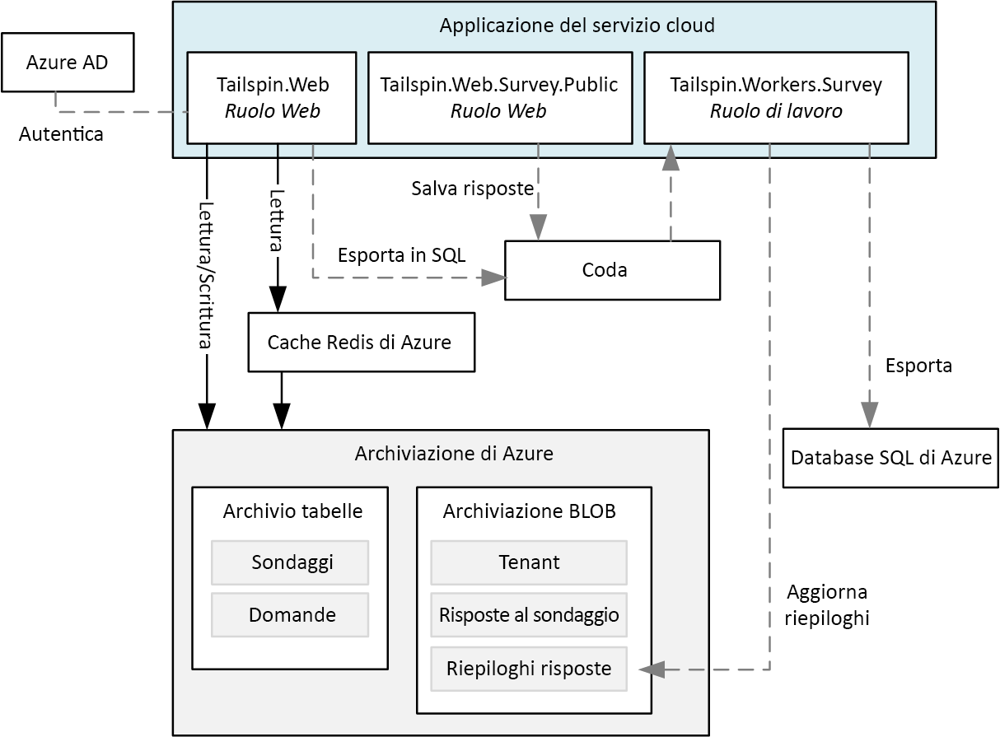
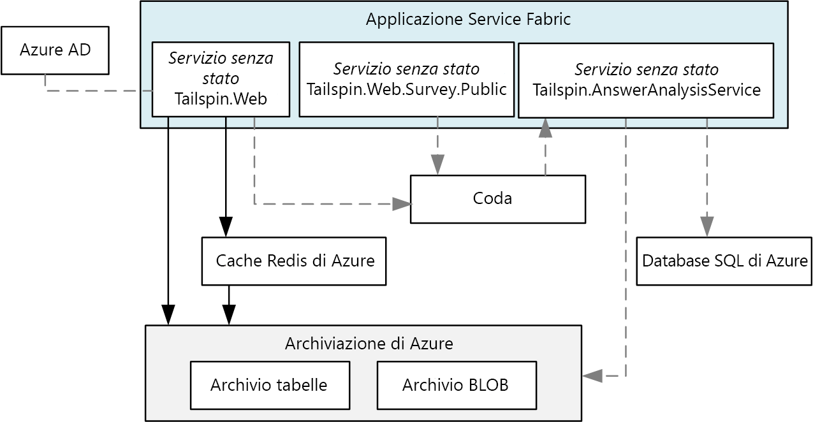
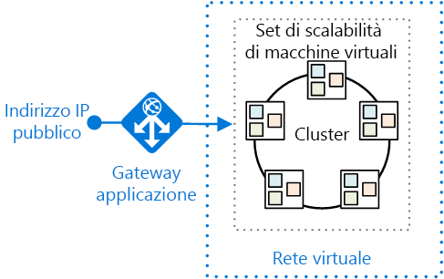
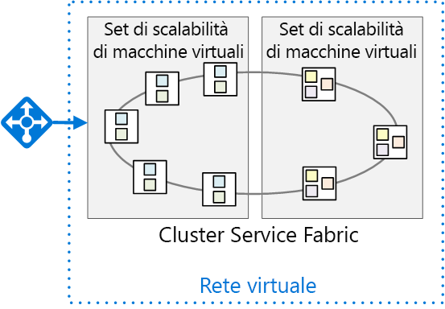

# <a name="migrate-an-azure-cloud-services-application-to-azure-service-fabric"></a><span data-ttu-id="b6f8c-103">Eseguire la migrazione di un'applicazione di Servizi cloud di Azure in Azure Service Fabric</span><span class="sxs-lookup"><span data-stu-id="b6f8c-103">Migrate an Azure Cloud Services application to Azure Service Fabric</span></span> 

<span data-ttu-id="b6f8c-104">[ Codice di esempio][sample-code]</span><span class="sxs-lookup"><span data-stu-id="b6f8c-104">[ Sample code][sample-code]</span></span>

<span data-ttu-id="b6f8c-105">Questo articolo descrive come eseguire la migrazione di un'applicazione da Servizi cloud di Azure ad Azure Service Fabric.</span><span class="sxs-lookup"><span data-stu-id="b6f8c-105">This article describes migrating an application from Azure Cloud Services to Azure Service Fabric.</span></span> <span data-ttu-id="b6f8c-106">Vengono analizzati gli aspetti correlati all'architettura e le procedure consigliate.</span><span class="sxs-lookup"><span data-stu-id="b6f8c-106">It focuses on architectural decisions and recommended practices.</span></span> 

<span data-ttu-id="b6f8c-107">Per questo progetto, si inizia con un'applicazione di Servizi cloud denominata Surveys, che viene trasferita in Service Fabric.</span><span class="sxs-lookup"><span data-stu-id="b6f8c-107">For this project, we started with a Cloud Services application called Surveys and ported it to Service Fabric.</span></span> <span data-ttu-id="b6f8c-108">L'obiettivo è quello di eseguire la migrazione dell'applicazione con il minor numero possibile di modifiche.</span><span class="sxs-lookup"><span data-stu-id="b6f8c-108">The goal was to migrate the application with as few changes as possible.</span></span> <span data-ttu-id="b6f8c-109">In un articolo successivo, l'applicazione viene ottimizzata per Service Fabric adottando un'architettura di microservizi.</span><span class="sxs-lookup"><span data-stu-id="b6f8c-109">In a later article, we will optimize the application for Service Fabric by adopting a microservices architecture.</span></span>

<span data-ttu-id="b6f8c-110">Prima di leggere questo articolo, è utile comprendere le nozioni di base relative a Service Fabric e alle architetture di microservizi in generale.</span><span class="sxs-lookup"><span data-stu-id="b6f8c-110">Before reading this article, it will be useful to understand the basics of Service Fabric and microservices architectures in general.</span></span> <span data-ttu-id="b6f8c-111">Vedere gli articoli seguenti:</span><span class="sxs-lookup"><span data-stu-id="b6f8c-111">See the following articles:</span></span>

- <span data-ttu-id="b6f8c-112">[Panoramica di Azure Service Fabric][sf-overview]</span><span class="sxs-lookup"><span data-stu-id="b6f8c-112">[Overview of Azure Service Fabric][sf-overview]</span></span>
- <span data-ttu-id="b6f8c-113">[Perché usare un approccio ai microservizi per la compilazione di applicazioni][sf-why-microservices]</span><span class="sxs-lookup"><span data-stu-id="b6f8c-113">[Why a microservices approach to building applications?][sf-why-microservices]</span></span>


## <a name="about-the-surveys-application"></a><span data-ttu-id="b6f8c-114">Informazioni sull'applicazione Surveys</span><span class="sxs-lookup"><span data-stu-id="b6f8c-114">About the Surveys application</span></span>

<span data-ttu-id="b6f8c-115">Nel 2012, il gruppo che si occupa di modelli e procedure ha creato un'applicazione denominata Surveys, per un libro intitolato [Developing Multi-tenant Applications for the Cloud][tailspin-book].</span><span class="sxs-lookup"><span data-stu-id="b6f8c-115">In 2012, the patterns & practices group created an application called Surveys, for a book called [Developing Multi-tenant Applications for the Cloud][tailspin-book].</span></span> <span data-ttu-id="b6f8c-116">Il libro descrive una società fittizia denominata Tailspin che progetta e implementa l'applicazione Surveys.</span><span class="sxs-lookup"><span data-stu-id="b6f8c-116">The book describes a fictitious company named Tailspin that designs and implements the Surveys application.</span></span>

<span data-ttu-id="b6f8c-117">Surveys è un'applicazione multi-tenant che consente ai clienti di creare sondaggi.</span><span class="sxs-lookup"><span data-stu-id="b6f8c-117">Surveys is a multitenant application that allows customers to create surveys.</span></span> <span data-ttu-id="b6f8c-118">Dopo che un cliente si registra per usare l'applicazione, i membri della sua organizzazione possono creare e pubblicare sondaggi e raccogliere i risultati per l'analisi.</span><span class="sxs-lookup"><span data-stu-id="b6f8c-118">After a customer signs up for the application,  members of the customer's organization can create and publish surveys, and collect the results for analysis.</span></span> <span data-ttu-id="b6f8c-119">L'applicazione include un sito Web pubblico in cui gli utenti possono partecipare a un sondaggio.</span><span class="sxs-lookup"><span data-stu-id="b6f8c-119">The application includes a public website where people can take a survey.</span></span> <span data-ttu-id="b6f8c-120">Altre informazioni sullo scenario Tailspin originale sono disponibili [qui][tailspin-scenario].</span><span class="sxs-lookup"><span data-stu-id="b6f8c-120">Read more about the original Tailspin scenario [here][tailspin-scenario].</span></span>

<span data-ttu-id="b6f8c-121">Tailspin vuole ora spostare l'applicazione Surveys in un'architettura di microservizi, usando Service Fabric in esecuzione in Azure.</span><span class="sxs-lookup"><span data-stu-id="b6f8c-121">Now Tailspin wants to move the Surveys application to a microservices architecture, using Service Fabric running on Azure.</span></span> <span data-ttu-id="b6f8c-122">Poiché l'applicazione è già stata distribuita come applicazione di Servizi cloud, Tailspin adotta un approccio in più fasi:</span><span class="sxs-lookup"><span data-stu-id="b6f8c-122">Because the application is already deployed as a Cloud Services application, Tailspin adopts a multi-phase approach:</span></span>

1.  <span data-ttu-id="b6f8c-123">Trasferimento dei servizi cloud in Service Fabric, riducendo al minimo le modifiche all'applicazione.</span><span class="sxs-lookup"><span data-stu-id="b6f8c-123">Port the cloud services to Service Fabric, while minimizing changes to the application.</span></span>
2.  <span data-ttu-id="b6f8c-124">Ottimizzazione dell'applicazione per Service Fabric, passando a un'architettura di microservizi.</span><span class="sxs-lookup"><span data-stu-id="b6f8c-124">Optimize the application for Service Fabric, by moving to a microservices architecture.</span></span>

<span data-ttu-id="b6f8c-125">Questo articolo descrive la prima fase.</span><span class="sxs-lookup"><span data-stu-id="b6f8c-125">This article describes the first phase.</span></span> <span data-ttu-id="b6f8c-126">La seconda fase viene descritta in un articolo successivo.</span><span class="sxs-lookup"><span data-stu-id="b6f8c-126">A later article will describe the second phase.</span></span> <span data-ttu-id="b6f8c-127">In un progetto reale, è probabile che le due fasi si sovrappongano.</span><span class="sxs-lookup"><span data-stu-id="b6f8c-127">In a real-world project, it's likely that both stages would overlap.</span></span> <span data-ttu-id="b6f8c-128">Durante il trasferimento a Service Fabric, è possibile iniziare anche a riprogettare l'applicazione in microservizi.</span><span class="sxs-lookup"><span data-stu-id="b6f8c-128">While porting to Service Fabric, you would also start to re-architect the application into micro-services.</span></span> <span data-ttu-id="b6f8c-129">Successivamente, è possibile ottimizzare ulteriormente l'architettura, ad esempio dividendo i servizi con granularità grossolana in servizi più piccoli.</span><span class="sxs-lookup"><span data-stu-id="b6f8c-129">Later you might refine the architecture further, perhaps dividing coarse-grained services into smaller services.</span></span>  

<span data-ttu-id="b6f8c-130">Il codice dell'applicazione è disponibile in [GitHub][sample-code].</span><span class="sxs-lookup"><span data-stu-id="b6f8c-130">The application code is available on [GitHub][sample-code].</span></span> <span data-ttu-id="b6f8c-131">Questo repository contiene sia l'applicazione di Servizi cloud che la versione di Service Fabric.</span><span class="sxs-lookup"><span data-stu-id="b6f8c-131">This repo contains both the Cloud Services application and the Service Fabric version.</span></span> 

> <span data-ttu-id="b6f8c-132">Il servizio cloud è una versione aggiornata dell'applicazione originale tratta dal libro *Developing Multi-tenant Applications*.</span><span class="sxs-lookup"><span data-stu-id="b6f8c-132">The cloud service is an updated version of the original application from the *Developing Multi-tenant Applications* book.</span></span>

## <a name="why-microservices"></a><span data-ttu-id="b6f8c-133">Perché usare i microservizi?</span><span class="sxs-lookup"><span data-stu-id="b6f8c-133">Why Microservices?</span></span>

<span data-ttu-id="b6f8c-134">Un'analisi approfondita dei microservizi esula dall'ambito di questo articolo, ma di seguito sono illustrati alcuni dei vantaggi che Tailspin spera di ottenere passando a un'architettura di microservizi:</span><span class="sxs-lookup"><span data-stu-id="b6f8c-134">An in-depth discussion of microservices is beyond scope of this article, but here are some of the benefits that Tailspin hopes to get by moving to a microservices architecture:</span></span>

- <span data-ttu-id="b6f8c-135">**Aggiornamenti dell'applicazione**.</span><span class="sxs-lookup"><span data-stu-id="b6f8c-135">**Application upgrades**.</span></span> <span data-ttu-id="b6f8c-136">I servizi possono essere distribuiti in modo indipendente, quindi è possibile adottare un approccio incrementale per l'aggiornamento di un'applicazione.</span><span class="sxs-lookup"><span data-stu-id="b6f8c-136">Services can be deployed independently, so you can take an incremental approach to upgrading an application.</span></span>
- <span data-ttu-id="b6f8c-137">**Resilienza e isolamento in caso di errore**.</span><span class="sxs-lookup"><span data-stu-id="b6f8c-137">**Resiliency and fault isolation**.</span></span> <span data-ttu-id="b6f8c-138">In caso di errore di un servizio, gli altri servizi rimangono in esecuzione.</span><span class="sxs-lookup"><span data-stu-id="b6f8c-138">If a service fails, other services continue to run.</span></span>
- <span data-ttu-id="b6f8c-139">**Scalabilità**.</span><span class="sxs-lookup"><span data-stu-id="b6f8c-139">**Scalability**.</span></span> <span data-ttu-id="b6f8c-140">I servizi possono essere ridimensionati in modo indipendente.</span><span class="sxs-lookup"><span data-stu-id="b6f8c-140">Services can be scaled independently.</span></span>
- <span data-ttu-id="b6f8c-141">**Flessibilità**.</span><span class="sxs-lookup"><span data-stu-id="b6f8c-141">**Flexibility**.</span></span> <span data-ttu-id="b6f8c-142">I servizi sono progettati per scenari aziendali, non per stack di tecnologie, quindi è più semplice eseguirne la migrazione a nuovi archivi dati, framework o tecnologie.</span><span class="sxs-lookup"><span data-stu-id="b6f8c-142">Services are designed around business scenarios, not technology stacks, making it easier to migrate services to new technologies, frameworks, or data stores.</span></span>
- <span data-ttu-id="b6f8c-143">**Sviluppo Agile**.</span><span class="sxs-lookup"><span data-stu-id="b6f8c-143">**Agile development**.</span></span> <span data-ttu-id="b6f8c-144">I singoli servizi contengono meno codice rispetto a un'applicazione monolitica, quindi la codebase è più facile da comprendere, valutare e testare.</span><span class="sxs-lookup"><span data-stu-id="b6f8c-144">Individual services have less code than a monolithic application, making the code base easier to understand, reason about, and test.</span></span>
- <span data-ttu-id="b6f8c-145">**Team dedicati di piccole dimensioni**.</span><span class="sxs-lookup"><span data-stu-id="b6f8c-145">**Small, focused teams**.</span></span> <span data-ttu-id="b6f8c-146">Poiché l'applicazione viene suddivisa in molti servizi di piccole dimensioni, ogni servizio può essere compilato da un piccolo team dedicato.</span><span class="sxs-lookup"><span data-stu-id="b6f8c-146">Because the application is broken down into many small services, each service can be built by a small focused team.</span></span>

## <a name="why-service-fabric"></a><span data-ttu-id="b6f8c-147">Perché usare Service Fabric?</span><span class="sxs-lookup"><span data-stu-id="b6f8c-147">Why Service Fabric?</span></span>
      
<span data-ttu-id="b6f8c-148">Service Fabric è una scelta ideale per un'architettura di microservizi, perché la maggior parte delle funzionalità necessarie in un sistema distribuito è integrata in Service Fabric, tra cui:</span><span class="sxs-lookup"><span data-stu-id="b6f8c-148">Service Fabric is a good fit for a microservices architecture, because most of the features needed in a distributed system are built into Service Fabric, including:</span></span>

- <span data-ttu-id="b6f8c-149">**Gestione dei cluster**.</span><span class="sxs-lookup"><span data-stu-id="b6f8c-149">**Cluster management**.</span></span> <span data-ttu-id="b6f8c-150">Service Fabric gestisce automaticamente il failover dei nodi, il monitoraggio dell'integrità e altre funzioni di gestione dei cluster.</span><span class="sxs-lookup"><span data-stu-id="b6f8c-150">Service Fabric automatically handles node failover, health monitoring, and other cluster management functions.</span></span>
- <span data-ttu-id="b6f8c-151">**Scalabilità orizzontale**.</span><span class="sxs-lookup"><span data-stu-id="b6f8c-151">**Horizontal scaling**.</span></span> <span data-ttu-id="b6f8c-152">Quando si aggiungono nodi a un cluster di Service Fabric, l'applicazione viene ridimensionata automaticamente, man mano che i servizi vengono distribuiti nei nuovi nodi.</span><span class="sxs-lookup"><span data-stu-id="b6f8c-152">When you add nodes to a Service Fabric cluster, the application automatically scales, as services are distributed across the new nodes.</span></span>
- <span data-ttu-id="b6f8c-153">**Individuazione dei servizi**.</span><span class="sxs-lookup"><span data-stu-id="b6f8c-153">**Service discovery**.</span></span> <span data-ttu-id="b6f8c-154">Service Fabric fornisce un servizio di individuazione in grado di risolvere l'endpoint per un servizio denominato.</span><span class="sxs-lookup"><span data-stu-id="b6f8c-154">Service Fabric provides a discovery service that can resolve the endpoint for a named service.</span></span>
- <span data-ttu-id="b6f8c-155">**Servizi con e senza stato**.</span><span class="sxs-lookup"><span data-stu-id="b6f8c-155">**Stateless and stateful services**.</span></span> <span data-ttu-id="b6f8c-156">I servizi con stato usano [raccolte Reliable Collections][sf-reliable-collections], che possono prendere il posto di una cache o una coda e possono essere partizionate.</span><span class="sxs-lookup"><span data-stu-id="b6f8c-156">Stateful services use [reliable collections][sf-reliable-collections], which can take the place of a cache or queue, and can be partitioned.</span></span>
- <span data-ttu-id="b6f8c-157">**Processo Application Lifecycle Management**.</span><span class="sxs-lookup"><span data-stu-id="b6f8c-157">**Application lifecycle management**.</span></span> <span data-ttu-id="b6f8c-158">I servizi possono essere aggiornati in modo indipendente e senza tempo di inattività dell'applicazione.</span><span class="sxs-lookup"><span data-stu-id="b6f8c-158">Services can be upgraded independently and without application downtime.</span></span>
- <span data-ttu-id="b6f8c-159">**Orchestrazione dei servizi** in un cluster di computer.</span><span class="sxs-lookup"><span data-stu-id="b6f8c-159">**Service orchestration** across a cluster of machines.</span></span>
- <span data-ttu-id="b6f8c-160">**Maggiore densità** per l'ottimizzazione del consumo di risorse.</span><span class="sxs-lookup"><span data-stu-id="b6f8c-160">**Higher density** for optimizing resource consumption.</span></span> <span data-ttu-id="b6f8c-161">Un singolo nodo può ospitare più servizi.</span><span class="sxs-lookup"><span data-stu-id="b6f8c-161">A single node can host multiple services.</span></span>

<span data-ttu-id="b6f8c-162">Service Fabric è una soluzione usata da diversi servizi Microsoft, tra cui database SQL di Azure, Cosmos DB, Hub eventi di Azure e altri servizi, ed è quindi una piattaforma collaudata per la creazione di applicazioni cloud distribuite.</span><span class="sxs-lookup"><span data-stu-id="b6f8c-162">Service Fabric is used by various Microsoft services, including Azure SQL Database, Cosmos DB, Azure Event Hubs, and others, making it a proven platform for building distributed cloud applications.</span></span> 

## <a name="comparing-cloud-services-with-service-fabric"></a><span data-ttu-id="b6f8c-163">Confronto tra Servizi cloud e Service Fabric</span><span class="sxs-lookup"><span data-stu-id="b6f8c-163">Comparing Cloud Services with Service Fabric</span></span>

<span data-ttu-id="b6f8c-164">La tabella seguente riepiloga alcune importanti differenze tra le applicazioni di Servizi cloud e di Service Fabric.</span><span class="sxs-lookup"><span data-stu-id="b6f8c-164">The following table summarizes some of the important differences between Cloud Services and Service Fabric applications.</span></span> <span data-ttu-id="b6f8c-165">Per una discussione più approfondita, vedere [Informazioni sulle differenze tra Servizi cloud e Service Fabric che è opportuno conoscere prima di procedere alla migrazione di applicazioni][sf-compare-cloud-services].</span><span class="sxs-lookup"><span data-stu-id="b6f8c-165">For a more in-depth discussion, see [Learn about the differences between Cloud Services and Service Fabric before migrating applications][sf-compare-cloud-services].</span></span>

|        | <span data-ttu-id="b6f8c-166">Servizi cloud</span><span class="sxs-lookup"><span data-stu-id="b6f8c-166">Cloud Services</span></span> | <span data-ttu-id="b6f8c-167">Service Fabric</span><span class="sxs-lookup"><span data-stu-id="b6f8c-167">Service Fabric</span></span> |
|--------|---------------|----------------|
| <span data-ttu-id="b6f8c-168">Composizione dell'applicazione</span><span class="sxs-lookup"><span data-stu-id="b6f8c-168">Application composition</span></span> | <span data-ttu-id="b6f8c-169">Ruoli</span><span class="sxs-lookup"><span data-stu-id="b6f8c-169">Roles</span></span>| <span data-ttu-id="b6f8c-170">Services</span><span class="sxs-lookup"><span data-stu-id="b6f8c-170">Services</span></span> |
| <span data-ttu-id="b6f8c-171">Densità</span><span class="sxs-lookup"><span data-stu-id="b6f8c-171">Density</span></span> |<span data-ttu-id="b6f8c-172">Un'istanza del ruolo per macchina virtuale</span><span class="sxs-lookup"><span data-stu-id="b6f8c-172">One role instance per VM</span></span> | <span data-ttu-id="b6f8c-173">Più servizi in un singolo nodo</span><span class="sxs-lookup"><span data-stu-id="b6f8c-173">Multiple services in a single node</span></span> |
| <span data-ttu-id="b6f8c-174">Numero minimo di nodi</span><span class="sxs-lookup"><span data-stu-id="b6f8c-174">Minimum number of nodes</span></span> | <span data-ttu-id="b6f8c-175">2 per ruolo</span><span class="sxs-lookup"><span data-stu-id="b6f8c-175">2 per role</span></span> | <span data-ttu-id="b6f8c-176">5 per cluster, per le distribuzioni di produzione</span><span class="sxs-lookup"><span data-stu-id="b6f8c-176">5 per cluster, for production deployments</span></span> |
| <span data-ttu-id="b6f8c-177">Gestione dello stato</span><span class="sxs-lookup"><span data-stu-id="b6f8c-177">State management</span></span> | <span data-ttu-id="b6f8c-178">Senza stato</span><span class="sxs-lookup"><span data-stu-id="b6f8c-178">Stateless</span></span> | <span data-ttu-id="b6f8c-179">Senza stato o con stato\*</span><span class="sxs-lookup"><span data-stu-id="b6f8c-179">Stateless or stateful\*</span></span> |
| <span data-ttu-id="b6f8c-180">Hosting</span><span class="sxs-lookup"><span data-stu-id="b6f8c-180">Hosting</span></span> | <span data-ttu-id="b6f8c-181">Azure</span><span class="sxs-lookup"><span data-stu-id="b6f8c-181">Azure</span></span> | <span data-ttu-id="b6f8c-182">Cloud o in locale</span><span class="sxs-lookup"><span data-stu-id="b6f8c-182">Cloud or on-premises</span></span> |
| <span data-ttu-id="b6f8c-183">Hosting Web</span><span class="sxs-lookup"><span data-stu-id="b6f8c-183">Web hosting</span></span> | <span data-ttu-id="b6f8c-184">IIS**</span><span class="sxs-lookup"><span data-stu-id="b6f8c-184">IIS**</span></span> | <span data-ttu-id="b6f8c-185">Self-hosting</span><span class="sxs-lookup"><span data-stu-id="b6f8c-185">Self-hosting</span></span> |
| <span data-ttu-id="b6f8c-186">Modello di distribuzione</span><span class="sxs-lookup"><span data-stu-id="b6f8c-186">Deployment model</span></span> | <span data-ttu-id="b6f8c-187">[Modello di distribuzione classica][azure-deployment-models]</span><span class="sxs-lookup"><span data-stu-id="b6f8c-187">[Classic deployment model][azure-deployment-models]</span></span> | <span data-ttu-id="b6f8c-188">[Resource Manager][azure-deployment-models]</span><span class="sxs-lookup"><span data-stu-id="b6f8c-188">[Resource Manager][azure-deployment-models]</span></span>  |
| <span data-ttu-id="b6f8c-189">Packaging</span><span class="sxs-lookup"><span data-stu-id="b6f8c-189">Packaging</span></span> | <span data-ttu-id="b6f8c-190">File di pacchetto del servizio cloud (con estensione cspkg)</span><span class="sxs-lookup"><span data-stu-id="b6f8c-190">Cloud service package files (.cspkg)</span></span> | <span data-ttu-id="b6f8c-191">Pacchetti di applicazioni e servizi</span><span class="sxs-lookup"><span data-stu-id="b6f8c-191">Application and service packages</span></span> |
| <span data-ttu-id="b6f8c-192">Aggiornamento dell'applicazione</span><span class="sxs-lookup"><span data-stu-id="b6f8c-192">Application update</span></span> | <span data-ttu-id="b6f8c-193">Scambio di indirizzi VIP o aggiornamento in sequenza</span><span class="sxs-lookup"><span data-stu-id="b6f8c-193">VIP swap or rolling update</span></span> | <span data-ttu-id="b6f8c-194">Aggiornamento in sequenza</span><span class="sxs-lookup"><span data-stu-id="b6f8c-194">Rolling update</span></span> |
| <span data-ttu-id="b6f8c-195">Scalabilità automatica</span><span class="sxs-lookup"><span data-stu-id="b6f8c-195">Auto-scaling</span></span> | <span data-ttu-id="b6f8c-196">[Servizio integrato][cloud-service-autoscale]</span><span class="sxs-lookup"><span data-stu-id="b6f8c-196">[Built-in service][cloud-service-autoscale]</span></span> | <span data-ttu-id="b6f8c-197">Set di scalabilità di macchine virtuali per la scalabilità orizzontale</span><span class="sxs-lookup"><span data-stu-id="b6f8c-197">VM Scale Sets for auto scale out</span></span> |
| <span data-ttu-id="b6f8c-198">Debug</span><span class="sxs-lookup"><span data-stu-id="b6f8c-198">Debugging</span></span> | <span data-ttu-id="b6f8c-199">Emulatore locale</span><span class="sxs-lookup"><span data-stu-id="b6f8c-199">Local emulator</span></span> | <span data-ttu-id="b6f8c-200">Cluster locale</span><span class="sxs-lookup"><span data-stu-id="b6f8c-200">Local cluster</span></span> |


<span data-ttu-id="b6f8c-201">\*I servizi con stato usano [raccolte Reliable Collections][sf-reliable-collections] per archiviare lo stato tra repliche, in modo che tutte le letture siano locali per i nodi del cluster.</span><span class="sxs-lookup"><span data-stu-id="b6f8c-201">\* Stateful services use [reliable collections][sf-reliable-collections] to store state across replicas, so that all reads are local to the nodes in the cluster.</span></span> <span data-ttu-id="b6f8c-202">Le operazioni di scrittura vengono replicate tra i nodi per una maggiore affidabilità.</span><span class="sxs-lookup"><span data-stu-id="b6f8c-202">Writes are replicated across nodes for reliability.</span></span> <span data-ttu-id="b6f8c-203">I servizi senza stato possono avere uno stato esterno, usando un database o un altro dispositivo di archiviazione esterna.</span><span class="sxs-lookup"><span data-stu-id="b6f8c-203">Stateless services can have external state, using a database or other external storage.</span></span>

<span data-ttu-id="b6f8c-204">** I ruoli di lavoro supportano anche il self-hosting dell'API Web ASP.NET con OWIN.</span><span class="sxs-lookup"><span data-stu-id="b6f8c-204">** Worker roles can also self-host ASP.NET Web API using OWIN.</span></span>

## <a name="the-surveys-application-on-cloud-services"></a><span data-ttu-id="b6f8c-205">Applicazione Surveys in Servizi cloud</span><span class="sxs-lookup"><span data-stu-id="b6f8c-205">The Surveys application on Cloud Services</span></span>

<span data-ttu-id="b6f8c-206">Il diagramma seguente mostra l'architettura dell'applicazione Surveys in esecuzione in Servizi cloud.</span><span class="sxs-lookup"><span data-stu-id="b6f8c-206">The following diagram shows the architecture of the Surveys application running on Cloud Services.</span></span> 



<span data-ttu-id="b6f8c-207">L'applicazione è costituita da due ruoli Web e un ruolo di lavoro.</span><span class="sxs-lookup"><span data-stu-id="b6f8c-207">The application consists of two web roles and a worker role.</span></span>

- <span data-ttu-id="b6f8c-208">Il ruolo Web **Tailspin.Web** ospita un sito Web ASP.NET che i clienti di Tailspin usano per creare e gestire i sondaggi.</span><span class="sxs-lookup"><span data-stu-id="b6f8c-208">The **Tailspin.Web** web role hosts an ASP.NET website that Tailspin customers use to create and manage surveys.</span></span> <span data-ttu-id="b6f8c-209">I clienti possono anche usare il sito Web per registrarsi per usare l'applicazione e per gestire le sottoscrizioni.</span><span class="sxs-lookup"><span data-stu-id="b6f8c-209">Customers also use this website to sign up for the application and manage their subscriptions.</span></span> <span data-ttu-id="b6f8c-210">Infine, gli amministratori di Tailspin possono usarlo per visualizzare l'elenco dei tenant e gestire i relativi dati.</span><span class="sxs-lookup"><span data-stu-id="b6f8c-210">Finally, Tailspin administrators can use it to see the list of tenants and manage tenant data.</span></span> 

- <span data-ttu-id="b6f8c-211">Il ruolo Web **Tailspin.Web.Survey.Public** ospita un sito Web ASP.NET dove gli utenti possono partecipare ai sondaggi pubblicati dai clienti di Tailspin.</span><span class="sxs-lookup"><span data-stu-id="b6f8c-211">The **Tailspin.Web.Survey.Public** web role hosts an ASP.NET website where people can take the surveys that Tailspin customers publish.</span></span> 

- <span data-ttu-id="b6f8c-212">Il ruolo di lavoro **Tailspin.Workers.Survey** esegue l'elaborazione in background.</span><span class="sxs-lookup"><span data-stu-id="b6f8c-212">The **Tailspin.Workers.Survey** worker role does background processing.</span></span> <span data-ttu-id="b6f8c-213">I ruoli Web inseriscono gli elementi di lavoro in una coda e il ruolo di lavoro elabora gli elementi.</span><span class="sxs-lookup"><span data-stu-id="b6f8c-213">The web roles put work items onto a queue, and the worker role processes the items.</span></span> <span data-ttu-id="b6f8c-214">Vengono definite due attività in background: l'esportazione delle risposte al sondaggio nel database SQL di Azure e il calcolo delle statistiche per le risposte al sondaggio.</span><span class="sxs-lookup"><span data-stu-id="b6f8c-214">Two background tasks are defined: Exporting survey answers to Azure SQL Database, and calculating statistics for survey answers.</span></span>

<span data-ttu-id="b6f8c-215">Oltre a Servizi cloud, l'applicazione Surveys usa altri servizi di Azure:</span><span class="sxs-lookup"><span data-stu-id="b6f8c-215">In addition to Cloud Services, the Surveys application uses some other Azure services:</span></span>

- <span data-ttu-id="b6f8c-216">**Archiviazione di Azure** per archiviare sondaggi, risposte ai sondaggi e informazioni relative ai tenant.</span><span class="sxs-lookup"><span data-stu-id="b6f8c-216">**Azure Storage** to store surveys, surveys answers, and tenant information.</span></span>

- <span data-ttu-id="b6f8c-217">**Cache Redis di Azure** per memorizzare nella cache alcuni dei dati archiviati in Archiviazione di Azure, per un accesso in lettura più veloce.</span><span class="sxs-lookup"><span data-stu-id="b6f8c-217">**Azure Redis Cache** to cache some of the data that is stored in Azure Storage, for faster read access.</span></span> 

- <span data-ttu-id="b6f8c-218">**Azure Active Directory** (Azure AD) per autenticare i clienti e gli amministratori di Tailspin.</span><span class="sxs-lookup"><span data-stu-id="b6f8c-218">**Azure Active Directory** (Azure AD) to authenticate customers and Tailspin administrators.</span></span>

- <span data-ttu-id="b6f8c-219">**Database SQL di Azure** per archiviare le risposte ai sondaggi per l'analisi.</span><span class="sxs-lookup"><span data-stu-id="b6f8c-219">**Azure SQL Database** to store the survey answers for analysis.</span></span> 

## <a name="moving-to-service-fabric"></a><span data-ttu-id="b6f8c-220">Passaggio a Service Fabric</span><span class="sxs-lookup"><span data-stu-id="b6f8c-220">Moving to Service Fabric</span></span>

<span data-ttu-id="b6f8c-221">Come accennato, l'obiettivo di questa fase è la migrazione a Service Fabric con il numero minimo di modifiche necessarie.</span><span class="sxs-lookup"><span data-stu-id="b6f8c-221">As mentioned, the goal of this phase was migrating to Service Fabric with the minimum necessary changes.</span></span> <span data-ttu-id="b6f8c-222">A tale scopo, sono stati creati servizi senza stato corrispondenti a ogni ruolo del servizio cloud nell'applicazione originale:</span><span class="sxs-lookup"><span data-stu-id="b6f8c-222">To that end, we created stateless services corresponding to each cloud service role in the original application:</span></span>



<span data-ttu-id="b6f8c-223">Questa architettura è intenzionalmente molto simile all'applicazione originale.</span><span class="sxs-lookup"><span data-stu-id="b6f8c-223">Intentionally, this architecture is very similar to the original application.</span></span> <span data-ttu-id="b6f8c-224">Il diagramma nasconde tuttavia alcune importanti differenze.</span><span class="sxs-lookup"><span data-stu-id="b6f8c-224">However, the diagram hides some important differences.</span></span> <span data-ttu-id="b6f8c-225">Nella parte restante di questo articolo verranno esaminate queste differenze.</span><span class="sxs-lookup"><span data-stu-id="b6f8c-225">In the rest of this article, we'll explore those differences.</span></span> 


## <a name="converting-the-cloud-service-roles-to-services"></a><span data-ttu-id="b6f8c-226">Conversione dei ruoli del servizio cloud in servizi</span><span class="sxs-lookup"><span data-stu-id="b6f8c-226">Converting the cloud service roles to services</span></span>

<span data-ttu-id="b6f8c-227">Come indicato, è stata eseguita la migrazione di ogni ruolo del servizio cloud a un servizio di Service Fabric.</span><span class="sxs-lookup"><span data-stu-id="b6f8c-227">As mentioned, we migrated each cloud service role to a Service Fabric service.</span></span> <span data-ttu-id="b6f8c-228">Poiché i ruoli del servizio cloud sono senza stato, per questa fase sono stati creati servizi senza stato in Service Fabric.</span><span class="sxs-lookup"><span data-stu-id="b6f8c-228">Because cloud service roles are stateless, for this phase it made sense to create stateless services in Service Fabric.</span></span> 

<span data-ttu-id="b6f8c-229">Per la migrazione, sono stati eseguiti i passaggi descritti in [Guida alla conversione di ruoli di lavoro e Web in servizi senza stato di Service Fabric][sf-migration].</span><span class="sxs-lookup"><span data-stu-id="b6f8c-229">For the migration, we followed the steps outlined in [Guide to converting Web and Worker Roles to Service Fabric stateless services][sf-migration].</span></span> 

### <a name="creating-the-web-front-end-services"></a><span data-ttu-id="b6f8c-230">Creazione dei servizi front-end Web</span><span class="sxs-lookup"><span data-stu-id="b6f8c-230">Creating the web front-end services</span></span>

<span data-ttu-id="b6f8c-231">In Service Fabric un servizio viene eseguito all'interno di un processo creato dal runtime di Service Fabric.</span><span class="sxs-lookup"><span data-stu-id="b6f8c-231">In Service Fabric, a service runs inside a process created by the Service Fabric runtime.</span></span> <span data-ttu-id="b6f8c-232">Per un front-end Web, ciò significa che il servizio non è in esecuzione in IIS.</span><span class="sxs-lookup"><span data-stu-id="b6f8c-232">For a web front end, that means the service is not running inside IIS.</span></span> <span data-ttu-id="b6f8c-233">Il servizio deve invece ospitare un server Web.</span><span class="sxs-lookup"><span data-stu-id="b6f8c-233">Instead, the service must host a web server.</span></span> <span data-ttu-id="b6f8c-234">Questo approccio è definito *self-hosting*, perché il codice eseguito all'interno del processo funge da host del server Web.</span><span class="sxs-lookup"><span data-stu-id="b6f8c-234">This approach is called *self-hosting*, because the code that runs inside the process acts as the web server host.</span></span> 

<span data-ttu-id="b6f8c-235">Il requisito di self-hosting implica che un servizio di Service Fabric non può usare ASP.NET MVC o Web Form ASP.NET, in quanto tali framework richiedono IIS e non supportano il self-hosting.</span><span class="sxs-lookup"><span data-stu-id="b6f8c-235">The requirement to self-host means that a Service Fabric service can't use ASP.NET MVC or ASP.NET Web Forms, because those frameworks require IIS and do not support self-hosting.</span></span> <span data-ttu-id="b6f8c-236">Le opzioni di self-hosting includono:</span><span class="sxs-lookup"><span data-stu-id="b6f8c-236">Options for self-hosting include:</span></span>

- <span data-ttu-id="b6f8c-237">[ASP.NET Core][aspnet-core], per il cui self-hosting viene usato il server Web [Kestrel][kestrel].</span><span class="sxs-lookup"><span data-stu-id="b6f8c-237">[ASP.NET Core][aspnet-core], self-hosted using the [Kestrel][kestrel] web server.</span></span> 
- <span data-ttu-id="b6f8c-238">[API Web ASP.NET][aspnet-webapi], per il cui self-hosting viene usato [OWIN][owin].</span><span class="sxs-lookup"><span data-stu-id="b6f8c-238">[ASP.NET Web API][aspnet-webapi], self-hosted using [OWIN][owin].</span></span>
- <span data-ttu-id="b6f8c-239">Framework di terze parti, ad esempio [Nancy](http://nancyfx.org/).</span><span class="sxs-lookup"><span data-stu-id="b6f8c-239">Third-party frameworks such as [Nancy](http://nancyfx.org/).</span></span>

<span data-ttu-id="b6f8c-240">L'applicazione Surveys originale usa ASP.NET MVC.</span><span class="sxs-lookup"><span data-stu-id="b6f8c-240">The original Surveys application uses ASP.NET MVC.</span></span> <span data-ttu-id="b6f8c-241">Poiché ASP.NET MVC non supporta il self-hosting in Service Fabric, sono state considerate le opzioni di migrazione seguenti:</span><span class="sxs-lookup"><span data-stu-id="b6f8c-241">Because ASP.NET MVC cannot be self-hosted in Service Fabric, we considered the following migration options:</span></span>

- <span data-ttu-id="b6f8c-242">Trasferire i ruoli Web in ASP.NET Core, che supporta il self-hosting.</span><span class="sxs-lookup"><span data-stu-id="b6f8c-242">Port the web roles to ASP.NET Core, which can be self-hosted.</span></span>
- <span data-ttu-id="b6f8c-243">Convertire il sito Web in un'applicazione a singola pagina, che chiama un'API Web implementata usando l'API Web ASP.NET.</span><span class="sxs-lookup"><span data-stu-id="b6f8c-243">Convert the web site into a single-page application (SPA) that calls a web API implemented using ASP.NET Web API.</span></span> <span data-ttu-id="b6f8c-244">Ciò avrebbe richiesto una riprogettazione completa del front-end Web.</span><span class="sxs-lookup"><span data-stu-id="b6f8c-244">This would have required a complete redesign of the web front end.</span></span>
- <span data-ttu-id="b6f8c-245">Mantenere il codice ASP.NET MVC esistente e distribuire IIS in un contenitore di Windows Server in Service Fabric.</span><span class="sxs-lookup"><span data-stu-id="b6f8c-245">Keep the existing ASP.NET MVC code and deploy IIS in a Windows Server container to Service Fabric.</span></span> <span data-ttu-id="b6f8c-246">Questo approccio non richiede modifiche al codice o richiede solo modifiche minime.</span><span class="sxs-lookup"><span data-stu-id="b6f8c-246">This approach would require little or no code change.</span></span> 

<span data-ttu-id="b6f8c-247">La prima opzione, ovvero la migrazione ad ASP.NET Core, ha permesso di sfruttare le funzionalità più recenti in ASP.NET Core.</span><span class="sxs-lookup"><span data-stu-id="b6f8c-247">The first option, porting to ASP.NET Core, allowed us to take advantage of the latest features in ASP.NET Core.</span></span> <span data-ttu-id="b6f8c-248">Per la conversione sono stati seguiti i passaggi descritti in [Migrazione da ASP.NET MVC ad ASP.NET Core MVC][aspnet-migration].</span><span class="sxs-lookup"><span data-stu-id="b6f8c-248">To do the conversion, we followed the steps described in [Migrating From ASP.NET MVC to ASP.NET Core MVC][aspnet-migration].</span></span> 

> [!NOTE]
> <span data-ttu-id="b6f8c-249">Quando si usa ASP.NET Core con Kestrel, è consigliabile posizionare un proxy inverso davanti a Kestrel per gestire il traffico proveniente da Internet, per motivi di sicurezza.</span><span class="sxs-lookup"><span data-stu-id="b6f8c-249">When using ASP.NET Core with Kestrel, you should place a reverse proxy in front of Kestrel to handle traffic from the Internet, for security reasons.</span></span> <span data-ttu-id="b6f8c-250">Per altre informazioni, vedere [Introduzione all'implementazione di server Web Kestrel in ASP.NET Core][kestrel].</span><span class="sxs-lookup"><span data-stu-id="b6f8c-250">For more information, see [Kestrel web server implementation in ASP.NET Core][kestrel].</span></span> <span data-ttu-id="b6f8c-251">La sezione [Distribuzione dell'applicazione](#deploying-the-application) descrive una distribuzione di Azure consigliata.</span><span class="sxs-lookup"><span data-stu-id="b6f8c-251">The section [Deploying the application](#deploying-the-application) describes a recommended Azure deployment.</span></span>

### <a name="http-listeners"></a><span data-ttu-id="b6f8c-252">Listener HTTP</span><span class="sxs-lookup"><span data-stu-id="b6f8c-252">HTTP listeners</span></span>

<span data-ttu-id="b6f8c-253">In Servizi cloud un ruolo Web o di lavoro espone un endpoint HTTP dichiarandolo nel [file di definizione del servizio][cloud-service-endpoints].</span><span class="sxs-lookup"><span data-stu-id="b6f8c-253">In Cloud Services, a web or worker role exposes an HTTP endpoint by declaring it in the [service definition file][cloud-service-endpoints].</span></span> <span data-ttu-id="b6f8c-254">Un ruolo Web deve avere almeno un endpoint.</span><span class="sxs-lookup"><span data-stu-id="b6f8c-254">A web role must have at least one endpoint.</span></span>

```xml
<!-- Cloud service endpoint -->
<Endpoints>
    <InputEndpoint name="HttpIn" protocol="http" port="80" />
</Endpoints>
```

<span data-ttu-id="b6f8c-255">Analogamente, gli endpoint di Service Fabric vengono dichiarati in un manifesto del servizio:</span><span class="sxs-lookup"><span data-stu-id="b6f8c-255">Similarly, Service Fabric endpoints are declared in a service manifest:</span></span> 

```xml
<!-- Service Fabric endpoint -->
<Endpoints>
    <Endpoint Protocol="http" Name="ServiceEndpoint" Type="Input" Port="8002" />
</Endpoints>
```

<span data-ttu-id="b6f8c-256">A differenza di un ruolo del servizio cloud, tuttavia, i servizi di Service Fabric possono trovarsi nello stesso nodo.</span><span class="sxs-lookup"><span data-stu-id="b6f8c-256">Unlike a cloud service role, however, Service Fabric services can be co-located within the same node.</span></span> <span data-ttu-id="b6f8c-257">Per questo motivo, ogni servizio deve essere in ascolto su una porta distinta.</span><span class="sxs-lookup"><span data-stu-id="b6f8c-257">Therefore, every service must listen on a distinct port.</span></span> <span data-ttu-id="b6f8c-258">Più avanti in questo articolo viene illustrato in che modo le richieste client sulla porta 80 o 443 vengono instradate alla porta corretta per il servizio.</span><span class="sxs-lookup"><span data-stu-id="b6f8c-258">Later in this article, we'll discuss how client requests on port 80 or port 443 get routed to the correct port for the service.</span></span>

<span data-ttu-id="b6f8c-259">Un servizio deve creare in modo esplicito i listener per ogni endpoint.</span><span class="sxs-lookup"><span data-stu-id="b6f8c-259">A service must explicitly create listeners for each endpoint.</span></span> <span data-ttu-id="b6f8c-260">Il motivo è che Service Fabric è indipendente dagli stack di comunicazione.</span><span class="sxs-lookup"><span data-stu-id="b6f8c-260">The reason is that Service Fabric is agnostic about communication stacks.</span></span> <span data-ttu-id="b6f8c-261">Per altre informazioni, vedere [Compilare un front-end di servizio Web per l'applicazione tramite ASP.NET Core][sf-aspnet-core].</span><span class="sxs-lookup"><span data-stu-id="b6f8c-261">For more information, see [Build a web service front end for your application using ASP.NET Core][sf-aspnet-core].</span></span>

## <a name="packaging-and-configuration"></a><span data-ttu-id="b6f8c-262">Creazione di pacchetti e configurazione</span><span class="sxs-lookup"><span data-stu-id="b6f8c-262">Packaging and configuration</span></span>

 <span data-ttu-id="b6f8c-263">Un servizio cloud contiene i file di configurazione e di pacchetto seguenti:</span><span class="sxs-lookup"><span data-stu-id="b6f8c-263">A cloud service contains the following configuration and package files:</span></span>

| <span data-ttu-id="b6f8c-264">File</span><span class="sxs-lookup"><span data-stu-id="b6f8c-264">File</span></span> | <span data-ttu-id="b6f8c-265">DESCRIZIONE</span><span class="sxs-lookup"><span data-stu-id="b6f8c-265">Description</span></span> |
|------|-------------|
| <span data-ttu-id="b6f8c-266">Definizione del servizio (con estensione csdef)</span><span class="sxs-lookup"><span data-stu-id="b6f8c-266">Service definition (.csdef)</span></span> | <span data-ttu-id="b6f8c-267">Impostazioni usate da Azure per configurare il servizio cloud.</span><span class="sxs-lookup"><span data-stu-id="b6f8c-267">Settings used by Azure to configure the cloud service.</span></span> <span data-ttu-id="b6f8c-268">Definisce i ruoli, gli endpoint, le attività di avvio e i nomi delle impostazioni di configurazione.</span><span class="sxs-lookup"><span data-stu-id="b6f8c-268">Defines the roles, endpoints, startup tasks, and the names of configuration settings.</span></span> |
| <span data-ttu-id="b6f8c-269">Configurazione del servizio (con estensione cscfg)</span><span class="sxs-lookup"><span data-stu-id="b6f8c-269">Service configuration (.cscfg)</span></span> | <span data-ttu-id="b6f8c-270">Impostazioni specifiche della distribuzione, inclusi il numero delle istanze del ruolo, i numeri di porta degli endpoint e i valori delle impostazioni di configurazione.</span><span class="sxs-lookup"><span data-stu-id="b6f8c-270">Per-deployment settings, including the number of role instances, endpoint port numbers, and the values of configuration settings.</span></span> 
| <span data-ttu-id="b6f8c-271">Pacchetto del servizio (con estensione cspkg)</span><span class="sxs-lookup"><span data-stu-id="b6f8c-271">Service package (.cspkg)</span></span> | <span data-ttu-id="b6f8c-272">Contiene il codice e le configurazioni dell'applicazione, oltre che il file di definizione del servizio.</span><span class="sxs-lookup"><span data-stu-id="b6f8c-272">Contains the application code and configurations, and the service definition file.</span></span>  |

<span data-ttu-id="b6f8c-273">C'è un file con estensione csdef per l'intera applicazione.</span><span class="sxs-lookup"><span data-stu-id="b6f8c-273">There is one .csdef file for the entire application.</span></span> <span data-ttu-id="b6f8c-274">Possono esserci più file con estensione cscfg per ambienti diversi, ad esempio locale, di test o di produzione.</span><span class="sxs-lookup"><span data-stu-id="b6f8c-274">You can have multiple .cscfg files for different environments, such as local, test, or production.</span></span> <span data-ttu-id="b6f8c-275">Quando il servizio è in esecuzione, è possibile aggiornare il file con estensione cscfg ma non quello con estensione csdef.</span><span class="sxs-lookup"><span data-stu-id="b6f8c-275">When the service is running, you can update the .cscfg but not the .csdef.</span></span> <span data-ttu-id="b6f8c-276">Per altre informazioni, vedere [Cos'è il modello del servizio cloud e come è possibile crearne il pacchetto?][cloud-service-config]</span><span class="sxs-lookup"><span data-stu-id="b6f8c-276">For more information, see [What is the Cloud Service model and how do I package it?][cloud-service-config]</span></span>

<span data-ttu-id="b6f8c-277">Service Fabric prevede una divisione simile tra *definizione* del servizio e *impostazioni* del servizio, ma la struttura è più granulare.</span><span class="sxs-lookup"><span data-stu-id="b6f8c-277">Service Fabric has a similar division between a service *definition* and service *settings*, but the structure is more granular.</span></span> <span data-ttu-id="b6f8c-278">Per comprendere il modello di configurazione di Service Fabric, è utile per capire come viene creato un pacchetto di un'applicazione di Service Fabric.</span><span class="sxs-lookup"><span data-stu-id="b6f8c-278">To understand Service Fabric's configuration model, it helps to understand how a Service Fabric application is packaged.</span></span> <span data-ttu-id="b6f8c-279">Ecco la struttura:</span><span class="sxs-lookup"><span data-stu-id="b6f8c-279">Here is the structure:</span></span>

```
Application package
  - Service packages
    - Code package
    - Configuration package
    - Data package (optional)
```

<span data-ttu-id="b6f8c-280">Il pacchetto dell'applicazione è ciò che si distribuisce.</span><span class="sxs-lookup"><span data-stu-id="b6f8c-280">The application package is what you deploy.</span></span> <span data-ttu-id="b6f8c-281">Contiene uno o più pacchetti del servizio.</span><span class="sxs-lookup"><span data-stu-id="b6f8c-281">It contains one or more service packages.</span></span> <span data-ttu-id="b6f8c-282">Un pacchetto del servizio contiene i pacchetti di codice, configurazione e dati.</span><span class="sxs-lookup"><span data-stu-id="b6f8c-282">A service package contains code, configuration, and data packages.</span></span> <span data-ttu-id="b6f8c-283">Il pacchetto di codice contiene i file binari per i servizi e il pacchetto di configurazione contiene le impostazioni di configurazione.</span><span class="sxs-lookup"><span data-stu-id="b6f8c-283">The code package contains the binaries for the services, and the configuration package contains configuration settings.</span></span> <span data-ttu-id="b6f8c-284">Questo modello consente di aggiornare i singoli servizi senza ridistribuire l'intera applicazione.</span><span class="sxs-lookup"><span data-stu-id="b6f8c-284">This model allows you to upgrade individual services without redeploying the entire application.</span></span> <span data-ttu-id="b6f8c-285">Consente inoltre di aggiornare solo le impostazioni di configurazione senza ridistribuire il codice o riavviare il servizio.</span><span class="sxs-lookup"><span data-stu-id="b6f8c-285">It also lets you update just the configuration settings, without redeploying the code or restarting the service.</span></span>

<span data-ttu-id="b6f8c-286">Un'applicazione di Service Fabric contiene i file di configurazione seguenti:</span><span class="sxs-lookup"><span data-stu-id="b6f8c-286">A Service Fabric application contains the following configuration files:</span></span>

| <span data-ttu-id="b6f8c-287">File</span><span class="sxs-lookup"><span data-stu-id="b6f8c-287">File</span></span> | <span data-ttu-id="b6f8c-288">Località</span><span class="sxs-lookup"><span data-stu-id="b6f8c-288">Location</span></span> | <span data-ttu-id="b6f8c-289">DESCRIZIONE</span><span class="sxs-lookup"><span data-stu-id="b6f8c-289">Description</span></span> |
|------|----------|-------------|
| <span data-ttu-id="b6f8c-290">ApplicationManifest.xml</span><span class="sxs-lookup"><span data-stu-id="b6f8c-290">ApplicationManifest.xml</span></span> | <span data-ttu-id="b6f8c-291">Pacchetto dell'applicazione</span><span class="sxs-lookup"><span data-stu-id="b6f8c-291">Application package</span></span> | <span data-ttu-id="b6f8c-292">Definisce i servizi che costituiscono l'applicazione.</span><span class="sxs-lookup"><span data-stu-id="b6f8c-292">Defines the services that compose the application.</span></span> |
| <span data-ttu-id="b6f8c-293">ServiceManifest.xml</span><span class="sxs-lookup"><span data-stu-id="b6f8c-293">ServiceManifest.xml</span></span> | <span data-ttu-id="b6f8c-294">Pacchetto del servizio</span><span class="sxs-lookup"><span data-stu-id="b6f8c-294">Service package</span></span>| <span data-ttu-id="b6f8c-295">Descrive uno o più servizi.</span><span class="sxs-lookup"><span data-stu-id="b6f8c-295">Describes one or more services.</span></span> |
| <span data-ttu-id="b6f8c-296">Settings.xml</span><span class="sxs-lookup"><span data-stu-id="b6f8c-296">Settings.xml</span></span> | <span data-ttu-id="b6f8c-297">Pacchetto di configurazione</span><span class="sxs-lookup"><span data-stu-id="b6f8c-297">Configuration package</span></span> | <span data-ttu-id="b6f8c-298">Contiene le impostazioni di configurazione per i servizi definiti nel pacchetto del servizio.</span><span class="sxs-lookup"><span data-stu-id="b6f8c-298">Contains configuration settings for the services defined in the service package.</span></span> |

<span data-ttu-id="b6f8c-299">Per altre informazioni, vedere [Modellare un'applicazione in Service Fabric][sf-application-model].</span><span class="sxs-lookup"><span data-stu-id="b6f8c-299">For more information, see [Model an application in Service Fabric][sf-application-model].</span></span>

<span data-ttu-id="b6f8c-300">Per supportare diverse impostazioni di configurazione per più ambienti, usare l'approccio seguente, descritto in [Gestire i parametri dell'applicazione per più ambienti][sf-multiple-environments]:</span><span class="sxs-lookup"><span data-stu-id="b6f8c-300">To support different configuration settings for multiple environments, use the following approach, described in [Manage application parameters for multiple environments][sf-multiple-environments]:</span></span>

1. <span data-ttu-id="b6f8c-301">Definire l'impostazione nel file Setting.xml per il servizio.</span><span class="sxs-lookup"><span data-stu-id="b6f8c-301">Define the setting in the Setting.xml file for the service.</span></span>
2. <span data-ttu-id="b6f8c-302">Nel manifesto dell'applicazione definire un override per l'impostazione.</span><span class="sxs-lookup"><span data-stu-id="b6f8c-302">In the application manifest, define an override for the setting.</span></span>
3. <span data-ttu-id="b6f8c-303">Inserire le impostazioni specifiche dell'ambiente nel file di parametri dell'applicazione.</span><span class="sxs-lookup"><span data-stu-id="b6f8c-303">Put environment-specific settings into application parameter files.</span></span>


## <a name="deploying-the-application"></a><span data-ttu-id="b6f8c-304">Distribuzione dell'applicazione</span><span class="sxs-lookup"><span data-stu-id="b6f8c-304">Deploying the application</span></span>

<span data-ttu-id="b6f8c-305">Mentre Servizi cloud di Azure è un servizio gestito, Service Fabric è un runtime.</span><span class="sxs-lookup"><span data-stu-id="b6f8c-305">Whereas Azure Cloud Services is a managed service, Service Fabric is a runtime.</span></span> <span data-ttu-id="b6f8c-306">È possibile creare cluster di Service Fabric in molti ambienti, tra cui Azure o in locale.</span><span class="sxs-lookup"><span data-stu-id="b6f8c-306">You can create Service Fabric clusters in many environments, including Azure and on premises.</span></span> <span data-ttu-id="b6f8c-307">In questo articolo viene analizzata la distribuzione in Azure.</span><span class="sxs-lookup"><span data-stu-id="b6f8c-307">In this article, we focus on deploying to Azure.</span></span> 

<span data-ttu-id="b6f8c-308">Il diagramma seguente mostra una distribuzione consigliata:</span><span class="sxs-lookup"><span data-stu-id="b6f8c-308">The following diagram shows a recommended deployment:</span></span>



<span data-ttu-id="b6f8c-309">Il cluster di Service Fabric viene distribuito in un [set di scalabilità di macchine virtuali][vm-scale-sets].</span><span class="sxs-lookup"><span data-stu-id="b6f8c-309">The Service Fabric cluster is deployed to a [VM scale set][vm-scale-sets].</span></span> <span data-ttu-id="b6f8c-310">I set di scalabilità sono una risorsa di calcolo di Azure che è possibile usare per distribuire e gestire un set di macchine virtuali identiche.</span><span class="sxs-lookup"><span data-stu-id="b6f8c-310">Scale sets are an Azure Compute resource that can be used to deploy and manage a set of identical VMs.</span></span> 

<span data-ttu-id="b6f8c-311">Come accennato, il server Web Kestrel richiede un proxy inverso per motivi di sicurezza.</span><span class="sxs-lookup"><span data-stu-id="b6f8c-311">As mentioned, the Kestrel web server requires a reverse proxy for security reasons.</span></span> <span data-ttu-id="b6f8c-312">Il diagramma mostra il [gateway applicazione Azure][application-gateway], che è un servizio di Azure che offre diverse funzionalità di bilanciamento del carico di livello 7.</span><span class="sxs-lookup"><span data-stu-id="b6f8c-312">This diagram shows [Azure Application Gateway][application-gateway], which is an Azure service that offers various layer 7 load balancing capabilities.</span></span> <span data-ttu-id="b6f8c-313">Agisce come un servizio di proxy inverso, terminando la connessione di client e inoltrando richieste a endpoint di back-end.</span><span class="sxs-lookup"><span data-stu-id="b6f8c-313">It acts as a reverse-proxy service, terminating the client connection and forwarding requests to back-end endpoints.</span></span> <span data-ttu-id="b6f8c-314">È possibile usare una soluzione di proxy inverso diversa, ad esempio nginx.</span><span class="sxs-lookup"><span data-stu-id="b6f8c-314">You might use a different reverse proxy solution, such as nginx.</span></span>  

### <a name="layer-7-routing"></a><span data-ttu-id="b6f8c-315">Routing di livello 7</span><span class="sxs-lookup"><span data-stu-id="b6f8c-315">Layer 7 routing</span></span>

<span data-ttu-id="b6f8c-316">Nell'[applicazione Surveys originale](https://msdn.microsoft.com/library/hh534477.aspx#sec21) un ruolo Web è in ascolto sulla porta 80 e l'altro ruolo Web è in ascolto sulla porta 443.</span><span class="sxs-lookup"><span data-stu-id="b6f8c-316">In the [original Surveys application](https://msdn.microsoft.com/library/hh534477.aspx#sec21), one web role listened on port 80, and the other web role listened on port 443.</span></span> 

| <span data-ttu-id="b6f8c-317">Sito pubblico</span><span class="sxs-lookup"><span data-stu-id="b6f8c-317">Public site</span></span> | <span data-ttu-id="b6f8c-318">Sito di gestione del sondaggio</span><span class="sxs-lookup"><span data-stu-id="b6f8c-318">Survey management site</span></span> |
|-------------|------------------------|
| `http://tailspin.cloudapp.net` | `https://tailspin.cloudapp.net` |

<span data-ttu-id="b6f8c-319">Un'altra opzione prevede l'uso del routing di livello 7.</span><span class="sxs-lookup"><span data-stu-id="b6f8c-319">Another option is to use layer 7 routing.</span></span> <span data-ttu-id="b6f8c-320">In questo caso percorsi URL diversi vengono indirizzati a numeri di porta diversi nel back-end.</span><span class="sxs-lookup"><span data-stu-id="b6f8c-320">In this approach, different URL paths get routed to different port numbers on the back end.</span></span> <span data-ttu-id="b6f8c-321">Il sito pubblico può ad esempio usare i percorsi URL che iniziano con `/public/`.</span><span class="sxs-lookup"><span data-stu-id="b6f8c-321">For example, the public site might use URL paths starting with `/public/`.</span></span> 

<span data-ttu-id="b6f8c-322">Le opzioni per il routing di livello 7 includono:</span><span class="sxs-lookup"><span data-stu-id="b6f8c-322">Options for layer 7 routing include:</span></span>

- <span data-ttu-id="b6f8c-323">Usare il gateway applicazione.</span><span class="sxs-lookup"><span data-stu-id="b6f8c-323">Use Application Gateway.</span></span> 

- <span data-ttu-id="b6f8c-324">Usare un'appliance virtuale di rete, ad esempio nginx.</span><span class="sxs-lookup"><span data-stu-id="b6f8c-324">Use a network virtual appliance (NVA), such as nginx.</span></span>

- <span data-ttu-id="b6f8c-325">Scrivere un gateway personalizzato come servizio senza stato.</span><span class="sxs-lookup"><span data-stu-id="b6f8c-325">Write a custom gateway as a stateless service.</span></span>

<span data-ttu-id="b6f8c-326">Prendere in considerazione questo approccio se si hanno due o più servizi con endpoint HTTP pubblici, ma si vuole che vengano visualizzati come un sito con un singolo nome di dominio.</span><span class="sxs-lookup"><span data-stu-id="b6f8c-326">Consider this approach if you have two or more services with public HTTP endpoints, but want them to appear as one site with a single domain name.</span></span>

> <span data-ttu-id="b6f8c-327">Un approccio *non* consigliato è quello di consentire ai client esterni di inviare richieste tramite il [proxy inverso][sf-reverse-proxy] di Service Fabric.</span><span class="sxs-lookup"><span data-stu-id="b6f8c-327">One approach that we *don't* recommend is allowing external clients to send requests through the Service Fabric [reverse proxy][sf-reverse-proxy].</span></span> <span data-ttu-id="b6f8c-328">Sebbene sia possibile farlo, il proxy inverso è destinato alla comunicazione tra servizi.</span><span class="sxs-lookup"><span data-stu-id="b6f8c-328">Although this is possible, the reverse proxy is intended for service-to-service communication.</span></span> <span data-ttu-id="b6f8c-329">L'apertura ai client esterni espone *qualsiasi* servizio in esecuzione nel cluster che ha un endpoint HTTP.</span><span class="sxs-lookup"><span data-stu-id="b6f8c-329">Opening it to external clients exposes *any* service running in the cluster that has an HTTP endpoint.</span></span>

### <a name="node-types-and-placement-constraints"></a><span data-ttu-id="b6f8c-330">Tipi di nodo e vincoli di posizionamento</span><span class="sxs-lookup"><span data-stu-id="b6f8c-330">Node types and placement constraints</span></span>

<span data-ttu-id="b6f8c-331">Nella distribuzione illustrata sopra tutti i servizi vengono eseguiti in tutti i nodi.</span><span class="sxs-lookup"><span data-stu-id="b6f8c-331">In the deployment shown above, all the services run on all the nodes.</span></span> <span data-ttu-id="b6f8c-332">È tuttavia anche possibile raggruppare i servizi, in modo che alcuni vengano eseguiti solo in nodi specifici all'interno del cluster.</span><span class="sxs-lookup"><span data-stu-id="b6f8c-332">However, you can also group services, so that certain services run only on particular nodes within the cluster.</span></span> <span data-ttu-id="b6f8c-333">I motivi che possono portare ad adottare questo approccio includono:</span><span class="sxs-lookup"><span data-stu-id="b6f8c-333">Reasons to use this approach include:</span></span>

- <span data-ttu-id="b6f8c-334">Esecuzione di alcuni servizi su tipi di macchine virtuali diversi.</span><span class="sxs-lookup"><span data-stu-id="b6f8c-334">Run some services on different VM types.</span></span> <span data-ttu-id="b6f8c-335">Alcuni servizi, ad esempio, potrebbero essere a elevato utilizzo di calcolo o richiedere unità GPU.</span><span class="sxs-lookup"><span data-stu-id="b6f8c-335">For example, some services might be compute-intensive or require GPUs.</span></span> <span data-ttu-id="b6f8c-336">Nel cluster di Service Fabric può esserci una combinazione di tipi di macchine virtuali.</span><span class="sxs-lookup"><span data-stu-id="b6f8c-336">You can have a mix of VM types in your Service Fabric cluster.</span></span>
- <span data-ttu-id="b6f8c-337">Isolamento dei servizi front-end dai servizi back-end per motivi di sicurezza.</span><span class="sxs-lookup"><span data-stu-id="b6f8c-337">Isolate front-end services from back-end services, for security reasons.</span></span> <span data-ttu-id="b6f8c-338">Tutti i servizi front-end verranno eseguiti in un set di nodi e i servizi back-end verranno eseguiti in nodi diversi nello stesso cluster.</span><span class="sxs-lookup"><span data-stu-id="b6f8c-338">All the front-end services will run on one set of nodes, and the back-end services will run on different nodes in the same cluster.</span></span>
- <span data-ttu-id="b6f8c-339">Requisiti di scalabilità diversi.</span><span class="sxs-lookup"><span data-stu-id="b6f8c-339">Different scale requirements.</span></span> <span data-ttu-id="b6f8c-340">Alcuni servizi possono richiedere più nodi di altri per l'esecuzione.</span><span class="sxs-lookup"><span data-stu-id="b6f8c-340">Some services might need to run on more nodes than other services.</span></span> <span data-ttu-id="b6f8c-341">Se, ad esempio, si definiscono nodi front-end e back-end, ogni set può essere ridimensionato in modo indipendente.</span><span class="sxs-lookup"><span data-stu-id="b6f8c-341">For example, if you define front-end nodes and back-end nodes, each set can be scaled independently.</span></span>

<span data-ttu-id="b6f8c-342">Il diagramma seguente mostra un cluster che separa i servizi front-end da quelli back-end:</span><span class="sxs-lookup"><span data-stu-id="b6f8c-342">The following diagram shows a cluster that separates front-end and back-end services:</span></span>



<span data-ttu-id="b6f8c-343">Per implementare questo approccio:</span><span class="sxs-lookup"><span data-stu-id="b6f8c-343">To implement this approach:</span></span>

1.  <span data-ttu-id="b6f8c-344">Quando si crea il cluster, definire due o più tipi di nodo.</span><span class="sxs-lookup"><span data-stu-id="b6f8c-344">When you create the cluster, define two or more node types.</span></span> 
2.  <span data-ttu-id="b6f8c-345">Per ogni servizio, usare i [vincoli di posizionamento][sf-placement-constraints] per assegnare il servizio a un tipo di nodo.</span><span class="sxs-lookup"><span data-stu-id="b6f8c-345">For each service, use [placement constraints][sf-placement-constraints] to assign the service to a node type.</span></span>

<span data-ttu-id="b6f8c-346">Quando si esegue la distribuzione in Azure, ogni tipo di nodo viene distribuito in un set di scalabilità di macchine virtuali distinto.</span><span class="sxs-lookup"><span data-stu-id="b6f8c-346">When you deploy to Azure, each node type is deployed to a separate VM scale set.</span></span> <span data-ttu-id="b6f8c-347">Il cluster di Service Fabric include tutti i tipi di nodo.</span><span class="sxs-lookup"><span data-stu-id="b6f8c-347">The Service Fabric cluster spans all node types.</span></span> <span data-ttu-id="b6f8c-348">Per altre informazioni, vedere [Tipi di nodo di Azure Service Fabric e set di scalabilità di macchine virtuali][sf-node-types].</span><span class="sxs-lookup"><span data-stu-id="b6f8c-348">For more information, see [The relationship between Service Fabric node types and Virtual Machine Scale Sets][sf-node-types].</span></span>

> <span data-ttu-id="b6f8c-349">Se un cluster ha più tipi di nodo, un tipo viene designato come tipo di nodo *primario*.</span><span class="sxs-lookup"><span data-stu-id="b6f8c-349">If a cluster has multiple node types, one node type is designated as the *primary* node type.</span></span> <span data-ttu-id="b6f8c-350">I servizi di runtime di Service Fabric, ad esempio il servizio di gestione cluster, vengono eseguiti nel tipo di nodo primario.</span><span class="sxs-lookup"><span data-stu-id="b6f8c-350">Service Fabric runtime services, such as the Cluster Management Service, run on the primary node type.</span></span> <span data-ttu-id="b6f8c-351">Effettuare il provisioning di almeno 5 nodi per il tipo di nodo primario in un ambiente di produzione.</span><span class="sxs-lookup"><span data-stu-id="b6f8c-351">Provision at least 5 nodes for the primary node type in a production environment.</span></span> <span data-ttu-id="b6f8c-352">L'altro tipo di nodo deve avere almeno 2 nodi.</span><span class="sxs-lookup"><span data-stu-id="b6f8c-352">The other node type should have at least 2 nodes.</span></span>

## <a name="configuring-and-managing-the-cluster"></a><span data-ttu-id="b6f8c-353">Configurazione e gestione del cluster</span><span class="sxs-lookup"><span data-stu-id="b6f8c-353">Configuring and managing the cluster</span></span>

<span data-ttu-id="b6f8c-354">È necessario proteggere i cluster per evitare che utenti non autorizzati si connettano a essi.</span><span class="sxs-lookup"><span data-stu-id="b6f8c-354">Clusters must be secured to prevent unauthorized users from connecting to your cluster.</span></span> <span data-ttu-id="b6f8c-355">È consigliabile usare Azure AD per l'autenticazione dei client e i certificati X.509 per la sicurezza da nodo a nodo.</span><span class="sxs-lookup"><span data-stu-id="b6f8c-355">It is recommended to use Azure AD to authenticate clients, and X.509 certificates for node-to-node security.</span></span> <span data-ttu-id="b6f8c-356">Per altre informazioni, vedere [Scenari di sicurezza di un cluster di Service Fabric][sf-security].</span><span class="sxs-lookup"><span data-stu-id="b6f8c-356">For more information, see [Service Fabric cluster security scenarios][sf-security].</span></span>

<span data-ttu-id="b6f8c-357">Per configurare un endpoint HTTPS pubblico, vedere [Specificare le risorse in un manifesto del servizio][sf-manifest-resources].</span><span class="sxs-lookup"><span data-stu-id="b6f8c-357">To configure a public HTTPS endpoint, see [Specify resources in a service manifest][sf-manifest-resources].</span></span>

<span data-ttu-id="b6f8c-358">È possibile scalare orizzontalmente l'applicazione aggiungendo macchine virtuali al cluster.</span><span class="sxs-lookup"><span data-stu-id="b6f8c-358">You can scale out the application by adding VMs to the cluster.</span></span> <span data-ttu-id="b6f8c-359">I set di scalabilità di macchine virtuali supportano la scalabilità automatica tramite le regole di scalabilità automatica basate sui contatori delle prestazioni.</span><span class="sxs-lookup"><span data-stu-id="b6f8c-359">VM scale sets support auto-scaling using auto-scale rules based on performance counters.</span></span> <span data-ttu-id="b6f8c-360">Per altre informazioni vedere [Aumentare o ridurre le istanze del cluster di Service Fabric con le regole di scalabilità automatica][sf-auto-scale].</span><span class="sxs-lookup"><span data-stu-id="b6f8c-360">For more information, see [Scale a Service Fabric cluster in or out using auto-scale rules][sf-auto-scale].</span></span>

<span data-ttu-id="b6f8c-361">Quando il cluster è in esecuzione, è necessario raccogliere i log di tutti i nodi in una posizione centrale.</span><span class="sxs-lookup"><span data-stu-id="b6f8c-361">While the cluster is running, you should collect logs from all the nodes in a central location.</span></span> <span data-ttu-id="b6f8c-362">Per altre informazioni, vedere [Raccogliere i log con Diagnostica di Azure][sf-logs].</span><span class="sxs-lookup"><span data-stu-id="b6f8c-362">For more information, see [Collect logs by using Azure Diagnostics][sf-logs].</span></span>   


## <a name="conclusion"></a><span data-ttu-id="b6f8c-363">Conclusioni</span><span class="sxs-lookup"><span data-stu-id="b6f8c-363">Conclusion</span></span>

<span data-ttu-id="b6f8c-364">Il trasferimento dell'applicazione Surveys in Service Fabric è stato piuttosto semplice.</span><span class="sxs-lookup"><span data-stu-id="b6f8c-364">Porting the Surveys application to Service Fabric was fairly straightforward.</span></span> <span data-ttu-id="b6f8c-365">Per riepilogare, sono state eseguite le operazioni seguenti:</span><span class="sxs-lookup"><span data-stu-id="b6f8c-365">To summarize, we did the following:</span></span>

- <span data-ttu-id="b6f8c-366">Conversione dei ruoli in servizi senza stato.</span><span class="sxs-lookup"><span data-stu-id="b6f8c-366">Converted the roles to stateless services.</span></span>
- <span data-ttu-id="b6f8c-367">Conversione dei front-end Web in ASP.NET Core.</span><span class="sxs-lookup"><span data-stu-id="b6f8c-367">Converted the web front ends to ASP.NET Core.</span></span>
- <span data-ttu-id="b6f8c-368">Modifica dei file di pacchetto e di configurazione in base al modello di Service Fabric.</span><span class="sxs-lookup"><span data-stu-id="b6f8c-368">Changed the packaging and configuration files to the Service Fabric model.</span></span>

<span data-ttu-id="b6f8c-369">La distribuzione è stata inoltre modificata da Servizi cloud a un cluster di Service Fabric in esecuzione in un set di scalabilità di macchine virtuali.</span><span class="sxs-lookup"><span data-stu-id="b6f8c-369">In addition, the deployment changed from Cloud Services to a Service Fabric cluster running in a VM Scale Set.</span></span>

## <a name="next-steps"></a><span data-ttu-id="b6f8c-370">Passaggi successivi</span><span class="sxs-lookup"><span data-stu-id="b6f8c-370">Next steps</span></span>

<span data-ttu-id="b6f8c-371">Al termine del trasferimento dell'applicazione Surveys, Tailspin vuole sfruttare i vantaggi delle funzionalità di Service Fabric, tra cui la distribuzione indipendente dei servizi e il controllo delle versioni.</span><span class="sxs-lookup"><span data-stu-id="b6f8c-371">Now that the Surveys application has been successfully ported, Tailspin wants to take advantage of Service Fabric features such as independent service deployment and versioning.</span></span> <span data-ttu-id="b6f8c-372">Per informazioni sul modo in cui Tailspin ha scomposto questi servizi in un'architettura più granulare per sfruttare i vantaggi di queste funzionalità di Service Fabric, vedere [Effettuare il refactoring di un'applicazione di Azure Service Fabric migrata da Servizi cloud di Azure][refactor-surveys]</span><span class="sxs-lookup"><span data-stu-id="b6f8c-372">Learn how Tailspin decomposed these services to a more granular architecture to take advantage of these Service Fabric features in [Refactor an Azure Service Fabric Application migrated from Azure Cloud Services][refactor-surveys]</span></span>

<!-- links -->

[application-gateway]: /azure/application-gateway/
[aspnet-core]: /aspnet/core/
[aspnet-webapi]: https://www.asp.net/web-api
[aspnet-migration]: /aspnet/core/migration/mvc
[aspnet-hosting]: /aspnet/core/fundamentals/hosting
[aspnet-webapi]: https://www.asp.net/web-api
[azure-deployment-models]: /azure/azure-resource-manager/resource-manager-deployment-model
[cloud-service-autoscale]: /azure/cloud-services/cloud-services-how-to-scale-portal
[cloud-service-config]: /azure/cloud-services/cloud-services-model-and-package
[cloud-service-endpoints]: /azure/cloud-services/cloud-services-enable-communication-role-instances#worker-roles-vs-web-roles
[kestrel]: https://docs.microsoft.com/aspnet/core/fundamentals/servers/kestrel
[lb-probes]: /azure/load-balancer/load-balancer-custom-probe-overview
[owin]: https://www.asp.net/aspnet/overview/owin-and-katana
[refactor-surveys]: refactor-migrated-app.md
[sample-code]: https://github.com/mspnp/cloud-services-to-service-fabric
[sf-application-model]: /azure/service-fabric/service-fabric-application-model
[sf-aspnet-core]: /azure/service-fabric/service-fabric-add-a-web-frontend
[sf-auto-scale]: /azure/service-fabric/service-fabric-cluster-scale-up-down
[sf-compare-cloud-services]: /azure/service-fabric/service-fabric-cloud-services-migration-differences
[sf-connect-and-communicate]: /azure/service-fabric/service-fabric-connect-and-communicate-with-services
[sf-containers]: /azure/service-fabric/service-fabric-containers-overview
[sf-logs]: /azure/service-fabric/service-fabric-diagnostics-how-to-setup-wad
[sf-manifest-resources]: /azure/service-fabric/service-fabric-service-manifest-resources
[sf-migration]: /azure/service-fabric/service-fabric-cloud-services-migration-worker-role-stateless-service
[sf-multiple-environments]: /azure/service-fabric/service-fabric-manage-multiple-environment-app-configuration
[sf-node-types]: /azure/service-fabric/service-fabric-cluster-nodetypes
[sf-overview]: /azure/service-fabric/service-fabric-overview
[sf-placement-constraints]: /azure/service-fabric/service-fabric-cluster-resource-manager-cluster-description
[sf-reliable-collections]: /azure/service-fabric/service-fabric-reliable-services-reliable-collections
[sf-reliable-services]: /azure/service-fabric/service-fabric-reliable-services-introduction
[sf-reverse-proxy]: /azure/service-fabric/service-fabric-reverseproxy
[sf-security]: /azure/service-fabric/service-fabric-cluster-security
[sf-why-microservices]: /azure/service-fabric/service-fabric-overview-microservices
[tailspin-book]: https://msdn.microsoft.com/library/ff966499.aspx
[tailspin-scenario]: https://msdn.microsoft.com/library/hh534482.aspx
[unity]: https://msdn.microsoft.com/library/ff647202.aspx
[vm-scale-sets]: /azure/virtual-machine-scale-sets/virtual-machine-scale-sets-overview
