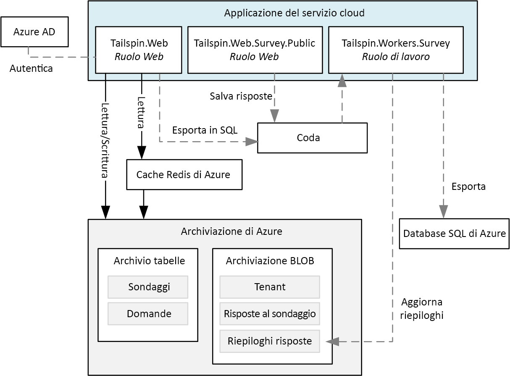

# <a name="refactor-an-azure-service-fabric-application-migrated-from-azure-cloud-services"></a>Effettuare il refactoring di un'applicazione di Azure Service Fabric migrata da Servizi cloud di Azure

[ Codice di esempio][sample-code]

Questo articolo illustra il refactoring di un'applicazione di Azure Service Fabric esistente in un'architettura più granulare. L'articolo è incentrato su considerazioni relative a progettazione, creazione di pacchetti, prestazioni e distribuzione dell'applicazione di Service Fabric con refactoring.

## <a name="scenario"></a>Scenario

Come illustrato nell'articolo precedente, [Eseguire la migrazione di un'applicazione di Servizi cloud di Azure in Azure Service Fabric][migrate-from-cloud-services], il team di Patterns & Practices ha pubblicato nel 2012 un libro relativo al processo di progettazione e implementazione di un'applicazione di Servizi cloud in Azure. Il libro descrive un'azienda fittizia denominata Tailspin che vuole creare un'applicazione di Servizi cloud denominata **Surveys**. L'applicazione Surveys consente agli utenti di creare e pubblicare sondaggi a cui il pubblico può rispondere. Il diagramma seguente mostra l'architettura di questa versione dell'applicazione Surveys:



Il ruolo Web **Tailspin.Web** ospita un sito Web ASP.NET MVC usato dai clienti di Tailspin per eseguire queste operazioni:
* Iscrizione all'applicazione Surveys
* Creazione o eliminazione di un singolo sondaggio
* Visualizzazione dei risultati per un singolo sondaggio
* Richiesta dell'esportazione dei risultati del sondaggio in SQL
* Visualizzazione dei risultati aggregati del sondaggio e dell'analisi

Il ruolo Web **Tailspin.Web.Survey.Public** ospita anche un sito ASP.NET MVC visitato dal pubblico per compilare i sondaggi. Queste risposte vengono inserite in una coda per il salvataggio.

Il ruolo di lavoro **Tailspin.Workers.Survey** esegue l'elaborazione in background per la ricezione di richieste da più code.

Il team di Patterns & Practices ha creato un nuovo progetto per il trasferimento di questa applicazione in Azure Service Fabric. L'obiettivo di questo progetto consiste nell'apportare solo le modifiche necessarie al codice per eseguire l'applicazione in un cluster di Azure Service Fabric. I ruoli Web e di lavoro originali non sono stati quindi scomposti in un'architettura più granulare. L'architettura risultante è molto simile alla versione per servizio cloud dell'applicazione:


Il servizio **Tailspin.Web** viene trasferito dal ruolo Web *Tailspin.Web* originale.

Il servizio **Tailspin.Web.Survey.Public** viene trasferito dal ruolo Web *Tailspin.Web.Survey.Public* originale.

Il servizio **Tailspin.AnswerAnalysisService** viene trasferito dal ruolo di lavoro *Tailspin.Workers.Survey* originale.

> [!NOTE] 
> Anche se sono state apportate modifiche minime a ogni ruolo Web e di lavoro, **Tailspin.Web** e **Tailspin.Web.Survey.Public** sono stati modificati per l'hosting automatico di un server Web [Kestrel]. L'applicazione Surveys precedente è un'applicazione ASP.Net ospitata tramite Interet Information Services (IIS), ma non è possibile eseguire IIS come servizio in Service Fabric. Qualsiasi server Web deve essere quindi in grado di eseguire l'hosting automatico, ad esempio [Kestrel]. È possibile eseguire IIS in un contenitore in Service Fabric in alcune situazioni. Per altre informazioni, vedere gli [scenari per l'uso dei contenitori][container-scenarios].  

Tailspin effettua ora il refactoring dell'applicazione Surveys in un'architettura più granulare. La motivazione di Tailspin per il refactoring consiste nel semplificare lo sviluppo, la compilazione e la distribuzione dell'applicazione Surveys. Tramite la scomposizione dei ruoli Web e di lavoro esistenti in un'architettura più granulare, Tailspin vuole rimuovere le comunicazioni strettamente associate esistenti e le dipendenze dei dati tra questi ruoli.

Tailspin ritiene che lo spostamento dell'applicazione Surveys in un'architettura più granulare possa offrire altri vantaggi:
* Ogni servizio può essere organizzato in pacchetti in progetti indipendenti con un ambito sufficientemente ridotto da consentire la gestione da parte di un team di piccole dimensioni.
* È possibile specificare la versione e distribuire in modo indipendente ogni servizio.
* Ogni servizio può essere implementato tramite la tecnologia migliore per il servizio specifico. Un cluster di Service Fabric può ad esempio includere servizi creati con versioni diverse di .NET Framework, Java o altri linguaggi come C o C++.
* Ogni servizio può essere ridimensionato in modo indipendente per rispondere a incrementi e riduzioni del carico.

> [!NOTE] 
> La multi-tenancy non è inclusa nell'ambito del refactoring di questa applicazione. Tailspin offre alcune opzioni per il supporto della multi-tenancy e può prendere successivamente le decisioni relative alla progettazione, senza influire sulla progettazione iniziale. Ad esempio, Tailspin può creare istanze separate dei servizi per ogni tenant in un cluster o creare un cluster separato per ogni tenant.

## <a name="design-considerations"></a>Considerazioni sulla progettazione
 
Il diagramma seguente mostra l'architettura dell'applicazione Surveys sottoposta a refactoring in un'architettura più granulare:


**Tailspin.Web** è un servizio senza stato con hosting automatico di un'applicazione ASP.NET MVC che i clienti di Tailspin visitano per creare sondaggi e visualizzare i risultati dei sondaggi. Questo servizio condivide la maggior parte del codice con il servizio *Tailspin.Web* dall'applicazione di Service Fabric trasferita. Come indicato in precedenza, questo servizio usa ASP.NET Core e passa dall'uso di Kestrel come front-end Web all'implementazione di un WebListener.

Anche **Tailspin.Web.Surveys.Public** è un servizio senza stato con hosting automatico di un sito ASP.NET MVC. Gli utenti visitano questo sito per selezionare sondaggi da un elenco e compilarli. Questo servizio condivide la maggior parte del codice con il servizio *Tailspin.Web.Survey.Public* dall'applicazione di Service Fabric trasferita. Anche questo servizio usa ASP.NET Core e passa dall'uso di Kestrel come front-end Web all'implementazione di un WebListener.

**Tailspin.SurveyResponseService** è un servizio con stato che archivia le risposte ai sondaggi nell'Archiviazione BLOB di Azure. Unisce inoltre le risposte nei dati di analisi dei sondaggi. Il servizio viene implementato come servizio con stato perché usa una coda [ReliableConcurrentQueue][reliable-concurrent-queue] per elaborare in batch le risposte ai sondaggi. Questa funzionalità è stata implementata in origine nel servizio *Tailspin.Web.Survey.Public* nell'applicazione di Service Fabric trasferita. Tailspin ha effettuato il refactoring della funzionalità originale nel servizio per consentirne il ridimensionamento indipendente.

**Tailspin.SurveyManagementService** è un servizio senza stato che archivia e recupera sondaggi e domande dei sondaggi. Il servizio usa l'Archiviazione BLOB di Azure. Anche questa funzionalità è stata implementata in origine nel servizio *Tailspin.AnswerAnalysisService* nell'applicazione di Service Fabric trasferita. Tailspin ha effettuato il refactoring della funzionalità originale in questo servizio, per consentire anche in questo caso il ridimensionamento indipendente.

**Tailspin.SurveyAnswerService** è un servizio senza stato che recupera risposte dei sondaggi e analisi dei sondaggi. Anche questo servizio usa l'Archiviazione BLOB di Azure. Anche questa funzionalità è stata implementata in origine nel servizio *Tailspin.AnswerAnalysisService* nell'applicazione di Service Fabric trasferita. Tailspin ha effettuato il refactoring della funzionalità originale in questo servizio perché prevede un carico minore e vuole usare un numero minore di istanze per conservare le risorse.

**Tailspin.SurveyAnalysisService** è un servizio senza stato che salva in modo permanente i dati di riepilogo delle risposte ai sondaggi in una cache Redis per un recupero rapido. Questo servizio viene chiamato da *Tailspin.SurveyResponseService* a ogni risposta a un sondaggio e i nuovi dati relativi alle risposte ai sondaggi vengono uniti ai dati di riepilogo. Il servizio include le funzionalità rimanenti nel servizio *Tailspin.SurveyAnalysisService* dall'applicazione di Service Fabric trasferita.

## <a name="stateless-versus-stateful-services"></a>Confronto tra servizi con e senza stato

Azure Service Fabric supporta i modelli di programmazione seguenti:
* Il modello eseguibile guest consente l'organizzazione di qualsiasi file eseguibile in pacchetti come servizio e la distribuzione in un cluster di Service Fabric. Service Fabric gestisce l'orchestrazione e l'esecuzione degli eseguibili guest.
* Il modello a contenitori consente la distribuzione dei servizi in immagini del contenitore. Service Fabric supporta la creazione e la gestione di contenitori su contenitori del kernel Linux oltre a contenitori di Windows Server. 
* Il modello di programmazione Reliable Services consente la creazione di servizi con o senza stato, integrati con tutte le funzionalità della piattaforma di Service Fabric. I servizi con stato consentono l'archiviazione dello stato replicato nel cluster di Service Fabric. I servizi senza stato non offrono questa opzione.
* Il modello di programmazione Reliable Actors consente la creazione di servizi che implementano il modello con criterio Actor virtuale.

Tutti i servizi dell'applicazione Surveys sono istanze senza server di Reliable Services, ad eccezione del servizio *Tailspin.SurveyResponseService*. Questo servizio implementa una coda [ReliableConcurrentQueue][reliable-concurrent-queue] per elaborare le risposte ai sondaggi quando vengono ricevute. Le risposte nella coda ReliableConcurrentQueue vengono salvate nell'Archiviazione BLOB di Azure e vengono passate a *Tailspin.SurveyAnalysisService* per l'analisi. Tailspin sceglie una coda ReliableConcurrentQueue perché le risposte non richiedono un ordinamento FIFO (First In First Out ) fornito da una coda, ad esempio dal bus di servizio di Azure. Una coda ReliableConcurrentQueue è progettata inoltre per offrire velocità effettiva elevata e bassa latenza per operazioni di accodamento e di rimozione della coda.

Si noti che le operazioni per il salvataggio permanente degli elementi rimossi da una coda ReliableConcurrentQueue dovrebbero essere idempotenti. Se viene generata un'eccezione durante l'elaborazione di un elemento della coda, è possibile che lo stesso elemento venga elaborato più volte. Nell'applicazione Surveys l'operazione di unione delle risposte ai sondaggi in *Tailspin.SurveyAnalysisService* non è idempotente perché Tailspin ha deciso che i dati di analisi dei sondaggi rappresentano solo uno snapshot corrente dei dati di analisi e non è necessario che siano coerenti. Le risposte ai sondaggi salvate nell'Archiviazione BLOB di Azure sono effettivamente coerenti, quindi l'analisi finale dei sondaggi può essere sempre ricalcolata correttamente da tali dati.

## <a name="communication-framework"></a>Framework di comunicazione

Ogni servizio nell'applicazione Surveys comunica tramite un'API Web RESTful. Le API RESTful offrono i vantaggi seguenti:
* Facilità d'uso: ogni servizio viene creato tramite ASP.NET Core MVC, che supporta in modalità nativa la creazione di API Web.
* Sicurezza: benché ogni servizio non richieda SSL, Tailspin potrebbe richiederlo per ogni servizio. 
* Controllo delle versioni: i client possono essere scritti e testati su una versione specifica di un'API Web.

I servizi dell'applicazione Survey usano il [proxy inverso][reverse-proxy] implementato da Service Fabric. Il proxy inverso è un servizio che viene eseguito in ogni nodo nel cluster di Service Fabric e fornisce la risoluzione degli endpoint, i tentativi automatici e la gestione di altri tipi di errori di connessione. Per usare il proxy inverso, ogni chiamata dell'API RESTful a un servizio specifico viene effettuata tramite una porta predefinita per il proxy inverso.  Se, ad esempio, la porta del proxy inverso è stata impostata su **19081**, è possibile effettuare una chiamata a *Tailspin.SurveyAnswerService* come illustrato di seguito:

```csharp
static SurveyAnswerService()
{
    httpClient = new HttpClient
    {
        BaseAddress = new Uri("http://localhost:19081/Tailspin/SurveyAnswerService/")
    };
}
```
Per abilitare il proxy inverso, specificare una porta del proxy inverso durante la creazione del cluster di Service Fabric. Per altre informazioni, vedere [Proxy inverso][reverse-proxy] in Azure Service Fabric.

## <a name="performance-considerations"></a>Considerazioni sulle prestazioni

Tailspin ha creato servizi di ASP.NET Core per *Tailspin.Web* e *Tailspin.Web.Surveys.Public* tramite modelli di Visual Studio. Per impostazione predefinita, questi modelli includono la registrazione nella console. La registrazione nella console può essere eseguita durante lo sviluppo e il debug, ma tutte le informazioni di registrazione nella console devono essere rimosse quando l'applicazione viene distribuita in produzione.

> [!NOTE]
> Per altre informazioni sulla configurazione del monitoraggio e della diagnostica per applicazioni di Service Fabric in esecuzione in produzione, vedere [monitoraggio e diagnostica][monitoring-diagnostics] per Azure Service Fabric.

Ad esempio, le righe seguenti in *startup.cs* per ogni servizio front-end Web devono essere impostate come commento:

```csharp
// This method gets called by the runtime. Use this method to configure the HTTP request pipeline.
public void Configure(IApplicationBuilder app, IHostingEnvironment env, ILoggerFactory loggerFactory)
{
    //loggerFactory.AddConsole(Configuration.GetSection("Logging"));
    //loggerFactory.AddDebug();

    app.UseMvc();
}
```

> [!NOTE]
> Queste righe possono essere escluse in modo condizionale quando Visual Studio viene impostato su "rilascio" in caso di pubblicazione.

Quando Tailspin distribuisce infine l'applicazione Tailspin in produzione, si passa alla modalità di **rilascio** per Visual Studio.

## <a name="deployment-considerations"></a>Considerazioni sulla distribuzione

L'applicazione Surveys sottoposta a refactoring è costituita da cinque servizi senza stato e un servizio con stato, quindi la pianificazione del cluster è limitata alla determinazione delle dimensioni corrette per le VM e del numero di nodi. Nel file *applicationmanifest.xml* che descrive il cluster Tailspin imposta l'attributo *InstanceCount* del tag *StatelessService* su -1 per ogni servizio. Un valore pari a -1 indica a Service Fabric che è necessario creare un'istanza del servizio in ogni nodo del cluster.

> [!NOTE]
> I servizi con stato richiedono il passaggio aggiuntivo della pianificazione del numero corretto di partizioni e di repliche per i rispettivi dati.

Tailspin distribuisce il cluster con il portale di Azure. Il tipo di risorsa Cluster di Service Fabric distribuisce tutta l'infrastruttura necessaria, inclusi i set di scalabilità di VM e un servizio di bilanciamento del carico. Le dimensioni consigliate per le VM vengono visualizzate nel portale di Azure durante il processo di provisioning per il cluster di Service Fabric. Si noti che poiché le VM vengono distribuite in un set di scalabilità di VM, possono essere ridimensionate in base all'incremento del caricamento utente.

> [!NOTE]
> Come illustrato in precedenza, nella versione sottoposta a migrazione dell'applicazione Surveys i due front-end Web eseguivano l'hosting automatico tramite ASP.NET Core e Kestrel come server Web. Benché la versione sottoposta alla migrazione dell'applicazione Survey non usi un proxy inverso, è consigliabile usare un proxy inverso come IIS, Nginx o Apache. Per altre informazioni, vedere l'[introduzione a un'implementazione del server Web Kestrel in ASP.NET Core][kestrel-intro].
> Nell'applicazione Surveys sottoposta a refactoring i due front-end eseguono l'hosting automatico tramite ASP.NET Core con [WebListener][weblistener] come server Web, quindi non è necessario usare un proxy inverso.

## <a name="next-steps"></a>Passaggi successivi

Il codice dell'applicazione Surveys è disponibile in [GitHub][sample-code].

Se si sta iniziando a usare [Azure Service Fabric][service-fabric], configurare prima di tutto l'ambiente di sviluppo e quindi scaricare l'[Azure SDK][azure-sdk] più recente e quindi [Azure Service Fabric SDK][service-fabric-sdk]. L'SDK include lo strumento di gestione cluster OneBox, che consente di distribuire e testare l'applicazione Surveys localmente con debug F5 completo.

<!-- links -->
[azure-sdk]: https://azure.microsoft.com/en-us/downloads/archive-net-downloads/
[container-scenarios]: /azure/service-fabric/service-fabric-containers-overview
[kestrel]: https://docs.microsoft.com/aspnet/core/fundamentals/servers/kestrel?tabs=aspnetcore2x
[kestrel-intro]: https://docs.microsoft.com/aspnet/core/fundamentals/servers/kestrel?tabs=aspnetcore1x
[migrate-from-cloud-services]: migrate-from-cloud-services.md
[monitoring-diagnostics]: /azure/service-fabric/service-fabric-diagnostics-overview
[reliable-concurrent-queue]: /azure/service-fabric/service-fabric-reliable-services-reliable-concurrent-queue
[reverse-proxy]: /azure/service-fabric/service-fabric-reverseproxy
[sample-code]: https://github.com/mspnp/cloud-services-to-service-fabric/tree/master/servicefabric-phase-2
[service-fabric]: /azure/service-fabric/service-fabric-get-started
[service-fabric-sdk]: /azure/service-fabric/service-fabric-get-started
[weblistener]: https://docs.microsoft.com/aspnet/core/fundamentals/servers/weblistener