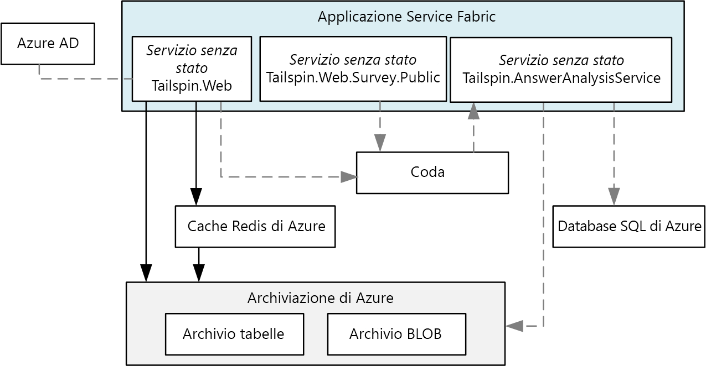

# <a name="refactor-an-azure-service-fabric-application-migrated-from-azure-cloud-services"></a><span data-ttu-id="1eab6-103">Effettuare il refactoring di un'applicazione di Azure Service Fabric migrata da Servizi cloud di Azure</span><span class="sxs-lookup"><span data-stu-id="1eab6-103">Refactor an Azure Service Fabric Application migrated from Azure Cloud Services</span></span>

<span data-ttu-id="1eab6-104">[ Codice di esempio][sample-code]</span><span class="sxs-lookup"><span data-stu-id="1eab6-104">[ Sample code][sample-code]</span></span>

<span data-ttu-id="1eab6-105">Questo articolo illustra il refactoring di un'applicazione di Azure Service Fabric esistente in un'architettura più granulare.</span><span class="sxs-lookup"><span data-stu-id="1eab6-105">This article describes refactoring an existing Azure Service Fabric application to a more granular architecture.</span></span> <span data-ttu-id="1eab6-106">L'articolo è incentrato su considerazioni relative a progettazione, creazione di pacchetti, prestazioni e distribuzione dell'applicazione di Service Fabric con refactoring.</span><span class="sxs-lookup"><span data-stu-id="1eab6-106">This article focuses on the design, packaging, performance, and deployment considerations of the refactored Service Fabric application.</span></span>

## <a name="scenario"></a><span data-ttu-id="1eab6-107">Scenario</span><span class="sxs-lookup"><span data-stu-id="1eab6-107">Scenario</span></span>

<span data-ttu-id="1eab6-108">Come illustrato nell'articolo precedente, [Eseguire la migrazione di un'applicazione di Servizi cloud di Azure in Azure Service Fabric][migrate-from-cloud-services], il team di Patterns & Practices ha pubblicato nel 2012 un libro relativo al processo di progettazione e implementazione di un'applicazione di Servizi cloud in Azure.</span><span class="sxs-lookup"><span data-stu-id="1eab6-108">As discussed in the previous article, [Migrating an Azure Cloud Services application to Azure Service Fabric][migrate-from-cloud-services], the patterns & practices team authored a book in 2012 that documented the process for designing and implementing a Cloud Services application in Azure.</span></span> <span data-ttu-id="1eab6-109">Il libro descrive un'azienda fittizia denominata Tailspin che vuole creare un'applicazione di Servizi cloud denominata **Surveys**.</span><span class="sxs-lookup"><span data-stu-id="1eab6-109">The book describes a fictitious company named Tailspin that wants to create a Cloud Services application named **Surveys**.</span></span> <span data-ttu-id="1eab6-110">L'applicazione Surveys consente agli utenti di creare e pubblicare sondaggi a cui il pubblico può rispondere.</span><span class="sxs-lookup"><span data-stu-id="1eab6-110">The Surveys application allows users to create and publish surveys that can be answered by the public.</span></span> <span data-ttu-id="1eab6-111">Il diagramma seguente mostra l'architettura di questa versione dell'applicazione Surveys:</span><span class="sxs-lookup"><span data-stu-id="1eab6-111">The following diagram shows the architecture of this version of the Surveys application:</span></span>


<span data-ttu-id="1eab6-112">Il ruolo Web **Tailspin.Web** ospita un sito Web ASP.NET MVC usato dai clienti di Tailspin per eseguire queste operazioni:</span><span class="sxs-lookup"><span data-stu-id="1eab6-112">The **Tailspin.Web** web role hosts an ASP.NET MVC site that Tailspin customers use to:</span></span>
* <span data-ttu-id="1eab6-113">Iscrizione all'applicazione Surveys</span><span class="sxs-lookup"><span data-stu-id="1eab6-113">sign up for the Surveys application,</span></span>
* <span data-ttu-id="1eab6-114">Creazione o eliminazione di un singolo sondaggio</span><span class="sxs-lookup"><span data-stu-id="1eab6-114">create or delete a single survey,</span></span>
* <span data-ttu-id="1eab6-115">Visualizzazione dei risultati per un singolo sondaggio</span><span class="sxs-lookup"><span data-stu-id="1eab6-115">view results for a single survey,</span></span>
* <span data-ttu-id="1eab6-116">Richiesta dell'esportazione dei risultati del sondaggio in SQL</span><span class="sxs-lookup"><span data-stu-id="1eab6-116">request that survey results be exported to SQL, and</span></span>
* <span data-ttu-id="1eab6-117">Visualizzazione dei risultati aggregati del sondaggio e dell'analisi</span><span class="sxs-lookup"><span data-stu-id="1eab6-117">view aggregated survey results and analysis.</span></span>

<span data-ttu-id="1eab6-118">Il ruolo Web **Tailspin.Web.Survey.Public** ospita anche un sito ASP.NET MVC visitato dal pubblico per compilare i sondaggi.</span><span class="sxs-lookup"><span data-stu-id="1eab6-118">The **Tailspin.Web.Survey.Public** web role also hosts an ASP.NET MVC site that the public visits to fill out the surveys.</span></span> <span data-ttu-id="1eab6-119">Queste risposte vengono inserite in una coda per il salvataggio.</span><span class="sxs-lookup"><span data-stu-id="1eab6-119">These responses are put in a queue to be saved.</span></span>

<span data-ttu-id="1eab6-120">Il ruolo di lavoro **Tailspin.Workers.Survey** esegue l'elaborazione in background per la ricezione di richieste da più code.</span><span class="sxs-lookup"><span data-stu-id="1eab6-120">The **Tailspin.Workers.Survey** worker role performs background processing by picking up requests from multiple queues.</span></span>

<span data-ttu-id="1eab6-121">Il team di Patterns & Practices ha creato un nuovo progetto per il trasferimento di questa applicazione in Azure Service Fabric.</span><span class="sxs-lookup"><span data-stu-id="1eab6-121">The patterns & practices team then created a new project to port this application to Azure Service Fabric.</span></span> <span data-ttu-id="1eab6-122">L'obiettivo di questo progetto consiste nell'apportare solo le modifiche necessarie al codice per eseguire l'applicazione in un cluster di Azure Service Fabric.</span><span class="sxs-lookup"><span data-stu-id="1eab6-122">The goal of this project was to make only the necessary code changes to get the application running in an Azure Service Fabric cluster.</span></span> <span data-ttu-id="1eab6-123">I ruoli Web e di lavoro originali non sono stati quindi scomposti in un'architettura più granulare.</span><span class="sxs-lookup"><span data-stu-id="1eab6-123">As a result, the original web and worker roles were not decomposed into a more granular architecture.</span></span> <span data-ttu-id="1eab6-124">L'architettura risultante è molto simile alla versione per servizio cloud dell'applicazione:</span><span class="sxs-lookup"><span data-stu-id="1eab6-124">The resulting architecture is very similar to the Cloud Service version of the application:</span></span>



<span data-ttu-id="1eab6-125">Il servizio **Tailspin.Web** viene trasferito dal ruolo Web *Tailspin.Web* originale.</span><span class="sxs-lookup"><span data-stu-id="1eab6-125">The **Tailspin.Web** service is ported from the original *Tailspin.Web* web role.</span></span>

<span data-ttu-id="1eab6-126">Il servizio **Tailspin.Web.Survey.Public** viene trasferito dal ruolo Web *Tailspin.Web.Survey.Public* originale.</span><span class="sxs-lookup"><span data-stu-id="1eab6-126">The **Tailspin.Web.Survey.Public** service is ported from the original *Tailspin.Web.Survey.Public* web role.</span></span>

<span data-ttu-id="1eab6-127">Il servizio **Tailspin.AnswerAnalysisService** viene trasferito dal ruolo di lavoro *Tailspin.Workers.Survey* originale.</span><span class="sxs-lookup"><span data-stu-id="1eab6-127">The **Tailspin.AnswerAnalysisService** service is ported from the original *Tailspin.Workers.Survey* worker role.</span></span>

> [!NOTE] 
> <span data-ttu-id="1eab6-128">Anche se sono state apportate modifiche minime a ogni ruolo Web e di lavoro, **Tailspin.Web** e **Tailspin.Web.Survey.Public** sono stati modificati per l'hosting automatico di un server Web [Kestrel].</span><span class="sxs-lookup"><span data-stu-id="1eab6-128">While minimal code changes were made to each of the web and worker roles, **Tailspin.Web** and **Tailspin.Web.Survey.Public** were modified to self-host a [Kestrel] web server.</span></span> <span data-ttu-id="1eab6-129">L'applicazione Surveys precedente è un'applicazione ASP.Net ospitata tramite Interet Information Services (IIS), ma non è possibile eseguire IIS come servizio in Service Fabric.</span><span class="sxs-lookup"><span data-stu-id="1eab6-129">The earlier Surveys application is an ASP.Net application that was hosted using Interet Information Services (IIS), but it is not possible to run IIS as a service in Service Fabric.</span></span> <span data-ttu-id="1eab6-130">Qualsiasi server Web deve essere quindi in grado di eseguire l'hosting automatico, ad esempio [Kestrel].</span><span class="sxs-lookup"><span data-stu-id="1eab6-130">Therefore, any web server must be capable of being self-hosted, such as [Kestrel].</span></span> <span data-ttu-id="1eab6-131">È possibile eseguire IIS in un contenitore in Service Fabric in alcune situazioni.</span><span class="sxs-lookup"><span data-stu-id="1eab6-131">It is possible to run IIS in a container in Service Fabric in some situations.</span></span> <span data-ttu-id="1eab6-132">Per altre informazioni, vedere gli [scenari per l'uso dei contenitori][container-scenarios].</span><span class="sxs-lookup"><span data-stu-id="1eab6-132">See [scenarios for using containers][container-scenarios] for more information.</span></span>  

<span data-ttu-id="1eab6-133">Tailspin effettua ora il refactoring dell'applicazione Surveys in un'architettura più granulare.</span><span class="sxs-lookup"><span data-stu-id="1eab6-133">Now, Tailspin is refactoring the Surveys application to a more granular architecture.</span></span> <span data-ttu-id="1eab6-134">La motivazione di Tailspin per il refactoring consiste nel semplificare lo sviluppo, la compilazione e la distribuzione dell'applicazione Surveys.</span><span class="sxs-lookup"><span data-stu-id="1eab6-134">Tailspin's motivation for refactoring is to make it easier to develop, build, and deploy the Surveys application.</span></span> <span data-ttu-id="1eab6-135">Tramite la scomposizione dei ruoli Web e di lavoro esistenti in un'architettura più granulare, Tailspin vuole rimuovere le comunicazioni strettamente associate esistenti e le dipendenze dei dati tra questi ruoli.</span><span class="sxs-lookup"><span data-stu-id="1eab6-135">By decomposing the existing web and worker roles to a more granular architecture, Tailspin wants to remove the existing tightly coupled communication and data dependencies between these roles.</span></span>

<span data-ttu-id="1eab6-136">Tailspin ritiene che lo spostamento dell'applicazione Surveys in un'architettura più granulare possa offrire altri vantaggi:</span><span class="sxs-lookup"><span data-stu-id="1eab6-136">Tailspin sees other benefits in moving the Surveys application to a more granular architecture:</span></span>
* <span data-ttu-id="1eab6-137">Ogni servizio può essere organizzato in pacchetti in progetti indipendenti con un ambito sufficientemente ridotto da consentire la gestione da parte di un team di piccole dimensioni.</span><span class="sxs-lookup"><span data-stu-id="1eab6-137">Each service can be packaged into independent projects with a scope small enough to be managed by a small team.</span></span>
* <span data-ttu-id="1eab6-138">È possibile specificare la versione e distribuire in modo indipendente ogni servizio.</span><span class="sxs-lookup"><span data-stu-id="1eab6-138">Each service can be independently versioned and deployed.</span></span>
* <span data-ttu-id="1eab6-139">Ogni servizio può essere implementato tramite la tecnologia migliore per il servizio specifico.</span><span class="sxs-lookup"><span data-stu-id="1eab6-139">Each service can be implemented using the best technology for that service.</span></span> <span data-ttu-id="1eab6-140">Un cluster di Service Fabric può ad esempio includere servizi creati con versioni diverse di .NET Framework, Java o altri linguaggi come C o C++.</span><span class="sxs-lookup"><span data-stu-id="1eab6-140">For example, a service fabric cluster can include services built using different versions of the .Net Frameworks, Java, or other languages such as C or C++.</span></span>
* <span data-ttu-id="1eab6-141">Ogni servizio può essere ridimensionato in modo indipendente per rispondere a incrementi e riduzioni del carico.</span><span class="sxs-lookup"><span data-stu-id="1eab6-141">Each service can be independently scaled to respond to increases and decreases in load.</span></span>

> [!NOTE] 
> <span data-ttu-id="1eab6-142">La multi-tenancy non è inclusa nell'ambito del refactoring di questa applicazione.</span><span class="sxs-lookup"><span data-stu-id="1eab6-142">Multitenancy is out of scope for the refactoring of this application.</span></span> <span data-ttu-id="1eab6-143">Tailspin offre alcune opzioni per il supporto della multi-tenancy e può prendere successivamente le decisioni relative alla progettazione, senza influire sulla progettazione iniziale.</span><span class="sxs-lookup"><span data-stu-id="1eab6-143">Tailspin has several options to support multitenancy and can make these design decisions later without affecting the initial design.</span></span> <span data-ttu-id="1eab6-144">Ad esempio, Tailspin può creare istanze separate dei servizi per ogni tenant in un cluster o creare un cluster separato per ogni tenant.</span><span class="sxs-lookup"><span data-stu-id="1eab6-144">For example, Tailspin can create separate instances of the services for each tenant within a cluster or create a separate cluster for each tenant.</span></span>

## <a name="design-considerations"></a><span data-ttu-id="1eab6-145">Considerazioni sulla progettazione</span><span class="sxs-lookup"><span data-stu-id="1eab6-145">Design considerations</span></span>
 
<span data-ttu-id="1eab6-146">Il diagramma seguente mostra l'architettura dell'applicazione Surveys sottoposta a refactoring in un'architettura più granulare:</span><span class="sxs-lookup"><span data-stu-id="1eab6-146">The following diagram shows the architecture of the Surveys application refactored to a more granular architecture:</span></span>


<span data-ttu-id="1eab6-147">**Tailspin.Web** è un servizio senza stato con hosting automatico di un'applicazione ASP.NET MVC che i clienti di Tailspin visitano per creare sondaggi e visualizzare i risultati dei sondaggi.</span><span class="sxs-lookup"><span data-stu-id="1eab6-147">**Tailspin.Web** is a stateless service self-hosting an ASP.NET MVC application that Tailspin customers visit to create surveys and view survey results.</span></span> <span data-ttu-id="1eab6-148">Questo servizio condivide la maggior parte del codice con il servizio *Tailspin.Web* dall'applicazione di Service Fabric trasferita.</span><span class="sxs-lookup"><span data-stu-id="1eab6-148">This service shares most of its code with the *Tailspin.Web* service from the ported Service Fabric application.</span></span> <span data-ttu-id="1eab6-149">Come indicato in precedenza, questo servizio usa ASP.NET Core e passa dall'uso di Kestrel come front-end Web all'implementazione di un WebListener.</span><span class="sxs-lookup"><span data-stu-id="1eab6-149">As mentioned earlier, this service uses ASP.NET core and switches from using Kestrel as web frontend to implementing a WebListener.</span></span>

<span data-ttu-id="1eab6-150">Anche **Tailspin.Web.Surveys.Public** è un servizio senza stato con hosting automatico di un sito ASP.NET MVC.</span><span class="sxs-lookup"><span data-stu-id="1eab6-150">**Tailspin.Web.Surveys.Public** is a stateless service also self-hosting an ASP.NET MVC site.</span></span> <span data-ttu-id="1eab6-151">Gli utenti visitano questo sito per selezionare sondaggi da un elenco e compilarli. Questo servizio condivide la maggior parte del codice con il servizio *Tailspin.Web.Survey.Public* dall'applicazione di Service Fabric trasferita.</span><span class="sxs-lookup"><span data-stu-id="1eab6-151">Users visit this site to select surveys from a list and then fill them out. This service shares most of its code with the *Tailspin.Web.Survey.Public* service from the ported Service Fabric application.</span></span> <span data-ttu-id="1eab6-152">Anche questo servizio usa ASP.NET Core e passa dall'uso di Kestrel come front-end Web all'implementazione di un WebListener.</span><span class="sxs-lookup"><span data-stu-id="1eab6-152">This service also uses ASP.NET Core and also switches from using Kestrel as web frontend to implementing a WebListener.</span></span>

<span data-ttu-id="1eab6-153">**Tailspin.SurveyResponseService** è un servizio con stato che archivia le risposte ai sondaggi nell'Archiviazione BLOB di Azure.</span><span class="sxs-lookup"><span data-stu-id="1eab6-153">**Tailspin.SurveyResponseService** is a stateful service that stores survey answers in Azure Blob Storage.</span></span> <span data-ttu-id="1eab6-154">Unisce inoltre le risposte nei dati di analisi dei sondaggi.</span><span class="sxs-lookup"><span data-stu-id="1eab6-154">It also merges answers into the survey analysis data.</span></span> <span data-ttu-id="1eab6-155">Il servizio viene implementato come servizio con stato perché usa una coda [ReliableConcurrentQueue][reliable-concurrent-queue] per elaborare in batch le risposte ai sondaggi.</span><span class="sxs-lookup"><span data-stu-id="1eab6-155">The service is implemented as a stateful service because it uses a [ReliableConcurrentQueue][reliable-concurrent-queue] to process survey answers in batches.</span></span> <span data-ttu-id="1eab6-156">Questa funzionalità è stata implementata in origine nel servizio *Tailspin.Web.Survey.Public* nell'applicazione di Service Fabric trasferita.</span><span class="sxs-lookup"><span data-stu-id="1eab6-156">This functionality was originally implemented in the *Tailspin.Web.Survey.Public* service in the ported Service Fabric application.</span></span> <span data-ttu-id="1eab6-157">Tailspin ha effettuato il refactoring della funzionalità originale nel servizio per consentirne il ridimensionamento indipendente.</span><span class="sxs-lookup"><span data-stu-id="1eab6-157">Tailspin refactored the original functionality into this service to allow it to scale independently.</span></span>

<span data-ttu-id="1eab6-158">**Tailspin.SurveyManagementService** è un servizio senza stato che archivia e recupera sondaggi e domande dei sondaggi.</span><span class="sxs-lookup"><span data-stu-id="1eab6-158">**Tailspin.SurveyManagementService** is a stateless service that stores and retrieves surveys and survey questions.</span></span> <span data-ttu-id="1eab6-159">Il servizio usa l'Archiviazione BLOB di Azure.</span><span class="sxs-lookup"><span data-stu-id="1eab6-159">The service uses Azure Blob storage.</span></span> <span data-ttu-id="1eab6-160">Anche questa funzionalità è stata implementata in origine nel servizio *Tailspin.AnswerAnalysisService* nell'applicazione di Service Fabric trasferita.</span><span class="sxs-lookup"><span data-stu-id="1eab6-160">This functionality was also originally implemented in the *Tailspin.AnswerAnalysisService* service in the ported Service Fabric application.</span></span> <span data-ttu-id="1eab6-161">Tailspin ha effettuato il refactoring della funzionalità originale in questo servizio, per consentire anche in questo caso il ridimensionamento indipendente.</span><span class="sxs-lookup"><span data-stu-id="1eab6-161">Tailspin refactored the original functionality into this service to also allow it to scale independently.</span></span>

<span data-ttu-id="1eab6-162">**Tailspin.SurveyAnswerService** è un servizio senza stato che recupera risposte dei sondaggi e analisi dei sondaggi.</span><span class="sxs-lookup"><span data-stu-id="1eab6-162">**Tailspin.SurveyAnswerService** is a stateless service that retrieves survey answers and survey analysis.</span></span> <span data-ttu-id="1eab6-163">Anche questo servizio usa l'Archiviazione BLOB di Azure.</span><span class="sxs-lookup"><span data-stu-id="1eab6-163">The service also uses Azure Blob storage.</span></span> <span data-ttu-id="1eab6-164">Anche questa funzionalità è stata implementata in origine nel servizio *Tailspin.AnswerAnalysisService* nell'applicazione di Service Fabric trasferita.</span><span class="sxs-lookup"><span data-stu-id="1eab6-164">This functionality was also originally implemented in the *Tailspin.AnswerAnalysisService* service in the ported Service Fabric application.</span></span> <span data-ttu-id="1eab6-165">Tailspin ha effettuato il refactoring della funzionalità originale in questo servizio perché prevede un carico minore e vuole usare un numero minore di istanze per conservare le risorse.</span><span class="sxs-lookup"><span data-stu-id="1eab6-165">Tailspin refactored the original functionality into this service because it expects less load and wants to use fewer instances to conserve resources.</span></span>

<span data-ttu-id="1eab6-166">**Tailspin.SurveyAnalysisService** è un servizio senza stato che salva in modo permanente i dati di riepilogo delle risposte ai sondaggi in una cache Redis per un recupero rapido.</span><span class="sxs-lookup"><span data-stu-id="1eab6-166">**Tailspin.SurveyAnalysisService** is a stateless service that persists survey answer summary data in a Redis cache for quick retrieval.</span></span> <span data-ttu-id="1eab6-167">Questo servizio viene chiamato da *Tailspin.SurveyResponseService* a ogni risposta a un sondaggio e i nuovi dati relativi alle risposte ai sondaggi vengono uniti ai dati di riepilogo.</span><span class="sxs-lookup"><span data-stu-id="1eab6-167">This service is called by the *Tailspin.SurveyResponseService* each time a survey is answered and the new survey answer data is merged in the summary data.</span></span> <span data-ttu-id="1eab6-168">Il servizio include le funzionalità rimanenti nel servizio *Tailspin.SurveyAnalysisService* dall'applicazione di Service Fabric trasferita.</span><span class="sxs-lookup"><span data-stu-id="1eab6-168">This service includes the functionality remaining in the *Tailspin.SurveyAnalysisService* service from the ported Service Fabric application.</span></span>

## <a name="stateless-versus-stateful-services"></a><span data-ttu-id="1eab6-169">Confronto tra servizi con e senza stato</span><span class="sxs-lookup"><span data-stu-id="1eab6-169">Stateless versus stateful services</span></span>

<span data-ttu-id="1eab6-170">Azure Service Fabric supporta i modelli di programmazione seguenti:</span><span class="sxs-lookup"><span data-stu-id="1eab6-170">Azure Service Fabric supports the following programming models:</span></span>
* <span data-ttu-id="1eab6-171">Il modello eseguibile guest consente l'organizzazione di qualsiasi file eseguibile in pacchetti come servizio e la distribuzione in un cluster di Service Fabric.</span><span class="sxs-lookup"><span data-stu-id="1eab6-171">The guest executable model allows any executable to be packaged as a service and deployed to a Service Fabric cluster.</span></span> <span data-ttu-id="1eab6-172">Service Fabric gestisce l'orchestrazione e l'esecuzione degli eseguibili guest.</span><span class="sxs-lookup"><span data-stu-id="1eab6-172">Service Fabric orchestrates and manages execution of the guest executable.</span></span>
* <span data-ttu-id="1eab6-173">Il modello a contenitori consente la distribuzione dei servizi in immagini del contenitore.</span><span class="sxs-lookup"><span data-stu-id="1eab6-173">The container model allows for deployment of services in container images.</span></span> <span data-ttu-id="1eab6-174">Service Fabric supporta la creazione e la gestione di contenitori su contenitori del kernel Linux oltre a contenitori di Windows Server.</span><span class="sxs-lookup"><span data-stu-id="1eab6-174">Service Fabric supports creation and and management of containers on top of Linux kernel contains as well as Windows Server containers.</span></span> 
* <span data-ttu-id="1eab6-175">Il modello di programmazione Reliable Services consente la creazione di servizi con o senza stato, integrati con tutte le funzionalità della piattaforma di Service Fabric.</span><span class="sxs-lookup"><span data-stu-id="1eab6-175">The reliable services programming model allows for the creation of stateless or stateful services that integrate with all Service Fabric platform features.</span></span> <span data-ttu-id="1eab6-176">I servizi con stato consentono l'archiviazione dello stato replicato nel cluster di Service Fabric.</span><span class="sxs-lookup"><span data-stu-id="1eab6-176">Stateful services allow for replicated state to be stored in the Service Fabric cluster.</span></span> <span data-ttu-id="1eab6-177">I servizi senza stato non offrono questa opzione.</span><span class="sxs-lookup"><span data-stu-id="1eab6-177">Stateless services do not.</span></span>
* <span data-ttu-id="1eab6-178">Il modello di programmazione Reliable Actors consente la creazione di servizi che implementano il modello con criterio Actor virtuale.</span><span class="sxs-lookup"><span data-stu-id="1eab6-178">The reliable actors programming model allows for the creation of services that implement the virtual actor pattern.</span></span>

<span data-ttu-id="1eab6-179">Tutti i servizi dell'applicazione Surveys sono istanze senza server di Reliable Services, ad eccezione del servizio *Tailspin.SurveyResponseService*.</span><span class="sxs-lookup"><span data-stu-id="1eab6-179">All the services in the Surveys application are stateless reliable services, except for the *Tailspin.SurveyResponseService* service.</span></span> <span data-ttu-id="1eab6-180">Questo servizio implementa una coda [ReliableConcurrentQueue][reliable-concurrent-queue] per elaborare le risposte ai sondaggi quando vengono ricevute.</span><span class="sxs-lookup"><span data-stu-id="1eab6-180">This service implements a [ReliableConcurrentQueue][reliable-concurrent-queue] to process survey answers when they are received.</span></span> <span data-ttu-id="1eab6-181">Le risposte nella coda ReliableConcurrentQueue vengono salvate nell'Archiviazione BLOB di Azure e vengono passate a *Tailspin.SurveyAnalysisService* per l'analisi.</span><span class="sxs-lookup"><span data-stu-id="1eab6-181">Responses in the ReliableConcurrentQueue are saved into Azure Blob Storage and passed to the *Tailspin.SurveyAnalysisService* for analysis.</span></span> <span data-ttu-id="1eab6-182">Tailspin sceglie una coda ReliableConcurrentQueue perché le risposte non richiedono un ordinamento FIFO (First In First Out ) fornito da una coda, ad esempio dal bus di servizio di Azure.</span><span class="sxs-lookup"><span data-stu-id="1eab6-182">Tailspin chooses a ReliableConcurrentQueue based because responses do not require strict first-in-first-out (FIFO) ordering provided by a queue such as Azure Service Bus.</span></span> <span data-ttu-id="1eab6-183">Una coda ReliableConcurrentQueue è progettata inoltre per offrire velocità effettiva elevata e bassa latenza per operazioni di accodamento e di rimozione della coda.</span><span class="sxs-lookup"><span data-stu-id="1eab6-183">A ReliableConcurrentQueue is also designed to deliver high throughput and low latency for queue and dequeue operations.</span></span>

<span data-ttu-id="1eab6-184">Si noti che le operazioni per il salvataggio permanente degli elementi rimossi da una coda ReliableConcurrentQueue dovrebbero essere idempotenti.</span><span class="sxs-lookup"><span data-stu-id="1eab6-184">Note that operations to persist dequeued items from a ReliableConcurrentQueue should ideally be idempotent.</span></span> <span data-ttu-id="1eab6-185">Se viene generata un'eccezione durante l'elaborazione di un elemento della coda, è possibile che lo stesso elemento venga elaborato più volte.</span><span class="sxs-lookup"><span data-stu-id="1eab6-185">If an exception is thrown during the processing of an item from the queue, the same item may be processed more than once.</span></span> <span data-ttu-id="1eab6-186">Nell'applicazione Surveys l'operazione di unione delle risposte ai sondaggi in *Tailspin.SurveyAnalysisService* non è idempotente perché Tailspin ha deciso che i dati di analisi dei sondaggi rappresentano solo uno snapshot corrente dei dati di analisi e non è necessario che siano coerenti.</span><span class="sxs-lookup"><span data-stu-id="1eab6-186">In the Surveys application, the operation to merge survey answers to the *Tailspin.SurveyAnalysisService* is not idempotent because Tailspin decided that the survey analysis data is only a current snapshot of the analysis data and does not need to be consistent.</span></span> <span data-ttu-id="1eab6-187">Le risposte ai sondaggi salvate nell'Archiviazione BLOB di Azure sono effettivamente coerenti, quindi l'analisi finale dei sondaggi può essere sempre ricalcolata correttamente da tali dati.</span><span class="sxs-lookup"><span data-stu-id="1eab6-187">The survey answers saved to Azure Blob Storage are eventually consistent, so the survey final analysis can always be recalculated correctly from this data.</span></span>

## <a name="communication-framework"></a><span data-ttu-id="1eab6-188">Framework di comunicazione</span><span class="sxs-lookup"><span data-stu-id="1eab6-188">Communication framework</span></span>

<span data-ttu-id="1eab6-189">Ogni servizio nell'applicazione Surveys comunica tramite un'API Web RESTful.</span><span class="sxs-lookup"><span data-stu-id="1eab6-189">Each service in the Surveys application communicates using a RESTful web API.</span></span> <span data-ttu-id="1eab6-190">Le API RESTful offrono i vantaggi seguenti:</span><span class="sxs-lookup"><span data-stu-id="1eab6-190">RESTful APIs offer the following benefits:</span></span>
* <span data-ttu-id="1eab6-191">Facilità d'uso: ogni servizio viene creato tramite ASP.NET Core MVC, che supporta in modalità nativa la creazione di API Web.</span><span class="sxs-lookup"><span data-stu-id="1eab6-191">Ease of use: each service is built using ASP.Net Core MVC, which natively supports the creation of Web APIs.</span></span>
* <span data-ttu-id="1eab6-192">Sicurezza: benché ogni servizio non richieda SSL, Tailspin potrebbe richiederlo per ogni servizio.</span><span class="sxs-lookup"><span data-stu-id="1eab6-192">Security: While each service does not require SSL, Tailspin could require each service to do so.</span></span> 
* <span data-ttu-id="1eab6-193">Controllo delle versioni: i client possono essere scritti e testati su una versione specifica di un'API Web.</span><span class="sxs-lookup"><span data-stu-id="1eab6-193">Versioning: clients can be written and tested against a specific version of a web API.</span></span>

<span data-ttu-id="1eab6-194">I servizi dell'applicazione Survey usano il [proxy inverso][reverse-proxy] implementato da Service Fabric.</span><span class="sxs-lookup"><span data-stu-id="1eab6-194">Services in the Survey application make use of the [reverse proxy][reverse-proxy] implemented by Service Fabric.</span></span> <span data-ttu-id="1eab6-195">Il proxy inverso è un servizio che viene eseguito in ogni nodo nel cluster di Service Fabric e fornisce la risoluzione degli endpoint, i tentativi automatici e la gestione di altri tipi di errori di connessione.</span><span class="sxs-lookup"><span data-stu-id="1eab6-195">Reverse proxy is a service that runs on each node in the Service Fabric cluster and provides endpoint resolution, automatic retry, and handles other types of connection failures.</span></span> <span data-ttu-id="1eab6-196">Per usare il proxy inverso, ogni chiamata dell'API RESTful a un servizio specifico viene effettuata tramite una porta predefinita per il proxy inverso.</span><span class="sxs-lookup"><span data-stu-id="1eab6-196">To use the reverse proxy, each RESTful API call to a specific service is made using a predefined reverse proxy port.</span></span>  <span data-ttu-id="1eab6-197">Se, ad esempio, la porta del proxy inverso è stata impostata su **19081**, è possibile effettuare una chiamata a *Tailspin.SurveyAnswerService* come illustrato di seguito:</span><span class="sxs-lookup"><span data-stu-id="1eab6-197">For example, if the reverse proxy port has been set to **19081**, a call to the *Tailspin.SurveyAnswerService* can be made as follows:</span></span>

```csharp
static SurveyAnswerService()
{
    httpClient = new HttpClient
    {
        BaseAddress = new Uri("http://localhost:19081/Tailspin/SurveyAnswerService/")
    };
}
```
<span data-ttu-id="1eab6-198">Per abilitare il proxy inverso, specificare una porta del proxy inverso durante la creazione del cluster di Service Fabric.</span><span class="sxs-lookup"><span data-stu-id="1eab6-198">To enable reverse proxy, specify a reverse proxy port during creation of the Service Fabric cluster.</span></span> <span data-ttu-id="1eab6-199">Per altre informazioni, vedere [Proxy inverso][reverse-proxy] in Azure Service Fabric.</span><span class="sxs-lookup"><span data-stu-id="1eab6-199">For more information, see [reverse proxy][reverse-proxy] in Azure Service Fabric.</span></span>

## <a name="performance-considerations"></a><span data-ttu-id="1eab6-200">Considerazioni sulle prestazioni</span><span class="sxs-lookup"><span data-stu-id="1eab6-200">Performance considerations</span></span>

<span data-ttu-id="1eab6-201">Tailspin ha creato servizi di ASP.NET Core per *Tailspin.Web* e *Tailspin.Web.Surveys.Public* tramite modelli di Visual Studio.</span><span class="sxs-lookup"><span data-stu-id="1eab6-201">Tailspin created the ASP.NET Core services for *Tailspin.Web* and *Tailspin.Web.Surveys.Public* using Visual Studio templates.</span></span> <span data-ttu-id="1eab6-202">Per impostazione predefinita, questi modelli includono la registrazione nella console.</span><span class="sxs-lookup"><span data-stu-id="1eab6-202">By default, these templates include logging to the console.</span></span> <span data-ttu-id="1eab6-203">La registrazione nella console può essere eseguita durante lo sviluppo e il debug, ma tutte le informazioni di registrazione nella console devono essere rimosse quando l'applicazione viene distribuita in produzione.</span><span class="sxs-lookup"><span data-stu-id="1eab6-203">Logging to the console may be done during development and debugging, but all logging to the console should be removed when the application is deployed to production.</span></span>

> [!NOTE]
> <span data-ttu-id="1eab6-204">Per altre informazioni sulla configurazione del monitoraggio e della diagnostica per applicazioni di Service Fabric in esecuzione in produzione, vedere [monitoraggio e diagnostica][monitoring-diagnostics] per Azure Service Fabric.</span><span class="sxs-lookup"><span data-stu-id="1eab6-204">For more information about setting up monitoring and diagnostics for Service Fabric applications running in production, see [monitoring and diagnostics][monitoring-diagnostics] for Azure Service Fabric.</span></span>

<span data-ttu-id="1eab6-205">Ad esempio, le righe seguenti in *startup.cs* per ogni servizio front-end Web devono essere impostate come commento:</span><span class="sxs-lookup"><span data-stu-id="1eab6-205">For example, the following lines in *startup.cs* for each of the web front end services should be commented out:</span></span>

```csharp
// This method gets called by the runtime. Use this method to configure the HTTP request pipeline.
public void Configure(IApplicationBuilder app, IHostingEnvironment env, ILoggerFactory loggerFactory)
{
    //loggerFactory.AddConsole(Configuration.GetSection("Logging"));
    //loggerFactory.AddDebug();

    app.UseMvc();
}
```

> [!NOTE]
> <span data-ttu-id="1eab6-206">Queste righe possono essere escluse in modo condizionale quando Visual Studio viene impostato su "rilascio" in caso di pubblicazione.</span><span class="sxs-lookup"><span data-stu-id="1eab6-206">These lines may be conditionally excluded when Visual Studio is set to “release” when publishing.</span></span>

<span data-ttu-id="1eab6-207">Quando Tailspin distribuisce infine l'applicazione Tailspin in produzione, si passa alla modalità di **rilascio** per Visual Studio.</span><span class="sxs-lookup"><span data-stu-id="1eab6-207">Finally, when Tailspin deploys the Tailspin application to production, they switch Visual Studio to **release** mode.</span></span>

## <a name="deployment-considerations"></a><span data-ttu-id="1eab6-208">Considerazioni sulla distribuzione</span><span class="sxs-lookup"><span data-stu-id="1eab6-208">Deployment considerations</span></span>

<span data-ttu-id="1eab6-209">L'applicazione Surveys sottoposta a refactoring è costituita da cinque servizi senza stato e un servizio con stato, quindi la pianificazione del cluster è limitata alla determinazione delle dimensioni corrette per le VM e del numero di nodi.</span><span class="sxs-lookup"><span data-stu-id="1eab6-209">The refactored Surveys application is composed of five stateless services and one stateful service, so cluster planning is limited to determining the correct VM size and number of nodes.</span></span> <span data-ttu-id="1eab6-210">Nel file *applicationmanifest.xml* che descrive il cluster Tailspin imposta l'attributo *InstanceCount* del tag *StatelessService* su -1 per ogni servizio.</span><span class="sxs-lookup"><span data-stu-id="1eab6-210">In the *applicationmanifest.xml* file that describes the cluster, Tailspin sets the *InstanceCount* attribute of the *StatelessService* tag to -1 for each of the services.</span></span> <span data-ttu-id="1eab6-211">Un valore pari a -1 indica a Service Fabric che è necessario creare un'istanza del servizio in ogni nodo del cluster.</span><span class="sxs-lookup"><span data-stu-id="1eab6-211">A value of -1 directs Service Fabric to create an instance of the service on each node in the cluster.</span></span>

> [!NOTE]
> <span data-ttu-id="1eab6-212">I servizi con stato richiedono il passaggio aggiuntivo della pianificazione del numero corretto di partizioni e di repliche per i rispettivi dati.</span><span class="sxs-lookup"><span data-stu-id="1eab6-212">Stateful services require the additional step of planning the correct number of partitions and replicas for their data.</span></span>

<span data-ttu-id="1eab6-213">Tailspin distribuisce il cluster con il portale di Azure.</span><span class="sxs-lookup"><span data-stu-id="1eab6-213">Tailspin deploys the cluster using the Azure Portal.</span></span> <span data-ttu-id="1eab6-214">Il tipo di risorsa Cluster di Service Fabric distribuisce tutta l'infrastruttura necessaria, inclusi i set di scalabilità di VM e un servizio di bilanciamento del carico.</span><span class="sxs-lookup"><span data-stu-id="1eab6-214">The Service Fabric Cluster resource type deploys all of the necessary infrastructure, including VM scale sets and a load balancer.</span></span> <span data-ttu-id="1eab6-215">Le dimensioni consigliate per le VM vengono visualizzate nel portale di Azure durante il processo di provisioning per il cluster di Service Fabric.</span><span class="sxs-lookup"><span data-stu-id="1eab6-215">The recommended VM sizes are displayed in the Azure portal during the provisioning process for the Service Fabric cluster.</span></span> <span data-ttu-id="1eab6-216">Si noti che poiché le VM vengono distribuite in un set di scalabilità di VM, possono essere ridimensionate in base all'incremento del caricamento utente.</span><span class="sxs-lookup"><span data-stu-id="1eab6-216">Note that because the VMs are deployed in a VM scale set, they can be both scaled up and out as user load increases.</span></span>

> [!NOTE]
> <span data-ttu-id="1eab6-217">Come illustrato in precedenza, nella versione sottoposta a migrazione dell'applicazione Surveys i due front-end Web eseguivano l'hosting automatico tramite ASP.NET Core e Kestrel come server Web.</span><span class="sxs-lookup"><span data-stu-id="1eab6-217">As discussed earlier, in the migrated version of the Surveys application the two web front ends were self-hosted using ASP.Net Core and Kestrel as a web server.</span></span> <span data-ttu-id="1eab6-218">Benché la versione sottoposta alla migrazione dell'applicazione Survey non usi un proxy inverso, è consigliabile usare un proxy inverso come IIS, Nginx o Apache.</span><span class="sxs-lookup"><span data-stu-id="1eab6-218">While the migrated version of the Survey application does not use a reverse proxy, it is strongly recommended to use a reverse proxy such as IIS, Nginx, or Apache.</span></span> <span data-ttu-id="1eab6-219">Per altre informazioni, vedere l'[introduzione a un'implementazione del server Web Kestrel in ASP.NET Core][kestrel-intro].</span><span class="sxs-lookup"><span data-stu-id="1eab6-219">For more information see [introduction to Kestrel web server implementation in ASP.NET core][kestrel-intro].</span></span>
> <span data-ttu-id="1eab6-220">Nell'applicazione Surveys sottoposta a refactoring i due front-end eseguono l'hosting automatico tramite ASP.NET Core con [WebListener][weblistener] come server Web, quindi non è necessario usare un proxy inverso.</span><span class="sxs-lookup"><span data-stu-id="1eab6-220">In the refactored Surveys application, the two web front ends are self-hosted using ASP.Net Core with [WebListener][weblistener] as a web server so a reverse proxy is not necessary.</span></span>

## <a name="next-steps"></a><span data-ttu-id="1eab6-221">Passaggi successivi</span><span class="sxs-lookup"><span data-stu-id="1eab6-221">Next steps</span></span>

<span data-ttu-id="1eab6-222">Il codice dell'applicazione Surveys è disponibile in [GitHub][sample-code].</span><span class="sxs-lookup"><span data-stu-id="1eab6-222">The Surveys application code is available on [GitHub][sample-code].</span></span>

<span data-ttu-id="1eab6-223">Se si sta iniziando a usare [Azure Service Fabric][service-fabric], configurare prima di tutto l'ambiente di sviluppo e quindi scaricare l'[Azure SDK][azure-sdk] più recente e quindi [Azure Service Fabric SDK][service-fabric-sdk].</span><span class="sxs-lookup"><span data-stu-id="1eab6-223">If you are just getting started with [Azure Service Fabric][service-fabric], first set up your development environment then download the latest [Azure SDK][azure-sdk] and the [Azure Service Fabric SDK][service-fabric-sdk].</span></span> <span data-ttu-id="1eab6-224">L'SDK include lo strumento di gestione cluster OneBox, che consente di distribuire e testare l'applicazione Surveys localmente con debug F5 completo.</span><span class="sxs-lookup"><span data-stu-id="1eab6-224">The SDK includes the OneBox cluster manager so you can deploy and test the Surveys application locally with full F5 debugging.</span></span>

<!-- links -->
[azure-sdk]: https://azure.microsoft.com/en-us/downloads/archive-net-downloads/
[container-scenarios]: /azure/service-fabric/service-fabric-containers-overview
[kestrel]: https://docs.microsoft.com/aspnet/core/fundamentals/servers/kestrel?tabs=aspnetcore2x
[kestrel-intro]: https://docs.microsoft.com/aspnet/core/fundamentals/servers/kestrel?tabs=aspnetcore1x
[migrate-from-cloud-services]: migrate-from-cloud-services.md
[monitoring-diagnostics]: /azure/service-fabric/service-fabric-diagnostics-overview
[reliable-concurrent-queue]: /azure/service-fabric/service-fabric-reliable-services-reliable-concurrent-queue
[reverse-proxy]: /azure/service-fabric/service-fabric-reverseproxy
[sample-code]: https://github.com/mspnp/cloud-services-to-service-fabric/tree/master/servicefabric-phase-2
[service-fabric]: /azure/service-fabric/service-fabric-get-started
[service-fabric-sdk]: /azure/service-fabric/service-fabric-get-started
[weblistener]: https://docs.microsoft.com/aspnet/core/fundamentals/servers/weblistener