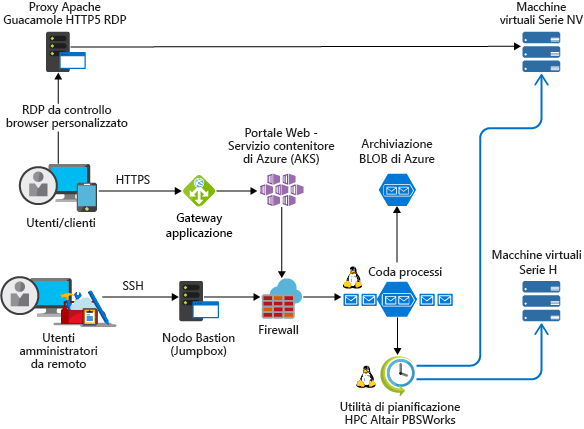

<!-- markdownlint-disable MD033 -->
<!-- markdownlint-disable MD026 -->

# HPC (High Performance Computing) in Azure

## Introduzione all'HPC

<!-- markdownlint-disable MD034 -->

> [!VIDEO https://www.youtube.com/embed/rKURT32faJk]

<!-- markdownlint-enable MD034 -->

L'High Performance Computing (HPC), anche detto "Big Compute", prevede l'uso di un numero elevato di computer basati su CPU o GPU per risolvere attività matematiche complesse.

In molti settori ci si avvale dell'HPC per risolvere i problemi più difficili,  con carichi di lavoro come:

- Genomica
- Simulazioni di petrolio e gas
- Finanza
- Progettazione di semiconduttori
- Engineering
- Modellazione meteo

### Quali sono le differenze dell'HPC sul cloud?

Una delle principali differenze tra i sistemi HPC locali e quelli nel cloud è la possibilità di aggiungere e rimuovere dinamicamente le risorse in base alle esigenze.  La scalabilità dinamica rimuove il collo di bottiglia della capacità di calcolo e consente invece ai clienti di dimensionare correttamente l'infrastruttura per i loro requisiti.

Gli articoli seguenti contengono altri dettagli sulla scalabilità dinamica.

- [Stile di architettura Big Compute](/azure/architecture/guide/architecture-styles/big-compute?context=/azure/architecture/topics/high-performance-computing/context/hpc-context)
- [Procedure consigliate per la scalabilità automatica](/azure/architecture/best-practices/auto-scaling?context=/azure/architecture/topics/high-performance-computing/context/hpc-context)

## Elenco di controllo per l'implementazione

Se si intende implementare una soluzione HPC in Azure, assicurarsi di consultare gli argomenti seguenti:

<!-- markdownlint-disable MD032 -->

> [!div class="checklist"]
> - Scegliere l'[architettura](#infrastructure) appropriata in base ai requisiti
> - Identificare le opzioni di [calcolo](#compute) appropriate per uno specifico carico di lavoro
> - Identificare la soluzione di [archiviazione](#storage) che soddisfi specifiche esigenze
> - Decidere come [gestire](#management) tutte le risorse
> - Ottimizzare l'[applicazione](#hpc-applications) per il cloud
> - [Proteggere](#security) l'infrastruttura

<!-- markdownlint-enable MD032 -->

## Infrastruttura

Per creare un sistema HPC, sono necessari diversi componenti dell'infrastruttura.  I componenti sottostanti sono le risorse di calcolo, archiviazione e rete, indipendentemente da come si sceglie di gestire i carichi di lavoro HPC.

### Esempi di architetture HPC

È possibile progettare e implementare l'architettura HPC in vari modi in Azure.  Le applicazioni HPC possono offrire scalabilità fino a migliaia di core di calcolo, estendere i cluster locali o venire eseguite come soluzioni cloud native al 100%.

Gli scenari seguenti descrivono alcuni modi comuni in cui vengono sviluppate le soluzioni HPC.

<ul class="columns is-multiline has-margin-left-none has-margin-bottom-none has-padding-top-medium">
    <li class="column is-one-third has-padding-top-small-mobile has-padding-bottom-small">
        <a class="is-undecorated is-full-height is-block"
            href="/azure/architecture/example-scenario/apps/hpc-saas?context=/azure/architecture/topics/high-performance-computing/context/hpc-context">
            <article class="card has-outline-hover is-relative is-fullheight">
                    <figure class="image has-margin-right-none has-margin-left-none has-margin-top-none has-margin-bottom-none">
                        
                    </figure>
                

                    

                        <h3 class="is-size-4 has-margin-top-none has-margin-bottom-none has-text-primary">Servizi CAE (Computer-Aided Engineering) in Azure</h3>
                    

                    

                        
Fornire una piattaforma software come un servizio (SaaS) per CAE (Computer-Aided Engineering) in Azure.

                    

                

            </article>
        </a>
    </li>
    <li class="column is-one-third has-padding-top-small-mobile has-padding-bottom-small">
        <a class="is-undecorated is-full-height is-block"
            href="/azure/architecture/example-scenario/infrastructure/hpc-cfd?context=/azure/architecture/topics/high-performance-computing/context/hpc-context">
            <article class="card has-outline-hover is-relative is-fullheight">
                    <figure class="image has-margin-right-none has-margin-left-none has-margin-top-none has-margin-bottom-none">
                        
                    </figure>
                

                    

                        <h3 class="is-size-4 has-margin-top-none has-margin-bottom-none has-text-primary">Simulazioni di fluidodinamica computazionale in Azure</h3>
                    

                    

                        
Eseguire simulazioni di fluidodinamica computazionale (CFD) in Azure.

                    

                

            </article>
        </a>
    </li>
    <li class="column is-one-third has-padding-top-small-mobile has-padding-bottom-small">
        <a class="is-undecorated is-full-height is-block"
            href="/azure/architecture/example-scenario/infrastructure/video-rendering?context=/azure/architecture/topics/high-performance-computing/context/hpc-context">
            <article class="card has-outline-hover is-relative is-fullheight">
                    <figure class="image has-margin-right-none has-margin-left-none has-margin-top-none has-margin-bottom-none">
                        
                    </figure>
                

                    

                        <h3 class="is-size-4 has-margin-top-none has-margin-bottom-none has-text-primary">Rendering di video 3D in Azure</h3>
                    

                    

                        
Eseguire carichi di lavoro HPC nativi in Azure con il servizio Azure Batch

                    

                

            </article>
        </a>
    </li>
</ul>

### Calcolo

Azure offre un'ampia gamma di dimensioni ottimizzate per i carichi di lavoro a uso intensivo di CPU e GPU.

#### Macchine virtuali basate su CPU

- [Macchine virtuali di Linux](/azure/virtual-machines/linux/sizes-hpc?context=/azure/architecture/topics/high-performance-computing/context/hpc-context)
- [Macchine virtuali di Windows](/azure/virtual-machines/windows/sizes-hpc?context=/azure/architecture/topics/high-performance-computing/context/hpc-context)
  
#### Macchine virtuali abilitate per GPU

Le VM serie N sono dotate di GPU con tecnologia NVIDIA progettate per applicazioni a elevato utilizzo di calcolo o di grafica, inclusi apprendimento e visualizzazione basati sull'intelligenza artificiale (AI).

- [Macchine virtuali di Linux](/azure/virtual-machines/linux/sizes-gpu?context=/azure/architecture/topics/high-performance-computing/context/hpc-context)
- [Macchine virtuali di Windows](/azure/virtual-machines/windows/sizes-gpu?context=/azure/architecture/topics/high-performance-computing/context/hpc-context)

### Archiviazione

I carichi di lavoro Batch e HPC su larga scala hanno richieste di archiviazione dati e di accesso che superano le capacità dei tradizionali file system cloud.  Per gestire le esigenze di velocità e capacità delle applicazioni HPC in Azure, sono disponibili numerose soluzioni

- [Avere vFXT](https://azure.microsoft.com/services/storage/avere-vfxt/) per l'archiviazione dei dati più veloce e accessibile per l'HPC nei dispositivi perimetrali
- [BeeGFS](https://azure.microsoft.com/resources/implement-glusterfs-on-azure/)
- [Macchine virtuali ottimizzate per l'archiviazione](/azure/virtual-machines/windows/sizes-storage?context=/azure/architecture/topics/high-performance-computing/context/hpc-context)
- [Archivio BLOB, tabelle e code](/azure/storage/storage-introduction?context=/azure/architecture/topics/high-performance-computing/context/hpc-context)
- [Archiviazione file SMB di Azure](/azure/storage/files/storage-files-introduction?context=/azure/architecture/topics/high-performance-computing/context/hpc-context)
- [Intel Cloud Edition Lustre](https://azuremarketplace.microsoft.com/marketplace/apps/intel.intel-cloud-edition-gs)

Per altre informazioni di confronto tra Lustre, GlusterFS e BeeGFS in Azure, vedere l'[eBook sui file system paralleli in Azure](https://blogs.msdn.microsoft.com/azurecat/2018/06/11/azurecat-ebook-parallel-virtual-file-systems-on-microsoft-azure/)

### Rete

Le VM H16r, H16mr, A8, e A9 possono connettersi a una rete RDMA back-end a velocità effettiva elevata. Questa rete può migliorare le prestazioni delle applicazioni parallele strettamente associate in esecuzione in Microsoft MPI o Intel MPI.

- [Istanze con supporto per RDMA](/azure/virtual-machines/windows/sizes-hpc?context=/azure/architecture/topics/high-performance-computing/context/hpc-context#rdma-capable-instances)
- [Rete virtuale](/azure/virtual-network/virtual-networks-overview?context=/azure/architecture/topics/high-performance-computing/context/hpc-context)
- [ExpressRoute](/azure/expressroute/expressroute-introduction?context=/azure/architecture/topics/high-performance-computing/context/hpc-context)

## Gestione

### Procedure manuali

La creazione di un sistema HPC da zero in Azure offre una notevole flessibilità, ma può rivelarsi problematica in termini di manutenzione.  

1. Configurare l'ambiente cluster nelle macchine virtuali di Azure o nel [set di scalabilità di macchine virtuali](/azure/virtual-machine-scale-sets/overview?context=/azure/architecture/topics/high-performance-computing/context/hpc-context).
2. Usare i modelli di Azure Resource Manager per distribuire [gestori di carichi di lavoro](#workload-managers), infrastruttura e [applicazioni](#hpc-applications).
3. Scegliere [dimensioni delle VM](#compute) basate su CPU e GPU che includano hardware specializzato e connessioni di rete specifiche per carichi di lavoro MPI o GPU.
4. Aggiungere [archiviazione ad alte prestazioni](#storage) per carichi di lavoro con elevato numero di operazioni di I/O.

### Burst ibrido e nel cloud

Se si ha già un sistema HPC locale che si vuole connettere ad Azure, sono disponibili numerose risorse per iniziare.

Prima di tutto, vedere l'articolo sulle [opzioni per connettere una rete locale ad Azure](/azure/architecture/reference-architectures/hybrid-networking/?context=/azure/architecture/topics/high-performance-computing/context/hpc-context) nella documentazione.  Poi, è consigliabile consultare informazioni su queste opzioni di connettività:

<ul class="columns is-multiline has-margin-left-none has-margin-bottom-none has-padding-top-medium">
    <li class="column is-one-third has-padding-top-small-mobile has-padding-bottom-small">
        <a class="is-undecorated is-full-height is-block"
            href="/azure/architecture/reference-architectures/hybrid-networking/vpn?context=/azure/architecture/topics/high-performance-computing/context/hpc-context">
            <article class="card has-outline-hover is-relative is-fullheight">
                    <figure class="image has-margin-right-none has-margin-left-none has-margin-top-none has-margin-bottom-none">
                        
                    </figure>
                

                    

                        <h3 class="is-size-4 has-margin-top-none has-margin-bottom-none has-text-primary">Connettere una rete locale ad Azure tramite un gateway VPN</h3>
                    

                    

                        
Questa architettura di riferimento mostra come estendere una rete locale ad Azure tramite una rete privata virtuale (VPN) da sito a sito.

                    

                

            </article>
        </a>
    </li>
    <li class="column is-one-third has-padding-top-small-mobile has-padding-bottom-small">
        <a class="is-undecorated is-full-height is-block"
            href="/azure/architecture/reference-architectures/hybrid-networking/expressroute?context=/azure/architecture/topics/high-performance-computing/context/hpc-context">
            <article class="card has-outline-hover is-relative is-fullheight">
                    <figure class="image has-margin-right-none has-margin-left-none has-margin-top-none has-margin-bottom-none">
                        
                    </figure>
                

                    

                        <h3 class="is-size-4 has-margin-top-none has-margin-bottom-none has-text-primary">Connettere una rete locale ad Azure tramite ExpressRoute</h3>
                    

                    

                        
Le connessioni ExpressRoute usano una connessione privata dedicata tramite un provider di connettività di terze parti. La connessione privata estende la rete locale in Azure.

                    

                

            </article>
        </a>
    </li>
    <li class="column is-one-third has-padding-top-small-mobile has-padding-bottom-small">
        <a class="is-undecorated is-full-height is-block"
            href="/azure/architecture/reference-architectures/hybrid-networking/expressroute-vpn-failover?context=/azure/architecture/topics/high-performance-computing/context/hpc-context">
            <article class="card has-outline-hover is-relative is-fullheight">
                    <figure class="image has-margin-right-none has-margin-left-none has-margin-top-none has-margin-bottom-none">
                        
                    </figure>
                

                    

                        <h3 class="is-size-4 has-margin-top-none has-margin-bottom-none has-text-primary">Connettere una rete locale ad Azure tramite ExpressRoute con failover VPN</h3>
                    

                    

                        
Implementare un'architettura di rete sicura da sito a sito e a disponibilità elevata, che si estende su una rete virtuale di Azure e su una rete locale connessa tramite ExpressRoute con failover del gateway VPN.

                    

                

            </article>
        </a>
    </li>
</ul>

Dopo aver stabilito la connettività di rete, è possibile iniziare a usare le risorse di calcolo del cloud su richiesta con le funzionalità burst dell'attuale [soluzione di gestione dei carichi di lavoro](#workload-managers).

### Soluzioni del Marketplace

In [Azure Marketplace](https://azuremarketplace.microsoft.com/marketplace/) sono disponibili numerose offerte di soluzioni di gestione dei carichi di lavoro.

- [HPC basato su RogueWave CentOS](https://azuremarketplace.microsoft.com/marketplace/apps/RogueWave.CentOSbased73HPC?tab=Overview)
- [SUSE Linux Enterprise Server per HPC](https://azure.microsoft.com/marketplace/partners/suse/suselinuxenterpriseserver12optimizedforhighperformancecompute/)
- [TIBCO Grid Server Engine](https://azuremarketplace.microsoft.com/marketplace/apps/tibco-software.gridserverlinuxengine?tab=Overview)
- [VM per l'analisi scientifica dei dati di Azure per Windows e Linux](/azure/machine-learning/data-science-virtual-machine/overview?context=/azure/architecture/topics/high-performance-computing/context/hpc-context)
- [D3View](https://azuremarketplace.microsoft.com/marketplace/apps/xfinityinc.d3view-v5?tab=Overview)
- [UberCloud](https://azure.microsoft.com/search/marketplace/?q=ubercloud)

### Azure Batch

[Azure Batch](/azure/batch/batch-technical-overview?context=/azure/architecture/topics/high-performance-computing/context/hpc-context) è un servizio di piattaforma per eseguire in modo efficiente applicazioni parallele e HPC (High Performance Computing) su larga scala nel cloud. Azure Batch pianifica l'esecuzione del lavoro a elevato utilizzo di calcolo su un pool di macchine virtuali gestito e può ridimensionare automaticamente le risorse di calcolo in base alle esigenze dei processi.

I fornitori o sviluppatori di SaaS possono usare gli strumenti e gli SDK di Batch per integrare le applicazioni HPC o i carichi di lavoro dei contenitori con Azure, gestire temporaneamente i dati in Azure e creare pipeline per l'esecuzione di processi.

### Azure CycleCloud

[Azure CycleCloud](/azure/cyclecloud/?context=/azure/architecture/topics/high-performance-computing/context/hpc-context) offre il modo più semplice per gestire carichi di lavoro HPC con qualsiasi utilità di pianificazione (come Slurm, Grid Engine, HPC Pack, HTCondor, LSF, PBS Pro o Symphony) in Azure

CycleCloud consente di:

- Distribuire cluster completi e altre risorse, tra cui un'utilità di pianificazione, VM di calcolo, risorse di archiviazione, risorse di rete e cache
- Orchestrare processi, dati e flussi di lavoro sul cloud
- Offrire agli amministratori il controllo completo su quali utenti possono eseguire i processi, dove e a quale costo
- Personalizzare e ottimizzare i cluster tramite funzionalità avanzate per criteri e governance, tra cui i controlli per i costi, l'integrazione con Active Directory, il monitoraggio e la creazione di report
- Usare l'utilità di pianificazione di processi e le applicazioni correnti senza modifiche
- Sfruttare i vantaggi della scalabilità automatica predefinita e di architetture di riferimento convalidate per una vasta gamma di carichi di lavoro HPC e di settori

### Gestori del carico di lavoro

Di seguito sono riportati esempi di cluster e gestori del carico di lavoro eseguibili nell'infrastruttura di Azure. Creare cluster autonomi nelle macchine virtuali di Azure oppure eseguire il potenziamento in macchine virtuali di Azure da un cluster locale.

- [Alces Flight Compute](https://azuremarketplace.microsoft.com/marketplace/apps/alces-flight-limited.alces-flight-compute-solo?tab=Overview)
- [TIBCO DataSynapse GridServer](https://azure.microsoft.com/blog/tibco-datasynapse-comes-to-the-azure-marketplace/)
- [Bright Cluster Manager](http://www.brightcomputing.com/technology-partners/microsoft)
- [IBM Spectrum Symphony e Symphony LSF](https://azure.microsoft.com/blog/ibm-and-microsoft-azure-support-spectrum-symphony-and-spectrum-lsf/)
- [PBS Pro](http://pbspro.org)
- [Altair](http://www.altair.com/)
- [Rescale](https://www.rescale.com/azure/)
- [Microsoft HPC Pack](https://technet.microsoft.com/library/mt744885.aspx)
  - [HPC Pack per Windows](/azure/virtual-machines/windows/hpcpack-cluster-options?context=/azure/architecture/topics/high-performance-computing/context/hpc-context)
  - [HPC Pack per Linux](/azure/virtual-machines/linux/hpcpack-cluster-options?context=/azure/architecture/topics/high-performance-computing/context/hpc-context)

#### Contenitori

È anche possibile usare i contenitori per gestire alcuni carichi di lavoro HPC.  Servizi come Azure Kubernetes (AKS) semplificano la distribuzione di un cluster Kubernetes gestito in Azure.

- [Servizio Azure Kubernetes](/azure/aks/intro-kubernetes?context=/azure/architecture/topics/high-performance-computing/context/hpc-context)
- [Registro Container](/azure/container-registry/container-registry-intro?context=/azure/architecture/topics/high-performance-computing/context/hpc-context)

## Gestione dei costi

I costi dell'HPC in Azure possono essere gestiti in vari modi.  Assicurarsi di aver esaminato le [opzioni di acquisto di Azure](https://azure.microsoft.com/pricing/purchase-options/) per trovare il metodo più appropriato per la propria organizzazione.

L'uso di [macchine virtuali con priorità bassa](/azure/virtual-machine-scale-sets/virtual-machine-scale-sets-use-low-priority?context=/azure/architecture/topics/high-performance-computing/context/hpc-context) consente di sfruttare la capacità inutilizzata con un notevole risparmio sui costi.

## Security

Per una panoramica delle procedure consigliate per la sicurezza, vedere la [documentazione sulla sicurezza di Azure](/azure/security/azure-security?context=/azure/architecture/topics/high-performance-computing/context/hpc-context).  

Oltre alle configurazioni di rete disponibili nella sezione sul [burst nel cloud](#hybrid-and-cloud-bursting), è possibile implementare una configurazione hub-spoke per isolare le risorse di calcolo:

<ul class="columns is-multiline has-margin-left-none has-margin-bottom-none has-padding-top-medium">
    <li class="column is-one-third has-padding-top-small-mobile has-padding-bottom-small">
        <a class="is-undecorated is-full-height is-block"
            href="/azure/architecture/reference-architectures/hybrid-networking/hub-spoke?context=/azure/architecture/topics/high-performance-computing/context/hpc-context">
            <article class="card has-outline-hover is-relative is-fullheight">
                    <figure class="image has-margin-right-none has-margin-left-none has-margin-top-none has-margin-bottom-none">
                        
                    </figure>
                

                    

                        <h3 class="is-size-4 has-margin-top-none has-margin-bottom-none has-text-primary">Implementare una topologia di rete hub-spoke in Azure</h3>
                    

                    

                        
L'hub è una rete virtuale in Azure che funge da punto centrale di connettività alla rete locale. Gli spoke sono le reti virtuali peer con l'hub, e possono essere usati per isolare i carichi di lavoro.

                    

                

            </article>
        </a>
    </li>
    <li class="column is-one-third has-padding-top-small-mobile has-padding-bottom-small">
        <a class="is-undecorated is-full-height is-block"
            href="/azure/architecture/reference-architectures/hybrid-networking/shared-services?context=/azure/architecture/topics/high-performance-computing/context/hpc-context">
            <article class="card has-outline-hover is-relative is-fullheight">
                    <figure class="image has-margin-right-none has-margin-left-none has-margin-top-none has-margin-bottom-none">
                        
                    </figure>
                

                    

                        <h3 class="is-size-4 has-margin-top-none has-margin-bottom-none has-text-primary">Implementare una topologia di rete hub-spoke con servizi condivisi in Azure</h3>
                    

                    

                        
Questa architettura di riferimento, basata sull'architettura di riferimento hub-spoke, include nell'hub servizi condivisi che potranno essere utilizzati da tutti gli spoke.

                    

                

            </article>
        </a>
    </li>
</ul>

## Applicazioni HPC

Eseguire applicazioni HPC personalizzate o commerciali in Azure. Per alcuni esempi in questa sezione è disponibile un benchmark per una scalabilità efficiente con altre VM o core di calcolo. Visitare [Azure Marketplace](https://azuremarketplace.microsoft.com/marketplace) per le soluzioni pronte per la distribuzione.

> [!NOTE]
> Verificare le licenze del fornitore di qualsiasi applicazione commerciale o altre restrizioni per l'esecuzione nel cloud. Non tutti i fornitori offrono licenze con pagamento in base al consumo. Può essere necessario un server di gestione licenze nel cloud per la soluzione o connettersi a un server licenze locale.

### Applicazioni tecniche

- [Altair RADIOSS](https://azure.microsoft.com/blog/availability-of-altair-radioss-rdma-on-microsoft-azure/)
- [ANSYS CFD](https://azure.microsoft.com/blog/ansys-cfd-and-microsoft-azure-perform-the-best-hpc-scalability-in-the-cloud/)
- [MATLAB Distributed Computing Server](/azure/virtual-machines/windows/matlab-mdcs-cluster?context=/azure/architecture/topics/high-performance-computing/context/hpc-context)
- [StarCCM+](https://blogs.msdn.microsoft.com/azurecat/2017/07/07/run-star-ccm-in-an-azure-hpc-cluster/)
- [OpenFOAM](https://simulation.azure.com/casestudies/Team-182-ABB-UC-Final.pdf)

### Grafica e rendering

- [Autodesk Maya, 3ds Max e Arnold](/azure/batch/batch-rendering-service?context=/azure/architecture/topics/high-performance-computing/context/hpc-context) in Azure Batch

### AI e apprendimento avanzato

- [Microsoft Cognitive Toolkit](/cognitive-toolkit/cntk-on-azure)
- [Macchina virtuale per l'apprendimento avanzato](https://azuremarketplace.microsoft.com/marketplace/apps/microsoft-ads.dsvm-deep-learning)
- [Soluzioni di Batch Shipyard per l'apprendimento avanzato](https://github.com/Azure/batch-shipyard/tree/master/recipes#deeplearning)

### Provider di MPI

- [Microsoft MPI](/message-passing-interface/microsoft-mpi)

## Visualizzazione remota

<ul class="columns is-multiline has-margin-left-none has-margin-bottom-none has-padding-top-medium">
    <li class="column is-one-third has-padding-top-small-mobile has-padding-bottom-small">
        <a class="is-undecorated is-full-height is-block"
            href="/azure/architecture/example-scenario/infrastructure/linux-vdi-citrix?context=/azure/architecture/topics/high-performance-computing/context/hpc-context">
            <article class="card has-outline-hover is-relative is-fullheight">
                    <figure class="image has-margin-right-none has-margin-left-none has-margin-top-none has-margin-bottom-none">
                        
                    </figure>
                

                    

                        <h3 class="is-size-4 has-margin-top-none has-margin-bottom-none has-text-primary">Desktop virtuali Linux con Citrix</h3>
                    

                    

                        
Creare un ambiente VDI per i desktop Linux con Citrix in Azure.

                    

                

            </article>
        </a>
    </li>
</ul>

## Benchmark delle prestazioni

- [Benchmark delle risorse di calcolo](/azure/virtual-machines/windows/compute-benchmark-scores?context=/azure/architecture/topics/high-performance-computing/context/hpc-context)

## Casi di successo dei clienti

Numerosi clienti hanno usato con successo Azure per i loro carichi di lavoro HPC.  Di seguito sono riportati alcuni case study dei clienti:

- [ANEO](https://customers.microsoft.com/story/it-provider-finds-highly-scalable-cloud-based-hpc-redu)
- [AXA Global P&amp;C](https://customers.microsoft.com/story/axa-global-p-and-c)
- [Axioma](https://customers.microsoft.com/story/axioma-delivers-fintechs-first-born-in-the-cloud-multi-asset-class-enterprise-risk-solution)
- [d3View](https://customers.microsoft.com/story/big-data-solution-provider-adopts-new-cloud-gains-thou)
- [EFS](https://customers.microsoft.com/story/efs-professionalservices-azure)
- [Hymans Robertson](https://customers.microsoft.com/story/hymans-robertson)
- [MetLife](https://enterprise.microsoft.com/customer-story/industries/insurance/metlife/)
- [Microsoft Research](https://customers.microsoft.com/doclink/fast-lmm-and-windows-azure-put-genetics-research-on-fa)
- [Milliman](https://customers.microsoft.com/story/actuarial-firm-works-to-transform-insurance-industry-w)
- [Mitsubishi UFJ Securities International](https://customers.microsoft.com/story/powering-risk-compute-grids-in-the-cloud)
- [NeuroInitiative](https://customers.microsoft.com/story/neuroinitiative-health-provider-azure)
- [Schlumberger](https://azure.microsoft.com/blog/big-compute-for-large-engineering-simulations)
- [Towers Watson](https://customers.microsoft.com/story/insurance-tech-provider-delivers-disruptive-solutions)

## Altre informazioni importanti

- Assicurarsi che la [quota di CPU virtuali](/azure/virtual-machines/linux/quotas?context=/azure/architecture/topics/high-performance-computing/context/hpc-context) sia stata aumentata prima di provare a eseguire carichi di lavoro su larga scala.

## Passaggi successivi

Per gli annunci più recenti, vedere:

- [Blog del team Microsoft HPC e Batch](http://blogs.technet.com/b/windowshpc/)
- Visitare il [blog di Azure](https://azure.microsoft.com/blog/tag/hpc/).

### Esempi di Microsoft Batch

Queste esercitazioni forniscono informazioni dettagliate sull'esecuzione di applicazioni in Microsoft Batch

- [Introduzione allo sviluppo con Batch](/azure/batch/quick-run-dotnet?context=/azure/architecture/topics/high-performance-computing/context/hpc-context)
- [Usare gli esempi di codice per Azure Batch](https://github.com/Azure/azure-batch-samples)
- [Usare le macchine virtuali con priorità bassa in Batch](/azure/batch/batch-low-pri-vms?context=/azure/architecture/topics/high-performance-computing/context/hpc-context)
- [Eseguire carichi di lavoro HPC inclusi in contenitori con Batch Shipyard](https://github.com/Azure/batch-shipyard)
- [Eseguire carichi di lavoro R paralleli in Batch](https://github.com/Azure/doAzureParallel)
- [Eseguire processi Spark su richiesta in Batch](https://github.com/Azure/aztk)
- [Usare VM a elevato utilizzo di calcolo in pool di Batch](/azure/batch/batch-pool-compute-intensive-sizes?context=/azure/architecture/topics/high-performance-computing/context/hpc-context)